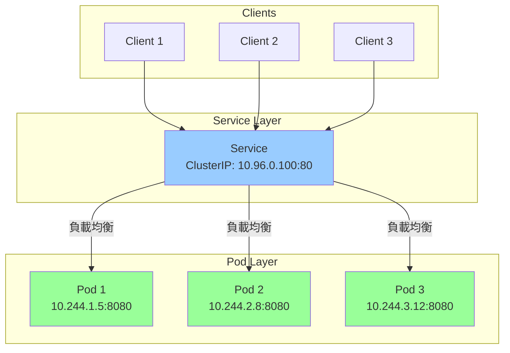
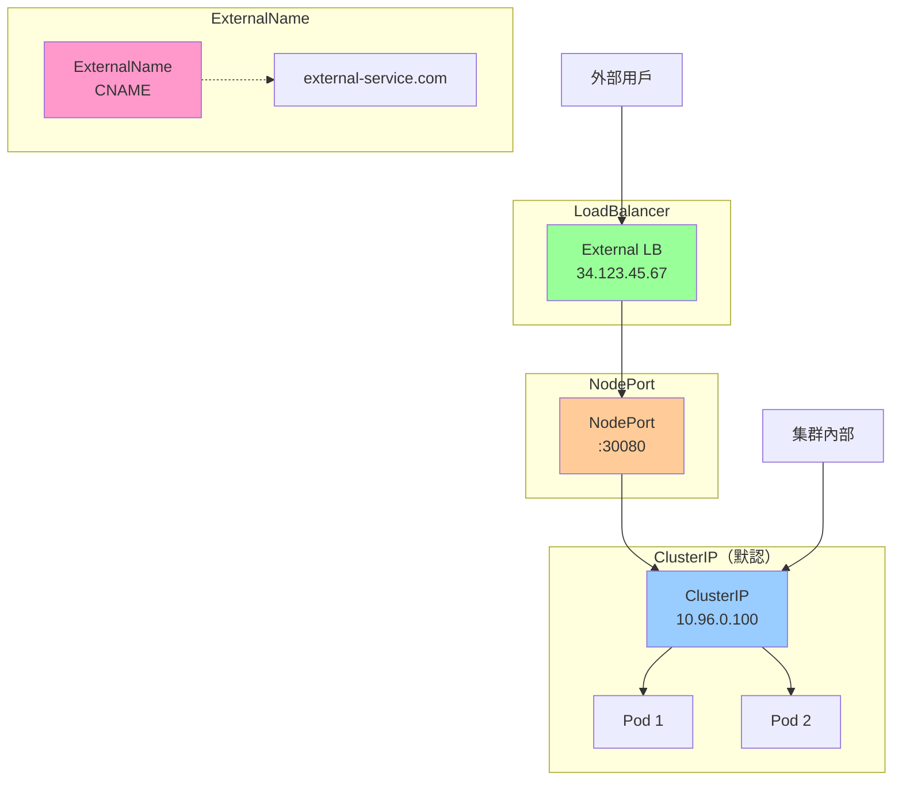
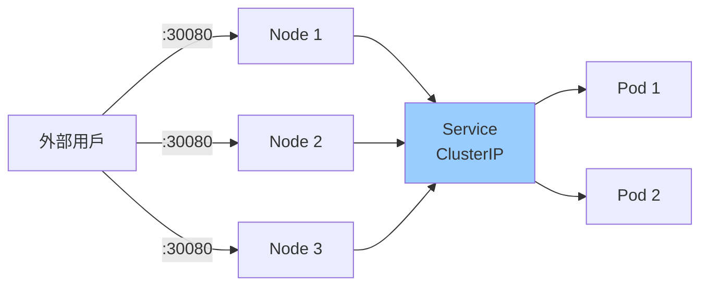
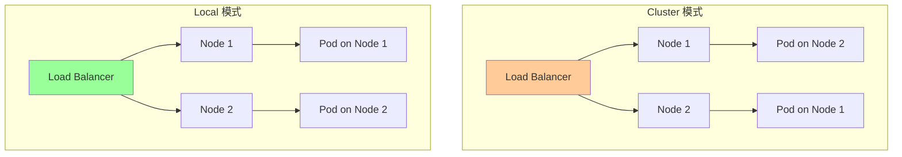
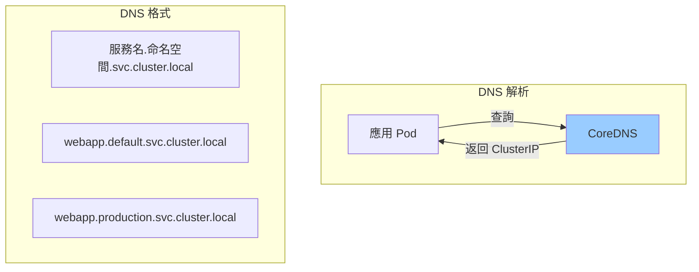
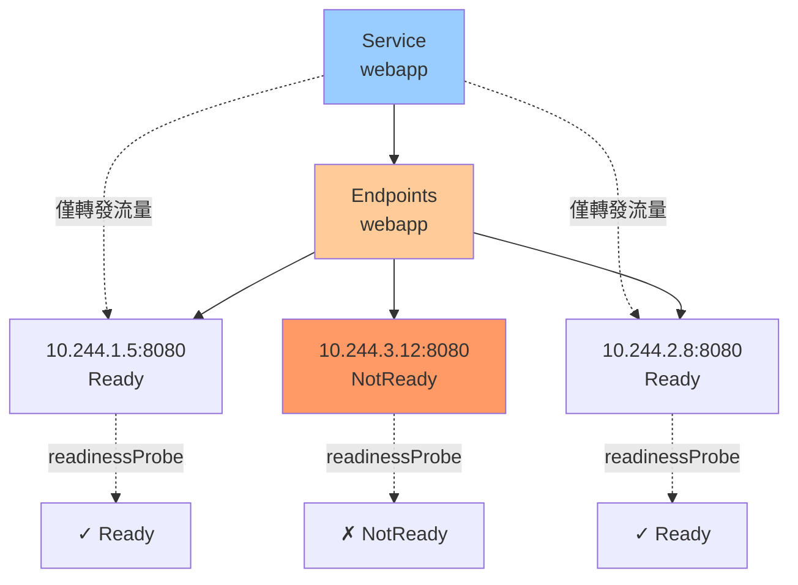
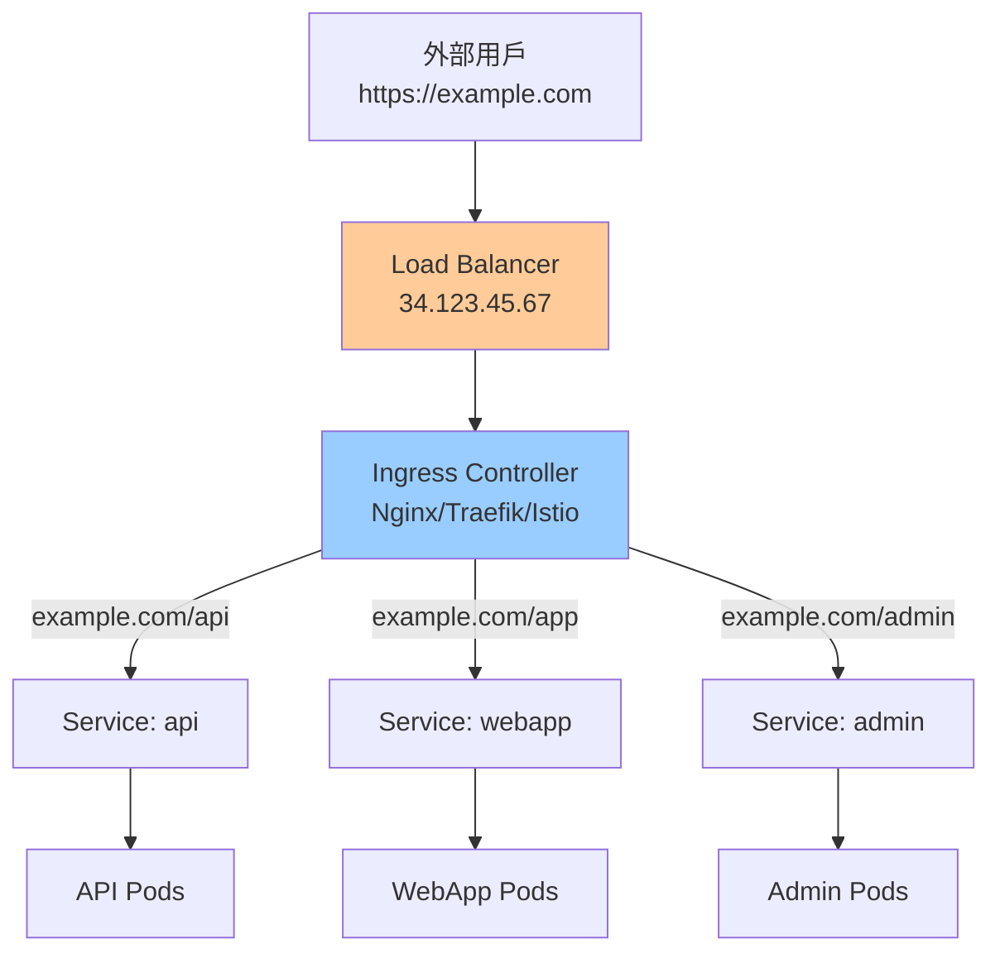
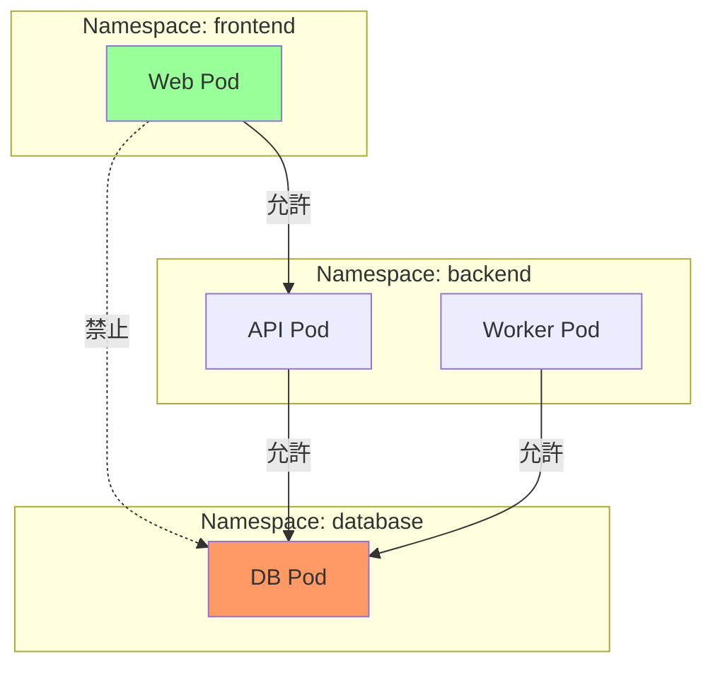

# 05-網路資源詳解

> 深入掌握 Kubernetes 網路資源的完整配置與使用

---

## 📚 本章目標

- 深入理解 Service 的四種類型與使用場景
- 掌握 Ingress 配置與 TLS 證書管理
- 學會使用 NetworkPolicy 實現網路隔離
- 理解 Endpoints 與 EndpointSlices 工作原理
- 掌握服務發現機制（DNS、環境變量）

---

## 1. Service 深度解析

### 1.1 Service 是什麼

Service 提供穩定的網絡訪問入口，將流量負載均衡到一組 Pod。



**為什麼需要 Service？**
- ✅ Pod IP 會變化（重啟、擴縮容）
- ✅ 需要穩定的訪問入口
- ✅ 需要負載均衡
- ✅ 需要服務發現

---

### 1.2 Service 類型總覽



| 類型 | 用途 | 訪問方式 | 使用場景 |
|-----|------|---------|---------|
| **ClusterIP** | 集群內部訪問 | ClusterIP:Port | 微服務間通信 |
| **NodePort** | 通過節點端口訪問 | NodeIP:NodePort | 開發測試 |
| **LoadBalancer** | 雲端負載均衡器 | 外部 IP | 生產環境對外服務 |
| **ExternalName** | 外部服務映射 | DNS CNAME | 訪問外部服務 |
| **Headless** | 不分配 ClusterIP | Pod DNS | StatefulSet |

---

### 1.3 ClusterIP Service（默認類型）

```yaml
apiVersion: v1
kind: Service
metadata:
  name: webapp
  namespace: default
  labels:
    app: webapp
  annotations:
    prometheus.io/scrape: "true"
    prometheus.io/port: "9090"

spec:
  type: ClusterIP
  
  # 選擇器（匹配 Pod labels）
  selector:
    app: webapp
    tier: frontend
  
  # 端口定義
  ports:
  - name: http
    protocol: TCP
    port: 80           # Service 端口
    targetPort: 8080   # Pod 端口（可以是數字或名稱）
  
  - name: metrics
    protocol: TCP
    port: 9090
    targetPort: metrics
  
  # 會話親和性（可選）
  sessionAffinity: ClientIP
  sessionAffinityConfig:
    clientIP:
      timeoutSeconds: 3600
  
  # IP 協議族
  ipFamilies:
  - IPv4
  ipFamilyPolicy: SingleStack    # SingleStack, PreferDualStack, RequireDualStack
```

**使用示例：**

```bash
# 查看 Service
kubectl get svc webapp
kubectl describe svc webapp

# 集群內訪問
curl http://webapp.default.svc.cluster.local
curl http://webapp:80

# 查看 Endpoints
kubectl get endpoints webapp
```

---

### 1.4 NodePort Service

```yaml
apiVersion: v1
kind: Service
metadata:
  name: webapp-nodeport
spec:
  type: NodePort
  
  selector:
    app: webapp
  
  ports:
  - name: http
    protocol: TCP
    port: 80
    targetPort: 8080
    nodePort: 30080    # 可選，範圍 30000-32767
```

**訪問方式：**

```bash
# 通過任意節點 IP 訪問
curl http://<node-ip>:30080
curl http://192.168.1.10:30080
curl http://192.168.1.11:30080

# 查看 NodePort
kubectl get svc webapp-nodeport
```



**特點：**
- ✅ 簡單，無需額外配置
- ✅ 任意節點都可訪問
- ❌ 端口範圍受限（30000-32767）
- ❌ 需要管理節點 IP
- ❌ 不適合生產環境

---

### 1.5 LoadBalancer Service

```yaml
apiVersion: v1
kind: Service
metadata:
  name: webapp-lb
  annotations:
    # AWS
    service.beta.kubernetes.io/aws-load-balancer-type: "nlb"
    service.beta.kubernetes.io/aws-load-balancer-cross-zone-load-balancing-enabled: "true"
    
    # GCP
    cloud.google.com/load-balancer-type: "Internal"
    
    # Azure
    service.beta.kubernetes.io/azure-load-balancer-internal: "true"

spec:
  type: LoadBalancer
  
  selector:
    app: webapp
  
  ports:
  - name: http
    protocol: TCP
    port: 80
    targetPort: 8080
  
  # 外部流量策略
  externalTrafficPolicy: Local    # Cluster 或 Local
  
  # 允許的源 IP 範圍
  loadBalancerSourceRanges:
  - 10.0.0.0/8
  - 192.168.0.0/16
```

**externalTrafficPolicy 對比：**

| 策略 | 優點 | 缺點 |
|-----|------|------|
| **Cluster**（默認） | 負載均衡更好 | 會做 SNAT，丟失源 IP |
| **Local** | 保留源 IP，減少跳躍 | 負載可能不均 |



**查看外部 IP：**

```bash
kubectl get svc webapp-lb
# NAME        TYPE           CLUSTER-IP      EXTERNAL-IP     PORT(S)        AGE
# webapp-lb   LoadBalancer   10.96.0.100     34.123.45.67    80:30123/TCP   5m

curl http://34.123.45.67
```

---

### 1.6 ExternalName Service

```yaml
apiVersion: v1
kind: Service
metadata:
  name: external-db
spec:
  type: ExternalName
  externalName: database.example.com
  ports:
  - port: 5432
```

**用途：**
- 將外部服務映射到集群內部
- 方便服務遷移（先用 ExternalName，再遷移到集群內）

```bash
# 應用程序可以使用集群內的 DNS 名稱
DB_HOST=external-db.default.svc.cluster.local

# 實際會解析到 database.example.com
```

---

### 1.7 Headless Service

```yaml
apiVersion: v1
kind: Service
metadata:
  name: mysql
spec:
  clusterIP: None    # 不分配 ClusterIP
  
  selector:
    app: mysql
  
  ports:
  - port: 3306
    targetPort: 3306
```

**特點：**
- ✅ 不分配 ClusterIP
- ✅ DNS 直接返回 Pod IP 列表
- ✅ 用於 StatefulSet

```bash
# DNS 查詢返回所有 Pod IP
nslookup mysql.default.svc.cluster.local

# 返回：
# Name:    mysql.default.svc.cluster.local
# Address: 10.244.1.5
# Address: 10.244.2.8
# Address: 10.244.3.12

# StatefulSet Pod 的穩定 DNS
mysql-0.mysql.default.svc.cluster.local
mysql-1.mysql.default.svc.cluster.local
mysql-2.mysql.default.svc.cluster.local
```

---

### 1.8 Service 完整配置示例

```yaml
apiVersion: v1
kind: Service
metadata:
  name: webapp-service
  namespace: production
  labels:
    app: webapp
    tier: frontend
  annotations:
    service.beta.kubernetes.io/aws-load-balancer-type: "nlb"

spec:
  type: LoadBalancer
  
  selector:
    app: webapp
    tier: frontend
  
  ports:
  - name: http
    protocol: TCP
    port: 80
    targetPort: http
  
  - name: https
    protocol: TCP
    port: 443
    targetPort: https
  
  - name: metrics
    protocol: TCP
    port: 9090
    targetPort: metrics
  
  sessionAffinity: ClientIP
  sessionAffinityConfig:
    clientIP:
      timeoutSeconds: 10800
  
  externalTrafficPolicy: Local
  
  loadBalancerSourceRanges:
  - 10.0.0.0/8
  - 172.16.0.0/12
  - 192.168.0.0/16
  
  ipFamilies:
  - IPv4
  ipFamilyPolicy: SingleStack
```

---

## 2. 服務發現機制

### 2.1 DNS 服務發現（推薦）

Kubernetes 自動為每個 Service 創建 DNS 記錄。



**DNS 格式：**

```bash
# 完整格式
<service-name>.<namespace>.svc.cluster.local

# 同命名空間可簡寫
<service-name>

# 跨命名空間
<service-name>.<namespace>
```

**示例：**

```yaml
# Pod 配置
env:
- name: DB_HOST
  value: "postgres.database.svc.cluster.local"

- name: REDIS_HOST
  value: "redis"    # 同命名空間簡寫

- name: API_HOST
  value: "api.production.svc.cluster.local"
```

**DNS 記錄類型：**

| Service 類型 | DNS 返回值 |
|-------------|-----------|
| ClusterIP | ClusterIP |
| NodePort | ClusterIP |
| LoadBalancer | ClusterIP |
| ExternalName | CNAME 記錄 |
| Headless | Pod IP 列表 |

---

### 2.2 環境變量服務發現

Kubernetes 自動注入環境變量（僅限同命名空間，Pod 創建時的 Service）。

```bash
# Service 創建後，新建的 Pod 會自動獲得環境變量
WEBAPP_SERVICE_HOST=10.96.0.100
WEBAPP_SERVICE_PORT=80
WEBAPP_PORT_80_TCP=tcp://10.96.0.100:80
WEBAPP_PORT_80_TCP_PROTO=tcp
WEBAPP_PORT_80_TCP_PORT=80
WEBAPP_PORT_80_TCP_ADDR=10.96.0.100
```

**注意：**
- ⚠️ 環境變量順序敏感（Service 必須在 Pod 之前創建）
- ⚠️ 僅同命名空間
- ⚠️ 推薦使用 DNS，更靈活

---

## 3. Endpoints 與 EndpointSlices

### 3.1 Endpoints 工作原理



**查看 Endpoints：**

```bash
kubectl get endpoints webapp
kubectl describe endpoints webapp

# 輸出示例：
# Name:         webapp
# Namespace:    default
# Addresses:    10.244.1.5:8080,10.244.2.8:8080
# NotReadyAddresses: 10.244.3.12:8080
```

---

### 3.2 手動管理 Endpoints

用於將外部服務映射到 Kubernetes。

```yaml
# Service（不帶 selector）
apiVersion: v1
kind: Service
metadata:
  name: external-database
spec:
  ports:
  - protocol: TCP
    port: 5432
    targetPort: 5432

---
# 手動創建 Endpoints
apiVersion: v1
kind: Endpoints
metadata:
  name: external-database    # 必須與 Service 同名
subsets:
- addresses:
  - ip: 192.168.1.100
  - ip: 192.168.1.101
  ports:
  - port: 5432
```

**用途：**
- 訪問外部數據庫
- 訪問集群外的服務
- 逐步遷移服務到 Kubernetes

---

### 3.3 EndpointSlices

EndpointSlices 是 Endpoints 的可擴展替代方案（Kubernetes 1.21+ 默認啟用）。

**優勢：**
- ✅ 支持大規模服務（數千個 Pod）
- ✅ 減少 API Server 負載
- ✅ 更高效的網絡編程

```bash
kubectl get endpointslices
kubectl describe endpointslices webapp-abcde
```

---

## 4. Ingress

### 4.1 Ingress 是什麼

Ingress 提供 HTTP/HTTPS 路由，將外部流量路由到集群內服務。



**為什麼需要 Ingress？**
- ✅ 統一入口（不需要多個 LoadBalancer）
- ✅ 基於域名/路徑路由
- ✅ TLS/SSL 終止
- ✅ 節省成本（一個 LB 代替多個）

---

### 4.2 Ingress Controller

Ingress 資源需要 Ingress Controller 才能工作。

**常見 Ingress Controller：**

| Controller | 特點 | 使用場景 |
|-----------|------|---------|
| **Nginx Ingress** | 成熟穩定，功能豐富 | 通用場景 |
| **Traefik** | 輕量，自動服務發現 | 微服務 |
| **HAProxy Ingress** | 高性能 | 高流量場景 |
| **Istio Gateway** | 服務網格集成 | 複雜微服務架構 |
| **AWS ALB Ingress** | AWS 原生 | AWS 環境 |
| **GCE Ingress** | GCP 原生 | GCP 環境 |

---

### 4.3 安裝 Nginx Ingress Controller

```bash
# 使用 Helm 安裝
helm repo add ingress-nginx https://kubernetes.github.io/ingress-nginx
helm repo update

helm install ingress-nginx ingress-nginx/ingress-nginx \
  --namespace ingress-nginx \
  --create-namespace \
  --set controller.replicaCount=2 \
  --set controller.nodeSelector."kubernetes\.io/os"=linux \
  --set controller.admissionWebhooks.patch.nodeSelector."kubernetes\.io/os"=linux \
  --set defaultBackend.nodeSelector."kubernetes\.io/os"=linux

# 查看
kubectl get pods -n ingress-nginx
kubectl get svc -n ingress-nginx
```

---

### 4.4 Ingress 基礎配置

```yaml
apiVersion: networking.k8s.io/v1
kind: Ingress
metadata:
  name: webapp-ingress
  namespace: production
  annotations:
    # Ingress Class（Kubernetes 1.18+）
    kubernetes.io/ingress.class: nginx
    
    # Nginx 特定配置
    nginx.ingress.kubernetes.io/rewrite-target: /
    nginx.ingress.kubernetes.io/ssl-redirect: "true"
    nginx.ingress.kubernetes.io/force-ssl-redirect: "true"

spec:
  # Ingress Class
  ingressClassName: nginx
  
  # TLS 配置
  tls:
  - hosts:
    - example.com
    - www.example.com
    secretName: example-com-tls
  
  # 路由規則
  rules:
  - host: example.com
    http:
      paths:
      - path: /
        pathType: Prefix
        backend:
          service:
            name: webapp
            port:
              number: 80
      
      - path: /api
        pathType: Prefix
        backend:
          service:
            name: api
            port:
              number: 8080
```

---

### 4.5 路徑類型 (pathType)

| pathType | 說明 | 示例 |
|----------|------|------|
| **Prefix** | 前綴匹配 | `/api` 匹配 `/api/users` |
| **Exact** | 精確匹配 | `/api` 不匹配 `/api/` |
| **ImplementationSpecific** | 由 Ingress Controller 決定 | 取決於實現 |

---

### 4.6 完整 Ingress 配置示例

```yaml
apiVersion: networking.k8s.io/v1
kind: Ingress
metadata:
  name: complete-ingress
  namespace: production
  annotations:
    # 基礎配置
    kubernetes.io/ingress.class: nginx
    cert-manager.io/cluster-issuer: letsencrypt-prod
    
    # SSL 配置
    nginx.ingress.kubernetes.io/ssl-redirect: "true"
    nginx.ingress.kubernetes.io/force-ssl-redirect: "true"
    
    # 速率限制
    nginx.ingress.kubernetes.io/limit-rps: "100"
    
    # 超時配置
    nginx.ingress.kubernetes.io/proxy-connect-timeout: "60"
    nginx.ingress.kubernetes.io/proxy-send-timeout: "60"
    nginx.ingress.kubernetes.io/proxy-read-timeout: "60"
    
    # 請求體大小限制
    nginx.ingress.kubernetes.io/proxy-body-size: "10m"
    
    # CORS
    nginx.ingress.kubernetes.io/enable-cors: "true"
    nginx.ingress.kubernetes.io/cors-allow-origin: "https://example.com"
    
    # WebSocket
    nginx.ingress.kubernetes.io/websocket-services: "chat"
    
    # 白名單
    nginx.ingress.kubernetes.io/whitelist-source-range: "10.0.0.0/8,192.168.0.0/16"

spec:
  ingressClassName: nginx
  
  tls:
  - hosts:
    - example.com
    - www.example.com
    - api.example.com
    secretName: example-com-tls
  
  rules:
  # 主網站
  - host: example.com
    http:
      paths:
      - path: /
        pathType: Prefix
        backend:
          service:
            name: webapp
            port:
              number: 80
  
  # www 重定向
  - host: www.example.com
    http:
      paths:
      - path: /
        pathType: Prefix
        backend:
          service:
            name: webapp
            port:
              number: 80
  
  # API 服務
  - host: api.example.com
    http:
      paths:
      - path: /v1
        pathType: Prefix
        backend:
          service:
            name: api-v1
            port:
              number: 8080
      
      - path: /v2
        pathType: Prefix
        backend:
          service:
            name: api-v2
            port:
              number: 8080
```

---

### 4.7 TLS 證書管理

#### 4.7.1 手動創建 TLS Secret

```bash
# 創建 TLS Secret
kubectl create secret tls example-com-tls \
  --cert=path/to/cert.pem \
  --key=path/to/key.pem

# 或使用 YAML
kubectl apply -f - <<EOF
apiVersion: v1
kind: Secret
metadata:
  name: example-com-tls
type: kubernetes.io/tls
data:
  tls.crt: $(cat cert.pem | base64 -w 0)
  tls.key: $(cat key.pem | base64 -w 0)
EOF
```

#### 4.7.2 使用 cert-manager 自動管理證書

```bash
# 安裝 cert-manager
kubectl apply -f https://github.com/cert-manager/cert-manager/releases/download/v1.13.0/cert-manager.yaml

# 創建 Let's Encrypt Issuer
kubectl apply -f - <<EOF
apiVersion: cert-manager.io/v1
kind: ClusterIssuer
metadata:
  name: letsencrypt-prod
spec:
  acme:
    server: https://acme-v02.api.letsencrypt.org/directory
    email: admin@example.com
    privateKeySecretRef:
      name: letsencrypt-prod
    solvers:
    - http01:
        ingress:
          class: nginx
EOF
```

**Ingress 中使用：**

```yaml
metadata:
  annotations:
    cert-manager.io/cluster-issuer: letsencrypt-prod
spec:
  tls:
  - hosts:
    - example.com
    secretName: example-com-tls    # cert-manager 自動創建
```

---

### 4.8 Ingress 高級功能

#### 4.8.1 URL 重寫

```yaml
metadata:
  annotations:
    nginx.ingress.kubernetes.io/rewrite-target: /$2
spec:
  rules:
  - host: example.com
    http:
      paths:
      - path: /api(/|$)(.*)
        pathType: Prefix
        backend:
          service:
            name: api
            port:
              number: 8080
```

#### 4.8.2 基於 Cookie 的親和性

```yaml
metadata:
  annotations:
    nginx.ingress.kubernetes.io/affinity: "cookie"
    nginx.ingress.kubernetes.io/session-cookie-name: "route"
    nginx.ingress.kubernetes.io/session-cookie-expires: "172800"
    nginx.ingress.kubernetes.io/session-cookie-max-age: "172800"
```

#### 4.8.3 基本認證

```bash
# 創建 htpasswd
htpasswd -c auth admin
kubectl create secret generic basic-auth --from-file=auth
```

```yaml
metadata:
  annotations:
    nginx.ingress.kubernetes.io/auth-type: basic
    nginx.ingress.kubernetes.io/auth-secret: basic-auth
    nginx.ingress.kubernetes.io/auth-realm: "Authentication Required"
```

#### 4.8.4 速率限制

```yaml
metadata:
  annotations:
    nginx.ingress.kubernetes.io/limit-rps: "10"
    nginx.ingress.kubernetes.io/limit-rpm: "100"
    nginx.ingress.kubernetes.io/limit-connections: "10"
```

---

## 5. NetworkPolicy

### 5.1 NetworkPolicy 是什麼

NetworkPolicy 提供網絡隔離，控制 Pod 之間的通信。



**注意：**
- ⚠️ 需要 CNI 插件支持（Calico、Cilium、Weave Net）
- ⚠️ Flannel 不支持 NetworkPolicy

---

### 5.2 NetworkPolicy 基礎

```yaml
apiVersion: networking.k8s.io/v1
kind: NetworkPolicy
metadata:
  name: allow-frontend-to-backend
  namespace: backend
spec:
  # 應用到哪些 Pod
  podSelector:
    matchLabels:
      app: api
  
  # 策略類型
  policyTypes:
  - Ingress
  - Egress
  
  # 入站規則
  ingress:
  - from:
    - namespaceSelector:
        matchLabels:
          name: frontend
    - podSelector:
        matchLabels:
          app: webapp
    ports:
    - protocol: TCP
      port: 8080
  
  # 出站規則
  egress:
  - to:
    - namespaceSelector:
        matchLabels:
          name: database
    ports:
    - protocol: TCP
      port: 5432
```

---

### 5.3 NetworkPolicy 示例

#### 5.3.1 默認拒絕所有入站流量

```yaml
apiVersion: networking.k8s.io/v1
kind: NetworkPolicy
metadata:
  name: default-deny-ingress
  namespace: production
spec:
  podSelector: {}    # 匹配所有 Pod
  policyTypes:
  - Ingress
```

#### 5.3.2 默認拒絕所有出站流量

```yaml
apiVersion: networking.k8s.io/v1
kind: NetworkPolicy
metadata:
  name: default-deny-egress
  namespace: production
spec:
  podSelector: {}
  policyTypes:
  - Egress
```

#### 5.3.3 允許來自特定命名空間的流量

```yaml
apiVersion: networking.k8s.io/v1
kind: NetworkPolicy
metadata:
  name: allow-from-frontend
  namespace: backend
spec:
  podSelector:
    matchLabels:
      app: api
  
  policyTypes:
  - Ingress
  
  ingress:
  - from:
    - namespaceSelector:
        matchLabels:
          name: frontend
    ports:
    - protocol: TCP
      port: 8080
```

#### 5.3.4 允許來自特定 Pod 的流量

```yaml
apiVersion: networking.k8s.io/v1
kind: NetworkPolicy
metadata:
  name: allow-from-webapp
  namespace: backend
spec:
  podSelector:
    matchLabels:
      app: api
  
  policyTypes:
  - Ingress
  
  ingress:
  - from:
    - podSelector:
        matchLabels:
          app: webapp
    ports:
    - protocol: TCP
      port: 8080
```

#### 5.3.5 允許到特定外部 IP 的出站流量

```yaml
apiVersion: networking.k8s.io/v1
kind: NetworkPolicy
metadata:
  name: allow-external-egress
  namespace: production
spec:
  podSelector:
    matchLabels:
      app: webapp
  
  policyTypes:
  - Egress
  
  egress:
  - to:
    - ipBlock:
        cidr: 0.0.0.0/0
        except:
        - 169.254.169.254/32    # AWS metadata service
    ports:
    - protocol: TCP
      port: 443
    - protocol: TCP
      port: 80
  
  # 允許 DNS
  - to:
    - namespaceSelector:
        matchLabels:
          name: kube-system
    - podSelector:
        matchLabels:
          k8s-app: kube-dns
    ports:
    - protocol: UDP
      port: 53
```

#### 5.3.6 三層微服務網絡隔離

```yaml
# Frontend Namespace
apiVersion: v1
kind: Namespace
metadata:
  name: frontend
  labels:
    name: frontend

---
# Backend Namespace
apiVersion: v1
kind: Namespace
metadata:
  name: backend
  labels:
    name: backend

---
# Database Namespace
apiVersion: v1
kind: Namespace
metadata:
  name: database
  labels:
    name: database

---
# Database 策略：只允許 Backend 訪問
apiVersion: networking.k8s.io/v1
kind: NetworkPolicy
metadata:
  name: db-policy
  namespace: database
spec:
  podSelector:
    matchLabels:
      app: postgres
  
  policyTypes:
  - Ingress
  
  ingress:
  - from:
    - namespaceSelector:
        matchLabels:
          name: backend
    ports:
    - protocol: TCP
      port: 5432

---
# Backend 策略：只允許 Frontend 訪問
apiVersion: networking.k8s.io/v1
kind: NetworkPolicy
metadata:
  name: backend-policy
  namespace: backend
spec:
  podSelector:
    matchLabels:
      app: api
  
  policyTypes:
  - Ingress
  - Egress
  
  ingress:
  - from:
    - namespaceSelector:
        matchLabels:
          name: frontend
    ports:
    - protocol: TCP
      port: 8080
  
  egress:
  # 允許訪問 Database
  - to:
    - namespaceSelector:
        matchLabels:
          name: database
    ports:
    - protocol: TCP
      port: 5432
  
  # 允許 DNS
  - to:
    - namespaceSelector: {}
      podSelector:
        matchLabels:
          k8s-app: kube-dns
    ports:
    - protocol: UDP
      port: 53

---
# Frontend 策略：允許外部訪問
apiVersion: networking.k8s.io/v1
kind: NetworkPolicy
metadata:
  name: frontend-policy
  namespace: frontend
spec:
  podSelector:
    matchLabels:
      app: webapp
  
  policyTypes:
  - Ingress
  - Egress
  
  ingress:
  - from:
    - namespaceSelector:
        matchLabels:
          name: ingress-nginx
  
  egress:
  # 允許訪問 Backend
  - to:
    - namespaceSelector:
        matchLabels:
          name: backend
    ports:
    - protocol: TCP
      port: 8080
  
  # 允許 DNS
  - to:
    - namespaceSelector: {}
      podSelector:
        matchLabels:
          k8s-app: kube-dns
    ports:
    - protocol: UDP
      port: 53
```

---

### 5.4 NetworkPolicy 測試

```bash
# 部署測試 Pod
kubectl run test-pod --image=nicolaka/netshoot -it --rm

# 測試連接
curl http://api.backend.svc.cluster.local:8080
nc -zv postgres.database.svc.cluster.local 5432

# 查看 NetworkPolicy
kubectl get networkpolicies -A
kubectl describe networkpolicy backend-policy -n backend
```

---

## 6. 實戰案例

### 6.1 微服務完整網絡配置

```yaml
# Web Service
apiVersion: v1
kind: Service
metadata:
  name: webapp
  namespace: frontend
spec:
  selector:
    app: webapp
  ports:
  - port: 80
    targetPort: 8080

---
# API Service
apiVersion: v1
kind: Service
metadata:
  name: api
  namespace: backend
spec:
  selector:
    app: api
  ports:
  - port: 8080
    targetPort: 8080

---
# Database Service
apiVersion: v1
kind: Service
metadata:
  name: postgres
  namespace: database
spec:
  selector:
    app: postgres
  ports:
  - port: 5432
    targetPort: 5432

---
# Ingress
apiVersion: networking.k8s.io/v1
kind: Ingress
metadata:
  name: webapp-ingress
  namespace: frontend
  annotations:
    cert-manager.io/cluster-issuer: letsencrypt-prod
    nginx.ingress.kubernetes.io/ssl-redirect: "true"
spec:
  ingressClassName: nginx
  tls:
  - hosts:
    - example.com
    secretName: example-com-tls
  rules:
  - host: example.com
    http:
      paths:
      - path: /
        pathType: Prefix
        backend:
          service:
            name: webapp
            port:
              number: 80
      - path: /api
        pathType: Prefix
        backend:
          service:
            name: api
            port:
              number: 8080
```

---

## 7. 最佳實踐

### 7.1 Service 最佳實踐

```yaml
# ✅ 使用有意義的命名端口
ports:
- name: http
  port: 80
  targetPort: http    # 引用容器的命名端口

# ✅ 設置會話親和性（如需要）
sessionAffinity: ClientIP

# ✅ 使用 Local 保留源 IP
externalTrafficPolicy: Local

# ✅ 限制源 IP 範圍
loadBalancerSourceRanges:
- 10.0.0.0/8
```

### 7.2 Ingress 最佳實踐

```yaml
# ✅ 啟用 TLS
tls:
- hosts:
  - example.com
  secretName: example-com-tls

# ✅ 設置速率限制
annotations:
  nginx.ingress.kubernetes.io/limit-rps: "100"

# ✅ 設置超時
annotations:
  nginx.ingress.kubernetes.io/proxy-read-timeout: "60"

# ✅ 限制請求體大小
annotations:
  nginx.ingress.kubernetes.io/proxy-body-size: "10m"
```

### 7.3 NetworkPolicy 最佳實踐

```yaml
# ✅ 默認拒絕，顯式允許
# 1. 先創建 default-deny
# 2. 再創建允許規則

# ✅ 使用命名空間標籤
namespaceSelector:
  matchLabels:
    name: backend

# ✅ 始終允許 DNS
egress:
- to:
  - namespaceSelector: {}
    podSelector:
      matchLabels:
        k8s-app: kube-dns
  ports:
  - protocol: UDP
    port: 53
```

---

## 8. 故障排查

### 8.1 Service 問題排查

```bash
# 檢查 Service
kubectl get svc webapp
kubectl describe svc webapp

# 檢查 Endpoints
kubectl get endpoints webapp
# 如果 Endpoints 為空：
# - 檢查 Pod 是否運行
# - 檢查 selector 是否匹配
# - 檢查 Pod readinessProbe

# 檢查 Pod labels
kubectl get pods --show-labels

# 測試服務連接
kubectl run test --image=nicolaka/netshoot -it --rm -- /bin/bash
curl http://webapp.default.svc.cluster.local
```

### 8.2 Ingress 問題排查

```bash
# 檢查 Ingress
kubectl get ingress
kubectl describe ingress webapp-ingress

# 檢查 Ingress Controller
kubectl get pods -n ingress-nginx
kubectl logs -n ingress-nginx <ingress-controller-pod>

# 檢查 TLS Secret
kubectl get secret example-com-tls
kubectl describe secret example-com-tls

# 測試 DNS
nslookup example.com

# 測試證書
openssl s_client -connect example.com:443 -servername example.com
```

### 8.3 NetworkPolicy 問題排查

```bash
# 檢查 CNI 插件是否支持
kubectl get pods -n kube-system | grep -E "calico|cilium|weave"

# 檢查 NetworkPolicy
kubectl get networkpolicies -A
kubectl describe networkpolicy backend-policy -n backend

# 測試連接
kubectl run test --image=nicolaka/netshoot -it --rm -- /bin/bash
nc -zv api.backend.svc.cluster.local 8080
```

---

## 9. 小結

本章深入講解了 Kubernetes 的網路資源：

**核心資源：**
- ✅ **Service**：提供穩定的網絡訪問入口和負載均衡
  - ClusterIP、NodePort、LoadBalancer、ExternalName、Headless
- ✅ **Ingress**：HTTP/HTTPS 路由，統一入口管理
- ✅ **NetworkPolicy**：網絡隔離與安全策略
- ✅ **Endpoints/EndpointSlices**：服務發現機制

**服務發現：**
- ✅ DNS（推薦）：`<service>.<namespace>.svc.cluster.local`
- ✅ 環境變量：自動注入

**最佳實踐：**
- ✅ 使用 DNS 進行服務發現
- ✅ LoadBalancer 使用 Local 保留源 IP
- ✅ Ingress 統一管理外部訪問
- ✅ NetworkPolicy 實現零信任網絡

下一章將學習存儲資源，包括 PV、PVC、StorageClass 等。

---

## 參考資料 (References)

1. [Kubernetes 官方文檔 - Service](https://kubernetes.io/docs/concepts/services-networking/service/)
2. [Kubernetes 官方文檔 - Ingress](https://kubernetes.io/docs/concepts/services-networking/ingress/)
3. [Kubernetes 官方文檔 - NetworkPolicy](https://kubernetes.io/docs/concepts/services-networking/network-policies/)
4. [Nginx Ingress Controller 官方文檔](https://kubernetes.github.io/ingress-nginx/)
5. [cert-manager 官方文檔](https://cert-manager.io/docs/)
