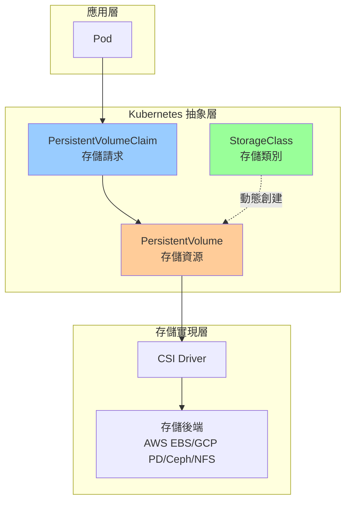
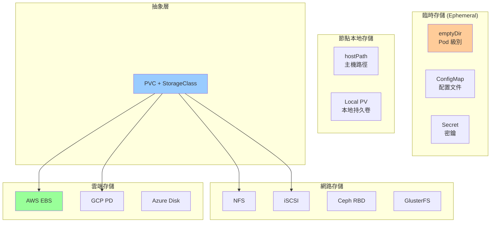
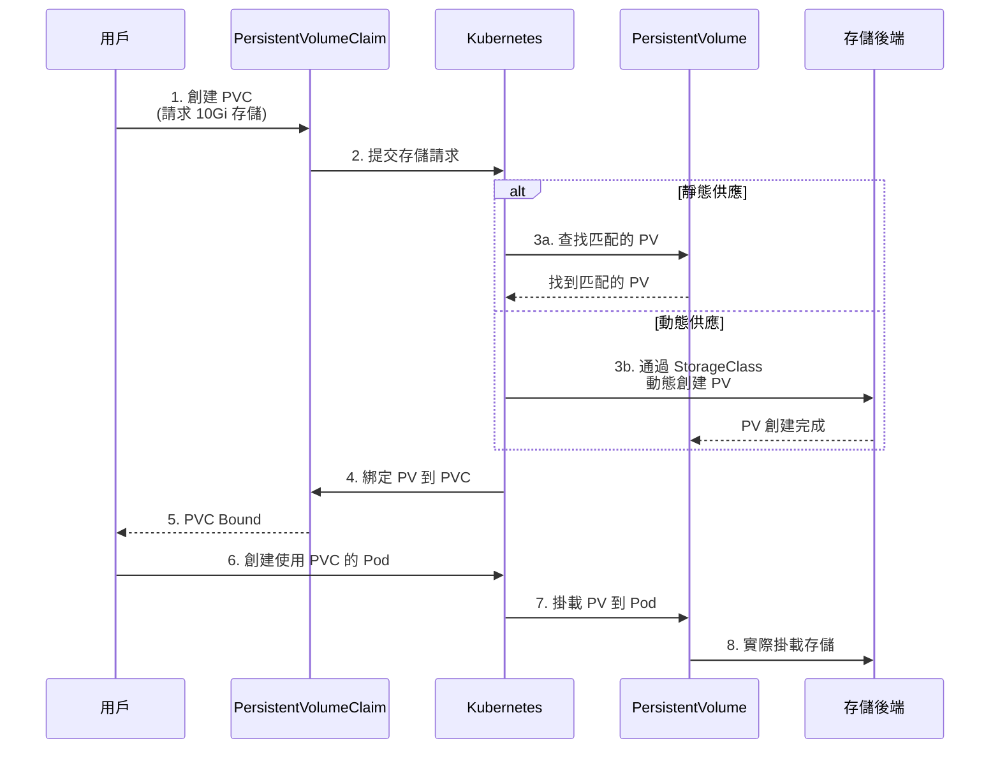
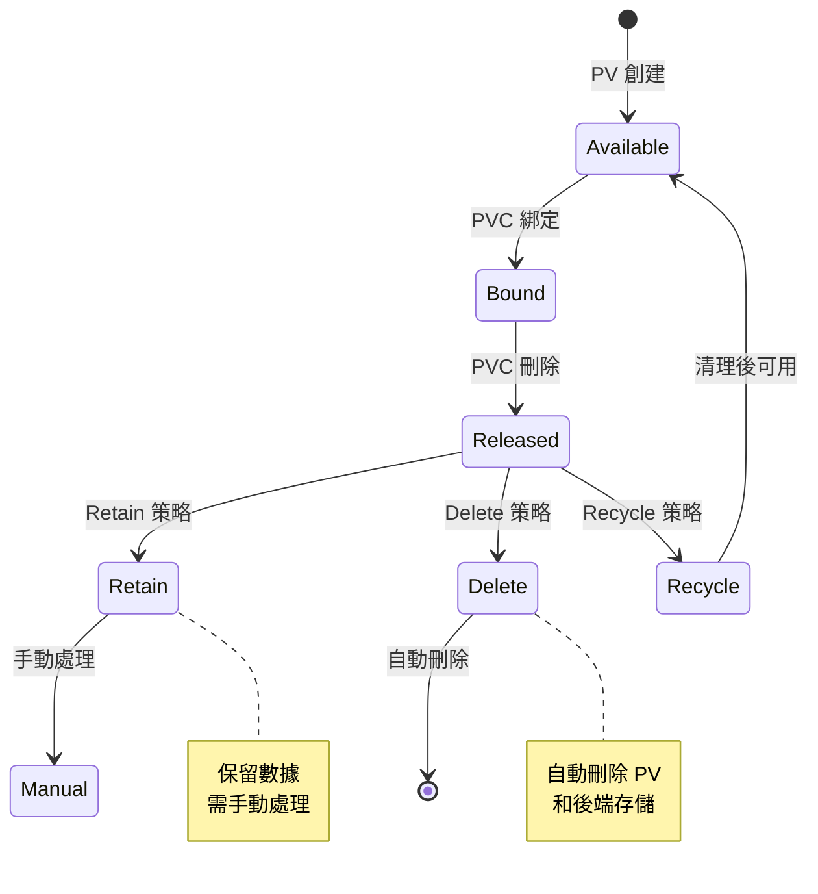
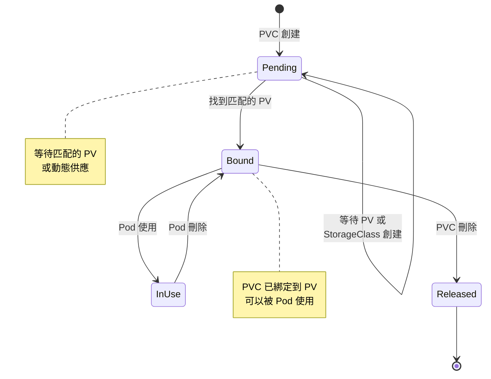
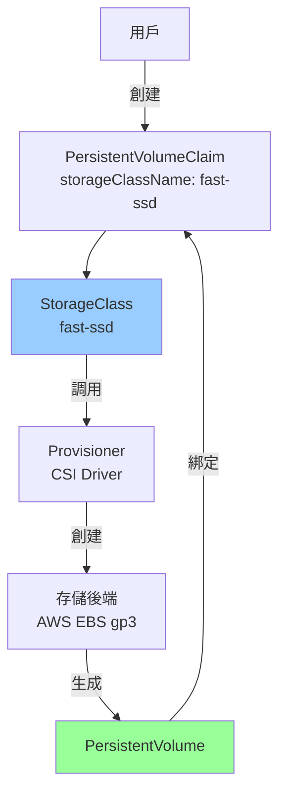
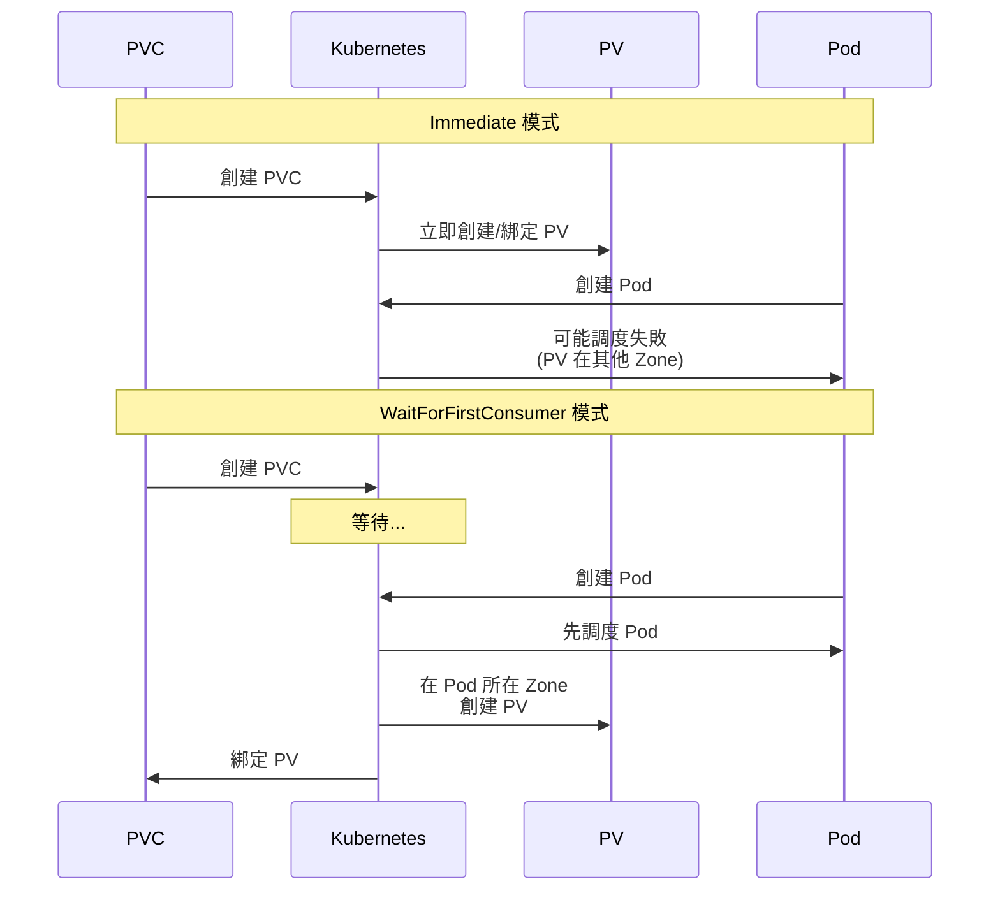
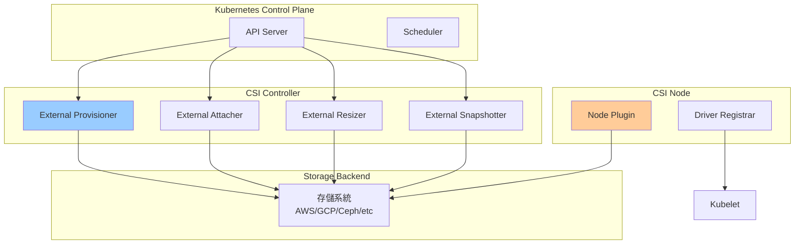
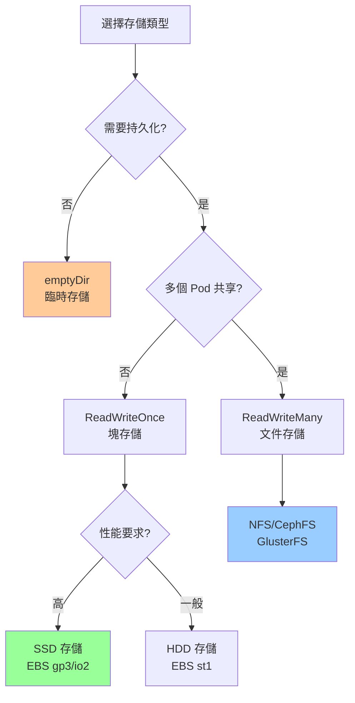

# 06-存儲資源詳解

> 深入掌握 Kubernetes 存儲資源的完整配置與使用

---

## 📚 本章目標

- 理解 Kubernetes 存儲架構與抽象層次
- 掌握 Volume 的各種類型與使用場景
- 深入學習 PersistentVolume 與 PersistentVolumeClaim
- 學會配置 StorageClass 實現動態存儲供應
- 理解 CSI 容器存儲接口
- 掌握存儲的最佳實踐與故障排查

---

## 1. Kubernetes 存儲架構

### 1.1 存儲抽象層次



---

### 1.2 存儲類型概覽



---

## 2. Volume 類型詳解

### 2.1 emptyDir（臨時存儲）

```yaml
apiVersion: v1
kind: Pod
metadata:
  name: test-emptydir
spec:
  containers:
  - name: app
    image: nginx:1.27
    volumeMounts:
    - name: cache
      mountPath: /cache
    - name: logs
      mountPath: /var/log/nginx
  
  - name: log-processor
    image: busybox:1.36
    command: ['sh', '-c', 'tail -f /logs/access.log']
    volumeMounts:
    - name: logs
      mountPath: /logs
  
  volumes:
  - name: cache
    emptyDir: {}
  
  - name: logs
    emptyDir:
      sizeLimit: 1Gi    # 限制大小
```

**emptyDir 特性：**
- ✅ Pod 創建時自動創建
- ✅ Pod 刪除時自動清除
- ✅ 同一 Pod 內容器可共享
- ✅ 默認存儲在節點磁盤上
- ✅ 可選使用內存（`medium: Memory`）

**使用場景：**
- 臨時緩存
- 容器間共享數據
- 日誌收集

**內存模式：**

```yaml
volumes:
- name: mem-cache
  emptyDir:
    medium: Memory
    sizeLimit: 512Mi
```

---

### 2.2 hostPath（主機路徑）

```yaml
apiVersion: v1
kind: Pod
metadata:
  name: test-hostpath
spec:
  containers:
  - name: app
    image: nginx:1.27
    volumeMounts:
    - name: host-data
      mountPath: /data
    - name: docker-socket
      mountPath: /var/run/docker.sock
  
  volumes:
  - name: host-data
    hostPath:
      path: /mnt/data
      type: DirectoryOrCreate
  
  - name: docker-socket
    hostPath:
      path: /var/run/docker.sock
      type: Socket
```

**hostPath 類型：**

| 類型 | 說明 |
|-----|------|
| `DirectoryOrCreate` | 目錄不存在則創建 |
| `Directory` | 必須存在的目錄 |
| `FileOrCreate` | 文件不存在則創建 |
| `File` | 必須存在的文件 |
| `Socket` | UNIX Socket |
| `CharDevice` | 字符設備 |
| `BlockDevice` | 塊設備 |

**注意事項：**
- ⚠️ Pod 調度到不同節點，數據不同
- ⚠️ 存在安全風險（訪問主機文件系統）
- ⚠️ 僅適合特殊場景（DaemonSet、監控代理）

---

### 2.3 configMap Volume

```yaml
apiVersion: v1
kind: ConfigMap
metadata:
  name: app-config
data:
  app.conf: |
    server {
        listen 80;
        server_name example.com;
        root /usr/share/nginx/html;
    }
  
  database.conf: |
    host=postgres.default.svc.cluster.local
    port=5432
    database=mydb

---
apiVersion: v1
kind: Pod
metadata:
  name: test-configmap
spec:
  containers:
  - name: app
    image: nginx:1.27
    volumeMounts:
    # 掛載整個 ConfigMap
    - name: config
      mountPath: /etc/config
    
    # 掛載單個 key
    - name: nginx-config
      mountPath: /etc/nginx/conf.d/default.conf
      subPath: app.conf
  
  volumes:
  - name: config
    configMap:
      name: app-config
  
  - name: nginx-config
    configMap:
      name: app-config
      items:
      - key: app.conf
        path: app.conf
        mode: 0644
```

**ConfigMap Volume 特性：**
- ✅ 文件自動更新（需要應用支持重載）
- ✅ 可設置文件權限
- ✅ 可選擇性掛載部分 key

---

### 2.4 secret Volume

```yaml
apiVersion: v1
kind: Secret
metadata:
  name: db-credentials
type: Opaque
stringData:
  username: admin
  password: SuperSecretPassword123

---
apiVersion: v1
kind: Pod
metadata:
  name: test-secret
spec:
  containers:
  - name: app
    image: myapp:v1.0
    volumeMounts:
    - name: credentials
      mountPath: /etc/secrets
      readOnly: true
  
  volumes:
  - name: credentials
    secret:
      secretName: db-credentials
      defaultMode: 0400    # 只讀權限
      items:
      - key: username
        path: db-user
      - key: password
        path: db-pass
```

**Secret Volume vs 環境變量：**

| 特性 | Volume | 環境變量 |
|-----|--------|---------|
| 安全性 | ✅ 更高（不會暴露在進程列表） | ❌ 可能暴露 |
| 更新 | ✅ 支持（需應用重載） | ❌ 需要重啟 |
| 權限控制 | ✅ 可設置文件權限 | ❌ 無 |

---

### 2.5 projected Volume（投射卷）

```yaml
apiVersion: v1
kind: Pod
metadata:
  name: test-projected
spec:
  containers:
  - name: app
    image: myapp:v1.0
    volumeMounts:
    - name: all-in-one
      mountPath: /projected
      readOnly: true
  
  volumes:
  - name: all-in-one
    projected:
      sources:
      # ConfigMap
      - configMap:
          name: app-config
          items:
          - key: app.conf
            path: config/app.conf
      
      # Secret
      - secret:
          name: db-credentials
          items:
          - key: username
            path: secrets/db-user
          - key: password
            path: secrets/db-pass
      
      # ServiceAccount Token
      - serviceAccountToken:
          path: token
          expirationSeconds: 3600
          audience: api
      
      # Downward API
      - downwardAPI:
          items:
          - path: "metadata/labels"
            fieldRef:
              fieldPath: metadata.labels
          - path: "metadata/annotations"
            fieldRef:
              fieldPath: metadata.annotations
```

---

### 2.6 downwardAPI Volume

```yaml
apiVersion: v1
kind: Pod
metadata:
  name: test-downwardapi
  labels:
    app: webapp
    version: v1.0
  annotations:
    build: "12345"
spec:
  containers:
  - name: app
    image: busybox:1.36
    command: ['sh', '-c', 'while true; do cat /etc/podinfo/*; sleep 30; done']
    volumeMounts:
    - name: podinfo
      mountPath: /etc/podinfo
    
    resources:
      requests:
        cpu: 100m
        memory: 128Mi
      limits:
        cpu: 500m
        memory: 512Mi
  
  volumes:
  - name: podinfo
    downwardAPI:
      items:
      # Pod 元數據
      - path: "pod-name"
        fieldRef:
          fieldPath: metadata.name
      - path: "pod-namespace"
        fieldRef:
          fieldPath: metadata.namespace
      - path: "pod-ip"
        fieldRef:
          fieldPath: status.podIP
      - path: "labels"
        fieldRef:
          fieldPath: metadata.labels
      - path: "annotations"
        fieldRef:
          fieldPath: metadata.annotations
      
      # 資源信息
      - path: "cpu-request"
        resourceFieldRef:
          containerName: app
          resource: requests.cpu
          divisor: 1m
      - path: "memory-limit"
        resourceFieldRef:
          containerName: app
          resource: limits.memory
          divisor: 1Mi
```

---

## 3. PersistentVolume (PV) 與 PersistentVolumeClaim (PVC)

### 3.1 PV/PVC 工作流程



---

### 3.2 PersistentVolume (PV) 配置

```yaml
apiVersion: v1
kind: PersistentVolume
metadata:
  name: pv-nfs-001
  labels:
    type: nfs
    tier: standard
spec:
  capacity:
    storage: 10Gi
  
  # 訪問模式
  accessModes:
  - ReadWriteMany    # RWX: 多節點讀寫
  
  # 回收策略
  persistentVolumeReclaimPolicy: Retain
  
  # 存儲類別
  storageClassName: nfs-storage
  
  # 掛載選項
  mountOptions:
  - hard
  - nfsvers=4.1
  
  # NFS 配置
  nfs:
    server: 192.168.1.100
    path: /exports/data
```

---

### 3.3 訪問模式 (Access Modes)

| 模式 | 縮寫 | 說明 | 支持的存儲 |
|-----|------|------|-----------|
| **ReadWriteOnce** | RWO | 單節點讀寫 | 大部分雲端塊存儲 |
| **ReadOnlyMany** | ROX | 多節點只讀 | NFS、CephFS |
| **ReadWriteMany** | RWX | 多節點讀寫 | NFS、CephFS、GlusterFS |
| **ReadWriteOncePod** | RWOP | 單 Pod 讀寫（K8s 1.27+） | CSI 卷 |

**常見存儲支持：**

| 存儲類型 | RWO | ROX | RWX |
|---------|-----|-----|-----|
| AWS EBS | ✅ | ❌ | ❌ |
| GCP PD | ✅ | ✅ | ❌ |
| Azure Disk | ✅ | ❌ | ❌ |
| NFS | ✅ | ✅ | ✅ |
| CephFS | ✅ | ✅ | ✅ |
| iSCSI | ✅ | ✅ | ❌ |

---

### 3.4 回收策略 (Reclaim Policy)



| 策略 | 說明 | 使用場景 |
|-----|------|---------|
| **Retain** | 保留數據，需手動處理 | 生產環境（防止誤刪） |
| **Delete** | 自動刪除 PV 和存儲 | 動態供應（默認） |
| **Recycle** | 清理數據後重用（已廢棄） | 不推薦 |

---

### 3.5 PersistentVolumeClaim (PVC) 配置

```yaml
apiVersion: v1
kind: PersistentVolumeClaim
metadata:
  name: webapp-pvc
  namespace: production
spec:
  # 訪問模式
  accessModes:
  - ReadWriteOnce
  
  # 存儲類別
  storageClassName: fast-ssd
  
  # 資源請求
  resources:
    requests:
      storage: 10Gi
  
  # 選擇器（可選，用於靜態綁定）
  selector:
    matchLabels:
      type: nfs
      tier: premium
    matchExpressions:
    - key: environment
      operator: In
      values:
      - production
  
  # Volume 模式
  volumeMode: Filesystem    # Filesystem 或 Block
```

---

### 3.6 PVC 生命週期



---

### 3.7 在 Pod 中使用 PVC

```yaml
apiVersion: v1
kind: Pod
metadata:
  name: webapp
spec:
  containers:
  - name: app
    image: myapp:v1.0
    volumeMounts:
    - name: data
      mountPath: /data
  
  volumes:
  - name: data
    persistentVolumeClaim:
      claimName: webapp-pvc
      readOnly: false
```

**Deployment 中使用：**

```yaml
apiVersion: apps/v1
kind: Deployment
metadata:
  name: webapp
spec:
  replicas: 1    # RWO 模式下只能是 1
  template:
    spec:
      containers:
      - name: app
        image: myapp:v1.0
        volumeMounts:
        - name: data
          mountPath: /data
      
      volumes:
      - name: data
        persistentVolumeClaim:
          claimName: webapp-pvc
```

**StatefulSet 中使用（推薦）：**

```yaml
apiVersion: apps/v1
kind: StatefulSet
metadata:
  name: webapp
spec:
  serviceName: webapp
  replicas: 3
  
  template:
    spec:
      containers:
      - name: app
        image: myapp:v1.0
        volumeMounts:
        - name: data
          mountPath: /data
  
  # 自動為每個 Pod 創建 PVC
  volumeClaimTemplates:
  - metadata:
      name: data
    spec:
      accessModes: ["ReadWriteOnce"]
      storageClassName: fast-ssd
      resources:
        requests:
          storage: 10Gi
```

---

## 4. StorageClass（存儲類別）

### 4.1 StorageClass 是什麼

StorageClass 提供動態存儲供應，自動創建 PV。



---

### 4.2 StorageClass 配置示例

#### 4.2.1 AWS EBS

```yaml
apiVersion: storage.k8s.io/v1
kind: StorageClass
metadata:
  name: fast-ssd
provisioner: ebs.csi.aws.com
parameters:
  type: gp3              # gp2, gp3, io1, io2, st1, sc1
  iops: "3000"           # gp3/io1/io2 專用
  throughput: "125"      # gp3 專用（MB/s）
  encrypted: "true"
  kmsKeyId: arn:aws:kms:us-west-1:123456789012:key/xxx
  fsType: ext4

# Volume 綁定模式
volumeBindingMode: WaitForFirstConsumer    # Immediate 或 WaitForFirstConsumer

# 允許擴容
allowVolumeExpansion: true

# 回收策略
reclaimPolicy: Delete    # Delete 或 Retain

# 掛載選項
mountOptions:
- debug
```

#### 4.2.2 GCP Persistent Disk

```yaml
apiVersion: storage.k8s.io/v1
kind: StorageClass
metadata:
  name: fast-ssd
provisioner: pd.csi.storage.gke.io
parameters:
  type: pd-ssd           # pd-standard, pd-ssd, pd-balanced
  replication-type: regional-pd
  fstype: ext4

volumeBindingMode: WaitForFirstConsumer
allowVolumeExpansion: true
reclaimPolicy: Delete
```

#### 4.2.3 Azure Disk

```yaml
apiVersion: storage.k8s.io/v1
kind: StorageClass
metadata:
  name: fast-ssd
provisioner: disk.csi.azure.com
parameters:
  skuname: Premium_LRS    # Standard_LRS, Premium_LRS, StandardSSD_LRS, UltraSSD_LRS
  kind: Managed
  cachingmode: ReadOnly
  fsType: ext4

volumeBindingMode: WaitForFirstConsumer
allowVolumeExpansion: true
reclaimPolicy: Delete
```

#### 4.2.4 NFS

```yaml
apiVersion: storage.k8s.io/v1
kind: StorageClass
metadata:
  name: nfs-storage
provisioner: nfs.csi.k8s.io
parameters:
  server: nfs-server.default.svc.cluster.local
  share: /exports

volumeBindingMode: Immediate
allowVolumeExpansion: true
reclaimPolicy: Retain
mountOptions:
- hard
- nfsvers=4.1
```

#### 4.2.5 Longhorn（分布式存儲）

```yaml
apiVersion: storage.k8s.io/v1
kind: StorageClass
metadata:
  name: longhorn
provisioner: driver.longhorn.io
parameters:
  numberOfReplicas: "3"
  staleReplicaTimeout: "2880"
  fromBackup: ""
  fsType: "ext4"

volumeBindingMode: Immediate
allowVolumeExpansion: true
reclaimPolicy: Delete
```

---

### 4.3 volumeBindingMode（綁定模式）

| 模式 | 說明 | 使用場景 |
|-----|------|---------|
| **Immediate** | PVC 創建後立即綁定 PV | 不關心 Pod 調度位置 |
| **WaitForFirstConsumer** | 等待第一個使用 PVC 的 Pod 調度後再綁定 | 拓撲感知（推薦） |



---

### 4.4 動態供應完整示例

```yaml
# StorageClass
apiVersion: storage.k8s.io/v1
kind: StorageClass
metadata:
  name: fast-ssd
provisioner: ebs.csi.aws.com
parameters:
  type: gp3
  iops: "3000"
  throughput: "125"
  encrypted: "true"
volumeBindingMode: WaitForFirstConsumer
allowVolumeExpansion: true
reclaimPolicy: Delete

---
# PVC
apiVersion: v1
kind: PersistentVolumeClaim
metadata:
  name: webapp-pvc
spec:
  accessModes:
  - ReadWriteOnce
  storageClassName: fast-ssd
  resources:
    requests:
      storage: 20Gi

---
# Deployment
apiVersion: apps/v1
kind: Deployment
metadata:
  name: webapp
spec:
  replicas: 1
  selector:
    matchLabels:
      app: webapp
  template:
    metadata:
      labels:
        app: webapp
    spec:
      containers:
      - name: app
        image: myapp:v1.0
        volumeMounts:
        - name: data
          mountPath: /data
      
      volumes:
      - name: data
        persistentVolumeClaim:
          claimName: webapp-pvc
```

---

## 5. 存儲擴容

### 5.1 在線擴容 PVC

```bash
# 編輯 PVC
kubectl edit pvc webapp-pvc

# 修改 storage 大小
spec:
  resources:
    requests:
      storage: 50Gi    # 從 20Gi 擴容到 50Gi
```

**或使用 patch：**

```bash
kubectl patch pvc webapp-pvc -p '{"spec":{"resources":{"requests":{"storage":"50Gi"}}}}'
```

**查看狀態：**

```bash
kubectl get pvc webapp-pvc
# NAME         STATUS   VOLUME                                     CAPACITY   ACCESS MODES
# webapp-pvc   Bound    pvc-abc123                                 50Gi       RWO

kubectl describe pvc webapp-pvc
# Events:
#   Normal  Resizing  1m   external-resizer  External resizer is resizing volume
#   Normal  FileSystemResizeSuccessful  30s  kubelet  MountVolume.NodeExpandVolume succeeded
```

**注意事項：**
- ✅ StorageClass 必須設置 `allowVolumeExpansion: true`
- ✅ 僅支持擴容，不支持縮容
- ✅ 部分存儲需要重啟 Pod（查看 PVC Events）

---

## 6. CSI（Container Storage Interface）

### 6.1 CSI 架構



---

### 6.2 常用 CSI Driver

| CSI Driver | 存儲類型 | 特性 |
|-----------|---------|------|
| **AWS EBS CSI** | AWS EBS | 動態供應、快照、加密 |
| **GCP PD CSI** | GCP Persistent Disk | 動態供應、區域複製 |
| **Azure Disk CSI** | Azure Disk | 動態供應、多種性能層級 |
| **Longhorn** | 分布式塊存儲 | 開源、高可用、快照 |
| **Rook-Ceph** | Ceph | 開源、塊/文件/對象存儲 |
| **NFS CSI** | NFS | RWX 支持 |
| **Local Path Provisioner** | 本地存儲 | 高性能、不支持遷移 |

---

### 6.3 安裝 AWS EBS CSI Driver

```bash
# 使用 Helm 安裝
helm repo add aws-ebs-csi-driver https://kubernetes-sigs.github.io/aws-ebs-csi-driver
helm repo update

helm install aws-ebs-csi-driver aws-ebs-csi-driver/aws-ebs-csi-driver \
  --namespace kube-system \
  --set enableVolumeScheduling=true \
  --set enableVolumeResizing=true \
  --set enableVolumeSnapshot=true

# 查看
kubectl get pods -n kube-system -l app.kubernetes.io/name=aws-ebs-csi-driver
kubectl get csidrivers
```

---

### 6.4 存儲快照（VolumeSnapshot）

```yaml
# VolumeSnapshotClass
apiVersion: snapshot.storage.k8s.io/v1
kind: VolumeSnapshotClass
metadata:
  name: ebs-snapshot-class
driver: ebs.csi.aws.com
deletionPolicy: Delete
parameters:
  tagSpecifications: '[{"tags":{"team":"platform"},"resourceType":"snapshot"}]'

---
# VolumeSnapshot
apiVersion: snapshot.storage.k8s.io/v1
kind: VolumeSnapshot
metadata:
  name: webapp-snapshot-20250113
spec:
  volumeSnapshotClassName: ebs-snapshot-class
  source:
    persistentVolumeClaimName: webapp-pvc

---
# 從快照恢復
apiVersion: v1
kind: PersistentVolumeClaim
metadata:
  name: webapp-pvc-restored
spec:
  accessModes:
  - ReadWriteOnce
  storageClassName: fast-ssd
  dataSource:
    name: webapp-snapshot-20250113
    kind: VolumeSnapshot
    apiGroup: snapshot.storage.k8s.io
  resources:
    requests:
      storage: 20Gi
```

---

## 7. 實戰案例

### 7.1 PostgreSQL 持久化存儲

```yaml
apiVersion: v1
kind: ConfigMap
metadata:
  name: postgres-config
data:
  POSTGRES_DB: mydb
  POSTGRES_USER: admin

---
apiVersion: v1
kind: Secret
metadata:
  name: postgres-secret
type: Opaque
stringData:
  POSTGRES_PASSWORD: SuperSecretPassword123

---
apiVersion: v1
kind: PersistentVolumeClaim
metadata:
  name: postgres-pvc
spec:
  accessModes:
  - ReadWriteOnce
  storageClassName: fast-ssd
  resources:
    requests:
      storage: 20Gi

---
apiVersion: apps/v1
kind: StatefulSet
metadata:
  name: postgres
spec:
  serviceName: postgres
  replicas: 1
  selector:
    matchLabels:
      app: postgres
  
  template:
    metadata:
      labels:
        app: postgres
    spec:
      containers:
      - name: postgres
        image: postgres:16
        
        ports:
        - containerPort: 5432
          name: postgres
        
        envFrom:
        - configMapRef:
            name: postgres-config
        - secretRef:
            name: postgres-secret
        
        volumeMounts:
        - name: data
          mountPath: /var/lib/postgresql/data
          subPath: postgres
        
        resources:
          requests:
            cpu: 500m
            memory: 1Gi
          limits:
            cpu: 1000m
            memory: 2Gi
        
        livenessProbe:
          exec:
            command:
            - pg_isready
            - -U
            - admin
          initialDelaySeconds: 30
          periodSeconds: 10
        
        readinessProbe:
          exec:
            command:
            - pg_isready
            - -U
            - admin
          initialDelaySeconds: 5
          periodSeconds: 5
  
  volumeClaimTemplates:
  - metadata:
      name: data
    spec:
      accessModes: ["ReadWriteOnce"]
      storageClassName: fast-ssd
      resources:
        requests:
          storage: 20Gi

---
apiVersion: v1
kind: Service
metadata:
  name: postgres
spec:
  clusterIP: None
  selector:
    app: postgres
  ports:
  - port: 5432
    targetPort: 5432
```

---

### 7.2 共享文件存儲（NFS）

```yaml
# NFS Server Deployment
apiVersion: apps/v1
kind: Deployment
metadata:
  name: nfs-server
spec:
  replicas: 1
  selector:
    matchLabels:
      app: nfs-server
  template:
    metadata:
      labels:
        app: nfs-server
    spec:
      containers:
      - name: nfs-server
        image: k8s.gcr.io/volume-nfs:0.8
        ports:
        - containerPort: 2049
          name: nfs
        - containerPort: 20048
          name: mountd
        - containerPort: 111
          name: rpcbind
        securityContext:
          privileged: true
        volumeMounts:
        - name: nfs-export
          mountPath: /exports
      
      volumes:
      - name: nfs-export
        hostPath:
          path: /mnt/nfs-export
          type: DirectoryOrCreate

---
apiVersion: v1
kind: Service
metadata:
  name: nfs-server
spec:
  clusterIP: 10.96.100.100
  selector:
    app: nfs-server
  ports:
  - port: 2049
    name: nfs
  - port: 20048
    name: mountd
  - port: 111
    name: rpcbind

---
# PV 使用 NFS
apiVersion: v1
kind: PersistentVolume
metadata:
  name: nfs-pv
spec:
  capacity:
    storage: 100Gi
  accessModes:
  - ReadWriteMany
  persistentVolumeReclaimPolicy: Retain
  nfs:
    server: 10.96.100.100
    path: /

---
# PVC
apiVersion: v1
kind: PersistentVolumeClaim
metadata:
  name: shared-storage
spec:
  accessModes:
  - ReadWriteMany
  resources:
    requests:
      storage: 100Gi

---
# 多個 Pod 共享
apiVersion: apps/v1
kind: Deployment
metadata:
  name: webapp
spec:
  replicas: 3
  selector:
    matchLabels:
      app: webapp
  template:
    metadata:
      labels:
        app: webapp
    spec:
      containers:
      - name: app
        image: nginx:1.27
        volumeMounts:
        - name: shared
          mountPath: /usr/share/nginx/html
      
      volumes:
      - name: shared
        persistentVolumeClaim:
          claimName: shared-storage
```

---

## 8. 最佳實踐

### 8.1 存儲選擇指南



### 8.2 配置建議

```yaml
# ✅ 生產環境配置
apiVersion: v1
kind: PersistentVolumeClaim
metadata:
  name: production-pvc
spec:
  accessModes:
  - ReadWriteOnce
  storageClassName: fast-ssd
  resources:
    requests:
      storage: 100Gi    # 預留足夠空間
  
  # 使用 WaitForFirstConsumer
  volumeBindingMode: WaitForFirstConsumer

---
apiVersion: storage.k8s.io/v1
kind: StorageClass
metadata:
  name: fast-ssd
provisioner: ebs.csi.aws.com
parameters:
  type: gp3
  iops: "3000"
  encrypted: "true"    # 啟用加密
volumeBindingMode: WaitForFirstConsumer
allowVolumeExpansion: true    # 允許擴容
reclaimPolicy: Retain    # 保留數據
```

### 8.3 備份策略

```yaml
# 定時快照
apiVersion: batch/v1
kind: CronJob
metadata:
  name: volume-snapshot
spec:
  schedule: "0 2 * * *"    # 每天凌晨 2:00
  jobTemplate:
    spec:
      template:
        spec:
          serviceAccountName: snapshot-creator
          restartPolicy: OnFailure
          containers:
          - name: create-snapshot
            image: bitnami/kubectl:latest
            command:
            - /bin/bash
            - -c
            - |
              DATE=$(date +%Y%m%d-%H%M%S)
              cat <<EOF | kubectl apply -f -
              apiVersion: snapshot.storage.k8s.io/v1
              kind: VolumeSnapshot
              metadata:
                name: postgres-snapshot-$DATE
              spec:
                volumeSnapshotClassName: ebs-snapshot-class
                source:
                  persistentVolumeClaimName: postgres-pvc
              EOF
              
              # 刪除 7 天前的快照
              kubectl get volumesnapshots -o json | \
                jq -r '.items[] | select(.metadata.creationTimestamp < "'$(date -d '7 days ago' -Iseconds)'") | .metadata.name' | \
                xargs -r kubectl delete volumesnapshot
```

---

## 9. 故障排查

### 9.1 PVC Pending

```bash
# 查看 PVC 狀態
kubectl get pvc
kubectl describe pvc webapp-pvc

# 常見原因：
# 1. 沒有匹配的 PV（靜態供應）
# 2. StorageClass 不存在
# 3. 資源不足
# 4. 訪問模式不匹配

# 檢查 StorageClass
kubectl get storageclass
kubectl describe storageclass fast-ssd

# 檢查 Provisioner
kubectl get pods -n kube-system | grep csi
kubectl logs -n kube-system <csi-provisioner-pod>
```

### 9.2 Pod 掛載失敗

```bash
# 查看 Pod 事件
kubectl describe pod webapp-pod

# 常見錯誤：
# - Multi-Attach error: Volume已附加到其他節點（RWO 限制）
# - Unable to mount: 存儲後端無法訪問
# - Timeout: 掛載超時

# 檢查 PV 狀態
kubectl get pv
kubectl describe pv <pv-name>

# 檢查 CSI Node Plugin
kubectl get pods -n kube-system -l app=ebs-csi-node
kubectl logs -n kube-system <csi-node-pod>
```

### 9.3 擴容失敗

```bash
# 查看 PVC 狀態
kubectl describe pvc webapp-pvc

# 檢查 Events：
# - FilesystemResizePending: 需要重啟 Pod
# - External resizer error: 存儲後端不支持擴容

# 重啟 Pod 觸發文件系統擴容
kubectl rollout restart deployment webapp
```

---

## 10. 小結

本章深入講解了 Kubernetes 的存儲資源：

**核心概念：**
- ✅ **Volume**：臨時或持久化存儲（emptyDir、hostPath、ConfigMap、Secret）
- ✅ **PersistentVolume (PV)**：集群級別的存儲資源
- ✅ **PersistentVolumeClaim (PVC)**：用戶對存儲的請求
- ✅ **StorageClass**：動態存儲供應
- ✅ **CSI**：容器存儲接口標準

**訪問模式：**
- ✅ ReadWriteOnce (RWO)：單節點讀寫
- ✅ ReadOnlyMany (ROX)：多節點只讀
- ✅ ReadWriteMany (RWX)：多節點讀寫

**最佳實踐：**
- ✅ 使用 StorageClass 動態供應
- ✅ 生產環境使用 Retain 回收策略
- ✅ 啟用存儲加密
- ✅ 定期備份（快照）
- ✅ StatefulSet 使用 volumeClaimTemplates

下一章將學習配置資源，包括 ConfigMap、Secret、ResourceQuota 等。

---

## 參考資料 (References)

1. [Kubernetes 官方文檔 - Storage](https://kubernetes.io/docs/concepts/storage/)
2. [Kubernetes 官方文檔 - Persistent Volumes](https://kubernetes.io/docs/concepts/storage/persistent-volumes/)
3. [Kubernetes 官方文檔 - Storage Classes](https://kubernetes.io/docs/concepts/storage/storage-classes/)
4. [Container Storage Interface (CSI) 規範](https://github.com/container-storage-interface/spec)
5. [AWS EBS CSI Driver](https://github.com/kubernetes-sigs/aws-ebs-csi-driver)
6. [Longhorn 官方文檔](https://longhorn.io/docs/)
