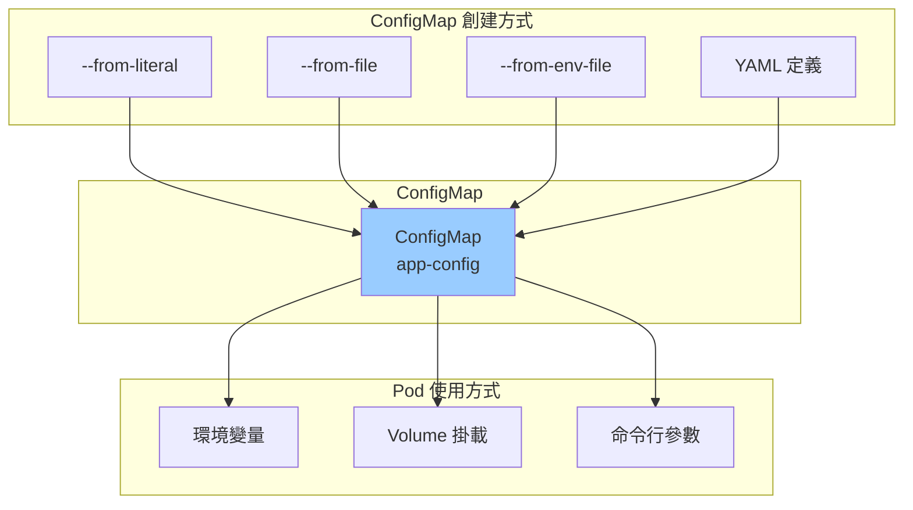
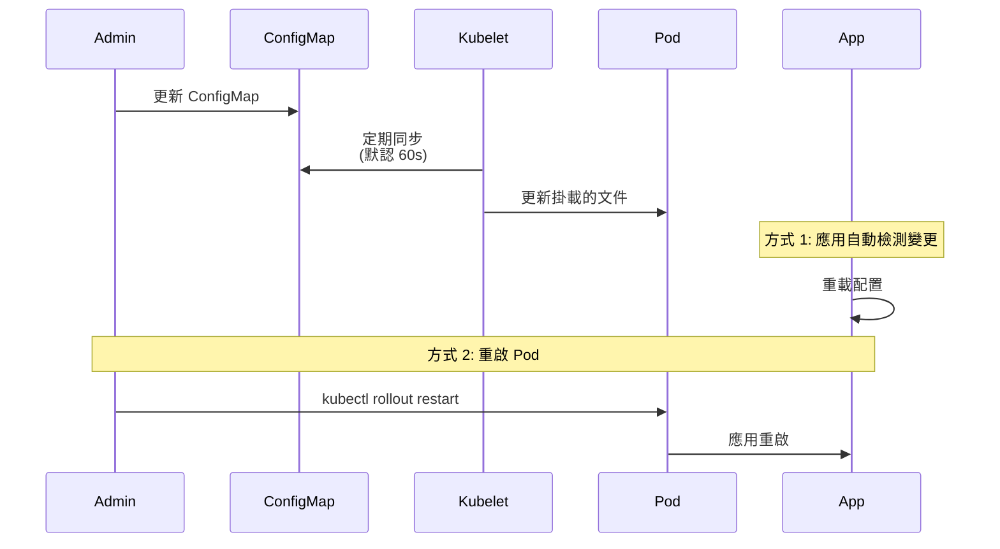
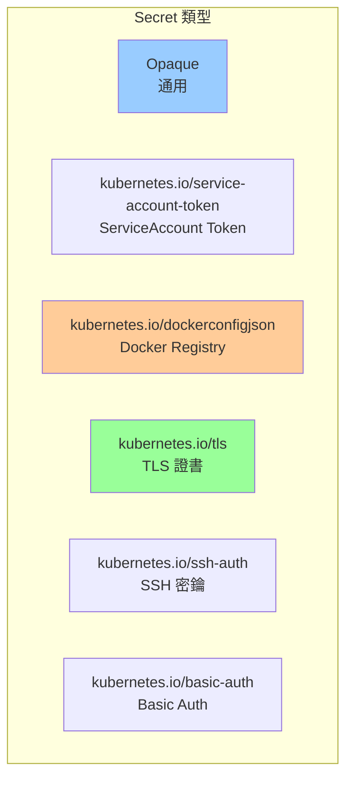
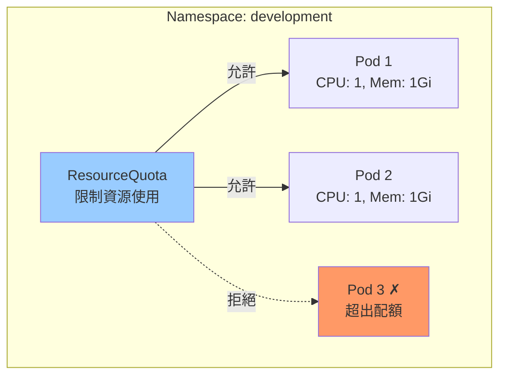
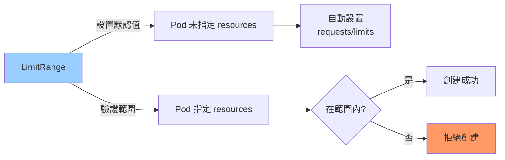
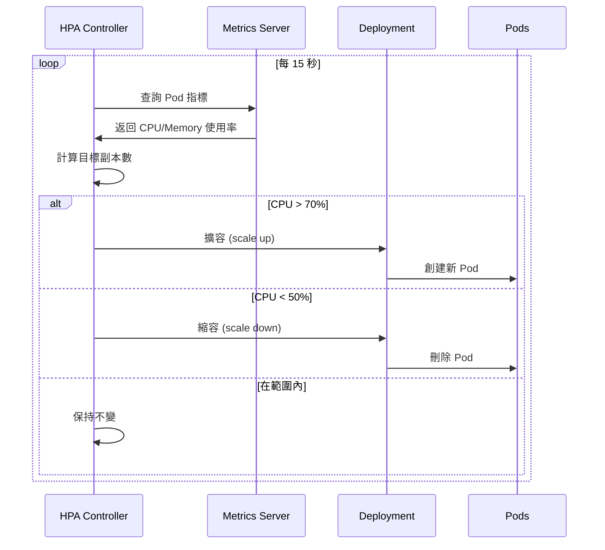
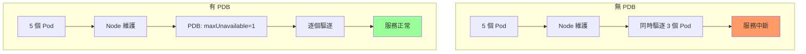

# 07-配置資源詳解

> 深入掌握 Kubernetes 配置資源的完整配置與使用

---

## 📚 本章目標

- 深入掌握 ConfigMap 的創建與使用方式
- 學會 Secret 的安全管理與最佳實踐
- 理解 ResourceQuota 與 LimitRange 的資源管理
- 掌握 HorizontalPodAutoscaler (HPA) 自動擴縮容
- 學會 PodDisruptionBudget (PDB) 保護服務可用性

---

## 1. ConfigMap 深度解析

### 1.1 ConfigMap 是什麼

ConfigMap 用於存儲非機密的配置數據，與應用代碼解耦。



---

### 1.2 創建 ConfigMap

#### 1.2.1 從字面值創建

```bash
kubectl create configmap app-config \
  --from-literal=APP_NAME=myapp \
  --from-literal=LOG_LEVEL=info \
  --from-literal=MAX_CONNECTIONS=100
```

#### 1.2.2 從文件創建

```bash
# 創建配置文件
cat > app.properties <<EOF
app.name=myapp
app.version=1.0.0
log.level=info
database.host=postgres.default.svc.cluster.local
database.port=5432
EOF

# 從單個文件創建
kubectl create configmap app-config --from-file=app.properties

# 從多個文件創建
kubectl create configmap app-config \
  --from-file=app.properties \
  --from-file=database.conf \
  --from-file=nginx.conf

# 從目錄創建
kubectl create configmap app-config --from-file=./config/
```

#### 1.2.3 從環境文件創建

```bash
# .env 文件
cat > app.env <<EOF
APP_NAME=myapp
LOG_LEVEL=info
MAX_CONNECTIONS=100
EOF

kubectl create configmap app-config --from-env-file=app.env
```

#### 1.2.4 使用 YAML 創建

```yaml
apiVersion: v1
kind: ConfigMap
metadata:
  name: app-config
  namespace: production
  labels:
    app: webapp
data:
  # 簡單鍵值對
  APP_NAME: "myapp"
  LOG_LEVEL: "info"
  MAX_CONNECTIONS: "100"
  
  # 文件內容（使用 | 或 >）
  app.properties: |
    app.name=myapp
    app.version=1.0.0
    log.level=info
    database.host=postgres.default.svc.cluster.local
    database.port=5432
  
  nginx.conf: |
    server {
        listen 80;
        server_name example.com;
        
        location / {
            proxy_pass http://backend:8080;
            proxy_set_header Host $host;
            proxy_set_header X-Real-IP $remote_addr;
        }
    }
  
  application.yaml: |
    server:
      port: 8080
      shutdown: graceful
    
    spring:
      application:
        name: myapp
      datasource:
        url: jdbc:postgresql://postgres:5432/mydb
        username: ${DB_USER}
        password: ${DB_PASSWORD}
    
    logging:
      level:
        root: INFO
        com.example: DEBUG

immutable: false    # true 表示不可變（性能優化）
```

---

### 1.3 使用 ConfigMap

#### 1.3.1 環境變量注入

```yaml
apiVersion: v1
kind: Pod
metadata:
  name: webapp
spec:
  containers:
  - name: app
    image: myapp:v1.0
    
    # 方式 1：單個環境變量
    env:
    - name: APP_NAME
      valueFrom:
        configMapKeyRef:
          name: app-config
          key: APP_NAME
    
    - name: LOG_LEVEL
      valueFrom:
        configMapKeyRef:
          name: app-config
          key: LOG_LEVEL
          optional: true    # key 不存在時不報錯
    
    # 方式 2：所有 key 作為環境變量
    envFrom:
    - configMapRef:
        name: app-config
    
    # 方式 3：添加前綴
    - configMapRef:
        name: db-config
      prefix: DB_
```

#### 1.3.2 Volume 掛載

```yaml
apiVersion: v1
kind: Pod
metadata:
  name: webapp
spec:
  containers:
  - name: app
    image: nginx:1.27
    volumeMounts:
    # 掛載整個 ConfigMap
    - name: config
      mountPath: /etc/config
      readOnly: true
    
    # 掛載單個 key 到指定路徑
    - name: nginx-config
      mountPath: /etc/nginx/conf.d/default.conf
      subPath: nginx.conf
      readOnly: true
  
  volumes:
  # 掛載整個 ConfigMap
  - name: config
    configMap:
      name: app-config
      defaultMode: 0644
  
  # 選擇性掛載
  - name: nginx-config
    configMap:
      name: app-config
      items:
      - key: nginx.conf
        path: nginx.conf
        mode: 0644
      - key: app.properties
        path: config/app.properties
```

#### 1.3.3 命令行參數

```yaml
apiVersion: v1
kind: Pod
metadata:
  name: webapp
spec:
  containers:
  - name: app
    image: myapp:v1.0
    command: ["/app/server"]
    args:
    - --name=$(APP_NAME)
    - --log-level=$(LOG_LEVEL)
    - --max-connections=$(MAX_CONNECTIONS)
    
    env:
    - name: APP_NAME
      valueFrom:
        configMapKeyRef:
          name: app-config
          key: APP_NAME
    - name: LOG_LEVEL
      valueFrom:
        configMapKeyRef:
          name: app-config
          key: LOG_LEVEL
    - name: MAX_CONNECTIONS
      valueFrom:
        configMapKeyRef:
          name: app-config
          key: MAX_CONNECTIONS
```

---

### 1.4 ConfigMap 動態更新



**注意事項：**
- ✅ Volume 掛載：自動更新（延遲 60s）
- ❌ 環境變量：不會更新，需要重啟 Pod
- ❌ subPath 掛載：不會更新

**觸發 Pod 重啟：**

```bash
# 方式 1：添加 annotation 觸發更新
kubectl patch deployment webapp -p \
  '{"spec":{"template":{"metadata":{"annotations":{"configmap-version":"'$(date +%s)'"}}}}}'

# 方式 2：使用 rollout restart
kubectl rollout restart deployment webapp

# 方式 3：使用 Reloader（自動化工具）
# https://github.com/stakater/Reloader
```

---

### 1.5 ConfigMap 實戰案例

#### 案例 1：Nginx 配置管理

```yaml
apiVersion: v1
kind: ConfigMap
metadata:
  name: nginx-config
data:
  nginx.conf: |
    user nginx;
    worker_processes auto;
    error_log /var/log/nginx/error.log warn;
    pid /var/run/nginx.pid;
    
    events {
        worker_connections 1024;
    }
    
    http {
        include /etc/nginx/mime.types;
        default_type application/octet-stream;
        
        log_format main '$remote_addr - $remote_user [$time_local] "$request" '
                        '$status $body_bytes_sent "$http_referer" '
                        '"$http_user_agent" "$http_x_forwarded_for"';
        
        access_log /var/log/nginx/access.log main;
        
        sendfile on;
        keepalive_timeout 65;
        
        include /etc/nginx/conf.d/*.conf;
    }
  
  default.conf: |
    upstream backend {
        server api-service:8080;
    }
    
    server {
        listen 80;
        server_name example.com;
        
        location / {
            root /usr/share/nginx/html;
            index index.html;
            try_files $uri $uri/ /index.html;
        }
        
        location /api/ {
            proxy_pass http://backend/;
            proxy_set_header Host $host;
            proxy_set_header X-Real-IP $remote_addr;
            proxy_set_header X-Forwarded-For $proxy_add_x_forwarded_for;
            proxy_set_header X-Forwarded-Proto $scheme;
        }
    }

---
apiVersion: apps/v1
kind: Deployment
metadata:
  name: nginx
spec:
  replicas: 2
  selector:
    matchLabels:
      app: nginx
  template:
    metadata:
      labels:
        app: nginx
    spec:
      containers:
      - name: nginx
        image: nginx:1.27
        ports:
        - containerPort: 80
        volumeMounts:
        - name: nginx-config
          mountPath: /etc/nginx/nginx.conf
          subPath: nginx.conf
        - name: nginx-config
          mountPath: /etc/nginx/conf.d/default.conf
          subPath: default.conf
      
      volumes:
      - name: nginx-config
        configMap:
          name: nginx-config
```

---

## 2. Secret 深度解析

### 2.1 Secret 類型



---

### 2.2 創建 Secret

#### 2.2.1 Opaque Secret（通用）

```bash
# 從字面值創建
kubectl create secret generic db-credentials \
  --from-literal=username=admin \
  --from-literal=password=SuperSecretPassword123

# 從文件創建
echo -n 'admin' > username.txt
echo -n 'SuperSecretPassword123' > password.txt
kubectl create secret generic db-credentials \
  --from-file=username=username.txt \
  --from-file=password=password.txt

# 使用 YAML
kubectl apply -f - <<EOF
apiVersion: v1
kind: Secret
metadata:
  name: db-credentials
type: Opaque
stringData:
  username: admin
  password: SuperSecretPassword123
EOF

# 或使用 base64 編碼
kubectl apply -f - <<EOF
apiVersion: v1
kind: Secret
metadata:
  name: db-credentials
type: Opaque
data:
  username: $(echo -n 'admin' | base64)
  password: $(echo -n 'SuperSecretPassword123' | base64)
EOF
```

#### 2.2.2 Docker Registry Secret

```bash
kubectl create secret docker-registry regcred \
  --docker-server=myregistry.io \
  --docker-username=myuser \
  --docker-password=mypassword \
  --docker-email=user@example.com
```

**在 Pod 中使用：**

```yaml
apiVersion: v1
kind: Pod
metadata:
  name: webapp
spec:
  imagePullSecrets:
  - name: regcred
  
  containers:
  - name: app
    image: myregistry.io/myapp:v1.0
```

#### 2.2.3 TLS Secret

```bash
# 創建自簽名證書
openssl req -x509 -nodes -days 365 -newkey rsa:2048 \
  -keyout tls.key -out tls.crt -subj "/CN=example.com"

# 創建 TLS Secret
kubectl create secret tls example-com-tls \
  --cert=tls.crt \
  --key=tls.key
```

**在 Ingress 中使用：**

```yaml
apiVersion: networking.k8s.io/v1
kind: Ingress
metadata:
  name: webapp-ingress
spec:
  tls:
  - hosts:
    - example.com
    secretName: example-com-tls
  rules:
  - host: example.com
    http:
      paths:
      - path: /
        pathType: Prefix
        backend:
          service:
            name: webapp
            port:
              number: 80
```

#### 2.2.4 SSH Auth Secret

```bash
ssh-keygen -t rsa -b 4096 -f id_rsa -N ""

kubectl create secret generic ssh-key \
  --from-file=ssh-privatekey=id_rsa \
  --from-file=ssh-publickey=id_rsa.pub
```

#### 2.2.5 Basic Auth Secret

```bash
htpasswd -c auth admin
kubectl create secret generic basic-auth --from-file=auth
```

---

### 2.3 使用 Secret

#### 2.3.1 環境變量注入

```yaml
apiVersion: v1
kind: Pod
metadata:
  name: webapp
spec:
  containers:
  - name: app
    image: myapp:v1.0
    
    # 單個環境變量
    env:
    - name: DB_USER
      valueFrom:
        secretKeyRef:
          name: db-credentials
          key: username
    
    - name: DB_PASSWORD
      valueFrom:
        secretKeyRef:
          name: db-credentials
          key: password
    
    # 所有 key 作為環境變量
    envFrom:
    - secretRef:
        name: db-credentials
```

#### 2.3.2 Volume 掛載（推薦）

```yaml
apiVersion: v1
kind: Pod
metadata:
  name: webapp
spec:
  containers:
  - name: app
    image: myapp:v1.0
    volumeMounts:
    - name: secrets
      mountPath: /etc/secrets
      readOnly: true
  
  volumes:
  - name: secrets
    secret:
      secretName: db-credentials
      defaultMode: 0400    # 只讀權限
      items:
      - key: username
        path: db-user
        mode: 0400
      - key: password
        path: db-pass
        mode: 0400
```

---

### 2.4 Secret 安全最佳實踐

```yaml
# ✅ 好的實踐
apiVersion: v1
kind: Pod
metadata:
  name: webapp
spec:
  containers:
  - name: app
    image: myapp:v1.0
    
    # ✅ 使用 Volume 掛載
    volumeMounts:
    - name: secrets
      mountPath: /etc/secrets
      readOnly: true
    
    # ✅ 使用 projected volume（更靈活）
    - name: all-secrets
      mountPath: /var/secrets
      readOnly: true
  
  volumes:
  - name: secrets
    secret:
      secretName: db-credentials
      defaultMode: 0400
  
  - name: all-secrets
    projected:
      defaultMode: 0400
      sources:
      - secret:
          name: db-credentials
          items:
          - key: password
            path: db/password
      - secret:
          name: api-key
          items:
          - key: key
            path: api/key
  
  # ✅ 啟用 ServiceAccount Token 自動掛載
  serviceAccountName: webapp-sa
  automountServiceAccountToken: true

---
# ❌ 避免的做法
apiVersion: v1
kind: Pod
metadata:
  name: bad-example
spec:
  containers:
  - name: app
    image: myapp:v1.0
    
    # ❌ 環境變量會暴露在進程列表
    env:
    - name: DB_PASSWORD
      value: "hardcoded-password"    # 更糟糕：硬編碼
    
    # ❌ 日誌中可能洩露
    command: ["/bin/sh", "-c"]
    args:
    - echo "Password is $DB_PASSWORD"
```

**安全建議：**
- ✅ 使用 Volume 掛載而非環境變量
- ✅ 設置 `readOnly: true`
- ✅ 設置嚴格文件權限（0400）
- ✅ 使用 RBAC 限制訪問
- ✅ 啟用加密（etcd 加密）
- ✅ 使用外部密鑰管理系統（Vault、AWS Secrets Manager）
- ❌ 避免在日誌中輸出密鑰
- ❌ 避免硬編碼

---

### 2.5 外部密鑰管理集成

#### 2.5.1 HashiCorp Vault

```yaml
apiVersion: v1
kind: Pod
metadata:
  name: webapp
  annotations:
    vault.hashicorp.com/agent-inject: "true"
    vault.hashicorp.com/role: "myapp"
    vault.hashicorp.com/agent-inject-secret-database: "secret/data/database"
spec:
  serviceAccountName: webapp-sa
  containers:
  - name: app
    image: myapp:v1.0
    # Vault Agent 自動注入到 /vault/secrets/database
```

#### 2.5.2 External Secrets Operator

```yaml
apiVersion: external-secrets.io/v1beta1
kind: SecretStore
metadata:
  name: aws-secretsmanager
spec:
  provider:
    aws:
      service: SecretsManager
      region: us-west-1
      auth:
        jwt:
          serviceAccountRef:
            name: external-secrets-sa

---
apiVersion: external-secrets.io/v1beta1
kind: ExternalSecret
metadata:
  name: db-credentials
spec:
  refreshInterval: 1h
  secretStoreRef:
    name: aws-secretsmanager
    kind: SecretStore
  
  target:
    name: db-credentials
    creationPolicy: Owner
  
  data:
  - secretKey: username
    remoteRef:
      key: prod/database
      property: username
  
  - secretKey: password
    remoteRef:
      key: prod/database
      property: password
```

---

## 3. ResourceQuota（資源配額）

### 3.1 ResourceQuota 基礎



---

### 3.2 ResourceQuota 配置

```yaml
apiVersion: v1
kind: ResourceQuota
metadata:
  name: dev-quota
  namespace: development
spec:
  hard:
    # 計算資源
    requests.cpu: "10"
    requests.memory: 20Gi
    limits.cpu: "20"
    limits.memory: 40Gi
    
    # 存儲資源
    requests.storage: 100Gi
    persistentvolumeclaims: "10"
    
    # 對象數量
    pods: "50"
    services: "10"
    services.loadbalancers: "2"
    services.nodeports: "5"
    secrets: "20"
    configmaps: "20"
    replicationcontrollers: "10"
    
    # 資源配額作用域
    count/deployments.apps: "10"
    count/replicasets.apps: "20"
    count/jobs.batch: "10"
    count/cronjobs.batch: "5"
```

---

### 3.3 作用域限制

```yaml
apiVersion: v1
kind: ResourceQuota
metadata:
  name: priority-high-quota
  namespace: production
spec:
  hard:
    requests.cpu: "20"
    requests.memory: 40Gi
  
  # 只對高優先級 Pod 生效
  scopeSelector:
    matchExpressions:
    - scopeName: PriorityClass
      operator: In
      values:
      - high
      - critical

---
apiVersion: v1
kind: ResourceQuota
metadata:
  name: best-effort-quota
  namespace: development
spec:
  hard:
    pods: "100"
  
  # 只對 BestEffort QoS 生效
  scopes:
  - BestEffort
```

**可用作用域：**
- `Terminating`：有 `activeDeadlineSeconds` 的 Pod
- `NotTerminating`：無 `activeDeadlineSeconds` 的 Pod
- `BestEffort`：QoS 為 BestEffort 的 Pod
- `NotBestEffort`：QoS 不是 BestEffort 的 Pod
- `PriorityClass`：特定優先級類別的 Pod

---

### 3.4 查看資源配額使用情況

```bash
# 查看 ResourceQuota
kubectl get resourcequota -n development
kubectl describe resourcequota dev-quota -n development

# 輸出示例：
# Name:                   dev-quota
# Namespace:              development
# Resource                Used   Hard
# --------                ----   ----
# requests.cpu            5      10
# requests.memory         10Gi   20Gi
# limits.cpu              10     20
# limits.memory           20Gi   40Gi
# pods                    25     50
# services                5      10
```

---

## 4. LimitRange（默認資源限制）

### 4.1 LimitRange 基礎



---

### 4.2 LimitRange 配置

```yaml
apiVersion: v1
kind: LimitRange
metadata:
  name: resource-limits
  namespace: development
spec:
  limits:
  # Container 級別
  - type: Container
    default:    # 默認 limits
      cpu: 500m
      memory: 512Mi
    defaultRequest:    # 默認 requests
      cpu: 100m
      memory: 128Mi
    max:    # 最大值
      cpu: 2000m
      memory: 2Gi
    min:    # 最小值
      cpu: 50m
      memory: 64Mi
    maxLimitRequestRatio:    # limits/requests 最大比例
      cpu: 4
      memory: 4
  
  # Pod 級別
  - type: Pod
    max:
      cpu: 4000m
      memory: 8Gi
    min:
      cpu: 100m
      memory: 128Mi
  
  # PVC 級別
  - type: PersistentVolumeClaim
    max:
      storage: 10Gi
    min:
      storage: 1Gi
```

---

### 4.3 LimitRange 實戰

```yaml
# 創建 LimitRange
apiVersion: v1
kind: LimitRange
metadata:
  name: mem-limit-range
  namespace: development
spec:
  limits:
  - type: Container
    default:
      memory: 512Mi
    defaultRequest:
      memory: 256Mi
    max:
      memory: 1Gi
    min:
      memory: 128Mi

---
# Pod 未指定 resources（自動設置）
apiVersion: v1
kind: Pod
metadata:
  name: pod-no-resources
  namespace: development
spec:
  containers:
  - name: app
    image: nginx:1.27
    # 自動設置：
    # resources:
    #   requests:
    #     memory: 256Mi
    #   limits:
    #     memory: 512Mi

---
# Pod 超出限制（創建失敗）
apiVersion: v1
kind: Pod
metadata:
  name: pod-exceed-limit
  namespace: development
spec:
  containers:
  - name: app
    image: nginx:1.27
    resources:
      requests:
        memory: 2Gi    # 超過 max: 1Gi
      limits:
        memory: 2Gi
    # Error: Pod exceeds memory limit
```

---

## 5. HorizontalPodAutoscaler (HPA)

### 5.1 HPA 工作原理



---

### 5.2 安裝 Metrics Server

```bash
kubectl apply -f https://github.com/kubernetes-sigs/metrics-server/releases/latest/download/components.yaml

# 查看
kubectl get pods -n kube-system | grep metrics-server
kubectl top nodes
kubectl top pods
```

---

### 5.3 基於 CPU 的 HPA

```yaml
apiVersion: apps/v1
kind: Deployment
metadata:
  name: webapp
spec:
  replicas: 2
  selector:
    matchLabels:
      app: webapp
  template:
    metadata:
      labels:
        app: webapp
    spec:
      containers:
      - name: app
        image: myapp:v1.0
        resources:
          requests:
            cpu: 100m
            memory: 128Mi
          limits:
            cpu: 500m
            memory: 512Mi

---
apiVersion: autoscaling/v2
kind: HorizontalPodAutoscaler
metadata:
  name: webapp-hpa
spec:
  scaleTargetRef:
    apiVersion: apps/v1
    kind: Deployment
    name: webapp
  
  minReplicas: 2
  maxReplicas: 10
  
  metrics:
  - type: Resource
    resource:
      name: cpu
      target:
        type: Utilization
        averageUtilization: 70
  
  behavior:
    scaleDown:
      stabilizationWindowSeconds: 300
      policies:
      - type: Percent
        value: 50
        periodSeconds: 60
      - type: Pods
        value: 2
        periodSeconds: 60
      selectPolicy: Min
    
    scaleUp:
      stabilizationWindowSeconds: 0
      policies:
      - type: Percent
        value: 100
        periodSeconds: 30
      - type: Pods
        value: 4
        periodSeconds: 30
      selectPolicy: Max
```

---

### 5.4 多指標 HPA

```yaml
apiVersion: autoscaling/v2
kind: HorizontalPodAutoscaler
metadata:
  name: webapp-hpa
spec:
  scaleTargetRef:
    apiVersion: apps/v1
    kind: Deployment
    name: webapp
  
  minReplicas: 2
  maxReplicas: 20
  
  metrics:
  # CPU
  - type: Resource
    resource:
      name: cpu
      target:
        type: Utilization
        averageUtilization: 70
  
  # Memory
  - type: Resource
    resource:
      name: memory
      target:
        type: Utilization
        averageUtilization: 80
  
  # 自定義指標（Prometheus）
  - type: Pods
    pods:
      metric:
        name: http_requests_per_second
      target:
        type: AverageValue
        averageValue: "1000"
  
  # 外部指標（SQS 隊列長度）
  - type: External
    external:
      metric:
        name: sqs_queue_length
        selector:
          matchLabels:
            queue_name: my-queue
      target:
        type: Value
        value: "100"
```

---

### 5.5 HPA 操作

```bash
# 創建 HPA（簡單方式）
kubectl autoscale deployment webapp \
  --cpu-percent=70 \
  --min=2 \
  --max=10

# 查看 HPA
kubectl get hpa
kubectl describe hpa webapp-hpa

# 輸出示例：
# NAME         REFERENCE           TARGETS   MINPODS   MAXPODS   REPLICAS   AGE
# webapp-hpa   Deployment/webapp   45%/70%   2         10        3          5m

# 查看事件
kubectl get events --field-selector involvedObject.name=webapp-hpa

# 刪除 HPA
kubectl delete hpa webapp-hpa
```

---

## 6. PodDisruptionBudget (PDB)

### 6.1 PDB 是什麼

PDB 限制同時中斷的 Pod 數量，保護服務可用性。



---

### 6.2 PDB 配置

```yaml
apiVersion: policy/v1
kind: PodDisruptionBudget
metadata:
  name: webapp-pdb
spec:
  # 選擇器
  selector:
    matchLabels:
      app: webapp
  
  # 方式 1：最少可用 Pod 數
  minAvailable: 2
  
  # 方式 2：最多不可用 Pod 數（二選一）
  # maxUnavailable: 1
  
  # unhealthyPodEvictionPolicy（Kubernetes 1.26+）
  unhealthyPodEvictionPolicy: IfHealthyBudget
```

**minAvailable vs maxUnavailable：**

| 總 Pod 數 | minAvailable: 2 | maxUnavailable: 1 | 允許中斷數 |
|----------|----------------|-------------------|----------|
| 3 | 最少 2 個可用 | 最多 1 個不可用 | 1 |
| 5 | 最少 2 個可用 | 最多 1 個不可用 | 3 vs 1 |
| 10 | 最少 2 個可用 | 最多 1 個不可用 | 8 vs 1 |

---

### 6.3 百分比配置

```yaml
apiVersion: policy/v1
kind: PodDisruptionBudget
metadata:
  name: webapp-pdb
spec:
  selector:
    matchLabels:
      app: webapp
  
  # 最少 80% 可用
  minAvailable: 80%
  
  # 或最多 20% 不可用
  # maxUnavailable: 20%
```

---

### 6.4 PDB 實戰案例

```yaml
# Deployment
apiVersion: apps/v1
kind: Deployment
metadata:
  name: webapp
spec:
  replicas: 5
  selector:
    matchLabels:
      app: webapp
  template:
    metadata:
      labels:
        app: webapp
    spec:
      containers:
      - name: app
        image: myapp:v1.0
        resources:
          requests:
            cpu: 100m
            memory: 128Mi
        readinessProbe:
          httpGet:
            path: /ready
            port: 8080
          initialDelaySeconds: 5
          periodSeconds: 5

---
# PDB
apiVersion: policy/v1
kind: PodDisruptionBudget
metadata:
  name: webapp-pdb
spec:
  selector:
    matchLabels:
      app: webapp
  minAvailable: 3    # 5 個 Pod 中最少 3 個可用
```

**測試 PDB：**

```bash
# 驅逐 Pod（會被 PDB 限制）
kubectl drain node-1 --ignore-daemonsets --delete-emptydir-data

# 查看 PDB 狀態
kubectl get pdb webapp-pdb
# NAME         MIN AVAILABLE   MAX UNAVAILABLE   ALLOWED DISRUPTIONS   AGE
# webapp-pdb   3               N/A               2                     5m

kubectl describe pdb webapp-pdb
```

---

## 7. 小結

本章深入講解了 Kubernetes 的配置資源：

**配置管理：**
- ✅ **ConfigMap**：非機密配置數據（環境變量、文件、命令行參數）
- ✅ **Secret**：機密數據（密碼、密鑰、證書）

**資源管理：**
- ✅ **ResourceQuota**：命名空間級別資源配額
- ✅ **LimitRange**：默認資源限制與範圍驗證

**自動化：**
- ✅ **HorizontalPodAutoscaler (HPA)**：基於指標的自動擴縮容
- ✅ **PodDisruptionBudget (PDB)**：保護服務可用性

**最佳實踐：**
- ✅ ConfigMap 用於配置，Secret 用於密鑰
- ✅ Secret 使用 Volume 掛載而非環境變量
- ✅ 設置 ResourceQuota 防止資源耗盡
- ✅ 使用 HPA 實現彈性伸縮
- ✅ 配置 PDB 保護關鍵服務

下一章將進入開發篇，學習進階資源使用與 Helm 包管理。

---

## 參考資料 (References)

1. [Kubernetes 官方文檔 - ConfigMaps](https://kubernetes.io/docs/concepts/configuration/configmap/)
2. [Kubernetes 官方文檔 - Secrets](https://kubernetes.io/docs/concepts/configuration/secret/)
3. [Kubernetes 官方文檔 - Resource Quotas](https://kubernetes.io/docs/concepts/policy/resource-quotas/)
4. [Kubernetes 官方文檔 - Limit Ranges](https://kubernetes.io/docs/concepts/policy/limit-range/)
5. [Kubernetes 官方文檔 - HPA](https://kubernetes.io/docs/tasks/run-application/horizontal-pod-autoscale/)
6. [Kubernetes 官方文檔 - PDB](https://kubernetes.io/docs/concepts/workloads/pods/disruptions/)
