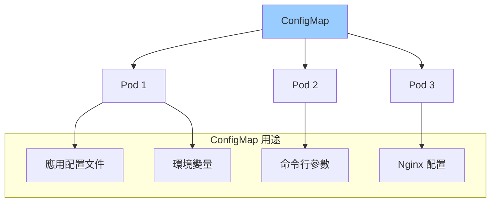
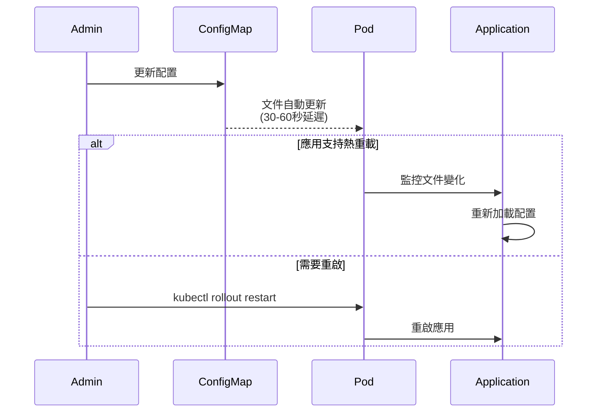
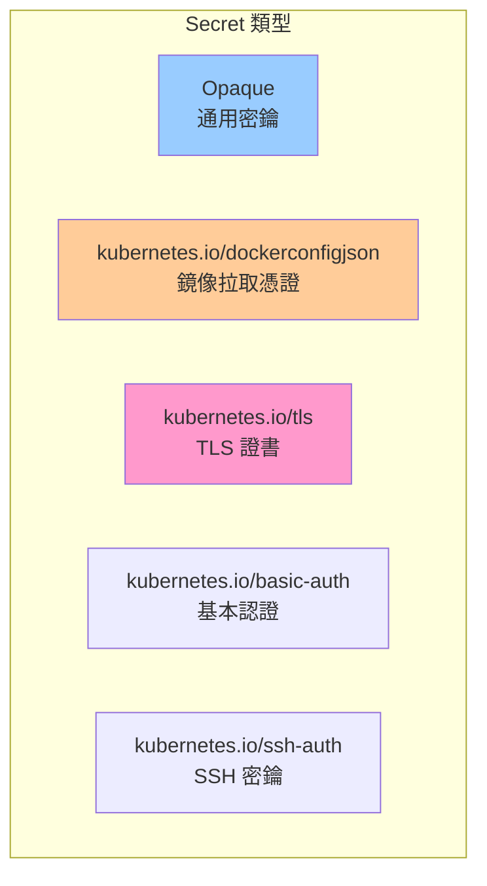
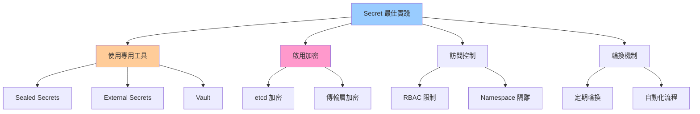
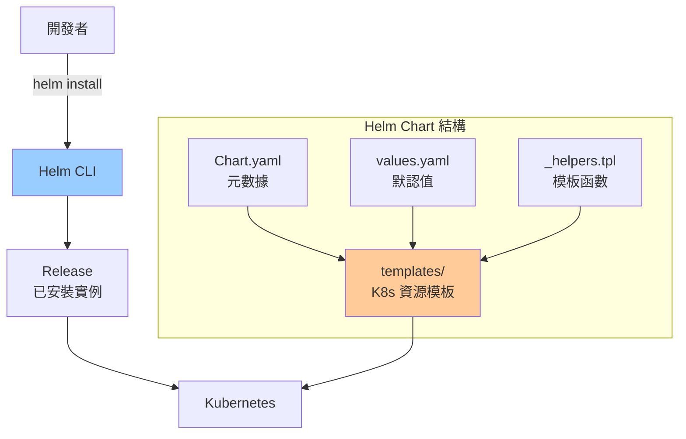
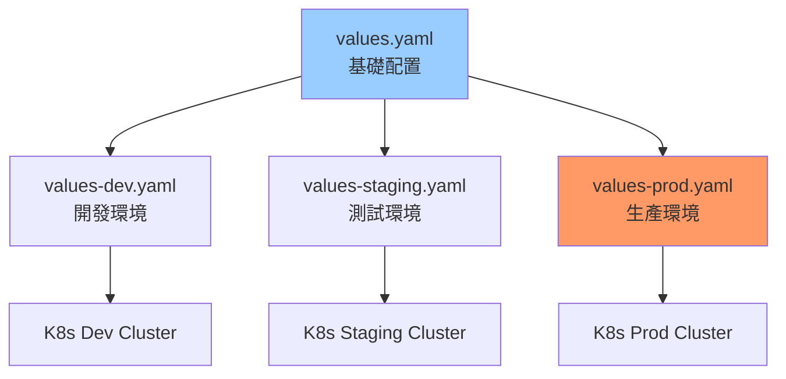
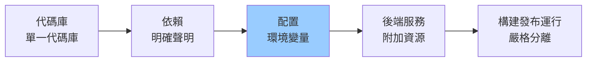

# 02-配置管理與最佳實踐

> ConfigMap、Secret、Helm 與環境配置管理

---

## 📚 本章目標

- 掌握 ConfigMap 和 Secret 使用方法
- 學習 Helm Chart 開發與管理
- 實現多環境配置管理
- 了解配置管理最佳實踐

---

## 1. ConfigMap 配置管理

### 1.1 ConfigMap 基礎



### 1.2 創建 ConfigMap

**從字面值創建：**
```bash
kubectl create configmap app-config \
  --from-literal=APP_NAME=myapp \
  --from-literal=LOG_LEVEL=info \
  --from-literal=MAX_CONNECTIONS=100
```

**從文件創建：**
```bash
kubectl create configmap nginx-config \
  --from-file=nginx.conf \
  --from-file=default.conf
```

**從目錄創建：**
```bash
kubectl create configmap app-configs \
  --from-file=configs/
```

**YAML 定義：**
```yaml
apiVersion: v1
kind: ConfigMap
metadata:
  name: app-config
  namespace: default
data:
  APP_NAME: "myapp"
  LOG_LEVEL: "info"
  MAX_CONNECTIONS: "100"
  
  database.properties: |
    host=postgres.default.svc.cluster.local
    port=5432
    database=mydb
    pool.size=20
    pool.timeout=30
  
  application.yaml: |
    server:
      port: 8080
      shutdown: graceful
    
    spring:
      datasource:
        url: jdbc:postgresql://postgres:5432/mydb
        username: ${DB_USER}
        password: ${DB_PASSWORD}
    
    logging:
      level:
        root: INFO
        com.example: DEBUG
```

### 1.3 使用 ConfigMap

**作為環境變量：**
```yaml
apiVersion: apps/v1
kind: Deployment
metadata:
  name: myapp
spec:
  template:
    spec:
      containers:
      - name: app
        image: myapp:v1.0
        
        env:
        - name: APP_NAME
          valueFrom:
            configMapKeyRef:
              name: app-config
              key: APP_NAME
        
        - name: LOG_LEVEL
          valueFrom:
            configMapKeyRef:
              name: app-config
              key: LOG_LEVEL
        
        envFrom:
        - configMapRef:
            name: app-config
```

**作為文件掛載：**
```yaml
apiVersion: apps/v1
kind: Deployment
metadata:
  name: nginx
spec:
  template:
    spec:
      containers:
      - name: nginx
        image: nginx:1.27
        volumeMounts:
        - name: config
          mountPath: /etc/nginx/nginx.conf
          subPath: nginx.conf
        - name: config
          mountPath: /etc/nginx/conf.d
      
      volumes:
      - name: config
        configMap:
          name: nginx-config
          items:
          - key: nginx.conf
            path: nginx.conf
          - key: default.conf
            path: default.conf
```

### 1.4 動態配置更新



**配置熱重載示例（Python）：**
```python
import os
import time
from watchdog.observers import Observer
from watchdog.events import FileSystemEventHandler

class ConfigReloadHandler(FileSystemEventHandler):
    def on_modified(self, event):
        if event.src_path.endswith('config.yaml'):
            print("Config file changed, reloading...")
            load_config()

def monitor_config():
    observer = Observer()
    observer.schedule(ConfigReloadHandler(), path='/etc/config', recursive=False)
    observer.start()
    
    try:
        while True:
            time.sleep(1)
    except KeyboardInterrupt:
        observer.stop()
    observer.join()
```

---

## 2. Secret 敏感信息管理

### 2.1 Secret 類型



### 2.2 創建 Secret

**從字面值創建：**
```bash
kubectl create secret generic db-credentials \
  --from-literal=username=admin \
  --from-literal=password='MyS3cretP@ssw0rd'
```

**從文件創建：**
```bash
kubectl create secret generic tls-secret \
  --from-file=tls.crt=server.crt \
  --from-file=tls.key=server.key
```

**Docker Registry 認證：**
```bash
kubectl create secret docker-registry regcred \
  --docker-server=registry.example.com \
  --docker-username=myuser \
  --docker-password=mypassword \
  --docker-email=user@example.com
```

**YAML 定義（Base64 編碼）：**
```yaml
apiVersion: v1
kind: Secret
metadata:
  name: db-credentials
type: Opaque
data:
  username: YWRtaW4=
  password: TXlTM2NyZXRQQHNzdzByZA==

---
apiVersion: v1
kind: Secret
metadata:
  name: db-credentials-string
type: Opaque
stringData:
  username: admin
  password: 'MyS3cretP@ssw0rd'
```

### 2.3 使用 Secret

**環境變量：**
```yaml
apiVersion: apps/v1
kind: Deployment
metadata:
  name: app
spec:
  template:
    spec:
      containers:
      - name: app
        image: myapp:v1.0
        env:
        - name: DB_USER
          valueFrom:
            secretKeyRef:
              name: db-credentials
              key: username
        - name: DB_PASSWORD
          valueFrom:
            secretKeyRef:
              name: db-credentials
              key: password
```

**文件掛載：**
```yaml
spec:
  containers:
  - name: app
    volumeMounts:
    - name: secrets
      mountPath: /etc/secrets
      readOnly: true
  
  volumes:
  - name: secrets
    secret:
      secretName: db-credentials
      defaultMode: 0400
```

**鏡像拉取：**
```yaml
spec:
  imagePullSecrets:
  - name: regcred
  
  containers:
  - name: app
    image: registry.example.com/myapp:v1.0
```

### 2.4 Secret 最佳實踐



**Sealed Secrets 示例：**
```bash
kubeseal --fetch-cert --controller-name=sealed-secrets --controller-namespace=kube-system > pub-cert.pem

kubectl create secret generic mysecret \
  --from-literal=password=MyS3cret \
  --dry-run=client -o yaml | \
  kubeseal --cert pub-cert.pem --format yaml > sealed-secret.yaml

kubectl apply -f sealed-secret.yaml
```

---

## 3. Helm 包管理

### 3.1 Helm 架構



### 3.2 創建 Helm Chart

**初始化：**
```bash
helm create myapp

tree myapp/
```

**輸出：**
```
myapp/
├── Chart.yaml
├── values.yaml
├── charts/
├── templates/
│   ├── NOTES.txt
│   ├── _helpers.tpl
│   ├── deployment.yaml
│   ├── service.yaml
│   ├── ingress.yaml
│   └── tests/
└── .helmignore
```

**Chart.yaml：**
```yaml
apiVersion: v2
name: myapp
description: A Helm chart for my application
type: application
version: 1.0.0
appVersion: "1.0"

keywords:
  - myapp
  - web
  - api

home: https://example.com
sources:
  - https://github.com/example/myapp

maintainers:
  - name: Your Name
    email: you@example.com
    url: https://example.com

dependencies:
  - name: postgresql
    version: "12.x.x"
    repository: https://charts.bitnami.com/bitnami
    condition: postgresql.enabled
  
  - name: redis
    version: "17.x.x"
    repository: https://charts.bitnami.com/bitnami
    condition: redis.enabled
```

**values.yaml：**
```yaml
replicaCount: 3

image:
  repository: myregistry/myapp
  pullPolicy: IfNotPresent
  tag: ""

imagePullSecrets: []

nameOverride: ""
fullnameOverride: ""

serviceAccount:
  create: true
  annotations: {}
  name: ""

podAnnotations:
  prometheus.io/scrape: "true"
  prometheus.io/port: "9090"

podSecurityContext:
  runAsNonRoot: true
  runAsUser: 1000
  fsGroup: 1000

securityContext:
  capabilities:
    drop:
    - ALL
  readOnlyRootFilesystem: true
  allowPrivilegeEscalation: false

service:
  type: ClusterIP
  port: 80
  targetPort: 8080

ingress:
  enabled: true
  className: "nginx"
  annotations:
    cert-manager.io/cluster-issuer: "letsencrypt-prod"
  hosts:
    - host: myapp.example.com
      paths:
        - path: /
          pathType: Prefix
  tls:
    - secretName: myapp-tls
      hosts:
        - myapp.example.com

resources:
  limits:
    cpu: 500m
    memory: 512Mi
  requests:
    cpu: 100m
    memory: 128Mi

autoscaling:
  enabled: true
  minReplicas: 3
  maxReplicas: 10
  targetCPUUtilizationPercentage: 70
  targetMemoryUtilizationPercentage: 80

nodeSelector: {}

tolerations: []

affinity:
  podAntiAffinity:
    preferredDuringSchedulingIgnoredDuringExecution:
    - weight: 100
      podAffinityTerm:
        labelSelector:
          matchExpressions:
          - key: app.kubernetes.io/name
            operator: In
            values:
            - myapp
        topologyKey: kubernetes.io/hostname

postgresql:
  enabled: true
  auth:
    username: myapp
    password: changeme
    database: myapp
  primary:
    persistence:
      enabled: true
      size: 10Gi

redis:
  enabled: true
  auth:
    enabled: true
    password: changeme
  master:
    persistence:
      enabled: true
      size: 5Gi
```

**templates/deployment.yaml：**
```yaml
apiVersion: apps/v1
kind: Deployment
metadata:
  name: {{ include "myapp.fullname" . }}
  labels:
    {{- include "myapp.labels" . | nindent 4 }}
spec:
  {{- if not .Values.autoscaling.enabled }}
  replicas: {{ .Values.replicaCount }}
  {{- end }}
  selector:
    matchLabels:
      {{- include "myapp.selectorLabels" . | nindent 6 }}
  template:
    metadata:
      annotations:
        checksum/config: {{ include (print $.Template.BasePath "/configmap.yaml") . | sha256sum }}
        {{- with .Values.podAnnotations }}
        {{- toYaml . | nindent 8 }}
        {{- end }}
      labels:
        {{- include "myapp.selectorLabels" . | nindent 8 }}
    spec:
      {{- with .Values.imagePullSecrets }}
      imagePullSecrets:
        {{- toYaml . | nindent 8 }}
      {{- end }}
      serviceAccountName: {{ include "myapp.serviceAccountName" . }}
      securityContext:
        {{- toYaml .Values.podSecurityContext | nindent 8 }}
      containers:
      - name: {{ .Chart.Name }}
        securityContext:
          {{- toYaml .Values.securityContext | nindent 12 }}
        image: "{{ .Values.image.repository }}:{{ .Values.image.tag | default .Chart.AppVersion }}"
        imagePullPolicy: {{ .Values.image.pullPolicy }}
        ports:
        - name: http
          containerPort: {{ .Values.service.targetPort }}
          protocol: TCP
        livenessProbe:
          httpGet:
            path: /health
            port: http
          initialDelaySeconds: 30
          periodSeconds: 10
        readinessProbe:
          httpGet:
            path: /ready
            port: http
          initialDelaySeconds: 5
          periodSeconds: 5
        resources:
          {{- toYaml .Values.resources | nindent 12 }}
        env:
        - name: DB_HOST
          value: "{{ include "myapp.fullname" . }}-postgresql"
        - name: DB_USER
          value: {{ .Values.postgresql.auth.username }}
        - name: DB_PASSWORD
          valueFrom:
            secretKeyRef:
              name: {{ include "myapp.fullname" . }}-postgresql
              key: password
        - name: REDIS_HOST
          value: "{{ include "myapp.fullname" . }}-redis-master"
        - name: REDIS_PASSWORD
          valueFrom:
            secretKeyRef:
              name: {{ include "myapp.fullname" . }}-redis
              key: redis-password
      {{- with .Values.nodeSelector }}
      nodeSelector:
        {{- toYaml . | nindent 8 }}
      {{- end }}
      {{- with .Values.affinity }}
      affinity:
        {{- toYaml . | nindent 8 }}
      {{- end }}
      {{- with .Values.tolerations }}
      tolerations:
        {{- toYaml . | nindent 8 }}
      {{- end }}
```

### 3.3 Helm 操作

**安裝：**
```bash
helm install myapp ./myapp

helm install myapp ./myapp --namespace production --create-namespace

helm install myapp ./myapp --values values-production.yaml

helm install myapp ./myapp --set replicaCount=5 --set image.tag=v2.0
```

**升級：**
```bash
helm upgrade myapp ./myapp

helm upgrade --install myapp ./myapp

helm upgrade myapp ./myapp --values values-production.yaml --atomic --timeout 10m
```

**回滾：**
```bash
helm rollback myapp

helm rollback myapp 3

helm history myapp
```

**查看：**
```bash
helm list

helm status myapp

helm get values myapp

helm get manifest myapp

helm template myapp ./myapp
```

**卸載：**
```bash
helm uninstall myapp

helm uninstall myapp --keep-history
```

---

## 4. 多環境配置管理

### 4.1 環境配置策略



**values-dev.yaml：**
```yaml
replicaCount: 1

image:
  tag: dev

resources:
  limits:
    cpu: 200m
    memory: 256Mi
  requests:
    cpu: 50m
    memory: 64Mi

postgresql:
  enabled: true
  primary:
    persistence:
      enabled: false

redis:
  enabled: true
  master:
    persistence:
      enabled: false

ingress:
  enabled: true
  hosts:
    - host: myapp-dev.example.com
      paths:
        - path: /
          pathType: Prefix
```

**values-prod.yaml：**
```yaml
replicaCount: 5

image:
  tag: "1.0.0"

resources:
  limits:
    cpu: 1000m
    memory: 1Gi
  requests:
    cpu: 500m
    memory: 512Mi

autoscaling:
  enabled: true
  minReplicas: 5
  maxReplicas: 20
  targetCPUUtilizationPercentage: 60

postgresql:
  enabled: false

externalDatabase:
  host: prod-db.example.com
  port: 5432
  user: myapp_prod
  database: myapp_prod
  existingSecret: prod-db-secret

redis:
  enabled: false

externalRedis:
  host: prod-redis.example.com
  port: 6379
  existingSecret: prod-redis-secret

ingress:
  enabled: true
  className: "nginx"
  annotations:
    nginx.ingress.kubernetes.io/rate-limit: "100"
    nginx.ingress.kubernetes.io/ssl-redirect: "true"
  hosts:
    - host: myapp.example.com
      paths:
        - path: /
          pathType: Prefix
  tls:
    - secretName: myapp-prod-tls
      hosts:
        - myapp.example.com
```

### 4.2 Kustomize 配置管理

**目錄結構：**
```
k8s/
├── base/
│   ├── kustomization.yaml
│   ├── deployment.yaml
│   ├── service.yaml
│   └── configmap.yaml
├── overlays/
│   ├── dev/
│   │   ├── kustomization.yaml
│   │   └── patch-replica.yaml
│   ├── staging/
│   │   ├── kustomization.yaml
│   │   └── patch-resources.yaml
│   └── production/
│       ├── kustomization.yaml
│       ├── patch-replica.yaml
│       └── patch-resources.yaml
```

**base/kustomization.yaml：**
```yaml
apiVersion: kustomize.config.k8s.io/v1beta1
kind: Kustomization

resources:
  - deployment.yaml
  - service.yaml
  - configmap.yaml

commonLabels:
  app: myapp

configMapGenerator:
  - name: app-config
    literals:
      - APP_NAME=myapp
      - LOG_LEVEL=info
```

**overlays/production/kustomization.yaml：**
```yaml
apiVersion: kustomize.config.k8s.io/v1beta1
kind: Kustomization

namespace: production

bases:
  - ../../base

patchesStrategicMerge:
  - patch-replica.yaml
  - patch-resources.yaml

replicas:
  - name: myapp
    count: 5

images:
  - name: myapp
    newName: registry.example.com/myapp
    newTag: v1.0.0

configMapGenerator:
  - name: app-config
    behavior: merge
    literals:
      - LOG_LEVEL=warn
      - ENVIRONMENT=production
```

**應用配置：**
```bash
kubectl apply -k k8s/base

kubectl apply -k k8s/overlays/production

kustomize build k8s/overlays/production | kubectl apply -f -
```

---

## 5. 配置管理最佳實踐

### 5.1 十二要素應用



**配置外部化：**
- ✅ 使用環境變量而非硬編碼
- ✅ 敏感信息使用 Secret
- ✅ 配置文件使用 ConfigMap
- ✅ 不同環境使用不同配置

### 5.2 配置版本控制

```bash
k8s-config/
├── base/
├── environments/
│   ├── dev/
│   ├── staging/
│   └── production/
└── .gitignore
```

**.gitignore：**
```
*.secret.yaml
values-local.yaml
.env
secrets/
```

**使用 Sealed Secrets：**
```bash
echo -n 'MyS3cret' | kubectl create secret generic mysecret \
  --dry-run=client \
  --from-file=password=/dev/stdin \
  -o yaml | \
kubeseal -o yaml > sealed-secret.yaml

git add sealed-secret.yaml
git commit -m "Add sealed secret"
```

### 5.3 配置驗證

```bash
helm lint ./myapp

helm template myapp ./myapp | kubectl apply --dry-run=client -f -

kubeval deployment.yaml

kustomize build k8s/overlays/production | kubeval -
```

---

## 6. 小結

本章介紹了 Kubernetes 配置管理的核心工具與最佳實踐：

**ConfigMap：**
- ✅ 非敏感配置管理
- ✅ 支持環境變量和文件掛載
- ✅ 支持動態更新（需應用支持）

**Secret：**
- ✅ 敏感信息管理（Base64 編碼）
- ✅ 使用 Sealed Secrets/Vault 增強安全
- ✅ 啟用 etcd 加密

**Helm：**
- ✅ 包管理和版本控制
- ✅ 模板化配置
- ✅ 支持依賴管理和回滾

**多環境管理：**
- ✅ Helm values 文件分層
- ✅ Kustomize overlay 機制
- ✅ 配置版本控制與驗證

下一章將學習服務網格與微服務通信模式。
