# 03-服務網格與微服務通信

> Service Mesh 基礎、服務間通信模式與流量管理

---

## 📚 本章目標

- 理解微服務通信的挑戰與解決方案
- 掌握 Kubernetes 原生服務發現機制
- 了解 Service Mesh 的核心概念
- 學習 Istio 基礎與實戰應用
- 實現灰度發布與流量管理

---

## 1. 微服務通信挑戰

### 1.1 傳統問題

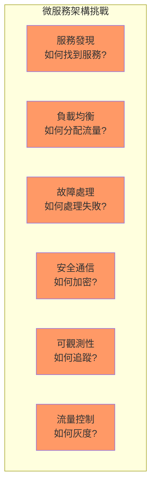

### 1.2 解決方案演進

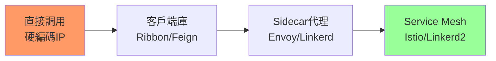

**演進對比：**

| 方案 | 優點 | 缺點 | 適用場景 |
|-----|------|------|---------|
| **硬編碼** | 簡單直接 | 維護困難、不靈活 | 小型單體 |
| **客戶端庫** | 功能豐富 | 語言綁定、侵入性強 | 單語言微服務 |
| **Sidecar** | 語言無關 | 資源開銷 | 多語言微服務 |
| **Service Mesh** | 統一管理 | 複雜度高 | 大規模微服務 |

---

## 2. Kubernetes 原生服務發現

### 2.1 DNS 服務發現

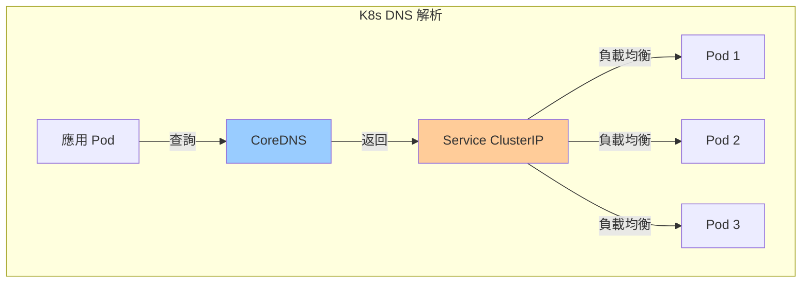

**DNS 命名規則：**
```
<service-name>.<namespace>.svc.cluster.local
```

**示例：**
```yaml
apiVersion: v1
kind: Service
metadata:
  name: backend
  namespace: production
spec:
  selector:
    app: backend
  ports:
  - port: 80
    targetPort: 8080
```

**應用內訪問：**
```python
import requests

response = requests.get('http://backend.production.svc.cluster.local')

response = requests.get('http://backend.production')

response = requests.get('http://backend')
```

### 2.2 環境變量發現

**Kubernetes 自動注入：**
```bash
BACKEND_SERVICE_HOST=10.96.100.50
BACKEND_SERVICE_PORT=80
BACKEND_PORT=tcp://10.96.100.50:80
BACKEND_PORT_80_TCP=tcp://10.96.100.50:80
BACKEND_PORT_80_TCP_PROTO=tcp
BACKEND_PORT_80_TCP_PORT=80
BACKEND_PORT_80_TCP_ADDR=10.96.100.50
```

**應用使用：**
```python
import os

backend_host = os.getenv('BACKEND_SERVICE_HOST')
backend_port = os.getenv('BACKEND_SERVICE_PORT')

url = f'http://{backend_host}:{backend_port}/api/users'
```

### 2.3 Headless Service

```yaml
apiVersion: v1
kind: Service
metadata:
  name: mysql
spec:
  clusterIP: None
  selector:
    app: mysql
  ports:
  - port: 3306
```

**用途：**
- StatefulSet 穩定網絡標識
- 客戶端自行負載均衡
- 服務發現返回所有 Pod IP

**DNS 解析：**
```
mysql-0.mysql.default.svc.cluster.local -> Pod IP
mysql-1.mysql.default.svc.cluster.local -> Pod IP
mysql-2.mysql.default.svc.cluster.local -> Pod IP
```

---

## 3. Service Mesh 核心概念

### 3.1 架構概覽

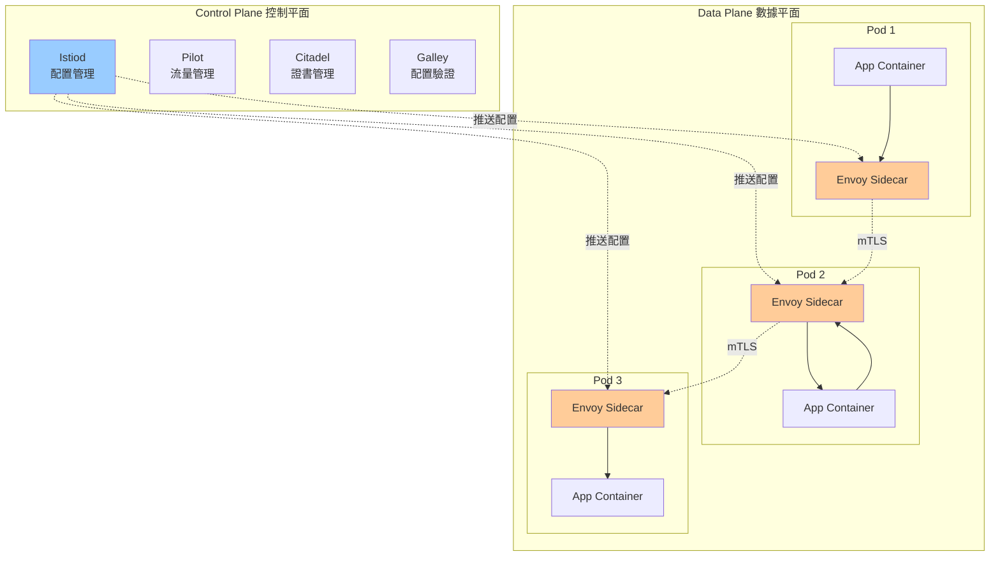

### 3.2 核心功能

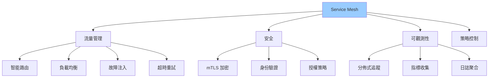

---

## 4. Istio 快速入門

### 4.1 安裝 Istio

```bash
curl -L https://istio.io/downloadIstio | sh -
cd istio-1.20.0
export PATH=$PWD/bin:$PATH

istioctl install --set profile=demo -y

kubectl label namespace default istio-injection=enabled

kubectl get pods -n istio-system
```

**預期輸出：**
```
NAME                                    READY   STATUS    RESTARTS   AGE
istio-ingressgateway-xxx                1/1     Running   0          2m
istiod-xxx                              1/1     Running   0          2m
```

### 4.2 自動注入 Sidecar

**啟用 namespace 自動注入：**
```bash
kubectl label namespace default istio-injection=enabled

kubectl get namespace -L istio-injection
```

**部署應用：**
```yaml
apiVersion: apps/v1
kind: Deployment
metadata:
  name: productpage
spec:
  replicas: 1
  selector:
    matchLabels:
      app: productpage
  template:
    metadata:
      labels:
        app: productpage
        version: v1
    spec:
      containers:
      - name: productpage
        image: docker.io/istio/examples-bookinfo-productpage-v1:1.18.0
        ports:
        - containerPort: 9080
```

**驗證 Sidecar 注入：**
```bash
kubectl apply -f productpage.yaml

kubectl get pods

kubectl describe pod productpage-xxx | grep -A 5 "Containers:"
```

**預期看到兩個容器：**
- `productpage`（應用容器）
- `istio-proxy`（Envoy sidecar）

### 4.3 Istio 流量管理物件

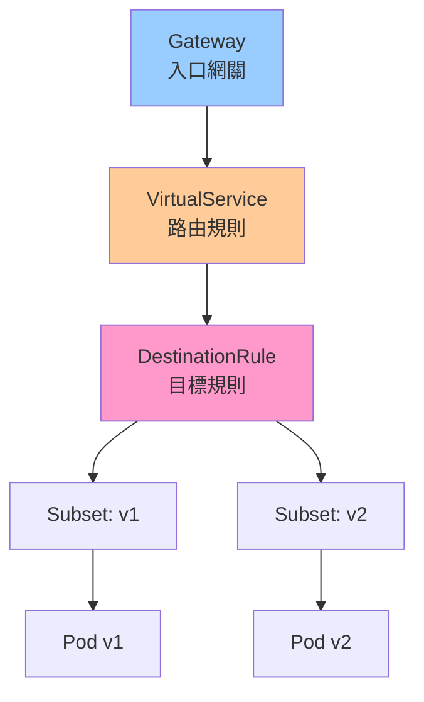

---

## 5. 流量管理實戰

### 5.1 基礎路由

**VirtualService 定義：**
```yaml
apiVersion: networking.istio.io/v1beta1
kind: VirtualService
metadata:
  name: reviews
spec:
  hosts:
  - reviews
  http:
  - route:
    - destination:
        host: reviews
        subset: v1
      weight: 100
```

**DestinationRule 定義：**
```yaml
apiVersion: networking.istio.io/v1beta1
kind: DestinationRule
metadata:
  name: reviews
spec:
  host: reviews
  subsets:
  - name: v1
    labels:
      version: v1
  - name: v2
    labels:
      version: v2
  - name: v3
    labels:
      version: v3
```

### 5.2 灰度發布（金絲雀部署）

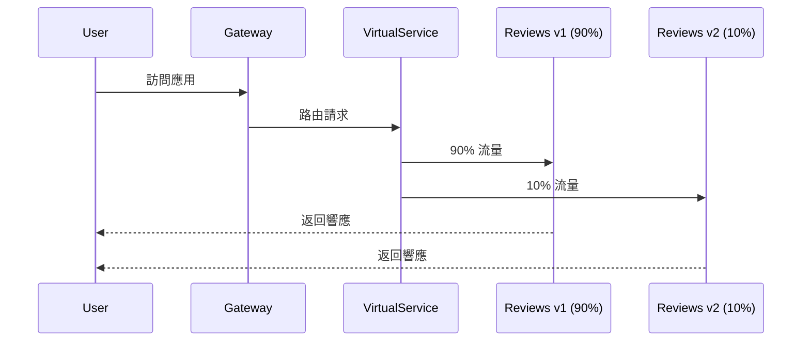

**配置示例：**
```yaml
apiVersion: networking.istio.io/v1beta1
kind: VirtualService
metadata:
  name: reviews-canary
spec:
  hosts:
  - reviews
  http:
  - match:
    - headers:
        end-user:
          exact: beta-tester
    route:
    - destination:
        host: reviews
        subset: v2
      weight: 100
  
  - route:
    - destination:
        host: reviews
        subset: v1
      weight: 90
    - destination:
        host: reviews
        subset: v2
      weight: 10
```

**逐步增加流量：**
```bash
kubectl apply -f - <<EOF
apiVersion: networking.istio.io/v1beta1
kind: VirtualService
metadata:
  name: reviews-canary
spec:
  hosts:
  - reviews
  http:
  - route:
    - destination:
        host: reviews
        subset: v1
      weight: 50
    - destination:
        host: reviews
        subset: v2
      weight: 50
EOF

kubectl apply -f - <<EOF
apiVersion: networking.istio.io/v1beta1
kind: VirtualService
metadata:
  name: reviews-canary
spec:
  hosts:
  - reviews
  http:
  - route:
    - destination:
        host: reviews
        subset: v2
      weight: 100
EOF
```

### 5.3 A/B 測試

```yaml
apiVersion: networking.istio.io/v1beta1
kind: VirtualService
metadata:
  name: reviews-ab-test
spec:
  hosts:
  - reviews
  http:
  - match:
    - headers:
        user-agent:
          regex: ".*Mobile.*"
    route:
    - destination:
        host: reviews
        subset: mobile
  
  - match:
    - headers:
        cookie:
          regex: "^(.*?;)?(version=v2)(;.*)?$"
    route:
    - destination:
        host: reviews
        subset: v2
  
  - route:
    - destination:
        host: reviews
        subset: v1
```

### 5.4 故障注入測試

**延遲注入：**
```yaml
apiVersion: networking.istio.io/v1beta1
kind: VirtualService
metadata:
  name: ratings-delay
spec:
  hosts:
  - ratings
  http:
  - fault:
      delay:
        percentage:
          value: 10.0
        fixedDelay: 5s
    route:
    - destination:
        host: ratings
        subset: v1
```

**錯誤注入：**
```yaml
apiVersion: networking.istio.io/v1beta1
kind: VirtualService
metadata:
  name: ratings-abort
spec:
  hosts:
  - ratings
  http:
  - fault:
      abort:
        percentage:
          value: 10.0
        httpStatus: 500
    route:
    - destination:
        host: ratings
        subset: v1
```

---

## 6. 彈性與可靠性

### 6.1 超時與重試

```yaml
apiVersion: networking.istio.io/v1beta1
kind: VirtualService
metadata:
  name: reviews-timeout
spec:
  hosts:
  - reviews
  http:
  - route:
    - destination:
        host: reviews
        subset: v1
    
    timeout: 3s
    
    retries:
      attempts: 3
      perTryTimeout: 1s
      retryOn: 5xx,reset,connect-failure,refused-stream
```

### 6.2 熔斷器（Circuit Breaker）

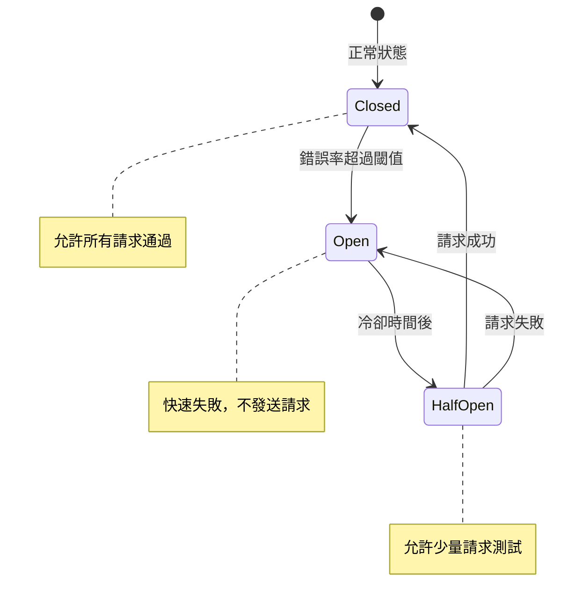

**配置示例：**
```yaml
apiVersion: networking.istio.io/v1beta1
kind: DestinationRule
metadata:
  name: reviews-circuit-breaker
spec:
  host: reviews
  trafficPolicy:
    connectionPool:
      tcp:
        maxConnections: 100
      http:
        http1MaxPendingRequests: 10
        http2MaxRequests: 100
        maxRequestsPerConnection: 2
    
    outlierDetection:
      consecutiveErrors: 5
      interval: 30s
      baseEjectionTime: 30s
      maxEjectionPercent: 50
      minHealthPercent: 40
```

**參數說明：**
- `consecutiveErrors: 5` - 連續 5 次錯誤觸發熔斷
- `interval: 30s` - 每 30 秒檢查一次
- `baseEjectionTime: 30s` - 熔斷持續 30 秒
- `maxEjectionPercent: 50` - 最多熔斷 50% 實例

### 6.3 負載均衡策略

```yaml
apiVersion: networking.istio.io/v1beta1
kind: DestinationRule
metadata:
  name: reviews-lb
spec:
  host: reviews
  trafficPolicy:
    loadBalancer:
      simple: LEAST_REQUEST
    
  subsets:
  - name: v1
    labels:
      version: v1
    trafficPolicy:
      loadBalancer:
        consistentHash:
          httpHeaderName: "x-user-id"
```

**負載均衡算法：**
- `ROUND_ROBIN` - 輪詢（默認）
- `LEAST_REQUEST` - 最少請求
- `RANDOM` - 隨機
- `PASSTHROUGH` - 直連
- `consistentHash` - 一致性哈希（會話保持）

---

## 7. 安全通信

### 7.1 mTLS 雙向認證

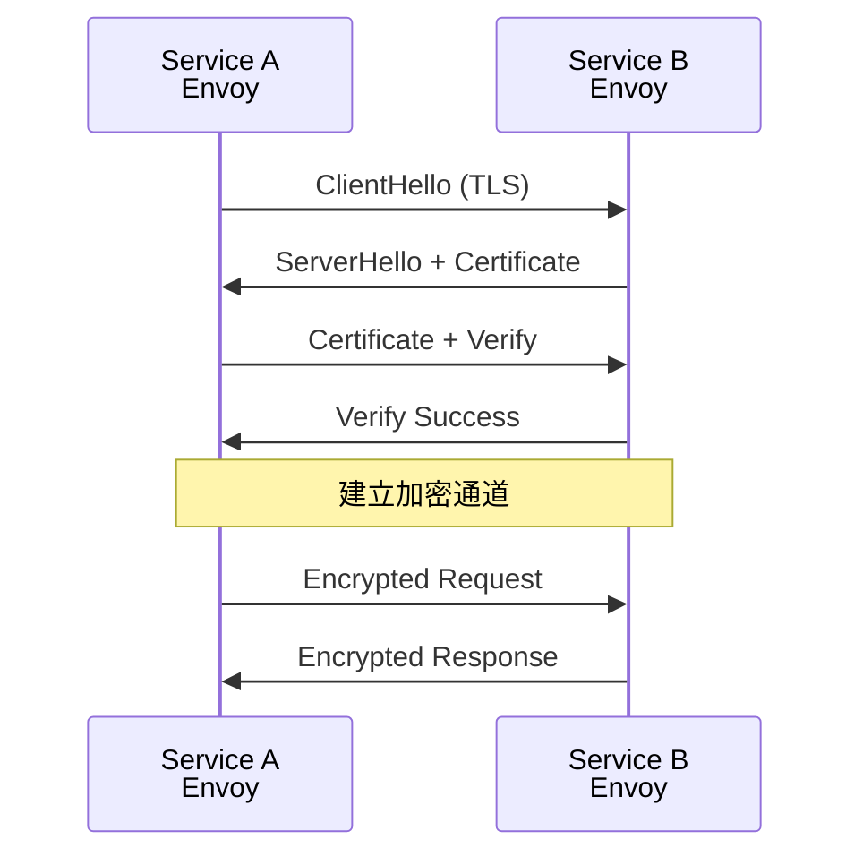

**啟用 mTLS：**
```yaml
apiVersion: security.istio.io/v1beta1
kind: PeerAuthentication
metadata:
  name: default
  namespace: default
spec:
  mtls:
    mode: STRICT
```

**模式說明：**
- `STRICT` - 強制 mTLS
- `PERMISSIVE` - 允許明文或 mTLS
- `DISABLE` - 禁用 mTLS

### 7.2 授權策略

```yaml
apiVersion: security.istio.io/v1beta1
kind: AuthorizationPolicy
metadata:
  name: reviews-viewer
  namespace: default
spec:
  selector:
    matchLabels:
      app: reviews
  
  action: ALLOW
  
  rules:
  - from:
    - source:
        principals: ["cluster.local/ns/default/sa/productpage"]
    to:
    - operation:
        methods: ["GET"]
        paths: ["/reviews/*"]
```

**拒絕策略：**
```yaml
apiVersion: security.istio.io/v1beta1
kind: AuthorizationPolicy
metadata:
  name: deny-all
  namespace: default
spec:
  action: DENY
  rules:
  - from:
    - source:
        notNamespaces: ["default"]
```

---

## 8. 可觀測性

### 8.1 分佈式追蹤

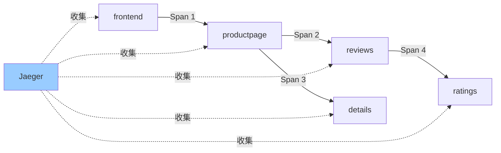

**應用需要傳遞 Headers：**
```python
import requests

TRACE_HEADERS = [
    'x-request-id',
    'x-b3-traceid',
    'x-b3-spanid',
    'x-b3-parentspanid',
    'x-b3-sampled',
    'x-b3-flags',
    'x-ot-span-context'
]

def forward_request(url, incoming_headers):
    headers = {}
    for header in TRACE_HEADERS:
        if header in incoming_headers:
            headers[header] = incoming_headers[header]
    
    return requests.get(url, headers=headers)
```

### 8.2 Prometheus 指標

**Istio 自動生成指標：**
```yaml
apiVersion: telemetry.istio.io/v1alpha1
kind: Telemetry
metadata:
  name: metrics
spec:
  metrics:
  - providers:
    - name: prometheus
    
    dimensions:
      source_app:
        value: source.workload.name
      destination_app:
        value: destination.workload.name
```

**常用指標查詢：**
```promql
# 請求速率
rate(istio_requests_total[5m])

# 成功率
sum(rate(istio_requests_total{response_code!~"5.*"}[5m])) 
/ 
sum(rate(istio_requests_total[5m]))

# P99 延遲
histogram_quantile(0.99, 
  sum(rate(istio_request_duration_milliseconds_bucket[5m])) by (le)
)
```

---

## 9. 完整示例：Bookinfo 應用

### 9.1 架構

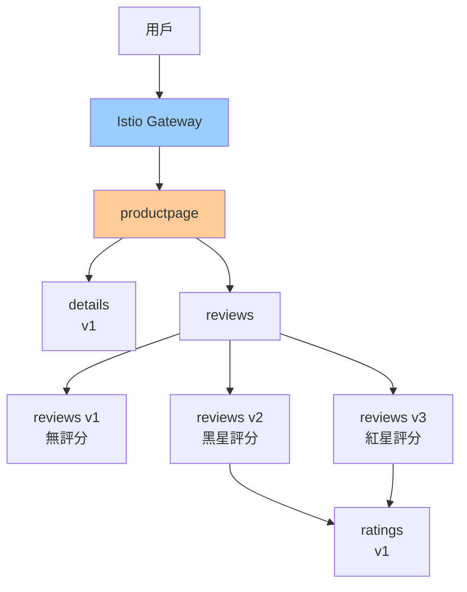

### 9.2 部署應用

```bash
kubectl apply -f samples/bookinfo/platform/kube/bookinfo.yaml

kubectl apply -f samples/bookinfo/networking/bookinfo-gateway.yaml

export GATEWAY_URL=$(kubectl -n istio-system get service istio-ingressgateway -o jsonpath='{.status.loadBalancer.ingress[0].ip}')

curl http://$GATEWAY_URL/productpage
```

### 9.3 流量管理示例

**1. 全部流量到 v1：**
```bash
kubectl apply -f - <<EOF
apiVersion: networking.istio.io/v1beta1
kind: VirtualService
metadata:
  name: reviews
spec:
  hosts:
  - reviews
  http:
  - route:
    - destination:
        host: reviews
        subset: v1
EOF
```

**2. 基於用戶的路由：**
```bash
kubectl apply -f - <<EOF
apiVersion: networking.istio.io/v1beta1
kind: VirtualService
metadata:
  name: reviews
spec:
  hosts:
  - reviews
  http:
  - match:
    - headers:
        end-user:
          exact: jason
    route:
    - destination:
        host: reviews
        subset: v2
  - route:
    - destination:
        host: reviews
        subset: v1
EOF
```

**3. 金絲雀發布：**
```bash
kubectl apply -f - <<EOF
apiVersion: networking.istio.io/v1beta1
kind: VirtualService
metadata:
  name: reviews
spec:
  hosts:
  - reviews
  http:
  - route:
    - destination:
        host: reviews
        subset: v1
      weight: 80
    - destination:
        host: reviews
        subset: v3
      weight: 20
EOF
```

---

## 10. 最佳實踐

### 10.1 何時使用 Service Mesh

**推薦場景：**
- ✅ 多語言微服務架構
- ✅ 需要細粒度流量控制
- ✅ 需要 mTLS 加密
- ✅ 需要分佈式追蹤
- ✅ 服務數量 > 20

**不推薦場景：**
- ❌ 單體應用或少量服務
- ❌ 資源受限環境
- ❌ 團隊缺乏運維能力
- ❌ 簡單的服務通信需求

### 10.2 性能優化

```yaml
apiVersion: networking.istio.io/v1beta1
kind: DestinationRule
metadata:
  name: reviews-optimization
spec:
  host: reviews
  trafficPolicy:
    connectionPool:
      tcp:
        maxConnections: 100
        connectTimeout: 30ms
      http:
        http1MaxPendingRequests: 1024
        http2MaxRequests: 1024
        maxRequestsPerConnection: 10
        idleTimeout: 60s
    
    loadBalancer:
      simple: LEAST_REQUEST
      localityLbSetting:
        enabled: true
        distribute:
        - from: us-east-1a
          to:
            "us-east-1a": 80
            "us-east-1b": 20
```

### 10.3 故障排查

```bash
istioctl analyze

istioctl proxy-status

istioctl proxy-config cluster <pod-name>

istioctl proxy-config route <pod-name>

istioctl proxy-config endpoint <pod-name>

kubectl logs <pod-name> -c istio-proxy

kubectl exec -it <pod-name> -c istio-proxy -- curl localhost:15000/stats
```

---

## 11. 小結

本章介紹了微服務通信與 Service Mesh 的核心概念：

**Kubernetes 原生能力：**
- ✅ DNS 服務發現（推薦）
- ✅ 環境變量發現
- ✅ Headless Service（StatefulSet）

**Service Mesh（Istio）：**
- ✅ 流量管理（灰度發布、A/B 測試）
- ✅ 彈性設計（超時、重試、熔斷）
- ✅ 安全通信（mTLS、授權策略）
- ✅ 可觀測性（追蹤、指標、日誌）

**關鍵要點：**
- 🎯 小規模服務使用 K8s 原生能力即可
- 🎯 大規模微服務架構考慮 Service Mesh
- 🎯 灰度發布是生產環境的標準實踐
- 🎯 mTLS 提供零信任網絡安全
- 🎯 分佈式追蹤需要應用傳遞 Headers

下一章將深入學習高可用與彈性設計，包括自動擴縮容、健康檢查等生產環境必備技能。
