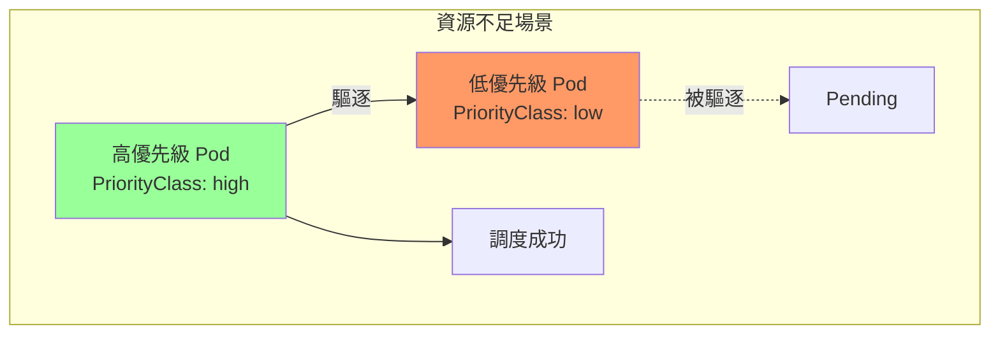
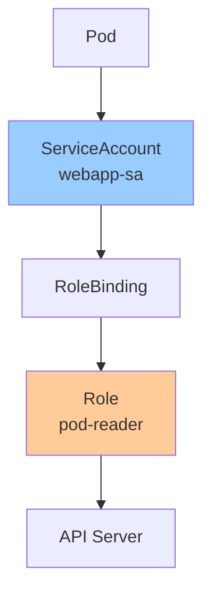

# 04-進階資源使用

> 掌握 Kubernetes 進階資源配置與管理

---

## 📚 本章目標

- 掌握 PriorityClass 優先級調度
- 學會 RBAC 權限管理
- 理解 ServiceAccount 身份認證
- 掌握 Custom Resource Definition (CRD)
- 了解 Admission Webhook 機制

---

## 1. PriorityClass（優先級類別）

### 1.1 優先級調度原理



### 1.2 創建 PriorityClass

```yaml
# 高優先級
apiVersion: scheduling.k8s.io/v1
kind: PriorityClass
metadata:
  name: high-priority
value: 1000000
globalDefault: false
description: "用於關鍵業務服務"

---
# 中等優先級
apiVersion: scheduling.k8s.io/v1
kind: PriorityClass
metadata:
  name: medium-priority
value: 100000
globalDefault: true
description: "默認優先級"

---
# 低優先級
apiVersion: scheduling.k8s.io/v1
kind: PriorityClass
metadata:
  name: low-priority
value: 1000
globalDefault: false
description: "用於批處理任務"
```

### 1.3 使用 PriorityClass

```yaml
apiVersion: apps/v1
kind: Deployment
metadata:
  name: critical-app
spec:
  replicas: 3
  selector:
    matchLabels:
      app: critical-app
  template:
    metadata:
      labels:
        app: critical-app
    spec:
      priorityClassName: high-priority
      containers:
      - name: app
        image: myapp:v1.0
        resources:
          requests:
            cpu: 500m
            memory: 512Mi
```

---

## 2. ServiceAccount 與 RBAC

### 2.1 RBAC 架構



### 2.2 創建 ServiceAccount

```yaml
apiVersion: v1
kind: ServiceAccount
metadata:
  name: webapp-sa
  namespace: production
```

### 2.3 創建 Role

```yaml
# Role（命名空間級別）
apiVersion: rbac.authorization.k8s.io/v1
kind: Role
metadata:
  name: pod-reader
  namespace: production
rules:
- apiGroups: [""]
  resources: ["pods"]
  verbs: ["get", "watch", "list"]

- apiGroups: [""]
  resources: ["pods/log"]
  verbs: ["get"]

---
# ClusterRole（集群級別）
apiVersion: rbac.authorization.k8s.io/v1
kind: ClusterRole
metadata:
  name: secret-reader
rules:
- apiGroups: [""]
  resources: ["secrets"]
  verbs: ["get", "watch", "list"]
```

### 2.4 創建 RoleBinding

```yaml
# RoleBinding
apiVersion: rbac.authorization.k8s.io/v1
kind: RoleBinding
metadata:
  name: read-pods
  namespace: production
subjects:
- kind: ServiceAccount
  name: webapp-sa
  namespace: production
roleRef:
  kind: Role
  name: pod-reader
  apiGroup: rbac.authorization.k8s.io

---
# ClusterRoleBinding
apiVersion: rbac.authorization.k8s.io/v1
kind: ClusterRoleBinding
metadata:
  name: read-secrets-global
subjects:
- kind: ServiceAccount
  name: webapp-sa
  namespace: production
roleRef:
  kind: ClusterRole
  name: secret-reader
  apiGroup: rbac.authorization.k8s.io
```

### 2.5 Pod 使用 ServiceAccount

```yaml
apiVersion: v1
kind: Pod
metadata:
  name: webapp
  namespace: production
spec:
  serviceAccountName: webapp-sa
  containers:
  - name: app
    image: myapp:v1.0
```

---

## 3. Custom Resource Definition (CRD)

### 3.1 創建 CRD

```yaml
apiVersion: apiextensions.k8s.io/v1
kind: CustomResourceDefinition
metadata:
  name: webapps.example.com
spec:
  group: example.com
  versions:
  - name: v1
    served: true
    storage: true
    schema:
      openAPIV3Schema:
        type: object
        properties:
          spec:
            type: object
            properties:
              replicas:
                type: integer
                minimum: 1
                maximum: 10
              image:
                type: string
              port:
                type: integer
          status:
            type: object
            properties:
              availableReplicas:
                type: integer
  scope: Namespaced
  names:
    plural: webapps
    singular: webapp
    kind: WebApp
    shortNames:
    - wa
```

### 3.2 使用 Custom Resource

```yaml
apiVersion: example.com/v1
kind: WebApp
metadata:
  name: my-webapp
spec:
  replicas: 3
  image: myapp:v1.0
  port: 8080
```

---

## 4. 最佳實踐

### 4.1 安全配置

```yaml
# ✅ 最小權限原則
apiVersion: rbac.authorization.k8s.io/v1
kind: Role
metadata:
  name: minimal-role
rules:
- apiGroups: [""]
  resources: ["configmaps"]
  verbs: ["get"]
  resourceNames: ["my-config"]    # 限制特定資源
```

### 4.2 優先級設置

```yaml
# ✅ 關鍵服務使用高優先級
apiVersion: apps/v1
kind: Deployment
metadata:
  name: api-server
spec:
  template:
    spec:
      priorityClassName: high-priority
      
      # 配合 PDB 保護
      # 參考 01-基礎篇/07-配置資源詳解.md PDB 章節
```

---

## 5. 小結

本章介紹了 Kubernetes 進階資源：

- ✅ **PriorityClass**：優先級調度
- ✅ **ServiceAccount & RBAC**：權限管理
- ✅ **CRD**：自定義資源

下一章將深入學習 Helm 包管理。

---

## 參考資料 (References)

1. [Kubernetes 官方文檔 - Pod Priority](https://kubernetes.io/docs/concepts/scheduling-eviction/pod-priority-preemption/)
2. [Kubernetes 官方文檔 - RBAC](https://kubernetes.io/docs/reference/access-authn-authz/rbac/)
3. [Kubernetes 官方文檔 - CRD](https://kubernetes.io/docs/tasks/extend-kubernetes/custom-resources/custom-resource-definitions/)
