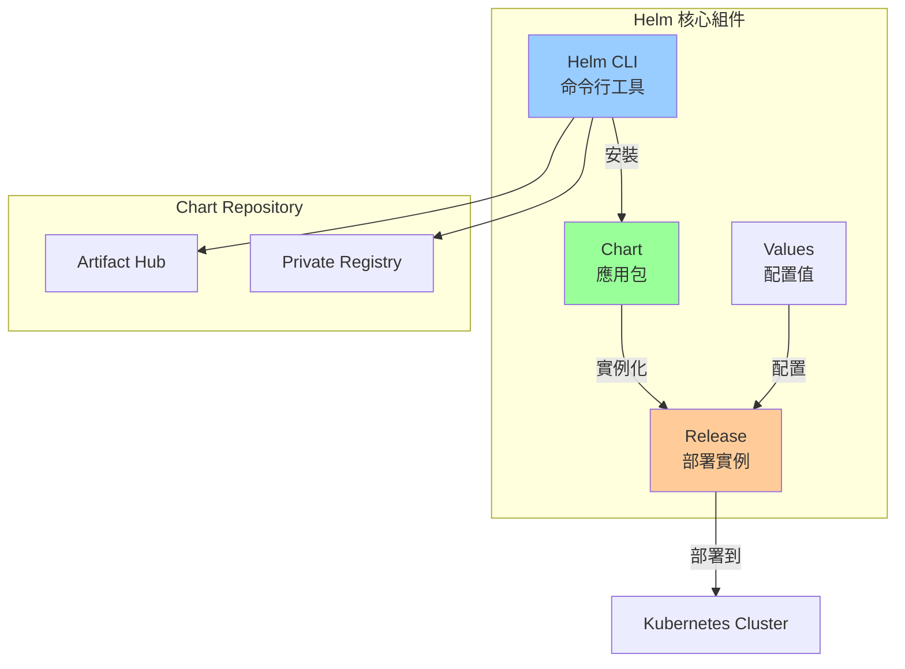

# 05-Helm 包管理深度實戰

> 從零到一掌握 Helm，從使用到開發的完整指南

---

## 📚 本章目標

- 理解 Helm 架構與核心概念
- 掌握 Helm Chart 的安裝與管理
- 學會開發自定義 Helm Chart
- 掌握模板語法與最佳實踐
- 學會管理 Chart 依賴與版本

---

## 1. Helm 基礎概念

### 1.1 Helm 是什麼

Helm 是 Kubernetes 的包管理器，類似於 Linux 的 apt/yum。



**為什麼需要 Helm？**
- ✅ 簡化複雜應用部署（一個命令部署整個微服務棧）
- ✅ 版本管理與回滾
- ✅ 配置管理（不同環境使用不同配置）
- ✅ 依賴管理（自動安裝依賴服務）
- ✅ 模板化（複用配置）

---

### 1.2 Helm 2 vs Helm 3

| 特性 | Helm 2 | Helm 3 |
|-----|--------|--------|
| **Tiller** | ❌ 需要 Tiller（服務端組件） | ✅ 無需 Tiller |
| **安全性** | ❌ Tiller 需要高權限 | ✅ 更安全 |
| **Release 存儲** | ConfigMap/Secret（Tiller 命名空間） | Secret（Release 命名空間） |
| **CRD 管理** | ❌ 不完善 | ✅ 改進 |
| **三路合併** | ❌ 無 | ✅ 支持 |

---

### 1.3 安裝 Helm

```bash
# macOS
brew install helm

# Linux
curl https://raw.githubusercontent.com/helm/helm/main/scripts/get-helm-3 | bash

# Windows
choco install kubernetes-helm

# 驗證安裝
helm version
# version.BuildInfo{Version:"v3.13.0", GitCommit:"...", GoVersion:"go1.21.0"}
```

---

## 2. 使用 Helm Chart

### 2.1 添加 Chart Repository

```bash
# 添加官方 stable repo
helm repo add stable https://charts.helm.sh/stable

# 添加常用 repos
helm repo add bitnami https://charts.bitnami.com/bitnami
helm repo add ingress-nginx https://kubernetes.github.io/ingress-nginx
helm repo add prometheus-community https://prometheus-community.github.io/helm-charts
helm repo add jetstack https://charts.jetstack.io

# 更新 repo 索引
helm repo update

# 列出所有 repos
helm repo list
```

---

### 2.2 搜索與查看 Chart

```bash
# 搜索 Chart
helm search repo nginx
helm search hub wordpress    # 在 Artifact Hub 搜索

# 查看 Chart 信息
helm show chart bitnami/nginx
helm show readme bitnami/nginx
helm show values bitnami/nginx    # 查看默認配置
```

---

### 2.3 安裝 Chart

```bash
# 基本安裝
helm install my-nginx bitnami/nginx

# 指定命名空間
helm install my-nginx bitnami/nginx --namespace production --create-namespace

# 使用自定義 values
helm install my-nginx bitnami/nginx \
  --set replicaCount=3 \
  --set service.type=LoadBalancer

# 使用 values 文件
helm install my-nginx bitnami/nginx -f custom-values.yaml

# 多個 values 文件（後者覆蓋前者）
helm install my-nginx bitnami/nginx \
  -f values-common.yaml \
  -f values-production.yaml

# 組合使用
helm install my-nginx bitnami/nginx \
  -f values-production.yaml \
  --set replicaCount=5

# 查看安裝前的渲染結果（不實際安裝）
helm install my-nginx bitnami/nginx --dry-run --debug

# 等待就緒
helm install my-nginx bitnami/nginx --wait --timeout 5m
```

---

### 2.4 自定義 Values 文件

```yaml
# values-production.yaml
replicaCount: 3

image:
  repository: myregistry.io/nginx
  tag: "1.27-alpine"
  pullPolicy: IfNotPresent

service:
  type: LoadBalancer
  port: 80
  annotations:
    service.beta.kubernetes.io/aws-load-balancer-type: "nlb"

resources:
  requests:
    cpu: 100m
    memory: 128Mi
  limits:
    cpu: 500m
    memory: 512Mi

ingress:
  enabled: true
  className: nginx
  hosts:
    - host: myapp.example.com
      paths:
        - path: /
          pathType: Prefix
  tls:
    - secretName: myapp-tls
      hosts:
        - myapp.example.com

autoscaling:
  enabled: true
  minReplicas: 3
  maxReplicas: 10
  targetCPUUtilizationPercentage: 70

# 自定義環境變量
extraEnvVars:
  - name: APP_ENV
    value: "production"
  - name: LOG_LEVEL
    value: "info"
```

---

### 2.5 管理 Release

```bash
# 列出所有 releases
helm list
helm list --all-namespaces

# 查看 release 狀態
helm status my-nginx
helm get values my-nginx
helm get manifest my-nginx
helm get notes my-nginx

# 升級 release
helm upgrade my-nginx bitnami/nginx \
  -f values-production.yaml \
  --set image.tag=1.28

# 升級或安裝（不存在則安裝）
helm upgrade --install my-nginx bitnami/nginx -f values.yaml

# 查看歷史版本
helm history my-nginx

# 回滾到上一版本
helm rollback my-nginx

# 回滾到指定版本
helm rollback my-nginx 3

# 卸載 release
helm uninstall my-nginx

# 卸載但保留歷史
helm uninstall my-nginx --keep-history
```

---

## 3. 開發 Helm Chart

### 3.1 創建 Chart

```bash
# 創建新 Chart
helm create myapp

# 查看目錄結構
tree myapp/
```

**Chart 目錄結構：**

```
myapp/
├── Chart.yaml              # Chart 元數據
├── values.yaml             # 默認配置值
├── charts/                 # 依賴的子 Chart
├── templates/              # Kubernetes 模板文件
│   ├── NOTES.txt          # 安裝後提示信息
│   ├── _helpers.tpl       # 模板輔助函數
│   ├── deployment.yaml
│   ├── service.yaml
│   ├── ingress.yaml
│   ├── hpa.yaml
│   ├── serviceaccount.yaml
│   └── tests/
│       └── test-connection.yaml
├── .helmignore            # 忽略文件
└── README.md              # 文檔
```

---

### 3.2 Chart.yaml

```yaml
apiVersion: v2
name: myapp
description: A Helm chart for my application
type: application           # application 或 library
version: 1.0.0              # Chart 版本（SemVer）
appVersion: "2.1.0"         # 應用版本

keywords:
  - web
  - api
  - microservice

maintainers:
  - name: Your Name
    email: you@example.com
    url: https://example.com

sources:
  - https://github.com/myorg/myapp

home: https://myapp.example.com

icon: https://example.com/icon.png

# 依賴
dependencies:
  - name: postgresql
    version: "12.x.x"
    repository: https://charts.bitnami.com/bitnami
    condition: postgresql.enabled
    tags:
      - database
  
  - name: redis
    version: "17.x.x"
    repository: https://charts.bitnami.com/bitnami
    condition: redis.enabled
    tags:
      - cache

# 註解
annotations:
  category: Infrastructure
```

---

### 3.3 values.yaml

```yaml
# values.yaml（默認配置）
replicaCount: 2

image:
  repository: myregistry.io/myapp
  pullPolicy: IfNotPresent
  tag: ""    # 默認使用 appVersion

imagePullSecrets: []
nameOverride: ""
fullnameOverride: ""

serviceAccount:
  create: true
  annotations: {}
  name: ""

podAnnotations: {}

podSecurityContext:
  runAsNonRoot: true
  runAsUser: 1000
  fsGroup: 2000

securityContext:
  allowPrivilegeEscalation: false
  capabilities:
    drop:
    - ALL
  readOnlyRootFilesystem: true

service:
  type: ClusterIP
  port: 80
  targetPort: 8080

ingress:
  enabled: false
  className: nginx
  annotations: {}
  hosts:
    - host: chart-example.local
      paths:
        - path: /
          pathType: ImplementationSpecific
  tls: []

resources:
  requests:
    cpu: 100m
    memory: 128Mi
  limits:
    cpu: 500m
    memory: 512Mi

autoscaling:
  enabled: false
  minReplicas: 2
  maxReplicas: 10
  targetCPUUtilizationPercentage: 70

nodeSelector: {}

tolerations: []

affinity: {}

# 自定義配置
config:
  logLevel: info
  database:
    host: ""
    port: 5432
    name: mydb

# 依賴配置
postgresql:
  enabled: true
  auth:
    database: mydb
    username: myuser
    password: changeme

redis:
  enabled: true
  architecture: standalone
```

---

### 3.4 模板開發

#### Deployment 模板

```yaml
# templates/deployment.yaml
apiVersion: apps/v1
kind: Deployment
metadata:
  name: {{ include "myapp.fullname" . }}
  labels:
    {{- include "myapp.labels" . | nindent 4 }}
spec:
  {{- if not .Values.autoscaling.enabled }}
  replicas: {{ .Values.replicaCount }}
  {{- end }}
  selector:
    matchLabels:
      {{- include "myapp.selectorLabels" . | nindent 6 }}
  template:
    metadata:
      annotations:
        checksum/config: {{ include (print $.Template.BasePath "/configmap.yaml") . | sha256sum }}
        {{- with .Values.podAnnotations }}
        {{- toYaml . | nindent 8 }}
        {{- end }}
      labels:
        {{- include "myapp.selectorLabels" . | nindent 8 }}
    spec:
      {{- with .Values.imagePullSecrets }}
      imagePullSecrets:
        {{- toYaml . | nindent 8 }}
      {{- end }}
      serviceAccountName: {{ include "myapp.serviceAccountName" . }}
      securityContext:
        {{- toYaml .Values.podSecurityContext | nindent 8 }}
      containers:
      - name: {{ .Chart.Name }}
        securityContext:
          {{- toYaml .Values.securityContext | nindent 12 }}
        image: "{{ .Values.image.repository }}:{{ .Values.image.tag | default .Chart.AppVersion }}"
        imagePullPolicy: {{ .Values.image.pullPolicy }}
        ports:
        - name: http
          containerPort: {{ .Values.service.targetPort }}
          protocol: TCP
        env:
        - name: LOG_LEVEL
          value: {{ .Values.config.logLevel | quote }}
        - name: DB_HOST
          value: {{ .Values.config.database.host | default (printf "%s-postgresql" (include "myapp.fullname" .)) | quote }}
        - name: DB_PORT
          value: {{ .Values.config.database.port | quote }}
        livenessProbe:
          httpGet:
            path: /healthz
            port: http
          initialDelaySeconds: 30
          periodSeconds: 10
        readinessProbe:
          httpGet:
            path: /ready
            port: http
          initialDelaySeconds: 5
          periodSeconds: 5
        resources:
          {{- toYaml .Values.resources | nindent 12 }}
      {{- with .Values.nodeSelector }}
      nodeSelector:
        {{- toYaml . | nindent 8 }}
      {{- end }}
      {{- with .Values.affinity }}
      affinity:
        {{- toYaml . | nindent 8 }}
      {{- end }}
      {{- with .Values.tolerations }}
      tolerations:
        {{- toYaml . | nindent 8 }}
      {{- end }}
```

#### Service 模板

```yaml
# templates/service.yaml
apiVersion: v1
kind: Service
metadata:
  name: {{ include "myapp.fullname" . }}
  labels:
    {{- include "myapp.labels" . | nindent 4 }}
spec:
  type: {{ .Values.service.type }}
  ports:
    - port: {{ .Values.service.port }}
      targetPort: http
      protocol: TCP
      name: http
  selector:
    {{- include "myapp.selectorLabels" . | nindent 4 }}
```

#### Ingress 模板

```yaml
# templates/ingress.yaml
{{- if .Values.ingress.enabled -}}
apiVersion: networking.k8s.io/v1
kind: Ingress
metadata:
  name: {{ include "myapp.fullname" . }}
  labels:
    {{- include "myapp.labels" . | nindent 4 }}
  {{- with .Values.ingress.annotations }}
  annotations:
    {{- toYaml . | nindent 4 }}
  {{- end }}
spec:
  {{- if .Values.ingress.className }}
  ingressClassName: {{ .Values.ingress.className }}
  {{- end }}
  {{- if .Values.ingress.tls }}
  tls:
    {{- range .Values.ingress.tls }}
    - hosts:
        {{- range .hosts }}
        - {{ . | quote }}
        {{- end }}
      secretName: {{ .secretName }}
    {{- end }}
  {{- end }}
  rules:
    {{- range .Values.ingress.hosts }}
    - host: {{ .host | quote }}
      http:
        paths:
          {{- range .paths }}
          - path: {{ .path }}
            pathType: {{ .pathType }}
            backend:
              service:
                name: {{ include "myapp.fullname" $ }}
                port:
                  number: {{ $.Values.service.port }}
          {{- end }}
    {{- end }}
{{- end }}
```

---

### 3.5 輔助函數（_helpers.tpl）

```yaml
{{/*
Expand the name of the chart.
*/}}
{{- define "myapp.name" -}}
{{- default .Chart.Name .Values.nameOverride | trunc 63 | trimSuffix "-" }}
{{- end }}

{{/*
Create a default fully qualified app name.
*/}}
{{- define "myapp.fullname" -}}
{{- if .Values.fullnameOverride }}
{{- .Values.fullnameOverride | trunc 63 | trimSuffix "-" }}
{{- else }}
{{- $name := default .Chart.Name .Values.nameOverride }}
{{- if contains $name .Release.Name }}
{{- .Release.Name | trunc 63 | trimSuffix "-" }}
{{- else }}
{{- printf "%s-%s" .Release.Name $name | trunc 63 | trimSuffix "-" }}
{{- end }}
{{- end }}
{{- end }}

{{/*
Create chart name and version as used by the chart label.
*/}}
{{- define "myapp.chart" -}}
{{- printf "%s-%s" .Chart.Name .Chart.Version | replace "+" "_" | trunc 63 | trimSuffix "-" }}
{{- end }}

{{/*
Common labels
*/}}
{{- define "myapp.labels" -}}
helm.sh/chart: {{ include "myapp.chart" . }}
{{ include "myapp.selectorLabels" . }}
{{- if .Chart.AppVersion }}
app.kubernetes.io/version: {{ .Chart.AppVersion | quote }}
{{- end }}
app.kubernetes.io/managed-by: {{ .Release.Service }}
{{- end }}

{{/*
Selector labels
*/}}
{{- define "myapp.selectorLabels" -}}
app.kubernetes.io/name: {{ include "myapp.name" . }}
app.kubernetes.io/instance: {{ .Release.Name }}
{{- end }}

{{/*
Create the name of the service account to use
*/}}
{{- define "myapp.serviceAccountName" -}}
{{- if .Values.serviceAccount.create }}
{{- default (include "myapp.fullname" .) .Values.serviceAccount.name }}
{{- else }}
{{- default "default" .Values.serviceAccount.name }}
{{- end }}
{{- end }}
```

---

## 4. 模板語法與技巧

### 4.1 內置對象

```yaml
# .Values - values.yaml 的值
{{ .Values.replicaCount }}

# .Release - Release 信息
{{ .Release.Name }}
{{ .Release.Namespace }}
{{ .Release.IsInstall }}
{{ .Release.IsUpgrade }}

# .Chart - Chart.yaml 的內容
{{ .Chart.Name }}
{{ .Chart.Version }}
{{ .Chart.AppVersion }}

# .Files - 訪問 Chart 中的文件
{{ .Files.Get "config.txt" }}
{{ .Files.Glob "configs/*.yaml" }}

# .Capabilities - 集群能力
{{ .Capabilities.KubeVersion }}
{{ .Capabilities.APIVersions.Has "batch/v1" }}

# .Template - 當前模板信息
{{ .Template.Name }}
{{ .Template.BasePath }}
```

---

### 4.2 流程控制

```yaml
# if/else
{{- if .Values.ingress.enabled }}
apiVersion: networking.k8s.io/v1
kind: Ingress
{{- end }}

{{- if eq .Values.service.type "LoadBalancer" }}
  externalTrafficPolicy: Local
{{- else }}
  type: ClusterIP
{{- end }}

# with（修改作用域）
{{- with .Values.resources }}
resources:
  {{- toYaml . | nindent 2 }}
{{- end }}

# range（循環）
{{- range .Values.env }}
- name: {{ .name }}
  value: {{ .value | quote }}
{{- end }}

{{- range $key, $value := .Values.labels }}
{{ $key }}: {{ $value }}
{{- end }}
```

---

### 4.3 函數

```yaml
# 字符串函數
{{ .Values.name | upper }}
{{ .Values.name | lower }}
{{ .Values.name | title }}
{{ .Values.name | trunc 63 }}
{{ .Values.name | trimSuffix "-" }}
{{ .Values.name | quote }}

# 默認值
{{ .Values.port | default 8080 }}
{{ .Values.name | default "myapp" }}

# 類型轉換
{{ .Values.port | toString }}
{{ .Values.enabled | toString }}

# YAML/JSON
{{- toYaml .Values.resources | nindent 2 }}
{{- toJson .Values.config }}

# 邏輯運算
{{ and .Values.ingress.enabled .Values.tls.enabled }}
{{ or .Values.nodePort .Values.loadBalancer }}
{{ not .Values.disabled }}

# 比較
{{ eq .Values.env "production" }}
{{ ne .Values.env "development" }}
{{ lt .Values.replicas 5 }}
{{ gt .Values.replicas 1 }}

# 日期
{{ now | date "2006-01-02" }}

# 加密
{{ .Values.password | sha256sum }}
{{ include "myapp.config" . | sha256sum }}
```

---

### 4.4 管道與縮進

```yaml
# 管道
{{ .Values.name | upper | quote }}

# 縮進
labels:
  {{- include "myapp.labels" . | nindent 2 }}

resources:
  {{- toYaml .Values.resources | nindent 2 }}

# 去除空白
{{- if .Values.enabled }}    # 去除前面的換行
enabled: true
{{- end }}                   # 去除後面的換行
```

---

## 5. 依賴管理

### 5.1 定義依賴

```yaml
# Chart.yaml
dependencies:
  - name: postgresql
    version: "12.x.x"
    repository: https://charts.bitnami.com/bitnami
    condition: postgresql.enabled
    tags:
      - database
  
  - name: redis
    version: "17.x.x"
    repository: https://charts.bitnami.com/bitnami
    condition: redis.enabled
    alias: cache
```

### 5.2 更新依賴

```bash
# 下載依賴
helm dependency update

# 查看依賴
helm dependency list

# 依賴會下載到 charts/ 目錄
ls charts/
# postgresql-12.1.0.tgz
# redis-17.8.0.tgz
```

### 5.3 配置依賴

```yaml
# values.yaml
postgresql:
  enabled: true
  auth:
    database: myapp
    username: myuser
    password: changeme
  primary:
    persistence:
      size: 10Gi

redis:
  enabled: true
  architecture: standalone
  master:
    persistence:
      size: 5Gi
```

---

## 6. Chart 測試與驗證

### 6.1 Lint 檢查

```bash
# 檢查 Chart 語法
helm lint myapp/

# 輸出示例：
# ==> Linting myapp/
# [INFO] Chart.yaml: icon is recommended
# 
# 1 chart(s) linted, 0 chart(s) failed
```

### 6.2 模板渲染預覽

```bash
# 渲染模板（不安裝）
helm template my-release myapp/

# 指定 values 渲染
helm template my-release myapp/ -f values-prod.yaml

# 調試模式
helm template my-release myapp/ --debug

# 只渲染特定模板
helm template my-release myapp/ -s templates/deployment.yaml
```

### 6.3 Dry Run

```bash
# 模擬安裝（不實際部署）
helm install my-release myapp/ --dry-run --debug

# 查看會部署什麼資源
helm install my-release myapp/ --dry-run --debug | kubectl apply --dry-run=client -f -
```

---

## 7. Chart Repository 管理

### 7.1 打包 Chart

```bash
# 打包 Chart
helm package myapp/
# Successfully packaged chart and saved it to: myapp-1.0.0.tgz

# 指定目標目錄
helm package myapp/ --destination ./dist/
```

### 7.2 使用 ChartMuseum

```bash
# 運行 ChartMuseum
docker run -d \
  -p 8080:8080 \
  -e DEBUG=1 \
  -e STORAGE=local \
  -e STORAGE_LOCAL_ROOTDIR=/charts \
  -v $(pwd)/charts:/charts \
  ghcr.io/helm/chartmuseum:latest

# 添加 repo
helm repo add myrepo http://localhost:8080

# 上傳 Chart
curl --data-binary "@myapp-1.0.0.tgz" http://localhost:8080/api/charts

# 更新並搜索
helm repo update
helm search repo myrepo/
```

### 7.3 使用 OCI Registry（推薦）

```bash
# 登錄 Registry
helm registry login myregistry.io

# 打包並推送
helm package myapp/
helm push myapp-1.0.0.tgz oci://myregistry.io/helm-charts

# 安裝
helm install my-release oci://myregistry.io/helm-charts/myapp --version 1.0.0

# 從 GitHub Container Registry
helm push myapp-1.0.0.tgz oci://ghcr.io/myorg/charts
helm install my-release oci://ghcr.io/myorg/charts/myapp --version 1.0.0
```

---

## 8. 最佳實踐

### 8.1 版本管理

```yaml
# ✅ 使用語義化版本
version: 1.2.3    # MAJOR.MINOR.PATCH

# ✅ 記錄變更
# Chart.yaml
annotations:
  artifacthub.io/changes: |
    - kind: added
      description: Added HPA support
    - kind: fixed
      description: Fixed ingress TLS configuration
```

### 8.2 values.yaml 設計

```yaml
# ✅ 提供合理的默認值
replicaCount: 2    # 而非 1

# ✅ 使用嵌套結構
database:
  host: postgres
  port: 5432
  name: mydb

# ❌ 避免扁平結構
databaseHost: postgres
databasePort: 5432
databaseName: mydb

# ✅ 提供開關
ingress:
  enabled: false    # 默認關閉可選功能

# ✅ 文檔註釋
## @param replicaCount Number of replicas to deploy
## @param image.repository Container image repository
replicaCount: 2
image:
  repository: myapp
```

### 8.3 模板技巧

```yaml
# ✅ 使用 include 而非 template（支持管道）
labels:
  {{- include "myapp.labels" . | nindent 2 }}

# ❌ 避免
labels:
  {{- template "myapp.labels" . }}

# ✅ 使用 checksum 觸發更新
annotations:
  checksum/config: {{ include (print $.Template.BasePath "/configmap.yaml") . | sha256sum }}

# ✅ 條件渲染整個文件
{{- if .Values.ingress.enabled -}}
apiVersion: networking.k8s.io/v1
kind: Ingress
...
{{- end }}
```

---

## 9. 實戰案例

### 9.1 完整微服務 Chart

```bash
# 創建 Chart
helm create microservice-stack

# 添加依賴
cat >> microservice-stack/Chart.yaml <<EOF
dependencies:
  - name: postgresql
    version: "12.x.x"
    repository: https://charts.bitnami.com/bitnami
    condition: postgresql.enabled
  - name: redis
    version: "17.x.x"
    repository: https://charts.bitnami.com/bitnami
    condition: redis.enabled
  - name: kafka
    version: "22.x.x"
    repository: https://charts.bitnami.com/bitnami
    condition: kafka.enabled
EOF

# 更新依賴
helm dependency update microservice-stack/
```

**values.yaml：**

```yaml
# Frontend
frontend:
  enabled: true
  replicaCount: 2
  image:
    repository: myregistry.io/frontend
    tag: "1.0.0"

# Backend API
backend:
  enabled: true
  replicaCount: 3
  image:
    repository: myregistry.io/backend
    tag: "1.0.0"

# Worker
worker:
  enabled: true
  replicaCount: 2
  image:
    repository: myregistry.io/worker
    tag: "1.0.0"

# 依賴服務
postgresql:
  enabled: true
  auth:
    database: myapp
    username: myuser
    password: changeme

redis:
  enabled: true
  architecture: standalone

kafka:
  enabled: true
  replicaCount: 3
```

---

## 10. 小結

本章深入講解了 Helm 包管理：

**核心概念：**
- ✅ Chart、Release、Values、Repository
- ✅ 模板語法與函數
- ✅ 依賴管理

**開發流程：**
- ✅ 創建 Chart 結構
- ✅ 編寫模板與 values
- ✅ 測試與驗證
- ✅ 打包與發布

**最佳實踐：**
- ✅ 語義化版本管理
- ✅ 合理的默認值
- ✅ 完善的文檔
- ✅ 使用 OCI Registry

下一章將學習 Operator 開發與應用。

---

## 參考資料 (References)

1. [Helm 官方文檔](https://helm.sh/docs/)
2. [Artifact Hub](https://artifacthub.io/)
3. [Helm Best Practices](https://helm.sh/docs/chart_best_practices/)
4. [Chart Template Guide](https://helm.sh/docs/chart_template_guide/)
