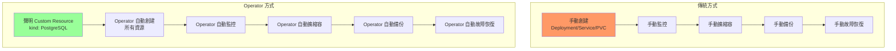
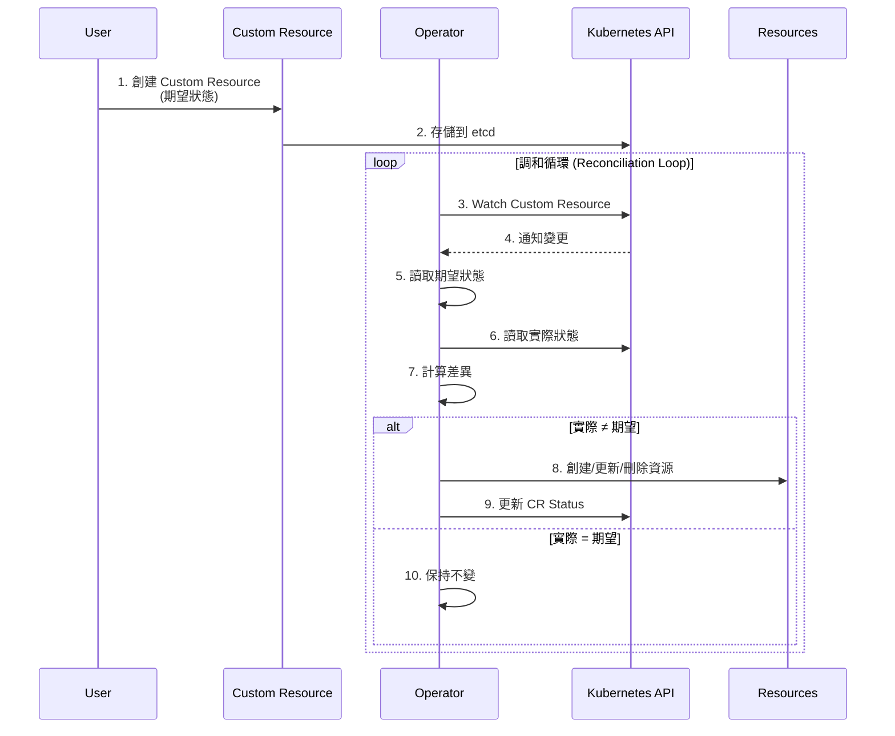
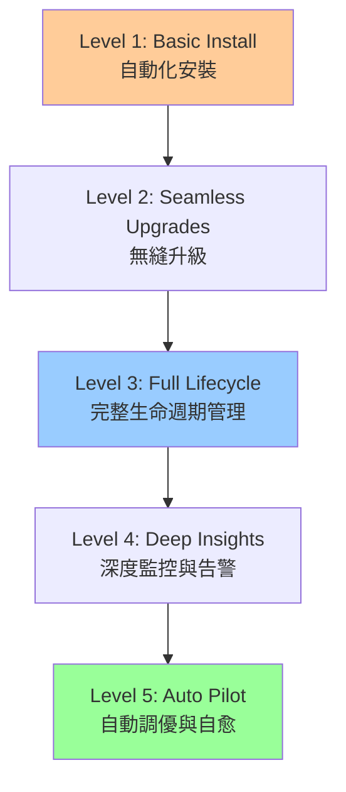
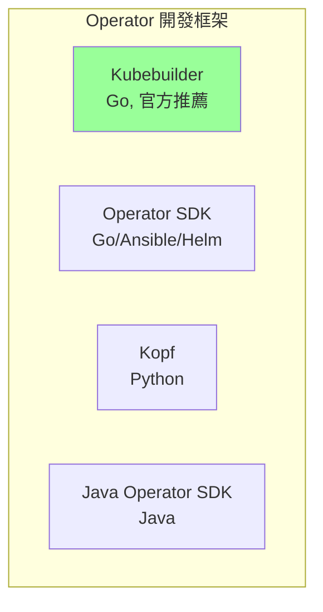

# 06-Operator 開發與應用

> 理解 Operator 模式，使用現成 Operator，入門自定義開發

---

## 📚 本章目標

- 理解 Operator 模式與核心概念
- 學會使用常見的 Operator
- 掌握 Operator 成熟度模型
- 入門 Operator 開發（Kubebuilder）
- 了解 Operator 生態與工具鏈

---

## 1. Operator 核心概念

### 1.1 Operator 是什麼

Operator = Custom Resource Definition (CRD) + Controller + 領域知識 (Domain Knowledge)



**為什麼需要 Operator？**
- ✅ 自動化複雜應用的部署與管理
- ✅ 封裝運維專家的領域知識
- ✅ 簡化有狀態應用管理（數據庫、消息隊列）
- ✅ 提供聲明式 API

---

### 1.2 Operator 工作原理



---

### 1.3 Operator 成熟度模型



| Level | 能力 | 示例 |
|-------|------|------|
| **Level 1** | 自動化安裝 | 創建 Deployment、Service、PVC |
| **Level 2** | 無縫升級 | 滾動更新、版本管理 |
| **Level 3** | 完整生命週期 | 備份、恢復、擴縮容 |
| **Level 4** | 深度監控 | Metrics、告警、異常檢測 |
| **Level 5** | 自動駕駛 | 自動調優、自愈、故障預測 |

---

## 2. 使用現成 Operator

### 2.1 安裝 Operator Lifecycle Manager (OLM)

```bash
# 安裝 OLM
curl -sL https://github.com/operator-framework/operator-lifecycle-manager/releases/latest/download/install.sh | bash -s latest

# 查看 OLM 狀態
kubectl get pods -n olm

# 查看可用 Operator
kubectl get packagemanifests -n olm
```

---

### 2.2 Prometheus Operator

#### 安裝

```bash
# 使用 Helm 安裝 kube-prometheus-stack
helm repo add prometheus-community https://prometheus-community.github.io/helm-charts
helm repo update

helm install kube-prometheus prometheus-community/kube-prometheus-stack \
  --namespace monitoring \
  --create-namespace
```

#### 使用 Custom Resources

```yaml
# Prometheus 實例
apiVersion: monitoring.coreos.com/v1
kind: Prometheus
metadata:
  name: main
  namespace: monitoring
spec:
  replicas: 2
  retention: 30d
  
  storage:
    volumeClaimTemplate:
      spec:
        storageClassName: fast-ssd
        resources:
          requests:
            storage: 50Gi
  
  serviceMonitorSelector:
    matchLabels:
      prometheus: main
  
  resources:
    requests:
      cpu: 500m
      memory: 2Gi
    limits:
      cpu: 2000m
      memory: 8Gi

---
# ServiceMonitor（自動發現服務）
apiVersion: monitoring.coreos.com/v1
kind: ServiceMonitor
metadata:
  name: webapp-monitor
  namespace: monitoring
  labels:
    prometheus: main
spec:
  selector:
    matchLabels:
      app: webapp
  endpoints:
  - port: metrics
    interval: 30s
    path: /metrics

---
# PrometheusRule（告警規則）
apiVersion: monitoring.coreos.com/v1
kind: PrometheusRule
metadata:
  name: webapp-alerts
  namespace: monitoring
spec:
  groups:
  - name: webapp
    interval: 30s
    rules:
    - alert: HighErrorRate
      expr: rate(http_requests_total{status=~"5.."}[5m]) > 0.05
      for: 5m
      labels:
        severity: warning
      annotations:
        summary: "High error rate detected"
        description: "Error rate is {{ $value }} for {{ $labels.instance }}"
```

---

### 2.3 PostgreSQL Operator (Zalando)

#### 安裝

```bash
# 添加 Helm repo
helm repo add postgres-operator-charts https://opensource.zalando.com/postgres-operator/charts/postgres-operator
helm repo update

# 安裝 Operator
helm install postgres-operator postgres-operator-charts/postgres-operator \
  --namespace postgres-operator \
  --create-namespace
```

#### 創建 PostgreSQL 集群

```yaml
apiVersion: "acid.zalan.do/v1"
kind: postgresql
metadata:
  name: my-db-cluster
  namespace: default
spec:
  # 團隊 ID（用於權限管理）
  teamId: "myteam"
  
  # 副本數
  numberOfInstances: 3
  
  # PostgreSQL 版本
  postgresql:
    version: "15"
  
  # 用戶與數據庫
  users:
    myapp:
      - superuser
      - createdb
  
  databases:
    myapp: myapp
  
  # 持久化存儲
  volume:
    size: 10Gi
    storageClass: fast-ssd
  
  # 資源限制
  resources:
    requests:
      cpu: 500m
      memory: 1Gi
    limits:
      cpu: 2000m
      memory: 4Gi
  
  # 連接池
  enableConnectionPooler: true
  connectionPooler:
    numberOfInstances: 2
    mode: "transaction"
    resources:
      requests:
        cpu: 100m
        memory: 128Mi
      limits:
        cpu: 500m
        memory: 512Mi
```

**查看集群狀態：**

```bash
# 查看 PostgreSQL 集群
kubectl get postgresql

# 查看 Pod
kubectl get pods -l cluster-name=my-db-cluster

# 連接到數據庫
kubectl exec -it my-db-cluster-0 -- psql -U postgres

# 查看密碼
kubectl get secret myapp.my-db-cluster.credentials.postgresql.acid.zalan.do -o jsonpath='{.data.password}' | base64 -d
```

---

### 2.4 Kafka Operator (Strimzi)

#### 安裝

```bash
# 創建命名空間
kubectl create namespace kafka

# 安裝 Operator
kubectl create -f 'https://strimzi.io/install/latest?namespace=kafka' -n kafka

# 查看
kubectl get pods -n kafka
```

#### 創建 Kafka 集群

```yaml
apiVersion: kafka.strimzi.io/v1beta2
kind: Kafka
metadata:
  name: my-cluster
  namespace: kafka
spec:
  kafka:
    version: 3.5.0
    replicas: 3
    
    listeners:
      - name: plain
        port: 9092
        type: internal
        tls: false
      - name: tls
        port: 9093
        type: internal
        tls: true
    
    config:
      offsets.topic.replication.factor: 3
      transaction.state.log.replication.factor: 3
      transaction.state.log.min.isr: 2
      default.replication.factor: 3
      min.insync.replicas: 2
    
    storage:
      type: jbod
      volumes:
      - id: 0
        type: persistent-claim
        size: 100Gi
        deleteClaim: false
        class: fast-ssd
    
    resources:
      requests:
        cpu: 1000m
        memory: 2Gi
      limits:
        cpu: 2000m
        memory: 4Gi
  
  zookeeper:
    replicas: 3
    
    storage:
      type: persistent-claim
      size: 10Gi
      deleteClaim: false
      class: fast-ssd
    
    resources:
      requests:
        cpu: 500m
        memory: 1Gi
      limits:
        cpu: 1000m
        memory: 2Gi
  
  entityOperator:
    topicOperator: {}
    userOperator: {}

---
# 創建 Topic
apiVersion: kafka.strimzi.io/v1beta2
kind: KafkaTopic
metadata:
  name: my-topic
  namespace: kafka
  labels:
    strimzi.io/cluster: my-cluster
spec:
  partitions: 10
  replicas: 3
  config:
    retention.ms: 604800000    # 7 days
    segment.bytes: 1073741824  # 1GB

---
# 創建 User
apiVersion: kafka.strimzi.io/v1beta2
kind: KafkaUser
metadata:
  name: my-user
  namespace: kafka
  labels:
    strimzi.io/cluster: my-cluster
spec:
  authentication:
    type: tls
  authorization:
    type: simple
    acls:
      - resource:
          type: topic
          name: my-topic
          patternType: literal
        operation: Read
      - resource:
          type: topic
          name: my-topic
          patternType: literal
        operation: Write
      - resource:
          type: group
          name: my-group
          patternType: literal
        operation: Read
```

---

### 2.5 常用 Operator 推薦

| Operator | 用途 | 成熟度 | 推薦場景 |
|----------|------|--------|---------|
| **Prometheus Operator** | 監控管理 | ⭐⭐⭐⭐⭐ | 所有場景 |
| **PostgreSQL Operator (Zalando)** | PostgreSQL 集群 | ⭐⭐⭐⭐⭐ | 生產環境數據庫 |
| **MySQL Operator (Oracle)** | MySQL 集群 | ⭐⭐⭐⭐ | MySQL 用戶 |
| **Kafka Operator (Strimzi)** | Kafka 集群 | ⭐⭐⭐⭐⭐ | 消息隊列 |
| **Redis Operator** | Redis 集群 | ⭐⭐⭐⭐ | 緩存服務 |
| **Elasticsearch Operator (ECK)** | Elasticsearch 集群 | ⭐⭐⭐⭐⭐ | 日誌搜索 |
| **ArgoCD Operator** | GitOps 管理 | ⭐⭐⭐⭐⭐ | CI/CD |
| **Cert-Manager** | 證書管理 | ⭐⭐⭐⭐⭐ | TLS 證書自動化 |
| **Velero** | 備份恢復 | ⭐⭐⭐⭐ | 災難恢復 |

---

## 3. Operator 開發入門

### 3.1 開發工具選擇



---

### 3.2 使用 Kubebuilder 開發 Operator

#### 安裝 Kubebuilder

```bash
# 安裝 Kubebuilder
curl -L -o kubebuilder https://go.kubebuilder.io/dl/latest/$(go env GOOS)/$(go env GOARCH)
chmod +x kubebuilder
sudo mv kubebuilder /usr/local/bin/

# 驗證
kubebuilder version
```

#### 創建項目

```bash
# 初始化項目
mkdir webapp-operator && cd webapp-operator
kubebuilder init --domain example.com --repo github.com/myorg/webapp-operator

# 創建 API（CRD + Controller）
kubebuilder create api --group apps --version v1 --kind WebApp

# 選擇：
# Create Resource [y/n]: y
# Create Controller [y/n]: y
```

---

#### 定義 CRD（types.go）

```go
// api/v1/webapp_types.go
package v1

import (
	metav1 "k8s.io/apimachinery/pkg/apis/meta/v1"
)

// WebAppSpec defines the desired state of WebApp
type WebAppSpec struct {
	// +kubebuilder:validation:Minimum=1
	// +kubebuilder:validation:Maximum=10
	Size int32 `json:"size"`
	
	// +kubebuilder:validation:Required
	Image string `json:"image"`
	
	// +kubebuilder:validation:Minimum=1
	// +kubebuilder:validation:Maximum=65535
	Port int32 `json:"port,omitempty"`
	
	// +kubebuilder:validation:Optional
	Database *DatabaseConfig `json:"database,omitempty"`
}

type DatabaseConfig struct {
	Host string `json:"host"`
	Port int32  `json:"port"`
	Name string `json:"name"`
}

// WebAppStatus defines the observed state of WebApp
type WebAppStatus struct {
	// +kubebuilder:validation:Optional
	Replicas int32 `json:"replicas,omitempty"`
	
	// +kubebuilder:validation:Optional
	Ready bool `json:"ready,omitempty"`
	
	// +kubebuilder:validation:Optional
	Conditions []metav1.Condition `json:"conditions,omitempty"`
}

// +kubebuilder:object:root=true
// +kubebuilder:subresource:status
// +kubebuilder:printcolumn:name="Size",type=integer,JSONPath=`.spec.size`
// +kubebuilder:printcolumn:name="Ready",type=boolean,JSONPath=`.status.ready`
// +kubebuilder:printcolumn:name="Age",type=date,JSONPath=`.metadata.creationTimestamp`

// WebApp is the Schema for the webapps API
type WebApp struct {
	metav1.TypeMeta   `json:",inline"`
	metav1.ObjectMeta `json:"metadata,omitempty"`

	Spec   WebAppSpec   `json:"spec,omitempty"`
	Status WebAppStatus `json:"status,omitempty"`
}

// +kubebuilder:object:root=true

// WebAppList contains a list of WebApp
type WebAppList struct {
	metav1.TypeMeta `json:",inline"`
	metav1.ListMeta `json:"metadata,omitempty"`
	Items           []WebApp `json:"items"`
}

func init() {
	SchemeBuilder.Register(&WebApp{}, &WebAppList{})
}
```

---

#### 實現 Controller（controller.go）

```go
// controllers/webapp_controller.go
package controllers

import (
	"context"
	"fmt"
	
	appsv1 "k8s.io/api/apps/v1"
	corev1 "k8s.io/api/core/v1"
	"k8s.io/apimachinery/pkg/api/errors"
	metav1 "k8s.io/apimachinery/pkg/apis/meta/v1"
	"k8s.io/apimachinery/pkg/runtime"
	"k8s.io/apimachinery/pkg/types"
	ctrl "sigs.k8s.io/controller-runtime"
	"sigs.k8s.io/controller-runtime/pkg/client"
	"sigs.k8s.io/controller-runtime/pkg/log"
	
	appsv1alpha1 "github.com/myorg/webapp-operator/api/v1"
)

// WebAppReconciler reconciles a WebApp object
type WebAppReconciler struct {
	client.Client
	Scheme *runtime.Scheme
}

// +kubebuilder:rbac:groups=apps.example.com,resources=webapps,verbs=get;list;watch;create;update;patch;delete
// +kubebuilder:rbac:groups=apps.example.com,resources=webapps/status,verbs=get;update;patch
// +kubebuilder:rbac:groups=apps,resources=deployments,verbs=get;list;watch;create;update;patch;delete
// +kubebuilder:rbac:groups=core,resources=services,verbs=get;list;watch;create;update;patch;delete

func (r *WebAppReconciler) Reconcile(ctx context.Context, req ctrl.Request) (ctrl.Result, error) {
	log := log.FromContext(ctx)

	// 1. 獲取 WebApp 實例
	webapp := &appsv1alpha1.WebApp{}
	if err := r.Get(ctx, req.NamespacedName, webapp); err != nil {
		if errors.IsNotFound(err) {
			log.Info("WebApp resource not found, ignoring")
			return ctrl.Result{}, nil
		}
		log.Error(err, "Failed to get WebApp")
		return ctrl.Result{}, err
	}

	// 2. 檢查 Deployment 是否存在
	deployment := &appsv1.Deployment{}
	err := r.Get(ctx, types.NamespacedName{
		Name:      webapp.Name,
		Namespace: webapp.Namespace,
	}, deployment)

	if err != nil && errors.IsNotFound(err) {
		// 3. 創建 Deployment
		dep := r.deploymentForWebApp(webapp)
		log.Info("Creating Deployment", "Deployment.Name", dep.Name)
		if err := r.Create(ctx, dep); err != nil {
			log.Error(err, "Failed to create Deployment")
			return ctrl.Result{}, err
		}
		return ctrl.Result{Requeue: true}, nil
	} else if err != nil {
		log.Error(err, "Failed to get Deployment")
		return ctrl.Result{}, err
	}

	// 4. 更新 Deployment（如果 size 變化）
	if *deployment.Spec.Replicas != webapp.Spec.Size {
		deployment.Spec.Replicas = &webapp.Spec.Size
		if err := r.Update(ctx, deployment); err != nil {
			log.Error(err, "Failed to update Deployment")
			return ctrl.Result{}, err
		}
		return ctrl.Result{Requeue: true}, nil
	}

	// 5. 創建 Service
	service := &corev1.Service{}
	err = r.Get(ctx, types.NamespacedName{
		Name:      webapp.Name,
		Namespace: webapp.Namespace,
	}, service)

	if err != nil && errors.IsNotFound(err) {
		svc := r.serviceForWebApp(webapp)
		log.Info("Creating Service", "Service.Name", svc.Name)
		if err := r.Create(ctx, svc); err != nil {
			log.Error(err, "Failed to create Service")
			return ctrl.Result{}, err
		}
	}

	// 6. 更新狀態
	webapp.Status.Replicas = webapp.Spec.Size
	webapp.Status.Ready = deployment.Status.ReadyReplicas == webapp.Spec.Size
	if err := r.Status().Update(ctx, webapp); err != nil {
		log.Error(err, "Failed to update WebApp status")
		return ctrl.Result{}, err
	}

	return ctrl.Result{}, nil
}

func (r *WebAppReconciler) deploymentForWebApp(webapp *appsv1alpha1.WebApp) *appsv1.Deployment {
	labels := map[string]string{
		"app": webapp.Name,
	}

	return &appsv1.Deployment{
		ObjectMeta: metav1.ObjectMeta{
			Name:      webapp.Name,
			Namespace: webapp.Namespace,
			OwnerReferences: []metav1.OwnerReference{
				*metav1.NewControllerRef(webapp, appsv1alpha1.GroupVersion.WithKind("WebApp")),
			},
		},
		Spec: appsv1.DeploymentSpec{
			Replicas: &webapp.Spec.Size,
			Selector: &metav1.LabelSelector{
				MatchLabels: labels,
			},
			Template: corev1.PodTemplateSpec{
				ObjectMeta: metav1.ObjectMeta{
					Labels: labels,
				},
				Spec: corev1.PodSpec{
					Containers: []corev1.Container{
						{
							Name:  "webapp",
							Image: webapp.Spec.Image,
							Ports: []corev1.ContainerPort{
								{
									ContainerPort: webapp.Spec.Port,
									Name:          "http",
								},
							},
						},
					},
				},
			},
		},
	}
}

func (r *WebAppReconciler) serviceForWebApp(webapp *appsv1alpha1.WebApp) *corev1.Service {
	labels := map[string]string{
		"app": webapp.Name,
	}

	return &corev1.Service{
		ObjectMeta: metav1.ObjectMeta{
			Name:      webapp.Name,
			Namespace: webapp.Namespace,
			OwnerReferences: []metav1.OwnerReference{
				*metav1.NewControllerRef(webapp, appsv1alpha1.GroupVersion.WithKind("WebApp")),
			},
		},
		Spec: corev1.ServiceSpec{
			Selector: labels,
			Ports: []corev1.ServicePort{
				{
					Port:       80,
					TargetPort: webapp.Spec.Port,
				},
			},
		},
	}
}

// SetupWithManager sets up the controller with the Manager.
func (r *WebAppReconciler) SetupWithManager(mgr ctrl.Manager) error {
	return ctrl.NewControllerManagedBy(mgr).
		For(&appsv1alpha1.WebApp{}).
		Owns(&appsv1.Deployment{}).
		Owns(&corev1.Service{}).
		Complete(r)
}
```

---

#### 構建與部署

```bash
# 生成 CRD manifests
make manifests

# 安裝 CRD
make install

# 本地運行 Operator（開發測試）
make run

# 構建 Docker 鏡像
make docker-build docker-push IMG=myregistry.io/webapp-operator:v0.1.0

# 部署到集群
make deploy IMG=myregistry.io/webapp-operator:v0.1.0
```

---

#### 使用 Custom Resource

```yaml
apiVersion: apps.example.com/v1
kind: WebApp
metadata:
  name: my-webapp
spec:
  size: 3
  image: nginx:1.27
  port: 80
  database:
    host: postgres.default.svc.cluster.local
    port: 5432
    name: mydb
```

```bash
# 應用
kubectl apply -f webapp-sample.yaml

# 查看
kubectl get webapp
kubectl describe webapp my-webapp

# 查看創建的資源
kubectl get deployments
kubectl get services
```

---

## 4. Operator 最佳實踐

### 4.1 設計原則

```yaml
# ✅ 聲明式 API
apiVersion: database.example.com/v1
kind: PostgreSQL
spec:
  version: "15"
  replicas: 3
  storage: 100Gi

# ✅ 狀態反饋
status:
  phase: Running
  replicas: 3
  conditions:
  - type: Ready
    status: "True"
  - type: BackupReady
    status: "True"
```

### 4.2 錯誤處理

```go
// ✅ 正確的錯誤處理
func (r *WebAppReconciler) Reconcile(ctx context.Context, req ctrl.Request) (ctrl.Result, error) {
	// 可重試錯誤：返回 error
	if err := r.Create(ctx, deployment); err != nil {
		if errors.IsAlreadyExists(err) {
			// 已存在，繼續
		} else {
			return ctrl.Result{}, err    // 重試
		}
	}
	
	// 需要等待：返回 Result{RequeueAfter: duration}
	if !deploymentReady {
		return ctrl.Result{RequeueAfter: 30 * time.Second}, nil
	}
	
	// 成功：返回 Result{}
	return ctrl.Result{}, nil
}
```

---

## 5. 小結

本章介紹了 Operator 開發與應用：

**核心概念：**
- ✅ Operator = CRD + Controller + Domain Knowledge
- ✅ 調和循環（Reconciliation Loop）
- ✅ 成熟度模型（Level 1-5）

**常用 Operator：**
- ✅ Prometheus Operator（監控）
- ✅ PostgreSQL Operator（數據庫）
- ✅ Kafka Operator（消息隊列）

**開發入門：**
- ✅ 使用 Kubebuilder 創建項目
- ✅ 定義 CRD 與實現 Controller
- ✅ 最佳實踐與錯誤處理

下一章將深入學習自定義 Operator 開發的高級技巧。

---

## 參考資料 (References)

1. [Kubernetes Operator Pattern](https://kubernetes.io/docs/concepts/extend-kubernetes/operator/)
2. [Kubebuilder Book](https://book.kubebuilder.io/)
3. [Operator Hub](https://operatorhub.io/)
4. [Operator SDK](https://sdk.operatorframework.io/)
5. [Prometheus Operator](https://github.com/prometheus-operator/prometheus-operator)
