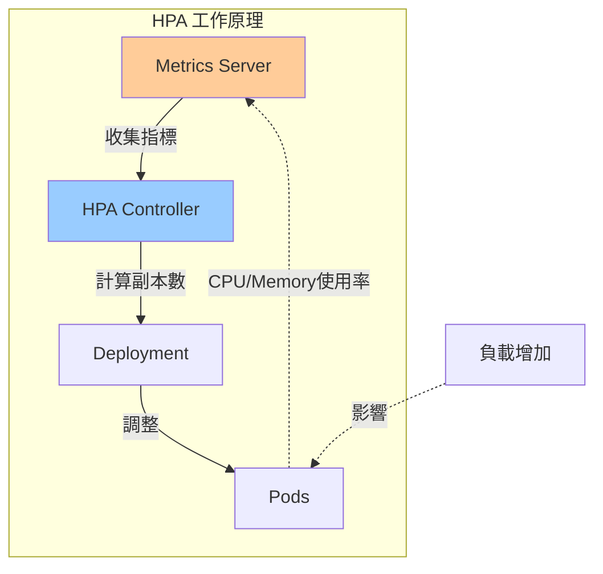
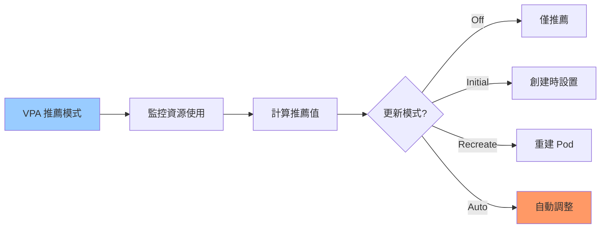
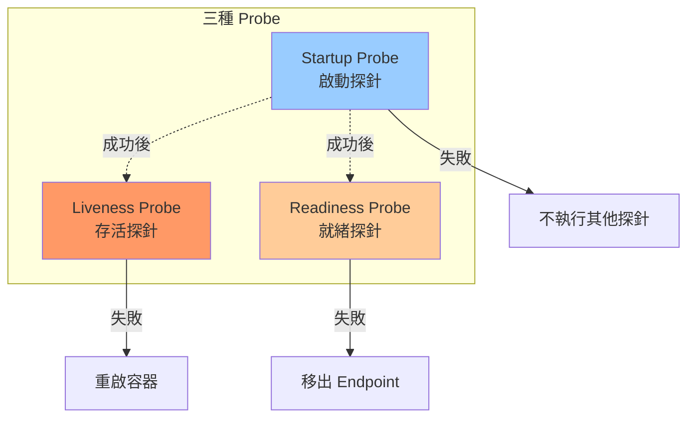
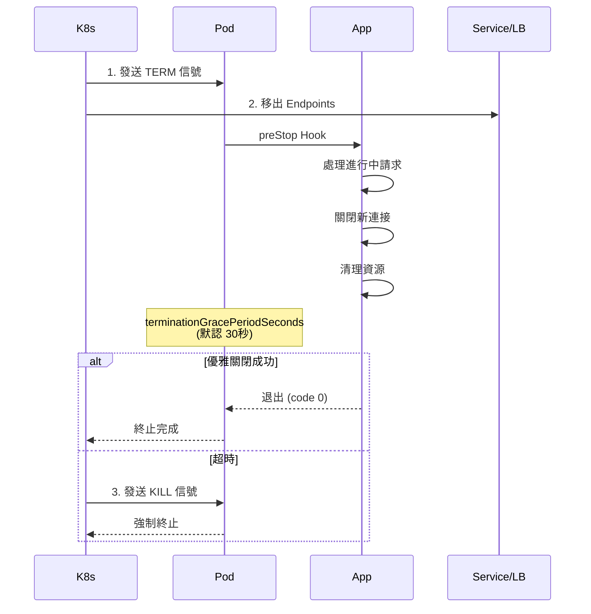
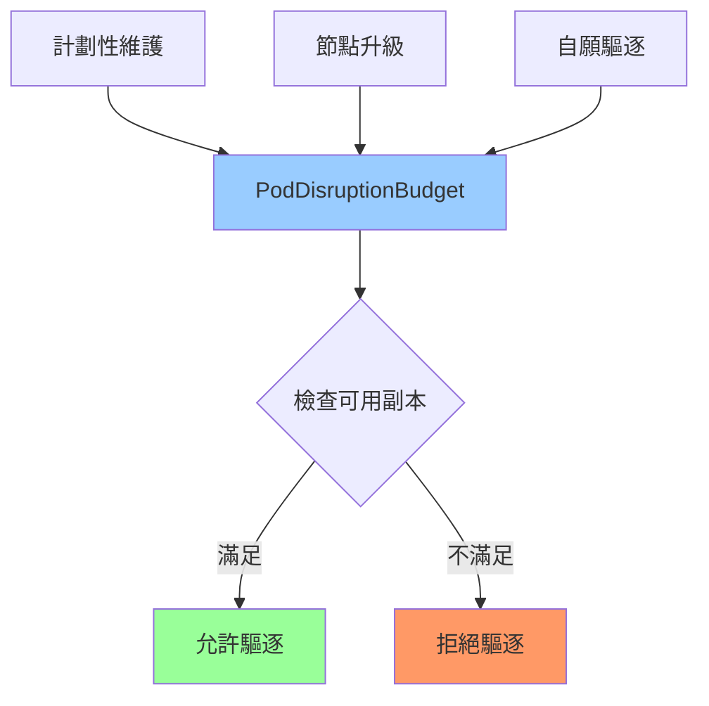
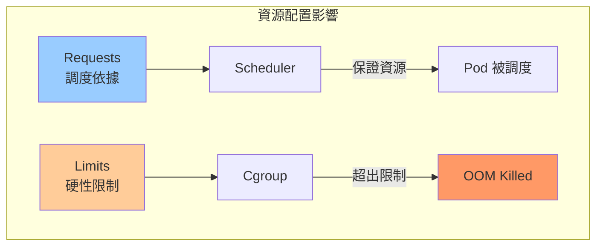
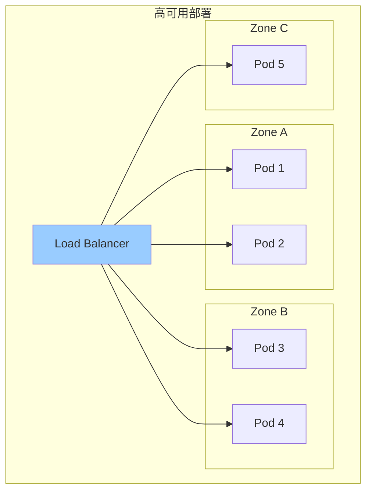

# 01-高可用與彈性設計

> HPA/VPA 自動擴縮容、健康檢查與故障恢復

---

## 📚 本章目標

- 掌握 HPA/VPA 自動擴縮容
- 配置健康檢查與優雅終止
- 理解 PodDisruptionBudget
- 實現高可用架構設計
- 掌握資源管理最佳實踐

---

## 1. 自動擴縮容

### 1.1 HPA（Horizontal Pod Autoscaler）



**基於 CPU 的 HPA：**
```yaml
apiVersion: autoscaling/v2
kind: HorizontalPodAutoscaler
metadata:
  name: webapp-hpa
spec:
  scaleTargetRef:
    apiVersion: apps/v1
    kind: Deployment
    name: webapp
  
  minReplicas: 3
  maxReplicas: 10
  
  metrics:
  - type: Resource
    resource:
      name: cpu
      target:
        type: Utilization
        averageUtilization: 70
  
  behavior:
    scaleDown:
      stabilizationWindowSeconds: 300
      policies:
      - type: Percent
        value: 50
        periodSeconds: 60
      - type: Pods
        value: 2
        periodSeconds: 60
      selectPolicy: Min
    
    scaleUp:
      stabilizationWindowSeconds: 0
      policies:
      - type: Percent
        value: 100
        periodSeconds: 15
      - type: Pods
        value: 4
        periodSeconds: 15
      selectPolicy: Max
```

**多指標 HPA：**
```yaml
apiVersion: autoscaling/v2
kind: HorizontalPodAutoscaler
metadata:
  name: webapp-multi-metric
spec:
  scaleTargetRef:
    apiVersion: apps/v1
    kind: Deployment
    name: webapp
  
  minReplicas: 3
  maxReplicas: 20
  
  metrics:
  - type: Resource
    resource:
      name: cpu
      target:
        type: Utilization
        averageUtilization: 70
  
  - type: Resource
    resource:
      name: memory
      target:
        type: Utilization
        averageUtilization: 80
  
  - type: Pods
    pods:
      metric:
        name: http_requests_per_second
      target:
        type: AverageValue
        averageValue: "1000"
  
  - type: Object
    object:
      metric:
        name: requests-per-second
      describedObject:
        apiVersion: networking.k8s.io/v1
        kind: Ingress
        name: webapp-ingress
      target:
        type: Value
        value: "10k"
```

**查看 HPA 狀態：**
```bash
kubectl get hpa

kubectl describe hpa webapp-hpa

kubectl get hpa webapp-hpa --watch
```

### 1.2 VPA（Vertical Pod Autoscaler）



**安裝 VPA：**
```bash
git clone https://github.com/kubernetes/autoscaler.git
cd autoscaler/vertical-pod-autoscaler
./hack/vpa-up.sh
```

**VPA 配置：**
```yaml
apiVersion: autoscaling.k8s.io/v1
kind: VerticalPodAutoscaler
metadata:
  name: webapp-vpa
spec:
  targetRef:
    apiVersion: "apps/v1"
    kind: Deployment
    name: webapp
  
  updatePolicy:
    updateMode: "Auto"
  
  resourcePolicy:
    containerPolicies:
    - containerName: webapp
      minAllowed:
        cpu: 100m
        memory: 128Mi
      maxAllowed:
        cpu: 2
        memory: 2Gi
      controlledResources: ["cpu", "memory"]
      mode: Auto
```

**查看 VPA 推薦：**
```bash
kubectl describe vpa webapp-vpa
```

### 1.3 KEDA（事件驅動擴縮容）

```yaml
apiVersion: keda.sh/v1alpha1
kind: ScaledObject
metadata:
  name: kafka-consumer-scaler
spec:
  scaleTargetRef:
    name: kafka-consumer
  
  minReplicaCount: 1
  maxReplicaCount: 30
  
  triggers:
  - type: kafka
    metadata:
      bootstrapServers: kafka:9092
      consumerGroup: my-group
      topic: orders
      lagThreshold: "50"
  
  - type: prometheus
    metadata:
      serverAddress: http://prometheus:9090
      metricName: http_requests_total
      threshold: "1000"
      query: sum(rate(http_requests_total[2m]))
```

---

## 2. 健康檢查機制

### 2.1 Probe 類型對比



### 2.2 Liveness Probe（存活探針）

**作用：** 檢測容器是否存活，失敗則重啟

**HTTP 檢查：**
```yaml
apiVersion: v1
kind: Pod
metadata:
  name: webapp
spec:
  containers:
  - name: app
    image: myapp:v1.0
    
    livenessProbe:
      httpGet:
        path: /healthz
        port: 8080
        httpHeaders:
        - name: Custom-Header
          value: Awesome
      
      initialDelaySeconds: 30
      periodSeconds: 10
      timeoutSeconds: 5
      successThreshold: 1
      failureThreshold: 3
```

**TCP 檢查：**
```yaml
livenessProbe:
  tcpSocket:
    port: 8080
  initialDelaySeconds: 15
  periodSeconds: 10
```

**命令檢查：**
```yaml
livenessProbe:
  exec:
    command:
    - cat
    - /tmp/healthy
  initialDelaySeconds: 5
  periodSeconds: 5
```

**應用端實現（Python Flask）：**
```python
from flask import Flask, jsonify
import psutil
import time

app = Flask(__name__)
start_time = time.time()

@app.route('/healthz')
def healthz():
    cpu_percent = psutil.cpu_percent(interval=1)
    memory_percent = psutil.virtual_memory().percent
    
    if cpu_percent > 95 or memory_percent > 95:
        return jsonify({
            'status': 'unhealthy',
            'cpu': cpu_percent,
            'memory': memory_percent
        }), 500
    
    return jsonify({
        'status': 'healthy',
        'uptime': time.time() - start_time
    }), 200
```

### 2.3 Readiness Probe（就緒探針）

**作用：** 檢測容器是否就緒接收流量，失敗則移出 Service Endpoints

```yaml
readinessProbe:
  httpGet:
    path: /ready
    port: 8080
  
  initialDelaySeconds: 5
  periodSeconds: 5
  timeoutSeconds: 3
  successThreshold: 1
  failureThreshold: 3
```

**應用端實現：**
```python
import redis
import psycopg2

@app.route('/ready')
def ready():
    try:
        r = redis.Redis(host='redis', port=6379)
        r.ping()
        
        conn = psycopg2.connect(
            host="postgres",
            database="mydb",
            user="admin",
            password=os.getenv("DB_PASSWORD")
        )
        conn.close()
        
        return jsonify({'status': 'ready'}), 200
    
    except Exception as e:
        return jsonify({
            'status': 'not ready',
            'error': str(e)
        }), 503
```

### 2.4 Startup Probe（啟動探針）

**作用：** 適用於啟動慢的應用，避免過早執行其他探針

```yaml
startupProbe:
  httpGet:
    path: /startup
    port: 8080
  
  initialDelaySeconds: 0
  periodSeconds: 10
  timeoutSeconds: 3
  successThreshold: 1
  failureThreshold: 30
```

**完整配置示例：**
```yaml
apiVersion: apps/v1
kind: Deployment
metadata:
  name: webapp
spec:
  replicas: 3
  template:
    spec:
      containers:
      - name: app
        image: myapp:v1.0
        
        startupProbe:
          httpGet:
            path: /startup
            port: 8080
          failureThreshold: 30
          periodSeconds: 10
        
        livenessProbe:
          httpGet:
            path: /healthz
            port: 8080
          initialDelaySeconds: 0
          periodSeconds: 10
          timeoutSeconds: 5
          failureThreshold: 3
        
        readinessProbe:
          httpGet:
            path: /ready
            port: 8080
          initialDelaySeconds: 0
          periodSeconds: 5
          timeoutSeconds: 3
          failureThreshold: 3
```

---

## 3. 優雅終止與生命週期

### 3.1 Pod 終止流程



### 3.2 PreStop Hook

```yaml
apiVersion: apps/v1
kind: Deployment
metadata:
  name: webapp
spec:
  template:
    spec:
      terminationGracePeriodSeconds: 60
      
      containers:
      - name: app
        image: myapp:v1.0
        
        lifecycle:
          preStop:
            exec:
              command:
              - /bin/sh
              - -c
              - |
                sleep 5
                kill -TERM 1
                while killall -0 myapp; do sleep 1; done
```

**應用端優雅關閉（Python）：**
```python
import signal
import sys
import time

shutdown_flag = False

def graceful_shutdown(signum, frame):
    global shutdown_flag
    print("Received shutdown signal, gracefully shutting down...")
    shutdown_flag = True

signal.signal(signal.SIGTERM, graceful_shutdown)
signal.signal(signal.SIGINT, graceful_shutdown)

def main():
    while not shutdown_flag:
        time.sleep(1)
    
    print("Closing database connections...")
    db.close()
    
    print("Waiting for in-flight requests to complete...")
    time.sleep(5)
    
    print("Shutdown complete")
    sys.exit(0)

if __name__ == '__main__':
    main()
```

**Go 示例：**
```go
package main

import (
    "context"
    "net/http"
    "os"
    "os/signal"
    "syscall"
    "time"
)

func main() {
    srv := &http.Server{Addr: ":8080"}
    
    go func() {
        if err := srv.ListenAndServe(); err != nil && err != http.ErrServerClosed {
            panic(err)
        }
    }()
    
    quit := make(chan os.Signal, 1)
    signal.Notify(quit, syscall.SIGINT, syscall.SIGTERM)
    <-quit
    
    ctx, cancel := context.WithTimeout(context.Background(), 30*time.Second)
    defer cancel()
    
    if err := srv.Shutdown(ctx); err != nil {
        panic(err)
    }
}
```

---

## 4. PodDisruptionBudget

### 4.1 概念與用途



### 4.2 配置示例

**最少可用副本數：**
```yaml
apiVersion: policy/v1
kind: PodDisruptionBudget
metadata:
  name: webapp-pdb
spec:
  minAvailable: 2
  selector:
    matchLabels:
      app: webapp
```

**最多不可用副本數：**
```yaml
apiVersion: policy/v1
kind: PodDisruptionBudget
metadata:
  name: webapp-pdb
spec:
  maxUnavailable: 1
  selector:
    matchLabels:
      app: webapp
```

**百分比配置：**
```yaml
apiVersion: policy/v1
kind: PodDisruptionBudget
metadata:
  name: webapp-pdb
spec:
  minAvailable: 75%
  selector:
    matchLabels:
      app: webapp
```

**查看 PDB 狀態：**
```bash
kubectl get pdb

kubectl describe pdb webapp-pdb
```

---

## 5. 資源管理

### 5.1 Requests vs Limits



**最佳實踐配置：**
```yaml
apiVersion: apps/v1
kind: Deployment
metadata:
  name: webapp
spec:
  template:
    spec:
      containers:
      - name: app
        image: myapp:v1.0
        
        resources:
          requests:
            cpu: "500m"
            memory: "512Mi"
          limits:
            cpu: "1000m"
            memory: "1Gi"
```

**QoS 類別：**

| QoS Class | 條件 | 優先級 | 被驅逐風險 |
|-----------|------|--------|-----------|
| **Guaranteed** | requests = limits | 最高 | 最低 |
| **Burstable** | requests < limits | 中等 | 中等 |
| **BestEffort** | 無 requests/limits | 最低 | 最高 |

```yaml
apiVersion: v1
kind: Pod
metadata:
  name: guaranteed-pod
spec:
  containers:
  - name: app
    resources:
      requests:
        cpu: "500m"
        memory: "512Mi"
      limits:
        cpu: "500m"
        memory: "512Mi"
```

### 5.2 ResourceQuota

```yaml
apiVersion: v1
kind: ResourceQuota
metadata:
  name: compute-quota
  namespace: production
spec:
  hard:
    requests.cpu: "50"
    requests.memory: 100Gi
    limits.cpu: "100"
    limits.memory: 200Gi
    
    pods: "100"
    services: "50"
    persistentvolumeclaims: "20"
    
    requests.storage: 500Gi
```

### 5.3 LimitRange

```yaml
apiVersion: v1
kind: LimitRange
metadata:
  name: resource-limits
  namespace: production
spec:
  limits:
  - max:
      cpu: "4"
      memory: "8Gi"
    min:
      cpu: "100m"
      memory: "128Mi"
    default:
      cpu: "500m"
      memory: "512Mi"
    defaultRequest:
      cpu: "200m"
      memory: "256Mi"
    type: Container
  
  - max:
      storage: "100Gi"
    min:
      storage: "1Gi"
    type: PersistentVolumeClaim
```

---

## 6. 高可用架構設計

### 6.1 多副本部署



**反親和性配置：**
```yaml
apiVersion: apps/v1
kind: Deployment
metadata:
  name: webapp
spec:
  replicas: 5
  
  template:
    spec:
      affinity:
        podAntiAffinity:
          requiredDuringSchedulingIgnoredDuringExecution:
          - labelSelector:
              matchExpressions:
              - key: app
                operator: In
                values:
                - webapp
            topologyKey: "kubernetes.io/hostname"
          
          preferredDuringSchedulingIgnoredDuringExecution:
          - weight: 100
            podAffinityTerm:
              labelSelector:
                matchExpressions:
                - key: app
                  operator: In
                  values:
                  - webapp
              topologyKey: topology.kubernetes.io/zone
```

### 6.2 多可用區部署

```yaml
apiVersion: apps/v1
kind: Deployment
metadata:
  name: webapp
spec:
  replicas: 9
  
  template:
    spec:
      affinity:
        podAntiAffinity:
          preferredDuringSchedulingIgnoredDuringExecution:
          - weight: 100
            podAffinityTerm:
              labelSelector:
                matchLabels:
                  app: webapp
              topologyKey: topology.kubernetes.io/zone
      
      topologySpreadConstraints:
      - maxSkew: 1
        topologyKey: topology.kubernetes.io/zone
        whenUnsatisfiable: DoNotSchedule
        labelSelector:
          matchLabels:
            app: webapp
      
      - maxSkew: 2
        topologyKey: kubernetes.io/hostname
        whenUnsatisfiable: ScheduleAnyway
        labelSelector:
          matchLabels:
            app: webapp
```

---

## 7. 完整高可用配置示例

```yaml
apiVersion: apps/v1
kind: Deployment
metadata:
  name: webapp-ha
  labels:
    app: webapp
spec:
  replicas: 5
  
  strategy:
    type: RollingUpdate
    rollingUpdate:
      maxSurge: 1
      maxUnavailable: 0
  
  selector:
    matchLabels:
      app: webapp
  
  template:
    metadata:
      labels:
        app: webapp
        version: v1.0
    
    spec:
      terminationGracePeriodSeconds: 60
      
      affinity:
        podAntiAffinity:
          preferredDuringSchedulingIgnoredDuringExecution:
          - weight: 100
            podAffinityTerm:
              labelSelector:
                matchLabels:
                  app: webapp
              topologyKey: kubernetes.io/hostname
      
      topologySpreadConstraints:
      - maxSkew: 1
        topologyKey: topology.kubernetes.io/zone
        whenUnsatisfiable: ScheduleAnyway
        labelSelector:
          matchLabels:
            app: webapp
      
      containers:
      - name: app
        image: myapp:v1.0
        
        ports:
        - containerPort: 8080
          name: http
        
        resources:
          requests:
            cpu: 500m
            memory: 512Mi
          limits:
            cpu: 1000m
            memory: 1Gi
        
        startupProbe:
          httpGet:
            path: /startup
            port: 8080
          failureThreshold: 30
          periodSeconds: 10
        
        livenessProbe:
          httpGet:
            path: /healthz
            port: 8080
          initialDelaySeconds: 0
          periodSeconds: 10
          timeoutSeconds: 5
          failureThreshold: 3
        
        readinessProbe:
          httpGet:
            path: /ready
            port: 8080
          initialDelaySeconds: 0
          periodSeconds: 5
          timeoutSeconds: 3
          failureThreshold: 3
        
        lifecycle:
          preStop:
            exec:
              command:
              - /bin/sh
              - -c
              - sleep 15

---
apiVersion: v1
kind: Service
metadata:
  name: webapp
spec:
  type: ClusterIP
  selector:
    app: webapp
  ports:
  - port: 80
    targetPort: 8080
  sessionAffinity: ClientIP

---
apiVersion: policy/v1
kind: PodDisruptionBudget
metadata:
  name: webapp-pdb
spec:
  minAvailable: 3
  selector:
    matchLabels:
      app: webapp

---
apiVersion: autoscaling/v2
kind: HorizontalPodAutoscaler
metadata:
  name: webapp-hpa
spec:
  scaleTargetRef:
    apiVersion: apps/v1
    kind: Deployment
    name: webapp-ha
  
  minReplicas: 5
  maxReplicas: 20
  
  metrics:
  - type: Resource
    resource:
      name: cpu
      target:
        type: Utilization
        averageUtilization: 70
  
  - type: Resource
    resource:
      name: memory
      target:
        type: Utilization
        averageUtilization: 80
  
  behavior:
    scaleDown:
      stabilizationWindowSeconds: 300
      policies:
      - type: Pods
        value: 1
        periodSeconds: 60
    scaleUp:
      stabilizationWindowSeconds: 0
      policies:
      - type: Pods
        value: 2
        periodSeconds: 60
```

---

## 8. 小結

本章介紹了 Kubernetes 高可用與彈性設計的核心技術：

**自動擴縮容：**
- ✅ HPA - 水平擴縮容（基於 CPU/Memory/自定義指標）
- ✅ VPA - 垂直擴縮容（自動調整資源請求）
- ✅ KEDA - 事件驅動擴縮容（Kafka/消息隊列）

**健康檢查：**
- ✅ Liveness Probe - 容器存活檢查
- ✅ Readiness Probe - 服務就緒檢查
- ✅ Startup Probe - 慢啟動應用支持

**高可用保障：**
- ✅ PodDisruptionBudget - 計劃性維護保護
- ✅ 多副本 + 反親和性 - 避免單點故障
- ✅ 多可用區部署 - 區域級容災
- ✅ 優雅終止 - 零停機更新

**資源管理：**
- ✅ Requests/Limits - 資源隔離與保障
- ✅ QoS - 服務質量分級
- ✅ ResourceQuota - 命名空間配額
- ✅ LimitRange - 資源範圍限制

下一章將深入學習監控與可觀測性，包括 Prometheus、Grafana、ELK 和分佈式追蹤。
