# 02-監控與可觀測性

> Prometheus + Grafana 監控、ELK 日誌、Jaeger 追蹤與 SLO/SLI

---

## 📚 本章目標

- 掌握 Prometheus + Grafana 監控體系
- 配置 ELK/Loki 日誌收集
- 實現 Jaeger 分佈式追蹤
- 理解 SLO/SLI/SLA 概念
- 建立完整的可觀測性系統

---

## 1. 可觀測性三支柱

```mermaid
graph TB
    subgraph "可觀測性三支柱"
        M[Metrics<br/>指標]
        L[Logs<br/>日誌]
        T[Traces<br/>追蹤]
    end
    
    M --> P[Prometheus]
    M --> G[Grafana]
    
    L --> E[Elasticsearch]
    L --> K[Kibana]
    L --> Loki[Loki]
    
    T --> J[Jaeger]
    T --> Z[Zipkin]
    
    P --> Alert[告警系統]
    G --> Dash[儀表板]
    J --> Trace[鏈路分析]
    
    style M fill:#9cf
    style L fill:#fc9
    style T fill:#f9c
```



### 1.1 三支柱作用

| 類型 | 作用 | 典型問題 | 工具 |
|-----|------|---------|------|
| **Metrics** | 系統健康狀況 | CPU/內存使用率、請求速率 | Prometheus |
| **Logs** | 事件記錄 | 錯誤訊息、審計日誌 | ELK/Loki |
| **Traces** | 請求鏈路 | 慢查詢分析、依賴關係 | Jaeger |

---

## 2. Prometheus 監控體系

### 2.1 架構概覽


### 2.2 安裝 Prometheus Stack

**使用 Helm 安裝：**
```bash
helm repo add prometheus-community https://prometheus-community.github.io/helm-charts
helm repo update

helm install prometheus prometheus-community/kube-prometheus-stack \
  --namespace monitoring \
  --create-namespace \
  --set prometheus.prometheusSpec.retention=30d \
  --set prometheus.prometheusSpec.storageSpec.volumeClaimTemplate.spec.resources.requests.storage=50Gi \
  --set grafana.enabled=true \
  --set alertmanager.enabled=true
```

**驗證安裝：**
```bash
kubectl get pods -n monitoring

kubectl port-forward -n monitoring svc/prometheus-kube-prometheus-prometheus 9090:9090

kubectl port-forward -n monitoring svc/prometheus-grafana 3000:80
```

### 2.3 應用集成 Prometheus

**Python Flask 示例：**
```python
from flask import Flask
from prometheus_client import Counter, Histogram, Gauge, generate_latest
import time

app = Flask(__name__)

request_count = Counter(
    'app_requests_total',
    'Total number of requests',
    ['method', 'endpoint', 'status']
)

request_duration = Histogram(
    'app_request_duration_seconds',
    'Request duration in seconds',
    ['method', 'endpoint']
)

active_users = Gauge(
    'app_active_users',
    'Number of active users'
)

@app.route('/api/users')
def get_users():
    start_time = time.time()
    
    try:
        users = fetch_users()
        
        request_count.labels(
            method='GET',
            endpoint='/api/users',
            status='200'
        ).inc()
        
        return users, 200
    
    except Exception as e:
        request_count.labels(
            method='GET',
            endpoint='/api/users',
            status='500'
        ).inc()
        
        return str(e), 500
    
    finally:
        duration = time.time() - start_time
        request_duration.labels(
            method='GET',
            endpoint='/api/users'
        ).observe(duration)

@app.route('/metrics')
def metrics():
    return generate_latest()
```

**ServiceMonitor 配置：**
```yaml
apiVersion: monitoring.coreos.com/v1
kind: ServiceMonitor
metadata:
  name: webapp-metrics
  namespace: default
  labels:
    release: prometheus
spec:
  selector:
    matchLabels:
      app: webapp
  
  endpoints:
  - port: metrics
    interval: 30s
    path: /metrics
```

**Service 配置：**
```yaml
apiVersion: v1
kind: Service
metadata:
  name: webapp
  labels:
    app: webapp
spec:
  selector:
    app: webapp
  ports:
  - name: http
    port: 80
    targetPort: 8080
  - name: metrics
    port: 9090
    targetPort: 9090
```

### 2.4 PromQL 查詢

**常用查詢示例：**

```promql
# CPU 使用率
100 - (avg by (instance) (rate(node_cpu_seconds_total{mode="idle"}[5m])) * 100)

# 內存使用率
(1 - (node_memory_MemAvailable_bytes / node_memory_MemTotal_bytes)) * 100

# Pod CPU 使用量
sum(rate(container_cpu_usage_seconds_total{pod=~"webapp-.*"}[5m])) by (pod)

# 請求速率（QPS）
rate(http_requests_total[5m])

# 錯誤率
rate(http_requests_total{status=~"5.."}[5m]) / rate(http_requests_total[5m])

# P50/P90/P99 延遲
histogram_quantile(0.50, rate(http_request_duration_seconds_bucket[5m]))
histogram_quantile(0.90, rate(http_request_duration_seconds_bucket[5m]))
histogram_quantile(0.99, rate(http_request_duration_seconds_bucket[5m]))

# 可用性
sum(up{job="webapp"}) / count(up{job="webapp"})
```

### 2.5 告警規則

```yaml
apiVersion: monitoring.coreos.com/v1
kind: PrometheusRule
metadata:
  name: webapp-alerts
  namespace: monitoring
  labels:
    release: prometheus
spec:
  groups:
  - name: webapp
    interval: 30s
    rules:
    
    - alert: HighErrorRate
      expr: |
        rate(http_requests_total{status=~"5.."}[5m]) 
        / 
        rate(http_requests_total[5m]) > 0.05
      for: 5m
      labels:
        severity: critical
      annotations:
        summary: "High error rate detected"
        description: "Error rate is {{ $value | humanizePercentage }} for {{ $labels.pod }}"
    
    - alert: HighMemoryUsage
      expr: |
        (container_memory_usage_bytes{pod=~"webapp-.*"} 
        / 
        container_spec_memory_limit_bytes{pod=~"webapp-.*"}) > 0.9
      for: 10m
      labels:
        severity: warning
      annotations:
        summary: "Pod memory usage is high"
        description: "Pod {{ $labels.pod }} memory usage is {{ $value | humanizePercentage }}"
    
    - alert: PodDown
      expr: up{job="webapp"} == 0
      for: 1m
      labels:
        severity: critical
      annotations:
        summary: "Pod is down"
        description: "Pod {{ $labels.pod }} is down"
    
    - alert: HighLatency
      expr: |
        histogram_quantile(0.99, 
          rate(http_request_duration_seconds_bucket[5m])
        ) > 2
      for: 5m
      labels:
        severity: warning
      annotations:
        summary: "High latency detected"
        description: "P99 latency is {{ $value }}s"
```

**Alertmanager 配置：**
```yaml
apiVersion: v1
kind: Secret
metadata:
  name: alertmanager-config
  namespace: monitoring
stringData:
  alertmanager.yaml: |
    global:
      resolve_timeout: 5m
      slack_api_url: 'https://hooks.slack.com/services/YOUR/SLACK/WEBHOOK'
    
    route:
      group_by: ['alertname', 'cluster']
      group_wait: 10s
      group_interval: 10s
      repeat_interval: 12h
      receiver: 'default'
      
      routes:
      - match:
          severity: critical
        receiver: 'critical'
        continue: true
      
      - match:
          severity: warning
        receiver: 'warning'
    
    receivers:
    - name: 'default'
      slack_configs:
      - channel: '#alerts'
        title: 'Alert: {{ .GroupLabels.alertname }}'
        text: '{{ range .Alerts }}{{ .Annotations.description }}{{ end }}'
    
    - name: 'critical'
      slack_configs:
      - channel: '#critical-alerts'
        title: '🚨 CRITICAL: {{ .GroupLabels.alertname }}'
      
      pagerduty_configs:
      - service_key: 'YOUR_PAGERDUTY_KEY'
    
    - name: 'warning'
      slack_configs:
      - channel: '#warnings'
        title: '⚠️ Warning: {{ .GroupLabels.alertname }}'
```

---

## 3. Grafana 儀表板

### 3.1 訪問 Grafana

```bash
kubectl port-forward -n monitoring svc/prometheus-grafana 3000:80

# 獲取默認密碼
kubectl get secret -n monitoring prometheus-grafana -o jsonpath="{.data.admin-password}" | base64 --decode
```

### 3.2 導入儀表板

**常用儀表板 ID：**
- **Kubernetes Cluster Monitoring** - 315
- **Node Exporter Full** - 1860
- **Pod Monitoring** - 6417
- **Ingress Nginx** - 9614

**自定義儀表板示例：**
```json
{
  "dashboard": {
    "title": "Webapp Dashboard",
    "panels": [
      {
        "title": "Request Rate (QPS)",
        "targets": [
          {
            "expr": "sum(rate(http_requests_total{app=\"webapp\"}[5m]))"
          }
        ],
        "type": "graph"
      },
      {
        "title": "Error Rate",
        "targets": [
          {
            "expr": "sum(rate(http_requests_total{app=\"webapp\",status=~\"5..\"}[5m])) / sum(rate(http_requests_total{app=\"webapp\"}[5m]))"
          }
        ],
        "type": "graph"
      },
      {
        "title": "P99 Latency",
        "targets": [
          {
            "expr": "histogram_quantile(0.99, rate(http_request_duration_seconds_bucket{app=\"webapp\"}[5m]))"
          }
        ],
        "type": "graph"
      }
    ]
  }
}
```

---

## 4. 日誌管理

### 4.1 ELK Stack

```mermaid
graph LR
    A[Application] -->|日誌| F[Fluentd/Filebeat]
    F --> E[Elasticsearch]
    E --> K[Kibana]
    
    B[容器日誌] --> F
    C[系統日誌] --> F
    
    style E fill:#9cf
    style K fill:#fc9
```



**安裝 ELK：**
```bash
helm repo add elastic https://helm.elastic.co
helm repo update

helm install elasticsearch elastic/elasticsearch \
  --namespace logging \
  --create-namespace \
  --set replicas=3 \
  --set volumeClaimTemplate.resources.requests.storage=100Gi

helm install kibana elastic/kibana \
  --namespace logging

helm install filebeat elastic/filebeat \
  --namespace logging
```

**Fluentd DaemonSet：**
```yaml
apiVersion: apps/v1
kind: DaemonSet
metadata:
  name: fluentd
  namespace: logging
spec:
  selector:
    matchLabels:
      app: fluentd
  template:
    metadata:
      labels:
        app: fluentd
    spec:
      serviceAccountName: fluentd
      containers:
      - name: fluentd
        image: fluent/fluentd-kubernetes-daemonset:v1-debian-elasticsearch
        env:
        - name: FLUENT_ELASTICSEARCH_HOST
          value: "elasticsearch-master"
        - name: FLUENT_ELASTICSEARCH_PORT
          value: "9200"
        
        volumeMounts:
        - name: varlog
          mountPath: /var/log
        - name: varlibdockercontainers
          mountPath: /var/lib/docker/containers
          readOnly: true
        
        resources:
          limits:
            memory: 512Mi
          requests:
            cpu: 100m
            memory: 256Mi
      
      volumes:
      - name: varlog
        hostPath:
          path: /var/log
      - name: varlibdockercontainers
        hostPath:
          path: /var/lib/docker/containers
```

### 4.2 Loki（輕量級日誌方案）

```bash
helm repo add grafana https://grafana.github.io/helm-charts
helm repo update

helm install loki grafana/loki-stack \
  --namespace logging \
  --create-namespace \
  --set grafana.enabled=true \
  --set prometheus.enabled=false \
  --set loki.persistence.enabled=true \
  --set loki.persistence.size=50Gi
```

**應用日誌格式化：**
```python
import logging
import json
import sys

class JSONFormatter(logging.Formatter):
    def format(self, record):
        log_data = {
            'timestamp': self.formatTime(record),
            'level': record.levelname,
            'message': record.getMessage(),
            'logger': record.name,
            'module': record.module,
            'function': record.funcName,
            'line': record.lineno
        }
        
        if hasattr(record, 'user_id'):
            log_data['user_id'] = record.user_id
        
        if hasattr(record, 'request_id'):
            log_data['request_id'] = record.request_id
        
        if record.exc_info:
            log_data['exception'] = self.formatException(record.exc_info)
        
        return json.dumps(log_data)

handler = logging.StreamHandler(sys.stdout)
handler.setFormatter(JSONFormatter())

logger = logging.getLogger()
logger.addHandler(handler)
logger.setLevel(logging.INFO)

logger.info('Application started', extra={'user_id': 123, 'request_id': 'abc'})
```

---

## 5. 分佈式追蹤

### 5.1 Jaeger 架構


**安裝 Jaeger：**
```bash
kubectl create namespace observability

kubectl apply -f https://github.com/jaegertracing/jaeger-operator/releases/download/v1.50.0/jaeger-operator.yaml -n observability

kubectl apply -f - <<EOF
apiVersion: jaegertracing.io/v1
kind: Jaeger
metadata:
  name: jaeger
  namespace: observability
spec:
  strategy: production
  storage:
    type: elasticsearch
    options:
      es:
        server-urls: http://elasticsearch:9200
EOF
```

### 5.2 應用集成 Jaeger

**Python Flask + OpenTelemetry：**
```python
from flask import Flask, request
from opentelemetry import trace
from opentelemetry.exporter.jaeger.thrift import JaegerExporter
from opentelemetry.sdk.trace import TracerProvider
from opentelemetry.sdk.trace.export import BatchSpanProcessor
from opentelemetry.instrumentation.flask import FlaskInstrumentor
from opentelemetry.instrumentation.requests import RequestsInstrumentor

app = Flask(__name__)

trace.set_tracer_provider(TracerProvider())
tracer = trace.get_tracer(__name__)

jaeger_exporter = JaegerExporter(
    agent_host_name="jaeger-agent",
    agent_port=6831,
)

trace.get_tracer_provider().add_span_processor(
    BatchSpanProcessor(jaeger_exporter)
)

FlaskInstrumentor().instrument_app(app)
RequestsInstrumentor().instrument()

@app.route('/api/users')
def get_users():
    with tracer.start_as_current_span("get_users") as span:
        span.set_attribute("user.count", 100)
        
        users = fetch_users_from_db()
        
        enrich_users(users)
        
        return users

def fetch_users_from_db():
    with tracer.start_as_current_span("database_query") as span:
        span.set_attribute("db.system", "postgresql")
        span.set_attribute("db.statement", "SELECT * FROM users")
        
        return query_database("SELECT * FROM users")

def enrich_users(users):
    with tracer.start_as_current_span("enrich_users") as span:
        import requests
        
        response = requests.get("http://profile-service/profiles")
        
        span.set_attribute("http.status_code", response.status_code)
```

**傳遞追蹤 Headers：**
```python
import requests
from opentelemetry.propagate import inject

def call_downstream_service():
    headers = {}
    inject(headers)
    
    response = requests.get(
        "http://downstream-service/api/data",
        headers=headers
    )
    
    return response.json()
```

---

## 6. SLO/SLI/SLA

### 6.1 概念定義

```mermaid
graph TB
    SLA[SLA<br/>Service Level Agreement<br/>服務等級協議]
    SLO[SLO<br/>Service Level Objective<br/>服務等級目標]
    SLI[SLI<br/>Service Level Indicator<br/>服務等級指標]
    
    SLA -->|包含| SLO
    SLO -->|由... 測量| SLI
    
    SLI --> M1[可用性: 99.9%]
    SLI --> M2[延遲: P99 < 200ms]
    SLI --> M3[錯誤率: < 0.1%]
    
    style SLA fill:#f96
    style SLO fill:#fc9
    style SLI fill:#9cf
```



### 6.2 定義 SLO

**可用性 SLO：**
```yaml
apiVersion: monitoring.coreos.com/v1
kind: PrometheusRule
metadata:
  name: slo-availability
spec:
  groups:
  - name: slo
    interval: 30s
    rules:
    
    - record: slo:availability:ratio_rate5m
      expr: |
        (
          sum(rate(http_requests_total{status!~"5.."}[5m]))
          /
          sum(rate(http_requests_total[5m]))
        )
    
    - alert: SLOBurnRateCritical
      expr: |
        (
          slo:availability:ratio_rate5m < 0.999
          and
          slo:availability:ratio_rate1h < 0.999
        )
      labels:
        severity: critical
      annotations:
        summary: "SLO burn rate is critical"
        description: "Availability is {{ $value | humanizePercentage }}, below 99.9% target"
```

**延遲 SLO：**
```yaml
- record: slo:latency:p99_5m
  expr: |
    histogram_quantile(0.99,
      rate(http_request_duration_seconds_bucket[5m])
    )

- alert: SLOLatencyViolation
  expr: slo:latency:p99_5m > 0.2
  for: 5m
  labels:
    severity: warning
  annotations:
    summary: "P99 latency exceeds SLO"
    description: "P99 latency is {{ $value }}s, target is 200ms"
```

### 6.3 錯誤預算

```promql
# 30 天錯誤預算
(1 - 0.999) * 30 * 24 * 60 * 60 = 2592 秒 = 43.2 分鐘

# 當前錯誤預算消耗
sum(increase(http_requests_total{status=~"5.."}[30d]))
/
sum(increase(http_requests_total[30d]))
```

**錯誤預算告警：**
```yaml
- alert: ErrorBudgetExhausted
  expr: |
    (
      1 - (
        sum(increase(http_requests_total{status!~"5.."}[30d]))
        /
        sum(increase(http_requests_total[30d]))
      )
    ) > 0.001
  labels:
    severity: critical
  annotations:
    summary: "Error budget exhausted"
    description: "30-day error budget is {{ $value | humanizePercentage }} consumed"
```

---

## 7. 完整可觀測性配置

**應用 Deployment：**
```yaml
apiVersion: apps/v1
kind: Deployment
metadata:
  name: webapp-observable
  labels:
    app: webapp
spec:
  replicas: 3
  template:
    metadata:
      labels:
        app: webapp
      annotations:
        prometheus.io/scrape: "true"
        prometheus.io/port: "9090"
        prometheus.io/path: "/metrics"
    
    spec:
      containers:
      - name: app
        image: myapp:v1.0
        
        ports:
        - containerPort: 8080
          name: http
        - containerPort: 9090
          name: metrics
        
        env:
        - name: JAEGER_AGENT_HOST
          value: "jaeger-agent.observability"
        - name: JAEGER_AGENT_PORT
          value: "6831"
        - name: LOG_LEVEL
          value: "info"
        - name: LOG_FORMAT
          value: "json"
        
        livenessProbe:
          httpGet:
            path: /healthz
            port: 8080
        
        readinessProbe:
          httpGet:
            path: /ready
            port: 8080
```

---

## 8. 小結

本章介紹了 Kubernetes 可觀測性的完整體系：

**Metrics（指標）：**
- ✅ Prometheus - 時序數據庫與告警
- ✅ Grafana - 可視化儀表板
- ✅ PromQL - 強大的查詢語言
- ✅ ServiceMonitor - 自動服務發現

**Logs（日誌）：**
- ✅ ELK Stack - 完整日誌方案
- ✅ Loki - 輕量級替代方案
- ✅ Fluentd/Filebeat - 日誌收集
- ✅ JSON 格式化 - 結構化日誌

**Traces（追蹤）：**
- ✅ Jaeger - 分佈式追蹤系統
- ✅ OpenTelemetry - 標準化追蹤
- ✅ Span 傳遞 - 跨服務追蹤

**SLO/SLI：**
- ✅ 可用性目標 - 99.9% uptime
- ✅ 延遲目標 - P99 < 200ms
- ✅ 錯誤預算 - 量化可靠性
- ✅ 告警策略 - 基於 SLO 的告警

下一章將學習 GitOps 實施，使用 ArgoCD 實現自動化部署與多環境管理。
