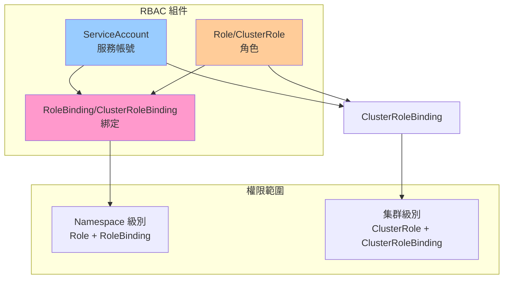
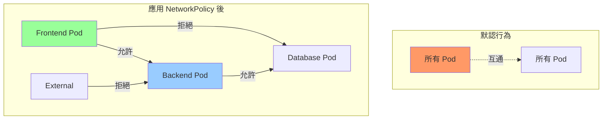
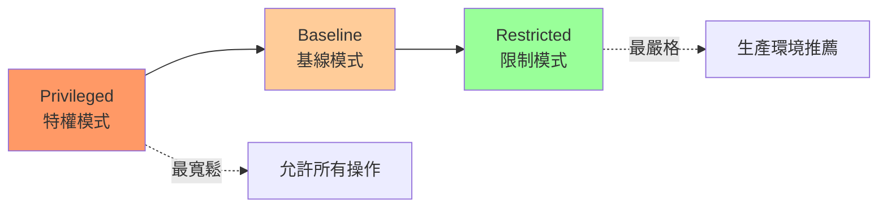
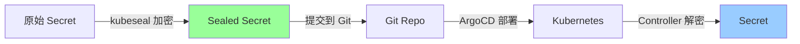

# 03-安全性實踐

> RBAC 權限控制、NetworkPolicy 網絡隔離、Pod Security 與密鑰管理

---

## 📚 本章目標

- 掌握 RBAC 權限管理
- 實現 NetworkPolicy 網絡隔離
- 配置 Pod Security Standards
- 安全管理 Secrets（Sealed Secrets/Vault）
- 鏡像安全掃描與漏洞管理
- 實施審計與合規

---

## 1. RBAC 權限控制

### 1.1 RBAC 核心概念



### 1.2 ServiceAccount 管理

**創建 ServiceAccount：**
```yaml
apiVersion: v1
kind: ServiceAccount
metadata:
  name: webapp-sa
  namespace: production
automountServiceAccountToken: false
```

**Pod 使用 ServiceAccount：**
```yaml
apiVersion: v1
kind: Pod
metadata:
  name: webapp
spec:
  serviceAccountName: webapp-sa
  automountServiceAccountToken: true
  
  containers:
  - name: app
    image: myapp:v1.0
```

### 1.3 Role 與 ClusterRole

**Namespace 級別 Role：**
```yaml
apiVersion: rbac.authorization.k8s.io/v1
kind: Role
metadata:
  name: pod-reader
  namespace: production
rules:
- apiGroups: [""]
  resources: ["pods"]
  verbs: ["get", "list", "watch"]

- apiGroups: [""]
  resources: ["pods/log"]
  verbs: ["get"]
```

**集群級別 ClusterRole：**
```yaml
apiVersion: rbac.authorization.k8s.io/v1
kind: ClusterRole
metadata:
  name: secret-reader
rules:
- apiGroups: [""]
  resources: ["secrets"]
  verbs: ["get", "list"]
  
- apiGroups: [""]
  resources: ["configmaps"]
  verbs: ["get", "list", "watch"]
```

**常用權限動詞：**
- `get` - 獲取單個資源
- `list` - 列出資源
- `watch` - 監聽資源變化
- `create` - 創建資源
- `update` - 更新資源
- `patch` - 部分更新
- `delete` - 刪除資源
- `deletecollection` - 批量刪除

### 1.4 RoleBinding

**綁定到 ServiceAccount：**
```yaml
apiVersion: rbac.authorization.k8s.io/v1
kind: RoleBinding
metadata:
  name: read-pods
  namespace: production
subjects:
- kind: ServiceAccount
  name: webapp-sa
  namespace: production
roleRef:
  kind: Role
  name: pod-reader
  apiGroup: rbac.authorization.k8s.io
```

**綁定到用戶/組：**
```yaml
apiVersion: rbac.authorization.k8s.io/v1
kind: ClusterRoleBinding
metadata:
  name: cluster-admin-binding
subjects:
- kind: User
  name: admin@example.com
  apiGroup: rbac.authorization.k8s.io

- kind: Group
  name: system:masters
  apiGroup: rbac.authorization.k8s.io
roleRef:
  kind: ClusterRole
  name: cluster-admin
  apiGroup: rbac.authorization.k8s.io
```

### 1.5 實戰：開發者權限配置

```yaml
apiVersion: v1
kind: Namespace
metadata:
  name: dev-team

---
apiVersion: rbac.authorization.k8s.io/v1
kind: Role
metadata:
  name: developer
  namespace: dev-team
rules:
- apiGroups: ["", "apps", "batch"]
  resources: ["pods", "deployments", "services", "jobs", "cronjobs"]
  verbs: ["get", "list", "watch", "create", "update", "patch", "delete"]

- apiGroups: [""]
  resources: ["pods/log", "pods/exec"]
  verbs: ["get", "create"]

- apiGroups: [""]
  resources: ["configmaps", "secrets"]
  verbs: ["get", "list"]

---
apiVersion: rbac.authorization.k8s.io/v1
kind: RoleBinding
metadata:
  name: developer-binding
  namespace: dev-team
subjects:
- kind: Group
  name: developers
  apiGroup: rbac.authorization.k8s.io
roleRef:
  kind: Role
  name: developer
  apiGroup: rbac.authorization.k8s.io
```

**測試權限：**
```bash
kubectl auth can-i get pods --namespace dev-team --as system:serviceaccount:dev-team:webapp-sa

kubectl auth can-i delete deployments --namespace dev-team --as-group=developers

kubectl auth can-i list secrets --namespace production --as alice@example.com
```

---

## 2. NetworkPolicy 網絡隔離

### 2.1 網絡策略模型



### 2.2 基礎 NetworkPolicy

**拒絕所有入站流量：**
```yaml
apiVersion: networking.k8s.io/v1
kind: NetworkPolicy
metadata:
  name: deny-all-ingress
  namespace: production
spec:
  podSelector: {}
  policyTypes:
  - Ingress
```

**允許特定流量：**
```yaml
apiVersion: networking.k8s.io/v1
kind: NetworkPolicy
metadata:
  name: allow-frontend-to-backend
  namespace: production
spec:
  podSelector:
    matchLabels:
      app: backend
  
  policyTypes:
  - Ingress
  - Egress
  
  ingress:
  - from:
    - podSelector:
        matchLabels:
          app: frontend
    ports:
    - protocol: TCP
      port: 8080
  
  egress:
  - to:
    - podSelector:
        matchLabels:
          app: database
    ports:
    - protocol: TCP
      port: 5432
  
  - to:
    - namespaceSelector:
        matchLabels:
          name: kube-system
    - podSelector:
        matchLabels:
          k8s-app: kube-dns
    ports:
    - protocol: UDP
      port: 53
```

### 2.3 跨 Namespace 策略

```yaml
apiVersion: networking.k8s.io/v1
kind: NetworkPolicy
metadata:
  name: allow-from-monitoring
  namespace: production
spec:
  podSelector:
    matchLabels:
      app: webapp
  
  policyTypes:
  - Ingress
  
  ingress:
  - from:
    - namespaceSelector:
        matchLabels:
          name: monitoring
      podSelector:
        matchLabels:
          app: prometheus
    ports:
    - protocol: TCP
      port: 9090
```

### 2.4 外部訪問策略

```yaml
apiVersion: networking.k8s.io/v1
kind: NetworkPolicy
metadata:
  name: allow-external-ingress
  namespace: production
spec:
  podSelector:
    matchLabels:
      app: api-gateway
  
  policyTypes:
  - Ingress
  
  ingress:
  - from:
    - ipBlock:
        cidr: 0.0.0.0/0
        except:
        - 10.0.0.0/8
        - 172.16.0.0/12
        - 192.168.0.0/16
    ports:
    - protocol: TCP
      port: 443
```

### 2.5 完整微服務網絡策略

```yaml
apiVersion: networking.k8s.io/v1
kind: NetworkPolicy
metadata:
  name: microservices-policy
  namespace: production
spec:
  podSelector:
    matchLabels:
      tier: backend
  
  policyTypes:
  - Ingress
  - Egress
  
  ingress:
  - from:
    - podSelector:
        matchLabels:
          tier: frontend
    - podSelector:
        matchLabels:
          tier: backend
    ports:
    - protocol: TCP
      port: 8080
  
  egress:
  - to:
    - podSelector:
        matchLabels:
          tier: database
    ports:
    - protocol: TCP
      port: 5432
  
  - to:
    - podSelector:
        matchLabels:
          app: redis
    ports:
    - protocol: TCP
      port: 6379
  
  - to:
    - namespaceSelector: {}
      podSelector:
        matchLabels:
          k8s-app: kube-dns
    ports:
    - protocol: UDP
      port: 53
  
  - to:
    - ipBlock:
        cidr: 0.0.0.0/0
    ports:
    - protocol: TCP
      port: 443
```

---

## 3. Pod Security Standards

### 3.1 三種安全級別



| 級別 | 說明 | 適用場景 |
|-----|------|---------|
| **Privileged** | 無限制，允許所有操作 | 系統組件（CNI、CSI） |
| **Baseline** | 最小限制，防止已知提權 | 開發環境 |
| **Restricted** | 嚴格限制，遵循最佳實踐 | 生產環境 |

### 3.2 Namespace 級別策略

**啟用 Pod Security Admission：**
```yaml
apiVersion: v1
kind: Namespace
metadata:
  name: production
  labels:
    pod-security.kubernetes.io/enforce: restricted
    pod-security.kubernetes.io/audit: restricted
    pod-security.kubernetes.io/warn: restricted
```

### 3.3 Restricted 模式 Pod 配置

```yaml
apiVersion: v1
kind: Pod
metadata:
  name: secure-pod
spec:
  securityContext:
    runAsNonRoot: true
    runAsUser: 1000
    fsGroup: 1000
    seccompProfile:
      type: RuntimeDefault
  
  containers:
  - name: app
    image: myapp:v1.0
    
    securityContext:
      allowPrivilegeEscalation: false
      runAsNonRoot: true
      runAsUser: 1000
      
      capabilities:
        drop:
        - ALL
      
      readOnlyRootFilesystem: true
      
      seccompProfile:
        type: RuntimeDefault
    
    volumeMounts:
    - name: tmp
      mountPath: /tmp
    - name: cache
      mountPath: /app/cache
  
  volumes:
  - name: tmp
    emptyDir: {}
  - name: cache
    emptyDir: {}
```

### 3.4 SecurityContext 最佳實踐

```yaml
apiVersion: apps/v1
kind: Deployment
metadata:
  name: webapp-secure
spec:
  template:
    spec:
      securityContext:
        runAsNonRoot: true
        runAsUser: 10001
        fsGroup: 10001
        supplementalGroups: [10001]
        seccompProfile:
          type: RuntimeDefault
      
      containers:
      - name: app
        image: myapp:v1.0
        
        securityContext:
          allowPrivilegeEscalation: false
          readOnlyRootFilesystem: true
          runAsNonRoot: true
          runAsUser: 10001
          
          capabilities:
            drop:
            - ALL
            add:
            - NET_BIND_SERVICE
        
        volumeMounts:
        - name: tmp
          mountPath: /tmp
        - name: app-data
          mountPath: /app/data
      
      volumes:
      - name: tmp
        emptyDir:
          sizeLimit: 100Mi
      - name: app-data
        persistentVolumeClaim:
          claimName: app-data-pvc
```

---

## 4. 密鑰管理

### 4.1 Sealed Secrets



**安裝 Sealed Secrets：**
```bash
kubectl apply -f https://github.com/bitnami-labs/sealed-secrets/releases/download/v0.24.0/controller.yaml

kubeseal --fetch-cert > pub-cert.pem
```

**創建 Sealed Secret：**
```bash
kubectl create secret generic db-credentials \
  --from-literal=username=admin \
  --from-literal=password='MyS3cretP@ss' \
  --dry-run=client -o yaml | \
  kubeseal --cert pub-cert.pem --format yaml > sealed-secret.yaml

kubectl apply -f sealed-secret.yaml
```

**SealedSecret YAML：**
```yaml
apiVersion: bitnami.com/v1alpha1
kind: SealedSecret
metadata:
  name: db-credentials
  namespace: production
spec:
  encryptedData:
    username: AgBqL3...encrypted...
    password: AgCY9...encrypted...
  template:
    metadata:
      name: db-credentials
      namespace: production
    type: Opaque
```

### 4.2 External Secrets Operator

**安裝：**
```bash
helm repo add external-secrets https://charts.external-secrets.io
helm install external-secrets external-secrets/external-secrets -n external-secrets --create-namespace
```

**配置 AWS Secrets Manager：**
```yaml
apiVersion: external-secrets.io/v1beta1
kind: SecretStore
metadata:
  name: aws-secrets
  namespace: production
spec:
  provider:
    aws:
      service: SecretsManager
      region: us-east-1
      auth:
        jwt:
          serviceAccountRef:
            name: external-secrets-sa

---
apiVersion: external-secrets.io/v1beta1
kind: ExternalSecret
metadata:
  name: db-credentials
  namespace: production
spec:
  refreshInterval: 1h
  
  secretStoreRef:
    name: aws-secrets
    kind: SecretStore
  
  target:
    name: db-credentials
    creationPolicy: Owner
  
  data:
  - secretKey: username
    remoteRef:
      key: prod/database
      property: username
  
  - secretKey: password
    remoteRef:
      key: prod/database
      property: password
```

### 4.3 HashiCorp Vault

**安裝 Vault：**
```bash
helm repo add hashicorp https://helm.releases.hashicorp.com
helm install vault hashicorp/vault --namespace vault --create-namespace
```

**配置 Vault Agent Injector：**
```yaml
apiVersion: apps/v1
kind: Deployment
metadata:
  name: webapp
spec:
  template:
    metadata:
      annotations:
        vault.hashicorp.com/agent-inject: "true"
        vault.hashicorp.com/role: "webapp"
        vault.hashicorp.com/agent-inject-secret-database: "secret/data/database"
        vault.hashicorp.com/agent-inject-template-database: |
          {{- with secret "secret/data/database" -}}
          export DB_USER="{{ .Data.data.username }}"
          export DB_PASSWORD="{{ .Data.data.password }}"
          {{- end }}
    spec:
      serviceAccountName: webapp-sa
      containers:
      - name: app
        image: myapp:v1.0
```

---

## 5. 鏡像安全

### 5.1 使用 Trivy 掃描

```bash
trivy image myregistry/webapp:v1.0

trivy image --severity HIGH,CRITICAL myregistry/webapp:v1.0

trivy image --format json --output trivy-report.json myregistry/webapp:v1.0
```

**集成到 CI/CD：**
```yaml
name: Container Security Scan

on: [push]

jobs:
  security-scan:
    runs-on: ubuntu-latest
    steps:
    - name: Checkout code
      uses: actions/checkout@v3
    
    - name: Build image
      run: docker build -t myapp:${{ github.sha }} .
    
    - name: Run Trivy scan
      uses: aquasecurity/trivy-action@master
      with:
        image-ref: 'myapp:${{ github.sha }}'
        format: 'sarif'
        output: 'trivy-results.sarif'
        severity: 'CRITICAL,HIGH'
        exit-code: '1'
    
    - name: Upload results
      uses: github/codeql-action/upload-sarif@v2
      with:
        sarif_file: 'trivy-results.sarif'
```

### 5.2 鏡像簽名與驗證

**使用 Cosign 簽名：**
```bash
cosign generate-key-pair

cosign sign --key cosign.key myregistry/webapp:v1.0

cosign verify --key cosign.pub myregistry/webapp:v1.0
```

**Admission Controller 驗證：**
```yaml
apiVersion: v1
kind: ConfigMap
metadata:
  name: image-verification-policy
  namespace: cosign-system
data:
  policy.yaml: |
    apiVersion: policy.sigstore.dev/v1beta1
    kind: ClusterImagePolicy
    metadata:
      name: require-signature
    spec:
      images:
      - glob: "myregistry/**"
      authorities:
      - key:
          data: |
            -----BEGIN PUBLIC KEY-----
            MFkwEwYHKoZIzj0CAQYIKoZIzj0DAQcDQgAE...
            -----END PUBLIC KEY-----
```

### 5.3 私有 Registry

```yaml
apiVersion: v1
kind: Secret
metadata:
  name: regcred
  namespace: production
type: kubernetes.io/dockerconfigjson
data:
  .dockerconfigjson: <base64-encoded-config>

---
apiVersion: v1
kind: Pod
metadata:
  name: webapp
spec:
  imagePullSecrets:
  - name: regcred
  
  containers:
  - name: app
    image: myregistry.example.com/webapp:v1.0
```

---

## 6. 審計與合規

### 6.1 審計日誌

**啟用審計：**
```yaml
apiVersion: audit.k8s.io/v1
kind: Policy
rules:
- level: Metadata
  omitStages:
  - RequestReceived
  
  resources:
  - group: ""
    resources: ["secrets", "configmaps"]

- level: Request
  verbs: ["create", "update", "patch", "delete"]
  
  resources:
  - group: "apps"
    resources: ["deployments", "statefulsets"]

- level: RequestResponse
  verbs: ["delete"]
  
  resources:
  - group: ""
    resources: ["pods"]
  
  namespaces: ["production"]
```

### 6.2 Falco 運行時安全

**安裝 Falco：**
```bash
helm repo add falcosecurity https://falcosecurity.github.io/charts
helm install falco falcosecurity/falco --namespace falco --create-namespace
```

**自定義規則：**
```yaml
- rule: Unauthorized Process in Container
  desc: Detect unexpected process execution
  condition: >
    spawned_process and
    container and
    not proc.name in (nginx, node, python, java)
  output: >
    Unexpected process started (user=%user.name command=%proc.cmdline container=%container.name)
  priority: WARNING

- rule: Write to Sensitive File
  desc: Detect writes to sensitive directories
  condition: >
    open_write and
    container and
    fd.name startswith /etc
  output: >
    Write to sensitive file (user=%user.name file=%fd.name container=%container.name)
  priority: ERROR
```

### 6.3 OPA Gatekeeper

**安裝：**
```bash
kubectl apply -f https://raw.githubusercontent.com/open-policy-agent/gatekeeper/master/deploy/gatekeeper.yaml
```

**強制要求資源限制：**
```yaml
apiVersion: templates.gatekeeper.sh/v1
kind: ConstraintTemplate
metadata:
  name: k8srequiredresources
spec:
  crd:
    spec:
      names:
        kind: K8sRequiredResources
  targets:
  - target: admission.k8s.gatekeeper.sh
    rego: |
      package k8srequiredresources
      
      violation[{"msg": msg}] {
        container := input.review.object.spec.containers[_]
        not container.resources.limits.cpu
        msg := sprintf("Container %v must have CPU limit", [container.name])
      }
      
      violation[{"msg": msg}] {
        container := input.review.object.spec.containers[_]
        not container.resources.limits.memory
        msg := sprintf("Container %v must have memory limit", [container.name])
      }

---
apiVersion: constraints.gatekeeper.sh/v1beta1
kind: K8sRequiredResources
metadata:
  name: must-have-resources
spec:
  match:
    kinds:
    - apiGroups: ["apps"]
      kinds: ["Deployment"]
    namespaces: ["production"]
```

**禁止特權容器：**
```yaml
apiVersion: constraints.gatekeeper.sh/v1beta1
kind: K8sPSPPrivilegedContainer
metadata:
  name: deny-privileged-containers
spec:
  match:
    kinds:
    - apiGroups: [""]
      kinds: ["Pod"]
    excludedNamespaces: ["kube-system"]
```

---

## 7. 安全檢查清單

### 7.1 集群安全

- ☐ 啟用 RBAC 並遵循最小權限原則
- ☐ 禁用匿名訪問
- ☐ 啟用審計日誌
- ☐ 定期更新 Kubernetes 版本
- ☐ 加密 etcd 數據
- ☐ 使用 NetworkPolicy 隔離網絡
- ☐ 限制 API Server 訪問（IP 白名單）

### 7.2 工作負載安全

- ☐ 使用非 root 用戶運行容器
- ☐ 設置 readOnlyRootFilesystem
- ☐ 禁用 allowPrivilegeEscalation
- ☐ Drop 所有 capabilities
- ☐ 設置資源限制
- ☐ 配置健康檢查
- ☐ 使用 Pod Security Standards (Restricted)

### 7.3 密鑰管理

- ☐ 不在代碼中硬編碼密鑰
- ☐ 使用 Sealed Secrets 或 Vault
- ☐ 定期輪換密鑰
- ☐ 限制 Secret 訪問權限
- ☐ 啟用 etcd 加密
- ☐ 審計 Secret 訪問

### 7.4 鏡像安全

- ☐ 使用官方基礎鏡像
- ☐ 定期掃描漏洞（Trivy）
- ☐ 使用最小化鏡像（alpine/distroless）
- ☐ 簽名並驗證鏡像
- ☐ 使用私有 Registry
- ☐ 實施鏡像拉取策略

---

## 8. 小結

本章介紹了 Kubernetes 安全性的完整實踐：

**RBAC 權限控制：**
- ✅ ServiceAccount + Role + RoleBinding
- ✅ 最小權限原則
- ✅ 命名空間級別隔離
- ✅ 審計與驗證

**網絡隔離：**
- ✅ NetworkPolicy 入站/出站規則
- ✅ 微服務網絡策略
- ✅ 跨 Namespace 訪問控制
- ✅ 外部訪問限制

**Pod 安全：**
- ✅ Pod Security Standards (Restricted)
- ✅ SecurityContext 配置
- ✅ 非 root 用戶
- ✅ 只讀文件系統

**密鑰管理：**
- ✅ Sealed Secrets（GitOps 友好）
- ✅ External Secrets Operator
- ✅ HashiCorp Vault
- ✅ 密鑰輪換策略

**鏡像安全：**
- ✅ Trivy 漏洞掃描
- ✅ Cosign 簽名驗證
- ✅ 私有 Registry
- ✅ CI/CD 安全檢查

**審計與合規：**
- ✅ Kubernetes 審計日誌
- ✅ Falco 運行時監控
- ✅ OPA Gatekeeper 策略引擎
- ✅ 合規性檢查

下一章將學習效能優化，包括資源調優、調度策略和網絡性能提升。
