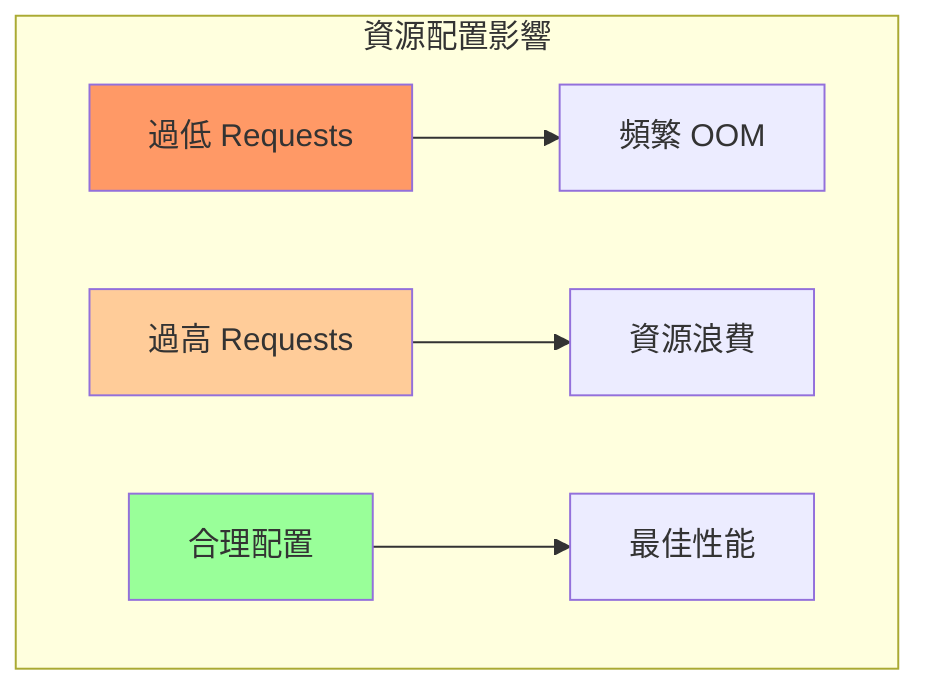

# 04-效能優化

> 資源調優、調度策略、網絡與存儲性能提升

---

## 📚 本章目標

- 優化資源請求與限制配置
- 掌握調度策略提升資源利用率
- 提升網絡性能（CNI 選擇與優化）
- 優化存儲性能
- 應用層性能調優

---

## 1. 資源優化策略

### 1.1 Requests/Limits 調優



**查找最佳配置：**
```bash
kubectl top pods -n production

kubectl get pods -n production -o custom-columns=NAME:.metadata.name,CPU_REQ:.spec.containers[0].resources.requests.cpu,MEM_REQ:.spec.containers[0].resources.requests.memory,CPU_LIM:.spec.containers[0].resources.limits.cpu,MEM_LIM:.spec.containers[0].resources.limits.memory

kubectl-resource-recommender --namespace production
```

**最佳實踐配置：**
```yaml
apiVersion: apps/v1
kind: Deployment
metadata:
  name: webapp-optimized
spec:
  template:
    spec:
      containers:
      - name: app
        image: myapp:v1.0
        
        resources:
          requests:
            cpu: "500m"
            memory: "512Mi"
          limits:
            cpu: "1000m"
            memory: "1Gi"
```

**CPU 可突發，Memory 嚴格限制：**
```yaml
resources:
  requests:
    cpu: "200m"
    memory: "256Mi"
  limits:
    cpu: "2000m"
    memory: "256Mi"
```

### 1.2 VPA 自動優化

```yaml
apiVersion: autoscaling.k8s.io/v1
kind: VerticalPodAutoscaler
metadata:
  name: webapp-vpa
spec:
  targetRef:
    apiVersion: apps/v1
    kind: Deployment
    name: webapp
  
  updatePolicy:
    updateMode: "Auto"
  
  resourcePolicy:
    containerPolicies:
    - containerName: app
      minAllowed:
        cpu: 100m
        memory: 128Mi
      maxAllowed:
        cpu: 2
        memory: 4Gi
      
      controlledValues: RequestsAndLimits
      
      mode: Auto
```

---

## 2. 調度優化

### 2.1 節點親和性

```yaml
apiVersion: apps/v1
kind: Deployment
metadata:
  name: high-performance-app
spec:
  template:
    spec:
      affinity:
        nodeAffinity:
          requiredDuringSchedulingIgnoredDuringExecution:
            nodeSelectorTerms:
            - matchExpressions:
              - key: node.kubernetes.io/instance-type
                operator: In
                values:
                - c5.2xlarge
                - c5.4xlarge
              
              - key: topology.kubernetes.io/zone
                operator: In
                values:
                - us-east-1a
                - us-east-1b
          
          preferredDuringSchedulingIgnoredDuringExecution:
          - weight: 100
            preference:
              matchExpressions:
              - key: disktype
                operator: In
                values:
                - ssd
```

### 2.2 Pod 反親和性（分散部署）

```yaml
affinity:
  podAntiAffinity:
    requiredDuringSchedulingIgnoredDuringExecution:
    - labelSelector:
        matchExpressions:
        - key: app
          operator: In
          values:
          - webapp
      topologyKey: kubernetes.io/hostname
    
    preferredDuringSchedulingIgnoredDuringExecution:
    - weight: 100
      podAffinityTerm:
        labelSelector:
          matchExpressions:
          - key: app
            operator: In
            values:
            - webapp
        topologyKey: topology.kubernetes.io/zone
```

### 2.3 拓撲分佈約束

```yaml
spec:
  topologySpreadConstraints:
  - maxSkew: 1
    topologyKey: topology.kubernetes.io/zone
    whenUnsatisfiable: DoNotSchedule
    labelSelector:
      matchLabels:
        app: webapp
  
  - maxSkew: 2
    topologyKey: kubernetes.io/hostname
    whenUnsatisfiable: ScheduleAnyway
    labelSelector:
      matchLabels:
        app: webapp
```

### 2.4 污點與容忍

**節點污點：**
```bash
kubectl taint nodes node1 workload=high-cpu:NoSchedule

kubectl taint nodes node2 disktype=ssd:NoExecute
```

**Pod 容忍：**
```yaml
spec:
  tolerations:
  - key: "workload"
    operator: "Equal"
    value: "high-cpu"
    effect: "NoSchedule"
  
  - key: "disktype"
    operator: "Equal"
    value: "ssd"
    effect: "NoExecute"
    tolerationSeconds: 3600
```

---

## 3. 網絡性能優化

### 3.1 CNI 對比

| CNI | 性能 | 功能 | 推薦場景 |
|-----|------|------|---------|
| **Calico** | ⭐⭐⭐⭐ | NetworkPolicy、BGP | 企業生產 |
| **Cilium** | ⭐⭐⭐⭐⭐ | eBPF、L7策略 | 高性能、可觀測性 |
| **Flannel** | ⭐⭐⭐ | 簡單易用 | 小規模集群 |
| **Weave** | ⭐⭐⭐ | 加密、多播 | 混合雲 |

**Cilium eBPF 優勢：**
- 更低延遲（bypass iptables）
- 更高吞吐量
- L7 可觀測性
- 更好的 Service Mesh 集成

### 3.2 Service 性能優化

**使用 Headless Service（客戶端負載均衡）：**
```yaml
apiVersion: v1
kind: Service
metadata:
  name: webapp-headless
spec:
  clusterIP: None
  selector:
    app: webapp
  ports:
  - port: 8080
```

**啟用 ExternalTrafficPolicy: Local：**
```yaml
apiVersion: v1
kind: Service
metadata:
  name: webapp
spec:
  type: LoadBalancer
  externalTrafficPolicy: Local
  selector:
    app: webapp
  ports:
  - port: 80
    targetPort: 8080
```

### 3.3 DNS 緩存優化

**NodeLocal DNSCache：**
```bash
kubectl apply -f https://raw.githubusercontent.com/kubernetes/kubernetes/master/cluster/addons/dns/nodelocaldns/nodelocaldns.yaml
```

**CoreDNS 優化：**
```yaml
apiVersion: v1
kind: ConfigMap
metadata:
  name: coredns
  namespace: kube-system
data:
  Corefile: |
    .:53 {
        errors
        health {
          lameduck 5s
        }
        ready
        kubernetes cluster.local in-addr.arpa ip6.arpa {
          pods insecure
          fallthrough in-addr.arpa ip6.arpa
          ttl 30
        }
        prometheus :9153
        forward . /etc/resolv.conf {
          max_concurrent 1000
        }
        cache 30
        loop
        reload
        loadbalance
    }
```

---

## 4. 存儲性能優化

### 4.1 StorageClass 選擇

```yaml
apiVersion: storage.k8s.io/v1
kind: StorageClass
metadata:
  name: fast-ssd
provisioner: kubernetes.io/aws-ebs
parameters:
  type: gp3
  iops: "16000"
  throughput: "1000"
  encrypted: "true"
volumeBindingMode: WaitForFirstConsumer
allowVolumeExpansion: true
```

### 4.2 本地存儲（高性能）

```yaml
apiVersion: v1
kind: PersistentVolume
metadata:
  name: local-pv
spec:
  capacity:
    storage: 100Gi
  
  volumeMode: Filesystem
  
  accessModes:
  - ReadWriteOnce
  
  persistentVolumeReclaimPolicy: Retain
  
  storageClassName: local-storage
  
  local:
    path: /mnt/fast-ssd
  
  nodeAffinity:
    required:
      nodeSelectorTerms:
      - matchExpressions:
        - key: kubernetes.io/hostname
          operator: In
          values:
          - node1
```

### 4.3 性能測試

```bash
kubectl run -it fio-test --image=ljishen/fio --restart=Never --rm -- \
  --name=randwrite \
  --ioengine=libaio \
  --iodepth=32 \
  --rw=randwrite \
  --bs=4k \
  --size=1G \
  --numjobs=4 \
  --time_based \
  --runtime=60 \
  --group_reporting
```

---

## 5. 應用層優化

### 5.1 鏡像優化

**多階段構建：**
```dockerfile
FROM golang:1.21 AS builder
WORKDIR /app
COPY go.* ./
RUN go mod download
COPY . .
RUN CGO_ENABLED=0 go build -ldflags="-s -w" -o main .

FROM gcr.io/distroless/static-debian11
COPY --from=builder /app/main /
USER 65534:65534
ENTRYPOINT ["/main"]
```

**結果：** 從 800MB → 15MB

### 5.2 啟動優化

```yaml
spec:
  containers:
  - name: app
    image: myapp:v1.0
    
    startupProbe:
      httpGet:
        path: /healthz
        port: 8080
      failureThreshold: 30
      periodSeconds: 10
    
    readinessProbe:
      httpGet:
        path: /ready
        port: 8080
      initialDelaySeconds: 0
      periodSeconds: 5
      failureThreshold: 3
```

### 5.3 連接池優化

**Python 示例：**
```python
from sqlalchemy import create_engine
from sqlalchemy.pool import QueuePool

engine = create_engine(
    "postgresql://user:pass@db:5432/mydb",
    poolclass=QueuePool,
    pool_size=20,
    max_overflow=10,
    pool_pre_ping=True,
    pool_recycle=3600
)
```

---

## 6. 性能監控

### 6.1 關鍵指標

```promql
# CPU 節流
rate(container_cpu_cfs_throttled_seconds_total[5m])

# 內存使用率
container_memory_usage_bytes / container_spec_memory_limit_bytes

# 網絡延遲
histogram_quantile(0.99, rate(http_request_duration_seconds_bucket[5m]))

# IOPS
rate(container_fs_reads_total[5m]) + rate(container_fs_writes_total[5m])
```

### 6.2 Grafana 儀表板

**推薦面板：**
- Kubernetes / Compute Resources / Cluster
- Kubernetes / Compute Resources / Namespace (Pods)
- Node Exporter Full

---

## 7. 性能調優清單

### 7.1 資源優化

- ☐ 基於實際使用設置 requests/limits
- ☐ 使用 VPA 自動調整
- ☐ 避免 CPU 節流（limits > requests）
- ☐ Memory limits = requests（避免 swap）

### 7.2 調度優化

- ☐ 使用反親和性分散 Pod
- ☐ 高性能工作負載使用節點親和性
- ☐ 關鍵服務使用污點容忍
- ☐ 拓撲分佈約束跨區域

### 7.3 網絡優化

- ☐ 選擇高性能 CNI（Cilium）
- ☐ 啟用 NodeLocal DNSCache
- ☐ 使用 ExternalTrafficPolicy: Local
- ☐ 優化 CoreDNS 緩存

### 7.4 存儲優化

- ☐ 使用 SSD 存儲類
- ☐ 高性能場景使用本地存儲
- ☐ 適當設置 IOPS/吞吐量
- ☐ 定期測試存儲性能

### 7.5 應用優化

- ☐ 多階段構建減小鏡像
- ☐ 優化啟動時間
- ☐ 配置連接池
- ☐ 使用 HTTP/2

---

## 8. 小結

本章介紹了 Kubernetes 性能優化的完整策略：

**資源優化：**
- ✅ Requests/Limits 精確配置
- ✅ VPA 自動調整
- ✅ QoS 優化

**調度優化：**
- ✅ 節點/Pod 親和性
- ✅ 污點與容忍
- ✅ 拓撲分佈約束

**網絡優化：**
- ✅ CNI 選擇（Cilium/Calico）
- ✅ DNS 緩存
- ✅ Service 策略

**存儲優化：**
- ✅ StorageClass 配置
- ✅ 本地存儲
- ✅ IOPS 調優

**應用優化：**
- ✅ 鏡像大小
- ✅ 啟動時間
- ✅ 連接池配置

至此，Part III 進階篇全部完成！接下來完成 Part IV 運維篇的剩餘章節。
