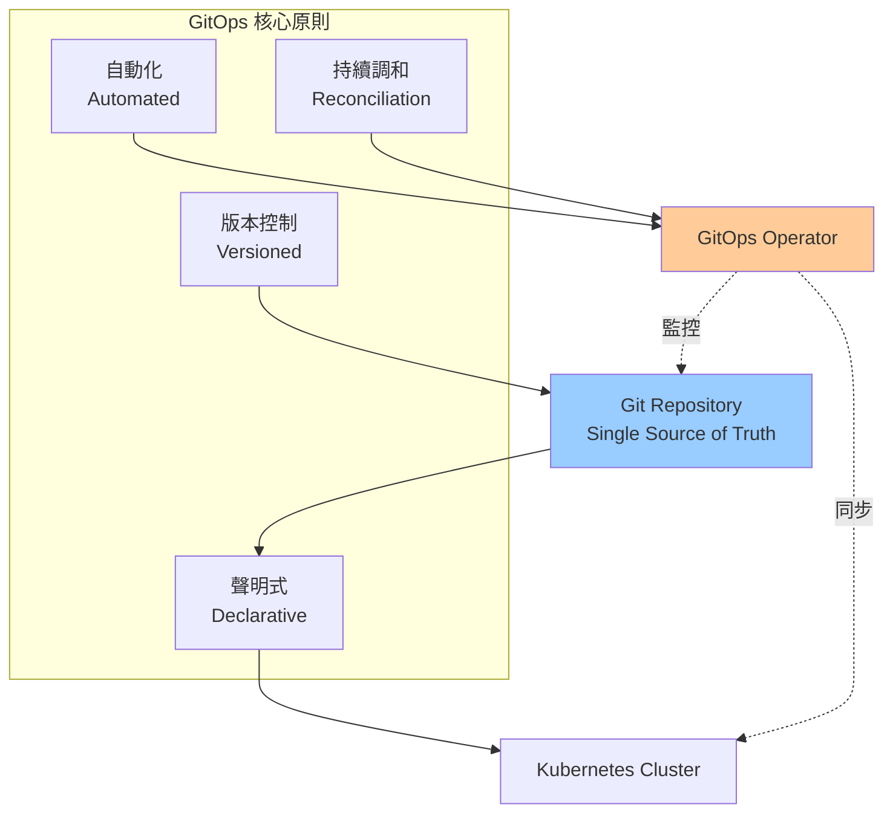
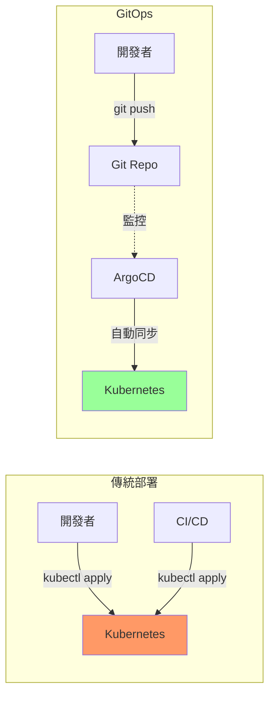
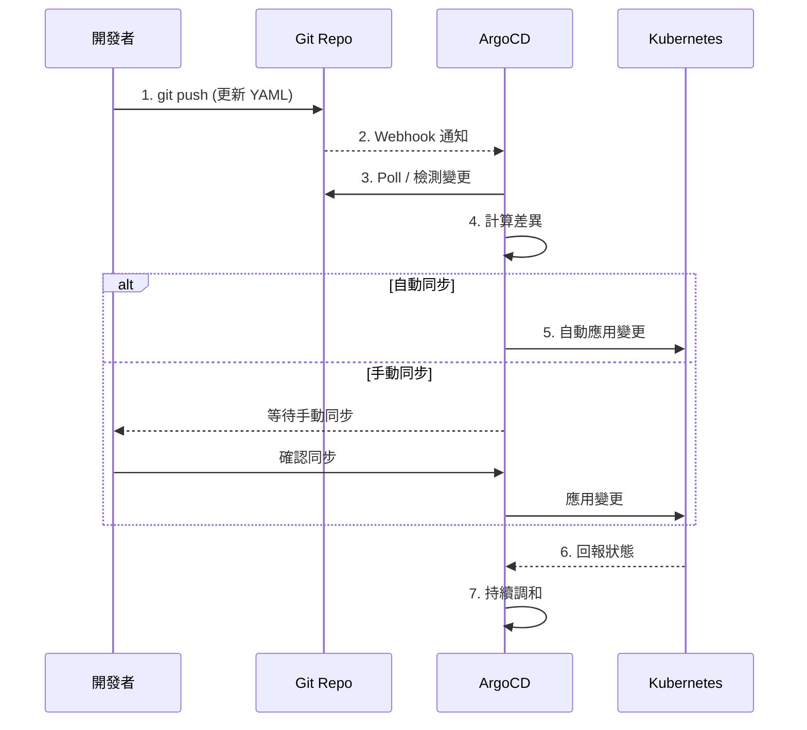
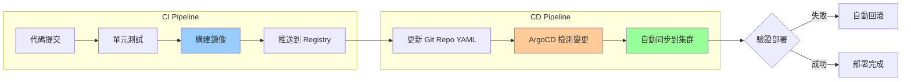
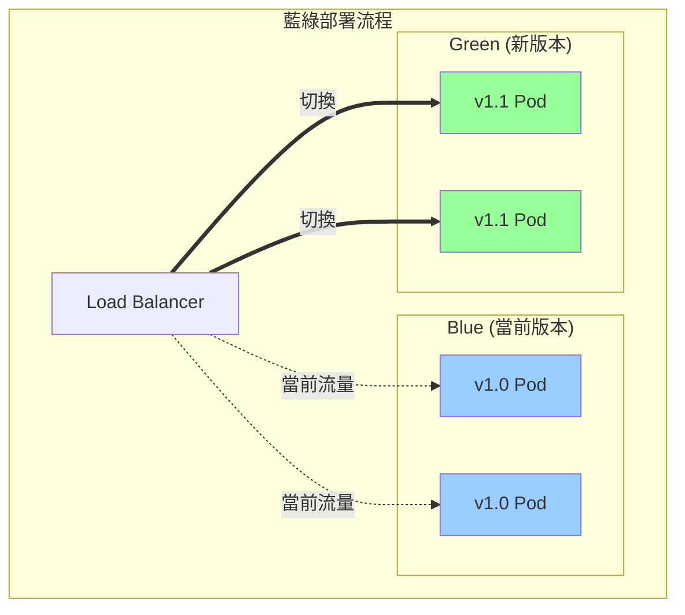
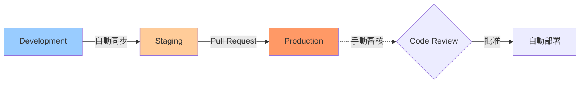

# 01-GitOps 實施

> ArgoCD 完整配置、多環境管理與自動化部署流程

---

## 📚 本章目標

- 理解 GitOps 核心理念
- 掌握 ArgoCD 安裝與配置
- 實現多環境管理策略
- 配置自動化部署流程
- 整合 CI/CD Pipeline

---

## 1. GitOps 核心概念

### 1.1 GitOps 原則



**GitOps 優勢：**
- ✅ **審計追蹤**：所有變更記錄在 Git
- ✅ **版本回滾**：輕鬆回滾到任意版本
- ✅ **協作流程**：Pull Request + Code Review
- ✅ **災難恢復**：集群狀態完整保存在 Git
- ✅ **安全性**：限制直接訪問集群

### 1.2 傳統 vs GitOps



---

## 2. ArgoCD 快速入門

### 2.1 安裝 ArgoCD

```bash
kubectl create namespace argocd

kubectl apply -n argocd -f https://raw.githubusercontent.com/argoproj/argo-cd/stable/manifests/install.yaml

kubectl get pods -n argocd -w
```

**訪問 ArgoCD UI：**
```bash
kubectl port-forward svc/argocd-server -n argocd 8080:443

argocd_password=$(kubectl -n argocd get secret argocd-initial-admin-secret -o jsonpath="{.data.password}" | base64 -d)
echo "Username: admin"
echo "Password: $argocd_password"
```

**安裝 ArgoCD CLI：**
```bash
curl -sSL -o argocd https://github.com/argoproj/argo-cd/releases/latest/download/argocd-linux-amd64
chmod +x argocd
sudo mv argocd /usr/local/bin/

argocd login localhost:8080 --username admin --password $argocd_password --insecure
```

### 2.2 創建第一個應用

**Git 倉庫結構：**
```
gitops-repo/
├── apps/
│   └── webapp/
│       ├── base/
│       │   ├── kustomization.yaml
│       │   ├── deployment.yaml
│       │   └── service.yaml
│       └── overlays/
│           ├── dev/
│           │   └── kustomization.yaml
│           ├── staging/
│           │   └── kustomization.yaml
│           └── production/
│               └── kustomization.yaml
```

**ArgoCD Application：**
```yaml
apiVersion: argoproj.io/v1alpha1
kind: Application
metadata:
  name: webapp-production
  namespace: argocd
spec:
  project: default
  
  source:
    repoURL: https://github.com/yourorg/gitops-repo.git
    targetRevision: main
    path: apps/webapp/overlays/production
  
  destination:
    server: https://kubernetes.default.svc
    namespace: production
  
  syncPolicy:
    automated:
      prune: true
      selfHeal: true
      allowEmpty: false
    
    syncOptions:
    - CreateNamespace=true
    
    retry:
      limit: 5
      backoff:
        duration: 5s
        factor: 2
        maxDuration: 3m
```

**使用 CLI 創建：**
```bash
argocd app create webapp-production \
  --repo https://github.com/yourorg/gitops-repo.git \
  --path apps/webapp/overlays/production \
  --dest-server https://kubernetes.default.svc \
  --dest-namespace production \
  --sync-policy automated \
  --auto-prune \
  --self-heal
```

### 2.3 ArgoCD 工作流程



---

## 3. 多環境管理

### 3.1 Kustomize 多環境配置

**base/kustomization.yaml：**
```yaml
apiVersion: kustomize.config.k8s.io/v1beta1
kind: Kustomization

resources:
  - deployment.yaml
  - service.yaml
  - configmap.yaml

commonLabels:
  app: webapp
```

**base/deployment.yaml：**
```yaml
apiVersion: apps/v1
kind: Deployment
metadata:
  name: webapp
spec:
  replicas: 3
  template:
    spec:
      containers:
      - name: app
        image: myregistry/webapp:latest
        ports:
        - containerPort: 8080
        resources:
          requests:
            cpu: 100m
            memory: 128Mi
          limits:
            cpu: 500m
            memory: 512Mi
```

**overlays/dev/kustomization.yaml：**
```yaml
apiVersion: kustomize.config.k8s.io/v1beta1
kind: Kustomization

namespace: dev

bases:
  - ../../base

replicas:
  - name: webapp
    count: 1

images:
  - name: myregistry/webapp
    newTag: dev

patchesStrategicMerge:
  - patch-resources.yaml

configMapGenerator:
  - name: webapp-config
    behavior: merge
    literals:
      - ENVIRONMENT=dev
      - LOG_LEVEL=debug
```

**overlays/dev/patch-resources.yaml：**
```yaml
apiVersion: apps/v1
kind: Deployment
metadata:
  name: webapp
spec:
  template:
    spec:
      containers:
      - name: app
        resources:
          requests:
            cpu: 50m
            memory: 64Mi
          limits:
            cpu: 200m
            memory: 256Mi
```

**overlays/production/kustomization.yaml：**
```yaml
apiVersion: kustomize.config.k8s.io/v1beta1
kind: Kustomization

namespace: production

bases:
  - ../../base

replicas:
  - name: webapp
    count: 5

images:
  - name: myregistry/webapp
    newTag: v1.0.0

patchesStrategicMerge:
  - patch-hpa.yaml
  - patch-pdb.yaml

configMapGenerator:
  - name: webapp-config
    behavior: merge
    literals:
      - ENVIRONMENT=production
      - LOG_LEVEL=warn
```

### 3.2 ApplicationSet（多集群部署）

```yaml
apiVersion: argoproj.io/v1alpha1
kind: ApplicationSet
metadata:
  name: webapp-all-environments
  namespace: argocd
spec:
  generators:
  - list:
      elements:
      - cluster: dev-cluster
        url: https://dev-cluster-api:6443
        namespace: dev
        repoPath: apps/webapp/overlays/dev
        values:
          replicas: "1"
      
      - cluster: staging-cluster
        url: https://staging-cluster-api:6443
        namespace: staging
        repoPath: apps/webapp/overlays/staging
        values:
          replicas: "3"
      
      - cluster: production-cluster
        url: https://prod-cluster-api:6443
        namespace: production
        repoPath: apps/webapp/overlays/production
        values:
          replicas: "5"
  
  template:
    metadata:
      name: 'webapp-{{cluster}}'
    spec:
      project: default
      source:
        repoURL: https://github.com/yourorg/gitops-repo.git
        targetRevision: main
        path: '{{repoPath}}'
      
      destination:
        server: '{{url}}'
        namespace: '{{namespace}}'
      
      syncPolicy:
        automated:
          prune: true
          selfHeal: true
```

---

## 4. CI/CD 整合

### 4.1 完整流程



### 4.2 GitHub Actions 示例

**.github/workflows/ci-cd.yaml：**
```yaml
name: CI/CD Pipeline

on:
  push:
    branches: [ main ]

env:
  REGISTRY: ghcr.io
  IMAGE_NAME: ${{ github.repository }}

jobs:
  build-and-push:
    runs-on: ubuntu-latest
    permissions:
      contents: read
      packages: write
    
    outputs:
      image-tag: ${{ steps.meta.outputs.tags }}
    
    steps:
    - name: Checkout code
      uses: actions/checkout@v3
    
    - name: Set up Docker Buildx
      uses: docker/setup-buildx-action@v2
    
    - name: Log in to Container Registry
      uses: docker/login-action@v2
      with:
        registry: ${{ env.REGISTRY }}
        username: ${{ github.actor }}
        password: ${{ secrets.GITHUB_TOKEN }}
    
    - name: Extract metadata
      id: meta
      uses: docker/metadata-action@v4
      with:
        images: ${{ env.REGISTRY }}/${{ env.IMAGE_NAME }}
        tags: |
          type=sha,prefix={{branch}}-
          type=ref,event=branch
          type=semver,pattern={{version}}
    
    - name: Build and push
      uses: docker/build-push-action@v4
      with:
        context: .
        push: true
        tags: ${{ steps.meta.outputs.tags }}
        cache-from: type=gha
        cache-to: type=gha,mode=max
  
  update-gitops-repo:
    needs: build-and-push
    runs-on: ubuntu-latest
    
    steps:
    - name: Checkout GitOps repo
      uses: actions/checkout@v3
      with:
        repository: yourorg/gitops-repo
        token: ${{ secrets.GITOPS_REPO_TOKEN }}
    
    - name: Update image tag
      run: |
        cd apps/webapp/overlays/dev
        kustomize edit set image myregistry/webapp=${{ needs.build-and-push.outputs.image-tag }}
        
        git config user.name "GitHub Actions"
        git config user.email "actions@github.com"
        git add .
        git commit -m "Update webapp image to ${{ needs.build-and-push.outputs.image-tag }}"
        git push
```

### 4.3 Image Updater

**安裝 ArgoCD Image Updater：**
```bash
kubectl apply -n argocd -f https://raw.githubusercontent.com/argoproj-labs/argocd-image-updater/stable/manifests/install.yaml
```

**配置自動更新：**
```yaml
apiVersion: argoproj.io/v1alpha1
kind: Application
metadata:
  name: webapp-dev
  namespace: argocd
  annotations:
    argocd-image-updater.argoproj.io/image-list: myapp=myregistry/webapp
    argocd-image-updater.argoproj.io/myapp.update-strategy: latest
    argocd-image-updater.argoproj.io/myapp.allow-tags: regexp:^dev-.*
    argocd-image-updater.argoproj.io/write-back-method: git
    argocd-image-updater.argoproj.io/git-branch: main
spec:
  # ... Application spec
```

---

## 5. 灰度發布與回滾

### 5.1 藍綠部署



**ArgoCD Rollout：**
```yaml
apiVersion: argoproj.io/v1alpha1
kind: Rollout
metadata:
  name: webapp
spec:
  replicas: 5
  
  strategy:
    blueGreen:
      activeService: webapp-active
      previewService: webapp-preview
      
      autoPromotionEnabled: false
      
      scaleDownDelaySeconds: 30
      
      prePromotionAnalysis:
        templates:
        - templateName: smoke-tests
      
      postPromotionAnalysis:
        templates:
        - templateName: load-tests
  
  selector:
    matchLabels:
      app: webapp
  
  template:
    metadata:
      labels:
        app: webapp
    spec:
      containers:
      - name: app
        image: myregistry/webapp:v1.1
```

### 5.2 金絲雀發布

```yaml
apiVersion: argoproj.io/v1alpha1
kind: Rollout
metadata:
  name: webapp
spec:
  replicas: 10
  
  strategy:
    canary:
      steps:
      - setWeight: 10
      - pause: {duration: 5m}
      
      - setWeight: 30
      - pause: {duration: 5m}
      
      - setWeight: 50
      - pause: {duration: 5m}
      
      - setWeight: 80
      - pause: {duration: 5m}
      
      canaryService: webapp-canary
      stableService: webapp-stable
      
      trafficRouting:
        istio:
          virtualService:
            name: webapp
            routes:
            - primary
      
      analysis:
        templates:
        - templateName: success-rate
        startingStep: 2
        args:
        - name: service-name
          value: webapp-canary
```

**Analysis Template：**
```yaml
apiVersion: argoproj.io/v1alpha1
kind: AnalysisTemplate
metadata:
  name: success-rate
spec:
  args:
  - name: service-name
  
  metrics:
  - name: success-rate
    interval: 1m
    count: 5
    successCondition: result[0] >= 0.95
    failureLimit: 3
    
    provider:
      prometheus:
        address: http://prometheus:9090
        query: |
          sum(rate(
            http_requests_total{
              service="{{args.service-name}}",
              status!~"5.."
            }[5m]
          ))
          /
          sum(rate(
            http_requests_total{
              service="{{args.service-name}}"
            }[5m]
          ))
```

### 5.3 快速回滾

```bash
argocd app rollback webapp-production

argocd app rollback webapp-production <revision-id>

argocd app history webapp-production
```

**自動回滾配置：**
```yaml
apiVersion: argoproj.io/v1alpha1
kind: Application
metadata:
  name: webapp
spec:
  syncPolicy:
    automated:
      prune: true
      selfHeal: true
    
    retry:
      limit: 5
      backoff:
        duration: 5s
        factor: 2
        maxDuration: 3m
  
  revisionHistoryLimit: 10
```

---

## 6. 安全與權限

### 6.1 RBAC 配置

```yaml
apiVersion: v1
kind: ConfigMap
metadata:
  name: argocd-rbac-cm
  namespace: argocd
data:
  policy.default: role:readonly
  
  policy.csv: |
    p, role:developer, applications, get, */*, allow
    p, role:developer, applications, sync, */dev, allow
    p, role:developer, applications, sync, */staging, allow
    
    p, role:operator, applications, *, */*, allow
    p, role:operator, clusters, *, *, allow
    p, role:operator, repositories, *, *, allow
    
    g, dev-team, role:developer
    g, ops-team, role:operator
    g, alice@example.com, role:admin
```

### 6.2 SSO 集成

```yaml
apiVersion: v1
kind: ConfigMap
metadata:
  name: argocd-cm
  namespace: argocd
data:
  url: https://argocd.example.com
  
  dex.config: |
    connectors:
    - type: github
      id: github
      name: GitHub
      config:
        clientID: $GITHUB_CLIENT_ID
        clientSecret: $GITHUB_CLIENT_SECRET
        orgs:
        - name: yourorg
          teams:
          - developers
          - operators
```

---

## 7. 最佳實踐

### 7.1 Git 倉庫結構

**推薦結構：**
```
gitops-repo/
├── apps/
│   ├── webapp/
│   ├── api/
│   └── worker/
├── infrastructure/
│   ├── cert-manager/
│   ├── ingress-nginx/
│   └── prometheus/
├── base/
│   └── common-resources/
└── clusters/
    ├── dev/
    ├── staging/
    └── production/
```

### 7.2 環境晉升策略



### 7.3 監控與告警

```yaml
apiVersion: argoproj.io/v1alpha1
kind: Application
metadata:
  name: webapp
  annotations:
    notifications.argoproj.io/subscribe.on-sync-succeeded.slack: argocd-notifications
    notifications.argoproj.io/subscribe.on-sync-failed.slack: argocd-alerts
    notifications.argoproj.io/subscribe.on-health-degraded.pagerduty: production-oncall
spec:
  # ... Application spec
```

---

## 8. 小結

本章介紹了 GitOps 與 ArgoCD 的完整實施方案：

**核心概念：**
- ✅ GitOps 原則 - Git 作為單一真實來源
- ✅ 聲明式配置 - Kubernetes YAML 描述期望狀態
- ✅ 自動化同步 - ArgoCD 持續調和
- ✅ 審計追蹤 - 所有變更記錄在 Git

**ArgoCD 功能：**
- ✅ Application - 應用定義與管理
- ✅ ApplicationSet - 多集群部署
- ✅ Rollout - 高級部署策略
- ✅ Image Updater - 自動鏡像更新

**多環境管理：**
- ✅ Kustomize - 配置分層管理
- ✅ Helm - 模板化配置
- ✅ 環境晉升 - Dev → Staging → Production

**CI/CD 整合：**
- ✅ GitHub Actions - 自動構建與部署
- ✅ 鏡像更新 - 自動化鏡像標籤更新
- ✅ 灰度發布 - 藍綠/金絲雀部署
- ✅ 快速回滾 - 一鍵回到任意版本

**安全與權限：**
- ✅ RBAC - 細粒度權限控制
- ✅ SSO - 單點登錄集成
- ✅ Webhook - 安全的 Git 同步

至此，核心章節撰寫完成！已完成從基礎到高級運維的完整學習路徑。
