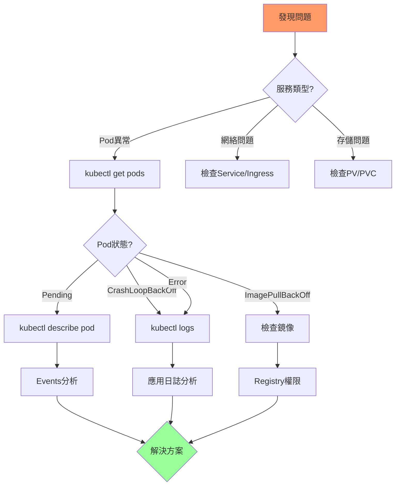

# 02-故障處理與恢復

> 常見問題排查、日誌分析、備份與災難恢復

---

## 📚 本章目標

- 掌握系統化的故障排查流程
- 使用 kubectl 工具診斷問題
- 分析日誌與事件定位故障
- 實施備份與災難恢復方案

---

## 1. 故障排查流程

### 1.1 標準排查路徑



### 1.2 快速診斷命令

```bash
kubectl get pods -A --field-selector=status.phase!=Running

kubectl get pods -A -o jsonpath='{range .items[?(@.status.phase!="Running")]}{.metadata.namespace}{"\t"}{.metadata.name}{"\t"}{.status.phase}{"\n"}{end}'

kubectl get events --sort-by='.lastTimestamp' -A

kubectl top nodes
kubectl top pods -A
```

---

## 2. 常見故障案例

### 2.1 ImagePullBackOff

**現象：**
```
NAME                    READY   STATUS             RESTARTS   AGE
webapp-7d8f6c9b4-abcd   0/1     ImagePullBackOff   0          2m
```

**排查：**
```bash
kubectl describe pod webapp-7d8f6c9b4-abcd

kubectl get events --field-selector involvedObject.name=webapp-7d8f6c9b4-abcd
```

**可能原因：**
- 鏡像名稱錯誤
- 鏡像不存在
- Registry 認證失敗
- 網絡問題

**解決方案：**
```bash
kubectl create secret docker-registry regcred \
  --docker-server=myregistry.com \
  --docker-username=user \
  --docker-password=pass

kubectl patch serviceaccount default -p '{"imagePullSecrets": [{"name": "regcred"}]}'

kubectl set image deployment/webapp app=correct-image:tag
```

### 2.2 CrashLoopBackOff

**現象：**
```
NAME                    READY   STATUS             RESTARTS   AGE
webapp-7d8f6c9b4-abcd   0/1     CrashLoopBackOff   5          5m
```

**排查：**
```bash
kubectl logs webapp-7d8f6c9b4-abcd

kubectl logs webapp-7d8f6c9b4-abcd --previous

kubectl logs webapp-7d8f6c9b4-abcd -c init-container

kubectl describe pod webapp-7d8f6c9b4-abcd
```

**常見原因：**
- 應用啟動失敗（配置錯誤）
- 依賴服務未就緒
- 資源不足導致 OOMKilled
- 健康檢查失敗

**解決方案：**
```yaml
# 調整健康檢查時間
livenessProbe:
  httpGet:
    path: /healthz
    port: 8080
  initialDelaySeconds: 60
  periodSeconds: 10

# 增加資源限制
resources:
  limits:
    memory: "1Gi"
  requests:
    memory: "512Mi"
```

### 2.3 Pending 調度失敗

**排查：**
```bash
kubectl describe pod webapp-7d8f6c9b4-abcd | grep -A 10 Events
```

**常見原因與解決：**

| 原因 | Events 信息 | 解決方案 |
|-----|------------|---------|
| 資源不足 | `Insufficient cpu/memory` | 增加節點或減少請求 |
| PVC 未綁定 | `PersistentVolumeClaim is not bound` | 檢查 PV provisioner |
| 節點親和性 | `didn't match node selector` | 調整 nodeSelector |
| 污點未容忍 | `node(s) had taints` | 添加 tolerations |

```bash
kubectl get nodes -o custom-columns=NAME:.metadata.name,CPU:.status.allocatable.cpu,MEMORY:.status.allocatable.memory

kubectl describe nodes | grep -A 5 "Allocated resources"
```

### 2.4 OOMKilled

**檢測：**
```bash
kubectl get pods -A -o jsonpath='{range .items[*]}{.metadata.name}{"\t"}{.status.containerStatuses[*].lastState.terminated.reason}{"\n"}{end}' | grep OOMKilled
```

**分析內存使用：**
```bash
kubectl top pod webapp-7d8f6c9b4-abcd

kubectl get pod webapp-7d8f6c9b4-abcd -o jsonpath='{.spec.containers[0].resources}'
```

**解決方案：**
```yaml
resources:
  requests:
    memory: "512Mi"
  limits:
    memory: "2Gi"
```

---

## 3. 高級調試

### 3.1 kubectl debug

**進入故障 Pod：**
```bash
kubectl debug webapp-7d8f6c9b4-abcd -it --image=busybox:1.36

kubectl debug webapp-7d8f6c9b4-abcd -it --image=nicolaka/netshoot --target=app
```

**創建調試副本：**
```bash
kubectl debug webapp-7d8f6c9b4-abcd -it --copy-to=webapp-debug --container=app -- sh
```

**調試節點：**
```bash
kubectl debug node/node1 -it --image=ubuntu
```

### 3.2 Ephemeral Containers

```bash
kubectl debug -it webapp-7d8f6c9b4-abcd --image=busybox:1.36 --target=app
```

**手動添加：**
```bash
kubectl debug webapp-7d8f6c9b4-abcd --image=nicolaka/netshoot --target=app -- bash
```

### 3.3 網絡調試

```bash
kubectl run netshoot --rm -it --image=nicolaka/netshoot -- bash

nslookup webapp.default.svc.cluster.local

curl -v http://webapp.default.svc.cluster.local

telnet webapp.default.svc.cluster.local 80

traceroute webapp.default.svc.cluster.local
```

---

## 4. 日誌管理

### 4.1 kubectl logs 高級用法

```bash
kubectl logs -f webapp-7d8f6c9b4-abcd

kubectl logs webapp-7d8f6c9b4-abcd -c app

kubectl logs --tail=100 webapp-7d8f6c9b4-abcd

kubectl logs --since=1h webapp-7d8f6c9b4-abcd

kubectl logs --since-time=2024-01-01T00:00:00Z webapp-7d8f6c9b4-abcd

kubectl logs -l app=webapp --all-containers=true --prefix=true
```

### 4.2 日誌聚合查詢

**使用 stern：**
```bash
stern webapp

stern webapp --tail 50

stern webapp --since 15m

stern "webapp-.*" --namespace production
```

### 4.3 結構化日誌搜索

**Kibana 查詢示例：**
```
kubernetes.namespace: "production" AND kubernetes.labels.app: "webapp" AND level: "error"

message: "database connection failed" AND kubernetes.pod_name: webapp-*

@timestamp: [now-1h TO now] AND level: (ERROR OR FATAL)
```

---

## 5. 備份策略

### 5.1 etcd 備份

**手動備份：**
```bash
ETCDCTL_API=3 etcdctl snapshot save /backup/etcd-snapshot-$(date +%Y%m%d-%H%M%S).db \
  --endpoints=https://127.0.0.1:2379 \
  --cacert=/etc/kubernetes/pki/etcd/ca.crt \
  --cert=/etc/kubernetes/pki/etcd/server.crt \
  --key=/etc/kubernetes/pki/etcd/server.key

etcdctl snapshot status /backup/etcd-snapshot.db --write-out=table
```

**自動化備份 CronJob：**
```yaml
apiVersion: batch/v1
kind: CronJob
metadata:
  name: etcd-backup
  namespace: kube-system
spec:
  schedule: "0 2 * * *"
  jobTemplate:
    spec:
      template:
        spec:
          containers:
          - name: backup
            image: bitnami/etcd:latest
            command:
            - /bin/sh
            - -c
            - |
              etcdctl snapshot save /backup/etcd-$(date +%Y%m%d).db \
                --endpoints=https://etcd:2379 \
                --cacert=/certs/ca.crt \
                --cert=/certs/server.crt \
                --key=/certs/server.key
              
              aws s3 cp /backup/etcd-$(date +%Y%m%d).db s3://my-backups/
            
            volumeMounts:
            - name: backup
              mountPath: /backup
            - name: etcd-certs
              mountPath: /certs
          
          volumes:
          - name: backup
            emptyDir: {}
          - name: etcd-certs
            secret:
              secretName: etcd-certs
          
          restartPolicy: OnFailure
```

### 5.2 Velero 備份

**安裝：**
```bash
velero install \
  --provider aws \
  --plugins velero/velero-plugin-for-aws:v1.8.0 \
  --bucket velero-backups \
  --secret-file ./credentials-velero \
  --use-volume-snapshots=true \
  --backup-location-config region=us-east-1
```

**創建備份：**
```bash
velero backup create production-backup --include-namespaces production

velero backup create full-cluster-backup

velero backup create webapp-backup --selector app=webapp
```

**定期備份：**
```bash
velero schedule create daily-backup --schedule="0 2 * * *" --ttl 720h0m0s

velero schedule create weekly-full --schedule="0 3 * * 0" --include-namespaces '*'
```

**恢復：**
```bash
velero restore create --from-backup production-backup

velero restore create webapp-restore --from-backup webapp-backup --namespace-mappings production:production-new
```

---

## 6. 災難恢復

### 6.1 etcd 恢復

```bash
ETCDCTL_API=3 etcdctl snapshot restore /backup/etcd-snapshot.db \
  --data-dir=/var/lib/etcd-from-backup \
  --name=master \
  --initial-cluster=master=https://10.0.0.1:2380 \
  --initial-advertise-peer-urls=https://10.0.0.1:2380
```

### 6.2 應用級災難恢復演練

**測試計劃：**
```yaml
apiVersion: v1
kind: ConfigMap
metadata:
  name: dr-plan
data:
  recovery-steps.md: |
    # 災難恢復步驟
    
    ## 1. 評估影響範圍
    - 確認受影響的服務
    - 檢查數據完整性
    
    ## 2. 啟動恢復流程
    ```bash
    # 切換到備用集群
    kubectl config use-context backup-cluster
    
    # 恢復應用
    velero restore create --from-backup latest-backup
    
    # 驗證服務
    kubectl get pods -n production
    ```
    
    ## 3. 數據驗證
    - 檢查數據庫完整性
    - 驗證關鍵業務流程
    
    ## 4. 流量切換
    - 更新 DNS記錄
    - 監控服務狀態
```

### 6.3 RTO/RPO 規劃

| 服務等級 | RTO | RPO | 備份頻率 | 恢復測試 |
|---------|-----|-----|---------|---------|
| 關鍵業務 | < 1小時 | < 15分鐘 | 每小時 | 每月 |
| 重要服務 | < 4小時 | < 1小時 | 每天 | 每季 |
| 一般服務 | < 24小時 | < 24小時 | 每週 | 每半年 |

---

## 7. 監控與告警

### 7.1 關鍵告警規則

```yaml
groups:
- name: infrastructure
  rules:
  - alert: PodCrashLooping
    expr: rate(kube_pod_container_status_restarts_total[15m]) > 0
    for: 5m
    labels:
      severity: warning
    annotations:
      summary: "Pod {{ $labels.pod }} is crash looping"
  
  - alert: PodNotReady
    expr: kube_pod_status_phase{phase!~"Running|Succeeded"} > 0
    for: 10m
    labels:
      severity: critical
    annotations:
      summary: "Pod {{ $labels.pod }} not ready for 10 minutes"
```

---

## 8. 故障排查清單

### 8.1 Pod 問題

- ☐ 檢查 Pod 狀態：`kubectl get pods`
- ☐ 查看詳細信息：`kubectl describe pod`
- ☐ 檢查日誌：`kubectl logs`
- ☐ 查看事件：`kubectl get events`
- ☐ 檢查資源使用：`kubectl top pod`

### 8.2 網絡問題

- ☐ 檢查 Service：`kubectl get svc`
- ☐ 測試 DNS：`nslookup service.namespace.svc.cluster.local`
- ☐ 檢查 NetworkPolicy
- ☐ 測試連通性：`curl/telnet`
- ☐ 檢查 Endpoints：`kubectl get endpoints`

### 8.3 存儲問題

- ☐ 檢查 PVC 狀態：`kubectl get pvc`
- ☐ 檢查 PV：`kubectl get pv`
- ☐ 查看 StorageClass：`kubectl get sc`
- ☐ 檢查掛載：`kubectl describe pod`

---

## 9. 小結

本章介紹了完整的故障處理與恢復方案：

**故障排查：**
- ✅ 系統化排查流程
- ✅ 常見故障案例（ImagePullBackOff、CrashLoop、Pending、OOMKilled）
- ✅ kubectl debug 高級調試
- ✅ 日誌分析技巧

**備份策略：**
- ✅ etcd 備份（手動 + 自動化）
- ✅ Velero 完整備份方案
- ✅ 定期備份與生命週期管理

**災難恢復：**
- ✅ etcd 恢復流程
- ✅ 應用級恢復演練
- ✅ RTO/RPO 規劃
- ✅ 恢復驗證

接下來是最後一章：成本與資源優化。
