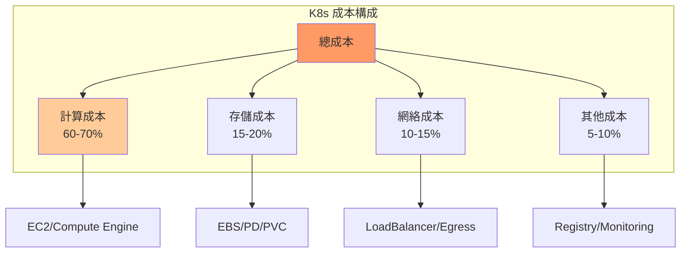

# 03-成本與資源優化

> 雲端成本分析、資源利用率優化與成本控制策略

---

## 📚 本章目標

- 理解 Kubernetes 成本模型
- 分析與優化資源利用率
- 實施節點與存儲成本優化
- 建立成本監控與告警機制

---

## 1. Kubernetes 成本模型

### 1.1 成本構成



### 1.2 成本分析工具

**Kubecost 安裝：**
```bash
helm repo add kubecost https://kubecost.github.io/cost-analyzer/
helm install kubecost kubecost/cost-analyzer \
  --namespace kubecost \
  --create-namespace \
  --set kubecostToken="aGVsbUBrdWJlY29zdC5jb20=xm343yadf98"
```

**訪問Dashboard：**
```bash
kubectl port-forward -n kubecost svc/kubecost-cost-analyzer 9090:9090
```

---

## 2. 資源利用率優化

### 2.1 識別過度配置

**查找低利用率 Pod：**
```bash
kubectl get pods -A -o json | jq -r '
  .items[] | 
  select(.spec.containers[].resources.requests.cpu != null) |
  "\(.metadata.namespace)\t\(.metadata.name)\t\(.spec.containers[].resources.requests.cpu)"
'

kubectl top pods -A --sort-by=cpu

kubectl top pods -A --sort-by=memory
```

**資源使用率分析：**
```promql
# CPU 使用率 < 20%
(
  sum(rate(container_cpu_usage_seconds_total{container!=""}[5m])) by (pod, namespace)
  /
  sum(kube_pod_container_resource_requests{resource="cpu"}) by (pod, namespace)
) < 0.2

# 內存使用率 < 30%
(
  sum(container_memory_working_set_bytes{container!=""}) by (pod, namespace)
  /
  sum(kube_pod_container_resource_requests{resource="memory"}) by (pod, namespace)
) < 0.3
```

### 2.2 Right-sizing 建議

**使用 VPA 推薦：**
```yaml
apiVersion: autoscaling.k8s.io/v1
kind: VerticalPodAutoscaler
metadata:
  name: webapp-recommender
spec:
  targetRef:
    apiVersion: apps/v1
    kind: Deployment
    name: webapp
  
  updatePolicy:
    updateMode: "Off"
```

**查看推薦值：**
```bash
kubectl describe vpa webapp-recommender
```

**優化示例：**
```yaml
# 優化前
resources:
  requests:
    cpu: "2000m"
    memory: "4Gi"
  limits:
    cpu: "4000m"
    memory: "8Gi"

# 優化後（基於實際使用）
resources:
  requests:
    cpu: "500m"
    memory: "1Gi"
  limits:
    cpu: "1000m"
    memory: "2Gi"
```

**節省：** 75% 資源請求，約 60% 成本降低

---

## 3. 節點優化

### 3.1 節點類型選擇

| 工作負載 | 推薦實例類型 | 成本優化策略 |
|---------|------------|------------|
| 通用計算 | t3.medium | Spot 實例 |
| 內存密集 | r5.large | Reserved Instance |
| CPU 密集 | c5.xlarge | Savings Plans |
| GPU 工作 | p3.2xlarge | 按需 + Spot |

### 3.2 Spot/Preemptible 實例

**節點池配置（GKE）：**
```yaml
apiVersion: v1
kind: ConfigMap
metadata:
  name: spot-nodepool-config
data:
  config: |
    gcloud container node-pools create spot-pool \
      --cluster=my-cluster \
      --preemptible \
      --machine-type=n1-standard-4 \
      --num-nodes=3 \
      --enable-autoscaling \
      --min-nodes=1 \
      --max-nodes=10
```

**容忍 Spot 中斷：**
```yaml
apiVersion: apps/v1
kind: Deployment
metadata:
  name: batch-processor
spec:
  template:
    spec:
      tolerations:
      - key: "cloud.google.com/gke-preemptible"
        operator: "Equal"
        value: "true"
        effect: "NoSchedule"
      
      affinity:
        nodeAffinity:
          preferredDuringSchedulingIgnoredDuringExecution:
          - weight: 100
            preference:
              matchExpressions:
              - key: cloud.google.com/gke-preemptible
                operator: In
                values:
                - "true"
```

**成本節省：** 60-90%

### 3.3 Cluster Autoscaler

```yaml
apiVersion: v1
kind: ConfigMap
metadata:
  name: cluster-autoscaler-config
  namespace: kube-system
data:
  config: |
    --balance-similar-node-groups=true
    --skip-nodes-with-local-storage=false
    --skip-nodes-with-system-pods=false
    --scale-down-enabled=true
    --scale-down-delay-after-add=10m
    --scale-down-unneeded-time=10m
    --scale-down-utilization-threshold=0.5
    --max-node-provision-time=15m
```

---

## 4. 存儲成本優化

### 4.1 存儲類型選擇

| 用途 | 存儲類型 | IOPS | 成本 |
|-----|---------|------|------|
| 數據庫 | gp3 SSD | 16,000 | $$$ |
| 日誌 | st1 HDD | 500 | $ |
| 緩存 | Local SSD | 400K | $$ |
| 備份 | S3/GCS | - | $ |

**StorageClass 優化：**
```yaml
apiVersion: storage.k8s.io/v1
kind: StorageClass
metadata:
  name: cost-optimized
provisioner: kubernetes.io/aws-ebs
parameters:
  type: gp3
  iops: "3000"
  throughput: "125"
volumeBindingMode: WaitForFirstConsumer
reclaimPolicy: Delete
allowVolumeExpansion: true
```

### 4.2 PV 生命週期管理

**自動清理 CronJob：**
```yaml
apiVersion: batch/v1
kind: CronJob
metadata:
  name: pv-cleanup
spec:
  schedule: "0 0 * * 0"
  jobTemplate:
    spec:
      template:
        spec:
          serviceAccountName: pv-cleanup-sa
          containers:
          - name: cleanup
            image: bitnami/kubectl:latest
            command:
            - /bin/sh
            - -c
            - |
              # 刪除 Released 狀態超過 30 天的 PV
              kubectl get pv -o json | \
              jq -r '.items[] | 
                select(.status.phase=="Released") | 
                select((now - (.metadata.creationTimestamp | fromdate)) > 2592000) | 
                .metadata.name' | \
              xargs -I {} kubectl delete pv {}
          restartPolicy: OnFailure
```

### 4.3 對象存儲替代

**使用 S3/MinIO：**
```yaml
apiVersion: apps/v1
kind: Deployment
metadata:
  name: webapp
spec:
  template:
    spec:
      containers:
      - name: app
        image: myapp:v1.0
        env:
        - name: STORAGE_TYPE
          value: "s3"
        - name: S3_BUCKET
          value: "my-app-data"
        - name: S3_ENDPOINT
          value: "s3.amazonaws.com"
```

**成本對比：**
- EBS gp3: $0.08/GB/月
- S3 Standard: $0.023/GB/月
- S3 IA: $0.0125/GB/月

**節省：** 71-84%

---

## 5. 網絡成本控制

### 5.1 減少跨區域流量

```yaml
apiVersion: v1
kind: Service
metadata:
  name: webapp
  annotations:
    service.kubernetes.io/topology-aware-hints: "auto"
spec:
  type: LoadBalancer
  externalTrafficPolicy: Local
  selector:
    app: webapp
```

### 5.2 使用 CDN

```yaml
apiVersion: networking.k8s.io/v1
kind: Ingress
metadata:
  name: webapp
  annotations:
    kubernetes.io/ingress.class: "nginx"
    nginx.ingress.kubernetes.io/use-cdn: "true"
    nginx.ingress.kubernetes.io/cdn-origin: "cloudfront"
spec:
  rules:
  - host: app.example.com
    http:
      paths:
      - path: /static
        pathType: Prefix
        backend:
          service:
            name: cdn-service
            port:
              number: 80
```

### 5.3 內網通信優化

```yaml
apiVersion: v1
kind: Service
metadata:
  name: internal-api
  annotations:
    service.beta.kubernetes.io/aws-load-balancer-internal: "true"
spec:
  type: LoadBalancer
  selector:
    app: internal-api
```

---

## 6. 成本監控與告警

### 6.1 成本監控面板

**Prometheus 查詢：**
```promql
# 每小時成本
sum(
  kube_pod_container_resource_requests{resource="cpu"} 
  * on(node) group_left() 
  node_cpu_hourly_cost
) / 1000

# namespace 成本排名
topk(10, 
  sum(
    kube_pod_container_resource_requests{resource="cpu"}
  ) by (namespace)
)

# 未使用資源成本
sum(
  (
    kube_node_status_allocatable{resource="cpu"} 
    - 
    kube_pod_container_resource_requests{resource="cpu"}
  ) * node_cpu_hourly_cost
)
```

### 6.2 成本告警

```yaml
groups:
- name: cost-alerts
  rules:
  - alert: HighMonthlyCost
    expr: sum(kubecost_cluster_management_cost) > 10000
    for: 1h
    labels:
      severity: warning
    annotations:
      summary: "Monthly cost exceeds $10,000"
  
  - alert: ResourceWaste
    expr: |
      (
        sum(kube_node_status_allocatable{resource="cpu"})
        -
        sum(kube_pod_container_resource_requests{resource="cpu"})
      ) / sum(kube_node_status_allocatable{resource="cpu"}) > 0.4
    for: 24h
    labels:
      severity: info
    annotations:
      summary: "Over 40% CPU capacity unused"
```

---

## 7. ResourceQuota 配額管理

### 7.1 Namespace 配額

```yaml
apiVersion: v1
kind: ResourceQuota
metadata:
  name: team-quota
  namespace: development
spec:
  hard:
    requests.cpu: "50"
    requests.memory: 100Gi
    limits.cpu: "100"
    limits.memory: 200Gi
    
    pods: "100"
    services: "20"
    persistentvolumeclaims: "10"
    
    requests.storage: "500Gi"

---
apiVersion: v1
kind: LimitRange
metadata:
  name: resource-limits
  namespace: development
spec:
  limits:
  - max:
      cpu: "4"
      memory: "8Gi"
    min:
      cpu: "100m"
      memory: "128Mi"
    default:
      cpu: "500m"
      memory: "512Mi"
    defaultRequest:
      cpu: "200m"
      memory: "256Mi"
    type: Container
```

### 7.2 成本歸屬

**標籤策略：**
```yaml
apiVersion: apps/v1
kind: Deployment
metadata:
  name: webapp
  labels:
    app: webapp
    team: backend
    cost-center: "engineering"
    project: "user-service"
    environment: "production"
```

**成本報告查詢：**
```promql
sum(
  kube_pod_labels{label_cost_center="engineering"}
  * on(pod) 
  kube_pod_container_resource_requests{resource="cpu"}
) by (label_team, label_project)
```

---

## 8. 成本優化清單

### 8.1 計算優化

- ☐ 使用 VPA 推薦值調整資源
- ☐ 識別並減少過度配置（< 30% 利用率）
- ☐ 使用 Spot/Preemptible 實例（非關鍵負載）
- ☐ 啟用 Cluster Autoscaler
- ☐ 定期審查節點類型選擇

### 8.2 存儲優化

- ☐ 使用合適的存儲類型（gp3 vs st1）
- ☐ 清理未使用的 PV/PVC
- ☐ 遷移靜態數據到對象存儲
- ☐ 實施生命週期策略
- ☐ 壓縮歸檔舊數據

### 8.3 網絡優化

- ☐ 減少跨區域流量
- ☐ 使用 CDN 服務靜態資源
- ☐ 內部服務使用內網 LoadBalancer
- ☐ 優化 Egress 流量

### 8.4 管理優化

- ☐ 設置 namespace ResourceQuota
- ☐ 實施成本標籤策略
- ☐ 建立成本監控面板
- ☐ 配置成本告警
- ☐ 定期成本審查會議

---

## 9. 成本優化案例

### 9.1 優化前

**配置：**
- 10 個 m5.2xlarge 節點（按需）
- 500GB gp2 存儲
- 公網 LoadBalancer

**月度成本：** ~$5,000

### 9.2 優化後

**配置：**
- 3 個 m5.xlarge 節點（Reserved Instance）
- 5 個 m5.large 節點（Spot，非關鍵負載）
- 200GB gp3 存儲 + 300GB S3
- 內網 LoadBalancer + CloudFront CDN

**優化措施：**
- Right-sizing（VPA 推薦）
- Spot 實例混合
- 存儲分層
- 網絡優化

**月度成本：** ~$1,800

**節省：** 64% ($3,200/月)

---

## 10. 小結

本章介紹了 Kubernetes 成本優化的完整策略：

**成本分析：**
- ✅ 理解成本構成（計算 60-70%、存儲 15-20%、網絡 10-15%）
- ✅ 使用 Kubecost 分析工具
- ✅ 識別過度配置

**資源優化：**
- ✅ Right-sizing（VPA 推薦）
- ✅ Spot/Preemptible 實例（60-90% 節省）
- ✅ Cluster Autoscaler 自動擴縮容

**存儲優化：**
- ✅ 選擇合適的存儲類型
- ✅ PV 生命週期管理
- ✅ 對象存儲替代（節省 71-84%）

**網絡優化：**
- ✅ 減少跨區域流量
- ✅ CDN 加速靜態資源
- ✅ 內網服務通信

**成本管理：**
- ✅ ResourceQuota 配額控制
- ✅ 成本標籤與歸屬
- ✅ 監控與告警
- ✅ 定期審查機制

---

## 🎉 Part IV 運維篇完成！

至此，Kubernetes 開發者實戰指南的所有核心章節已經完成：

- ✅ **Part I: 基礎篇**（3章）- 快速上手與核心概念
- ✅ **Part II: 開發篇**（3章）- 容器化、配置、服務通信
- ✅ **Part III: 進階篇**（4章）- 高可用、監控、安全、性能
- ✅ **Part IV: 運維篇**（3章）- GitOps、故障處理、成本優化

**總計：13 章核心內容 + 完整實戰案例**

下一步：更新 README 最終版本。
