# K8s 微服務基礎設施完整部署指南

> 基於 k3s 三節點集群的完整微服務基礎設施搭建教程
> 
> 最後更新：2025年

---

## 📋 目錄

- [環境準備](#環境準備)
- [kubectl 命令詳解](#kubectl-命令詳解)
- [1. Longhorn - 分佈式存儲](#1-longhorn---分佈式存儲)
- [2. MinIO - 對象存儲](#2-minio---對象存儲)
- [3. cert-manager - 證書管理](#3-cert-manager---證書管理)
- [4. Prometheus + Grafana - 監控系統](#4-prometheus--grafana---監控系統)
- [5. Loki - 日誌系統](#5-loki---日誌系統)
- [6. Harbor - 私有鏡像倉庫](#6-harbor---私有鏡像倉庫)
- [7. ArgoCD - GitOps 持續部署](#7-argocd---gitops-持續部署)
- [8. Redis - 分佈式緩存](#8-redis---分佈式緩存)
- [9. Kafka - 消息隊列](#9-kafka---消息隊列)
- [10. Velero - 備份與災難恢復](#10-velero---備份與災難恢復)
- [11. 可選組件](#11-可選組件)
- [架構總覽](#架構總覽)
- [運維最佳實踐](#運維最佳實踐)
- [故障排查指南](#故障排查指南)
- [學習資源推薦](#學習資源推薦)
- [常見問題](#常見問題)

---

## 環境準備

### 確認 K3s 集群狀態

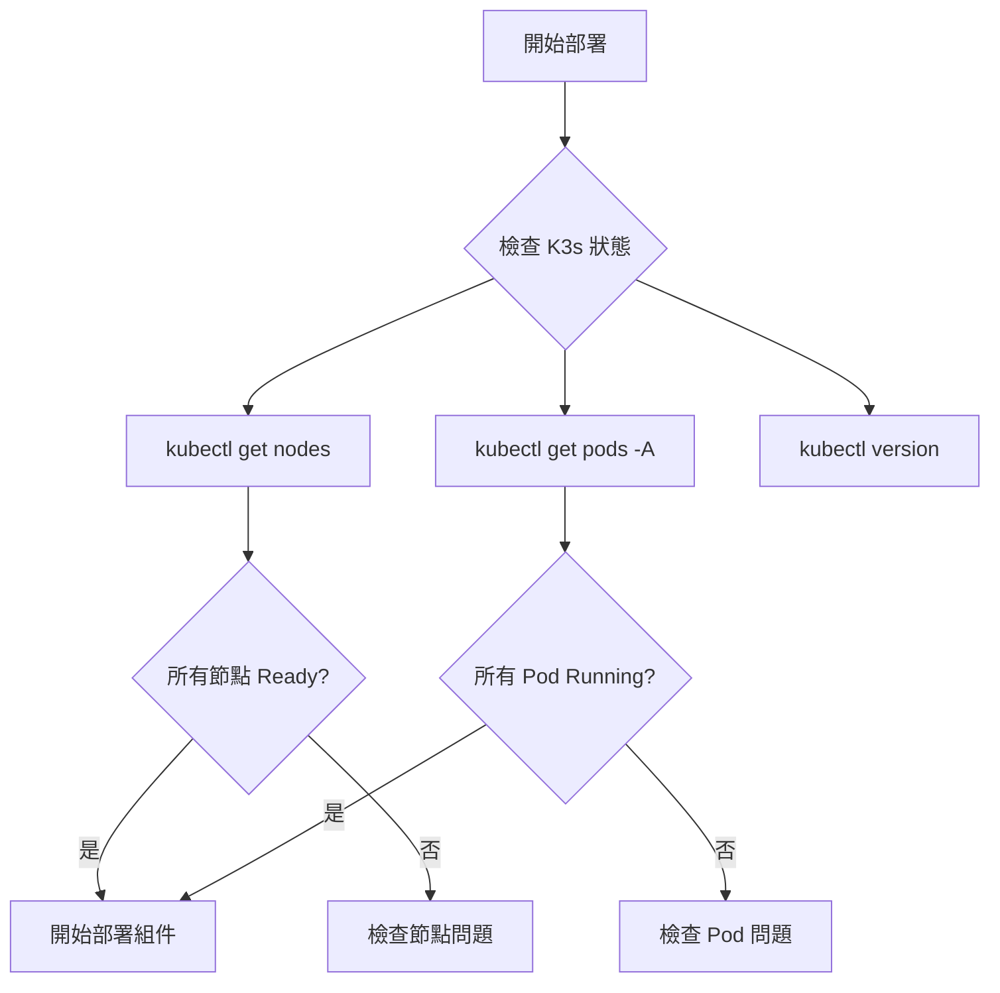

```bash
# 檢查節點狀態
kubectl get nodes -o wide

# 檢查 k3s 內建組件
kubectl get pods -A

# 確認 k3s 版本
kubectl version --short
```

### k3s 內建組件

- ✅ Traefik (Ingress Controller)
- ✅ CoreDNS (DNS 服務)
- ✅ Local-path-provisioner (本地存儲)
- ✅ Service Load Balancer (Klipper)

---

## kubectl 命令詳解

### 基礎查看命令

```bash
# 查看節點
kubectl get nodes                    # 列出所有節點
kubectl get nodes -o wide           # 顯示更多信息（IP、OS等）

# 查看 Pod
kubectl get pods                     # 當前命名空間的 Pod
kubectl get pods -A                  # 所有命名空間的 Pod
kubectl get pods -n monitoring       # 指定命名空間
kubectl get pods -w                  # 持續監控（watch mode）

# 查看詳細信息
kubectl describe pod <pod-name>      # Pod 詳情（事件、狀態、配置）
kubectl describe node <node-name>    # 節點詳情

# 查看日誌
kubectl logs <pod-name>              # 查看 Pod 日誌
kubectl logs <pod-name> -f           # 持續跟蹤日誌
kubectl logs <pod-name> -c <container-name>  # 多容器 Pod 指定容器
kubectl logs <pod-name> --previous   # 查看崩潰容器的日誌
```

### 資源管理命令

```bash
# 創建資源
kubectl apply -f file.yaml           # 創建/更新資源（聲明式）
kubectl create -f file.yaml          # 創建資源（已存在會報錯）
kubectl create namespace minio       # 直接創建命名空間

# 刪除資源
kubectl delete pod <pod-name>        # 刪除 Pod
kubectl delete -f file.yaml          # 刪除 YAML 定義的資源
kubectl delete namespace minio       # 刪除命名空間及所有資源

# 修改資源
kubectl patch storageclass longhorn -p '{"metadata": {"annotations":{"storageclass.kubernetes.io/is-default-class":"true"}}}'
kubectl edit deployment <name>       # 用編輯器修改資源
```

---

## 1. Longhorn - 分佈式存儲

### 📦 是什麼？

Longhorn 是一個雲原生的分佈式塊存儲系統，專為 Kubernetes 設計。

### 🤔 為什麼需要？

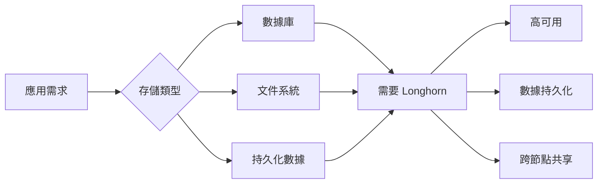

**場景 1：數據庫 Pod 重啟**

```yaml
❌ 沒有持久化存儲：
容器掛了 → Pod 重啟 → 數據全丟了！

✅ 有 Longhorn：
容器掛了 → Pod 重啟 → 數據還在，因為存在持久化卷中
```

**場景 2：Pod 被調度到不同節點**

```yaml
❌ k3s 默認的 local-path：
Pod 在 Node1 → 寫入數據到 Node1 的本地磁盤
Pod 被調度到 Node2 → 數據讀不到了（還在 Node1）

✅ 有 Longhorn：
數據被複製到多個節點 → Pod 調度到哪都能讀到
```

### Longhorn 架構

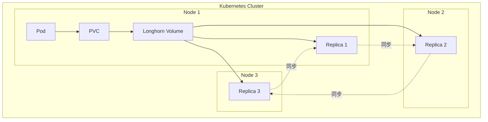

### 安裝步驟

```bash
# 1. 安裝依賴（在所有節點上執行）
# Ubuntu/Debian
sudo apt-get update
sudo apt-get install -y open-iscsi nfs-common
sudo systemctl enable --now iscsid

# 2. 部署 Longhorn
kubectl apply -f https://raw.githubusercontent.com/longhorn/longhorn/v1.7.1/deploy/longhorn.yaml

# 3. 等待啟動
kubectl get pods -n longhorn-system -w

# 4. 設為默認 StorageClass
kubectl patch storageclass longhorn -p '{"metadata": {"annotations":{"storageclass.kubernetes.io/is-default-class":"true"}}}'
kubectl patch storageclass local-path -p '{"metadata": {"annotations":{"storageclass.kubernetes.io/is-default-class":"false"}}}'

# 5. 訪問 UI（可選）
kubectl port-forward -n longhorn-system svc/longhorn-frontend 8080:80
# 瀏覽器訪問: http://localhost:8080
```

### 驗證安裝

```bash
# 創建測試 PVC
cat <<EOF | kubectl apply -f -
apiVersion: v1
kind: PersistentVolumeClaim
metadata:
  name: test-pvc
spec:
  accessModes:
    - ReadWriteOnce
  storageClassName: longhorn
  resources:
    requests:
      storage: 1Gi
EOF

# 查看狀態
kubectl get pvc test-pvc
# 應該看到 STATUS: Bound

# 清理測試
kubectl delete pvc test-pvc
```

---

## 2. MinIO - 對象存儲

### 🗄️ 是什麼？

MinIO 是開源的對象存儲服務，100% 兼容 AWS S3 API。

### 🤔 為什麼需要？

**對象存儲 vs 塊存儲（Longhorn）對比**

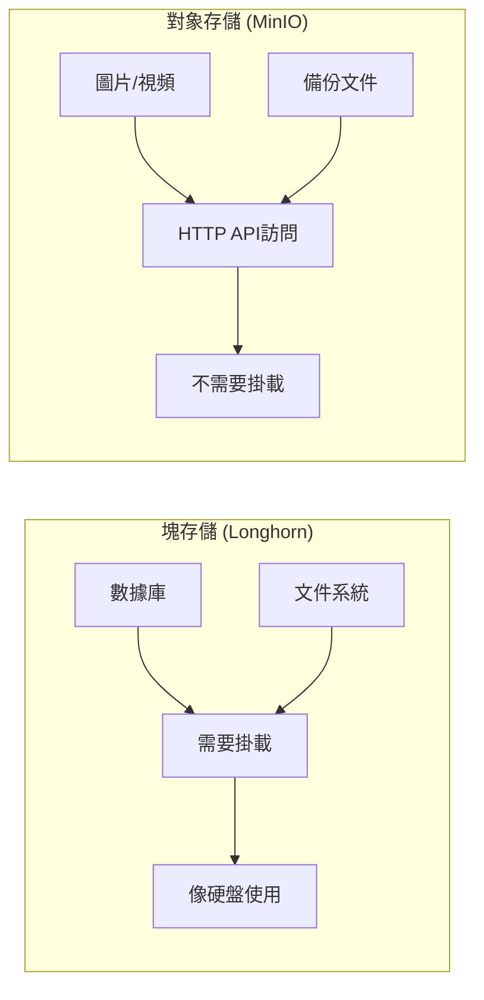

| 特性 | 塊存儲（Longhorn） | 對象存儲（MinIO） |
|------|-------------------|-------------------|
| **用途** | 數據庫、文件系統 | 文件、圖片、影片、備份 |
| **訪問方式** | 需要掛載到 Pod | HTTP API 訪問 |
| **使用場景** | MySQL 數據目錄 | 用戶上傳的圖片 |
| **可擴展性** | 有限 | 極高 |
| **CDN 友好** | 否 | 是 |

### MinIO 架構

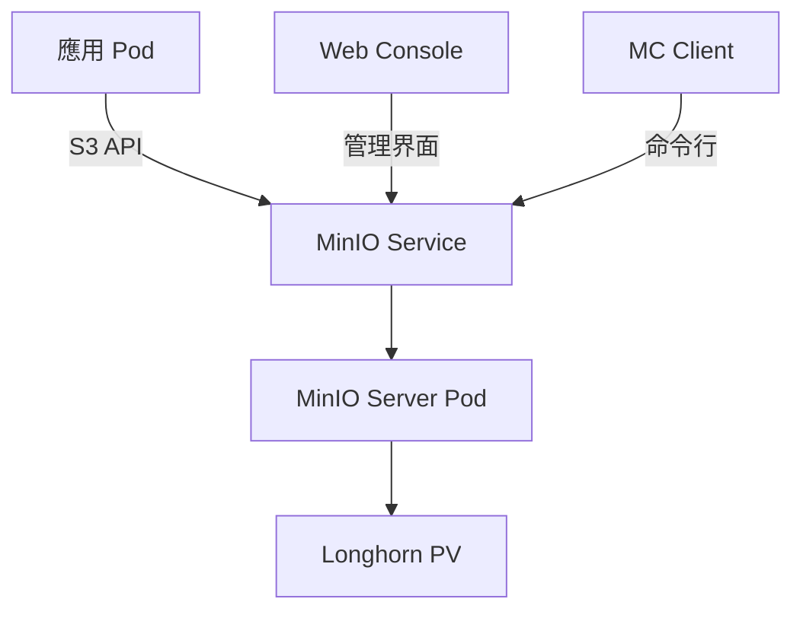

### 安裝步驟

```bash
# 1. 安裝 Helm（如果沒有）
curl https://raw.githubusercontent.com/helm/helm/main/scripts/get-helm-3 | bash

# 2. 添加 MinIO repo
helm repo add minio https://charts.min.io/
helm repo update

# 3. 創建配置文件
cat <<EOF > minio-values.yaml
mode: standalone
replicas: 1

persistence:
  enabled: true
  storageClass: "longhorn"
  size: 50Gi

resources:
  requests:
    memory: 512Mi
    cpu: 250m
  limits:
    memory: 1Gi
    cpu: 500m

rootUser: "admin"
rootPassword: "YourStrongPassword123!"

consoleService:
  type: ClusterIP
  port: 9001
EOF

# 4. 安裝 MinIO
kubectl create namespace minio
helm install minio minio/minio -n minio -f minio-values.yaml

# 5. 等待啟動
kubectl get pods -n minio -w

# 6. 暴露服務（測試用）
kubectl port-forward -n minio svc/minio 9000:9000 &
kubectl port-forward -n minio svc/minio-console 9001:9001 &
```

### 測試 MinIO

```bash
# 安裝 MinIO Client
wget https://dl.min.io/client/mc/release/linux-amd64/mc
chmod +x mc
sudo mv mc /usr/local/bin/

# 配置訪問
mc alias set myminio http://localhost:9000 admin YourStrongPassword123!

# 創建 bucket
mc mb myminio/test-bucket

# 上傳文件
echo "Hello MinIO" > test.txt
mc cp test.txt myminio/test-bucket/

# 列出文件
mc ls myminio/test-bucket/
```

### 應用集成範例

```python
from minio import Minio
from minio.error import S3Error

# 連接 MinIO（在 K8s 內部）
client = Minio(
    "minio.minio.svc.cluster.local:9000",
    access_key="admin",
    secret_key="YourStrongPassword123!",
    secure=False
)

# 上傳文件
client.fput_object(
    "test-bucket", 
    "avatar.jpg",
    "/path/to/local/file.jpg"
)

# 生成臨時訪問 URL
url = client.presigned_get_object("test-bucket", "avatar.jpg")
print(f"文件 URL: {url}")
```

---

## 3. cert-manager - 證書管理

### 🔐 是什麼？

cert-manager 自動申請、安裝、續期 SSL/TLS 證書。

### 🤔 為什麼需要？

**HTTPS 的重要性**

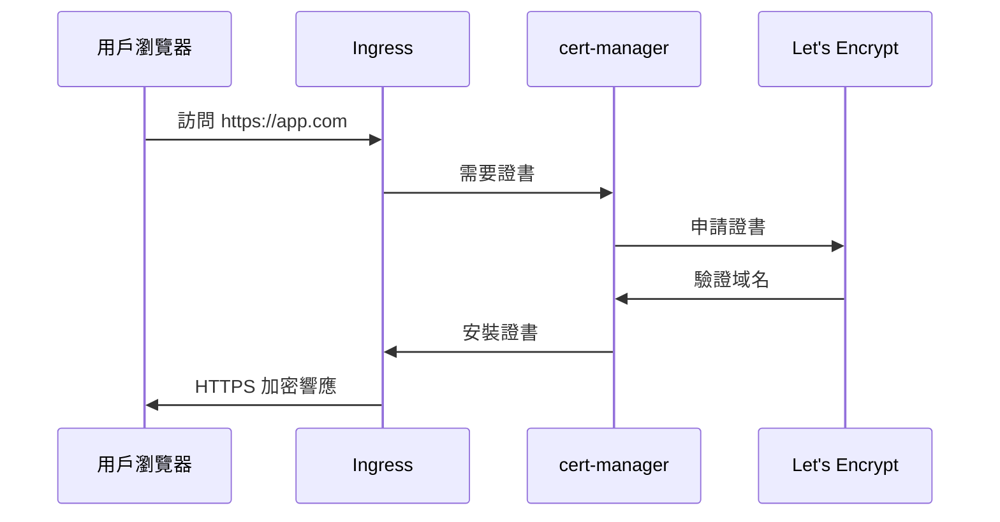

**手動管理 vs 自動化**

| 管理方式 | 手動管理 | cert-manager |
|---------|---------|--------------|
| 申請證書 | 手動執行命令 | 自動申請 |
| 安裝證書 | 手動配置 | 自動安裝 |
| 續期 | 每 90 天手動續 | 自動續期 |
| 多域名 | 逐個處理 | 批量處理 |
| 風險 | 易忘記續期 | 無風險 |

### 安裝步驟

```bash
# 1. 安裝 cert-manager
kubectl apply -f https://github.com/cert-manager/cert-manager/releases/download/v1.15.3/cert-manager.yaml

# 2. 等待啟動
kubectl get pods -n cert-manager -w

# 3. 驗證安裝
kubectl get pods -n cert-manager
```

### 配置 Let's Encrypt

```bash
# 創建測試用 ClusterIssuer（建議先用這個）
cat <<EOF | kubectl apply -f -
apiVersion: cert-manager.io/v1
kind: ClusterIssuer
metadata:
  name: letsencrypt-staging
spec:
  acme:
    server: https://acme-staging-v02.api.letsencrypt.org/directory
    email: your-email@example.com
    privateKeySecretRef:
      name: letsencrypt-staging-key
    solvers:
    - http01:
        ingress:
          class: traefik
EOF

# 創建生產環境 ClusterIssuer
cat <<EOF | kubectl apply -f -
apiVersion: cert-manager.io/v1
kind: ClusterIssuer
metadata:
  name: letsencrypt-prod
spec:
  acme:
    server: https://acme-v02.api.letsencrypt.org/directory
    email: your-email@example.com
    privateKeySecretRef:
      name: letsencrypt-prod-key
    solvers:
    - http01:
        ingress:
          class: traefik
EOF
```

### 為服務啟用 HTTPS

```yaml
apiVersion: networking.k8s.io/v1
kind: Ingress
metadata:
  name: my-app-ingress
  annotations:
    cert-manager.io/cluster-issuer: "letsencrypt-prod"
    traefik.ingress.kubernetes.io/router.entrypoints: websecure
    traefik.ingress.kubernetes.io/router.tls: "true"
spec:
  tls:
  - hosts:
    - myapp.example.com
    secretName: myapp-tls
  rules:
  - host: myapp.example.com
    http:
      paths:
      - path: /
        pathType: Prefix
        backend:
          service:
            name: my-app-service
            port:
              number: 80
```

---

## 4. Prometheus + Grafana - 監控系統

### 📊 是什麼？

- **Prometheus**: 時序數據庫 + 監控系統
- **Grafana**: 數據視覺化平台

### 🤔 為什麼需要監控？

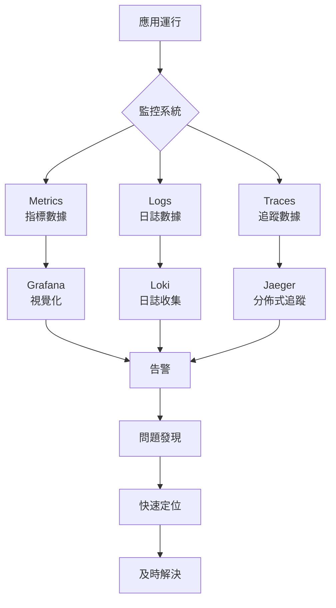

**監控的四個黃金信號**

1. **Latency (延遲)**: 請求響應時間
2. **Traffic (流量)**: 每秒請求數（QPS）
3. **Errors (錯誤率)**: 失敗請求百分比
4. **Saturation (飽和度)**: 資源使用率

### Prometheus 工作原理

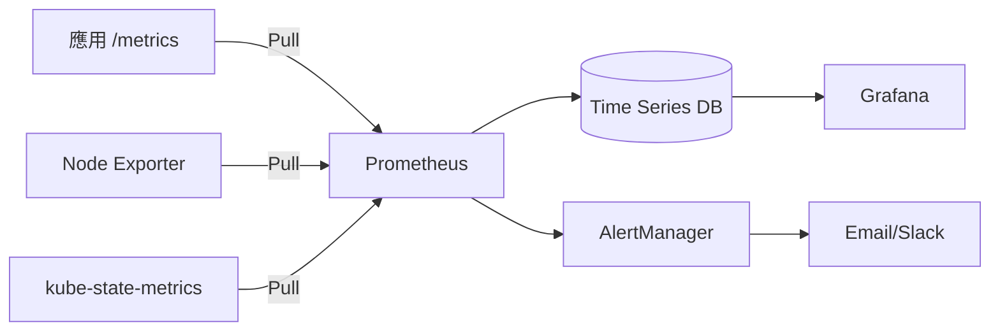

### 安裝步驟

```bash
# 1. 添加 Helm repo
helm repo add prometheus-community https://prometheus-community.github.io/helm-charts
helm repo update

# 2. 創建命名空間
kubectl create namespace monitoring

# 3. 創建 values 文件
cat <<EOF > prometheus-values.yaml
prometheus:
  prometheusSpec:
    storageSpec:
      volumeClaimTemplate:
        spec:
          storageClassName: longhorn
          accessModes: ["ReadWriteOnce"]
          resources:
            requests:
              storage: 20Gi
    retention: 15d

grafana:
  adminPassword: "admin123"
  persistence:
    enabled: true
    storageClassName: longhorn
    size: 5Gi

alertmanager:
  alertmanagerSpec:
    storage:
      volumeClaimTemplate:
        spec:
          storageClassName: longhorn
          accessModes: ["ReadWriteOnce"]
          resources:
            requests:
              storage: 2Gi
EOF

# 4. 安裝
helm install prometheus prometheus-community/kube-prometheus-stack \
  -n monitoring \
  -f prometheus-values.yaml

# 5. 等待啟動
kubectl get pods -n monitoring -w
```

### 訪問 Grafana

```bash
# Port Forward
kubectl port-forward -n monitoring svc/prometheus-grafana 3000:80

# 瀏覽器訪問: http://localhost:3000
# 用戶名: admin
# 密碼: admin123
```

### 常用 Dashboard

在 Grafana 中導入以下 Dashboard ID：

- **15760**: Kubernetes Views - Global
- **15761**: Kubernetes Views - Namespaces
- **15762**: Kubernetes Views - Pods
- **1860**: Node Exporter Full
- **13770**: Longhorn

---

## 5. Loki - 日誌系統

### 📚 是什麼？

Loki 是輕量級日誌收集系統，受 Prometheus 啟發設計。

### 🤔 Loki vs ELK 對比

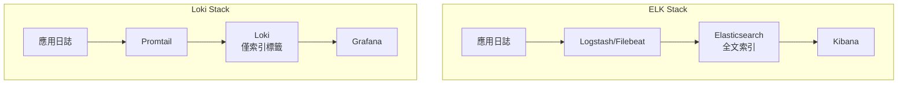

| 維度 | ELK Stack | Loki |
|------|-----------|------|
| **索引方式** | 全文索引（每個字段） | 只索引標籤 |
| **存儲成本** | 💰💰💰 非常高 | 💰 低 |
| **內存需求** | 8-16GB | 512MB-2GB |
| **查詢速度** | 超快 | 快 |
| **運維難度** | 複雜 | 簡單 |
| **K8s 集成** | 需配置 | 原生支持 |
| **Grafana** | 需切換 | 完美集成 |

### 安裝步驟

```bash
# 1. 添加 Helm repo
helm repo add grafana https://grafana.github.io/helm-charts
helm repo update

# 2. 創建 values 文件
cat <<EOF > loki-values.yaml
loki:
  commonConfig:
    replication_factor: 1
  storage:
    type: 'filesystem'
  persistence:
    enabled: true
    storageClassName: longhorn
    size: 20Gi

promtail:
  enabled: true

grafana:
  enabled: false  # 已經安裝了
EOF

# 3. 安裝
helm install loki grafana/loki-stack -n monitoring -f loki-values.yaml

# 4. 等待啟動
kubectl get pods -n monitoring | grep loki
```

### 在 Grafana 中配置

1. Configuration → Data Sources → Add data source
2. 選擇 Loki
3. URL: `http://loki.monitoring.svc.cluster.local:3100`
4. Save & Test

### 查詢範例

```logql
# 查看所有日誌
{namespace="default"}

# 查看特定 Pod
{namespace="default", pod="my-app-xxx"}

# 查看錯誤日誌
{namespace="default"} |= "ERROR"

# 統計錯誤率
sum(rate({namespace="default"} |= "ERROR" [5m])) by (pod)
```

---

## 6. Harbor - 私有鏡像倉庫

### 🐳 是什麼？

Harbor 是企業級容器鏡像倉庫，提供鏡像管理、安全掃描、簽名等功能。

### 🤔 為什麼需要？

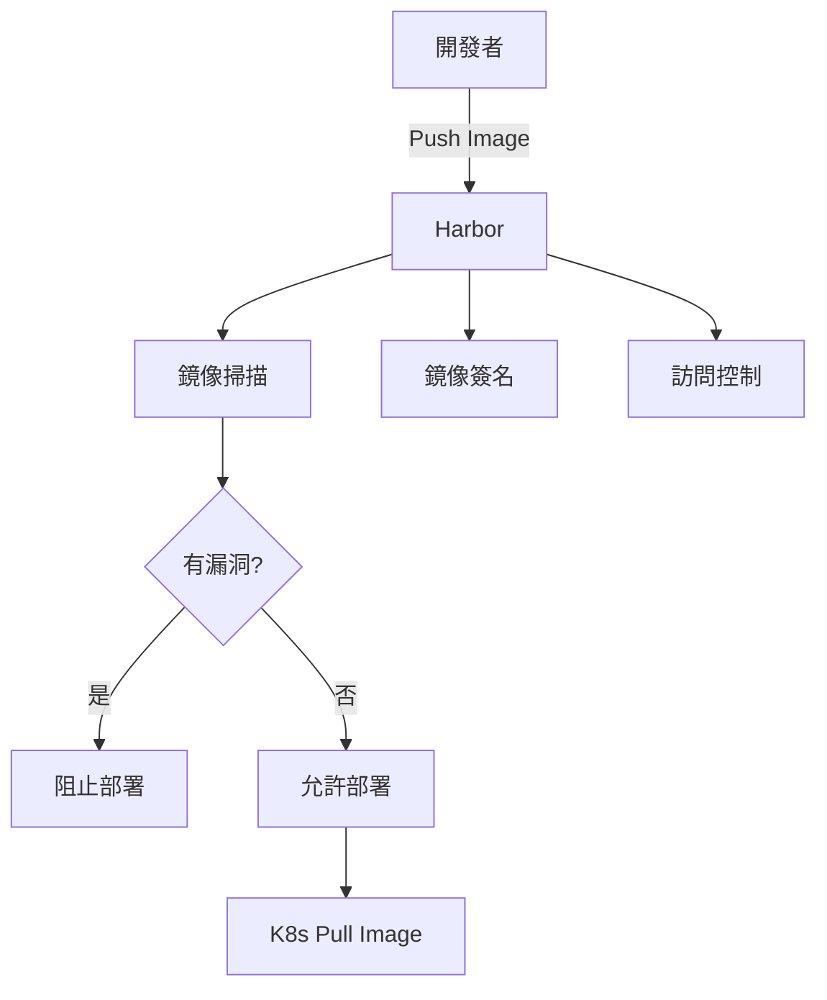

**Harbor vs Docker Hub**

| 特性 | Docker Hub | Harbor |
|------|-----------|--------|
| **私有倉庫** | 有限額 | 無限制 |
| **鏡像掃描** | 付費 | 免費 |
| **訪問控制** | 基本 | RBAC |
| **鏡像簽名** | 無 | 支持 |
| **數據本地化** | 否 | 是 |
| **網絡速度** | 依賴外網 | 內網極快 |

### 安裝步驟

```bash
# 1. 添加 Helm repo
helm repo add harbor https://helm.goharbor.io
helm repo update

# 2. 創建配置文件
cat <<EOF > harbor-values.yaml
expose:
  type: ingress
  tls:
    enabled: true
    certSource: secret
    secret:
      secretName: "harbor-tls"
  ingress:
    hosts:
      core: harbor.your-domain.com
    className: traefik

persistence:
  enabled: true
  persistentVolumeClaim:
    registry:
      storageClass: longhorn
      size: 50Gi
    chartmuseum:
      storageClass: longhorn
      size: 5Gi
    jobservice:
      storageClass: longhorn
      size: 1Gi
    database:
      storageClass: longhorn
      size: 5Gi
    redis:
      storageClass: longhorn
      size: 1Gi

harborAdminPassword: "Harbor12345"

trivy:
  enabled: true
EOF

# 3. 安裝
kubectl create namespace harbor
helm install harbor harbor/harbor -n harbor -f harbor-values.yaml

# 4. 等待啟動
kubectl get pods -n harbor -w
```

### 配置 K8s 使用 Harbor

```bash
# 創建 Docker registry secret
kubectl create secret docker-registry harbor-secret \
  --docker-server=harbor.your-domain.com \
  --docker-username=admin \
  --docker-password=Harbor12345 \
  --docker-email=admin@example.com

# 在 Deployment 中使用
```

```yaml
apiVersion: apps/v1
kind: Deployment
metadata:
  name: my-app
spec:
  template:
    spec:
      imagePullSecrets:
      - name: harbor-secret
      containers:
      - name: app
        image: harbor.your-domain.com/library/my-app:v1.0
```

---

## 7. ArgoCD - GitOps 持續部署

### 🚀 是什麼？

ArgoCD 是聲明式 GitOps 持續部署工具。

### 🤔 GitOps 工作流程

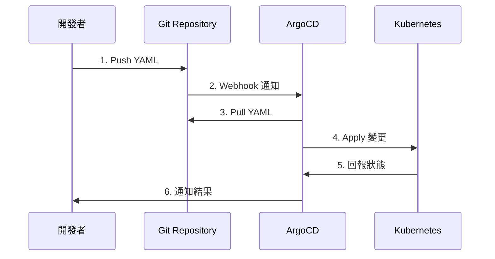

**傳統 CI/CD vs GitOps**

| 方式 | 傳統 CI/CD | GitOps (ArgoCD) |
|------|-----------|-----------------|
| **部署方式** | Push（主動推送） | Pull（拉取同步） |
| **權限管理** | CI 工具需要 K8s 權限 | K8s 拉取 Git |
| **狀態追蹤** | 難以確認當前狀態 | Git 是唯一真相來源 |
| **回滾** | 手動或複雜 | Git revert 即可 |
| **審計** | 散落各處 | Git 完整記錄 |

### 安裝步驟

```bash
# 1. 創建命名空間
kubectl create namespace argocd

# 2. 安裝 ArgoCD
kubectl apply -n argocd -f https://raw.githubusercontent.com/argoproj/argo-cd/stable/manifests/install.yaml

# 3. 等待啟動
kubectl get pods -n argocd -w

# 4. 獲取初始密碼
kubectl -n argocd get secret argocd-initial-admin-secret -o jsonpath="{.data.password}" | base64 -d

# 5. Port Forward
kubectl port-forward svc/argocd-server -n argocd 8080:443

# 訪問: https://localhost:8080
# 用戶名: admin
# 密碼: 上面獲取的密碼
```

### 創建應用範例

```yaml
apiVersion: argoproj.io/v1alpha1
kind: Application
metadata:
  name: my-app
  namespace: argocd
spec:
  project: default
  source:
    repoURL: https://github.com/your-org/your-repo
    targetRevision: HEAD
    path: k8s/
  destination:
    server: https://kubernetes.default.svc
    namespace: default
  syncPolicy:
    automated:
      prune: true
      selfHeal: true
```

---

## 8. Redis - 分佈式緩存

### 💾 是什麼？

Redis 是內存數據庫，提供緩存、會話、分佈式鎖等功能。

### 🤔 為什麼需要？

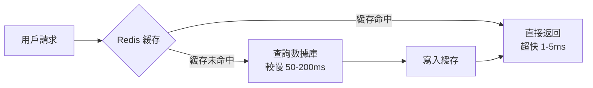

**使用場景**

1. **緩存**: 減少數據庫壓力
2. **會話存儲**: 用戶登入狀態
3. **分佈式鎖**: 防止並發問題
4. **消息隊列**: Redis Streams
5. **排行榜**: Sorted Set

### 安裝步驟

```bash
# 1. 添加 Helm repo
helm repo add bitnami https://charts.bitnami.com/bitnami
helm repo update

# 2. 創建配置文件
cat <<EOF > redis-values.yaml
architecture: standalone

auth:
  enabled: true
  password: "Redis12345"

master:
  persistence:
    enabled: true
    storageClass: longhorn
    size: 8Gi
EOF

# 3. 安裝
kubectl create namespace redis
helm install redis bitnami/redis -n redis -f redis-values.yaml

# 4. 等待啟動
kubectl get pods -n redis -w

# 5. 獲取密碼
export REDIS_PASSWORD=$(kubectl get secret --namespace redis redis -o jsonpath="{.data.redis-password}" | base64 -d)

# 6. 測試連接
kubectl run redis-client --rm -it --restart='Never' \
  --image docker.io/bitnami/redis:7.0 \
  --env REDIS_PASSWORD=$REDIS_PASSWORD \
  --command -- bash

# 在容器內執行
redis-cli -h redis-master.redis.svc.cluster.local -a $REDIS_PASSWORD
```

### 應用集成範例

```python
import redis

# 連接 Redis
r = redis.Redis(
    host='redis-master.redis.svc.cluster.local',
    port=6379,
    password='Redis12345',
    decode_responses=True
)

# 設置緩存
r.set('user:1000', '{"name":"John","age":30}', ex=3600)

# 獲取緩存
user_data = r.get('user:1000')

# 分佈式鎖
lock = r.lock('my-lock', timeout=10)
if lock.acquire(blocking=False):
    try:
        # 執行需要加鎖的操作
        pass
    finally:
        lock.release()
```

---

## 9. Kafka - 消息隊列

### 📨 是什麼？

Kafka 是高吞吐量分佈式消息系統。

### 🤔 為什麼需要？

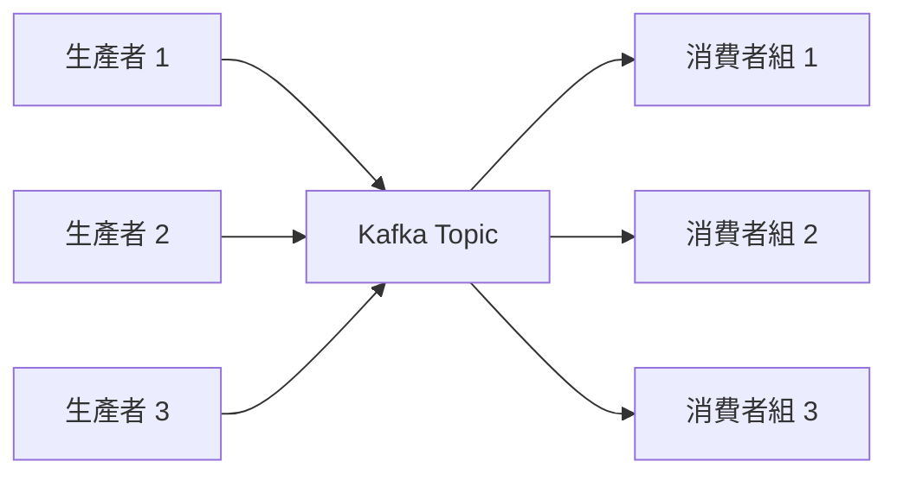

**異步解耦的好處**

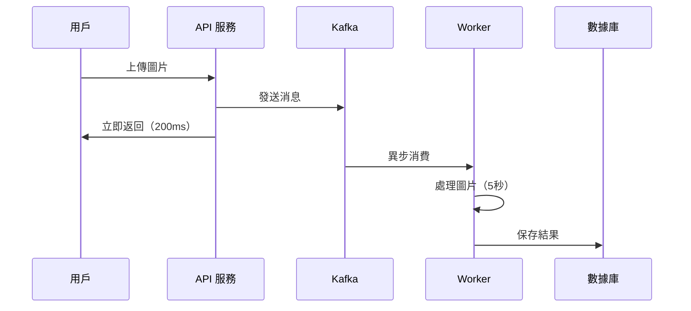

### 安裝步驟

```bash
# 1. 添加 Strimzi Operator Helm repo
helm repo add strimzi https://strimzi.io/charts/
helm repo update

# 2. 安裝 Strimzi Operator
kubectl create namespace kafka
helm install strimzi-kafka-operator strimzi/strimzi-kafka-operator -n kafka

# 3. 創建 Kafka 集群
cat <<EOF | kubectl apply -f -
apiVersion: kafka.strimzi.io/v1beta2
kind: Kafka
metadata:
  name: my-cluster
  namespace: kafka
spec:
  kafka:
    version: 3.6.0
    replicas: 3
    listeners:
      - name: plain
        port: 9092
        type: internal
        tls: false
    storage:
      type: persistent-claim
      size: 10Gi
      class: longhorn
  zookeeper:
    replicas: 3
    storage:
      type: persistent-claim
      size: 5Gi
      class: longhorn
  entityOperator:
    topicOperator: {}
    userOperator: {}
EOF

# 4. 等待啟動
kubectl get pods -n kafka -w

# 5. 創建 Topic
cat <<EOF | kubectl apply -f -
apiVersion: kafka.strimzi.io/v1beta2
kind: KafkaTopic
metadata:
  name: my-topic
  namespace: kafka
  labels:
    strimzi.io/cluster: my-cluster
spec:
  partitions: 3
  replicas: 2
EOF
```

### 測試 Kafka

```bash
# 生產者測試
kubectl run kafka-producer -it --rm \
  --image=quay.io/strimzi/kafka:latest-kafka-3.6.0 \
  --restart=Never \
  --namespace=kafka \
  -- bin/kafka-console-producer.sh \
    --bootstrap-server my-cluster-kafka-bootstrap:9092 \
    --topic my-topic

# 消費者測試
kubectl run kafka-consumer -it --rm \
  --image=quay.io/strimzi/kafka:latest-kafka-3.6.0 \
  --restart=Never \
  --namespace=kafka \
  -- bin/kafka-console-consumer.sh \
    --bootstrap-server my-cluster-kafka-bootstrap:9092 \
    --topic my-topic \
    --from-beginning
```

---

## 10. Velero - 備份與災難恢復

### 💾 是什麼？

Velero 是 K8s 集群備份和遷移工具。

### 🤔 為什麼需要？

**災難場景**

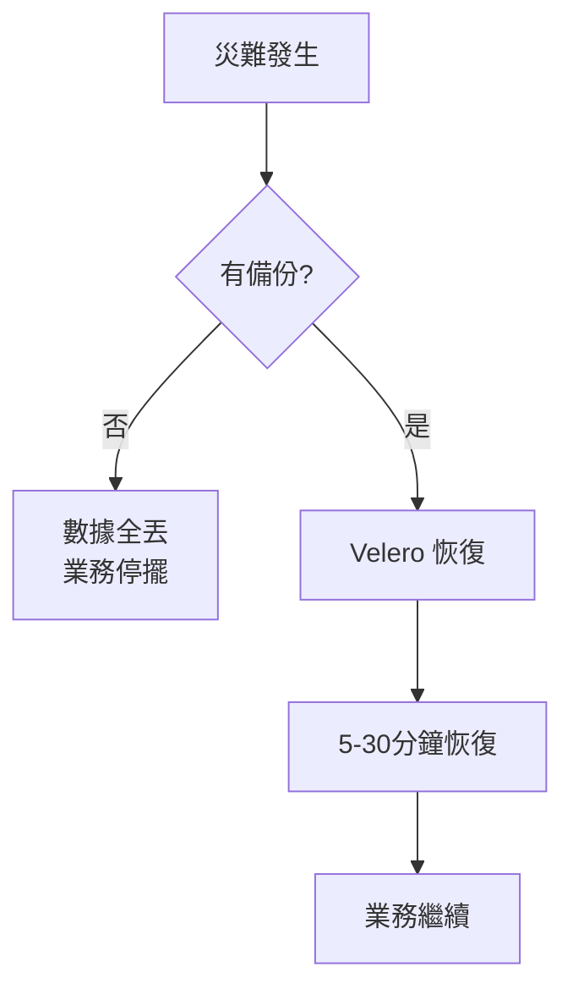

### 安裝步驟

```bash
# 1. 下載 Velero CLI
wget https://github.com/vmware-tanzu/velero/releases/download/v1.12.0/velero-v1.12.0-linux-amd64.tar.gz
tar -xvf velero-v1.12.0-linux-amd64.tar.gz
sudo mv velero-v1.12.0-linux-amd64/velero /usr/local/bin/

# 2. 安裝 Velero（使用 MinIO 作為後端）
velero install \
  --provider aws \
  --plugins velero/velero-plugin-for-aws:v1.8.0 \
  --bucket velero \
  --secret-file ./credentials-velero \
  --use-volume-snapshots=false \
  --backup-location-config region=minio,s3ForcePathStyle="true",s3Url=http://minio.minio.svc:9000

# 3. credentials-velero 文件內容
cat <<EOF > credentials-velero
[default]
aws_access_key_id = admin
aws_secret_access_key = YourStrongPassword123!
EOF

# 4. 在 MinIO 中創建 velero bucket
mc mb myminio/velero

# 5. 驗證安裝
velero backup-location get
```

### 備份範例

```bash
# 備份整個命名空間
velero backup create my-app-backup --include-namespaces default

# 備份特定資源
velero backup create redis-backup \
  --include-namespaces redis \
  --include-resources pvc,pv

# 定期備份
velero schedule create daily-backup \
  --schedule="@daily" \
  --include-namespaces default,redis,monitoring

# 查看備份
velero backup get

# 恢復
velero restore create --from-backup my-app-backup
```

---

## 11. 可選組件

### Jaeger - 分佈式追蹤

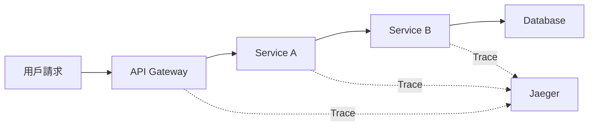

**安裝**

```bash
kubectl create namespace observability
kubectl apply -f https://raw.githubusercontent.com/jaegertracing/jaeger-operator/main/deploy/crds/jaegertracing.io_jaegers_crd.yaml
kubectl apply -f https://raw.githubusercontent.com/jaegertracing/jaeger-operator/main/deploy/service_account.yaml
kubectl apply -f https://raw.githubusercontent.com/jaegertracing/jaeger-operator/main/deploy/role.yaml
kubectl apply -f https://raw.githubusercontent.com/jaegertracing/jaeger-operator/main/deploy/role_binding.yaml
kubectl apply -f https://raw.githubusercontent.com/jaegertracing/jaeger-operator/main/deploy/operator.yaml
```

### Istio - Service Mesh

**特性**

- 服務間 mTLS 加密
- 流量管理（金絲雀、A/B 測試）
- 可觀測性
- 熔斷器

**安裝**

```bash
curl -L https://istio.io/downloadIstio | sh -
cd istio-*
export PATH=$PWD/bin:$PATH
istioctl install --set profile=demo -y
kubectl label namespace default istio-injection=enabled
```

---

## 架構總覽

### 完整微服務架構圖

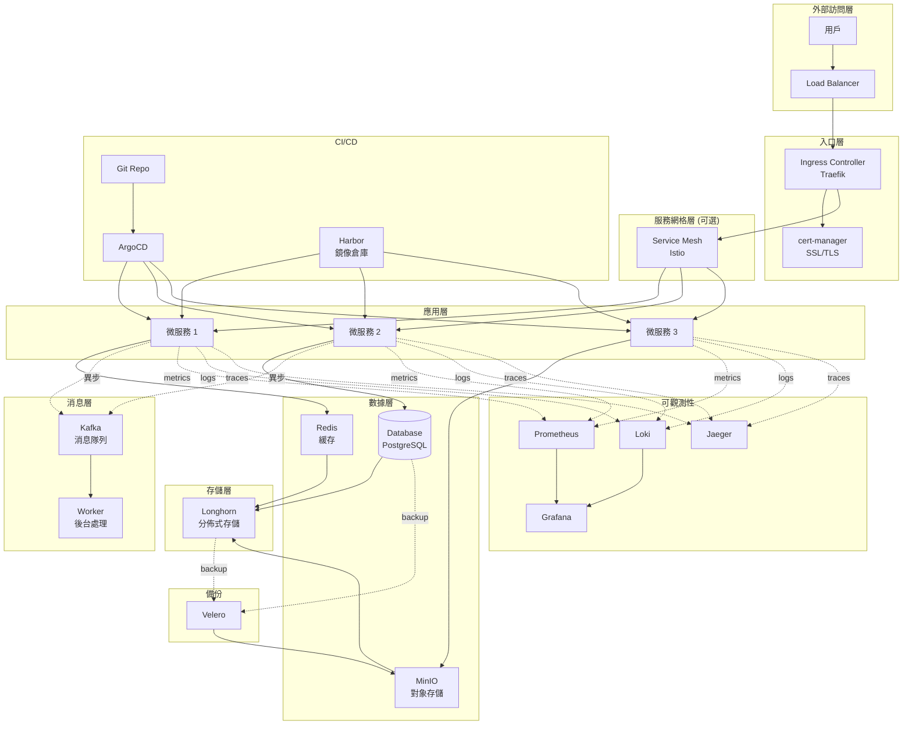

### 數據流向圖

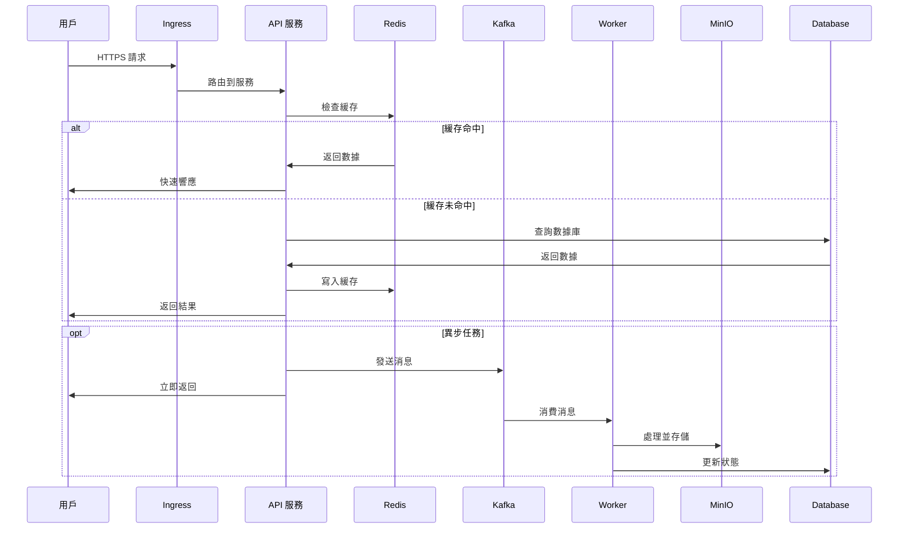

---

## 運維最佳實踐

### 資源限制

```yaml
apiVersion: apps/v1
kind: Deployment
metadata:
  name: my-app
spec:
  template:
    spec:
      containers:
      - name: app
        resources:
          requests:  # 最小保證資源
            memory: "128Mi"
            cpu: "100m"
          limits:    # 最大可用資源
            memory: "512Mi"
            cpu: "500m"
```

### 健康檢查

```yaml
livenessProbe:  # 存活探針
  httpGet:
    path: /healthz
    port: 8080
  initialDelaySeconds: 30
  periodSeconds: 10

readinessProbe:  # 就緒探針
  httpGet:
    path: /ready
    port: 8080
  initialDelaySeconds: 5
  periodSeconds: 5
```

### 水平擴展 (HPA)

```yaml
apiVersion: autoscaling/v2
kind: HorizontalPodAutoscaler
metadata:
  name: my-app-hpa
spec:
  scaleTargetRef:
    apiVersion: apps/v1
    kind: Deployment
    name: my-app
  minReplicas: 2
  maxReplicas: 10
  metrics:
  - type: Resource
    resource:
      name: cpu
      target:
        type: Utilization
        averageUtilization: 70
  - type: Resource
    resource:
      name: memory
      target:
        type: Utilization
        averageUtilization: 80
```

---

## 故障排查指南

### 常用排查命令

```bash
# 查看 Pod 狀態
kubectl get pods -A
kubectl describe pod <pod-name> -n <namespace>

# 查看日誌
kubectl logs <pod-name> -n <namespace>
kubectl logs <pod-name> -n <namespace> --previous  # 查看上一個容器日誌

# 進入容器
kubectl exec -it <pod-name> -n <namespace> -- /bin/bash

# 查看事件
kubectl get events -A --sort-by='.lastTimestamp'

# 查看資源使用
kubectl top nodes
kubectl top pods -A
```

### 常見問題

**1. Pod 一直 Pending**

```bash
# 檢查原因
kubectl describe pod <pod-name>

# 常見原因:
# - 資源不足
# - PVC 未綁定
# - Node 節點無法調度
```

**2. Pod 一直 CrashLoopBackOff**

```bash
# 查看日誌
kubectl logs <pod-name> --previous

# 常見原因:
# - 應用啟動失敗
# - 配置錯誤
# - 依賴服務未就緒
```

**3. Service 無法訪問**

```bash
# 檢查 Service
kubectl get svc <service-name>
kubectl describe svc <service-name>

# 檢查 Endpoints
kubectl get endpoints <service-name>

# 測試連通性
kubectl run test-pod --rm -it --image=busybox -- wget -O- <service-name>:<port>
```

---

## 學習資源推薦

### 書籍

1. **《Kubernetes in Action》** - Marko Lukša
2. **《Designing Data-Intensive Applications》** - Martin Kleppmann
3. **《Building Microservices》** - Sam Newman
4. **《Microservices Patterns》** - Chris Richardson

### 在線資源

- [Kubernetes 官方文檔](https://kubernetes.io/docs/)
- [CNCF Landscape](https://landscape.cncf.io/)
- [Martin Fowler - 微服務](https://martinfowler.com/microservices/)
- [Microservices.io](https://microservices.io/)

### 實踐項目

1. 部署完整的電商系統
2. 搭建 DevOps 完整流水線
3. 實現多集群管理
4. 進行混沌工程演練

---

## 常見問題

### Q1: Longhorn vs Ceph 如何選擇？

**Longhorn**:
- ✅ 簡單易用
- ✅ 適合中小規模
- ✅ 雲原生設計

**Ceph**:
- ✅ 功能更強大
- ✅ 適合大規模
- ❌ 配置複雜

**建議**: 中小型項目選 Longhorn，大型項目選 Ceph。

### Q2: 是否需要 Service Mesh？

**需要考慮的因素**:
- 服務數量 > 10 個
- 需要複雜的流量管理
- 需要服務間 mTLS
- 團隊有運維能力

**建議**: 初期可不用，服務增多後再引入。

### Q3: 監控數據保留多久？

**建議配置**:
- Prometheus: 15-30 天
- Loki: 7-14 天
- 長期數據: 使用 Thanos 或導出到對象存儲

### Q4: 如何進行零停機部署？

**策略**:
1. 使用 RollingUpdate
2. 配置合適的 readinessProbe
3. 設置合理的 minReadySeconds
4. 使用 PDB (PodDisruptionBudget)

```yaml
apiVersion: policy/v1
kind: PodDisruptionBudget
metadata:
  name: my-app-pdb
spec:
  minAvailable: 1
  selector:
    matchLabels:
      app: my-app
```

---

## 總結

本指南涵蓋了完整的 K8s 微服務基礎設施搭建，包括：

✅ **存儲**: Longhorn + MinIO
✅ **網絡**: Traefik + cert-manager
✅ **監控**: Prometheus + Grafana
✅ **日誌**: Loki + Promtail
✅ **鏡像**: Harbor
✅ **CI/CD**: ArgoCD
✅ **緩存**: Redis
✅ **消息**: Kafka
✅ **備份**: Velero

**下一步建議**:

1. 實際部署一個應用測試整個流程
2. 配置告警規則
3. 建立備份策略
4. 編寫運維文檔
5. 進行災難恢復演練

---

**參考資料**

- [Kubernetes 官方文檔](https://kubernetes.io/)
- [CNCF 項目](https://www.cncf.io/projects/)
- [Longhorn 文檔](https://longhorn.io/docs/)
- [Harbor 文檔](https://goharbor.io/docs/)
- [ArgoCD 文檔](https://argo-cd.readthedocs.io/)

---

**文檔版本**: v2.0
**最後更新**: 2025-01-07
**維護者**: Infrastructure Team
