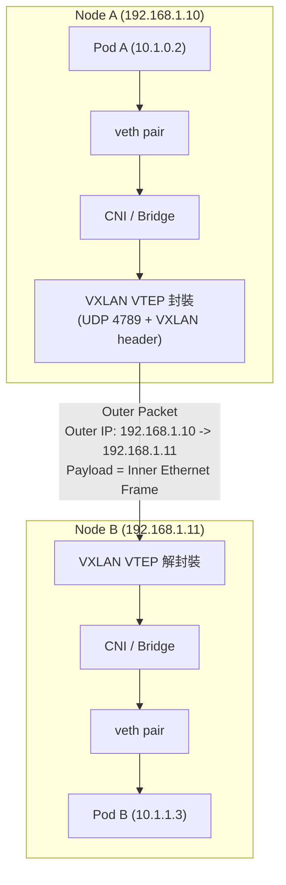
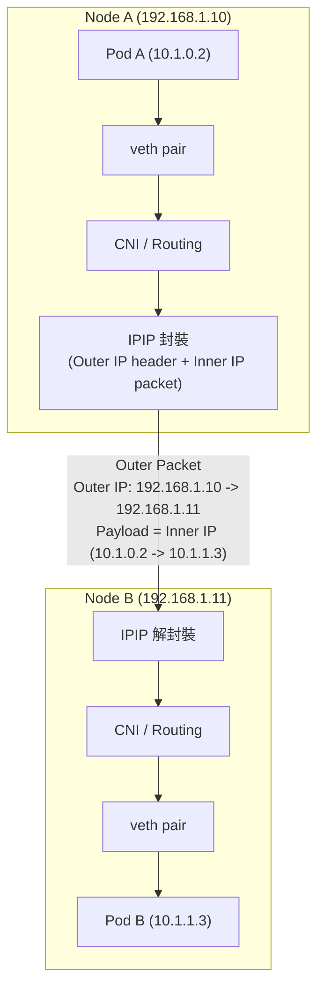
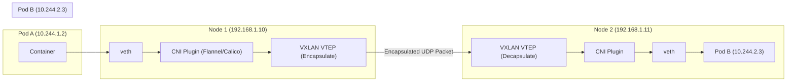

# 第二章：Kubernetes 架構

---

## 1. Kubernetes 架構總覽

Kubernetes 是一套開源的容器編排平台，主要用於自動化部署、擴展及管理容器化應用。其架構採用主從（Master-Node）設計，並以多個元件協同運作，確保系統的高可用性與彈性。

### 架構圖（文字描述）

- **Master（控制平面）**
  - 負責整體叢集管理與決策
  - 包含 API Server、Controller Manager、Scheduler、etcd
- **Node（工作節點）**
  - 執行實際的應用容器
  - 包含 kubelet、kube-proxy、Container Runtime

---

## 2. 各元件詳細說明

### 2.1 Master 元件

#### 2.1.1 etcd
- 分散式 Key-Value 儲存系統，保存所有叢集狀態資料。
- 高可用性，支援快照與備份。
- 任何設定變更都會同步至 etcd。

#### 2.1.2 kube-apiserver
- Kubernetes 的 RESTful API 入口，所有操作皆經由此元件。
- 提供認證、授權、驗證與 API 版本管理。
- 與 etcd 溝通，讀寫叢集狀態。

#### 2.1.3 kube-controller-manager
- 執行各種控制器（如 Deployment、ReplicaSet、Node Controller）。
- 持續監控叢集狀態，確保實際狀態符合期望狀態。

#### 2.1.4 kube-scheduler
- 負責將 Pod 分配至合適的 Node。
- 根據資源需求、親和性、污點等條件進行調度。

### 2.2 Node 元件

#### 2.2.1 kubelet
- 每個 Node 上的代理程式，負責與 API Server 溝通。
- 管理本機 Pod 的生命週期，確保容器正常運作。

#### 2.2.2 kube-proxy
- 維護叢集網路規則，實現服務的負載平衡與網路轉發。
- 支援多種模式（iptables、ipvs）。

#### 2.2.3 Container Runtime
- 實際執行容器的軟體（如 containerd、CRI-O、Docker）。

---

## 3. 架構運作流程

1. 使用者透過 `kubectl` 或 API 請求操作叢集。
2. 請求進入 `kube-apiserver`，經過認證與驗證後寫入 `etcd`。
3. `kube-controller-manager` 監控狀態，必要時建立/調整資源。
4. `kube-scheduler` 根據條件將 Pod 分配至合適的 Node。
5. Node 上的 `kubelet` 接收指令，啟動或管理容器。
6. `kube-proxy` 負責服務的網路流量導向與負載平衡。
7. 整體流程持續循環，確保叢集狀態與期望一致。

## 4. 網路模型

Kubernetes 網路模型假設所有 Pod (含多節點)在一個**直接連通**的**扁平網路**空間中，故需達成以下條件：
1. 在不使用 NAT 下，集羣中 Pod 可以與任務 Pod 進行通訊
2. 在不使用 NAT 下，集羣節點上的程序能與同一臺節點上任何 Pod 進行通訊
3. 每個 Pod 都有獨立的 IP 地址

### CNI

Kubernetes 提供 CNI 接口方式，讓外部可以通過實現 CNI 接口的網路插件實現 K8S 網路模型，它們通常都是實現容器到容器間的網路通訊。
常見的 CNI 插件有：

| 插件      | 網路模型                     | 加密  | 網路策略(Pod間防火牆的概念) |
| ------- | ------------------------ | --- | ---------------- |
| Calico  | 封裝網路(VXLAN, IPIP) 或爲封裝網路 | 有   | 有                |
| Flannel | 封裝網路 (VXLAN)             | 有   | 無                |

> 封裝網路(Overlay network)是什麼？
> 把「原本的 Layer-2/Layer-3 封包」包在一層外層封包裡，讓不同 Host 的 Pod 可以透過底層（underlay）IP 網路互相通訊。

##### 常見的封裝網路
這裡我們假設：
* Pod A IP：10.1.0.2（在 Node A）
* Pod B IP：10.1.1.3（在 Node B）
* Node A IP：192.168.1.10
* Node B IP：192.168.1.11
###### 1. VXLAN
把整個 Ethernet frame（L2）放進 UDP 封包，再以 outer IP 在底層網路運送 → L2 over L3。

###### 2. IP-in-IP(IPIP)
把內層的 IP packet（L3）放進另一個 outer IP header → L3 over L3（比較輕、只做 L3 隧道）。

---

## 5. 專業工程師的實務建議與最佳實踐

- **etcd 高可用性**：建議部署奇數台（如 3 或 5 台）etcd 節點，並定期備份。
- **API Server 安全性**：啟用 RBAC、TLS 加密，限制 API 存取來源。
- **Controller Manager/Scheduler**：建議多實例部署，並使用 leader election 機制。
- **Node 管理**：定期更新 kubelet，監控資源使用，設置資源限制（Resource Limits）。
- **kube-proxy 模式選擇**：大型叢集建議使用 ipvs 模式以提升效能。
- **容器執行環境**：優先選用支援 CRI 標準的 Runtime（如 containerd），避免使用已棄用的 Docker。
- **監控與日誌**：導入 Prometheus、ELK 等工具，強化可觀測性。
- **升級與維護**：遵循官方升級流程，先測試再逐步推進，避免跨多版本升級。
- **資源標籤與命名規範**：統一命名規則與標籤，方便資源管理與查詢。
- **自動化部署**：善用 CI/CD 工具，提升部署效率與一致性。

---
