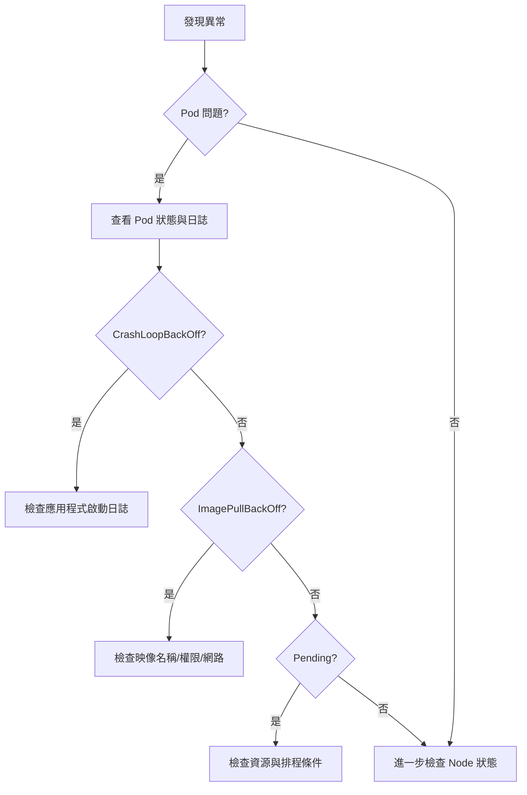

---

## 目錄

- [1. Kubernetes 是什麼？為什麼要用？](#1-kubernetes-是什麼為什麼要用)
- [2. 架構與核心組件](#2-架構與核心組件)
- [3. 底層原理](#3-底層原理)
    - [3.1 Pod 調度原理](#31-pod-調度原理)
    - [3.2 Kubernetes 網路原理](#32-kubernetes-網路原理)
    - [3.3 儲存原理](#33-儲存原理)
- [4. 安裝與初始化](#4-安裝與初始化)
- [5. 核心資源與實際操作場景](#5-核心資源與實際操作場景)
- [6. 日常運維指令](#6-日常運維指令)
- [7. 進階功能](#7-進階功能)
- [8. 故障排查與最佳實踐](#8-故障排查與最佳實踐)
- [9. Helm 套件管理](#9-helm-套件管理)
- [10. 參考資源](#10-參考資源)
- [附錄：實務案例與疑難排解](#附錄實務案例與疑難排解)
- [進階應用與複雜問題解法](#進階應用與複雜問題解法)

---

## 1. Kubernetes 是什麼？為什麼要用？
<a name="1-kubernetes-是什麼為什麼要用"></a>

Kubernetes（K8s）是一套開源的容器協調平台，專為自動化部署、擴展、管理與修復容器化應用而設計。它主要解決多主機、多服務環境下，容器生命週期與資源調度的複雜性。

### 核心解決的問題
- 多主機上的容器部署、升級、回滾、擴縮容自動化
- 應用高可用與自我修復（異常自動重啟、替換）
- 資源分配與隔離，避免單點瓶頸
- 統一 API 管理所有資源，便於自動化與擴展

### 主要功能
- 服務發現與負載均衡
- 動態掛載與管理存儲資源（支援本地、NFS、雲端）
- 滾動升級、回滾
- 自動資源調度
- 配置與密鑰集中管理
- 健康檢查與自動修復

### 適用場景
- 微服務架構
- 高可用、彈性伸縮需求
- DevOps、CI/CD 自動化部署

### 底層機制概覽

```
[ 使用者 ]
     |
     v
[ API Server ] <--> [ etcd ]
     |
     v
[ Controller Manager / Scheduler ]
     |
     v
[ Node (Kubelet, CRI, CNI) ]
```

- **API Server**：所有操作入口，統一 REST API，負責驗證、授權、資源管理
- **etcd**：分散式 key-value 資料庫，存放集群所有狀態
- **Controller Manager**：監控資源狀態，根據期望狀態自動修正
- **Scheduler**：根據資源與策略，決定 Pod 部署到哪個 Node
- **Kubelet**：每個 Node 上的 agent，負責容器生命週期管理
- **CRI**：容器運行時介面，支援 Docker、containerd 等
- **CNI**：網路插件，實現 Pod 間網路互通
- **PV/PVC**：持久化存儲抽象，動態掛載存儲資源

---

## 2. 架構與核心組件
<a name="2-架構與核心組件"></a>

### 架構總覽

```
[ 控制平面（Control Plane） ]
+---------------------------------------------------+
|  API Server  |  Controller Manager  |  Scheduler  |
|        \           |           /                  |
|                etcd (狀態儲存)                    |
+---------------------------------------------------+

[ 多個 Node（工作節點） ]
+-------------------+    +-------------------+
|   Kubelet         |    |   Kubelet         |
|   Kube Proxy      |    |   Kube Proxy      |
|   ContainerRuntime|    |   ContainerRuntime|
+-------------------+    +-------------------+
```

### 控制平面（Control Plane）
- **API Server**：所有集群操作的統一入口，負責驗證、授權、資源管理
- **etcd**：分散式資料庫，存放集群所有狀態資料
- **Controller Manager**：監控資源狀態，根據期望狀態自動修正（如自動補 Pod）
- **Scheduler**：根據資源與策略，決定每個 Pod 部署到哪個 Node

### Node（工作節點）
- **Kubelet**：每個 Node 上的 agent，負責啟動、監控、終止容器
- **Kube Proxy**：處理 Service 負載均衡與網路流量轉發
- **Container Runtime**：實際執行容器的引擎（如 Docker、containerd）

### 常見附加元件
- **CoreDNS**：提供集群內 DNS 服務
- **Ingress Controller**：負責 HTTP/HTTPS 流量路由
- **Dashboard**：Web UI 管理介面
- **Prometheus/Grafana**：監控與視覺化

### 組件互動流程
1. 使用者透過 kubectl 或 API 請求操作 API Server
2. API Server 驗證、授權後，將資源狀態寫入 etcd
3. Controller Manager 持續監控狀態，根據期望自動修正（如補 Pod）
4. Scheduler 根據資源狀況，決定 Pod 部署到哪個 Node
5. Kubelet 於指定 Node 啟動/監控容器，Kube Proxy 處理網路流量
6. 所有狀態變更都會同步到 etcd，確保一致性與高可用

---

## 3. 底層原理
<a name="3-底層原理"></a>

### 3.1 Pod 調度原理
<a name="31-pod-調度原理"></a>

Kubernetes Scheduler 負責將待建立的 Pod 分配到合適的 Node。流程如下：

```
[ Pod 建立請求 ]
      |
      v
[ Scheduler 收到任務 ]
      |
      v
[ 篩選可用 Node ]
      |
      v
[ 根據資源/策略評分 ]
      |
      v
[ 選出最佳 Node ]
      |
      v
[ 指派 Pod 到該 Node ]
```

- **篩選階段（Filtering）**：排除資源不足、標籤/親和性不符等不合格 Node
- **評分階段（Scoring）**：對剩餘 Node 根據資源利用率、親和性、反親和性等進行打分
- **綁定（Binding）**：選出分數最高的 Node，將 Pod 綁定到該 Node

---

### 3.2 Kubernetes 網路原理
<a name="32-kubernetes-網路原理"></a>

Kubernetes 網路模型確保所有 Pod 之間可直接通訊，並透過 Service 提供穩定入口：

```
[ 外部用戶 ]
      |
      v
   [ Service ]
      |
      v
+----+----+----+
| Pod1 | Pod2 | Pod3 | ... (同一服務)
+----+----+----+
      |
      v
[ CNI 網路插件 ]
      |
      v
[ Node 實體網路 ]
```

- **Pod 通訊**：每個 Pod 皆有獨立 IP，預設同一 Namespace 內可互通，不同 Node 間通訊由 CNI 保證
- **Service**：提供 ClusterIP/NodePort/LoadBalancer 等型態，負責流量分發與負載均衡
- **CNI（Container Network Interface）**：負責自動分配 Pod IP、設定路由，常見實作如 Flannel、Calico

---

### 3.3 儲存原理
<a name="33-儲存原理"></a>

Kubernetes 儲存資源抽象分為三層：

```
[ Pod ]
  |
  v
[ PVC (申請存儲) ]
  |
  v
[ StorageClass (指定存儲類型) ]
  |
  v
[ PV (實體存儲) ]
```

- **PV（PersistentVolume）**：由管理員預先建立或動態產生的實體/雲端存儲資源
- **PVC（PersistentVolumeClaim）**：用戶端提出的存儲需求（容量、存取模式）
- **StorageClass**：定義不同存儲類型與動態供應策略（如 SSD、HDD、快照等），PVC 可指定 StorageClass

---

## 4. 安裝與初始化
<a name="4-安裝與初始化"></a>

（以 Ubuntu 為例，其他 Linux 請參考官方文件）

### 4.1 基礎環境準備

```shell
# 關閉 swap
sudo swapoff -a
sudo sed -i '/ swap / s/^/#/' /etc/fstab

# 關閉 SELinux（CentOS/RHEL）
sudo setenforce 0
sudo sed -i 's/^SELINUX=enforcing/SELINUX=permissive/' /etc/selinux/config

# 開啟路由轉發與 bridge netfilter
sudo modprobe br_netfilter
echo 'net.bridge.bridge-nf-call-iptables=1' | sudo tee -a /etc/sysctl.conf
echo 'net.ipv4.ip_forward=1' | sudo tee -a /etc/sysctl.conf
sudo sysctl -p

# 設定主機名與 hosts
sudo hostnamectl set-hostname k8s-master01
sudo vi /etc/hosts
# 192.168.66.11 k8s-master01
# 192.168.66.12 k8s-node01
```

### 4.2 安裝 kubeadm/kubelet/kubectl

```shell
sudo apt update
sudo apt install -y apt-transport-https ca-certificates curl
curl -s https://packages.cloud.google.com/apt/doc/apt-key.gpg | sudo apt-key add -
echo "deb https://apt.kubernetes.io/ kubernetes-xenial main" | sudo tee /etc/apt/sources.list.d/kubernetes.list
sudo apt update
sudo apt install -y kubelet kubeadm kubectl
sudo systemctl enable kubelet
```

### 4.3 初始化 Master 節點

```shell
sudo kubeadm init --pod-network-cidr=10.244.0.0/16

# 設定 kubectl 權限
mkdir -p $HOME/.kube
sudo cp -i /etc/kubernetes/admin.conf $HOME/.kube/config
sudo chown $(id -u):$(id -g) $HOME/.kube/config
```

### 4.4 安裝網路插件（以 Flannel 為例）

```shell
kubectl apply -f https://raw.githubusercontent.com/coreos/flannel/master/Documentation/kube-flannel.yml
```

### 4.5 加入 Node 節點

在 Node 上執行 kubeadm join（依 master 初始化輸出指令）

---

## 5. 核心資源與實際操作場景
<a name="5-核心資源與實際操作場景"></a>

Kubernetes 的資源彼此協作，讓服務能自動化部署、擴展、管理。以下針對每種資源補充「概念、場景、交互方式」與「實際操作」：

### Deployment

- **用途/場景**：部署無狀態服務（如 Web API、前端網站），支援滾動升級、回滾、擴縮容
- **交互**：自動建立多個 Pod，搭配 Service 讓外部或其他服務能存取
- **操作建議**：
    - 建立 Deployment 管理副本數、升級流程
    - 搭配 Service 暴露網路入口
    - 可用 HPA 自動擴縮副本

**YAML 範例：**
```yaml
apiVersion: apps/v1
kind: Deployment
metadata:
  name: nginx-deploy
spec:
  replicas: 2
  selector:
    matchLabels:
      app: nginx
  template:
    metadata:
      labels:
        app: nginx
    spec:
      containers:
        - name: nginx
          image: nginx:latest
          ports:
            - containerPort: 80
```

**CLI 操作：**
```shell
kubectl apply -f deployment.yaml
kubectl get deploy,rs,pod --show-labels
kubectl rollout history deployment nginx-deploy
kubectl rollout undo deployment nginx-deploy
```

### Service

- **用途/場景**：暴露 Pod 的網路入口，負載均衡多個 Pod，讓外部或集群內其他服務能存取
- **交互**：通常搭配 Deployment/StatefulSet，根據 label selector 自動綁定對應 Pod
- **類型選擇**：
    - ClusterIP：僅集群內部存取（預設，微服務互通）
    - NodePort：外部可存取（測試、開發用）
    - LoadBalancer：雲端平台自動分配外部 IP（生產環境）
    - ExternalName：DNS 映射到外部服務
- **操作建議**：
    - 建議每個 Deployment 都搭配一個 Service
    - 若需外部存取，選 NodePort/LoadBalancer
    - Service 會自動偵測健康 Pod，流量只分配給健康的

**YAML 範例：**
```yaml
apiVersion: v1
kind: Service
metadata:
  name: nginx-svc
spec:
  selector:
    app: nginx
  type: ClusterIP
  ports:
    - port: 80
      targetPort: 80
```

**CLI 操作：**
```shell
kubectl apply -f service.yaml
kubectl get svc,ep
kubectl describe svc nginx-svc
```

### Ingress

- **用途/場景**：HTTP/HTTPS 路由，將外部流量導入 Service，支援路徑、域名分流，類似 API Gateway
- **交互**：Ingress 綁定 Service，根據路徑/域名分配流量
- **操作建議**：
    - 適合多個服務共用同一入口（如 /api /web）
    - 需安裝 Ingress Controller（如 nginx-ingress）

**YAML 範例：**
```yaml
apiVersion: networking.k8s.io/v1
kind: Ingress
metadata:
  name: nginx-ingress
spec:
  rules:
    - http:
        paths:
          - path: /
            pathType: Prefix
            backend:
              service:
                name: nginx-svc
                port:
                  number: 80
```

**CLI 操作：**
```shell
kubectl apply -f ingress.yaml
kubectl get ingress
```

### StatefulSet & Headless Service

- **用途/場景**：有狀態服務（如資料庫、Kafka），每個 Pod 有獨立 ID 與持久存儲
- **交互**：StatefulSet 需搭配 Headless Service（clusterIP: None）確保每個 Pod 有獨立 DNS 名稱
- **操作建議**：
    - 適合資料庫、分散式系統
    - Headless Service 讓每個 Pod 都有獨立網路位址
    - 搭配 PersistentVolumeClaim 提供持久存儲

**YAML 範例：**
```yaml
apiVersion: apps/v1
kind: StatefulSet
metadata:
  name: web-statefulset
spec:
  serviceName: "web-headless"
  replicas: 2
  selector:
    matchLabels:
      app: web
  template:
    metadata:
      labels:
        app: web
    spec:
      containers:
        - name: web
          image: nginx:latest
          ports:
            - containerPort: 80
          volumeMounts:
            - name: www
              mountPath: /usr/share/nginx/html
      volumes:
        - name: www
          persistentVolumeClaim:
            claimName: nfs-pvc
---
apiVersion: v1
kind: Service
metadata:
  name: web-headless
spec:
  clusterIP: None
  selector:
    app: web
  ports:
    - port: 80
      targetPort: 80
```

**CLI 操作：**
```shell
kubectl apply -f statefulset.yaml
kubectl get sts,svc,pvc
```

### DaemonSet

- **用途/場景**：在每個 Node 上部署一個 Pod，常用於監控、日誌收集（如 node-exporter、fluentd）
- **交互**：DaemonSet 會自動偵測新加入的 Node 並部署 Pod
- **操作建議**：
    - 適合需要全節點執行的 agent、監控、日誌收集

**YAML 範例：**
```yaml
apiVersion: apps/v1
kind: DaemonSet
metadata:
  name: node-exporter
spec:
  selector:
    matchLabels:
      app: node-exporter
  template:
    metadata:
      labels:
        app: node-exporter
    spec:
      containers:
        - name: node-exporter
          image: prom/node-exporter:latest
          ports:
            - containerPort: 9100
```

**CLI 操作：**
```shell
kubectl apply -f daemonset.yaml
kubectl get daemonset -A
```

### ConfigMap & Secret

- **用途/場景**：ConfigMap 管理明文配置（如環境變數），Secret 管理敏感資料（如密碼、token）
- **交互**：Pod 可透過 envFrom 或 volumeMounts 引用 ConfigMap/Secret
- **操作建議**：
    - 建議所有配置、密鑰都用 ConfigMap/Secret 管理
    - Secret 內容需 base64 編碼

**YAML 範例：**
```yaml
apiVersion: v1
kind: ConfigMap
metadata:
  name: app-config
data:
  LOG_LEVEL: "debug"
---
apiVersion: v1
kind: Secret
metadata:
  name: db-secret
type: Opaque
data:
  password: bXlwYXNzd29yZA== # base64 編碼
```

**CLI 操作：**
```shell
kubectl apply -f configmap.yaml
kubectl apply -f secret.yaml
kubectl get configmap,secret
```

### PersistentVolume & PersistentVolumeClaim

- **用途/場景**：抽象存儲，支援本地、NFS、雲端。Pod 透過 PVC 申請存儲空間
- **交互**：StatefulSet/Pod 透過 volumeMounts 綁定 PVC，PVC 會自動綁定 PV
- **操作建議**：
    - 有狀態服務必備
    - 建議用 PVC 管理存儲，方便動態分配

**YAML 範例：**
```yaml
apiVersion: v1
kind: PersistentVolume
metadata:
  name: nfs-pv
spec:
  capacity:
    storage: 10Gi
  accessModes:
    - ReadWriteMany
  nfs:
    server: 192.168.66.200
    path: /srv/nfs_share
---
apiVersion: v1
kind: PersistentVolumeClaim
metadata:
  name: nfs-pvc
spec:
  accessModes:
    - ReadWriteMany
  resources:
    requests:
      storage: 5Gi
```

**CLI 操作：**
```shell
kubectl apply -f pv.yaml
kubectl apply -f pvc.yaml
kubectl get pv,pvc
```

### HPA（自動擴縮容）

- **用途/場景**：根據 CPU/Memory 或自訂指標自動調整副本數，確保服務穩定
- **交互**：HPA 綁定 Deployment/StatefulSet，自動調整 replicas
- **操作建議**：
    - 建議所有 Web/API 服務都加上 HPA
    - 需安裝 metrics-server

**YAML 範例：**
```yaml
apiVersion: autoscaling/v2
kind: HorizontalPodAutoscaler
metadata:
  name: nginx-hpa
spec:
  scaleTargetRef:
    apiVersion: apps/v1
    kind: Deployment
    name: nginx-deploy
  minReplicas: 2
  maxReplicas: 10
  metrics:
    - type: Resource
      resource:
        name: cpu
        target:
          type: Utilization
          averageUtilization: 50
```

**CLI 操作：**
```shell
kubectl apply -f hpa.yaml
kubectl get hpa
kubectl autoscale deployment nginx-deploy --cpu-percent=50 --min=2 --max=10
```

---

## 6. 日常運維指令
<a name="6-日常運維指令"></a>

### 資源查詢

```shell
kubectl get pods -A
kubectl get deploy,svc,ingress -A
kubectl get nodes -o wide
kubectl get pvc,pv -A
```

### 詳細資訊

```shell
kubectl describe pod <pod_name>
kubectl describe svc <svc_name>
kubectl describe node <node_name>
```

### 日誌與進入容器

```shell
kubectl logs <pod_name>
kubectl logs <pod_name> -c <container_name>
kubectl exec -it <pod_name> -- /bin/bash
```

### 部署/更新/刪除

```shell
kubectl apply -f <file.yaml>
kubectl delete -f <file.yaml>
kubectl edit <resource> <name>
```

### 滾動更新/回滾

```shell
kubectl rollout status deployment <deploy_name>
kubectl rollout history deployment <deploy_name>
kubectl rollout undo deployment <deploy_name>
```

### HPA（自動擴縮容）

```shell
kubectl autoscale deployment nginx-deploy --cpu-percent=50 --min=2 --max=10
kubectl get hpa
```

---

## 7. 進階功能
<a name="7-進階功能"></a>

### 存儲（NFS 範例）

```shell
sudo apt install nfs-kernel-server -y
sudo mkdir -p /srv/nfs_share
sudo chown nobody:nogroup /srv/nfs_share
echo "/srv/nfs_share *(rw,sync,no_subtree_check)" | sudo tee -a /etc/exports
sudo exportfs -ra
sudo systemctl enable --now nfs-kernel-server
```

### 網路（Service/Ingress）

- ClusterIP：僅集群內部訪問
- NodePort：外部可訪問（測試用）
- LoadBalancer：雲平台外部流量
- Ingress：HTTP/HTTPS 路由

### 監控（Prometheus/Grafana）

```shell
helm repo add prometheus-community https://prometheus-community.github.io/helm-charts
helm install prometheus prometheus-community/prometheus --namespace monitoring --create-namespace
helm install grafana grafana/grafana --namespace monitoring
```

### 日誌（ELK/EFK）

可用 Helm 部署 ElasticSearch、Fluentd/FluentBit、Kibana。

### CI/CD 實踐

- 推薦使用 GitLab CI、Jenkins、ArgoCD
- 建議將 YAML 檔案納入版本控管，並自動化 apply/deploy 流程

---

## 8. 故障排查與最佳實踐
<a name="8-故障排查與最佳實踐"></a>

### 常見排查指令

```shell
kubectl get pod <pod_name> -o wide
kubectl describe pod <pod_name>
kubectl logs <pod_name>
kubectl get nodes
kubectl describe node <node_name>
kubectl get svc,ep
kubectl get <resource> <name> -o yaml
```

### 最佳實踐

- 所有 YAML 檔案納入 Git 管理
- 使用 Deployment 管理無狀態服務，StatefulSet 管理有狀態服務
- 資源限制（requests/limits）必設
- 使用 ConfigMap/Secret 管理配置與密鑰
- 監控、日誌、告警必備
- 定期備份 etcd
- 測試升級/回滾流程

---

## 9. Helm 套件管理
<a name="9-helm-套件管理"></a>

### 安裝 Helm

```shell
curl https://raw.githubusercontent.com/helm/helm/master/scripts/get-helm-3 | bash
```

### 常用指令

```shell
helm create mychart
helm install myapp ./mychart
helm upgrade myapp ./mychart
helm uninstall myapp
helm list -A
```

---

## 10. 參考資源
<a name="10-參考資源"></a>

- 官方文檔是最權威的，遇到問題先查官方
- Bilibili、YouTube 有許多實戰教學
- 建議多看 YAML 範例，實際操作一遍

- [Kubernetes 官方文檔](https://kubernetes.io/zh-cn/docs/)
- [Kubernetes 實戰課程](https://www.bilibili.com/video/BV1cd4y1J7qE)
- [Helm 官方文檔](https://helm.sh/docs/)
- [RKE2 快速安裝](https://docs.rke2.io/zh/install/quickstart)

---

> 本筆記以工程師實戰視角整理，涵蓋日常運維、故障排查、CI/CD、監控、存儲、網路等場景，適合 DevOps/後端工程師快速查閱與實踐。

---

## 附錄：實務案例與疑難排解
<a name="附錄實務案例與疑難排解"></a>

本章節整理 Kubernetes 常見錯誤訊息、排查步驟與實務案例，協助你快速定位與解決問題，適合初學者與進階用戶參考。

### 1. 常見錯誤訊息解析

- **Pod CrashLoopBackOff**：Pod 啟動後不斷重啟，通常是應用程式啟動失敗或異常結束
- **ImagePullBackOff**：Kubernetes 無法從映像倉庫拉取容器映像檔，可能是映像名稱錯誤、權限不足或網路問題
- **Node NotReady**：節點無法正常運作，可能是資源耗盡、網路異常或 kubelet 失聯
- **OOMKilled**：Pod 因記憶體不足被系統強制終止
- **Pending**：Pod 無法被排程到任何節點，常見原因為資源不足或排程條件不符

### 2. 排查步驟與解決流程

#### 常見排查步驟

1. **檢查 Pod 狀態**
    - `kubectl get pod`
    - `kubectl describe pod [POD_NAME]`
2. **查看事件與日誌**
    - `kubectl logs [POD_NAME]`
    - `kubectl get events`
3. **檢查映像拉取問題**
    - 確認映像名稱、Tag、Registry 權限
4. **檢查節點狀態**
    - `kubectl get nodes`
    - `kubectl describe node [NODE_NAME]`
5. **檢查資源限制**
    - 檢查 Pod/Node 的 CPU、Memory 配額
6. **網路與 DNS 測試**
    - 使用 `kubectl exec` 進入 Pod 測試連線

#### 疑難排解流程圖



### 3. 實務案例

#### 案例一：部署失敗 - CrashLoopBackOff

- **情境**：新部署的應用程式 Pod 一直重啟，狀態為 CrashLoopBackOff
- **排查步驟**：
    1. `kubectl describe pod [POD_NAME]` 查看事件
    2. `kubectl logs [POD_NAME]` 查看啟動日誌
    3. 發現程式缺少環境變數，導致啟動失敗
- **解決方案**：補上正確的環境變數，重新部署

#### 案例二：映像拉取失敗 - ImagePullBackOff

- **情境**：Pod 狀態為 ImagePullBackOff，無法啟動
- **排查步驟**：
    1. `kubectl describe pod [POD_NAME]` 查看錯誤訊息
    2. 發現映像名稱拼錯或私有倉庫未設憑證
- **解決方案**：修正映像名稱或設定 imagePullSecret

#### 案例三：節點異常 - Node NotReady

- **情境**：某節點顯示 NotReady，Pod 無法排程上去
- **排查步驟**：
    1. `kubectl describe node [NODE_NAME]` 查看詳細狀態
    2. 檢查該節點資源（如磁碟、記憶體）是否耗盡
    3. 檢查 kubelet 與網路連線狀態
- **解決方案**：釋放資源、重啟 kubelet 或修復網路

#### 案例四：資源不足 - Pod Pending

- **情境**：Pod 長時間處於 Pending 狀態
- **排查步驟**：
    1. `kubectl describe pod [POD_NAME]` 查看排程原因
    2. 發現節點資源不足或排程條件設太嚴格
- **解決方案**：調整資源請求/限制，或擴充節點資源

#### 案例五：網路異常 - 服務無法連線

- **情境**：Pod 之間或外部無法連線到服務
- **排查步驟**：
    1. `kubectl get svc` 檢查 Service 狀態
    2. `kubectl exec` 進入 Pod 測試連線
    3. 檢查 NetworkPolicy 或防火牆設定
- **解決方案**：修正 Service 設定、調整 NetworkPolicy 或防火牆規則

---

以上內容可協助你在遇到 Kubernetes 問題時，快速定位並解決常見疑難雜症。

---

## 進階應用與複雜問題解法
<a name="進階應用與複雜問題解法"></a>

### 1. 多叢集管理（Federation、跨區部署經驗）

- **參考架構**：利用 Kubernetes Federation v2 管理多個叢集，實現跨區域資源同步與高可用部署。可結合雲端（如 GKE、EKS）與地端叢集，統一管理
- **實戰經驗**：某金融業採用 Federation 管理台灣與新加坡兩地叢集，透過 CRD 與同步機制，確保關鍵服務於多地自動部署，並針對不同區域設計 failover 策略
- **案例**：跨區部署時，建議搭配 Global Load Balancer（如 Cloud DNS + GCLB），並設計資料同步與權限隔離，避免單點失效

### 2. 資源自動擴縮（HPA、VPA、Cluster Autoscaler 實務）

- **參考架構**：結合 HPA（Horizontal Pod Autoscaler）、VPA（Vertical Pod Autoscaler）與 Cluster Autoscaler，根據負載自動調整 Pod 數量、資源配額與節點數
- **實戰經驗**：電商平台於大促期間，HPA 根據 CPU/記憶體自動擴充前端服務，Cluster Autoscaler 動態擴增節點，VPA 用於後端批次任務自動調整資源，提升效能與成本效益
- **案例**：建議監控指標選用多元（如自訂 metrics），並預留資源 buffer，避免頻繁擴縮導致不穩定

### 3. CI/CD 整合（GitOps、ArgoCD、Jenkins 實戰）

- **參考架構**：採用 GitOps 流程，結合 ArgoCD 監控 Git 儲存庫自動部署，或 Jenkins Pipeline 觸發 Helm/Kustomize 部署
- **實戰經驗**：SaaS 團隊以 ArgoCD 管理多環境部署，開發者僅需 PR 變更 YAML，ArgoCD 自動同步至叢集，確保部署一致性與可追溯
- **案例**：Jenkins 可整合 Kubernetes Plugin，動態產生 Build Pod，提升彈性與隔離性。建議將敏感資訊（如憑證）交由 Secret 管理

### 4. 效能瓶頸與優化（節點資源調校、Pod 數量極限、網路效能）

- **參考架構**：定期檢視節點資源分配（CPU/Memory/Storage），調整 Pod 資源限制與請求，並監控網路延遲與吞吐量
- **實戰經驗**：大型遊戲平台曾遇單節點 Pod 達上限（如 110 個），導致調度失敗，後續調整 Pod 分布與節點規格，並優化 CNI 設定提升網路效能
- **案例**：建議使用 Prometheus + Grafana 監控資源瓶頸，並定期壓力測試。對於高流量服務，考慮啟用 eBPF 或 SR-IOV 增強網路效能

### 5. 網路安全與權限控管（NetworkPolicy、RBAC、Pod 安全性）

- **參考架構**：以 NetworkPolicy 限制 Pod 間流量，RBAC 控制用戶與服務帳號權限，並啟用 Pod Security Admission（PSA）加強安全
- **實戰經驗**：金融業導入 Zero Trust 架構，所有服務預設拒絕流量，僅開放必要端口，RBAC 嚴格分權，並強制使用非 root 容器
- **案例**：建議結合 OPA/Gatekeeper 實施政策稽核，並定期掃描映像檔漏洞。Pod 啟用 seccomp、AppArmor 等安全強化機制

---
