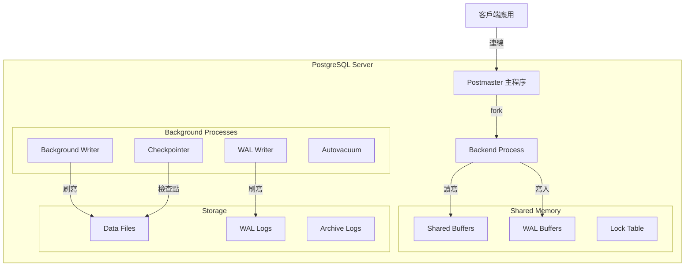
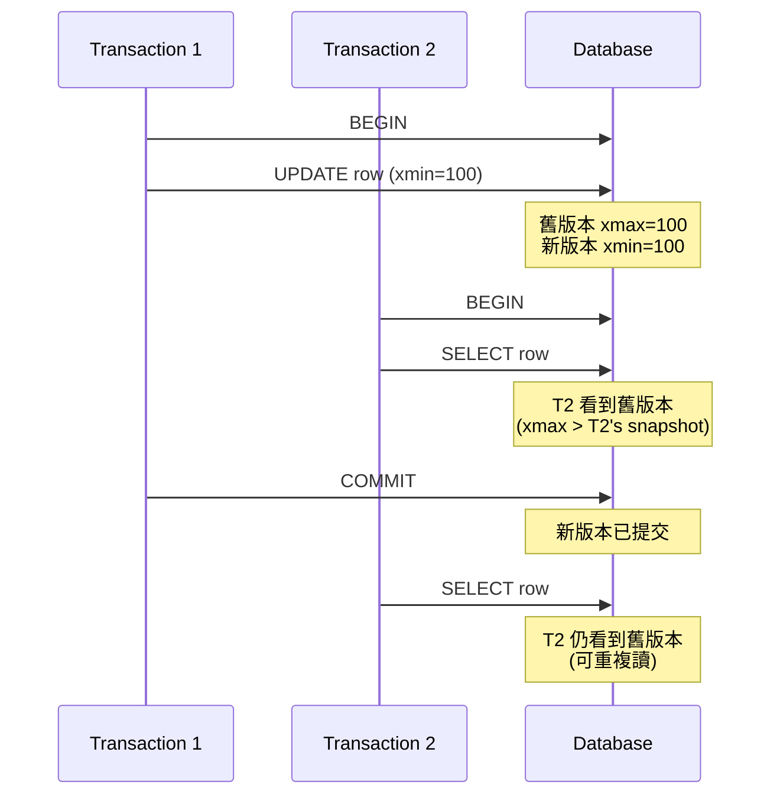
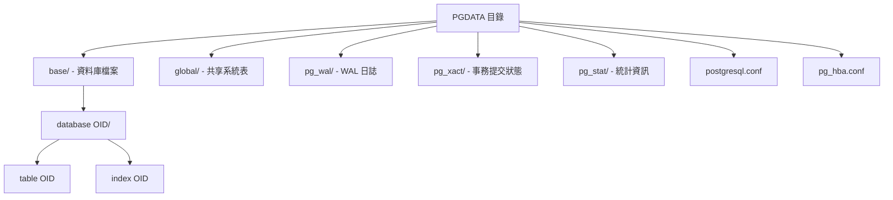

# PostgreSQL 基礎入門與架構

## PostgreSQL 是什麼

PostgreSQL 是一個開源的物件關聯式資料庫管理系統（ORDBMS），強調標準相容性與可擴展性。

**核心特性**：
- ACID 完全支援
- 支援複雜查詢、外鍵、觸發器、視圖
- 多版本併發控制（MVCC）
- 支援 JSON/JSONB、陣列、全文搜尋
- 可擴展性：自訂函數、型別、索引

## 系統架構



## 核心組件

### 1. Postmaster
- PostgreSQL 主程序
- 負責接受客戶端連線
- 為每個連線 fork 一個 backend process

### 2. Backend Process
- 每個客戶端連線對應一個 backend process
- 執行 SQL 查詢
- 管理事務

### 3. Shared Memory
- **Shared Buffers**: 快取資料頁面
- **WAL Buffers**: 預寫日誌緩衝
- **Lock Table**: 鎖管理

### 4. Background Processes
- **Background Writer**: 定期將髒頁寫入磁碟
- **Checkpointer**: 執行檢查點操作
- **WAL Writer**: 將 WAL 緩衝寫入磁碟
- **Autovacuum**: 自動清理死行與更新統計資訊

## MVCC 多版本併發控制



**核心概念**：
- 每個 tuple 有 `xmin`（創建事務 ID）和 `xmax`（刪除事務 ID）
- 不同事務可以看到同一行的不同版本
- 避免讀寫衝突
- 需要 VACUUM 清理舊版本

## 安裝與配置

### 安裝（Ubuntu/Debian）
```bash
# 添加 PostgreSQL APT 倉庫
sudo sh -c 'echo "deb http://apt.postgresql.org/pub/repos/apt $(lsb_release -cs)-pgdg main" > /etc/apt/sources.list.d/pgdg.list'
wget -qO- https://www.postgresql.org/media/keys/ACCC4CF8.asc | sudo tee /etc/apt/trusted.gpg.d/pgdg.asc

# 安裝
sudo apt update
sudo apt install postgresql-16

# 啟動服務
sudo systemctl start postgresql
sudo systemctl enable postgresql
```

### 安裝（macOS）
```bash
brew install postgresql@16
brew services start postgresql@16
```

### 基本配置

**postgresql.conf** 重要參數：
```conf
# 記憶體配置
shared_buffers = 256MB          # 建議為系統記憶體的 25%
effective_cache_size = 1GB      # 建議為系統記憶體的 50-75%
work_mem = 4MB                  # 每個查詢操作可用記憶體
maintenance_work_mem = 64MB     # VACUUM, CREATE INDEX 使用

# WAL 配置
wal_buffers = 16MB
max_wal_size = 1GB
min_wal_size = 80MB

# 連線配置
max_connections = 100
```

**pg_hba.conf**（客戶端認證）：
```conf
# TYPE  DATABASE        USER            ADDRESS                 METHOD
local   all             all                                     peer
host    all             all             127.0.0.1/32            md5
host    all             all             ::1/128                 md5
```

## 基本操作

### 連線資料庫
```bash
# 使用 postgres 使用者
sudo -u postgres psql

# 使用特定使用者和資料庫
psql -U username -d database_name -h localhost
```

### 常用 psql 命令
```sql
-- 列出所有資料庫
\l

-- 切換資料庫
\c database_name

-- 列出所有表
\dt

-- 查看表結構
\d table_name

-- 列出所有 schema
\dn

-- 列出所有使用者
\du

-- 執行 SQL 檔案
\i /path/to/file.sql

-- 開啟查詢執行時間顯示
\timing

-- 退出
\q
```

### 建立資料庫與使用者
```sql
-- 建立使用者
CREATE USER myuser WITH PASSWORD 'mypassword';

-- 建立資料庫
CREATE DATABASE mydb OWNER myuser;

-- 授予權限
GRANT ALL PRIVILEGES ON DATABASE mydb TO myuser;

-- 在資料庫內授予 schema 權限
\c mydb
GRANT ALL ON SCHEMA public TO myuser;
GRANT ALL ON ALL TABLES IN SCHEMA public TO myuser;
```

## 資料目錄結構



## 版本管理

### 檢查版本
```sql
SELECT version();
SHOW server_version;
```

### 升級策略
1. **pg_dump/pg_restore**: 邏輯備份還原（停機時間長）
2. **pg_upgrade**: 原地升級（停機時間短）
3. **邏輯複製**: 零停機升級

## 小結

PostgreSQL 關鍵理解：
- **程序模型**: 每個連線一個程序（非線程）
- **MVCC**: 高併發讀寫，無讀鎖
- **WAL**: 保證資料持久性與崩潰恢復
- **Shared Buffers**: 資料快取核心
- **Background Processes**: 自動維護與優化
