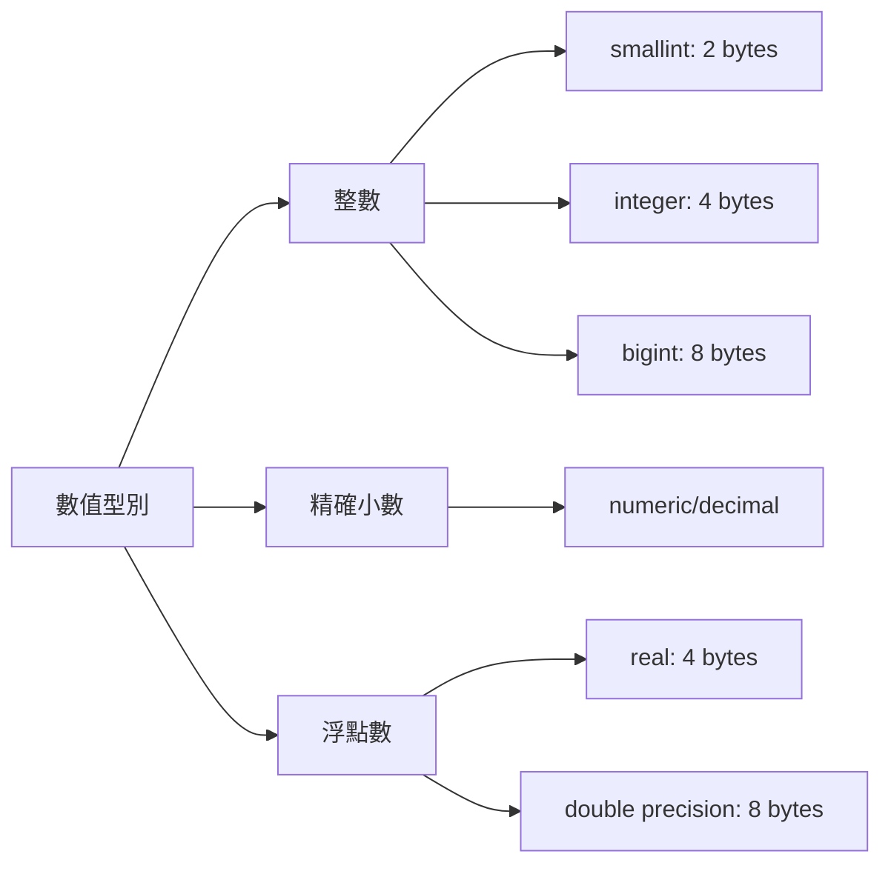
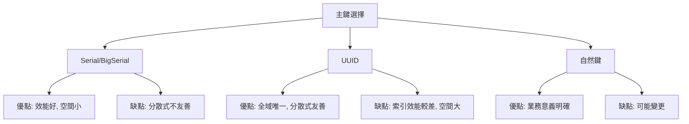
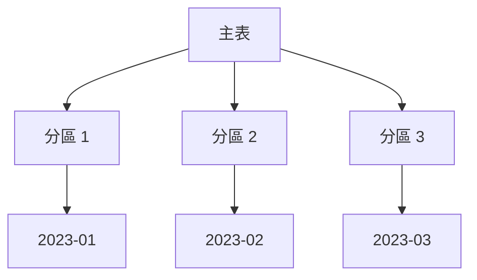

# PostgreSQL 資料型別與表設計

## 核心資料型別

### 數值型別



**整數型別**：
```sql
-- smallint: -32768 to 32767
CREATE TABLE example1 (age smallint);

-- integer: -2147483648 to 2147483647 (最常用)
CREATE TABLE example2 (user_id integer);

-- bigint: -9223372036854775808 to 9223372036854775807
CREATE TABLE example3 (large_id bigint);

-- serial (自動遞增)
CREATE TABLE users (
    id serial PRIMARY KEY,
    name text
);
-- 等價於
CREATE SEQUENCE users_id_seq;
CREATE TABLE users (
    id integer DEFAULT nextval('users_id_seq') PRIMARY KEY,
    name text
);
```

**精確小數**：
```sql
-- numeric(precision, scale)
-- precision: 總位數, scale: 小數位數
CREATE TABLE products (
    price numeric(10, 2),  -- 99999999.99
    tax_rate numeric(5, 4) -- 0.9999
);

-- 金額務必使用 numeric，不要用 float
CREATE TABLE transactions (
    amount numeric(12, 2) NOT NULL
);
```

**浮點數**：
```sql
-- real: 單精度（6 位小數精度）
CREATE TABLE measurements (
    temperature real
);

-- double precision: 雙精度（15 位小數精度）
CREATE TABLE scientific_data (
    calculation_result double precision
);
```

### 字串型別

```sql
-- char(n): 定長，不足補空格
CREATE TABLE codes (
    country_code char(2)  -- 'US', 'CN'
);

-- varchar(n): 變長，有長度限制
CREATE TABLE users (
    username varchar(50),
    email varchar(255)
);

-- text: 變長，無限制（推薦）
CREATE TABLE posts (
    content text
);
```

**效能比較**：
- `text` 和 `varchar` 效能幾乎相同
- PostgreSQL 內部都是 varlena
- 建議優先使用 `text`，除非明確需要長度限制

### 日期時間型別

```sql
-- timestamp without time zone
CREATE TABLE events (
    created_at timestamp DEFAULT CURRENT_TIMESTAMP
);

-- timestamp with time zone (推薦)
CREATE TABLE orders (
    created_at timestamptz DEFAULT now()
);

-- date
CREATE TABLE employees (
    birth_date date
);

-- time
CREATE TABLE schedules (
    start_time time
);

-- interval
SELECT now() + interval '1 day';
SELECT now() - interval '3 hours';
```

**時區處理**：
```sql
-- 設定時區
SET timezone = 'Asia/Taipei';

-- 轉換時區
SELECT created_at AT TIME ZONE 'UTC' AT TIME ZONE 'Asia/Taipei';

-- 取得當前時間
SELECT now();              -- timestamptz
SELECT current_timestamp;  -- timestamptz
SELECT current_date;       -- date
SELECT current_time;       -- time with time zone
```

### JSON 型別

```sql
-- json: 純文字儲存，每次查詢需解析
-- jsonb: 二進位儲存，支援索引（推薦）
CREATE TABLE api_logs (
    id serial PRIMARY KEY,
    request_data jsonb,
    created_at timestamptz DEFAULT now()
);

-- 插入資料
INSERT INTO api_logs (request_data) VALUES 
('{"user_id": 123, "action": "login", "ip": "192.168.1.1"}');

-- 查詢
SELECT request_data->>'user_id' FROM api_logs;
SELECT * FROM api_logs WHERE request_data->>'action' = 'login';
SELECT * FROM api_logs WHERE request_data @> '{"action": "login"}';

-- 建立索引
CREATE INDEX idx_request_data ON api_logs USING GIN (request_data);
```

### 陣列型別

```sql
-- 整數陣列
CREATE TABLE tags_example (
    id serial PRIMARY KEY,
    tag_ids integer[]
);

-- 文字陣列
CREATE TABLE articles (
    id serial PRIMARY KEY,
    tags text[]
);

-- 插入資料
INSERT INTO articles (tags) VALUES 
(ARRAY['postgresql', 'database', 'sql']);

INSERT INTO articles (tags) VALUES 
('{"rust", "systems programming"}');

-- 查詢
SELECT * FROM articles WHERE 'postgresql' = ANY(tags);
SELECT * FROM articles WHERE tags @> ARRAY['rust'];

-- 陣列函數
SELECT array_length(tags, 1) FROM articles;
SELECT unnest(tags) FROM articles;
```

### UUID 型別

```sql
-- 需要擴展
CREATE EXTENSION IF NOT EXISTS "uuid-ossp";

CREATE TABLE distributed_users (
    id uuid DEFAULT uuid_generate_v4() PRIMARY KEY,
    email text UNIQUE NOT NULL
);

-- 或使用 gen_random_uuid() (PostgreSQL 13+)
CREATE TABLE sessions (
    id uuid DEFAULT gen_random_uuid() PRIMARY KEY,
    user_id uuid NOT NULL,
    created_at timestamptz DEFAULT now()
);
```

### 其他常用型別

```sql
-- boolean
CREATE TABLE users (
    is_active boolean DEFAULT true
);

-- bytea (二進位資料)
CREATE TABLE files (
    id serial PRIMARY KEY,
    data bytea
);

-- inet (IP 位址)
CREATE TABLE access_logs (
    ip inet,
    created_at timestamptz
);

-- enum (列舉)
CREATE TYPE order_status AS ENUM ('pending', 'processing', 'completed', 'cancelled');
CREATE TABLE orders (
    id serial PRIMARY KEY,
    status order_status DEFAULT 'pending'
);
```

## 表設計最佳實踐

### 主鍵設計



**Serial 主鍵**：
```sql
-- 單機系統推薦
CREATE TABLE users (
    id serial PRIMARY KEY,
    email text UNIQUE NOT NULL
);

-- bigserial 用於高成長表
CREATE TABLE events (
    id bigserial PRIMARY KEY,
    event_type text,
    created_at timestamptz DEFAULT now()
);
```

**UUID 主鍵**：
```sql
-- 分散式系統推薦
CREATE TABLE distributed_orders (
    id uuid DEFAULT gen_random_uuid() PRIMARY KEY,
    user_id uuid NOT NULL,
    total numeric(12, 2) NOT NULL
);

-- 使用 UUIDv7 (時間排序) 改善索引效能
-- 需要第三方擴展或應用層生成
```

### 約束條件

```sql
CREATE TABLE products (
    id serial PRIMARY KEY,
    
    -- NOT NULL 約束
    name text NOT NULL,
    
    -- UNIQUE 約束
    sku text UNIQUE NOT NULL,
    
    -- CHECK 約束
    price numeric(10, 2) CHECK (price > 0),
    quantity integer CHECK (quantity >= 0),
    
    -- DEFAULT 值
    is_active boolean DEFAULT true,
    created_at timestamptz DEFAULT now(),
    
    -- FOREIGN KEY 約束
    category_id integer REFERENCES categories(id) ON DELETE CASCADE
);

-- 多欄位 UNIQUE
CREATE TABLE user_roles (
    user_id integer REFERENCES users(id),
    role_id integer REFERENCES roles(id),
    UNIQUE(user_id, role_id)
);

-- 複雜 CHECK 約束
CREATE TABLE reservations (
    id serial PRIMARY KEY,
    start_date date NOT NULL,
    end_date date NOT NULL,
    CHECK (end_date > start_date)
);
```

### 索引策略

```sql
-- B-Tree 索引（預設）
CREATE INDEX idx_users_email ON users(email);

-- 多欄位索引（最左前綴原則）
CREATE INDEX idx_orders_user_created ON orders(user_id, created_at DESC);

-- 部分索引
CREATE INDEX idx_active_users ON users(email) WHERE is_active = true;

-- 表達式索引
CREATE INDEX idx_users_lower_email ON users(LOWER(email));

-- GIN 索引（JSON, 陣列, 全文搜尋）
CREATE INDEX idx_articles_tags ON articles USING GIN(tags);
CREATE INDEX idx_logs_data ON api_logs USING GIN(request_data);

-- 唯一索引
CREATE UNIQUE INDEX idx_users_username ON users(username);
```

### Schema 設計模式

**規範化（Normalization）**：
```sql
-- 1NF, 2NF, 3NF
CREATE TABLE users (
    id serial PRIMARY KEY,
    username text UNIQUE NOT NULL,
    email text UNIQUE NOT NULL
);

CREATE TABLE orders (
    id serial PRIMARY KEY,
    user_id integer REFERENCES users(id),
    order_date timestamptz DEFAULT now()
);

CREATE TABLE order_items (
    id serial PRIMARY KEY,
    order_id integer REFERENCES orders(id),
    product_id integer REFERENCES products(id),
    quantity integer NOT NULL,
    price numeric(10, 2) NOT NULL
);
```

**反規範化（適度）**：
```sql
-- 避免頻繁 JOIN，複製常用欄位
CREATE TABLE orders (
    id serial PRIMARY KEY,
    user_id integer REFERENCES users(id),
    user_email text NOT NULL,  -- 反規範化
    total_amount numeric(12, 2) NOT NULL,  -- 計算欄位快取
    created_at timestamptz DEFAULT now()
);
```

**軟刪除模式**：
```sql
CREATE TABLE posts (
    id serial PRIMARY KEY,
    title text NOT NULL,
    content text,
    deleted_at timestamptz,
    created_at timestamptz DEFAULT now()
);

-- 查詢活躍資料
CREATE INDEX idx_posts_active ON posts(id) WHERE deleted_at IS NULL;

SELECT * FROM posts WHERE deleted_at IS NULL;
```

**版本控制模式**：
```sql
CREATE TABLE document_versions (
    id serial PRIMARY KEY,
    document_id integer NOT NULL,
    version integer NOT NULL,
    content text NOT NULL,
    created_by integer REFERENCES users(id),
    created_at timestamptz DEFAULT now(),
    UNIQUE(document_id, version)
);
```

### 分區表（Partitioning）



**範圍分區**：
```sql
-- 按日期分區
CREATE TABLE events (
    id bigserial,
    event_type text NOT NULL,
    event_data jsonb,
    created_at timestamptz NOT NULL
) PARTITION BY RANGE (created_at);

-- 建立分區
CREATE TABLE events_2024_01 PARTITION OF events
    FOR VALUES FROM ('2024-01-01') TO ('2024-02-01');

CREATE TABLE events_2024_02 PARTITION OF events
    FOR VALUES FROM ('2024-02-01') TO ('2024-03-01');

-- 預設分區
CREATE TABLE events_default PARTITION OF events DEFAULT;
```

**列表分區**：
```sql
CREATE TABLE sales (
    id serial,
    region text NOT NULL,
    amount numeric(10, 2)
) PARTITION BY LIST (region);

CREATE TABLE sales_asia PARTITION OF sales
    FOR VALUES IN ('TW', 'JP', 'KR');

CREATE TABLE sales_europe PARTITION OF sales
    FOR VALUES IN ('UK', 'DE', 'FR');
```

**雜湊分區**：
```sql
CREATE TABLE users (
    id serial,
    username text NOT NULL,
    email text
) PARTITION BY HASH (id);

CREATE TABLE users_0 PARTITION OF users
    FOR VALUES WITH (MODULUS 4, REMAINDER 0);

CREATE TABLE users_1 PARTITION OF users
    FOR VALUES WITH (MODULUS 4, REMAINDER 1);
```

## 小結

**資料型別選擇**：
- 整數：`integer` 或 `bigint`
- 金額：`numeric(12, 2)`
- 字串：優先 `text`
- 時間：`timestamptz`
- JSON：`jsonb`
- 主鍵：單機用 `serial`，分散式用 `uuid`

**設計原則**：
- 合理規範化，避免過度規範化
- 適度反規範化提升查詢效能
- 正確使用約束保證資料完整性
- 根據查詢模式建立索引
- 大表考慮分區
