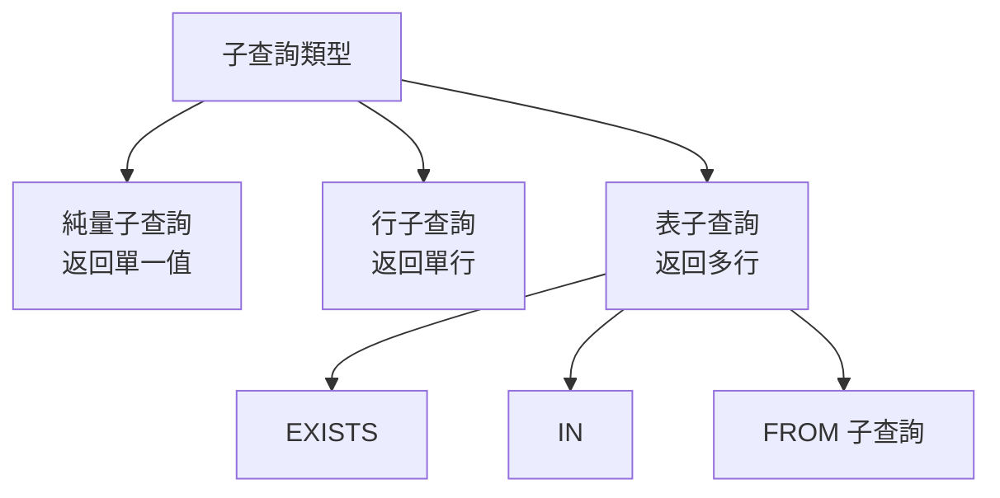
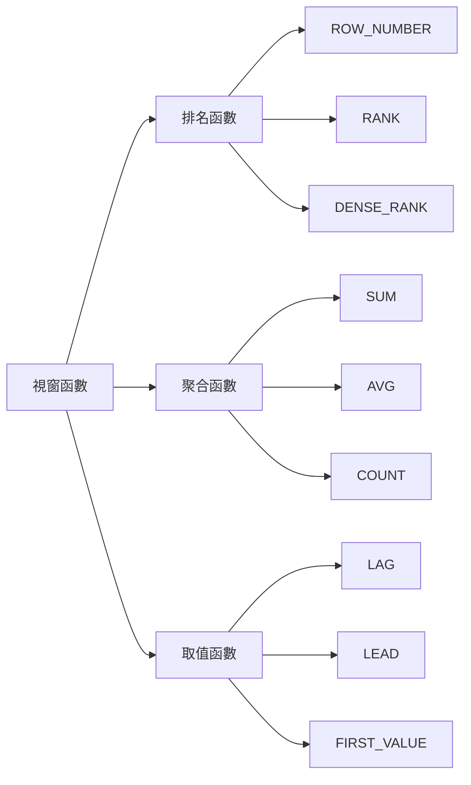

# PostgreSQL SQL 查詢與進階語法

## 基本查詢

### SELECT 基礎

```sql
-- 基本查詢
SELECT * FROM users;
SELECT id, name, email FROM users;

-- 別名
SELECT 
    id AS user_id,
    name AS user_name,
    email
FROM users AS u;

-- DISTINCT
SELECT DISTINCT country FROM users;

-- WHERE 條件
SELECT * FROM users WHERE age > 18;
SELECT * FROM users WHERE country = 'Taiwan' AND is_active = true;
SELECT * FROM users WHERE age BETWEEN 18 AND 65;
SELECT * FROM users WHERE name LIKE 'John%';
SELECT * FROM users WHERE email IS NOT NULL;

-- IN 與 NOT IN
SELECT * FROM users WHERE country IN ('Taiwan', 'Japan', 'Korea');

-- 排序
SELECT * FROM users ORDER BY created_at DESC;
SELECT * FROM users ORDER BY country ASC, age DESC;

-- 分頁
SELECT * FROM users LIMIT 10 OFFSET 20;
```

### 聚合函數

```sql
-- 基本聚合
SELECT COUNT(*) FROM users;
SELECT COUNT(DISTINCT country) FROM users;
SELECT AVG(age) FROM users;
SELECT SUM(amount) FROM orders;
SELECT MAX(created_at), MIN(created_at) FROM events;

-- GROUP BY
SELECT 
    country,
    COUNT(*) AS user_count,
    AVG(age) AS avg_age
FROM users
GROUP BY country;

-- HAVING (過濾聚合結果)
SELECT 
    country,
    COUNT(*) AS user_count
FROM users
GROUP BY country
HAVING COUNT(*) > 100;

-- 多欄位 GROUP BY
SELECT 
    country,
    city,
    COUNT(*) AS user_count
FROM users
GROUP BY country, city
ORDER BY user_count DESC;
```

## JOIN 操作


### INNER JOIN

```sql
-- 基本 INNER JOIN
SELECT 
    u.id,
    u.name,
    o.order_id,
    o.total_amount
FROM users u
INNER JOIN orders o ON u.id = o.user_id;

-- 多表 JOIN
SELECT 
    u.name,
    o.order_id,
    oi.product_id,
    p.product_name,
    oi.quantity
FROM users u
INNER JOIN orders o ON u.id = o.user_id
INNER JOIN order_items oi ON o.id = oi.order_id
INNER JOIN products p ON oi.product_id = p.id;
```

### LEFT JOIN

```sql
-- 找出所有使用者及其訂單（包含沒有訂單的使用者）
SELECT 
    u.id,
    u.name,
    COUNT(o.id) AS order_count
FROM users u
LEFT JOIN orders o ON u.id = o.user_id
GROUP BY u.id, u.name;

-- 找出沒有訂單的使用者
SELECT u.* 
FROM users u
LEFT JOIN orders o ON u.id = o.user_id
WHERE o.id IS NULL;
```

### 自連接（Self Join）

```sql
-- 員工與主管關係
SELECT 
    e.name AS employee,
    m.name AS manager
FROM employees e
LEFT JOIN employees m ON e.manager_id = m.id;
```

## 子查詢（Subquery）



### 基本子查詢

```sql
-- 標量子查詢
SELECT 
    name,
    age,
    (SELECT AVG(age) FROM users) AS avg_age
FROM users;

-- IN 子查詢
SELECT * FROM products
WHERE category_id IN (
    SELECT id FROM categories WHERE name IN ('Electronics', 'Books')
);

-- EXISTS 子查詢（效能通常較好）
SELECT * FROM users u
WHERE EXISTS (
    SELECT 1 FROM orders o WHERE o.user_id = u.id
);

-- NOT EXISTS（找出沒有訂單的使用者）
SELECT * FROM users u
WHERE NOT EXISTS (
    SELECT 1 FROM orders o WHERE o.user_id = u.id
);
```

### FROM 子查詢

```sql
-- 複雜統計
SELECT 
    user_stats.country,
    AVG(user_stats.order_count) AS avg_orders_per_user
FROM (
    SELECT 
        u.country,
        u.id,
        COUNT(o.id) AS order_count
    FROM users u
    LEFT JOIN orders o ON u.id = o.user_id
    GROUP BY u.country, u.id
) AS user_stats
GROUP BY user_stats.country;
```

## CTE（Common Table Expression）

```sql
-- 基本 CTE
WITH active_users AS (
    SELECT * FROM users WHERE is_active = true
)
SELECT * FROM active_users WHERE age > 18;

-- 多個 CTE
WITH 
user_orders AS (
    SELECT 
        user_id,
        COUNT(*) AS order_count,
        SUM(total_amount) AS total_spent
    FROM orders
    GROUP BY user_id
),
high_value_users AS (
    SELECT user_id FROM user_orders WHERE total_spent > 1000
)
SELECT 
    u.name,
    uo.order_count,
    uo.total_spent
FROM users u
INNER JOIN user_orders uo ON u.id = uo.user_id
WHERE u.id IN (SELECT user_id FROM high_value_users);
```

### 遞迴 CTE

```sql
-- 組織架構樹
WITH RECURSIVE org_tree AS (
    -- 基礎查詢：根節點
    SELECT id, name, manager_id, 1 AS level
    FROM employees
    WHERE manager_id IS NULL
    
    UNION ALL
    
    -- 遞迴查詢
    SELECT e.id, e.name, e.manager_id, ot.level + 1
    FROM employees e
    INNER JOIN org_tree ot ON e.manager_id = ot.id
)
SELECT * FROM org_tree ORDER BY level, name;

-- 數字序列生成
WITH RECURSIVE numbers AS (
    SELECT 1 AS n
    UNION ALL
    SELECT n + 1 FROM numbers WHERE n < 100
)
SELECT * FROM numbers;
```

## 視窗函數（Window Functions）



### 排名函數

```sql
-- ROW_NUMBER: 唯一排名
SELECT 
    name,
    country,
    age,
    ROW_NUMBER() OVER (PARTITION BY country ORDER BY age DESC) AS row_num
FROM users;

-- RANK: 相同值相同排名，有間隙
SELECT 
    name,
    score,
    RANK() OVER (ORDER BY score DESC) AS rank
FROM students;

-- DENSE_RANK: 相同值相同排名，無間隙
SELECT 
    name,
    score,
    DENSE_RANK() OVER (ORDER BY score DESC) AS dense_rank
FROM students;

-- 每個國家取前 3 名
WITH ranked_users AS (
    SELECT 
        *,
        ROW_NUMBER() OVER (PARTITION BY country ORDER BY score DESC) AS rn
    FROM users
)
SELECT * FROM ranked_users WHERE rn <= 3;
```

### 聚合視窗函數

```sql
-- 累計總和
SELECT 
    order_date,
    amount,
    SUM(amount) OVER (ORDER BY order_date) AS cumulative_total
FROM orders;

-- 移動平均
SELECT 
    order_date,
    amount,
    AVG(amount) OVER (
        ORDER BY order_date 
        ROWS BETWEEN 6 PRECEDING AND CURRENT ROW
    ) AS moving_avg_7_days
FROM daily_sales;

-- 分區內佔比
SELECT 
    country,
    user_id,
    amount,
    amount / SUM(amount) OVER (PARTITION BY country) AS percentage
FROM sales;
```

### 取值函數

```sql
-- LAG: 上一行
-- LEAD: 下一行
SELECT 
    date,
    revenue,
    LAG(revenue) OVER (ORDER BY date) AS prev_day_revenue,
    revenue - LAG(revenue) OVER (ORDER BY date) AS daily_change,
    LEAD(revenue) OVER (ORDER BY date) AS next_day_revenue
FROM daily_revenue;

-- FIRST_VALUE, LAST_VALUE
SELECT 
    user_id,
    order_date,
    amount,
    FIRST_VALUE(amount) OVER (PARTITION BY user_id ORDER BY order_date) AS first_order_amount,
    LAST_VALUE(amount) OVER (
        PARTITION BY user_id 
        ORDER BY order_date
        ROWS BETWEEN UNBOUNDED PRECEDING AND UNBOUNDED FOLLOWING
    ) AS last_order_amount
FROM orders;
```

## UNION / INTERSECT / EXCEPT

```sql
-- UNION (去重)
SELECT email FROM customers
UNION
SELECT email FROM suppliers;

-- UNION ALL (不去重，效能較好)
SELECT email FROM customers
UNION ALL
SELECT email FROM suppliers;

-- INTERSECT (交集)
SELECT email FROM customers
INTERSECT
SELECT email FROM newsletter_subscribers;

-- EXCEPT (差集)
SELECT email FROM customers
EXCEPT
SELECT email FROM unsubscribed;
```

## CASE 表達式

```sql
-- 簡單 CASE
SELECT 
    name,
    CASE country
        WHEN 'TW' THEN '台灣'
        WHEN 'JP' THEN '日本'
        WHEN 'KR' THEN '韓國'
        ELSE '其他'
    END AS country_name
FROM users;

-- 搜尋 CASE
SELECT 
    name,
    age,
    CASE 
        WHEN age < 18 THEN '未成年'
        WHEN age BETWEEN 18 AND 65 THEN '成年'
        ELSE '老年'
    END AS age_group
FROM users;

-- 聚合中使用 CASE
SELECT 
    country,
    COUNT(*) AS total_users,
    COUNT(CASE WHEN age < 18 THEN 1 END) AS minor_count,
    COUNT(CASE WHEN age >= 18 THEN 1 END) AS adult_count
FROM users
GROUP BY country;
```

## JSON 查詢

```sql
-- 基本查詢
SELECT data->>'name' AS name FROM api_logs;
SELECT data->'user'->>'email' AS email FROM api_logs;

-- 路徑查詢
SELECT data #> '{user, address, city}' FROM api_logs;

-- 陣列元素
SELECT data->'tags'->0 AS first_tag FROM articles;

-- 陣列展開
SELECT jsonb_array_elements_text(data->'tags') AS tag FROM articles;

-- 條件查詢
SELECT * FROM api_logs WHERE data @> '{"status": "success"}';
SELECT * FROM api_logs WHERE data->>'status' = 'success';
SELECT * FROM api_logs WHERE data ? 'user_id';

-- 聚合
SELECT 
    data->>'country' AS country,
    COUNT(*) AS count
FROM api_logs
GROUP BY data->>'country';
```

## 全文搜尋

```sql
-- 建立 tsvector
SELECT to_tsvector('english', 'The quick brown fox jumps over the lazy dog');

-- 全文搜尋查詢
SELECT * FROM articles
WHERE to_tsvector('english', title || ' ' || content) @@ to_tsquery('english', 'postgresql & database');

-- 建立 GIN 索引
CREATE INDEX idx_articles_fts ON articles 
USING GIN (to_tsvector('english', title || ' ' || content));

-- 使用生成欄位
ALTER TABLE articles ADD COLUMN search_vector tsvector
    GENERATED ALWAYS AS (to_tsvector('english', title || ' ' || content)) STORED;

CREATE INDEX idx_articles_search ON articles USING GIN (search_vector);

SELECT * FROM articles WHERE search_vector @@ to_tsquery('english', 'postgresql');
```

## 小結

**查詢優化建議**：
- 優先使用 JOIN 而非子查詢
- EXISTS 通常比 IN 效能好
- CTE 可提升可讀性，但注意 PostgreSQL 12+ 才支援 CTE 最佳化
- 視窗函數避免多次子查詢
- 適當使用索引支援查詢條件
