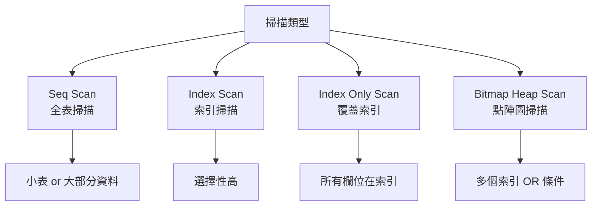
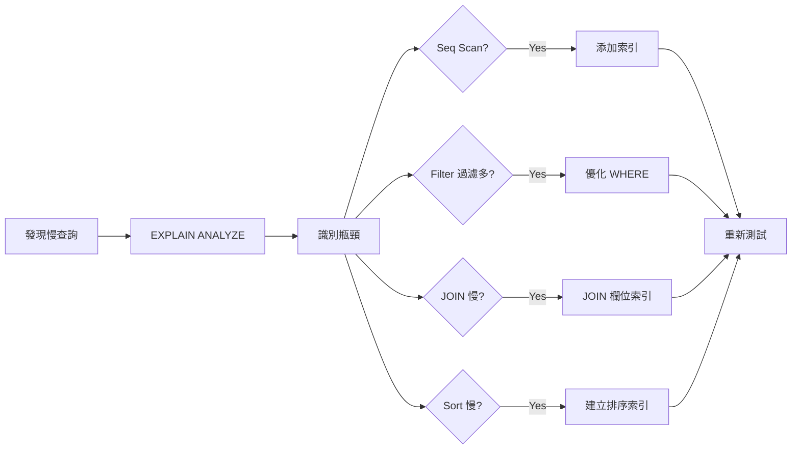

# PostgreSQL 索引與查詢優化

## 索引類型

```mermaid
graph TB
    Index[索引類型]
    
    Index --> BTree[B-Tree<br/>預設, 最常用]
    Index --> Hash[Hash<br/>等值查詢]
    Index --> GiST[GiST<br/>幾何, 全文搜尋]
    Index --> GIN[GIN<br/>JSON, 陣列, 全文]
    Index --> BRIN[BRIN<br/>大表, 順序資料]
    Index --> SPGiST[SP-GiST<br/>分區資料]
    
    BTree --> BTreeUse[範圍查詢<br/>排序<br/>不等式]
    Hash --> HashUse[= 查詢]
    GIN --> GINUse[包含查詢<br/>@>, ?]
    BRIN --> BRINUse[時間序列<br/>低記憶體]
```

## B-Tree 索引

### 基本使用

```sql
-- 建立單欄位索引
CREATE INDEX idx_users_email ON users(email);

-- 建立多欄位索引（複合索引）
CREATE INDEX idx_orders_user_date ON orders(user_id, created_at);

-- 唯一索引
CREATE UNIQUE INDEX idx_users_username ON users(username);

-- 降序索引
CREATE INDEX idx_orders_created_desc ON orders(created_at DESC);

-- 多欄位混合排序
CREATE INDEX idx_orders_composite ON orders(user_id ASC, created_at DESC);
```

### 最左前綴原則

```sql
-- 索引：(user_id, status, created_at)
CREATE INDEX idx_orders_composite ON orders(user_id, status, created_at);

-- ✅ 可使用索引
SELECT * FROM orders WHERE user_id = 123;
SELECT * FROM orders WHERE user_id = 123 AND status = 'pending';
SELECT * FROM orders WHERE user_id = 123 AND status = 'pending' AND created_at > '2024-01-01';

-- ❌ 不能完全使用索引
SELECT * FROM orders WHERE status = 'pending';  -- 跳過 user_id
SELECT * FROM orders WHERE created_at > '2024-01-01';  -- 跳過 user_id, status

-- ⚠️ 部分使用索引
SELECT * FROM orders WHERE user_id = 123 AND created_at > '2024-01-01';  -- 只用 user_id
```

### 部分索引（Partial Index）

```sql
-- 只索引活躍使用者
CREATE INDEX idx_active_users_email ON users(email) WHERE is_active = true;

-- 只索引待處理訂單
CREATE INDEX idx_pending_orders ON orders(created_at) WHERE status = 'pending';

-- 只索引非空值
CREATE INDEX idx_users_phone ON users(phone) WHERE phone IS NOT NULL;
```

**優點**：
- 索引更小
- 維護成本更低
- 查詢效能更好

### 表達式索引（Expression Index）

```sql
-- 不區分大小寫搜尋
CREATE INDEX idx_users_lower_email ON users(LOWER(email));
SELECT * FROM users WHERE LOWER(email) = 'test@example.com';

-- JSON 欄位索引
CREATE INDEX idx_data_user_id ON events((data->>'user_id'));
SELECT * FROM events WHERE data->>'user_id' = '123';

-- 計算欄位索引
CREATE INDEX idx_orders_total ON orders((quantity * unit_price));
```

### INCLUDE 欄位（Covering Index）

```sql
-- PostgreSQL 11+
CREATE INDEX idx_users_email_include ON users(email) INCLUDE (name, created_at);

-- Index-Only Scan
SELECT email, name, created_at FROM users WHERE email = 'test@example.com';
```

## GIN 索引

### JSON/JSONB 索引

```sql
-- 索引整個 JSONB 欄位
CREATE INDEX idx_data ON events USING GIN (data);

-- 包含查詢
SELECT * FROM events WHERE data @> '{"user_id": 123}';
SELECT * FROM events WHERE data @> '{"tags": ["postgresql"]}';

-- 存在查詢
SELECT * FROM events WHERE data ? 'user_id';
SELECT * FROM events WHERE data ?| ARRAY['user_id', 'session_id'];  -- OR
SELECT * FROM events WHERE data ?& ARRAY['user_id', 'session_id'];  -- AND

-- 路徑索引（更精確）
CREATE INDEX idx_data_user_id ON events USING GIN ((data -> 'user_id'));
```

### 陣列索引

```sql
CREATE INDEX idx_tags ON articles USING GIN (tags);

-- 包含查詢
SELECT * FROM articles WHERE tags @> ARRAY['postgresql'];

-- 重疊查詢
SELECT * FROM articles WHERE tags && ARRAY['postgresql', 'database'];

-- 任意元素
SELECT * FROM articles WHERE 'postgresql' = ANY(tags);
```

### 全文搜尋索引

```sql
-- 建立 GIN 索引
CREATE INDEX idx_documents_fts ON documents 
USING GIN (to_tsvector('english', content));

-- 查詢
SELECT * FROM documents 
WHERE to_tsvector('english', content) @@ to_tsquery('english', 'postgresql & performance');

-- 使用生成欄位
ALTER TABLE documents ADD COLUMN search_vector tsvector
    GENERATED ALWAYS AS (to_tsvector('english', title || ' ' || content)) STORED;

CREATE INDEX idx_documents_search ON documents USING GIN (search_vector);
```

## BRIN 索引

**適用場景**：大型表，資料自然排序（如時間序列）

```sql
-- 時間序列資料
CREATE INDEX idx_events_created_brin ON events USING BRIN (created_at);

-- 優點：索引非常小
-- 缺點：查詢效能不如 B-Tree

-- 檢視 BRIN 索引大小
SELECT pg_size_pretty(pg_relation_size('idx_events_created_brin'));
```

**BRIN vs B-Tree**：
- BRIN: 100GB 表，索引可能只有幾 MB
- B-Tree: 100GB 表，索引可能有幾 GB

## 查詢計畫分析

### EXPLAIN

```sql
-- 基本 EXPLAIN
EXPLAIN SELECT * FROM users WHERE email = 'test@example.com';

-- EXPLAIN ANALYZE（實際執行）
EXPLAIN ANALYZE SELECT * FROM users WHERE email = 'test@example.com';

-- 詳細資訊
EXPLAIN (ANALYZE, BUFFERS, VERBOSE) 
SELECT * FROM users WHERE email = 'test@example.com';
```

### 解讀執行計畫



**常見節點**：

```sql
-- Seq Scan（全表掃描）
Seq Scan on users  (cost=0.00..1234.56 rows=10000 width=128)
-- cost: 啟動成本..總成本
-- rows: 預估返回行數
-- width: 平均行寬度（bytes）

-- Index Scan（索引掃描）
Index Scan using idx_users_email on users  (cost=0.42..8.44 rows=1 width=128)
  Index Cond: (email = 'test@example.com'::text)

-- Index Only Scan（最佳）
Index Only Scan using idx_users_email_include on users  (cost=0.42..4.44 rows=1 width=48)
  Index Cond: (email = 'test@example.com'::text)
  Heap Fetches: 0  -- 0 表示所有資料來自索引

-- Bitmap Heap Scan（多條件）
Bitmap Heap Scan on orders  (cost=12.34..567.89 rows=100 width=64)
  Recheck Cond: ((user_id = 123) OR (status = 'pending'::text))
  ->  BitmapOr  (cost=12.34..12.34 rows=100 width=0)
        ->  Bitmap Index Scan on idx_orders_user_id
        ->  Bitmap Index Scan on idx_orders_status
```

### 查詢優化步驟



## 常見優化技巧

### 1. 避免 SELECT *

```sql
-- ❌ 不好
SELECT * FROM users WHERE id = 123;

-- ✅ 好
SELECT id, name, email FROM users WHERE id = 123;
```

### 2. 使用 Covering Index

```sql
-- 查詢
SELECT email, name FROM users WHERE email = 'test@example.com';

-- 建立包含索引
CREATE INDEX idx_users_email_covering ON users(email) INCLUDE (name);
-- 結果：Index Only Scan
```

### 3. 避免函數包裹索引欄位

```sql
-- ❌ 不會使用索引
SELECT * FROM users WHERE LOWER(email) = 'test@example.com';

-- ✅ 建立表達式索引
CREATE INDEX idx_users_lower_email ON users(LOWER(email));

-- ✅ 或應用層處理
SELECT * FROM users WHERE email = 'test@example.com';  -- 假設資料庫已存小寫
```

### 4. 優化 LIKE 查詢

```sql
-- ✅ 可使用索引
SELECT * FROM users WHERE email LIKE 'test%';

-- ❌ 不能使用普通索引
SELECT * FROM users WHERE email LIKE '%test%';

-- ✅ 使用全文搜尋
CREATE INDEX idx_users_email_trgm ON users USING GIN (email gin_trgm_ops);
CREATE EXTENSION pg_trgm;
SELECT * FROM users WHERE email ILIKE '%test%';
```

### 5. 優化 JOIN

```sql
-- 確保 JOIN 欄位有索引
CREATE INDEX idx_orders_user_id ON orders(user_id);
CREATE INDEX idx_users_id ON users(id);  -- PRIMARY KEY 自動建立

-- 小表驅動大表
-- PostgreSQL 查詢優化器通常會自動處理，但可手動調整
```

### 6. 使用 EXISTS 代替 IN

```sql
-- ❌ 較慢（大資料集）
SELECT * FROM users 
WHERE id IN (SELECT user_id FROM orders WHERE total > 1000);

-- ✅ 更快
SELECT * FROM users u
WHERE EXISTS (SELECT 1 FROM orders o WHERE o.user_id = u.id AND o.total > 1000);
```

### 7. 分批處理大量資料

```sql
-- ❌ 一次更新百萬行
UPDATE users SET is_active = false WHERE last_login < '2020-01-01';

-- ✅ 分批更新
DO $$
DECLARE
    batch_size INT := 10000;
    affected INT;
BEGIN
    LOOP
        UPDATE users SET is_active = false 
        WHERE id IN (
            SELECT id FROM users 
            WHERE last_login < '2020-01-01' AND is_active = true
            LIMIT batch_size
        );
        
        GET DIAGNOSTICS affected = ROW_COUNT;
        EXIT WHEN affected = 0;
        
        COMMIT;
        PERFORM pg_sleep(0.1);
    END LOOP;
END $$;
```

### 8. 使用物化視圖

```sql
-- 複雜查詢
CREATE MATERIALIZED VIEW user_statistics AS
SELECT 
    u.id,
    u.name,
    COUNT(o.id) AS order_count,
    SUM(o.total) AS total_spent,
    MAX(o.created_at) AS last_order_date
FROM users u
LEFT JOIN orders o ON u.id = o.user_id
GROUP BY u.id, u.name;

-- 建立索引
CREATE INDEX idx_user_stats_id ON user_statistics(id);

-- 重新整理
REFRESH MATERIALIZED VIEW user_statistics;

-- 並發重新整理（不鎖定讀取）
REFRESH MATERIALIZED VIEW CONCURRENTLY user_statistics;
```

## 索引維護

### 查看索引使用情況

```sql
-- 查看表的索引
SELECT
    schemaname,
    tablename,
    indexname,
    idx_scan AS index_scans,
    idx_tup_read AS tuples_read,
    idx_tup_fetch AS tuples_fetched
FROM pg_stat_user_indexes
WHERE schemaname = 'public'
ORDER BY idx_scan ASC;

-- 未使用的索引
SELECT
    schemaname,
    tablename,
    indexname
FROM pg_stat_user_indexes
WHERE idx_scan = 0
    AND indexrelname NOT LIKE '%_pkey';
```

### 查看索引大小

```sql
SELECT
    tablename,
    indexname,
    pg_size_pretty(pg_relation_size(indexrelid)) AS index_size
FROM pg_stat_user_indexes
WHERE schemaname = 'public'
ORDER BY pg_relation_size(indexrelid) DESC;
```

### 重建索引

```sql
-- 重建單一索引（鎖表）
REINDEX INDEX idx_users_email;

-- 並發重建（不鎖定寫入）PostgreSQL 12+
REINDEX INDEX CONCURRENTLY idx_users_email;

-- 重建表的所有索引
REINDEX TABLE users;

-- 重建資料庫所有索引
REINDEX DATABASE mydb;
```

### 刪除未使用的索引

```sql
-- 謹慎刪除！先確認真的未使用
DROP INDEX IF EXISTS idx_unused;
```

## 統計資訊更新

```sql
-- 手動更新統計資訊
ANALYZE users;

-- 更新整個資料庫
ANALYZE;

-- 查看上次 ANALYZE 時間
SELECT 
    schemaname,
    tablename,
    last_analyze,
    last_autoanalyze
FROM pg_stat_user_tables;
```

## 小結

**索引選擇**：
- 預設使用 B-Tree
- JSON/陣列/全文搜尋使用 GIN
- 大型時間序列表使用 BRIN

**優化流程**：
1. 使用 `EXPLAIN ANALYZE` 找出瓶頸
2. 根據查詢模式建立索引
3. 避免過度索引（影響寫入效能）
4. 定期檢查索引使用情況
5. 保持統計資訊更新

**索引原則**：
- WHERE、JOIN、ORDER BY 欄位優先
- 高選擇性欄位優先
- 考慮 Covering Index
- 避免索引過多（寫入變慢）
