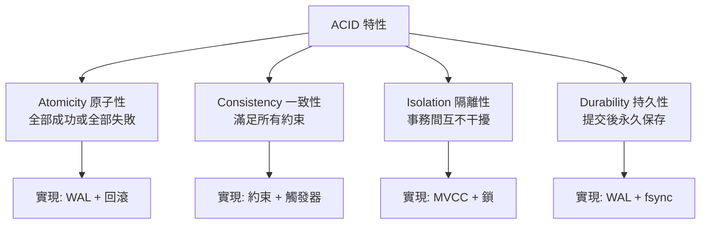
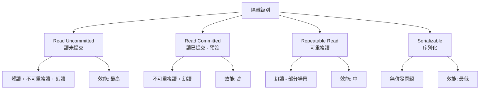
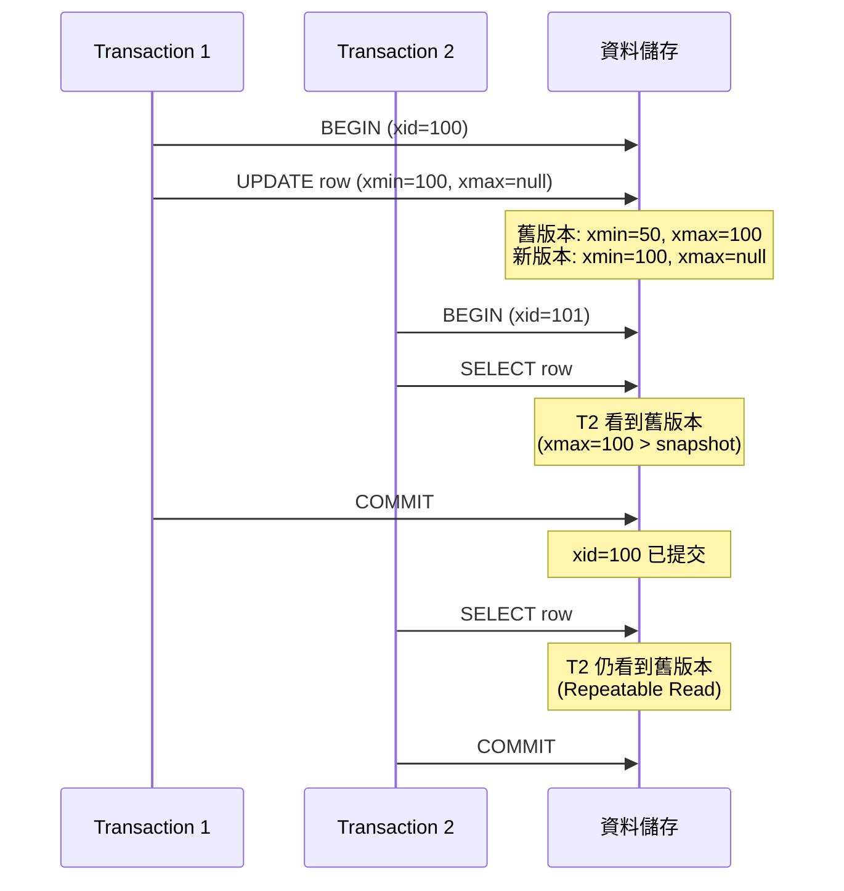
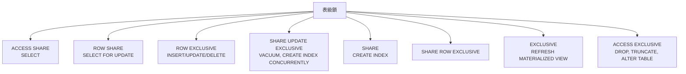

# PostgreSQL 事務與併發控制

## ACID 特性



## 事務基礎

### 基本語法

```sql
-- 開始事務
BEGIN;
-- 或
START TRANSACTION;

-- 提交事務
COMMIT;

-- 回滾事務
ROLLBACK;
```

### 實際範例

```sql
-- 轉帳操作
BEGIN;

-- 檢查餘額
SELECT balance FROM accounts WHERE id = 1;

-- 扣款
UPDATE accounts SET balance = balance - 100 WHERE id = 1;

-- 入帳
UPDATE accounts SET balance = balance + 100 WHERE id = 2;

-- 提交
COMMIT;
```

### Savepoint（保存點）

```sql
BEGIN;

INSERT INTO users (name) VALUES ('Alice');

SAVEPOINT sp1;

INSERT INTO users (name) VALUES ('Bob');

-- 回滾到 sp1，Bob 不會插入，但 Alice 會保留
ROLLBACK TO sp1;

INSERT INTO users (name) VALUES ('Charlie');

COMMIT;  -- Alice 和 Charlie 被插入
```

## 隔離級別



### 設定隔離級別

```sql
-- 設定當前事務隔離級別
BEGIN TRANSACTION ISOLATION LEVEL READ COMMITTED;
BEGIN TRANSACTION ISOLATION LEVEL REPEATABLE READ;
BEGIN TRANSACTION ISOLATION LEVEL SERIALIZABLE;

-- 設定 session 預設隔離級別
SET SESSION CHARACTERISTICS AS TRANSACTION ISOLATION LEVEL REPEATABLE READ;

-- 查看當前隔離級別
SHOW transaction_isolation;
```

### 併發問題範例

**髒讀（Dirty Read）**：
```sql
-- PostgreSQL 不支援 Read Uncommitted，最低為 Read Committed
-- 因此不會有髒讀問題
```

**不可重複讀（Non-Repeatable Read）**：
```sql
-- Session 1 (Read Committed)
BEGIN;
SELECT balance FROM accounts WHERE id = 1;  -- 100

-- Session 2
BEGIN;
UPDATE accounts SET balance = 200 WHERE id = 1;
COMMIT;

-- Session 1 再次查詢
SELECT balance FROM accounts WHERE id = 1;  -- 200（不一致！）
COMMIT;
```

**幻讀（Phantom Read）**：
```sql
-- Session 1 (Read Committed)
BEGIN;
SELECT COUNT(*) FROM orders WHERE status = 'pending';  -- 10

-- Session 2
BEGIN;
INSERT INTO orders (status) VALUES ('pending');
COMMIT;

-- Session 1 再次查詢
SELECT COUNT(*) FROM orders WHERE status = 'pending';  -- 11（幻行）
COMMIT;
```

### Repeatable Read 範例

```sql
-- Session 1
BEGIN TRANSACTION ISOLATION LEVEL REPEATABLE READ;
SELECT balance FROM accounts WHERE id = 1;  -- 100

-- Session 2
UPDATE accounts SET balance = 200 WHERE id = 1;
COMMIT;

-- Session 1 再次查詢
SELECT balance FROM accounts WHERE id = 1;  -- 仍然是 100（可重複讀）
COMMIT;
```

### Serializable 範例

```sql
-- Session 1
BEGIN TRANSACTION ISOLATION LEVEL SERIALIZABLE;
SELECT SUM(balance) FROM accounts;  -- 1000

-- Session 2
BEGIN TRANSACTION ISOLATION LEVEL SERIALIZABLE;
UPDATE accounts SET balance = balance + 100 WHERE id = 1;
COMMIT;

-- Session 1 嘗試更新
UPDATE accounts SET balance = balance - 100 WHERE id = 2;
COMMIT;  -- ERROR: could not serialize access due to concurrent update
```

## MVCC 機制



### MVCC 核心概念

**每個 Tuple 的元資料**：
- `xmin`: 創建該版本的事務 ID
- `xmax`: 刪除該版本的事務 ID（未刪除為 0）
- `cmin`, `cmax`: 命令 ID（事務內部）

**可見性判斷**：
```sql
-- 簡化的可見性規則
-- 一個 tuple 對當前事務可見，當且僅當：
-- 1. xmin 已提交且 xmin < 當前事務快照
-- 2. xmax 未提交或 xmax > 當前事務快照
```

### 查看 Tuple 元資料

```sql
-- 安裝 pageinspect 擴展
CREATE EXTENSION pageinspect;

-- 查看表的元資料
SELECT lp as tuple, t_xmin, t_xmax, t_field3 as t_cid, t_ctid 
FROM heap_page_items(get_raw_page('users', 0));
```

## 鎖機制

### 表級鎖



**手動獲取鎖**：
```sql
BEGIN;
LOCK TABLE users IN ACCESS EXCLUSIVE MODE;
-- 執行操作
COMMIT;
```

### 行級鎖

```sql
-- FOR UPDATE（排他鎖）
BEGIN;
SELECT * FROM accounts WHERE id = 1 FOR UPDATE;
-- 其他事務無法 SELECT FOR UPDATE 或修改該行
UPDATE accounts SET balance = balance - 100 WHERE id = 1;
COMMIT;

-- FOR SHARE（共享鎖）
BEGIN;
SELECT * FROM accounts WHERE id = 1 FOR SHARE;
-- 其他事務可以 SELECT FOR SHARE，但無法 UPDATE
COMMIT;

-- FOR NO KEY UPDATE（允許外鍵引用）
SELECT * FROM users WHERE id = 1 FOR NO KEY UPDATE;

-- SKIP LOCKED（跳過已鎖定行）
SELECT * FROM tasks 
WHERE status = 'pending' 
ORDER BY created_at 
LIMIT 10 
FOR UPDATE SKIP LOCKED;
```

### 死鎖（Deadlock）

```sql
-- Session 1
BEGIN;
UPDATE accounts SET balance = balance - 100 WHERE id = 1;
-- 等待獲取 id=2 的鎖
UPDATE accounts SET balance = balance + 100 WHERE id = 2;

-- Session 2
BEGIN;
UPDATE accounts SET balance = balance - 50 WHERE id = 2;
-- 等待獲取 id=1 的鎖（死鎖！）
UPDATE accounts SET balance = balance + 50 WHERE id = 1;

-- PostgreSQL 會自動偵測並中止其中一個事務
-- ERROR: deadlock detected
```

**避免死鎖**：
1. 以固定順序獲取鎖
2. 使用更短的事務
3. 使用 `LOCK TABLE` 明確鎖定順序
4. 使用樂觀鎖

### 查看鎖狀態

```sql
-- 查看當前所有鎖
SELECT 
    locktype,
    database,
    relation::regclass,
    page,
    tuple,
    virtualxid,
    transactionid,
    mode,
    granted
FROM pg_locks;

-- 查看阻塞關係
SELECT 
    blocked_locks.pid AS blocked_pid,
    blocked_activity.usename AS blocked_user,
    blocking_locks.pid AS blocking_pid,
    blocking_activity.usename AS blocking_user,
    blocked_activity.query AS blocked_statement,
    blocking_activity.query AS blocking_statement
FROM pg_catalog.pg_locks blocked_locks
JOIN pg_catalog.pg_stat_activity blocked_activity ON blocked_activity.pid = blocked_locks.pid
JOIN pg_catalog.pg_locks blocking_locks 
    ON blocking_locks.locktype = blocked_locks.locktype
    AND blocking_locks.database IS NOT DISTINCT FROM blocked_locks.database
    AND blocking_locks.relation IS NOT DISTINCT FROM blocked_locks.relation
    AND blocking_locks.page IS NOT DISTINCT FROM blocked_locks.page
    AND blocking_locks.tuple IS NOT DISTINCT FROM blocked_locks.tuple
    AND blocking_locks.virtualxid IS NOT DISTINCT FROM blocked_locks.virtualxid
    AND blocking_locks.transactionid IS NOT DISTINCT FROM blocked_locks.transactionid
    AND blocking_locks.classid IS NOT DISTINCT FROM blocked_locks.classid
    AND blocking_locks.objid IS NOT DISTINCT FROM blocked_locks.objid
    AND blocking_locks.objsubid IS NOT DISTINCT FROM blocked_locks.objsubid
    AND blocking_locks.pid != blocked_locks.pid
JOIN pg_catalog.pg_stat_activity blocking_activity ON blocking_activity.pid = blocking_locks.pid
WHERE NOT blocked_locks.granted;
```

## 樂觀鎖 vs 悲觀鎖

### 悲觀鎖（Pessimistic Locking）

```sql
BEGIN;
SELECT * FROM products WHERE id = 1 FOR UPDATE;
-- 鎖定該行，其他事務無法修改
UPDATE products SET stock = stock - 1 WHERE id = 1;
COMMIT;
```

### 樂觀鎖（Optimistic Locking）

```sql
-- 添加 version 欄位
ALTER TABLE products ADD COLUMN version INTEGER DEFAULT 1;

-- 應用層處理
-- 1. 讀取資料和版本號
SELECT id, stock, version FROM products WHERE id = 1;
-- stock=10, version=1

-- 2. 更新時檢查版本號
UPDATE products 
SET stock = 9, version = version + 1 
WHERE id = 1 AND version = 1;

-- 3. 檢查受影響行數
-- 如果為 0，表示有其他事務已修改，需要重試
```

**使用場景**：
- **悲觀鎖**: 衝突機率高，讀寫比低
- **樂觀鎖**: 衝突機率低，讀多寫少

## 分散式事務

### 兩階段提交（2PC）

```sql
-- 準備階段
BEGIN;
-- 執行操作
UPDATE accounts SET balance = balance - 100 WHERE id = 1;
PREPARE TRANSACTION 'transfer_123';

-- 提交階段
COMMIT PREPARED 'transfer_123';
-- 或回滾
ROLLBACK PREPARED 'transfer_123';

-- 查看準備好的事務
SELECT * FROM pg_prepared_xacts;
```

**注意**：
- 2PC 效能開銷大
- 儘量避免使用
- 考慮最終一致性方案

## 常見併發模式

### 計數器更新

```sql
-- ❌ 錯誤（併發問題）
UPDATE counters SET count = count + 1 WHERE id = 1;

-- ✅ 正確
UPDATE counters SET count = count + 1 WHERE id = 1 RETURNING count;

-- ✅ 使用序列（更好）
CREATE SEQUENCE counter_seq;
SELECT nextval('counter_seq');
```

### 唯一性檢查插入

```sql
-- ❌ 錯誤（Race Condition）
SELECT * FROM users WHERE email = 'test@example.com';
-- 如果不存在
INSERT INTO users (email) VALUES ('test@example.com');

-- ✅ 正確（使用 UNIQUE 約束）
INSERT INTO users (email) VALUES ('test@example.com')
ON CONFLICT (email) DO NOTHING;

-- 或
INSERT INTO users (email) VALUES ('test@example.com')
ON CONFLICT (email) DO UPDATE SET updated_at = now()
RETURNING id;
```

### 搶購/秒殺場景

```sql
-- ❌ 錯誤（超賣）
SELECT stock FROM products WHERE id = 1;
-- 檢查 stock > 0
UPDATE products SET stock = stock - 1 WHERE id = 1;

-- ✅ 正確
UPDATE products 
SET stock = stock - 1 
WHERE id = 1 AND stock > 0
RETURNING id, stock;

-- 檢查受影響行數，如果為 0 表示庫存不足
```

### 任務佇列（避免重複消費）

```sql
-- 使用 SKIP LOCKED
BEGIN;

SELECT id, task_data 
FROM tasks 
WHERE status = 'pending' 
ORDER BY created_at 
LIMIT 1 
FOR UPDATE SKIP LOCKED;

-- 處理任務

UPDATE tasks SET status = 'completed' WHERE id = ?;

COMMIT;
```

## 小結

**隔離級別選擇**：
- **Read Committed**: 預設，大部分場景適用
- **Repeatable Read**: 需要事務內一致性讀取
- **Serializable**: 嚴格一致性要求（效能較差）

**鎖使用建議**：
- 優先使用樂觀鎖（讀多寫少）
- 短事務使用悲觀鎖
- 注意死鎖，按固定順序獲取鎖
- 使用 `SKIP LOCKED` 實現任務佇列

**MVCC 優點**：
- 讀不阻塞寫，寫不阻塞讀
- 高併發效能
- 需要定期 VACUUM 清理舊版本
