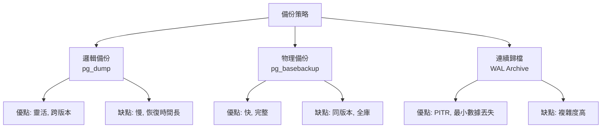
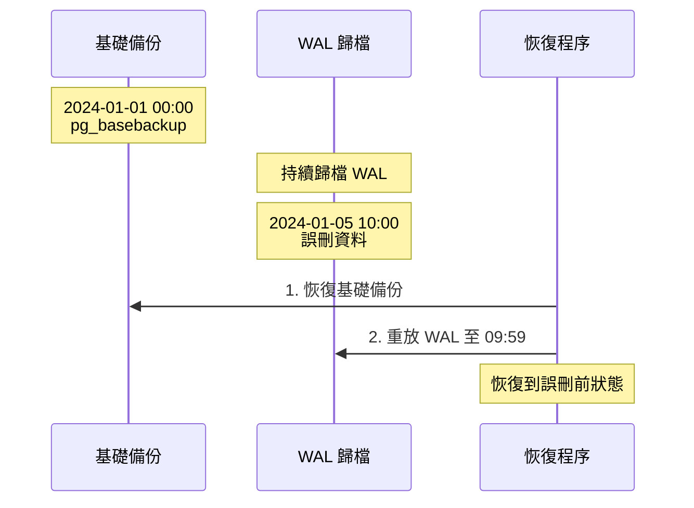
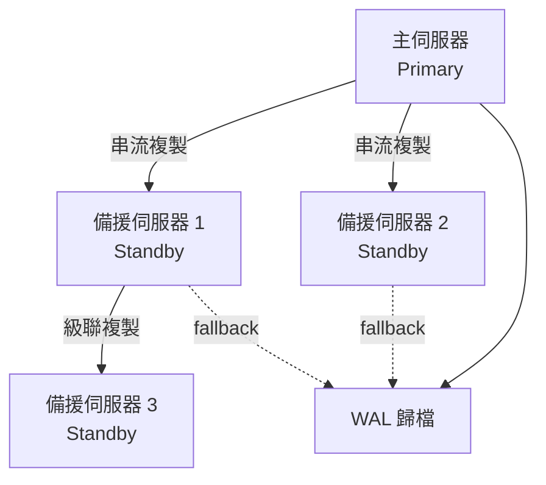
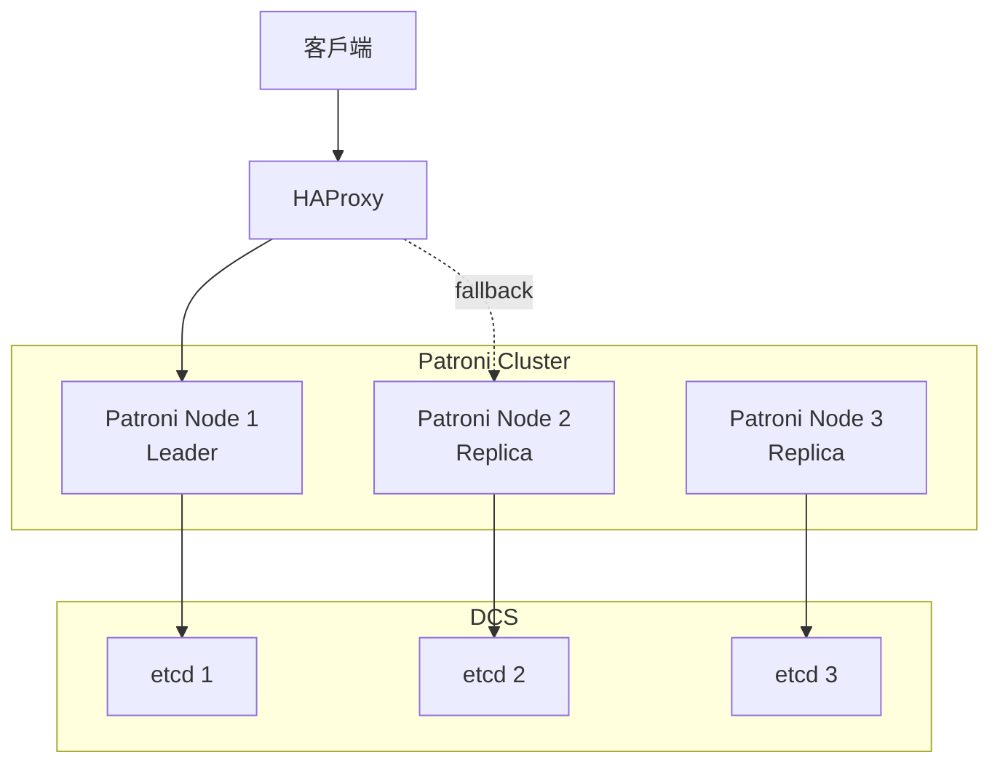
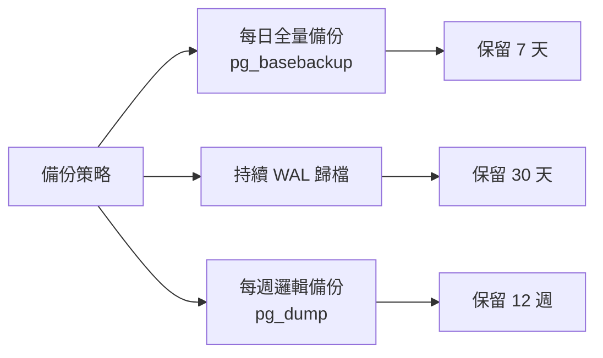

# PostgreSQL 備份恢復與高可用

## 備份策略



## 邏輯備份（pg_dump）

### 基本使用

```bash
# 備份單一資料庫
pg_dump -U postgres -d mydb > mydb_backup.sql

# 備份到自訂格式（推薦，可並行恢復）
pg_dump -U postgres -d mydb -Fc -f mydb_backup.dump

# 備份到目錄格式（可並行備份/恢復）
pg_dump -U postgres -d mydb -Fd -j 4 -f mydb_backup_dir

# 備份到 tar 格式
pg_dump -U postgres -d mydb -Ft -f mydb_backup.tar

# 只備份 schema
pg_dump -U postgres -d mydb --schema-only > schema.sql

# 只備份資料
pg_dump -U postgres -d mydb --data-only > data.sql

# 備份特定表
pg_dump -U postgres -d mydb -t users -t orders > tables_backup.sql

# 排除特定表
pg_dump -U postgres -d mydb --exclude-table=logs > backup_without_logs.sql
```

### 備份整個 Cluster

```bash
# pg_dumpall（包含所有資料庫、使用者、權限）
pg_dumpall -U postgres > cluster_backup.sql

# 只備份全域物件（使用者、角色等）
pg_dumpall -U postgres --globals-only > globals.sql
```

### 恢復邏輯備份

```bash
# 恢復 SQL 格式
psql -U postgres -d mydb < mydb_backup.sql

# 恢復自訂格式
pg_restore -U postgres -d mydb mydb_backup.dump

# 並行恢復
pg_restore -U postgres -d mydb -j 4 mydb_backup.dump

# 恢復前先建立資料庫
createdb -U postgres mydb
pg_restore -U postgres -d mydb mydb_backup.dump

# 恢復特定表
pg_restore -U postgres -d mydb -t users mydb_backup.dump

# 只恢復 schema
pg_restore -U postgres -d mydb --schema-only mydb_backup.dump

# 只恢復資料
pg_restore -U postgres -d mydb --data-only mydb_backup.dump
```

## 物理備份（pg_basebackup）

### 基本使用

```bash
# 基本備份
pg_basebackup -U postgres -D /backup/pgdata -Fp -P

# -D: 備份目錄
# -Fp: plain 格式
# -P: 顯示進度

# tar 格式
pg_basebackup -U postgres -D /backup -Ft -z -P

# 包含 WAL 檔案
pg_basebackup -U postgres -D /backup/pgdata -Fp -Xs -P

# -Xs: stream WAL
# -Xf: fetch WAL
```

### 設定 WAL 歸檔

**postgresql.conf**:
```conf
# 啟用歸檔
wal_level = replica
archive_mode = on
archive_command = 'cp %p /var/lib/postgresql/archive/%f'

# 或使用 rsync
archive_command = 'rsync -a %p backup_server:/archive/%f'

# 歸檔超時
archive_timeout = 300  # 5 分鐘
```

### 恢復物理備份

```bash
# 1. 停止 PostgreSQL
sudo systemctl stop postgresql

# 2. 清空或重新命名資料目錄
mv /var/lib/postgresql/14/main /var/lib/postgresql/14/main.old

# 3. 複製備份
cp -R /backup/pgdata /var/lib/postgresql/14/main

# 4. 建立 recovery.signal（PostgreSQL 12+）
touch /var/lib/postgresql/14/main/recovery.signal

# 5. 設定 postgresql.auto.conf 或 postgresql.conf
restore_command = 'cp /var/lib/postgresql/archive/%f %p'

# 6. 啟動 PostgreSQL
sudo systemctl start postgresql

# 7. 恢復完成後，recovery.signal 會自動刪除
```

## PITR（Point-In-Time Recovery）



### 設定 PITR

```bash
# 1. 建立基礎備份
pg_basebackup -U postgres -D /backup/base -Fp -Xs -P

# 2. 確保 WAL 歸檔正常運作
# 檢查 /var/lib/postgresql/archive/ 是否有 WAL 檔案

# 3. 恢復到特定時間點
# 在 postgresql.conf 或 recovery.conf 設定
restore_command = 'cp /var/lib/postgresql/archive/%f %p'
recovery_target_time = '2024-01-05 09:59:00'
recovery_target_action = 'promote'

# 4. 建立 recovery.signal
touch /var/lib/postgresql/14/main/recovery.signal

# 5. 啟動 PostgreSQL
sudo systemctl start postgresql
```

### 恢復目標選項

```conf
# 恢復到特定時間
recovery_target_time = '2024-01-05 09:59:00'

# 恢復到特定事務 ID
recovery_target_xid = '123456'

# 恢復到特定 WAL 位置
recovery_target_lsn = '0/3000000'

# 恢復到命名的還原點
recovery_target_name = 'before_migration'

# 立即恢復（最近一致性點）
recovery_target = 'immediate'

# 恢復後動作
recovery_target_action = 'promote'  # 提升為主庫
recovery_target_action = 'pause'    # 暫停，可檢查
recovery_target_action = 'shutdown' # 關閉
```

### 建立還原點

```sql
-- 在重要操作前建立還原點
SELECT pg_create_restore_point('before_migration');

-- 恢復時使用
recovery_target_name = 'before_migration'
```

## 複製與高可用

### 串流複製架構



### 設定主伺服器

**postgresql.conf**:
```conf
# 複製設定
wal_level = replica
max_wal_senders = 10
wal_keep_size = 1GB  # PostgreSQL 13+
# wal_keep_segments = 64  # PostgreSQL 12-

# 歸檔（可選，但推薦）
archive_mode = on
archive_command = 'cp %p /var/lib/postgresql/archive/%f'

# 熱備援查詢
hot_standby = on
```

**pg_hba.conf**:
```conf
# 允許複製連線
host    replication     replicator      192.168.1.0/24          md5
```

**建立複製使用者**:
```sql
CREATE ROLE replicator WITH REPLICATION LOGIN PASSWORD 'password';
```

### 設定備援伺服器

```bash
# 1. 從主伺服器建立基礎備份
pg_basebackup -h primary_host -U replicator -D /var/lib/postgresql/14/main -Fp -Xs -P -R

# -R: 自動建立 standby.signal 和設定檔

# 2. standby.signal 已自動建立
# 3. postgresql.auto.conf 已自動設定
primary_conninfo = 'host=primary_host port=5432 user=replicator password=password'

# 4. 啟動備援伺服器
sudo systemctl start postgresql
```

### 檢查複製狀態

**主伺服器**:
```sql
-- 查看複製狀態
SELECT 
    pid,
    usename,
    application_name,
    client_addr,
    state,
    sync_state,
    pg_wal_lsn_diff(pg_current_wal_lsn(), sent_lsn) AS sent_lag,
    pg_wal_lsn_diff(pg_current_wal_lsn(), write_lsn) AS write_lag,
    pg_wal_lsn_diff(pg_current_wal_lsn(), flush_lsn) AS flush_lag,
    pg_wal_lsn_diff(pg_current_wal_lsn(), replay_lsn) AS replay_lag
FROM pg_stat_replication;
```

**備援伺服器**:
```sql
-- 檢查是否在恢復模式
SELECT pg_is_in_recovery();

-- 查看複製延遲
SELECT 
    now() - pg_last_xact_replay_timestamp() AS replication_delay;

-- 查看最後接收的 WAL 位置
SELECT pg_last_wal_receive_lsn(), pg_last_wal_replay_lsn();
```

### 同步複製

**postgresql.conf** (主伺服器):
```conf
# 同步複製
synchronous_commit = on
synchronous_standby_names = 'standby1,standby2'

# 至少一個同步
synchronous_standby_names = 'FIRST 1 (standby1, standby2)'

# 至少兩個同步
synchronous_standby_names = 'FIRST 2 (standby1, standby2, standby3)'

# 任何一個
synchronous_standby_names = 'ANY 1 (standby1, standby2)'
```

**設定備援名稱**:
```conf
# standby 的 postgresql.conf
primary_conninfo = 'host=primary application_name=standby1 ...'
```

### 故障轉移（Failover）

**手動提升備援為主**:
```bash
# 方法 1: pg_ctl
pg_ctl promote -D /var/lib/postgresql/14/main

# 方法 2: SQL
SELECT pg_promote();

# 方法 3: 建立 trigger 檔案（舊版）
touch /var/lib/postgresql/14/main/promote.trigger
```

**自動故障轉移工具**:
- **Patroni**: 推薦，基於 etcd/Consul/Zookeeper
- **repmgr**: 輕量級複製管理
- **Stolon**: Kubernetes 友善
- **pg_auto_failover**: 官方支援

## Patroni 高可用方案

### Patroni 架構



### 安裝 Patroni

```bash
# 安裝 etcd
sudo apt install etcd

# 安裝 Patroni
pip install patroni[etcd]

# 或使用系統套件
sudo apt install patroni
```

### Patroni 設定範例

```yaml
# /etc/patroni/patroni.yml
scope: postgres-cluster
namespace: /db/
name: node1

restapi:
  listen: 0.0.0.0:8008
  connect_address: 192.168.1.10:8008

etcd:
  hosts: 192.168.1.10:2379,192.168.1.11:2379,192.168.1.12:2379

bootstrap:
  dcs:
    ttl: 30
    loop_wait: 10
    retry_timeout: 10
    maximum_lag_on_failover: 1048576
    postgresql:
      use_pg_rewind: true
      parameters:
        max_connections: 100
        shared_buffers: 256MB

  initdb:
    - encoding: UTF8
    - data-checksums

  pg_hba:
    - host replication replicator 0.0.0.0/0 md5
    - host all all 0.0.0.0/0 md5

postgresql:
  listen: 0.0.0.0:5432
  connect_address: 192.168.1.10:5432
  data_dir: /var/lib/postgresql/14/main
  bin_dir: /usr/lib/postgresql/14/bin
  authentication:
    replication:
      username: replicator
      password: password
    superuser:
      username: postgres
      password: postgres
  parameters:
    unix_socket_directories: '/var/run/postgresql'

tags:
  nofailover: false
  noloadbalance: false
  clonefrom: false
```

### 啟動 Patroni

```bash
# 啟動服務
sudo systemctl start patroni
sudo systemctl enable patroni

# 查看狀態
patronictl -c /etc/patroni/patroni.yml list

# 手動故障轉移
patronictl -c /etc/patroni/patroni.yml failover
```

## 備份最佳實踐

### 備份策略建議



### 自動化備份腳本

```bash
#!/bin/bash
# backup.sh

BACKUP_DIR="/backup"
DATE=$(date +%Y%m%d_%H%M%S)
RETENTION_DAYS=7

# 全量備份
pg_basebackup -h localhost -U postgres -D "$BACKUP_DIR/base_$DATE" -Ft -z -P

# 刪除舊備份
find $BACKUP_DIR -name "base_*" -type d -mtime +$RETENTION_DAYS -exec rm -rf {} \;

# 驗證備份
if [ -f "$BACKUP_DIR/base_$DATE/base.tar.gz" ]; then
    echo "Backup successful: $DATE"
else
    echo "Backup failed: $DATE"
    exit 1
fi
```

### Cron 排程

```bash
# 每天凌晨 2 點備份
0 2 * * * /usr/local/bin/backup.sh >> /var/log/pg_backup.log 2>&1
```

## 小結

**備份策略選擇**:
- **小型資料庫**: pg_dump 每日備份
- **中型資料庫**: pg_basebackup + WAL 歸檔
- **大型資料庫**: 持續歸檔 + PITR

**高可用方案**:
- **單機**: WAL 歸檔 + 定期備份
- **讀寫分離**: 主從複製
- **高可用**: Patroni + etcd + HAProxy
- **多區域**: 異步複製 + 自動故障轉移

**關鍵指標**:
- **RPO** (Recovery Point Objective): 可接受的資料丟失時間
- **RTO** (Recovery Time Objective): 可接受的恢復時間
