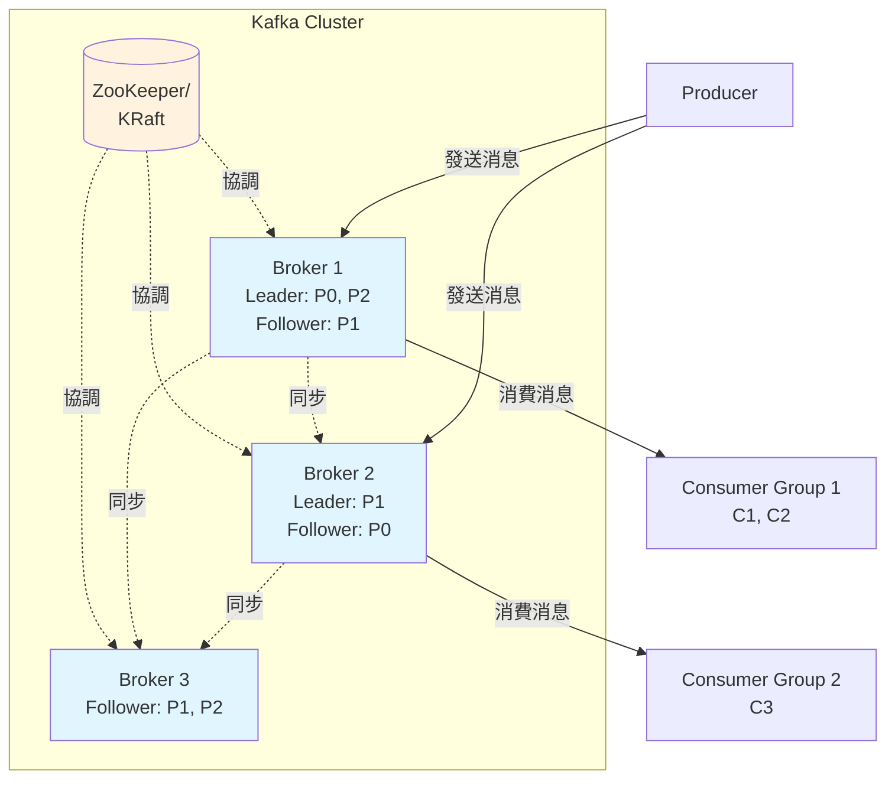
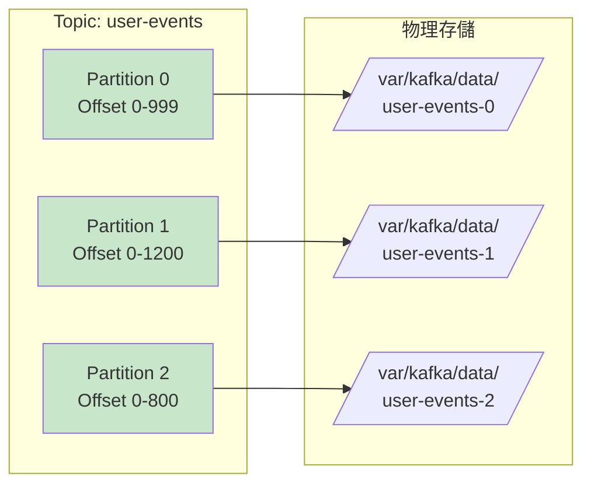
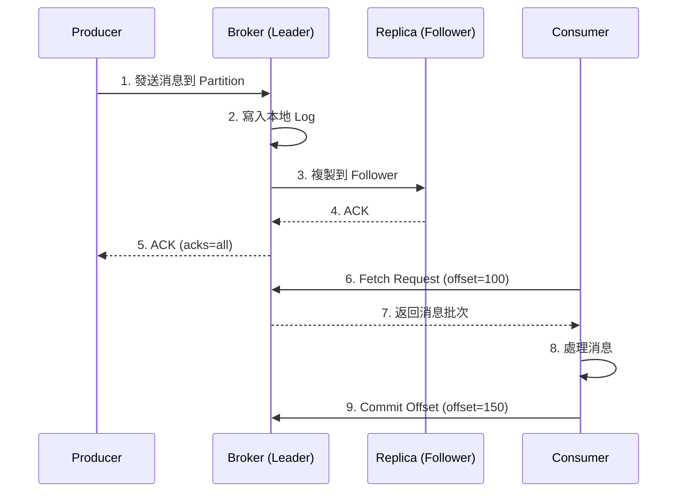

# Kafka 基礎概念與架構

## 什麼是 Kafka

Apache Kafka 是一個分散式串流平台 (Distributed Streaming Platform)，用於構建實時數據管道和串流應用。

**核心特性**:
- 高吞吐量 (High Throughput): 百萬級 msg/sec
- 低延遲 (Low Latency): 毫秒級
- 持久化 (Persistence): 消息持久化到磁碟
- 可擴展性 (Scalability): 水平擴展
- 容錯性 (Fault Tolerance): 數據複製機制

## 核心概念

### 基本術語

| 術語                 | 說明                    |
| ------------------ | --------------------- |
| **Producer**       | 消息生產者，發送消息到 Topic     |
| **Consumer**       | 消息消費者，從 Topic 訂閱並處理消息 |
| **Topic**          | 消息主題，邏輯上的消息分類         |
| **Partition**      | 分區，Topic 的物理分割，實現並行處理 |
| **Offset**         | 偏移量，分區內消息的唯一序號        |
| **Broker**         | Kafka 服務器節點           |
| **Cluster**        | Broker 集群             |
| **Consumer Group** | 消費者組，實現負載均衡           |
| **Replica**        | 副本，數據冗餘備份             |

### Kafka 架構圖



### Topic 與 Partition 結構



## 數據流模型

### 消息發送與消費流程



## Kafka vs 其他 Message Queue

| 特性       | Kafka     | RabbitMQ  | Redis Streams | Pulsar    |
| -------- | --------- | --------- | ------------- | --------- |
| **吞吐量**  | 極高        | 中等        | 高             | 極高        |
| **持久化**  | 磁碟        | 磁碟/內存     | 內存+AOF        | 分層存儲      |
| **消息順序** | 分區內有序     | 隊列有序      | Stream 有序     | 分區內有序     |
| **消費模型** | Pull      | Push/Pull | Pull          | Push/Pull |
| **適用場景** | 大數據、日誌、事件 | 任務隊列、RPC  | 實時數據、緩存       | 統一消息平台    |

## Python 快速開始

### 安裝依賴

```bash
pip install kafka-python
```

### 基礎 Producer

```python
from kafka import KafkaProducer
import json
from datetime import datetime

producer = KafkaProducer(
    bootstrap_servers=['localhost:9092'],
    value_serializer=lambda v: json.dumps(v).encode('utf-8')
)

event = {
    'user_id': 12345,
    'action': 'page_view',
    'timestamp': datetime.now().isoformat()
}

future = producer.send('user-events', value=event)

try:
    record_metadata = future.get(timeout=10)
    print(f"消息發送成功: topic={record_metadata.topic}, "
          f"partition={record_metadata.partition}, "
          f"offset={record_metadata.offset}")
except Exception as e:
    print(f"發送失敗: {e}")
finally:
    producer.close()
```

### 基礎 Consumer

```python
from kafka import KafkaConsumer
import json

consumer = KafkaConsumer(
    'user-events',
    bootstrap_servers=['localhost:9092'],
    auto_offset_reset='earliest',
    enable_auto_commit=True,
    group_id='analytics-group',
    value_deserializer=lambda m: json.loads(m.decode('utf-8'))
)

print("開始消費消息...")
for message in consumer:
    print(f"Partition: {message.partition}, "
          f"Offset: {message.offset}, "
          f"Value: {message.value}")
    
    if message.value['action'] == 'purchase':
        print(f"檢測到購買事件: User {message.value['user_id']}")
```

## Docker 快速部署

```yaml
version: '3.8'
services:
  zookeeper:
    image: confluentinc/cp-zookeeper:latest
    environment:
      ZOOKEEPER_CLIENT_PORT: 2181
    ports:
      - "2181:2181"

  kafka:
    image: confluentinc/cp-kafka:latest
    depends_on:
      - zookeeper
    ports:
      - "9092:9092"
    environment:
      KAFKA_BROKER_ID: 1
      KAFKA_ZOOKEEPER_CONNECT: zookeeper:2181
      KAFKA_ADVERTISED_LISTENERS: PLAINTEXT://localhost:9092
      KAFKA_OFFSETS_TOPIC_REPLICATION_FACTOR: 1
```

啟動命令:
```bash
docker-compose up -d
```

## 關鍵設計決策

### 為什麼選擇 Kafka？

**適合使用 Kafka**:
- ✅ 高吞吐量數據管道 (日誌收集、監控指標)
- ✅ 事件溯源架構 (Event Sourcing)
- ✅ 實時數據流處理 (Kafka Streams, Flink)
- ✅ 微服務間異步通信
- ✅ 需要消息重放 (Replay)

**不適合使用 Kafka**:
- ❌ 簡單的任務隊列 (用 RabbitMQ/SQS)
- ❌ 請求-響應模式 (用 gRPC/REST)
- ❌ 低延遲要求 < 1ms (用 Redis)
- ❌ 小規模應用 (運維成本高)

## 核心保證

1. **順序保證**: 同一分區內的消息嚴格有序
2. **持久化保證**: 消息寫入磁碟，可配置副本數
3. **至少一次交付** (At-least-once): 默認配置
4. **最多一次交付** (At-most-once): 關閉重試
5. **精確一次交付** (Exactly-once): 需啟用事務

## 下一步

- [02-Producer與Consumer開發](./02-Producer與Consumer開發.md): 深入生產者與消費者 API
- [03-分區與複製機制](./03-分區與複製機制.md): 理解分區策略與數據複製
- [04-Broker集群管理](./04-Broker集群管理.md): 集群部署與運維

## 參考資源

- [Kafka 官方文檔](https://kafka.apache.org/documentation/)
- [Confluent 文檔](https://docs.confluent.io/)
- [kafka-python 文檔](https://kafka-python.readthedocs.io/)
