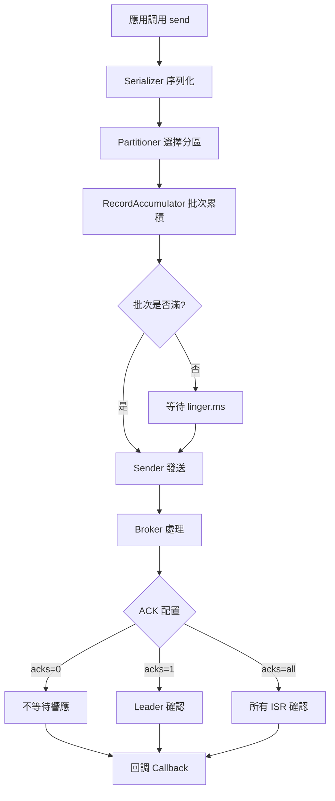
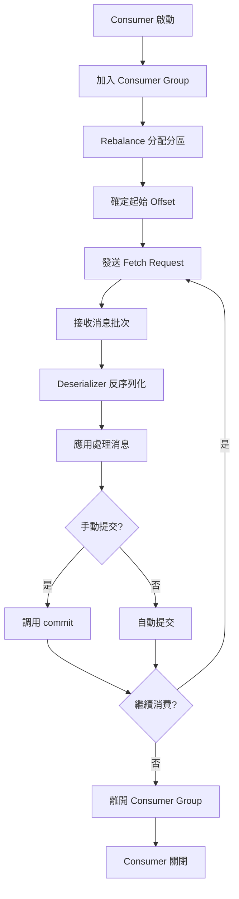
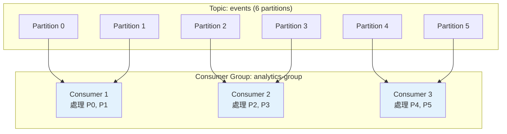

# Producer 與 Consumer 開發

## Producer API 深入

### Producer 工作流程



### Producer 配置參數

#### 核心參數

```python
from kafka import KafkaProducer

producer = KafkaProducer(
    bootstrap_servers=['broker1:9092', 'broker2:9092', 'broker3:9092'],
    
    acks='all',
    retries=3,
    max_in_flight_requests_per_connection=5,
    
    compression_type='snappy',
    
    batch_size=16384,
    linger_ms=10,
    buffer_memory=33554432,
    
    key_serializer=lambda k: k.encode('utf-8') if k else None,
    value_serializer=lambda v: json.dumps(v).encode('utf-8')
)
```

#### 參數說明

| 參數 | 默認值 | 說明 | 建議 |
|------|--------|------|------|
| `acks` | 1 | 0=不等待<br/>1=Leader確認<br/>all=所有ISR確認 | 生產環境用 `all` |
| `retries` | 2147483647 | 失敗重試次數 | 保持默認或設為 3-5 |
| `max_in_flight_requests_per_connection` | 5 | 單連接未確認請求數 | 順序保證時設為 1 |
| `compression_type` | none | 壓縮算法 (gzip/snappy/lz4/zstd) | 高吞吐用 lz4/zstd |
| `batch_size` | 16384 | 批次大小 (bytes) | 高吞吐可增至 32KB-64KB |
| `linger_ms` | 0 | 批次等待時間 (ms) | 高吞吐設 10-100ms |
| `buffer_memory` | 33554432 | 緩衝區大小 (32MB) | 高負載可增至 64MB |

### 分區策略

#### 內建分區器

```python
from kafka import KafkaProducer
from kafka.partitioner import RoundRobinPartitioner, Murmur2Partitioner
import json

producer_round_robin = KafkaProducer(
    bootstrap_servers=['localhost:9092'],
    partitioner=RoundRobinPartitioner(),
    value_serializer=lambda v: json.dumps(v).encode('utf-8')
)

producer_round_robin.send('orders', value={'order_id': 1001})

producer_key_hash = KafkaProducer(
    bootstrap_servers=['localhost:9092'],
    partitioner=Murmur2Partitioner(),
    key_serializer=lambda k: str(k).encode('utf-8'),
    value_serializer=lambda v: json.dumps(v).encode('utf-8')
)

producer_key_hash.send('orders', key='user_123', value={'order_id': 1001})
```

#### 自定義分區器

```python
from kafka.partitioner.default import DefaultPartitioner

class RegionPartitioner:
    def __init__(self):
        self.region_map = {
            'us-east': 0,
            'us-west': 1,
            'eu': 2,
            'asia': 3
        }
    
    def __call__(self, key, all_partitions, available_partitions):
        if key is None:
            return all_partitions[0]
        
        region = key.decode('utf-8') if isinstance(key, bytes) else key
        partition = self.region_map.get(region, 0)
        
        if partition in available_partitions:
            return partition
        return available_partitions[0] if available_partitions else all_partitions[0]

producer = KafkaProducer(
    bootstrap_servers=['localhost:9092'],
    partitioner=RegionPartitioner()
)

producer.send('metrics', key='us-east', value=b'metric_data')
```

### 生產環境 Producer 實現

```python
from kafka import KafkaProducer
from kafka.errors import KafkaError, KafkaTimeoutError
import json
import logging
from typing import Optional, Dict, Any
from datetime import datetime

logging.basicConfig(level=logging.INFO)
logger = logging.getLogger(__name__)

class RobustProducer:
    def __init__(self, bootstrap_servers: list):
        self.producer = KafkaProducer(
            bootstrap_servers=bootstrap_servers,
            acks='all',
            retries=5,
            max_in_flight_requests_per_connection=5,
            compression_type='lz4',
            linger_ms=10,
            batch_size=32768,
            key_serializer=lambda k: k.encode('utf-8') if k else None,
            value_serializer=lambda v: json.dumps(v).encode('utf-8'),
            request_timeout_ms=30000,
            metadata_max_age_ms=300000
        )
        self.success_count = 0
        self.error_count = 0
    
    def send_message(
        self, 
        topic: str, 
        value: Dict[Any, Any], 
        key: Optional[str] = None,
        headers: Optional[list] = None
    ) -> bool:
        try:
            if 'timestamp' not in value:
                value['timestamp'] = datetime.utcnow().isoformat()
            
            future = self.producer.send(
                topic=topic,
                key=key,
                value=value,
                headers=headers
            )
            
            record_metadata = future.get(timeout=30)
            
            self.success_count += 1
            logger.info(
                f"消息發送成功 | Topic: {record_metadata.topic} | "
                f"Partition: {record_metadata.partition} | "
                f"Offset: {record_metadata.offset}"
            )
            return True
            
        except KafkaTimeoutError as e:
            self.error_count += 1
            logger.error(f"發送超時: {e}")
            return False
            
        except KafkaError as e:
            self.error_count += 1
            logger.error(f"Kafka 錯誤: {e}")
            return False
            
        except Exception as e:
            self.error_count += 1
            logger.error(f"未知錯誤: {e}")
            return False
    
    def send_batch(self, topic: str, messages: list) -> Dict[str, int]:
        results = {'success': 0, 'failed': 0}
        
        for msg in messages:
            if self.send_message(topic, msg):
                results['success'] += 1
            else:
                results['failed'] += 1
        
        self.producer.flush()
        return results
    
    def close(self):
        logger.info(
            f"關閉 Producer | 成功: {self.success_count} | 失敗: {self.error_count}"
        )
        self.producer.close()

if __name__ == '__main__':
    producer = RobustProducer(['localhost:9092'])
    
    event = {
        'user_id': 'user_12345',
        'event_type': 'purchase',
        'amount': 99.99,
        'product_id': 'prod_567'
    }
    
    producer.send_message(
        topic='user-events',
        key='user_12345',
        value=event,
        headers=[('source', b'web-app'), ('version', b'1.0')]
    )
    
    producer.close()
```

## Consumer API 深入

### Consumer 工作流程



### Consumer 配置參數

```python
from kafka import KafkaConsumer
import json

consumer = KafkaConsumer(
    'user-events',
    bootstrap_servers=['broker1:9092', 'broker2:9092'],
    
    group_id='analytics-service',
    
    auto_offset_reset='earliest',
    enable_auto_commit=False,
    
    max_poll_records=500,
    max_poll_interval_ms=300000,
    session_timeout_ms=10000,
    heartbeat_interval_ms=3000,
    
    fetch_min_bytes=1,
    fetch_max_wait_ms=500,
    
    key_deserializer=lambda k: k.decode('utf-8') if k else None,
    value_deserializer=lambda v: json.loads(v.decode('utf-8'))
)
```

#### 核心參數說明

| 參數 | 默認值 | 說明 | 建議 |
|------|--------|------|------|
| `group_id` | None | Consumer Group ID | 必須設置 |
| `auto_offset_reset` | latest | earliest=從頭<br/>latest=最新<br/>none=報錯 | 新消費者用 earliest |
| `enable_auto_commit` | True | 是否自動提交 offset | 生產環境建議 False |
| `max_poll_records` | 500 | 單次拉取最大記錄數 | 根據處理速度調整 |
| `max_poll_interval_ms` | 300000 | 兩次 poll 最大間隔 (5分鐘) | 長處理時間需增大 |
| `session_timeout_ms` | 10000 | 會話超時 (10秒) | 網絡不穩定可增至 30s |
| `heartbeat_interval_ms` | 3000 | 心跳間隔 | session_timeout_ms / 3 |

### Consumer Group 與 Rebalance



### Offset 管理策略

#### 自動提交 (Auto Commit)

```python
from kafka import KafkaConsumer

consumer = KafkaConsumer(
    'orders',
    bootstrap_servers=['localhost:9092'],
    group_id='order-processor',
    enable_auto_commit=True,
    auto_commit_interval_ms=5000
)

for message in consumer:
    print(f"處理訂單: {message.value}")
```

**⚠️ 風險**: 消息處理失敗後 offset 已提交，導致消息丟失

#### 手動同步提交 (Manual Sync Commit)

```python
from kafka import KafkaConsumer

consumer = KafkaConsumer(
    'orders',
    bootstrap_servers=['localhost:9092'],
    group_id='order-processor',
    enable_auto_commit=False
)

for message in consumer:
    try:
        process_order(message.value)
        consumer.commit()
    except Exception as e:
        print(f"處理失敗: {e}")
        break
```

#### 手動異步提交 (Manual Async Commit)

```python
from kafka import KafkaConsumer

def commit_callback(offsets, error):
    if error:
        print(f"Commit 失敗: {error}")
    else:
        print(f"Commit 成功: {offsets}")

consumer = KafkaConsumer(
    'orders',
    bootstrap_servers=['localhost:9092'],
    group_id='order-processor',
    enable_auto_commit=False
)

for message in consumer:
    process_order(message.value)
    consumer.commit_async(callback=commit_callback)
```

#### 按分區提交 (Per-Partition Commit)

```python
from kafka import KafkaConsumer, TopicPartition

consumer = KafkaConsumer(
    'orders',
    bootstrap_servers=['localhost:9092'],
    group_id='order-processor',
    enable_auto_commit=False
)

for message in consumer:
    process_order(message.value)
    
    tp = TopicPartition(message.topic, message.partition)
    offset_metadata = {tp: message.offset + 1}
    consumer.commit(offsets=offset_metadata)
```

### 生產環境 Consumer 實現

```python
from kafka import KafkaConsumer, TopicPartition
from kafka.errors import KafkaError
import json
import logging
import signal
import sys
from typing import Callable, List

logging.basicConfig(level=logging.INFO)
logger = logging.getLogger(__name__)

class RobustConsumer:
    def __init__(
        self, 
        topics: List[str], 
        bootstrap_servers: list,
        group_id: str,
        message_handler: Callable
    ):
        self.topics = topics
        self.message_handler = message_handler
        self.running = True
        self.processed_count = 0
        self.error_count = 0
        
        self.consumer = KafkaConsumer(
            *topics,
            bootstrap_servers=bootstrap_servers,
            group_id=group_id,
            enable_auto_commit=False,
            auto_offset_reset='earliest',
            max_poll_records=100,
            max_poll_interval_ms=300000,
            session_timeout_ms=30000,
            heartbeat_interval_ms=10000,
            key_deserializer=lambda k: k.decode('utf-8') if k else None,
            value_deserializer=lambda v: json.loads(v.decode('utf-8')),
            consumer_timeout_ms=1000
        )
        
        signal.signal(signal.SIGINT, self._shutdown)
        signal.signal(signal.SIGTERM, self._shutdown)
    
    def _shutdown(self, signum, frame):
        logger.info("收到關閉信號，正在安全關閉...")
        self.running = False
    
    def start(self):
        logger.info(f"開始消費 topics: {self.topics}")
        
        try:
            while self.running:
                try:
                    messages = self.consumer.poll(timeout_ms=1000, max_records=100)
                    
                    if not messages:
                        continue
                    
                    for topic_partition, records in messages.items():
                        for message in records:
                            try:
                                self.message_handler(message)
                                self.processed_count += 1
                                
                                if self.processed_count % 100 == 0:
                                    logger.info(f"已處理 {self.processed_count} 條消息")
                                
                            except Exception as e:
                                self.error_count += 1
                                logger.error(
                                    f"消息處理失敗 | "
                                    f"Topic: {message.topic} | "
                                    f"Partition: {message.partition} | "
                                    f"Offset: {message.offset} | "
                                    f"錯誤: {e}"
                                )
                                continue
                        
                        tp = TopicPartition(topic_partition.topic, topic_partition.partition)
                        last_offset = records[-1].offset + 1
                        self.consumer.commit({tp: last_offset})
                    
                except KafkaError as e:
                    logger.error(f"Kafka 錯誤: {e}")
                    continue
                    
        finally:
            self.close()
    
    def close(self):
        logger.info(
            f"關閉 Consumer | "
            f"已處理: {self.processed_count} | "
            f"錯誤: {self.error_count}"
        )
        self.consumer.close()

def handle_user_event(message):
    event = message.value
    logger.info(
        f"處理事件 | "
        f"User: {event.get('user_id')} | "
        f"Action: {event.get('action')}"
    )
    
    if event.get('action') == 'purchase':
        logger.info(f"訂單金額: {event.get('amount')}")

if __name__ == '__main__':
    consumer = RobustConsumer(
        topics=['user-events'],
        bootstrap_servers=['localhost:9092'],
        group_id='analytics-service',
        message_handler=handle_user_event
    )
    
    consumer.start()
```

## 高級特性

### 精確一次語義 (Exactly-Once Semantics)

```python
from kafka import KafkaProducer, KafkaConsumer
import json

producer = KafkaProducer(
    bootstrap_servers=['localhost:9092'],
    transactional_id='txn-producer-1',
    enable_idempotence=True,
    acks='all',
    value_serializer=lambda v: json.dumps(v).encode('utf-8')
)

producer.init_transactions()

try:
    producer.begin_transaction()
    
    producer.send('orders', value={'order_id': 1001, 'amount': 99.99})
    producer.send('inventory', value={'product_id': 567, 'delta': -1})
    
    producer.commit_transaction()
    print("事務提交成功")
    
except Exception as e:
    producer.abort_transaction()
    print(f"事務回滾: {e}")
finally:
    producer.close()
```

### 消息過濾與條件消費

```python
from kafka import KafkaConsumer
import json

consumer = KafkaConsumer(
    'user-events',
    bootstrap_servers=['localhost:9092'],
    group_id='vip-processor',
    value_deserializer=lambda v: json.loads(v.decode('utf-8'))
)

for message in consumer:
    event = message.value
    
    if event.get('user_type') == 'VIP' and event.get('amount', 0) > 1000:
        logger.info(f"處理 VIP 大額訂單: {event}")
```

### 暫停與恢復消費

```python
from kafka import KafkaConsumer, TopicPartition
import time

consumer = KafkaConsumer(
    'orders',
    bootstrap_servers=['localhost:9092'],
    group_id='order-processor'
)

partitions = [TopicPartition('orders', p) for p in range(3)]

for i, message in enumerate(consumer):
    print(f"處理消息: {message.value}")
    
    if i == 50:
        consumer.pause(*partitions)
        print("暫停消費 10 秒...")
        time.sleep(10)
        consumer.resume(*partitions)
        print("恢復消費")
```

## 錯誤處理最佳實踐

### Producer 錯誤處理

```python
from kafka import KafkaProducer
from kafka.errors import (
    KafkaTimeoutError,
    MessageSizeTooLargeError,
    RecordTooLargeError
)

def safe_send(producer, topic, message):
    try:
        future = producer.send(topic, message)
        future.get(timeout=10)
        return True
    except KafkaTimeoutError:
        logger.error("發送超時，稍後重試")
        return False
    except MessageSizeTooLargeError:
        logger.error("消息過大，考慮壓縮或拆分")
        return False
    except Exception as e:
        logger.error(f"未知錯誤: {e}")
        return False
```

### Consumer 錯誤處理

```python
def process_with_retry(message, max_retries=3):
    for attempt in range(max_retries):
        try:
            handle_message(message)
            return True
        except Exception as e:
            logger.warning(f"處理失敗 (嘗試 {attempt + 1}/{max_retries}): {e}")
            if attempt < max_retries - 1:
                time.sleep(2 ** attempt)
    
    logger.error(f"消息處理最終失敗，發送到 DLQ")
    send_to_dead_letter_queue(message)
    return False
```

## 下一步

- [03-分區與複製機制](./03-分區與複製機制.md): 深入理解分區與數據複製
- [04-Broker集群管理](./04-Broker集群管理.md): 學習集群部署與運維

## 參考資源

- [kafka-python 文檔](https://kafka-python.readthedocs.io/)
- [Confluent Python Client](https://docs.confluent.io/kafka-clients/python/current/overview.html)
