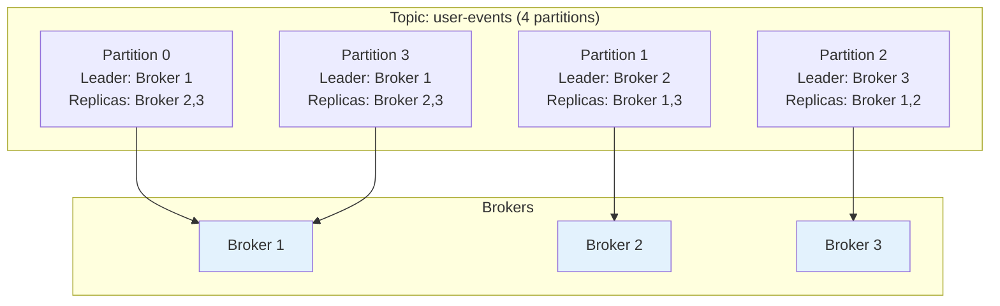
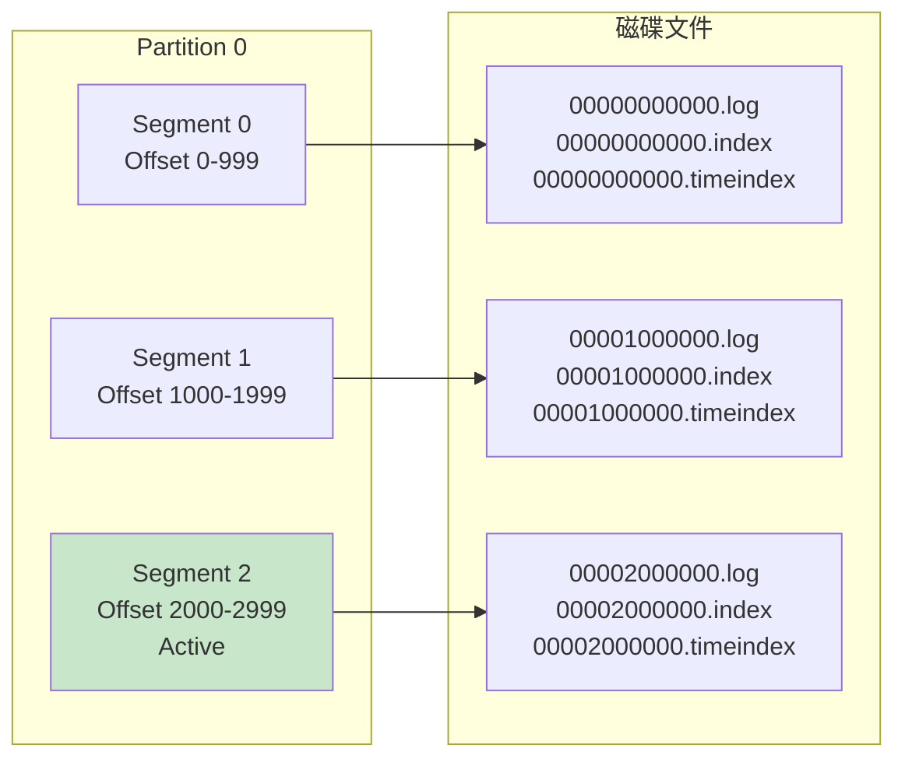
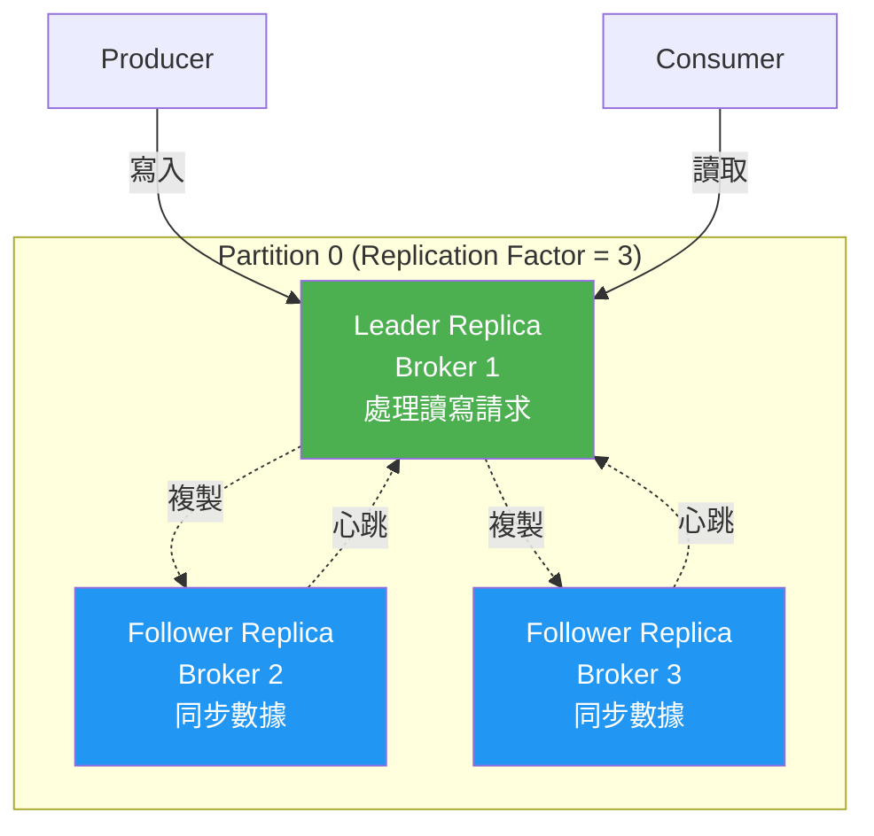
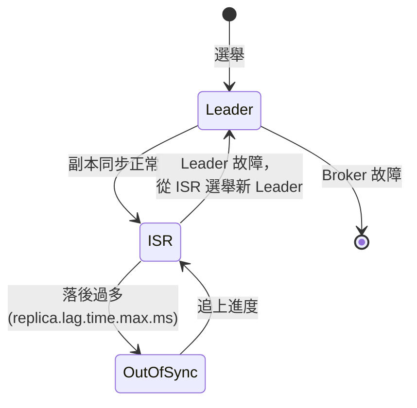
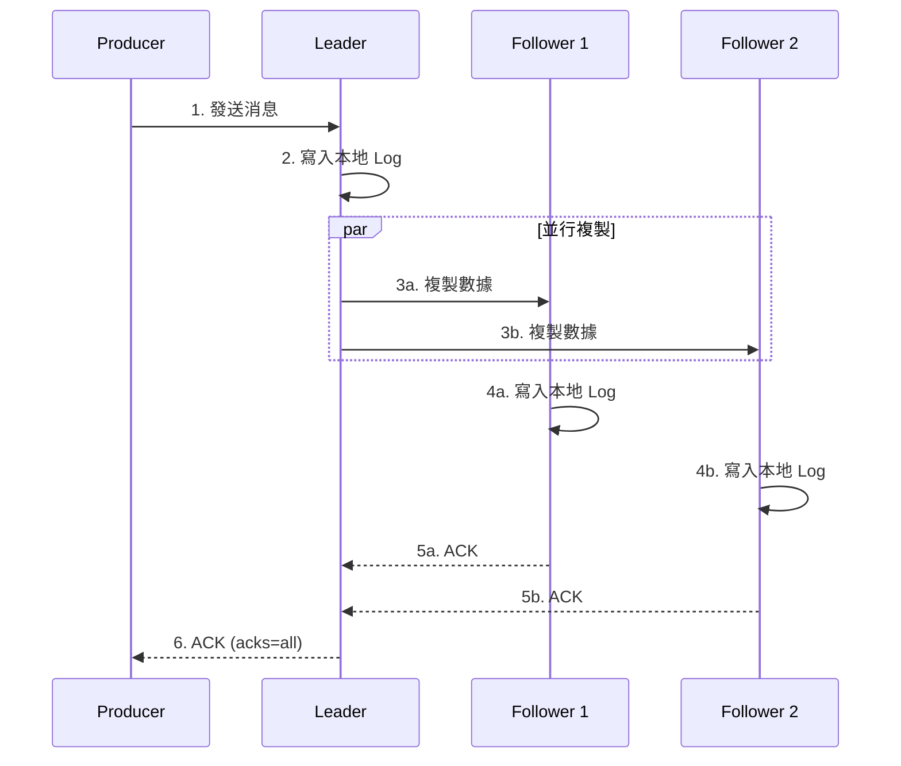
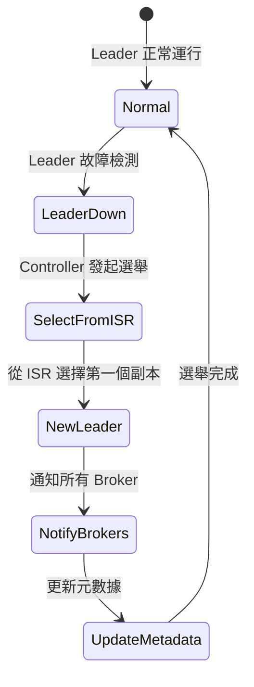
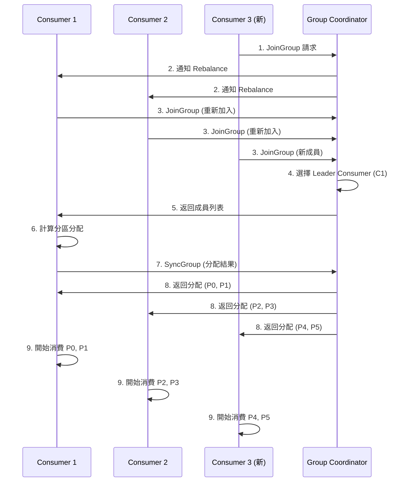

# 分區與複製機制

## 分區 (Partitioning)

### 為什麼需要分區？

1. **並行處理**: 多個 Consumer 同時處理不同分區
2. **水平擴展**: 增加分區數提升吞吐量
3. **負載均衡**: 數據分散到不同 Broker
4. **順序保證**: 單個分區內消息有序

### 分區架構



### 分區內部結構



## 分區策略

### 默認分區器 (Default Partitioner)

```python
from kafka import KafkaProducer
import json

producer = KafkaProducer(
    bootstrap_servers=['localhost:9092'],
    key_serializer=lambda k: k.encode('utf-8') if k else None,
    value_serializer=lambda v: json.dumps(v).encode('utf-8')
)

producer.send('orders', key='user_123', value={'order_id': 1001})

producer.send('logs', value={'level': 'INFO', 'message': 'Server started'})
```

**分區邏輯**:
1. **有 Key**: `hash(key) % num_partitions`
2. **無 Key**: Round-robin 或 Sticky Partitioner

### Key 分區示例

```python
from kafka import KafkaProducer
import json

producer = KafkaProducer(
    bootstrap_servers=['localhost:9092'],
    key_serializer=lambda k: k.encode('utf-8'),
    value_serializer=lambda v: json.dumps(v).encode('utf-8')
)

for user_id in range(1, 11):
    event = {
        'user_id': f'user_{user_id}',
        'action': 'login',
        'timestamp': '2024-01-01T10:00:00Z'
    }
    producer.send('user-events', key=f'user_{user_id}', value=event)

producer.flush()
producer.close()
```

### 自定義分區器 - 按業務規則

```python
from kafka import KafkaProducer
from kafka.partitioner.default import DefaultPartitioner
import hashlib

class BusinessPartitioner:
    def __init__(self):
        self.vip_partition = 0
        self.regular_partition_start = 1
    
    def __call__(self, key, all_partitions, available_partitions):
        if key is None:
            return available_partitions[0] if available_partitions else all_partitions[0]
        
        key_str = key.decode('utf-8') if isinstance(key, bytes) else str(key)
        
        if key_str.startswith('vip_'):
            return self.vip_partition
        
        hash_value = int(hashlib.md5(key_str.encode()).hexdigest(), 16)
        regular_partitions = [p for p in all_partitions if p >= self.regular_partition_start]
        partition_idx = hash_value % len(regular_partitions)
        
        return regular_partitions[partition_idx]

producer = KafkaProducer(
    bootstrap_servers=['localhost:9092'],
    partitioner=BusinessPartitioner(),
    key_serializer=lambda k: k.encode('utf-8'),
    value_serializer=lambda v: json.dumps(v).encode('utf-8')
)

producer.send('orders', key='vip_user_123', value={'order_id': 1001})
producer.send('orders', key='regular_user_456', value={'order_id': 1002})

producer.close()
```

### 手動指定分區

```python
from kafka import KafkaProducer
import json

producer = KafkaProducer(
    bootstrap_servers=['localhost:9092'],
    value_serializer=lambda v: json.dumps(v).encode('utf-8')
)

producer.send('events', value={'type': 'critical'}, partition=0)
producer.send('events', value={'type': 'normal'}, partition=1)

producer.close()
```

## 複製機制 (Replication)

### 副本角色



### ISR (In-Sync Replicas)

**定義**: 與 Leader 保持同步的副本集合



**ISR 條件**:
- 副本在 `replica.lag.time.max.ms` 時間內保持同步
- 默認 10 秒

### 副本配置

#### 創建 Topic 時指定副本數

```bash
kafka-topics.sh --create \
  --bootstrap-server localhost:9092 \
  --topic orders \
  --partitions 6 \
  --replication-factor 3
```

#### Python 管理 Topic

```python
from kafka.admin import KafkaAdminClient, NewTopic

admin_client = KafkaAdminClient(
    bootstrap_servers=['localhost:9092']
)

topic = NewTopic(
    name='user-events',
    num_partitions=6,
    replication_factor=3,
    topic_configs={
        'retention.ms': '86400000',
        'compression.type': 'lz4',
        'min.insync.replicas': '2'
    }
)

admin_client.create_topics(new_topics=[topic], validate_only=False)
admin_client.close()
```

### 數據同步流程



## 一致性保證

### ACK 配置

```python
from kafka import KafkaProducer
import json

producer_acks_0 = KafkaProducer(
    bootstrap_servers=['localhost:9092'],
    acks=0,
    value_serializer=lambda v: json.dumps(v).encode('utf-8')
)

producer_acks_1 = KafkaProducer(
    bootstrap_servers=['localhost:9092'],
    acks=1,
    value_serializer=lambda v: json.dumps(v).encode('utf-8')
)

producer_acks_all = KafkaProducer(
    bootstrap_servers=['localhost:9092'],
    acks='all',
    value_serializer=lambda v: json.dumps(v).encode('utf-8')
)
```

| ACK 級別 | 延遲 | 可靠性 | 數據丟失風險 | 適用場景 |
|---------|------|--------|-------------|---------|
| `acks=0` | 最低 | 最低 | 高 | 日誌收集、指標 |
| `acks=1` | 中等 | 中等 | 中等 (Leader 故障) | 一般業務 |
| `acks=all` | 最高 | 最高 | 極低 | 金融交易、訂單 |

### Min In-Sync Replicas

```python
from kafka.admin import KafkaAdminClient, ConfigResource, ConfigResourceType

admin_client = KafkaAdminClient(bootstrap_servers=['localhost:9092'])

config_resource = ConfigResource(
    ConfigResourceType.TOPIC,
    'orders',
    configs={'min.insync.replicas': '2'}
)

admin_client.alter_configs([config_resource])
```

**保證**:
- `acks=all` + `min.insync.replicas=2`
- 至少 2 個副本確認才返回成功
- ISR < min.insync.replicas 時，Producer 拋出 `NotEnoughReplicasException`

### 可靠性配置組合

```python
producer = KafkaProducer(
    bootstrap_servers=['localhost:9092'],
    acks='all',
    retries=5,
    max_in_flight_requests_per_connection=1,
    enable_idempotence=True,
    value_serializer=lambda v: json.dumps(v).encode('utf-8')
)
```

**配置說明**:
- `acks=all`: 等待所有 ISR 確認
- `retries=5`: 失敗重試 5 次
- `max_in_flight_requests_per_connection=1`: 保證順序
- `enable_idempotence=True`: 防止重複

## Leader 選舉

### 選舉觸發條件

1. Leader Broker 故障
2. Leader 所在 Broker 與 ZooKeeper 斷開
3. 手動觸發 Preferred Leader Election

### 選舉流程



### 查看分區 Leader

```python
from kafka import KafkaAdminClient
from kafka.admin import DescribeTopicsResult

admin_client = KafkaAdminClient(bootstrap_servers=['localhost:9092'])

topics = ['user-events', 'orders']
metadata = admin_client.describe_topics(topics)

for topic_name, topic_metadata in metadata.items():
    print(f"\nTopic: {topic_name}")
    for partition in topic_metadata['partitions']:
        print(f"  Partition {partition['partition']}: "
              f"Leader={partition['leader']}, "
              f"Replicas={partition['replicas']}, "
              f"ISR={partition['isr']}")

admin_client.close()
```

## 分區再平衡 (Rebalancing)

### Rebalance 觸發條件

1. Consumer 加入或離開 Consumer Group
2. Topic 分區數變化
3. Consumer 故障 (超過 `session.timeout.ms`)

### Rebalance 流程



### 分區分配策略

#### Range Assignor (默認)

```python
from kafka import KafkaConsumer

consumer = KafkaConsumer(
    'user-events',
    bootstrap_servers=['localhost:9092'],
    group_id='analytics-group',
    partition_assignment_strategy=['range']
)
```

**分配邏輯**: 按 Topic 分別分配
```
Topic: events (6 partitions), 3 consumers
Consumer 1: P0, P1
Consumer 2: P2, P3
Consumer 3: P4, P5
```

#### Round Robin Assignor

```python
from kafka import KafkaConsumer

consumer = KafkaConsumer(
    'user-events',
    bootstrap_servers=['localhost:9092'],
    group_id='analytics-group',
    partition_assignment_strategy=['roundrobin']
)
```

**分配邏輯**: 所有 Topic 的分區統一輪詢分配

#### Sticky Assignor

```python
from kafka import KafkaConsumer

consumer = KafkaConsumer(
    'user-events',
    bootstrap_servers=['localhost:9092'],
    group_id='analytics-group',
    partition_assignment_strategy=['sticky']
)
```

**優勢**: Rebalance 時盡量保持原有分配，減少狀態遷移

### 監控 Rebalance

```python
from kafka import KafkaConsumer
import logging

logging.basicConfig(level=logging.INFO)
logger = logging.getLogger(__name__)

class RebalanceListener:
    def on_partitions_revoked(self, revoked):
        logger.warning(f"分區被撤銷: {revoked}")
    
    def on_partitions_assigned(self, assigned):
        logger.info(f"分區被分配: {assigned}")

consumer = KafkaConsumer(
    'user-events',
    bootstrap_servers=['localhost:9092'],
    group_id='analytics-group'
)

consumer.subscribe(['user-events'], listener=RebalanceListener())

for message in consumer:
    print(f"處理消息: {message.value}")
```

## 實戰案例

### 案例 1: 保證消息順序的電商訂單系統

```python
from kafka import KafkaProducer
import json
import hashlib

class OrderProducer:
    def __init__(self, bootstrap_servers):
        self.producer = KafkaProducer(
            bootstrap_servers=bootstrap_servers,
            key_serializer=lambda k: k.encode('utf-8'),
            value_serializer=lambda v: json.dumps(v).encode('utf-8'),
            acks='all',
            max_in_flight_requests_per_connection=1,
            enable_idempotence=True
        )
    
    def send_order_event(self, order_id, user_id, event_type, data):
        key = f"user_{user_id}"
        
        event = {
            'order_id': order_id,
            'user_id': user_id,
            'event_type': event_type,
            'data': data
        }
        
        self.producer.send('orders', key=key, value=event)
        print(f"訂單事件已發送: {event_type} for order {order_id}")
    
    def close(self):
        self.producer.flush()
        self.producer.close()

producer = OrderProducer(['localhost:9092'])

producer.send_order_event(1001, 123, 'created', {'amount': 99.99})
producer.send_order_event(1001, 123, 'paid', {'payment_method': 'credit_card'})
producer.send_order_event(1001, 123, 'shipped', {'tracking_number': 'TRACK123'})
producer.send_order_event(1001, 123, 'delivered', {'signature': 'John Doe'})

producer.close()
```

### 案例 2: 高可用日誌收集系統

```python
from kafka import KafkaProducer
import json
import logging
from datetime import datetime

class LogShipper:
    def __init__(self, bootstrap_servers, app_name):
        self.app_name = app_name
        self.producer = KafkaProducer(
            bootstrap_servers=bootstrap_servers,
            value_serializer=lambda v: json.dumps(v).encode('utf-8'),
            acks=1,
            compression_type='lz4',
            batch_size=32768,
            linger_ms=50
        )
    
    def ship_log(self, level, message, **kwargs):
        log_entry = {
            'timestamp': datetime.utcnow().isoformat(),
            'app': self.app_name,
            'level': level,
            'message': message,
            **kwargs
        }
        
        self.producer.send('app-logs', value=log_entry)
    
    def close(self):
        self.producer.close()

shipper = LogShipper(['localhost:9092'], 'payment-service')

shipper.ship_log('INFO', 'Service started', version='1.2.3')
shipper.ship_log('ERROR', 'Payment failed', order_id=1001, reason='Insufficient funds')

shipper.close()
```

### 案例 3: 處理熱點 Key 的解決方案

```python
from kafka import KafkaProducer
import hashlib
import json

class HotKeyPartitioner:
    def __init__(self, hot_keys, hot_key_partitions):
        self.hot_keys = set(hot_keys)
        self.hot_key_partitions = hot_key_partitions
        self.regular_partition_start = len(hot_key_partitions)
    
    def __call__(self, key, all_partitions, available_partitions):
        if key is None:
            return available_partitions[0]
        
        key_str = key.decode('utf-8') if isinstance(key, bytes) else str(key)
        
        if key_str in self.hot_keys:
            hash_value = int(hashlib.md5(key_str.encode()).hexdigest(), 16)
            partition_idx = hash_value % len(self.hot_key_partitions)
            return self.hot_key_partitions[partition_idx]
        
        regular_partitions = [p for p in all_partitions if p >= self.regular_partition_start]
        hash_value = int(hashlib.md5(key_str.encode()).hexdigest(), 16)
        partition_idx = hash_value % len(regular_partitions)
        return regular_partitions[partition_idx]

producer = KafkaProducer(
    bootstrap_servers=['localhost:9092'],
    partitioner=HotKeyPartitioner(
        hot_keys=['celebrity_user_1', 'celebrity_user_2'],
        hot_key_partitions=[0, 1, 2]
    ),
    key_serializer=lambda k: k.encode('utf-8'),
    value_serializer=lambda v: json.dumps(v).encode('utf-8')
)

producer.send('user-events', key='celebrity_user_1', value={'action': 'post'})
producer.send('user-events', key='regular_user_100', value={'action': 'post'})

producer.close()
```

## 最佳實踐

### 分區數量設計

```python
import math

def calculate_partitions(target_throughput_mb, partition_throughput_mb=10):
    return math.ceil(target_throughput_mb / partition_throughput_mb)

target_throughput = 100
partition_count = calculate_partitions(target_throughput)
print(f"建議分區數: {partition_count}")
```

**考慮因素**:
- 目標吞吐量
- 單個分區的吞吐能力 (通常 10-30 MB/s)
- Consumer 並行度需求
- 避免過多分區 (單 Broker 建議 < 4000)

### 副本數量設計

| 副本數 | 可用性 | 成本 | 適用場景 |
|-------|--------|------|---------|
| 1 | 低 | 1x | 開發/測試 |
| 2 | 中 | 2x | 非關鍵業務 |
| 3 | 高 | 3x | **生產環境推薦** |
| 5+ | 極高 | 5x+ | 金融、核心業務 |

### 配置建議

```python
from kafka.admin import KafkaAdminClient, NewTopic

admin_client = KafkaAdminClient(bootstrap_servers=['localhost:9092'])

topic = NewTopic(
    name='critical-orders',
    num_partitions=12,
    replication_factor=3,
    topic_configs={
        'min.insync.replicas': '2',
        'retention.ms': '604800000',
        'compression.type': 'lz4',
        'max.message.bytes': '1048576'
    }
)

admin_client.create_topics([topic])
admin_client.close()
```

## 下一步

- [04-Broker集群管理](./04-Broker集群管理.md): 學習集群部署與故障處理
- [05-效能調優與監控](./05-效能調優與監控.md): 深入效能優化

## 參考資源

- [Kafka Replication Design](https://kafka.apache.org/documentation/#replication)
- [Partitioning Best Practices](https://www.confluent.io/blog/how-choose-number-topics-partitions-kafka-cluster/)
