# Broker 集群管理

## Kafka 集群架構

### 集群組成

```mermaid
graph TB
    subgraph "Kafka Cluster"
        B1[Broker 1<br/>ID: 1<br/>Role: Controller]
        B2[Broker 2<br/>ID: 2]
        B3[Broker 3<br/>ID: 3]
    end
    
    subgraph "ZooKeeper Ensemble"
        Z1[ZK Node 1]
        Z2[ZK Node 2]
        Z3[ZK Node 3]
    end
    
    B1 <--> Z1
    B2 <--> Z2
    B3 <--> Z3
    
    B1 -.複製.-> B2
    B2 -.複製.-> B3
    B1 -.複製.-> B3
    
    style B1 fill:#4caf50,color:#fff
    style B2 fill:#2196f3,color:#fff
    style B3 fill:#2196f3,color:#fff
    style Z1 fill:#ff9800,color:#fff
    style Z2 fill:#ff9800,color:#fff
    style Z3 fill:#ff9800,color:#fff
```



### Controller 角色

**職責**:
- 管理分區 Leader 選舉
- 監控 Broker 狀態變化
- 維護集群元數據
- 分區重分配 (Partition Reassignment)

```mermaid
sequenceDiagram
    participant B1 as Broker 1 (Controller)
    participant B2 as Broker 2
    participant B3 as Broker 3
    participant ZK as ZooKeeper
    
    B2->>ZK: 心跳超時
    ZK->>B1: 通知 Broker 2 下線
    B1->>B1: 觸發 Leader 選舉
    B1->>B3: 更新元數據 (B3 成為新 Leader)
    B1->>ZK: 更新集群狀態
    B3->>B3: 開始處理讀寫請求
```



## ZooKeeper vs KRaft

### ZooKeeper 模式 (傳統)

**優點**:
- 成熟穩定
- 廣泛使用

**缺點**:
- 額外運維成本
- 集群擴展受限
- 恢復時間較長

### KRaft 模式 (Kafka 3.0+)

**優點**:
- 移除 ZooKeeper 依賴
- 更快的故障恢復
- 支持百萬級分區
- 簡化運維

**架構**:


## 集群部署

### Docker Compose 部署 (開發環境)

```yaml
version: '3.8'

services:
  zookeeper:
    image: confluentinc/cp-zookeeper:7.5.0
    hostname: zookeeper
    container_name: zookeeper
    ports:
      - "2181:2181"
    environment:
      ZOOKEEPER_CLIENT_PORT: 2181
      ZOOKEEPER_TICK_TIME: 2000
    volumes:
      - zk-data:/var/lib/zookeeper/data
      - zk-logs:/var/lib/zookeeper/log

  broker-1:
    image: confluentinc/cp-kafka:7.5.0
    hostname: broker-1
    container_name: broker-1
    depends_on:
      - zookeeper
    ports:
      - "9092:9092"
    environment:
      KAFKA_BROKER_ID: 1
      KAFKA_ZOOKEEPER_CONNECT: 'zookeeper:2181'
      KAFKA_LISTENER_SECURITY_PROTOCOL_MAP: PLAINTEXT:PLAINTEXT,PLAINTEXT_HOST:PLAINTEXT
      KAFKA_ADVERTISED_LISTENERS: PLAINTEXT://broker-1:29092,PLAINTEXT_HOST://localhost:9092
      KAFKA_OFFSETS_TOPIC_REPLICATION_FACTOR: 3
      KAFKA_TRANSACTION_STATE_LOG_MIN_ISR: 2
      KAFKA_TRANSACTION_STATE_LOG_REPLICATION_FACTOR: 3
      KAFKA_GROUP_INITIAL_REBALANCE_DELAY_MS: 0
      KAFKA_AUTO_CREATE_TOPICS_ENABLE: "false"
      KAFKA_LOG_RETENTION_HOURS: 168
    volumes:
      - broker-1-data:/var/lib/kafka/data

  broker-2:
    image: confluentinc/cp-kafka:7.5.0
    hostname: broker-2
    container_name: broker-2
    depends_on:
      - zookeeper
    ports:
      - "9093:9093"
    environment:
      KAFKA_BROKER_ID: 2
      KAFKA_ZOOKEEPER_CONNECT: 'zookeeper:2181'
      KAFKA_LISTENER_SECURITY_PROTOCOL_MAP: PLAINTEXT:PLAINTEXT,PLAINTEXT_HOST:PLAINTEXT
      KAFKA_ADVERTISED_LISTENERS: PLAINTEXT://broker-2:29093,PLAINTEXT_HOST://localhost:9093
      KAFKA_OFFSETS_TOPIC_REPLICATION_FACTOR: 3
      KAFKA_TRANSACTION_STATE_LOG_MIN_ISR: 2
      KAFKA_TRANSACTION_STATE_LOG_REPLICATION_FACTOR: 3
      KAFKA_GROUP_INITIAL_REBALANCE_DELAY_MS: 0
      KAFKA_AUTO_CREATE_TOPICS_ENABLE: "false"
    volumes:
      - broker-2-data:/var/lib/kafka/data

  broker-3:
    image: confluentinc/cp-kafka:7.5.0
    hostname: broker-3
    container_name: broker-3
    depends_on:
      - zookeeper
    ports:
      - "9094:9094"
    environment:
      KAFKA_BROKER_ID: 3
      KAFKA_ZOOKEEPER_CONNECT: 'zookeeper:2181'
      KAFKA_LISTENER_SECURITY_PROTOCOL_MAP: PLAINTEXT:PLAINTEXT,PLAINTEXT_HOST:PLAINTEXT
      KAFKA_ADVERTISED_LISTENERS: PLAINTEXT://broker-3:29094,PLAINTEXT_HOST://localhost:9094
      KAFKA_OFFSETS_TOPIC_REPLICATION_FACTOR: 3
      KAFKA_TRANSACTION_STATE_LOG_MIN_ISR: 2
      KAFKA_TRANSACTION_STATE_LOG_REPLICATION_FACTOR: 3
      KAFKA_GROUP_INITIAL_REBALANCE_DELAY_MS: 0
      KAFKA_AUTO_CREATE_TOPICS_ENABLE: "false"
    volumes:
      - broker-3-data:/var/lib/kafka/data

volumes:
  zk-data:
  zk-logs:
  broker-1-data:
  broker-2-data:
  broker-3-data:
```

啟動集群:
```bash
docker-compose up -d
```

### KRaft 模式部署

```yaml
version: '3.8'

services:
  kafka-1:
    image: confluentinc/cp-kafka:7.5.0
    hostname: kafka-1
    container_name: kafka-1
    ports:
      - "9092:9092"
    environment:
      KAFKA_NODE_ID: 1
      KAFKA_PROCESS_ROLES: 'broker,controller'
      KAFKA_CONTROLLER_QUORUM_VOTERS: '1@kafka-1:29093,2@kafka-2:29093,3@kafka-3:29093'
      KAFKA_LISTENERS: 'PLAINTEXT://kafka-1:29092,CONTROLLER://kafka-1:29093,PLAINTEXT_HOST://0.0.0.0:9092'
      KAFKA_ADVERTISED_LISTENERS: 'PLAINTEXT://kafka-1:29092,PLAINTEXT_HOST://localhost:9092'
      KAFKA_LISTENER_SECURITY_PROTOCOL_MAP: 'CONTROLLER:PLAINTEXT,PLAINTEXT:PLAINTEXT,PLAINTEXT_HOST:PLAINTEXT'
      KAFKA_CONTROLLER_LISTENER_NAMES: 'CONTROLLER'
      KAFKA_OFFSETS_TOPIC_REPLICATION_FACTOR: 3
      KAFKA_TRANSACTION_STATE_LOG_REPLICATION_FACTOR: 3
      KAFKA_TRANSACTION_STATE_LOG_MIN_ISR: 2
      KAFKA_LOG_DIRS: '/var/lib/kafka/data'
      CLUSTER_ID: 'MkU3OEVBNTcwNTJENDM2Qk'
    volumes:
      - kafka-1-data:/var/lib/kafka/data

  kafka-2:
    image: confluentinc/cp-kafka:7.5.0
    hostname: kafka-2
    container_name: kafka-2
    ports:
      - "9093:9093"
    environment:
      KAFKA_NODE_ID: 2
      KAFKA_PROCESS_ROLES: 'broker,controller'
      KAFKA_CONTROLLER_QUORUM_VOTERS: '1@kafka-1:29093,2@kafka-2:29093,3@kafka-3:29093'
      KAFKA_LISTENERS: 'PLAINTEXT://kafka-2:29092,CONTROLLER://kafka-2:29093,PLAINTEXT_HOST://0.0.0.0:9093'
      KAFKA_ADVERTISED_LISTENERS: 'PLAINTEXT://kafka-2:29092,PLAINTEXT_HOST://localhost:9093'
      KAFKA_LISTENER_SECURITY_PROTOCOL_MAP: 'CONTROLLER:PLAINTEXT,PLAINTEXT:PLAINTEXT,PLAINTEXT_HOST:PLAINTEXT'
      KAFKA_CONTROLLER_LISTENER_NAMES: 'CONTROLLER'
      KAFKA_OFFSETS_TOPIC_REPLICATION_FACTOR: 3
      KAFKA_TRANSACTION_STATE_LOG_REPLICATION_FACTOR: 3
      KAFKA_TRANSACTION_STATE_LOG_MIN_ISR: 2
      KAFKA_LOG_DIRS: '/var/lib/kafka/data'
      CLUSTER_ID: 'MkU3OEVBNTcwNTJENDM2Qk'
    volumes:
      - kafka-2-data:/var/lib/kafka/data

  kafka-3:
    image: confluentinc/cp-kafka:7.5.0
    hostname: kafka-3
    container_name: kafka-3
    ports:
      - "9094:9094"
    environment:
      KAFKA_NODE_ID: 3
      KAFKA_PROCESS_ROLES: 'broker,controller'
      KAFKA_CONTROLLER_QUORUM_VOTERS: '1@kafka-1:29093,2@kafka-2:29093,3@kafka-3:29093'
      KAFKA_LISTENERS: 'PLAINTEXT://kafka-3:29092,CONTROLLER://kafka-3:29093,PLAINTEXT_HOST://0.0.0.0:9094'
      KAFKA_ADVERTISED_LISTENERS: 'PLAINTEXT://kafka-3:29092,PLAINTEXT_HOST://localhost:9094'
      KAFKA_LISTENER_SECURITY_PROTOCOL_MAP: 'CONTROLLER:PLAINTEXT,PLAINTEXT:PLAINTEXT,PLAINTEXT_HOST:PLAINTEXT'
      KAFKA_CONTROLLER_LISTENER_NAMES: 'CONTROLLER'
      KAFKA_OFFSETS_TOPIC_REPLICATION_FACTOR: 3
      KAFKA_TRANSACTION_STATE_LOG_REPLICATION_FACTOR: 3
      KAFKA_TRANSACTION_STATE_LOG_MIN_ISR: 2
      KAFKA_LOG_DIRS: '/var/lib/kafka/data'
      CLUSTER_ID: 'MkU3OEVBNTcwNTJENDM2Qk'
    volumes:
      - kafka-3-data:/var/lib/kafka/data

volumes:
  kafka-1-data:
  kafka-2-data:
  kafka-3-data:
```

## 集群管理 Python API

### 查看集群信息

```python
from kafka import KafkaAdminClient, KafkaConsumer
from kafka.admin import ConfigResource, ConfigResourceType
import json

class KafkaClusterManager:
    def __init__(self, bootstrap_servers):
        self.admin_client = KafkaAdminClient(
            bootstrap_servers=bootstrap_servers,
            client_id='cluster-manager'
        )
    
    def list_brokers(self):
        metadata = self.admin_client._client.cluster
        brokers = metadata.brokers()
        
        print("=== Broker 列表 ===")
        for broker in brokers:
            print(f"Broker ID: {broker.nodeId}, "
                  f"Host: {broker.host}, "
                  f"Port: {broker.port}")
        return brokers
    
    def describe_cluster(self):
        metadata = self.admin_client._client.cluster
        
        print(f"=== 集群信息 ===")
        print(f"Cluster ID: {metadata.cluster_id()}")
        print(f"Controller ID: {metadata.controller().nodeId if metadata.controller() else 'Unknown'}")
        print(f"Broker 數量: {len(list(metadata.brokers()))}")
        print(f"Topic 數量: {len(metadata.topics())}")
    
    def list_topics(self):
        topics = self.admin_client.list_topics()
        
        print(f"\n=== Topic 列表 ({len(topics)} 個) ===")
        for topic in sorted(topics):
            if not topic.startswith('__'):
                print(f"  - {topic}")
        return topics
    
    def describe_topic(self, topic_name):
        metadata = self.admin_client.describe_topics([topic_name])
        topic_info = metadata[topic_name]
        
        print(f"\n=== Topic: {topic_name} ===")
        print(f"分區數: {len(topic_info['partitions'])}")
        
        for partition in topic_info['partitions']:
            print(f"\nPartition {partition['partition']}:")
            print(f"  Leader: Broker {partition['leader']}")
            print(f"  Replicas: {partition['replicas']}")
            print(f"  ISR: {partition['isr']}")
    
    def get_broker_config(self, broker_id):
        resource = ConfigResource(ConfigResourceType.BROKER, str(broker_id))
        configs = self.admin_client.describe_configs([resource])
        
        print(f"\n=== Broker {broker_id} 配置 ===")
        for config in configs[resource]:
            if not config[1].is_default:
                print(f"{config[0]}: {config[1].value}")
    
    def close(self):
        self.admin_client.close()

if __name__ == '__main__':
    manager = KafkaClusterManager(['localhost:9092'])
    
    manager.describe_cluster()
    manager.list_brokers()
    manager.list_topics()
    manager.describe_topic('user-events')
    manager.get_broker_config(1)
    
    manager.close()
```

### 創建和管理 Topic

```python
from kafka.admin import KafkaAdminClient, NewTopic, ConfigResource, ConfigResourceType
from kafka.errors import TopicAlreadyExistsError, UnknownTopicOrPartitionError

class TopicManager:
    def __init__(self, bootstrap_servers):
        self.admin_client = KafkaAdminClient(
            bootstrap_servers=bootstrap_servers,
            client_id='topic-manager'
        )
    
    def create_topic(self, name, num_partitions=6, replication_factor=3, config=None):
        topic = NewTopic(
            name=name,
            num_partitions=num_partitions,
            replication_factor=replication_factor,
            topic_configs=config or {}
        )
        
        try:
            result = self.admin_client.create_topics([topic], validate_only=False)
            print(f"Topic '{name}' 創建成功")
            return True
        except TopicAlreadyExistsError:
            print(f"Topic '{name}' 已存在")
            return False
        except Exception as e:
            print(f"創建失敗: {e}")
            return False
    
    def delete_topic(self, name):
        try:
            self.admin_client.delete_topics([name])
            print(f"Topic '{name}' 刪除成功")
            return True
        except UnknownTopicOrPartitionError:
            print(f"Topic '{name}' 不存在")
            return False
        except Exception as e:
            print(f"刪除失敗: {e}")
            return False
    
    def update_topic_config(self, topic_name, configs):
        resource = ConfigResource(ConfigResourceType.TOPIC, topic_name, configs=configs)
        
        try:
            self.admin_client.alter_configs([resource])
            print(f"Topic '{topic_name}' 配置更新成功")
            return True
        except Exception as e:
            print(f"更新失敗: {e}")
            return False
    
    def create_partitions(self, topic_name, new_total_count):
        topic_partitions = {topic_name: new_total_count}
        
        try:
            self.admin_client.create_partitions(topic_partitions)
            print(f"Topic '{topic_name}' 分區數增加到 {new_total_count}")
            return True
        except Exception as e:
            print(f"增加分區失敗: {e}")
            return False
    
    def close(self):
        self.admin_client.close()

if __name__ == '__main__':
    manager = TopicManager(['localhost:9092'])
    
    manager.create_topic(
        name='user-events',
        num_partitions=12,
        replication_factor=3,
        config={
            'retention.ms': '604800000',
            'compression.type': 'lz4',
            'min.insync.replicas': '2',
            'max.message.bytes': '1048576'
        }
    )
    
    manager.update_topic_config(
        'user-events',
        {'retention.ms': '86400000'}
    )
    
    manager.create_partitions('user-events', 18)
    
    manager.close()
```

## 故障處理與恢復

### Broker 故障恢復流程

```mermaid
flowchart TB
    A[Broker 故障] --> B{是否為 Controller?}
    B -->|是| C[重新選舉 Controller]
    B -->|否| D[檢測分區 Leader]
    
    C --> E[新 Controller 接管]
    E --> D
    
    D --> F{Leader 在故障 Broker?}
    F -->|是| G[從 ISR 選舉新 Leader]
    F -->|否| H[無影響]
    
    G --> I[更新元數據]
    I --> J[通知所有 Broker]
    J --> K[Producer/Consumer 重連]
    
    H --> L[繼續服務]
    K --> L
```



### 常見故障排查

#### 1. Broker 無法啟動

```python
import subprocess
import json

def check_broker_logs(container_name='broker-1'):
    try:
        result = subprocess.run(
            ['docker', 'logs', '--tail', '50', container_name],
            capture_output=True,
            text=True
        )
        
        logs = result.stdout
        
        if 'java.net.BindException' in logs:
            print("❌ 端口已被占用")
        elif 'org.apache.zookeeper.KeeperException$NodeExistsException' in logs:
            print("❌ ZooKeeper 節點衝突")
        elif 'LEADER_NOT_AVAILABLE' in logs:
            print("⚠️  Leader 選舉中")
        else:
            print("✅ 沒有發現明顯錯誤")
        
        return logs
    except Exception as e:
        print(f"無法檢查日誌: {e}")

check_broker_logs('broker-1')
```

#### 2. Under-Replicated Partitions (URP)

```python
from kafka import KafkaAdminClient

def find_under_replicated_partitions(bootstrap_servers):
    admin_client = KafkaAdminClient(bootstrap_servers=bootstrap_servers)
    
    topics = admin_client.list_topics()
    under_replicated = []
    
    for topic in topics:
        if topic.startswith('__'):
            continue
        
        metadata = admin_client.describe_topics([topic])
        topic_info = metadata[topic]
        
        for partition in topic_info['partitions']:
            replicas = set(partition['replicas'])
            isr = set(partition['isr'])
            
            if replicas != isr:
                under_replicated.append({
                    'topic': topic,
                    'partition': partition['partition'],
                    'leader': partition['leader'],
                    'replicas': partition['replicas'],
                    'isr': partition['isr'],
                    'missing': list(replicas - isr)
                })
    
    print(f"=== Under-Replicated Partitions ({len(under_replicated)}) ===")
    for urp in under_replicated:
        print(f"\nTopic: {urp['topic']}, Partition: {urp['partition']}")
        print(f"  Leader: {urp['leader']}")
        print(f"  Replicas: {urp['replicas']}")
        print(f"  ISR: {urp['isr']}")
        print(f"  ❌ Missing: {urp['missing']}")
    
    admin_client.close()
    return under_replicated

find_under_replicated_partitions(['localhost:9092'])
```

#### 3. Consumer Lag 監控

```python
from kafka import KafkaAdminClient, KafkaConsumer
from kafka.structs import TopicPartition

def check_consumer_lag(bootstrap_servers, group_id):
    admin_client = KafkaAdminClient(bootstrap_servers=bootstrap_servers)
    
    consumer = KafkaConsumer(
        bootstrap_servers=bootstrap_servers,
        group_id=group_id,
        enable_auto_commit=False
    )
    
    group_offsets = admin_client.list_consumer_group_offsets(group_id)
    
    print(f"=== Consumer Group: {group_id} ===\n")
    
    total_lag = 0
    for tp, offset_metadata in group_offsets.items():
        current_offset = offset_metadata.offset
        
        consumer.assign([tp])
        consumer.seek_to_end(tp)
        end_offset = consumer.position(tp)
        
        lag = end_offset - current_offset
        total_lag += lag
        
        if lag > 0:
            print(f"Topic: {tp.topic}, Partition: {tp.partition}")
            print(f"  Current Offset: {current_offset}")
            print(f"  End Offset: {end_offset}")
            print(f"  ⚠️  Lag: {lag}\n")
    
    print(f"總延遲: {total_lag} 條消息")
    
    consumer.close()
    admin_client.close()
    
    return total_lag

check_consumer_lag(['localhost:9092'], 'analytics-group')
```

### 數據備份與恢復

```python
from kafka import KafkaConsumer, KafkaProducer
import json
from datetime import datetime

class TopicBackup:
    def __init__(self, bootstrap_servers):
        self.bootstrap_servers = bootstrap_servers
    
    def backup_topic(self, topic, output_file):
        consumer = KafkaConsumer(
            topic,
            bootstrap_servers=self.bootstrap_servers,
            auto_offset_reset='earliest',
            enable_auto_commit=False,
            value_deserializer=lambda m: m.decode('utf-8', errors='ignore')
        )
        
        messages = []
        count = 0
        
        print(f"開始備份 Topic: {topic}")
        
        for message in consumer:
            messages.append({
                'partition': message.partition,
                'offset': message.offset,
                'timestamp': message.timestamp,
                'key': message.key.decode('utf-8') if message.key else None,
                'value': message.value
            })
            count += 1
            
            if count % 1000 == 0:
                print(f"已備份 {count} 條消息...")
        
        with open(output_file, 'w', encoding='utf-8') as f:
            json.dump({
                'topic': topic,
                'backup_time': datetime.now().isoformat(),
                'message_count': len(messages),
                'messages': messages
            }, f, ensure_ascii=False, indent=2)
        
        print(f"✅ 備份完成: {count} 條消息 -> {output_file}")
        consumer.close()
    
    def restore_topic(self, input_file, target_topic=None):
        with open(input_file, 'r', encoding='utf-8') as f:
            backup_data = json.load(f)
        
        topic = target_topic or backup_data['topic']
        messages = backup_data['messages']
        
        producer = KafkaProducer(
            bootstrap_servers=self.bootstrap_servers,
            key_serializer=lambda k: k.encode('utf-8') if k else None,
            value_serializer=lambda v: v.encode('utf-8') if isinstance(v, str) else v
        )
        
        print(f"開始恢復到 Topic: {topic}")
        
        for i, msg in enumerate(messages):
            producer.send(
                topic,
                key=msg['key'],
                value=msg['value'],
                partition=msg['partition']
            )
            
            if (i + 1) % 1000 == 0:
                print(f"已恢復 {i + 1} 條消息...")
        
        producer.flush()
        producer.close()
        
        print(f"✅ 恢復完成: {len(messages)} 條消息")

if __name__ == '__main__':
    backup = TopicBackup(['localhost:9092'])
    
    backup.backup_topic('user-events', 'user-events-backup.json')
    
    backup.restore_topic('user-events-backup.json', 'user-events-restored')
```

## 集群擴容與縮容

### 添加新 Broker

```python
from kafka.admin import KafkaAdminClient, NewPartitions
import json

def add_broker_reassign_partitions(admin_client, topic_name):
    metadata = admin_client.describe_topics([topic_name])
    topic_info = metadata[topic_name]
    
    print(f"Topic '{topic_name}' 當前分區分佈:")
    for partition in topic_info['partitions']:
        print(f"  Partition {partition['partition']}: Replicas={partition['replicas']}")
    
    print("\n⚠️  需要使用 kafka-reassign-partitions.sh 工具進行分區重分配")
    print("示例命令:")
    print("""
    kafka-reassign-partitions.sh \\
      --bootstrap-server localhost:9092 \\
      --topics-to-move-json-file topics.json \\
      --broker-list "1,2,3,4" \\
      --generate
    """)

admin_client = KafkaAdminClient(bootstrap_servers=['localhost:9092'])
add_broker_reassign_partitions(admin_client, 'user-events')
admin_client.close()
```

### 安全下線 Broker

```bash
kafka-configs.sh --bootstrap-server localhost:9092 \
  --entity-type brokers \
  --entity-name 3 \
  --alter \
  --add-config follower.replication.throttled.rate=10485760

kafka-reassign-partitions.sh \
  --bootstrap-server localhost:9092 \
  --reassignment-json-file reassignment.json \
  --execute
```

## 核心配置參數

### Broker 配置

```properties
broker.id=1

log.dirs=/var/lib/kafka/data

num.network.threads=8
num.io.threads=8
socket.send.buffer.bytes=102400
socket.receive.buffer.bytes=102400
socket.request.max.bytes=104857600

num.partitions=6
default.replication.factor=3
min.insync.replicas=2

log.retention.hours=168
log.segment.bytes=1073741824
log.retention.check.interval.ms=300000

zookeeper.connect=localhost:2181
zookeeper.connection.timeout.ms=18000

auto.create.topics.enable=false
delete.topic.enable=true

compression.type=producer
```

## 最佳實踐

### 1. 集群規模規劃

| 場景 | Broker 數量 | 副本因子 | 分區數 |
|------|------------|---------|--------|
| 開發/測試 | 1-3 | 1-2 | 3-6 |
| 小型生產 | 3-5 | 3 | 6-12 |
| 中型生產 | 5-10 | 3 | 12-24 |
| 大型生產 | 10+ | 3 | 24+ |

### 2. 監控指標

```python
from kafka import KafkaAdminClient
import time

def monitor_cluster_health(bootstrap_servers):
    admin_client = KafkaAdminClient(bootstrap_servers=bootstrap_servers)
    
    while True:
        metadata = admin_client._client.cluster
        
        brokers = list(metadata.brokers())
        topics = metadata.topics()
        
        print(f"\n=== {time.strftime('%Y-%m-%d %H:%M:%S')} ===")
        print(f"✅ Active Brokers: {len(brokers)}")
        print(f"📊 Total Topics: {len([t for t in topics if not t.startswith('__')])}")
        
        time.sleep(30)

monitor_cluster_health(['localhost:9092'])
```

### 3. 定期巡檢腳本

```python
from kafka import KafkaAdminClient
from datetime import datetime

def cluster_health_check(bootstrap_servers):
    admin_client = KafkaAdminClient(bootstrap_servers=bootstrap_servers)
    
    report = {
        'timestamp': datetime.now().isoformat(),
        'issues': []
    }
    
    topics = admin_client.list_topics()
    
    for topic in topics:
        if topic.startswith('__'):
            continue
        
        metadata = admin_client.describe_topics([topic])
        topic_info = metadata[topic]
        
        for partition in topic_info['partitions']:
            if partition['leader'] == -1:
                report['issues'].append({
                    'type': 'NO_LEADER',
                    'topic': topic,
                    'partition': partition['partition']
                })
            
            replicas = set(partition['replicas'])
            isr = set(partition['isr'])
            
            if replicas != isr:
                report['issues'].append({
                    'type': 'UNDER_REPLICATED',
                    'topic': topic,
                    'partition': partition['partition'],
                    'missing_replicas': list(replicas - isr)
                })
    
    print(f"=== 集群健康檢查報告 ===")
    print(f"檢查時間: {report['timestamp']}")
    print(f"發現問題: {len(report['issues'])} 個\n")
    
    for issue in report['issues']:
        print(f"❌ {issue['type']}")
        print(f"   Topic: {issue['topic']}, Partition: {issue['partition']}")
        if 'missing_replicas' in issue:
            print(f"   Missing Replicas: {issue['missing_replicas']}")
        print()
    
    admin_client.close()
    return report

cluster_health_check(['localhost:9092'])
```

## 下一步

- [05-效能調優與監控](./05-效能調優與監控.md): 學習效能優化技巧
- [06-實戰案例與最佳實踐](./06-實戰案例與最佳實踐.md): 生產環境實戰經驗

## 參考資源

- [Kafka Operations Guide](https://kafka.apache.org/documentation/#operations)
- [KRaft Documentation](https://kafka.apache.org/documentation/#kraft)
