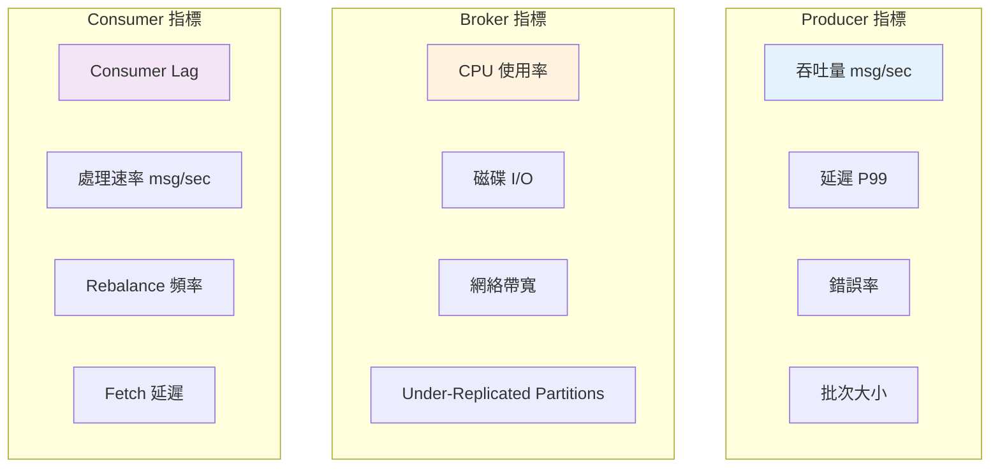

# 效能調優與監控

## 效能指標體系

### 關鍵指標 (Key Metrics)



### 黃金指標 (Golden Metrics)

| 指標類別 | 指標名稱 | 正常範圍 | 告警閾值 |
|---------|---------|---------|---------|
| **延遲** | Producer P99 延遲 | < 100ms | > 500ms |
| **延遲** | Consumer Lag | < 1000 | > 10000 |
| **流量** | 吞吐量 | 依業務 | 下降 50% |
| **錯誤** | 錯誤率 | < 0.1% | > 1% |
| **飽和度** | CPU 使用率 | < 70% | > 85% |
| **飽和度** | 磁碟使用率 | < 80% | > 90% |

## Producer 效能調優

### 吞吐量優化

```python
from kafka import KafkaProducer
import json
import time

producer_high_throughput = KafkaProducer(
    bootstrap_servers=['localhost:9092'],
    acks=1,
    compression_type='lz4',
    batch_size=65536,
    linger_ms=100,
    buffer_memory=67108864,
    max_in_flight_requests_per_connection=5,
    value_serializer=lambda v: json.dumps(v).encode('utf-8')
)

def benchmark_producer(producer, message_count=10000):
    start_time = time.time()
    
    for i in range(message_count):
        producer.send('benchmark-topic', value={'id': i, 'data': 'x' * 100})
    
    producer.flush()
    
    elapsed = time.time() - start_time
    throughput = message_count / elapsed
    
    print(f"發送 {message_count} 條消息")
    print(f"耗時: {elapsed:.2f} 秒")
    print(f"吞吐量: {throughput:.2f} msg/sec")
    
    return throughput

benchmark_producer(producer_high_throughput)
producer_high_throughput.close()
```

### 延遲優化

```python
from kafka import KafkaProducer
import json

producer_low_latency = KafkaProducer(
    bootstrap_servers=['localhost:9092'],
    acks=1,
    compression_type='none',
    batch_size=16384,
    linger_ms=0,
    max_in_flight_requests_per_connection=1,
    value_serializer=lambda v: json.dumps(v).encode('utf-8')
)
```

### 配置對比

| 配置參數 | 高吞吐量 | 低延遲 | 高可靠性 |
|---------|---------|--------|---------|
| `acks` | 1 | 1 | all |
| `compression_type` | lz4/zstd | none | lz4 |
| `batch_size` | 64KB-128KB | 16KB | 32KB |
| `linger_ms` | 50-100 | 0 | 10 |
| `buffer_memory` | 64MB | 32MB | 64MB |
| `max_in_flight_requests_per_connection` | 5 | 1 | 1 |

### Producer 效能監控

```python
from kafka import KafkaProducer
from kafka.metrics import MetricName
import json
import time
from collections import defaultdict

class MonitoredProducer:
    def __init__(self, bootstrap_servers):
        self.producer = KafkaProducer(
            bootstrap_servers=bootstrap_servers,
            value_serializer=lambda v: json.dumps(v).encode('utf-8'),
            metrics_sample_window_ms=30000
        )
        self.send_count = 0
        self.error_count = 0
        self.total_latency = 0
    
    def send_with_monitoring(self, topic, value, callback=None):
        start_time = time.time()
        
        def wrapped_callback(metadata, exception):
            latency = (time.time() - start_time) * 1000
            self.total_latency += latency
            
            if exception:
                self.error_count += 1
                print(f"❌ 發送失敗: {exception}")
            else:
                self.send_count += 1
            
            if callback:
                callback(metadata, exception)
        
        future = self.producer.send(topic, value=value)
        future.add_callback(lambda metadata: wrapped_callback(metadata, None))
        future.add_errback(lambda exception: wrapped_callback(None, exception))
    
    def get_metrics(self):
        metrics = self.producer.metrics()
        
        important_metrics = {}
        
        for metric_name, metric_value in metrics.items():
            if metric_name.name in [
                'record-send-rate',
                'record-error-rate',
                'request-latency-avg',
                'record-queue-time-avg',
                'compression-rate-avg'
            ]:
                important_metrics[metric_name.name] = metric_value
        
        return important_metrics
    
    def print_stats(self):
        avg_latency = self.total_latency / self.send_count if self.send_count > 0 else 0
        error_rate = (self.error_count / (self.send_count + self.error_count) * 100) if (self.send_count + self.error_count) > 0 else 0
        
        print(f"\n=== Producer 統計 ===")
        print(f"成功發送: {self.send_count}")
        print(f"失敗: {self.error_count}")
        print(f"錯誤率: {error_rate:.2f}%")
        print(f"平均延遲: {avg_latency:.2f} ms")
        
        metrics = self.get_metrics()
        print(f"\n=== Kafka Metrics ===")
        for name, value in metrics.items():
            print(f"{name}: {value:.2f}")
    
    def close(self):
        self.producer.close()

if __name__ == '__main__':
    producer = MonitoredProducer(['localhost:9092'])
    
    for i in range(1000):
        producer.send_with_monitoring('benchmark-topic', {'id': i})
    
    producer.producer.flush()
    time.sleep(2)
    
    producer.print_stats()
    producer.close()
```

## Consumer 效能調優

### 吞吐量優化

```python
from kafka import KafkaConsumer
import json
import time

consumer_high_throughput = KafkaConsumer(
    'benchmark-topic',
    bootstrap_servers=['localhost:9092'],
    group_id='benchmark-group',
    enable_auto_commit=True,
    auto_commit_interval_ms=1000,
    max_poll_records=500,
    fetch_min_bytes=50000,
    fetch_max_wait_ms=500,
    value_deserializer=lambda v: json.loads(v.decode('utf-8'))
)

def benchmark_consumer(consumer, duration_seconds=30):
    start_time = time.time()
    message_count = 0
    
    while time.time() - start_time < duration_seconds:
        messages = consumer.poll(timeout_ms=1000, max_records=500)
        
        for topic_partition, records in messages.items():
            message_count += len(records)
    
    elapsed = time.time() - start_time
    throughput = message_count / elapsed
    
    print(f"消費 {message_count} 條消息")
    print(f"耗時: {elapsed:.2f} 秒")
    print(f"吞吐量: {throughput:.2f} msg/sec")
    
    consumer.close()
    return throughput

benchmark_consumer(consumer_high_throughput)
```

### 並行消費優化

```python
from kafka import KafkaConsumer, TopicPartition
import multiprocessing
import json

def consume_partition(partition_id, topic, bootstrap_servers):
    consumer = KafkaConsumer(
        bootstrap_servers=bootstrap_servers,
        group_id=f'parallel-consumer-{partition_id}',
        value_deserializer=lambda v: json.loads(v.decode('utf-8'))
    )
    
    tp = TopicPartition(topic, partition_id)
    consumer.assign([tp])
    
    print(f"Worker {partition_id} 開始消費 Partition {partition_id}")
    
    for message in consumer:
        process_message(message.value)
        
        if message.offset % 100 == 0:
            print(f"Worker {partition_id}: Offset {message.offset}")

def process_message(message):
    pass

def parallel_consume(topic, num_partitions, bootstrap_servers):
    processes = []
    
    for partition_id in range(num_partitions):
        p = multiprocessing.Process(
            target=consume_partition,
            args=(partition_id, topic, bootstrap_servers)
        )
        p.start()
        processes.append(p)
    
    for p in processes:
        p.join()

if __name__ == '__main__':
    parallel_consume('user-events', 6, ['localhost:9092'])
```

### Consumer Lag 監控

```python
from kafka import KafkaConsumer, KafkaAdminClient
from kafka.structs import TopicPartition
import time

class ConsumerLagMonitor:
    def __init__(self, bootstrap_servers, group_id):
        self.bootstrap_servers = bootstrap_servers
        self.group_id = group_id
        self.admin_client = KafkaAdminClient(bootstrap_servers=bootstrap_servers)
    
    def get_lag(self):
        consumer = KafkaConsumer(
            bootstrap_servers=self.bootstrap_servers,
            group_id=self.group_id,
            enable_auto_commit=False
        )
        
        try:
            group_offsets = self.admin_client.list_consumer_group_offsets(self.group_id)
        except Exception as e:
            print(f"無法獲取 Consumer Group 信息: {e}")
            consumer.close()
            return {}
        
        lag_info = {}
        
        for tp, offset_metadata in group_offsets.items():
            current_offset = offset_metadata.offset
            
            consumer.assign([tp])
            consumer.seek_to_end(tp)
            end_offset = consumer.position(tp)
            
            lag = end_offset - current_offset
            
            lag_info[f"{tp.topic}-{tp.partition}"] = {
                'current_offset': current_offset,
                'end_offset': end_offset,
                'lag': lag
            }
        
        consumer.close()
        return lag_info
    
    def monitor(self, interval_seconds=10):
        while True:
            lag_info = self.get_lag()
            
            print(f"\n=== Consumer Lag Report ({time.strftime('%H:%M:%S')}) ===")
            
            total_lag = 0
            max_lag = 0
            
            for partition, info in sorted(lag_info.items()):
                lag = info['lag']
                total_lag += lag
                max_lag = max(max_lag, lag)
                
                if lag > 1000:
                    print(f"⚠️  {partition}: Lag = {lag}")
                else:
                    print(f"✅ {partition}: Lag = {lag}")
            
            print(f"\n總延遲: {total_lag}, 最大延遲: {max_lag}")
            
            time.sleep(interval_seconds)
    
    def close(self):
        self.admin_client.close()

if __name__ == '__main__':
    monitor = ConsumerLagMonitor(['localhost:9092'], 'analytics-group')
    monitor.monitor(interval_seconds=30)
```

## Broker 效能調優

### JVM 調優

```bash
export KAFKA_HEAP_OPTS="-Xms6g -Xmx6g"
export KAFKA_JVM_PERFORMANCE_OPTS="-XX:+UseG1GC -XX:MaxGCPauseMillis=20 -XX:InitiatingHeapOccupancyPercent=35 -XX:G1HeapRegionSize=16M -XX:MinMetaspaceFreeRatio=50 -XX:MaxMetaspaceFreeRatio=80"
```

**推薦配置**:
- Heap: 6GB (不超過 8GB)
- GC: G1GC
- Page Cache: 留給 OS 使用

### 磁碟優化

```python
import subprocess
import json

def check_disk_performance():
    print("=== 磁碟效能檢查 ===\n")
    
    result = subprocess.run(
        ['df', '-h'],
        capture_output=True,
        text=True
    )
    print("磁碟使用情況:")
    print(result.stdout)
    
    result = subprocess.run(
        ['iostat', '-x', '1', '5'],
        capture_output=True,
        text=True
    )
    print("\n磁碟 I/O 統計:")
    print(result.stdout)

check_disk_performance()
```

**優化建議**:
- 使用 SSD (NVMe 更佳)
- RAID 10 配置
- 調整 `num.io.threads` (CPU 核心數)
- 啟用 `log.flush.interval.messages` (謹慎使用)

### 網絡優化

```properties
socket.send.buffer.bytes=1048576
socket.receive.buffer.bytes=1048576
socket.request.max.bytes=104857600

num.network.threads=8
queued.max.requests=500
```

**Linux 內核調優**:
```bash
sysctl -w net.core.rmem_max=134217728
sysctl -w net.core.wmem_max=134217728
sysctl -w net.ipv4.tcp_rmem='4096 87380 134217728'
sysctl -w net.ipv4.tcp_wmem='4096 65536 134217728'
```

## 監控系統搭建

### Prometheus + Grafana

#### 1. JMX Exporter 配置

```yaml
version: '3.8'

services:
  kafka:
    image: confluentinc/cp-kafka:7.5.0
    environment:
      KAFKA_OPTS: "-javaagent:/opt/jmx-exporter/jmx_prometheus_javaagent.jar=7071:/opt/jmx-exporter/kafka-broker.yml"
    volumes:
      - ./jmx-exporter:/opt/jmx-exporter
    ports:
      - "9092:9092"
      - "7071:7071"
  
  prometheus:
    image: prom/prometheus:latest
    volumes:
      - ./prometheus.yml:/etc/prometheus/prometheus.yml
    ports:
      - "9090:9090"
  
  grafana:
    image: grafana/grafana:latest
    ports:
      - "3000:3000"
    environment:
      GF_SECURITY_ADMIN_PASSWORD: admin
```

#### 2. Prometheus 配置

```yaml
global:
  scrape_interval: 15s

scrape_configs:
  - job_name: 'kafka-broker'
    static_configs:
      - targets: ['kafka:7071']
        labels:
          instance: 'broker-1'
```

#### 3. 關鍵指標查詢

```python
import requests
import json
from datetime import datetime

class PrometheusQuery:
    def __init__(self, prometheus_url='http://localhost:9090'):
        self.url = prometheus_url
    
    def query(self, promql):
        response = requests.get(
            f"{self.url}/api/v1/query",
            params={'query': promql}
        )
        return response.json()
    
    def get_broker_metrics(self):
        metrics = {
            'messages_in_per_sec': self.query('rate(kafka_server_brokertopicmetrics_messagesin_total[5m])'),
            'bytes_in_per_sec': self.query('rate(kafka_server_brokertopicmetrics_bytesin_total[5m])'),
            'bytes_out_per_sec': self.query('rate(kafka_server_brokertopicmetrics_bytesout_total[5m])'),
            'under_replicated_partitions': self.query('kafka_server_replicamanager_underreplicatedpartitions'),
            'offline_partitions': self.query('kafka_controller_kafkacontroller_offlinepartitionscount')
        }
        
        print("=== Broker 指標 ===")
        for name, result in metrics.items():
            if result['data']['result']:
                value = result['data']['result'][0]['value'][1]
                print(f"{name}: {value}")

prom = PrometheusQuery()
prom.get_broker_metrics()
```

### Python 監控腳本

```python
from kafka import KafkaAdminClient
from kafka.metrics import MetricName
import psutil
import time
from datetime import datetime

class KafkaMonitor:
    def __init__(self, bootstrap_servers):
        self.admin_client = KafkaAdminClient(bootstrap_servers=bootstrap_servers)
    
    def check_system_resources(self):
        cpu_percent = psutil.cpu_percent(interval=1)
        memory = psutil.virtual_memory()
        disk = psutil.disk_usage('/')
        
        print(f"\n=== 系統資源 ({datetime.now().strftime('%H:%M:%S')}) ===")
        print(f"CPU: {cpu_percent}%")
        print(f"內存: {memory.percent}% (Used: {memory.used / (1024**3):.2f} GB)")
        print(f"磁碟: {disk.percent}% (Used: {disk.used / (1024**3):.2f} GB)")
        
        alerts = []
        if cpu_percent > 85:
            alerts.append(f"⚠️  CPU 使用率過高: {cpu_percent}%")
        if memory.percent > 85:
            alerts.append(f"⚠️  內存使用率過高: {memory.percent}%")
        if disk.percent > 90:
            alerts.append(f"❌ 磁碟使用率危險: {disk.percent}%")
        
        return alerts
    
    def check_cluster_health(self):
        metadata = self.admin_client._client.cluster
        
        brokers = list(metadata.brokers())
        topics = [t for t in metadata.topics() if not t.startswith('__')]
        
        print(f"\n=== 集群健康 ===")
        print(f"Active Brokers: {len(brokers)}")
        print(f"Total Topics: {len(topics)}")
        
        alerts = []
        if len(brokers) < 3:
            alerts.append(f"⚠️  Broker 數量不足: {len(brokers)}")
        
        return alerts
    
    def check_under_replicated_partitions(self):
        topics = [t for t in self.admin_client.list_topics() if not t.startswith('__')]
        
        urp_count = 0
        
        for topic in topics:
            metadata = self.admin_client.describe_topics([topic])
            topic_info = metadata[topic]
            
            for partition in topic_info['partitions']:
                if set(partition['replicas']) != set(partition['isr']):
                    urp_count += 1
        
        print(f"\n=== 副本狀態 ===")
        print(f"Under-Replicated Partitions: {urp_count}")
        
        alerts = []
        if urp_count > 0:
            alerts.append(f"⚠️  發現 {urp_count} 個 Under-Replicated Partitions")
        
        return alerts
    
    def run_monitoring(self, interval_seconds=30):
        while True:
            all_alerts = []
            
            all_alerts.extend(self.check_system_resources())
            all_alerts.extend(self.check_cluster_health())
            all_alerts.extend(self.check_under_replicated_partitions())
            
            if all_alerts:
                print(f"\n{'='*50}")
                print("🚨 告警列表:")
                for alert in all_alerts:
                    print(f"  {alert}")
                print(f"{'='*50}\n")
            else:
                print(f"\n✅ 系統運行正常\n")
            
            time.sleep(interval_seconds)
    
    def close(self):
        self.admin_client.close()

if __name__ == '__main__':
    monitor = KafkaMonitor(['localhost:9092'])
    
    try:
        monitor.run_monitoring(interval_seconds=30)
    except KeyboardInterrupt:
        print("\n停止監控")
        monitor.close()
```

## 效能測試工具

### kafka-producer-perf-test

```bash
kafka-producer-perf-test \
  --topic benchmark-topic \
  --num-records 1000000 \
  --record-size 1024 \
  --throughput -1 \
  --producer-props \
    bootstrap.servers=localhost:9092 \
    acks=1 \
    compression.type=lz4 \
    batch.size=65536 \
    linger.ms=10
```

### Python 性能測試

```python
from kafka import KafkaProducer, KafkaConsumer
import json
import time
import statistics
from concurrent.futures import ThreadPoolExecutor

class PerformanceTester:
    def __init__(self, bootstrap_servers):
        self.bootstrap_servers = bootstrap_servers
    
    def producer_latency_test(self, topic, message_count=1000):
        producer = KafkaProducer(
            bootstrap_servers=self.bootstrap_servers,
            acks='all',
            value_serializer=lambda v: json.dumps(v).encode('utf-8')
        )
        
        latencies = []
        
        for i in range(message_count):
            start = time.time()
            
            future = producer.send(topic, value={'id': i, 'timestamp': start})
            future.get()
            
            latency = (time.time() - start) * 1000
            latencies.append(latency)
        
        producer.close()
        
        print(f"\n=== Producer 延遲測試 ({message_count} 條消息) ===")
        print(f"平均延遲: {statistics.mean(latencies):.2f} ms")
        print(f"P50 延遲: {statistics.median(latencies):.2f} ms")
        print(f"P95 延遲: {statistics.quantiles(latencies, n=20)[18]:.2f} ms")
        print(f"P99 延遲: {statistics.quantiles(latencies, n=100)[98]:.2f} ms")
        print(f"最大延遲: {max(latencies):.2f} ms")
        
        return latencies
    
    def producer_throughput_test(self, topic, message_count=100000):
        producer = KafkaProducer(
            bootstrap_servers=self.bootstrap_servers,
            acks=1,
            compression_type='lz4',
            batch_size=65536,
            linger_ms=10,
            value_serializer=lambda v: json.dumps(v).encode('utf-8')
        )
        
        start_time = time.time()
        
        for i in range(message_count):
            producer.send(topic, value={'id': i, 'data': 'x' * 1024})
        
        producer.flush()
        
        elapsed = time.time() - start_time
        throughput = message_count / elapsed
        mb_per_sec = (message_count * 1024) / elapsed / (1024 * 1024)
        
        print(f"\n=== Producer 吞吐量測試 ===")
        print(f"消息數: {message_count}")
        print(f"耗時: {elapsed:.2f} 秒")
        print(f"吞吐量: {throughput:.2f} msg/sec")
        print(f"帶寬: {mb_per_sec:.2f} MB/sec")
        
        producer.close()
        return throughput
    
    def consumer_throughput_test(self, topic, duration_seconds=60):
        consumer = KafkaConsumer(
            topic,
            bootstrap_servers=self.bootstrap_servers,
            group_id='perf-test-group',
            auto_offset_reset='earliest',
            enable_auto_commit=True,
            max_poll_records=500,
            value_deserializer=lambda v: json.loads(v.decode('utf-8'))
        )
        
        start_time = time.time()
        message_count = 0
        
        while time.time() - start_time < duration_seconds:
            messages = consumer.poll(timeout_ms=1000)
            for topic_partition, records in messages.items():
                message_count += len(records)
        
        elapsed = time.time() - start_time
        throughput = message_count / elapsed
        
        print(f"\n=== Consumer 吞吐量測試 ===")
        print(f"消息數: {message_count}")
        print(f"耗時: {elapsed:.2f} 秒")
        print(f"吞吐量: {throughput:.2f} msg/sec")
        
        consumer.close()
        return throughput

if __name__ == '__main__':
    tester = PerformanceTester(['localhost:9092'])
    
    tester.producer_throughput_test('benchmark-topic', 100000)
    tester.producer_latency_test('benchmark-topic', 1000)
    
    time.sleep(5)
    
    tester.consumer_throughput_test('benchmark-topic', 30)
```

## 故障排查與優化

### 常見效能問題

#### 1. Consumer Lag 過高

```python
def diagnose_consumer_lag(bootstrap_servers, group_id):
    from kafka import KafkaAdminClient
    
    admin_client = KafkaAdminClient(bootstrap_servers=bootstrap_servers)
    
    print("=== Consumer Lag 診斷 ===\n")
    
    print("可能原因:")
    print("1. ⚠️  Consumer 處理速度過慢")
    print("   解決方案: 優化業務邏輯、增加 Consumer 實例")
    
    print("\n2. ⚠️  分區數不足，無法並行消費")
    print("   解決方案: 增加分區數 (需要 Topic 重建)")
    
    print("\n3. ⚠️  max_poll_records 設置過小")
    print("   解決方案: 增大 max_poll_records (500-1000)")
    
    print("\n4. ⚠️  頻繁 Rebalance")
    print("   解決方案: 增大 max_poll_interval_ms、優化處理邏輯")
    
    admin_client.close()

diagnose_consumer_lag(['localhost:9092'], 'slow-group')
```

#### 2. 磁碟 I/O 瓶頸

```python
def check_disk_bottleneck():
    import subprocess
    
    print("=== 磁碟 I/O 檢查 ===\n")
    
    result = subprocess.run(['iostat', '-x', '1', '3'], capture_output=True, text=True)
    print(result.stdout)
    
    print("\n優化建議:")
    print("1. 使用 SSD 磁碟")
    print("2. 調整 log.flush.interval.messages (謹慎)")
    print("3. 增大 OS Page Cache")
    print("4. 啟用壓縮 (lz4/zstd)")

check_disk_bottleneck()
```

## 最佳實踐總結

### Producer 優化

```python
producer_best_practice = KafkaProducer(
    bootstrap_servers=['broker1:9092', 'broker2:9092', 'broker3:9092'],
    acks='all',
    retries=5,
    max_in_flight_requests_per_connection=5,
    enable_idempotence=True,
    compression_type='lz4',
    batch_size=32768,
    linger_ms=10,
    buffer_memory=67108864,
    request_timeout_ms=30000,
    metadata_max_age_ms=300000
)
```

### Consumer 優化

```python
consumer_best_practice = KafkaConsumer(
    bootstrap_servers=['broker1:9092', 'broker2:9092', 'broker3:9092'],
    group_id='production-consumer-group',
    enable_auto_commit=False,
    auto_offset_reset='earliest',
    max_poll_records=500,
    max_poll_interval_ms=300000,
    session_timeout_ms=30000,
    heartbeat_interval_ms=10000,
    fetch_min_bytes=50000,
    fetch_max_wait_ms=500
)
```

## 下一步

- [06-實戰案例與最佳實踐](./06-實戰案例與最佳實踐.md): 生產環境實戰經驗

## 參考資源

- [Kafka Monitoring](https://kafka.apache.org/documentation/#monitoring)
- [LinkedIn Kafka Monitor](https://github.com/linkedin/kafka-monitor)
- [Confluent Monitoring](https://docs.confluent.io/platform/current/kafka/monitoring.html)
