# 實戰案例與最佳實踐

## 微服務間異步通信

### 場景: 電商訂單處理系統

```mermaid
graph LR
    A[訂單服務] -->|order.created| K[Kafka]
    K -->|訂閱| B[庫存服務]
    K -->|訂閱| C[支付服務]
    K -->|訂閱| D[通知服務]
    
    B -->|inventory.reserved| K
    C -->|payment.completed| K
    D -->|notification.sent| K
    
    style K fill:#4caf50,color:#fff
```



### 實現

#### 訂單服務 (Producer)

```python
from kafka import KafkaProducer
import json
import uuid
from datetime import datetime
from enum import Enum

class OrderEventType(Enum):
    CREATED = "order.created"
    CONFIRMED = "order.confirmed"
    CANCELLED = "order.cancelled"
    SHIPPED = "order.shipped"
    DELIVERED = "order.delivered"

class OrderService:
    def __init__(self, bootstrap_servers):
        self.producer = KafkaProducer(
            bootstrap_servers=bootstrap_servers,
            acks='all',
            retries=5,
            max_in_flight_requests_per_connection=1,
            enable_idempotence=True,
            key_serializer=lambda k: k.encode('utf-8'),
            value_serializer=lambda v: json.dumps(v).encode('utf-8')
        )
    
    def create_order(self, user_id, items, total_amount):
        order_id = str(uuid.uuid4())
        
        order_event = {
            'event_id': str(uuid.uuid4()),
            'event_type': OrderEventType.CREATED.value,
            'timestamp': datetime.utcnow().isoformat(),
            'order_id': order_id,
            'user_id': user_id,
            'items': items,
            'total_amount': total_amount,
            'status': 'pending'
        }
        
        try:
            future = self.producer.send(
                topic='order-events',
                key=order_id,
                value=order_event,
                headers=[
                    ('event_type', OrderEventType.CREATED.value.encode('utf-8')),
                    ('correlation_id', order_id.encode('utf-8'))
                ]
            )
            
            record_metadata = future.get(timeout=10)
            
            print(f"✅ 訂單創建成功: {order_id}")
            print(f"   Topic: {record_metadata.topic}")
            print(f"   Partition: {record_metadata.partition}")
            print(f"   Offset: {record_metadata.offset}")
            
            return order_id
            
        except Exception as e:
            print(f"❌ 訂單創建失敗: {e}")
            raise
    
    def update_order_status(self, order_id, status, event_type):
        event = {
            'event_id': str(uuid.uuid4()),
            'event_type': event_type.value,
            'timestamp': datetime.utcnow().isoformat(),
            'order_id': order_id,
            'status': status
        }
        
        self.producer.send(
            topic='order-events',
            key=order_id,
            value=event,
            headers=[('event_type', event_type.value.encode('utf-8'))]
        )
        
        print(f"📤 訂單狀態更新: {order_id} -> {status}")
    
    def close(self):
        self.producer.flush()
        self.producer.close()

if __name__ == '__main__':
    order_service = OrderService(['localhost:9092'])
    
    order_id = order_service.create_order(
        user_id='user_12345',
        items=[
            {'product_id': 'prod_001', 'quantity': 2, 'price': 29.99},
            {'product_id': 'prod_002', 'quantity': 1, 'price': 49.99}
        ],
        total_amount=109.97
    )
    
    order_service.close()
```

#### 庫存服務 (Consumer)

```python
from kafka import KafkaConsumer, KafkaProducer
import json
import logging

logging.basicConfig(level=logging.INFO)
logger = logging.getLogger(__name__)

class InventoryService:
    def __init__(self, bootstrap_servers):
        self.consumer = KafkaConsumer(
            'order-events',
            bootstrap_servers=bootstrap_servers,
            group_id='inventory-service',
            enable_auto_commit=False,
            auto_offset_reset='earliest',
            value_deserializer=lambda v: json.loads(v.decode('utf-8'))
        )
        
        self.producer = KafkaProducer(
            bootstrap_servers=bootstrap_servers,
            acks='all',
            key_serializer=lambda k: k.encode('utf-8'),
            value_serializer=lambda v: json.dumps(v).encode('utf-8')
        )
        
        self.inventory = {
            'prod_001': 100,
            'prod_002': 50,
            'prod_003': 200
        }
    
    def reserve_inventory(self, order_id, items):
        for item in items:
            product_id = item['product_id']
            quantity = item['quantity']
            
            if product_id not in self.inventory:
                logger.error(f"❌ 產品不存在: {product_id}")
                return False
            
            if self.inventory[product_id] < quantity:
                logger.error(f"❌ 庫存不足: {product_id} (需要 {quantity}, 現有 {self.inventory[product_id]})")
                return False
            
            self.inventory[product_id] -= quantity
            logger.info(f"✅ 庫存預留成功: {product_id} x {quantity}")
        
        self.publish_event(order_id, 'inventory.reserved', {
            'order_id': order_id,
            'items': items,
            'status': 'reserved'
        })
        
        return True
    
    def publish_event(self, order_id, event_type, data):
        self.producer.send(
            topic='inventory-events',
            key=order_id,
            value={
                'event_type': event_type,
                'timestamp': datetime.utcnow().isoformat(),
                **data
            }
        )
        self.producer.flush()
    
    def process_order_event(self, event):
        event_type = event.get('event_type')
        
        if event_type == 'order.created':
            order_id = event['order_id']
            items = event['items']
            
            logger.info(f"📦 處理訂單: {order_id}")
            
            if self.reserve_inventory(order_id, items):
                logger.info(f"✅ 訂單 {order_id} 庫存預留成功")
            else:
                logger.error(f"❌ 訂單 {order_id} 庫存預留失敗")
                self.publish_event(order_id, 'inventory.failed', {
                    'order_id': order_id,
                    'reason': 'Insufficient inventory'
                })
    
    def start(self):
        logger.info("庫存服務啟動...")
        
        try:
            for message in self.consumer:
                event = message.value
                
                try:
                    self.process_order_event(event)
                    self.consumer.commit()
                except Exception as e:
                    logger.error(f"處理事件失敗: {e}")
                    
        except KeyboardInterrupt:
            logger.info("停止庫存服務")
        finally:
            self.consumer.close()
            self.producer.close()

if __name__ == '__main__':
    from datetime import datetime
    
    inventory_service = InventoryService(['localhost:9092'])
    inventory_service.start()
```

#### Saga 模式協調

```python
from kafka import KafkaConsumer, KafkaProducer
import json
from enum import Enum
from datetime import datetime

class SagaStatus(Enum):
    PENDING = "pending"
    INVENTORY_RESERVED = "inventory_reserved"
    PAYMENT_COMPLETED = "payment_completed"
    COMPLETED = "completed"
    FAILED = "failed"
    COMPENSATING = "compensating"

class OrderSagaCoordinator:
    def __init__(self, bootstrap_servers):
        self.consumer = KafkaConsumer(
            'order-events',
            'inventory-events',
            'payment-events',
            bootstrap_servers=bootstrap_servers,
            group_id='saga-coordinator',
            enable_auto_commit=False,
            value_deserializer=lambda v: json.loads(v.decode('utf-8'))
        )
        
        self.producer = KafkaProducer(
            bootstrap_servers=bootstrap_servers,
            acks='all',
            key_serializer=lambda k: k.encode('utf-8'),
            value_serializer=lambda v: json.dumps(v).encode('utf-8')
        )
        
        self.sagas = {}
    
    def handle_event(self, event):
        event_type = event.get('event_type')
        order_id = event.get('order_id')
        
        if order_id not in self.sagas:
            self.sagas[order_id] = {
                'status': SagaStatus.PENDING,
                'events': []
            }
        
        saga = self.sagas[order_id]
        saga['events'].append(event)
        
        if event_type == 'order.created':
            saga['status'] = SagaStatus.PENDING
            print(f"🔄 Saga 啟動: {order_id}")
        
        elif event_type == 'inventory.reserved':
            saga['status'] = SagaStatus.INVENTORY_RESERVED
            print(f"✅ 庫存預留完成: {order_id}")
            self.trigger_payment(order_id, event)
        
        elif event_type == 'inventory.failed':
            saga['status'] = SagaStatus.FAILED
            print(f"❌ 庫存預留失敗，Saga 失敗: {order_id}")
            self.publish_order_cancelled(order_id)
        
        elif event_type == 'payment.completed':
            saga['status'] = SagaStatus.PAYMENT_COMPLETED
            print(f"✅ 支付完成: {order_id}")
            self.publish_order_confirmed(order_id)
        
        elif event_type == 'payment.failed':
            saga['status'] = SagaStatus.COMPENSATING
            print(f"❌ 支付失敗，開始補償: {order_id}")
            self.compensate_inventory(order_id)
    
    def trigger_payment(self, order_id, inventory_event):
        self.producer.send(
            topic='payment-commands',
            key=order_id,
            value={
                'command': 'process_payment',
                'order_id': order_id,
                'timestamp': datetime.utcnow().isoformat()
            }
        )
        self.producer.flush()
    
    def compensate_inventory(self, order_id):
        self.producer.send(
            topic='inventory-commands',
            key=order_id,
            value={
                'command': 'release_inventory',
                'order_id': order_id,
                'timestamp': datetime.utcnow().isoformat()
            }
        )
        self.producer.flush()
    
    def publish_order_confirmed(self, order_id):
        self.producer.send(
            topic='order-events',
            key=order_id,
            value={
                'event_type': 'order.confirmed',
                'order_id': order_id,
                'timestamp': datetime.utcnow().isoformat()
            }
        )
        self.producer.flush()
    
    def publish_order_cancelled(self, order_id):
        self.producer.send(
            topic='order-events',
            key=order_id,
            value={
                'event_type': 'order.cancelled',
                'order_id': order_id,
                'timestamp': datetime.utcnow().isoformat()
            }
        )
        self.producer.flush()
    
    def start(self):
        print("Saga 協調器啟動...")
        
        try:
            for message in self.consumer:
                event = message.value
                self.handle_event(event)
                self.consumer.commit()
        except KeyboardInterrupt:
            print("停止 Saga 協調器")
        finally:
            self.consumer.close()
            self.producer.close()
```

## 事件溯源 (Event Sourcing)

### 場景: 銀行賬戶系統

```python
from kafka import KafkaProducer, KafkaConsumer
import json
import uuid
from datetime import datetime
from decimal import Decimal

class AccountEventType:
    CREATED = "account.created"
    DEPOSITED = "account.deposited"
    WITHDRAWN = "account.withdrawn"
    TRANSFERRED = "account.transferred"

class BankAccount:
    def __init__(self, account_id, bootstrap_servers):
        self.account_id = account_id
        self.balance = Decimal('0')
        self.version = 0
        
        self.producer = KafkaProducer(
            bootstrap_servers=bootstrap_servers,
            acks='all',
            enable_idempotence=True,
            key_serializer=lambda k: k.encode('utf-8'),
            value_serializer=lambda v: json.dumps(v, default=str).encode('utf-8')
        )
    
    def publish_event(self, event_type, data):
        event = {
            'event_id': str(uuid.uuid4()),
            'event_type': event_type,
            'account_id': self.account_id,
            'version': self.version + 1,
            'timestamp': datetime.utcnow().isoformat(),
            **data
        }
        
        future = self.producer.send(
            topic='account-events',
            key=self.account_id,
            value=event
        )
        
        future.get(timeout=10)
        self.version += 1
        
        print(f"📝 事件發布: {event_type} (版本 {self.version})")
        return event
    
    def create_account(self, owner_name, initial_balance=0):
        event = self.publish_event(AccountEventType.CREATED, {
            'owner_name': owner_name,
            'initial_balance': float(initial_balance)
        })
        
        self.balance = Decimal(str(initial_balance))
        return event
    
    def deposit(self, amount):
        if amount <= 0:
            raise ValueError("存款金額必須大於 0")
        
        event = self.publish_event(AccountEventType.DEPOSITED, {
            'amount': float(amount),
            'balance_after': float(self.balance + Decimal(str(amount)))
        })
        
        self.balance += Decimal(str(amount))
        return event
    
    def withdraw(self, amount):
        if amount <= 0:
            raise ValueError("取款金額必須大於 0")
        
        if self.balance < Decimal(str(amount)):
            raise ValueError("餘額不足")
        
        event = self.publish_event(AccountEventType.WITHDRAWN, {
            'amount': float(amount),
            'balance_after': float(self.balance - Decimal(str(amount)))
        })
        
        self.balance -= Decimal(str(amount))
        return event
    
    def close(self):
        self.producer.close()

class AccountProjection:
    def __init__(self, bootstrap_servers):
        self.consumer = KafkaConsumer(
            'account-events',
            bootstrap_servers=bootstrap_servers,
            group_id='account-projection',
            auto_offset_reset='earliest',
            enable_auto_commit=False,
            value_deserializer=lambda v: json.loads(v.decode('utf-8'))
        )
        
        self.accounts = {}
    
    def apply_event(self, event):
        event_type = event['event_type']
        account_id = event['account_id']
        
        if account_id not in self.accounts:
            self.accounts[account_id] = {
                'balance': Decimal('0'),
                'version': 0,
                'transactions': []
            }
        
        account = self.accounts[account_id]
        
        if event_type == AccountEventType.CREATED:
            account['owner_name'] = event['owner_name']
            account['balance'] = Decimal(str(event['initial_balance']))
            account['created_at'] = event['timestamp']
        
        elif event_type == AccountEventType.DEPOSITED:
            account['balance'] += Decimal(str(event['amount']))
        
        elif event_type == AccountEventType.WITHDRAWN:
            account['balance'] -= Decimal(str(event['amount']))
        
        account['version'] = event['version']
        account['transactions'].append({
            'event_type': event_type,
            'timestamp': event['timestamp'],
            'amount': event.get('amount')
        })
        
        print(f"✅ 事件應用: {event_type} -> 賬戶 {account_id} (餘額: {account['balance']})")
    
    def rebuild_projection(self):
        print("🔄 重建投影...")
        
        for message in self.consumer:
            event = message.value
            self.apply_event(event)
            self.consumer.commit()
    
    def get_account_state(self, account_id):
        return self.accounts.get(account_id)
    
    def close(self):
        self.consumer.close()

if __name__ == '__main__':
    account = BankAccount('ACC001', ['localhost:9092'])
    
    account.create_account('Alice Smith', 1000.00)
    account.deposit(500.00)
    account.withdraw(200.00)
    account.deposit(1000.00)
    
    account.close()
    
    projection = AccountProjection(['localhost:9092'])
    
    import time
    time.sleep(2)
    
    state = projection.get_account_state('ACC001')
    if state:
        print(f"\n=== 賬戶狀態 ===")
        print(f"所有者: {state.get('owner_name')}")
        print(f"餘額: ${state['balance']}")
        print(f"版本: {state['version']}")
        print(f"交易記錄: {len(state['transactions'])} 筆")
```

## 實時數據流處理

### 場景: 實時點擊流分析

```python
from kafka import KafkaConsumer, KafkaProducer
import json
from datetime import datetime, timedelta
from collections import defaultdict
import time

class ClickStreamAnalyzer:
    def __init__(self, bootstrap_servers):
        self.consumer = KafkaConsumer(
            'clickstream-events',
            bootstrap_servers=bootstrap_servers,
            group_id='analytics-processor',
            auto_offset_reset='latest',
            enable_auto_commit=False,
            value_deserializer=lambda v: json.loads(v.decode('utf-8'))
        )
        
        self.producer = KafkaProducer(
            bootstrap_servers=bootstrap_servers,
            value_serializer=lambda v: json.dumps(v).encode('utf-8')
        )
        
        self.window_size_seconds = 60
        self.windows = defaultdict(lambda: {
            'page_views': defaultdict(int),
            'unique_users': set(),
            'events': []
        })
    
    def get_window_key(self, timestamp):
        dt = datetime.fromisoformat(timestamp)
        window_start = dt.replace(second=0, microsecond=0)
        return window_start.isoformat()
    
    def process_event(self, event):
        timestamp = event.get('timestamp', datetime.utcnow().isoformat())
        window_key = self.get_window_key(timestamp)
        
        window = self.windows[window_key]
        
        window['page_views'][event.get('page_url')] += 1
        window['unique_users'].add(event.get('user_id'))
        window['events'].append(event)
        
        return window_key
    
    def compute_aggregates(self, window_key):
        window = self.windows[window_key]
        
        total_page_views = sum(window['page_views'].values())
        unique_users = len(window['unique_users'])
        
        top_pages = sorted(
            window['page_views'].items(),
            key=lambda x: x[1],
            reverse=True
        )[:5]
        
        aggregate = {
            'window_start': window_key,
            'total_page_views': total_page_views,
            'unique_users': unique_users,
            'top_pages': [
                {'url': url, 'views': count}
                for url, count in top_pages
            ],
            'computed_at': datetime.utcnow().isoformat()
        }
        
        return aggregate
    
    def publish_aggregate(self, aggregate):
        self.producer.send(
            topic='analytics-results',
            value=aggregate
        )
        self.producer.flush()
        
        print(f"\n📊 聚合結果發布: {aggregate['window_start']}")
        print(f"   總頁面瀏覽: {aggregate['total_page_views']}")
        print(f"   獨立訪客: {aggregate['unique_users']}")
        print(f"   熱門頁面:")
        for page in aggregate['top_pages']:
            print(f"     - {page['url']}: {page['views']} 次")
    
    def cleanup_old_windows(self):
        cutoff = datetime.utcnow() - timedelta(minutes=5)
        cutoff_key = cutoff.replace(second=0, microsecond=0).isoformat()
        
        old_windows = [k for k in self.windows.keys() if k < cutoff_key]
        
        for window_key in old_windows:
            del self.windows[window_key]
    
    def start(self):
        print("實時分析引擎啟動...")
        
        last_aggregate_time = datetime.utcnow()
        
        try:
            for message in self.consumer:
                event = message.value
                
                window_key = self.process_event(event)
                
                now = datetime.utcnow()
                if (now - last_aggregate_time).seconds >= 60:
                    for wk in list(self.windows.keys()):
                        aggregate = self.compute_aggregates(wk)
                        self.publish_aggregate(aggregate)
                    
                    self.cleanup_old_windows()
                    last_aggregate_time = now
                
                self.consumer.commit()
                
        except KeyboardInterrupt:
            print("停止分析引擎")
        finally:
            self.consumer.close()
            self.producer.close()

class ClickStreamGenerator:
    def __init__(self, bootstrap_servers):
        self.producer = KafkaProducer(
            bootstrap_servers=bootstrap_servers,
            value_serializer=lambda v: json.dumps(v).encode('utf-8')
        )
        
        self.pages = [
            '/home',
            '/products',
            '/about',
            '/contact',
            '/checkout'
        ]
        
        self.users = [f'user_{i}' for i in range(100)]
    
    def generate_event(self):
        import random
        
        event = {
            'user_id': random.choice(self.users),
            'page_url': random.choice(self.pages),
            'session_id': str(uuid.uuid4()),
            'timestamp': datetime.utcnow().isoformat(),
            'user_agent': 'Mozilla/5.0'
        }
        
        self.producer.send('clickstream-events', value=event)
        return event
    
    def start_generating(self, events_per_second=10, duration_seconds=300):
        print(f"開始生成點擊流事件 ({events_per_second} events/sec)...")
        
        import time
        
        end_time = time.time() + duration_seconds
        
        while time.time() < end_time:
            for _ in range(events_per_second):
                self.generate_event()
            
            time.sleep(1)
        
        self.producer.close()

if __name__ == '__main__':
    analyzer = ClickStreamAnalyzer(['localhost:9092'])
    analyzer.start()
```

## 生產環境最佳實踐

### 1. 配置管理

```python
import os
from dataclasses import dataclass
from typing import List

@dataclass
class KafkaConfig:
    bootstrap_servers: List[str]
    security_protocol: str = 'PLAINTEXT'
    sasl_mechanism: str = None
    sasl_username: str = None
    sasl_password: str = None
    
    producer_acks: str = 'all'
    producer_retries: int = 5
    producer_compression: str = 'lz4'
    producer_batch_size: int = 32768
    producer_linger_ms: int = 10
    
    consumer_group_id: str = None
    consumer_auto_offset_reset: str = 'earliest'
    consumer_enable_auto_commit: bool = False
    consumer_max_poll_records: int = 500
    
    @classmethod
    def from_env(cls):
        return cls(
            bootstrap_servers=os.getenv('KAFKA_BOOTSTRAP_SERVERS', 'localhost:9092').split(','),
            security_protocol=os.getenv('KAFKA_SECURITY_PROTOCOL', 'PLAINTEXT'),
            sasl_mechanism=os.getenv('KAFKA_SASL_MECHANISM'),
            sasl_username=os.getenv('KAFKA_SASL_USERNAME'),
            sasl_password=os.getenv('KAFKA_SASL_PASSWORD'),
            producer_acks=os.getenv('KAFKA_PRODUCER_ACKS', 'all'),
            consumer_group_id=os.getenv('KAFKA_CONSUMER_GROUP_ID')
        )
    
    def get_producer_config(self):
        config = {
            'bootstrap_servers': self.bootstrap_servers,
            'acks': self.producer_acks,
            'retries': self.producer_retries,
            'compression_type': self.producer_compression,
            'batch_size': self.producer_batch_size,
            'linger_ms': self.producer_linger_ms,
            'enable_idempotence': True,
            'max_in_flight_requests_per_connection': 5
        }
        
        if self.security_protocol != 'PLAINTEXT':
            config.update({
                'security_protocol': self.security_protocol,
                'sasl_mechanism': self.sasl_mechanism,
                'sasl_plain_username': self.sasl_username,
                'sasl_plain_password': self.sasl_password
            })
        
        return config
    
    def get_consumer_config(self):
        config = {
            'bootstrap_servers': self.bootstrap_servers,
            'group_id': self.consumer_group_id,
            'auto_offset_reset': self.consumer_auto_offset_reset,
            'enable_auto_commit': self.consumer_enable_auto_commit,
            'max_poll_records': self.consumer_max_poll_records
        }
        
        if self.security_protocol != 'PLAINTEXT':
            config.update({
                'security_protocol': self.security_protocol,
                'sasl_mechanism': self.sasl_mechanism,
                'sasl_plain_username': self.sasl_username,
                'sasl_plain_password': self.sasl_password
            })
        
        return config

config = KafkaConfig.from_env()
```

### 2. 錯誤處理與重試

```python
from kafka import KafkaProducer
from kafka.errors import KafkaError, KafkaTimeoutError
import time
import logging

logging.basicConfig(level=logging.INFO)
logger = logging.getLogger(__name__)

class ResilientProducer:
    def __init__(self, config):
        self.config = config
        self.producer = None
        self.connect()
    
    def connect(self):
        max_retries = 3
        retry_delay = 5
        
        for attempt in range(max_retries):
            try:
                self.producer = KafkaProducer(**self.config.get_producer_config())
                logger.info("✅ Producer 連接成功")
                return
            except Exception as e:
                logger.error(f"❌ 連接失敗 (嘗試 {attempt + 1}/{max_retries}): {e}")
                if attempt < max_retries - 1:
                    time.sleep(retry_delay)
                else:
                    raise
    
    def send_with_retry(self, topic, value, key=None, max_retries=3):
        for attempt in range(max_retries):
            try:
                future = self.producer.send(topic, key=key, value=value)
                record_metadata = future.get(timeout=30)
                
                logger.info(f"✅ 消息發送成功: {topic}:{record_metadata.partition}:{record_metadata.offset}")
                return record_metadata
                
            except KafkaTimeoutError:
                logger.warning(f"⚠️  發送超時 (嘗試 {attempt + 1}/{max_retries})")
                if attempt < max_retries - 1:
                    time.sleep(2 ** attempt)
                else:
                    logger.error("❌ 發送最終失敗: 超時")
                    raise
            
            except KafkaError as e:
                logger.error(f"❌ Kafka 錯誤: {e}")
                raise
            
            except Exception as e:
                logger.error(f"❌ 未知錯誤: {e}")
                raise
    
    def close(self):
        if self.producer:
            self.producer.flush()
            self.producer.close()
            logger.info("Producer 已關閉")
```

### 3. 優雅關閉

```python
from kafka import KafkaConsumer
import signal
import sys
import logging

logging.basicConfig(level=logging.INFO)
logger = logging.getLogger(__name__)

class GracefulConsumer:
    def __init__(self, config, topics, message_handler):
        self.config = config
        self.topics = topics
        self.message_handler = message_handler
        self.running = True
        
        self.consumer = KafkaConsumer(
            *topics,
            **config.get_consumer_config()
        )
        
        signal.signal(signal.SIGINT, self.shutdown)
        signal.signal(signal.SIGTERM, self.shutdown)
    
    def shutdown(self, signum, frame):
        logger.info(f"收到信號 {signum}，開始優雅關閉...")
        self.running = False
    
    def start(self):
        logger.info(f"開始消費 topics: {self.topics}")
        
        try:
            while self.running:
                messages = self.consumer.poll(timeout_ms=1000)
                
                if not messages:
                    continue
                
                for topic_partition, records in messages.items():
                    for message in records:
                        try:
                            self.message_handler(message)
                        except Exception as e:
                            logger.error(f"消息處理失敗: {e}")
                            continue
                
                self.consumer.commit()
        
        finally:
            logger.info("提交最終 offset...")
            self.consumer.commit()
            
            logger.info("關閉 consumer...")
            self.consumer.close()
            
            logger.info("✅ 優雅關閉完成")

def handle_message(message):
    logger.info(f"處理消息: {message.value}")

if __name__ == '__main__':
    config = KafkaConfig.from_env()
    consumer = GracefulConsumer(
        config=config,
        topics=['user-events'],
        message_handler=handle_message
    )
    consumer.start()
```

### 4. Dead Letter Queue (DLQ)

```python
from kafka import KafkaConsumer, KafkaProducer
import json
import logging
from datetime import datetime

logging.basicConfig(level=logging.INFO)
logger = logging.getLogger(__name__)

class DLQConsumer:
    def __init__(self, config, source_topic, dlq_topic):
        self.consumer = KafkaConsumer(
            source_topic,
            **config.get_consumer_config()
        )
        
        self.dlq_producer = KafkaProducer(
            **config.get_producer_config(),
            value_serializer=lambda v: json.dumps(v).encode('utf-8')
        )
        
        self.dlq_topic = dlq_topic
        self.max_retries = 3
    
    def send_to_dlq(self, message, error, retry_count=0):
        dlq_message = {
            'original_topic': message.topic,
            'original_partition': message.partition,
            'original_offset': message.offset,
            'original_key': message.key.decode('utf-8') if message.key else None,
            'original_value': message.value,
            'error': str(error),
            'retry_count': retry_count,
            'timestamp': datetime.utcnow().isoformat()
        }
        
        self.dlq_producer.send(self.dlq_topic, value=dlq_message)
        self.dlq_producer.flush()
        
        logger.warning(f"⚠️  消息發送到 DLQ: {self.dlq_topic}")
    
    def process_message(self, message):
        retry_count = 0
        
        while retry_count < self.max_retries:
            try:
                self.handle_message(message.value)
                return True
            
            except Exception as e:
                retry_count += 1
                logger.warning(f"處理失敗 (嘗試 {retry_count}/{self.max_retries}): {e}")
                
                if retry_count < self.max_retries:
                    time.sleep(2 ** retry_count)
        
        self.send_to_dlq(message, f"處理失敗 {self.max_retries} 次", retry_count)
        return False
    
    def handle_message(self, value):
        raise NotImplementedError("子類需實現此方法")
    
    def start(self):
        logger.info("DLQ Consumer 啟動...")
        
        try:
            for message in self.consumer:
                self.process_message(message)
                self.consumer.commit()
        
        except KeyboardInterrupt:
            logger.info("停止 DLQ Consumer")
        
        finally:
            self.consumer.close()
            self.dlq_producer.close()
```

## 總結與檢查清單

### 生產環境檢查清單

#### Kafka 集群

- [ ] 至少 3 個 Broker
- [ ] 副本因子 = 3
- [ ] `min.insync.replicas` = 2
- [ ] 磁碟使用率 < 80%
- [ ] 定期備份配置

#### Producer 配置

- [ ] `acks` = all
- [ ] `enable.idempotence` = true
- [ ] 合理的 `batch.size` 和 `linger.ms`
- [ ] 啟用壓縮 (lz4/zstd)
- [ ] 錯誤處理與重試機制

#### Consumer 配置

- [ ] 手動提交 offset
- [ ] 合理的 `max.poll.records`
- [ ] 監控 Consumer Lag
- [ ] 實現 Dead Letter Queue
- [ ] 優雅關閉機制

#### 監控與告警

- [ ] Prometheus + Grafana
- [ ] CPU、內存、磁碟監控
- [ ] Under-Replicated Partitions 告警
- [ ] Consumer Lag 告警
- [ ] 錯誤率監控

#### 安全性

- [ ] 啟用 SSL/TLS
- [ ] SASL 認證
- [ ] ACL 權限控制
- [ ] 網絡隔離

## 參考資源

- [Kafka Use Cases](https://kafka.apache.org/uses)
- [Confluent Best Practices](https://docs.confluent.io/platform/current/kafka/deployment.html)
- [Event Sourcing with Kafka](https://www.confluent.io/blog/event-sourcing-cqrs-stream-processing-apache-kafka-whats-connection/)
