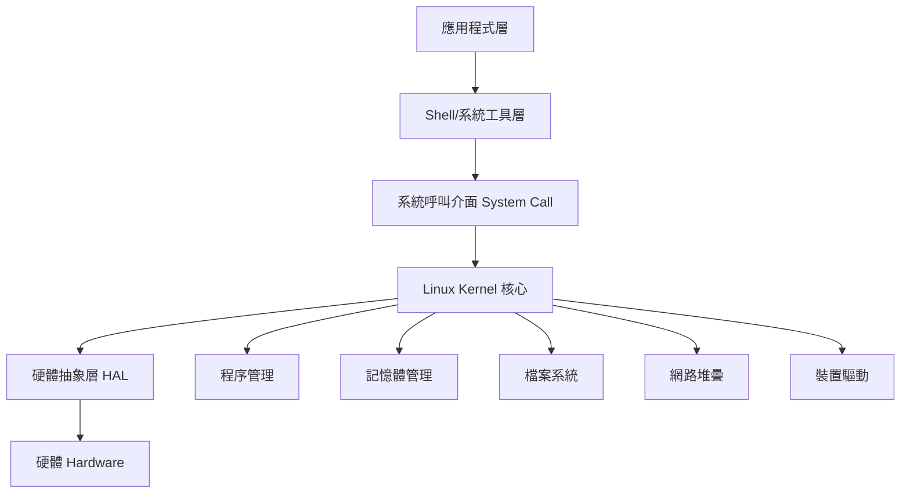
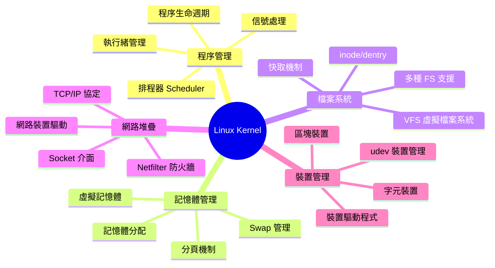
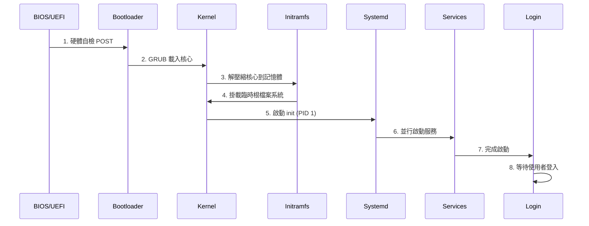
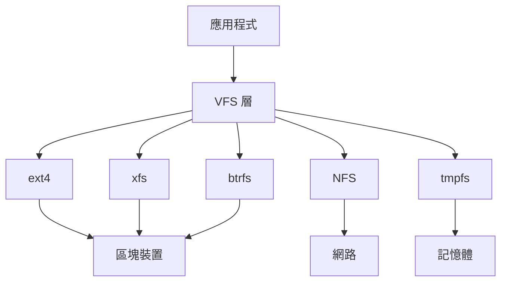

# Linux 核心概念與架構

## 目錄
- [主題簡介](#主題簡介)
- [Linux 系統架構](#linux-系統架構)
- [核心功能與組件](#核心功能與組件)
- [啟動流程](#啟動流程)
- [檔案系統架構](#檔案系統架構)
- [常用命令與範例](#常用命令與範例)
- [參考資料](#參考資料)

---

## 主題簡介

Linux 是現代伺服器、雲端、嵌入式系統的主流作業系統。理解其核心架構是系統管理、開發與故障排查的基礎。本筆記涵蓋 Linux 系統架構、核心功能、啟動流程與檔案系統概念,適合系統管理員與開發者。

---

## Linux 系統架構

### 系統層級架構



### 核心層級說明

| 層級    | 說明                 | 範例                       |
| ----- | ------------------ | ------------------------ |
| 硬體層   | CPU、記憶體、磁碟、網卡等實體設備 | Intel CPU, SSD, Ethernet |
| 核心層   | 資源管理、排程、I/O、網路     | Linux Kernel             |
| 系統呼叫  | 應用程式與核心溝通的介面       | open(), read(), fork()   |
| Shell | 命令列介面,提供互動環境       | Bash, Zsh                |
| 應用層   | 使用者程式與服務           | Nginx, MySQL, Docker     |

---

## 核心功能與組件

### 核心主要功能



### 核心空間 vs 使用者空間

| 項目  | 核心空間 Kernel Space | 使用者空間 User Space |
| --- | ----------------- | ---------------- |
| 權限  | 最高權限,可直接存取硬體      | 受限權限,需透過系統呼叫     |
| 記憶體 | 共享核心記憶體空間         | 獨立程序記憶體空間        |
| 執行  | 核心程式碼、驅動程式        | 應用程式、Shell       |
| 穩定性 | 錯誤會導致系統當機         | 錯誤僅影響單一程序        |

---

## 啟動流程

### 完整啟動流程圖



### 啟動階段詳解

#### 1. BIOS/UEFI 階段
- **功能**: 硬體初始化與自我檢測 (POST)
- **任務**: 檢測 CPU、記憶體、磁碟等硬體
- **位置**: 主機板韌體

#### 2. Bootloader 階段 (GRUB)
- **功能**: 載入作業系統核心
- **配置檔**: `/boot/grub/grub.cfg`
- **選項**: 可選擇不同核心版本或參數

#### 3. Kernel 載入
- **位置**: `/boot/vmlinuz-*`
- **動作**: 
  - 解壓縮核心到記憶體
  - 初始化硬體驅動
  - 掛載 initramfs

#### 4. Initramfs (初始 RAM 檔案系統)
- **功能**: 提供最小可啟動環境
- **位置**: `/boot/initramfs-*`
- **任務**: 
  - 載入必要驅動 (如 RAID, LVM)
  - 掛載真實根檔案系統
  - 移交控制權給 init

#### 5. Init/Systemd (PID 1)
- **位置**: `/usr/lib/systemd/systemd`
- **功能**: 系統與服務管理器
- **任務**:
  - 解析 target 依賴
  - 並行啟動服務
  - 掛載檔案系統
  - 啟動網路

#### 6. 服務啟動
- **順序**: 依據 target 與依賴關係
- **常見 target**:
  - `multi-user.target`: 多使用者文字模式
  - `graphical.target`: 圖形介面模式

### 查看啟動訊息

```bash
# 查看核心啟動訊息
dmesg | less

# 查看 systemd 啟動時間
systemd-analyze

# 查看服務啟動時間分析
systemd-analyze blame

# 查看啟動關鍵路徑
systemd-analyze critical-chain
```

**範例輸出：**
```
Startup finished in 2.847s (kernel) + 8.234s (userspace) = 11.081s
graphical.target reached after 8.198s in userspace
```

---

## 檔案系統架構

### 目錄樹結構

```mermaid
graph TD
    A[/ 根目錄] --> B[/bin 基本命令]
    A --> C[/boot 開機檔案]
    A --> D[/dev 裝置檔案]
    A --> E[/etc 系統配置]
    A --> F[/home 使用者目錄]
    A --> G[/lib 函式庫]
    A --> H[/mnt 臨時掛載]
    A --> I[/opt 第三方軟體]
    A --> J[/proc 程序資訊]
    A --> K[/root root 家目錄]
    A --> L[/run 執行時資料]
    A --> M[/srv 服務資料]
    A --> N[/sys 系統資訊]
    A --> O[/tmp 暂存檔案]
    A --> P[/usr 使用者程式]
    A --> Q[/var 可變資料]
```

### 重要目錄說明

| 目錄 | 用途 | 範例內容 |
|------|------|----------|
| `/bin` | 基本使用者命令 | ls, cp, mv, bash |
| `/boot` | 開機所需檔案 | vmlinuz, initramfs, grub |
| `/dev` | 裝置檔案 | sda, tty, null, random |
| `/etc` | 系統配置檔 | passwd, fstab, nginx.conf |
| `/home` | 使用者家目錄 | /home/user |
| `/lib`, `/lib64` | 共享函式庫 | libc.so, 核心模組 |
| `/mnt`, `/media` | 掛載點 | USB, 光碟 |
| `/opt` | 第三方軟體 | google, teamviewer |
| `/proc` | 程序與核心資訊 (虛擬) | cpuinfo, meminfo |
| `/root` | root 使用者家目錄 | |
| `/run` | 執行時資料 | PID 檔案, socket |
| `/srv` | 服務資料 | FTP, HTTP 檔案 |
| `/sys` | 核心裝置資訊 (虛擬) | 裝置屬性 |
| `/tmp` | 暫存檔案 (重啟清空) | |
| `/usr` | 使用者應用程式 | /usr/bin, /usr/lib, /usr/share |
| `/var` | 可變資料 | log, cache, spool |

### VFS 虛擬檔案系統



**VFS 功能：**
- 提供統一的檔案操作介面
- 抽象化不同檔案系統的差異
- 支援多種檔案系統並存

### 支援的檔案系統

| 類型 | 檔案系統 | 特點 |
|------|----------|------|
| 傳統 | ext2, ext3, ext4 | 穩定、廣泛支援 |
| 高效能 | XFS | 大檔案、高併發 |
| 進階 | Btrfs, ZFS | 快照、壓縮、自我修復 |
| 網路 | NFS, CIFS/SMB | 遠端檔案共享 |
| 虛擬 | tmpfs, procfs, sysfs | 記憶體/核心資訊 |
| 跨平台 | VFAT, exFAT, NTFS | USB、Windows 相容 |

---

## 常用命令與範例

### 系統資訊查詢

```bash
# 核心版本
uname -r
# 輸出: 6.6.10-arch1-1

# 完整系統資訊
uname -a
# 輸出: Linux hostname 6.6.10-arch1-1 #1 SMP x86_64 GNU/Linux

# 發行版資訊
cat /etc/os-release
# 或
lsb_release -a

# CPU 資訊
lscpu
cat /proc/cpuinfo

# 記憶體資訊
free -h
cat /proc/meminfo

# 核心參數
sysctl -a
cat /proc/sys/kernel/hostname
```

### 啟動與關機

```bash
# 查看系統運行時間
uptime
# 輸出: 10:30:15 up 5 days, 2:34, 2 users, load average: 0.15, 0.10, 0.05

# 查看啟動日誌
journalctl -b
journalctl -b -1  # 上次啟動

# 重新啟動
sudo systemctl reboot

# 關機
sudo systemctl poweroff

# 休眠
sudo systemctl suspend

# 進入救援模式
sudo systemctl rescue
```

### 模組管理

```bash
# 列出已載入模組
lsmod

# 載入模組
sudo modprobe module_name

# 卸載模組
sudo modprobe -r module_name

# 查看模組資訊
modinfo module_name

# 查看模組參數
cat /sys/module/module_name/parameters/*
```

### 核心參數調整

```bash
# 查詢參數
sysctl kernel.hostname

# 臨時設定 (重啟失效)
sudo sysctl -w net.ipv4.ip_forward=1

# 永久設定
echo "net.ipv4.ip_forward=1" | sudo tee /etc/sysctl.d/99-custom.conf
sudo sysctl --system
```

---

## 參考資料

- [Linux Kernel Documentation](https://www.kernel.org/doc/)
- [Filesystem Hierarchy Standard](https://refspecs.linuxfoundation.org/FHS_3.0/fhs/index.html)
- [Arch Wiki - Arch Boot Process](https://wiki.archlinux.org/title/Arch_boot_process)
- [systemd Documentation](https://www.freedesktop.org/wiki/Software/systemd/)
