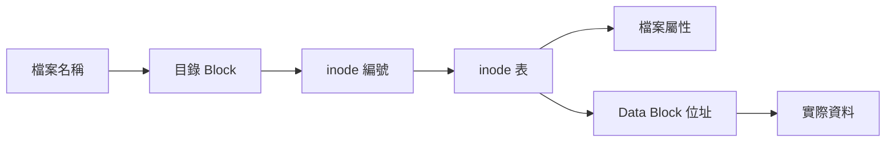
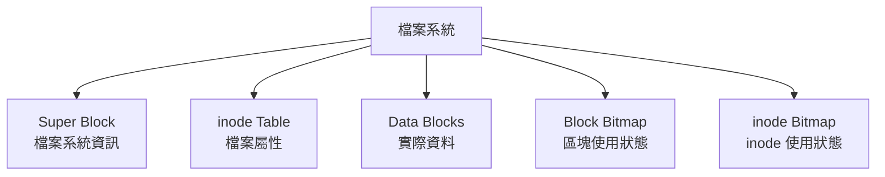
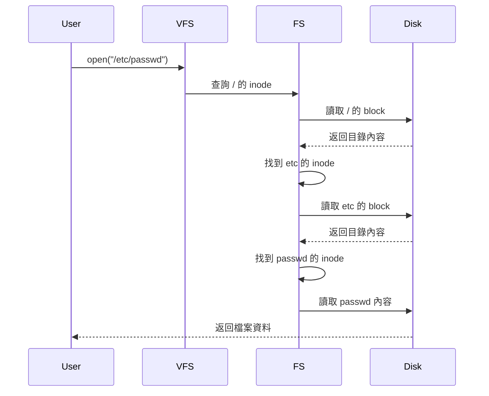
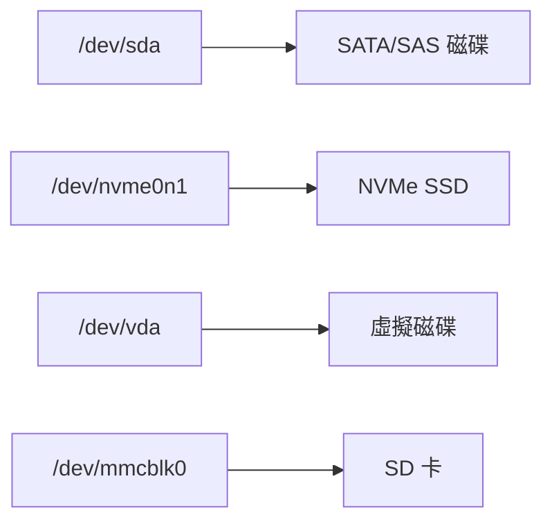
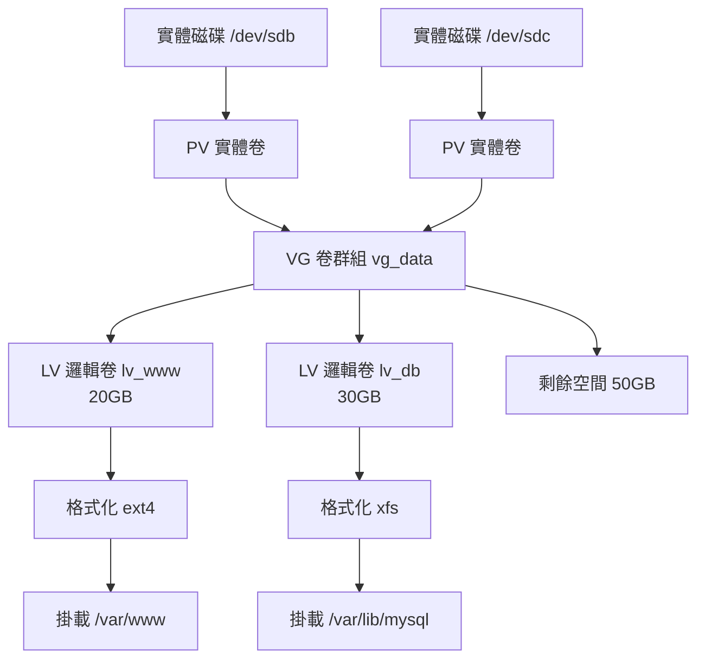

# 檔案系統管理

## 目錄
- [主題簡介](#主題簡介)
- [核心概念](#核心概念)
- [磁碟分割](#磁碟分割)
- [檔案系統類型](#檔案系統類型)
- [LVM 邏輯卷管理](#lvm-邏輯卷管理)
- [掛載管理](#掛載管理)
- [常用命令與範例](#常用命令與範例)
- [常見問題與排查](#常見問題與排查)
- [最佳實踐](#最佳實踐)
- [實戰案例](#實戰案例)

---

## 主題簡介

檔案系統管理是 Linux 系統維運的基礎,涵蓋磁碟分割、檔案系統建立、掛載、空間監控、資料一致性與備份。正確的檔案系統規劃可提升系統穩定性、效能與安全性,並有效應對資料爆滿、硬碟損毀等突發狀況。

---

## 核心概念

### inode 與 Data Block



**inode 儲存內容：**
- 檔案權限 (rwx)
- 擁有者與群組 (UID/GID)
- 檔案大小
- 時間戳 (atime, mtime, ctime)
- Data Block 位址指標

**Data Block：**
- 儲存實際檔案內容
- 固定大小 (通常 4KB)
- 大檔案佔用多個 block

### 檔案系統結構



### 讀取流程範例

以讀取 `/etc/passwd` 為例：



---

## 磁碟分割

### 分割表類型

| 類型    | MBR (傳統)         | GPT (現代)        |
| ----- | ---------------- | --------------- |
| 最大容量  | 2TB              | 18EB            |
| 分割區數量 | 4 主分割 (或 3+1 延伸) | 128             |
| 相容性   | BIOS             | UEFI (可相容 BIOS) |
| 備份    | 無                | 有備份分割表          |
| 適用場景  | 舊系統、小磁碟          | 現代系統、大容量        |

### 磁碟命名規則



**命名範例：**
- `/dev/sda`: 第一顆 SATA 磁碟
- `/dev/sda1`: 第一顆 SATA 磁碟的第一個分割區
- `/dev/nvme0n1p1`: NVMe 磁碟的第一個分割區

### 分割操作

```bash
# 列出所有磁碟與分割
lsblk
# 輸出:
# NAME   MAJ:MIN RM  SIZE RO TYPE MOUNTPOINT
# sda      8:0    0  100G  0 disk
# ├─sda1   8:1    0   50G  0 part /
# └─sda2   8:2    0   50G  0 part /data

# 查看分割表資訊
sudo fdisk -l /dev/sda

# GPT 分割 (推薦)
sudo gdisk /dev/sdb
# 或使用更直觀的工具
sudo cfdisk /dev/sdb

# MBR 分割 (舊系統)
sudo fdisk /dev/sdb
```

**cfdisk 互動流程：**
1. 選擇分割表類型 (gpt/dos)
2. New → 輸入大小 → 選擇類型
3. Write → 確認寫入
4. Quit → 離開

---

## 檔案系統類型

### 常見檔案系統比較

| 檔案系統       | 特點            | 適用場景      | 最大檔案大小   |
| ---------- | ------------- | --------- | -------- |
| ext4       | 穩定、廣泛支援、日誌    | 一般用途、根目錄  | 16TB     |
| XFS        | 高效能、大檔案、並發    | 資料庫、大容量儲存 | 8EB      |
| Btrfs      | 快照、壓縮、去重      | 進階功能需求    | 16EB     |
| ZFS        | 資料完整性、RAID、快照 | 企業級儲存     | 16EB     |
| VFAT/exFAT | 跨平台相容         | USB、多系統共享 | 4GB/16EB |
|            |               |           |          |

### 建立檔案系統

```bash
# ext4
sudo mkfs.ext4 /dev/sdb1

# XFS
sudo mkfs.xfs -f /dev/sdb1

# Btrfs
sudo mkfs.btrfs /dev/sdb1

# VFAT (FAT32)
sudo mkfs.vfat /dev/sdb1

# exFAT
sudo mkfs.exfat /dev/sdb1
```

### 檔案系統資訊查詢

```bash
# 查看檔案系統類型與使用量
df -hT
# 輸出:
# Filesystem     Type   Size  Used Avail Use% Mounted on
# /dev/sda1      ext4    50G   20G   28G  42% /
# /dev/sdb1      xfs    100G   45G   55G  45% /data

# 查看 inode 使用情況
df -i
# 輸出:
# Filesystem     Inodes  IUsed   IFree IUse% Mounted on
# /dev/sda1      3276800 245678 3031122   8% /

# XFS 詳細資訊
xfs_info /dev/sdb1
# 或
xfs_info /data

# ext4 詳細資訊
tune2fs -l /dev/sda1
```

### 檔案系統檢查與修復

```bash
# 檢查前務必卸載!
sudo umount /dev/sdb1

# ext4 檢查修復
sudo fsck.ext4 /dev/sdb1

# XFS 檢查修復
sudo xfs_repair /dev/sdb1

# 強制檢查 (危險)
sudo fsck.ext4 -f /dev/sdb1

# 自動修復
sudo fsck.ext4 -y /dev/sdb1
```

---

## LVM 邏輯卷管理

### LVM 架構



### LVM 基本概念

| 術語 | 說明 | 範例 |
|------|------|------|
| PV (Physical Volume) | 實體卷,LVM 的基本單位 | /dev/sdb1 |
| PE (Physical Extent) | 實體延伸區塊,預設 4MB | LVM 最小分配單位 |
| VG (Volume Group) | 卷群組,PE 的集合 | vg_data |
| LV (Logical Volume) | 邏輯卷,從 VG 分配 | lv_www, lv_db |

### LVM 建立流程

```bash
# 1. 建立 PV
sudo pvcreate /dev/sdb1 /dev/sdc1
# 輸出: Physical volume "/dev/sdb1" successfully created

# 查看 PV
sudo pvdisplay
sudo pvs  # 簡略版

# 2. 建立 VG
sudo vgcreate vg_data /dev/sdb1 /dev/sdc1
# 輸出: Volume group "vg_data" successfully created

# 查看 VG
sudo vgdisplay vg_data
sudo vgs  # 簡略版

# 3. 建立 LV
sudo lvcreate -L 20G -n lv_www vg_data
sudo lvcreate -L 30G -n lv_db vg_data
# 輸出: Logical volume "lv_www" created

# 查看 LV
sudo lvdisplay
sudo lvs  # 簡略版

# 4. 格式化
sudo mkfs.ext4 /dev/vg_data/lv_www
sudo mkfs.xfs /dev/vg_data/lv_db

# 5. 掛載
sudo mkdir -p /var/www /var/lib/mysql
sudo mount /dev/vg_data/lv_www /var/www
sudo mount /dev/vg_data/lv_db /var/lib/mysql
```

### LVM 擴容

```bash
# 擴充 LV (線上操作)
sudo lvextend -L +10G /dev/vg_data/lv_www
# 或使用百分比
sudo lvextend -l +100%FREE /dev/vg_data/lv_www

# 擴展檔案系統
# ext4
sudo resize2fs /dev/vg_data/lv_www

# XFS (必須已掛載)
sudo xfs_growfs /var/lib/mysql

# 驗證
df -h
```

### VG 擴容

```bash
# 新增磁碟到 VG
sudo pvcreate /dev/sdd1
sudo vgextend vg_data /dev/sdd1

# 查看 VG 空間
sudo vgs
```

### LVM 快照

```bash
# 建立快照 (5GB 空間)
sudo lvcreate -L 5G -s -n lv_www_snap /dev/vg_data/lv_www

# 掛載快照查看
sudo mkdir /mnt/snap
sudo mount /dev/vg_data/lv_www_snap /mnt/snap

# 還原快照
sudo umount /var/www
sudo lvconvert --merge /dev/vg_data/lv_www_snap
# 需重新掛載才生效

# 刪除快照
sudo lvremove /dev/vg_data/lv_www_snap
```

---

## 掛載管理

### 掛載基礎

```bash
# 臨時掛載
sudo mount /dev/sdb1 /mnt/data

# 查看掛載狀態
mount | grep /mnt/data
# 或
findmnt /mnt/data

# 卸載
sudo umount /mnt/data
# 強制卸載 (危險)
sudo umount -l /mnt/data
```

### fstab 永久掛載

編輯 `/etc/fstab`:

```bash
# <裝置>              <掛載點>    <類型>  <選項>        <dump> <fsck>
UUID=xxx-xxx         /data       ext4    defaults      0      2
/dev/vg_data/lv_www  /var/www    ext4    defaults      0      2
/dev/sdc1            /backup     xfs     defaults      0      0
```

**欄位說明：**
1. **裝置**: UUID 或裝置路徑 (建議用 UUID)
2. **掛載點**: 目標目錄
3. **類型**: 檔案系統類型
4. **選項**: 掛載參數
   - `defaults`: rw, suid, dev, exec, auto, nouser, async
   - `noatime`: 不更新存取時間,提升效能
   - `ro`: 唯讀
5. **dump**: 0=不備份, 1=備份
6. **fsck**: 檢查順序,0=不檢查,1=根目錄,2=其他

### 查詢 UUID

```bash
# 方法 1
sudo blkid
# 輸出:
# /dev/sda1: UUID="abc-123" TYPE="ext4"

# 方法 2
ls -l /dev/disk/by-uuid/
```

### 掛載選項詳解

```bash
# 唯讀掛載
sudo mount -o ro /dev/sdb1 /mnt/data

# 禁用 SUID/執行檔
sudo mount -o nosuid,noexec /dev/sdb1 /mnt/untrusted

# 重新掛載 (不卸載)
sudo mount -o remount,rw /

# 繫結掛載 (目錄映射)
sudo mount --bind /var/www /srv/backup

# 掛載 ISO 映像
sudo mount -o loop /path/to/image.iso /mnt/iso
```

---

## 常用命令與範例

### 空間監控

```bash
# 磁碟使用量
df -h
# 輸出:
# Filesystem      Size  Used Avail Use% Mounted on
# /dev/sda1        50G   20G   28G  42% /

# 目錄大小
du -sh /var/log
# 輸出: 2.3G  /var/log

# 找出最大檔案/目錄
du -ah /var | sort -rh | head -n 10

# 找出大於 100MB 的檔案
find / -type f -size +100M -exec ls -lh {} \;
```

### 連結管理

```bash
# 建立軟連結 (符號連結)
ln -s /path/to/original /path/to/link

# 建立硬連結
ln /path/to/original /path/to/hardlink

# 查看連結
ls -li file link
# i 選項顯示 inode 編號
```

**軟連結 vs 硬連結：**

| 特性    | 軟連結 | 硬連結 |
| ----- | --- | --- |
| inode | 不同  | 相同  |
| 跨檔案系統 | 可以  | 不可  |
| 目錄    | 可以  | 不可  |
| 原檔刪除  | 失效  | 仍可用 |

---

## 常見問題與排查

### 磁碟空間不足

```bash
# 1. 檢查空間
df -h

# 2. 找出大檔案
du -sh /* | sort -hr | head

# 3. 清理日誌
sudo journalctl --vacuum-size=100M
sudo rm -rf /var/log/*.gz

# 4. 清理快取
sudo apt clean  # Debian/Ubuntu
sudo dnf clean all  # RHEL/Fedora
```

### inode 耗盡

```bash
# 檢查 inode
df -i

# 找出大量小檔案的目錄
for dir in /*; do
  echo -n "$dir: "
  find "$dir" -type f | wc -l
done

# 清理臨時檔案
sudo find /tmp -type f -delete
```

### 無法卸載

```bash
# 查看使用中的程序
sudo lsof /mnt/data
sudo fuser -m /mnt/data

# 終止程序
sudo fuser -km /mnt/data

# 強制卸載
sudo umount -l /mnt/data
```

### 檔案系統錯誤

```bash
# 檢查系統日誌
dmesg | grep -i error
journalctl -xe

# 進入單人模式修復
sudo systemctl rescue

# 檢查修復 (務必卸載!)
sudo umount /dev/sdb1
sudo fsck -y /dev/sdb1
```

---

## 最佳實踐

### 分割規劃建議

```
/boot      1GB     (EFI: 512MB)
/          20-50GB
/home      依需求
/var       10-50GB  (日誌、快取)
swap       記憶體的 1-2 倍 (或不設)
```

### 安全建議

- 敏感目錄設定 `noexec, nosuid, nodev`
- 使用 UUID 而非裝置名稱
- 定期檢查 `/etc/fstab` 語法
- 重要資料定期備份
- 監控磁碟空間與 inode 使用量

### 效能優化

- 使用 `noatime` 減少寫入
- SSD 啟用 TRIM: `discard` 選項
- 大檔案系統選用 XFS
- 考慮 LVM 以利擴充

---

## 實戰案例

### 案例一：根分割區爆滿處理

```bash
# 1. 檢查空間
df -h

# 2. 找出佔用空間
sudo du -sh /* | sort -hr | head

# 3. 清理
sudo journalctl --vacuum-time=7d
sudo apt autoremove
sudo apt clean

# 4. 移動大目錄到其他分割區
sudo rsync -av /var/cache /data/cache
sudo rm -rf /var/cache
sudo ln -s /data/cache /var/cache
```

### 案例二：LVM 線上擴容

```bash
# 1. 檢查空間
sudo vgs

# 2. 擴充 LV
sudo lvextend -l +100%FREE /dev/vg_data/lv_www

# 3. 擴展檔案系統
sudo resize2fs /dev/vg_data/lv_www  # ext4
# 或
sudo xfs_growfs /var/www  # XFS

# 4. 驗證
df -h /var/www
```

### 案例三：硬碟損毀快速恢復

```bash
# 1. 檢查 RAID/LVM 狀態
sudo mdadm --detail /dev/md0  # RAID
sudo lvs  # LVM

# 2. 更換損壞硬碟後
sudo pvcreate /dev/sdd1
sudo vgextend vg_data /dev/sdd1

# 3. 移動資料 (若需要)
sudo pvmove /dev/sdb1

# 4. 移除舊 PV
sudo vgreduce vg_data /dev/sdb1
sudo pvremove /dev/sdb1
```

---

## 參考資料

- [Filesystem Hierarchy Standard](https://refspecs.linuxfoundation.org/FHS_3.0/fhs/index.html)
- [LVM HOWTO](https://tldp.org/HOWTO/LVM-HOWTO/)
- [XFS Documentation](https://docs.kernel.org/filesystems/xfs.html)
- [ext4 Documentation](https://www.kernel.org/doc/html/latest/filesystems/ext4.html)
