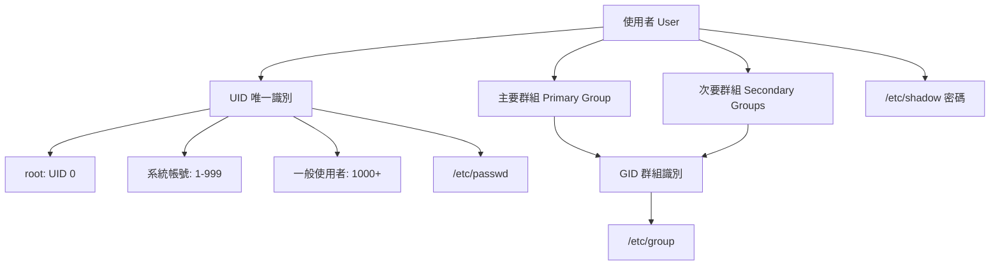
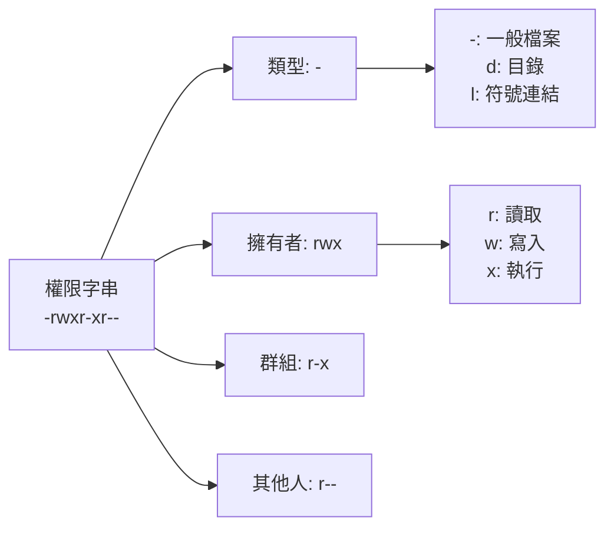
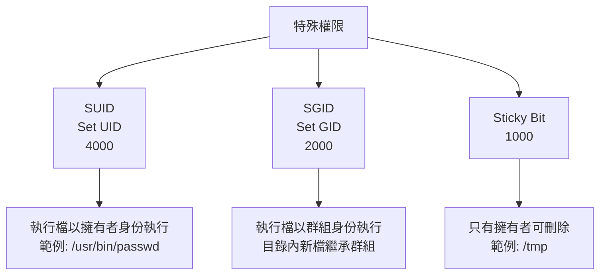

# 使用者與權限控制

## 目錄
- [主題簡介](#主題簡介)
- [核心概念](#核心概念)
- [使用者與群組管理](#使用者與群組管理)
- [檔案權限系統](#檔案權限系統)
- [進階權限機制](#進階權限機制)
- [sudo 權限管理](#sudo-權限管理)
- [常用命令與範例](#常用命令與範例)
- [常見問題與排查](#常見問題與排查)
- [最佳實踐](#最佳實踐)
- [實戰案例](#實戰案例)

---

## 主題簡介

使用者與權限管理是 Linux 多用戶系統的核心安全機制。透過 UID/GID、檔案權限、ACL、sudo 等機制,實現精細的存取控制,防止未授權操作與資安風險。本筆記涵蓋使用者管理、權限模型、進階機制與最佳實踐。

---

## 核心概念

### 使用者與群組架構



### 核心設定檔

| 檔案 | 用途 | 範例內容 |
|------|------|----------|
| `/etc/passwd` | 使用者基本資訊 | `user:x:1000:1000:User Name:/home/user:/bin/bash` |
| `/etc/shadow` | 加密密碼與密碼政策 | `user:$6$encrypted:18000:0:99999:7:::` |
| `/etc/group` | 群組資訊 | `sudo:x:27:user1,user2` |
| `/etc/gshadow` | 群組密碼 (少用) | `sudo:*::user1,user2` |

### /etc/passwd 格式

```
username:password:UID:GID:GECOS:home:shell
   ↓        ↓       ↓   ↓    ↓     ↓     ↓
  帳號      密碼     UID GID  說明  家目錄 Shell
```

**範例解析：**
```
liam:x:1000:1000:Liam User:/home/liam:/bin/zsh
```
- `liam`: 使用者名稱
- `x`: 密碼佔位符 (實際在 /etc/shadow)
- `1000`: UID
- `1000`: 主要群組 GID
- `Liam User`: GECOS 欄位 (全名/註解)
- `/home/liam`: 家目錄
- `/bin/zsh`: 登入 Shell

---

## 使用者與群組管理

### 使用者管理

```bash
# 新增使用者
sudo useradd -m -s /bin/bash alice
# -m: 建立家目錄
# -s: 指定 Shell

# 新增使用者並設定群組
sudo useradd -m -G sudo,docker -s /bin/zsh bob

# 設定密碼
sudo passwd alice

# 修改使用者
sudo usermod -aG sudo alice  # 加入 sudo 群組
sudo usermod -s /bin/zsh alice  # 更換 Shell
sudo usermod -L alice  # 鎖定帳號
sudo usermod -U alice  # 解鎖帳號

# 刪除使用者
sudo userdel alice  # 保留家目錄
sudo userdel -r alice  # 連家目錄一起刪除

# 查詢使用者資訊
id alice
# 輸出: uid=1001(alice) gid=1001(alice) groups=1001(alice),27(sudo)

getent passwd alice
# 輸出: alice:x:1001:1001::/home/alice:/bin/bash

who  # 查看登入使用者
w    # 更詳細的登入資訊
last # 登入歷史
```

### 群組管理

```bash
# 新增群組
sudo groupadd developers

# 修改群組
sudo groupmod -n devs developers  # 改名

# 刪除群組
sudo groupdel developers

# 查看群組
groups alice
getent group sudo

# 將使用者加入群組
sudo usermod -aG developers alice
# 或
sudo gpasswd -a alice developers

# 從群組移除使用者
sudo gpasswd -d alice developers

# 設定群組管理員
sudo gpasswd -A bob developers
```

### 切換使用者

```bash
# 切換到 root
su
# 或
su -  # 連同環境變數一起切換

# 切換到其他使用者
su - alice

# 以其他使用者身份執行命令
su - alice -c "ls -la /home/alice"

# 退出
exit
# 或按 Ctrl+D
```

---

## 檔案權限系統

### 權限結構



### 權限意義

| 對象 | r (read) | w (write) | x (execute) |
|------|----------|-----------|-------------|
| **檔案** | 讀取內容 | 修改內容 | 執行程式 |
| **目錄** | 列出檔案 (ls) | 建立/刪除檔案 | 進入目錄 (cd) |

### 數字權限表示法

```
rwx = 4 + 2 + 1 = 7
r-x = 4 + 0 + 1 = 5
r-- = 4 + 0 + 0 = 4

範例: 755 = rwxr-xr-x
     644 = rw-r--r--
     600 = rw-------
```

### 權限操作

```bash
# 符號模式
chmod u+x file.sh  # 擁有者加執行權限
chmod g-w file.txt  # 群組移除寫入權限
chmod o=r file.txt  # 其他人只有讀取
chmod a+r file.txt  # 所有人加讀取

# 數字模式
chmod 755 script.sh
chmod 644 document.txt
chmod 600 secret.key

# 遞迴變更
chmod -R 750 /var/www

# 變更擁有者
sudo chown alice:developers file.txt
sudo chown alice: file.txt  # 群組設為 alice 的主要群組
sudo chown :developers file.txt  # 只改群組

# 遞迴變更
sudo chown -R www-data:www-data /var/www

# 只改群組
sudo chgrp developers file.txt

# 查看權限
ls -l file.txt
# 輸出: -rw-r--r-- 1 alice developers 1234 Nov 08 10:00 file.txt

stat file.txt
# 顯示詳細資訊包含權限、時間戳
```

### umask 預設權限

```bash
# 查看 umask
umask
# 輸出: 0022

# 設定 umask (臨時)
umask 0027

# 永久設定 (加入 ~/.bashrc)
echo "umask 0027" >> ~/.bashrc

# umask 計算
# 檔案預設: 666 - umask = 644 (0022)
# 目錄預設: 777 - umask = 755 (0022)
```

---

## 進階權限機制

### 特殊權限



### SUID/SGID/Sticky Bit

```bash
# SUID (4000)
chmod u+s /usr/local/bin/myprog
chmod 4755 /usr/local/bin/myprog
# 顯示為: -rwsr-xr-x

# SGID (2000)
chmod g+s /srv/shared
chmod 2770 /srv/shared
# 顯示為: drwxrws---

# Sticky Bit (1000)
chmod +t /srv/public
chmod 1777 /srv/public
# 顯示為: drwxrwxrwt

# 組合使用
chmod 6755 file  # SUID + SGID
chmod 1755 dir   # Sticky Bit
```

**範例說明：**
```bash
# /usr/bin/passwd 使用 SUID
ls -l /usr/bin/passwd
# -rwsr-xr-x root root ... /usr/bin/passwd
# 一般使用者執行時暫時取得 root 權限以修改 /etc/shadow

# /tmp 使用 Sticky Bit
ls -ld /tmp
# drwxrwxrwt root root ... /tmp
# 任何人可建立檔案,但只能刪除自己的檔案
```

### ACL 存取控制清單

```bash
# 檢查是否支援 ACL
mount | grep acl

# 設定 ACL
setfacl -m u:alice:rwx /srv/project
setfacl -m g:developers:rx /srv/project

# 查看 ACL
getfacl /srv/project
# 輸出:
# # file: srv/project
# # owner: root
# # group: root
# user::rwx
# user:alice:rwx
# group::r-x
# group:developers:r-x
# mask::rwx
# other::---

# 遞迴設定
setfacl -R -m u:bob:rx /srv/project

# 移除 ACL
setfacl -x u:alice /srv/project

# 移除所有 ACL
setfacl -b /srv/project

# 複製 ACL
getfacl file1 | setfacl --set-file=- file2

# 預設 ACL (繼承)
setfacl -d -m g:developers:rwx /srv/project
# 目錄內新建檔案自動套用此 ACL
```

---

## sudo 權限管理

### sudo 架構

```mermaid
graph LR
    A[使用者] --> B[sudo 命令]
    B --> C[檢查 /etc/sudoers]
    C --> D{權限檢查}
    D -->|允許| E[以 root 執行]
    D -->|拒絕| F[Permission denied]
    
    C --> G[sudoers 語法<br/>user host=(runas) command]
```

### sudoers 設定

```bash
# 編輯 sudoers (務必用 visudo)
sudo visudo

# 常見設定
# 格式: user host=(runas:runasgroup) command

# 允許 alice 執行所有命令
alice ALL=(ALL:ALL) ALL

# 允許 sudo 群組成員執行所有命令
%sudo ALL=(ALL:ALL) ALL

# 免密碼執行特定命令
bob ALL=(ALL) NOPASSWD: /usr/bin/systemctl restart nginx

# 限制命令
carol ALL=(ALL) /usr/bin/apt update, /usr/bin/apt upgrade

# 別名設定
User_Alias ADMINS = alice, bob
Cmnd_Alias SERVICES = /usr/bin/systemctl restart *
ADMINS ALL=(ALL) NOPASSWD: SERVICES
```

### sudo 使用

```bash
# 執行單一命令
sudo apt update

# 保持 sudo 權限 (預設 15 分鐘)
sudo -v

# 清除 sudo 權限
sudo -k

# 以其他使用者身份執行
sudo -u alice vim /home/alice/file.txt

# 登入 root shell
sudo -i

# 執行 root shell 命令
sudo -s

# 查看 sudo 權限
sudo -l
# 輸出: User alice may run the following commands
```

### sudo 日誌

```bash
# 查看 sudo 日誌
sudo journalctl -u sudo
sudo grep sudo /var/log/auth.log

# 範例輸出:
# Nov 8 10:30:15 hostname sudo: alice : TTY=pts/0 ; PWD=/home/alice ; USER=root ; COMMAND=/usr/bin/apt update
```

---

## 常用命令與範例

### 權限查詢

```bash
# 詳細權限資訊
ls -l
# -rw-r--r-- 1 alice developers 1234 Nov 08 10:00 file.txt

# 顯示 UID/GID
ls -n
# -rw-r--r-- 1 1000 1001 1234 Nov 08 10:00 file.txt

# 顯示 inode
ls -li

# 目錄權限
ls -ld /var/www

# 樹狀顯示權限
tree -pug /etc/nginx
```

### 批次操作

```bash
# 批次建立使用者
for user in user1 user2 user3; do
  sudo useradd -m "$user"
  echo "$user:password123" | sudo chpasswd
done

# 批次修改權限
find /var/www -type f -exec chmod 644 {} \;
find /var/www -type d -exec chmod 755 {} \;

# 批次變更擁有者
sudo chown -R www-data:www-data /var/www
```

---

## 常見問題與排查

### Permission denied

```bash
# 檢查權限
ls -l file.txt

# 檢查擁有者
stat file.txt

# 檢查 SELinux (RHEL/CentOS)
getenforce
ls -Z file.txt

# 檢查 ACL
getfacl file.txt

# 修正權限
chmod 644 file.txt
sudo chown user:group file.txt
```

### sudo 無法使用

```bash
# 檢查使用者群組
groups

# 將使用者加入 sudo 群組
sudo usermod -aG sudo username

# 檢查 sudoers 語法
sudo visudo -c

# 查看 sudo 日誌
sudo journalctl -u sudo
```

### 帳號被鎖定

```bash
# 檢查帳號狀態
sudo passwd -S username
# 輸出: username L ... (L 表示鎖定)

# 解鎖帳號
sudo usermod -U username
# 或
sudo passwd -u username
```

---

## 最佳實踐

### 安全原則

1. **最小權限原則**
   - 僅授予必要權限
   - 避免使用 777 權限
   - 定期審查權限設定

2. **使用者管理**
   - 停用不用的帳號
   - 強制密碼複雜度
   - 設定密碼過期政策

3. **sudo 管理**
   - 限制 sudo 權限範圍
   - 記錄 sudo 操作
   - 定期審查 sudoers

4. **敏感檔案**
   ```bash
   chmod 600 ~/.ssh/id_rsa
   chmod 644 ~/.ssh/id_rsa.pub
   chmod 700 ~/.ssh
   chmod 600 /etc/shadow
   chmod 644 /etc/passwd
   ```

### 密碼政策

```bash
# 設定密碼過期 (90 天)
sudo chage -M 90 username

# 設定最小密碼使用期限 (7 天)
sudo chage -m 7 username

# 設定密碼到期前警告 (7 天)
sudo chage -W 7 username

# 查看密碼政策
sudo chage -l username
```

### 目錄權限建議

```bash
# Web 目錄
sudo chown -R www-data:www-data /var/www
sudo find /var/www -type d -exec chmod 755 {} \;
sudo find /var/www -type f -exec chmod 644 {} \;

# 家目錄
chmod 700 /home/user

# 共享目錄
sudo chmod 2770 /srv/shared
sudo chown :developers /srv/shared
```

---

## 實戰案例

### 案例一：多人協作目錄

```bash
# 建立共享目錄並設定 SGID
sudo mkdir /srv/project
sudo chown :developers /srv/project
sudo chmod 2770 /srv/project

# 測試
sudo -u alice touch /srv/project/alice.txt
sudo -u bob touch /srv/project/bob.txt
ls -l /srv/project
# -rw-rw-r-- 1 alice developers ... alice.txt
# -rw-rw-r-- 1 bob developers ... bob.txt
```

### 案例二：設定 Web 服務權限

```bash
# 設定 Nginx 目錄權限
sudo chown -R www-data:www-data /var/www/html
sudo find /var/www/html -type d -exec chmod 755 {} \;
sudo find /var/www/html -type f -exec chmod 644 {} \;

# 特定使用者可編輯
sudo setfacl -R -m u:alice:rwx /var/www/html
sudo setfacl -R -d -m u:alice:rwx /var/www/html
```

### 案例三：限制 sudo 權限

```bash
# 允許 devops 群組重啟特定服務
sudo visudo
# 加入:
# %devops ALL=(ALL) NOPASSWD: /usr/bin/systemctl restart nginx
# %devops ALL=(ALL) NOPASSWD: /usr/bin/systemctl restart mysql

# 測試
sudo -u alice sudo -l
```

---

## 參考資料

- [Linux Users and Groups](https://wiki.archlinux.org/title/Users_and_groups)
- [File permissions](https://wiki.archlinux.org/title/File_permissions_and_attributes)
- [ACL Documentation](https://linux.die.net/man/5/acl)
- [sudoers Manual](https://www.sudo.ws/docs/man/sudoers.man/)
