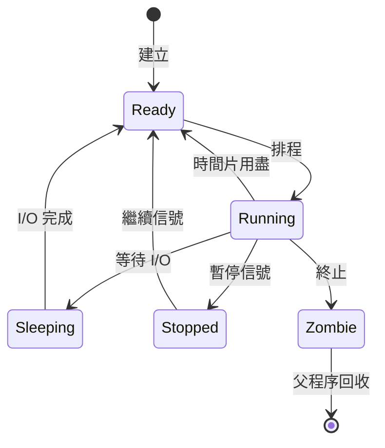
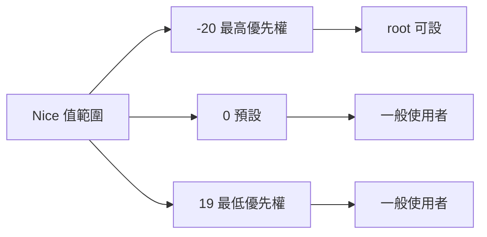
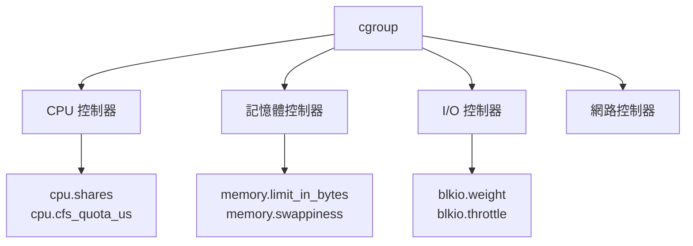

# 程序與資源管理

## 目錄
- [主題簡介](#主題簡介)
- [程序基礎概念](#程序基礎概念)
- [程序管理命令](#程序管理命令)
- [資源監控工具](#資源監控工具)
- [程序優先權與排程](#程序優先權與排程)
- [cgroup 資源限制](#cgroup-資源限制)
- [常見問題與排查](#常見問題與排查)
- [最佳實踐](#最佳實踐)
- [實戰案例](#實戰案例)

---

## 主題簡介

程序與資源管理是 Linux 系統管理的核心,涵蓋程序生命週期、排程、資源監控、限制與優化。熟練掌握這些技能有助於效能調校、故障排查與高可用架構設計。

---

## 程序基礎概念

### 程序 vs 執行緒

| 特性 | 程序 Process | 執行緒 Thread |
|------|-------------|--------------|
| 記憶體 | 獨立位址空間 | 共享程序空間 |
| 資源 | 獨立資源 | 共享程序資源 |
| PID | 唯一 PID | 共享 PID (TID 區分) |
| 建立成本 | 高 | 低 |
| 通訊 | IPC (管道, Socket 等) | 共享記憶體 |

### 程序狀態



**狀態說明:**
- **R (Running)**: 執行中或可執行
- **S (Sleeping)**: 可中斷睡眠,等待事件
- **D (Disk sleep)**: 不可中斷睡眠,等待 I/O
- **T (Stopped)**: 已暫停
- **Z (Zombie)**: 殭屍程序,已終止但未回收

---

## 程序管理命令

### ps - 程序快照

```bash
# BSD 風格
ps aux
# USER   PID %CPU %MEM    VSZ   RSS TTY  STAT START TIME COMMAND
# root     1  0.0  0.1  22560  4100 ?    Ss   10:00 0:01 /sbin/init

# System V 風格
ps -ef
ps -eFH  # 顯示階層與執行緒

# 查看特定程序
ps -p 1234
ps -C nginx  # 依命令名稱

# 自訂輸出
ps -eo pid,ppid,user,%cpu,%mem,comm

# 樹狀顯示
ps auxf
pstree
pstree -p  # 顯示 PID
```

### top - 動態監控

```bash
top

# 常用快捷鍵:
# P - 依 CPU 排序
# M - 依記憶體排序
# k - 終止程序
# r - 調整 nice 值
# 1 - 顯示所有 CPU 核心
# q - 離開

# 批次模式
top -b -n 1 > top.txt

# 監控特定使用者
top -u username

# 顯示完整命令
top -c
```

### htop - 進階互動監控

```bash
htop

# 功能:
# - 滑鼠操作支援
# - 彩色顯示
# - 樹狀程序檢視 (F5)
# - 搜尋程序 (F3)
# - 篩選 (F4)
# - 信號傳送 (F9)
```

### 程序控制

```bash
# 終止程序
kill PID
kill -15 PID  # SIGTERM (預設)
kill -9 PID   # SIGKILL (強制)
kill -HUP PID # SIGHUP (重新載入)

# 依名稱終止
pkill nginx
killall nginx

# 批次終止
pkill -u username

# 查看信號列表
kill -l
```

### 背景與前景

```bash
# 背景執行
command &
[1] 12345

# 查看背景工作
jobs
# [1]+ Running   sleep 1000 &

# 前景切換
fg %1

# 背景繼續 (Ctrl+Z 後)
bg %1

# nohup 防止 HUP 信號
nohup ./long_task.sh &
# 輸出到 nohup.out
```

---

## 資源監控工具

### CPU 監控

```bash
# iostat - CPU 統計
iostat -c 1
# avg-cpu:  %user %nice %system %iowait %steal %idle
#            2.85  0.08    7.20   12.98   0.00  76.88

# mpstat - 多核心 CPU
mpstat -P ALL 1

# pidstat - 程序級 CPU
pidstat -u 1
pidstat -u -p 1234 1
```

### 記憶體監控

```bash
# free - 記憶體概況
free -h
#               total  used  free  shared  buff/cache  available
# Mem:           16Gi  4.2Gi  8.1Gi   256Mi        3.7Gi       11Gi
# Swap:          8.0Gi     0B  8.0Gi

# vmstat - 詳細記憶體統計
vmstat 1
# procs memory swap io system cpu
#  r  b swpd free buff cache si so bi bo in cs us sy id wa

# 程序記憶體使用
ps aux --sort=-%mem | head
pmap -x PID  # 詳細記憶體映射
```

### I/O 監控

```bash
# iostat - 磁碟 I/O
iostat -x 1
# Device  r/s  w/s  rkB/s  wkB/s  %util

# iotop - 程序 I/O (需安裝)
sudo iotop

# pidstat - 程序 I/O
pidstat -d 1
```

### 網路監控

```bash
# ss - Socket 統計
ss -tunlp
# State Recv-Q Send-Q Local:Port Peer:Port Process

# netstat (舊)
netstat -tunlp

# 網卡流量
ip -s link
watch -n 1 'ip -s link'

# iftop (需安裝)
sudo iftop -i eth0
```

### 整合監控

```bash
# vmstat - 系統整體
vmstat 1 5

# dstat (需安裝)
dstat -cdngy 1

# sar - 系統活動報告
sar -u 1 5  # CPU
sar -r 1 5  # 記憶體
sar -b 1 5  # I/O
sar -n DEV 1 5  # 網路
```

---

## 程序優先權與排程

### Nice 值



```bash
# 以特定 nice 值啟動
nice -n 10 ./heavy_task.sh

# 調整執行中程序
renice -n 5 -p 1234

# 查看 nice 值
ps -eo pid,nice,comm

# 調整優先權 (top 中按 r)
top
# 輸入 PID 和新的 nice 值
```

### CPU 親和性

```bash
# 綁定程序到特定 CPU
taskset -c 0,1 ./program
taskset -cp 0,1 1234

# 查看 CPU 親和性
taskset -p 1234
# pid 1234's current affinity mask: 3 (cores 0,1)
```

---

## cgroup 資源限制

### cgroup 架構



### cgroup v2 使用

```bash
# 建立 cgroup
sudo mkdir -p /sys/fs/cgroup/mygroup

# 限制 CPU (50%)
echo "50000" | sudo tee /sys/fs/cgroup/mygroup/cpu.max
# 格式: quota period (微秒)

# 限制記憶體
echo "512M" | sudo tee /sys/fs/cgroup/mygroup/memory.max

# 將程序加入 cgroup
echo PID | sudo tee /sys/fs/cgroup/mygroup/cgroup.procs

# 查看 cgroup 程序
cat /sys/fs/cgroup/mygroup/cgroup.procs
```

### systemd cgroup 整合

```bash
# 建立 slice
sudo systemctl set-property user-1000.slice \
  CPUQuota=50% \
  MemoryMax=1G

# 查看資源使用
systemd-cgtop

# 服務資源限制
# /etc/systemd/system/myapp.service
[Service]
CPUQuota=50%
MemoryMax=512M
TasksMax=100
```

---

## 常見問題與排查

### 高 CPU 使用

```bash
# 1. 找出高 CPU 程序
top
ps aux --sort=-%cpu | head

# 2. 分析程序
pidstat -u -p PID 1

# 3. 追蹤系統呼叫
strace -c -p PID

# 4. 效能分析
perf top
perf record -p PID -g
perf report
```

### 記憶體洩漏

```bash
# 1. 監控記憶體成長
watch -n 1 'ps aux --sort=-%mem | head'

# 2. 詳細記憶體分析
pmap -x PID

# 3. 記憶體檢測工具
valgrind --leak-check=full ./program

# 4. 核心記憶體資訊
cat /proc/meminfo
```

### 殭屍程序

```bash
# 查找殭屍程序
ps aux | grep Z

# 找出父程序
ps -eo pid,ppid,stat,comm | grep Z

# 終止父程序 (會回收殭屍)
kill -HUP PPID
```

### 程序無法終止

```bash
# D 狀態程序 (不可中斷)
ps aux | grep " D "
# 通常等待 I/O,無法 kill,需等待或重啟

# 檢查掛載點
lsof | grep PID
umount -l /mount/point

# 最後手段
sudo reboot
```

---

## 最佳實踐

### 資源監控策略

1. **建立基準線**
   - 記錄正常負載下的資源使用
   - 設定告警閾值

2. **定期檢查**
   - CPU, 記憶體, I/O, 網路
   - 程序數量與狀態
   - 殭屍程序

3. **自動化監控**
   ```bash
   # 簡單監控腳本
   #!/bin/bash
   CPU=$(top -bn1 | grep "Cpu(s)" | awk '{print $2}' | cut -d. -f1)
   if [ "$CPU" -gt 80 ]; then
     echo "High CPU: $CPU%" | mail -s "Alert" admin@example.com
   fi
   ```

### 資源優化

1. **程序管理**
   - 關閉不必要的服務
   - 使用 systemd 管理長期服務
   - 避免手動 & 背景執行

2. **資源限制**
   - 重要服務設定 cgroup 限制
   - 防止單一程序耗盡資源

3. **效能調校**
   - 調整 nice 值
   - CPU 親和性設定
   - I/O 排程器選擇

---

## 實戰案例

### 案例一: 限制程序資源

```bash
# 使用 systemd 限制服務
sudo systemctl edit myapp.service
# 加入:
[Service]
CPUQuota=50%
MemoryMax=1G
TasksMax=200
IOWeight=500

sudo systemctl daemon-reload
sudo systemctl restart myapp
```

### 案例二: 排查高負載

```bash
# 1. 檢查負載
uptime
# load average: 5.23, 4.12, 3.45

# 2. 找出原因
top  # 按 P 排序 CPU
ps aux --sort=-%cpu | head

# 3. 詳細分析
pidstat -u 1
iostat -x 1

# 4. 程序追蹤
strace -p PID
lsof -p PID
```

### 案例三: 清理殭屍程序

```bash
# 查找殭屍及父程序
ps -eo pid,ppid,stat,comm | awk '$3 ~ /Z/ {print "Zombie PID:"$1" PPID:"$2" CMD:"$4}'

# 腳本自動清理
#!/bin/bash
ps -eo pid,ppid,stat | awk '$3 ~ /Z/ {print $2}' | \
while read ppid; do
  kill -HUP "$ppid" 2>/dev/null
done
```

---

## 參考資料

- [Process Management](https://www.kernel.org/doc/html/latest/admin-guide/cgroup-v2.html)
- [Linux Performance](http://www.brendangregg.com/linuxperf.html)
- [htop Manual](https://htop.dev/)
