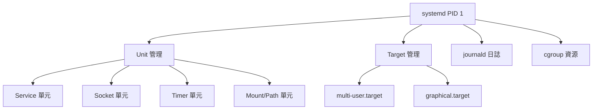
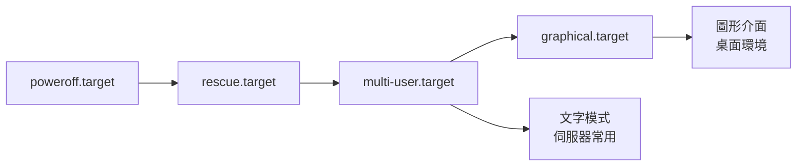

# 服務與系統初始化 (systemd)

## 目錄
- [主題簡介](#主題簡介)
- [systemd 架構](#systemd-架構)
- [Unit 類型與管理](#unit-類型與管理)
- [服務管理](#服務管理)
- [Target 與啟動流程](#target-與啟動流程)
- [日誌管理 journalctl](#日誌管理-journalctl)
- [自訂服務](#自訂服務)
- [常見問題與排查](#常見問題與排查)
- [最佳實踐](#最佳實踐)

---

## 主題簡介

systemd 是現代 Linux 的系統初始化與服務管理器 (PID 1),取代傳統 SysVinit,提供並行啟動、依賴管理、日誌整合等進階功能。

---

## systemd 架構



---

## Unit 類型與管理

### 常見 Unit 類型

| 類型 | 說明 | 範例 |
|------|------|------|
| service | 服務程序 | nginx.service |
| socket | Socket 啟動 | sshd.socket |
| target | Unit 群組 | multi-user.target |
| timer | 定時任務 | logrotate.timer |
| mount | 掛載點 | home.mount |
| path | 路徑監控 | cups.path |
| device | 裝置單元 | dev-sda.device |
| slice | 資源群組 | user.slice |

### Unit 檔案位置

```bash
# 系統 Unit (不可修改)
/usr/lib/systemd/system/

# 系統自訂 Unit
/etc/systemd/system/

# 執行時 Unit
/run/systemd/system/

# 優先順序: /etc > /run > /usr/lib
```

---

## 服務管理

### 基本命令

```bash
# 啟動服務
sudo systemctl start nginx

# 停止服務
sudo systemctl stop nginx

# 重啟服務
sudo systemctl restart nginx

# 重新載入設定 (不中斷)
sudo systemctl reload nginx

# 查看狀態
systemctl status nginx
# ● nginx.service - A high performance web server
#    Loaded: loaded (/usr/lib/systemd/system/nginx.service; enabled)
#    Active: active (running) since Wed 2025-11-08 10:00:00; 1h ago
#   Process: 1234 ExecStart=/usr/sbin/nginx
#  Main PID: 1234 (nginx)
#     Tasks: 2
#    Memory: 5.2M
#    CGroup: /system.slice/nginx.service
#            ├─1234 nginx: master process
#            └─1235 nginx: worker process

# 開機自動啟動
sudo systemctl enable nginx
# 建立符號連結: /etc/systemd/system/multi-user.target.wants/nginx.service

# 停用開機自啟
sudo systemctl disable nginx

# 啟用並立即啟動
sudo systemctl enable --now nginx

# 檢查是否啟用
systemctl is-enabled nginx

# 檢查是否運行
systemctl is-active nginx
```

### 列表與篩選

```bash
# 列出所有 Unit
systemctl list-units

# 列出所有服務
systemctl list-units --type=service

# 列出失敗的服務
systemctl list-units --failed

# 列出所有 Unit 檔案
systemctl list-unit-files

# 列出啟用的服務
systemctl list-unit-files --state=enabled

# 列出依賴
systemctl list-dependencies nginx
```

---

## Target 與啟動流程

### 主要 Target



| Target | 說明 | 等同 Runlevel |
|--------|------|--------------|
| poweroff.target | 關機 | 0 |
| rescue.target | 單人救援模式 | 1 |
| multi-user.target | 多用戶文字模式 | 3 |
| graphical.target | 圖形介面 | 5 |
| reboot.target | 重啟 | 6 |

### Target 管理

```bash
# 查看預設 target
systemctl get-default

# 設定預設 target
sudo systemctl set-default multi-user.target

# 切換 target (不重啟)
sudo systemctl isolate graphical.target

# 進入救援模式
sudo systemctl rescue

# 進入緊急模式
sudo systemctl emergency
```

---

## 日誌管理 journalctl

### 基本查詢

```bash
# 查看所有日誌
journalctl

# 查看特定服務
journalctl -u nginx
journalctl -u nginx.service

# 實時監控 (類似 tail -f)
journalctl -f
journalctl -u nginx -f

# 本次啟動的日誌
journalctl -b
journalctl -b -1  # 上次啟動

# 指定時間範圍
journalctl --since "2025-11-08 10:00:00"
journalctl --since today
journalctl --since yesterday
journalctl --since "1 hour ago"
journalctl --until "2025-11-08 12:00:00"

# 最近 N 行
journalctl -n 50
journalctl -n 100 -u nginx

# 反向顯示 (最新在前)
journalctl -r
```

### 進階篩選

```bash
# 依優先級篩選
journalctl -p err  # 只顯示錯誤
journalctl -p warning

# 依 PID
journalctl _PID=1234

# 依執行檔
journalctl /usr/bin/nginx

# 組合條件
journalctl -u nginx --since today -p err

# JSON 輸出
journalctl -u nginx -o json-pretty

# 查看核心訊息
journalctl -k
# 等同 dmesg
```

### 日誌管理

```bash
# 查看日誌佔用空間
journalctl --disk-usage

# 清理日誌
sudo journalctl --vacuum-time=7d  # 只保留 7 天
sudo journalctl --vacuum-size=100M  # 限制大小
sudo journalctl --vacuum-files=5  # 保留檔案數

# 驗證日誌完整性
sudo journalctl --verify
```

### 持久化設定

編輯 `/etc/systemd/journald.conf`:

```ini
[Journal]
# 儲存到磁碟
Storage=persistent

# 日誌大小限制
SystemMaxUse=500M
SystemKeepFree=1G

# 保留時間
MaxRetentionSec=7day

# 單檔大小
SystemMaxFileSize=100M
```

套用設定:
```bash
sudo systemctl restart systemd-journald
```

---

## 自訂服務

### Service Unit 基本結構

建立 `/etc/systemd/system/myapp.service`:

```ini
[Unit]
Description=My Application Service
Documentation=https://example.com/docs
After=network.target
Requires=postgresql.service
Wants=redis.service

[Service]
Type=simple
User=appuser
Group=appgroup
WorkingDirectory=/opt/myapp
ExecStart=/usr/bin/python3 /opt/myapp/server.py
ExecReload=/bin/kill -HUP $MAINPID
Restart=on-failure
RestartSec=3s

# 資源限制
MemoryMax=512M
CPUQuota=50%
TasksMax=100

# 安全加固
ProtectSystem=strict
ProtectHome=true
PrivateTmp=true
NoNewPrivileges=true
ReadWritePaths=/var/lib/myapp

[Install]
WantedBy=multi-user.target
```

### Unit 配置說明

#### [Unit] 區塊

| 參數 | 說明 |
|------|------|
| Description | 服務描述 |
| After | 在指定 Unit 之後啟動 |
| Before | 在指定 Unit 之前啟動 |
| Requires | 強依賴,失敗則本服務失敗 |
| Wants | 弱依賴,失敗不影響本服務 |

#### [Service] 區塊

| 參數 | 說明 |
|------|------|
| Type | simple/forking/oneshot/notify/dbus |
| ExecStart | 啟動命令 |
| ExecStop | 停止命令 |
| ExecReload | 重載命令 |
| Restart | no/on-failure/always/on-abnormal |
| RestartSec | 重啟間隔 |
| User/Group | 執行身份 |

#### 資源限制

```ini
MemoryMax=1G
MemoryHigh=800M
CPUQuota=50%
TasksMax=200
IOWeight=500
```

#### 安全加固

```ini
ProtectSystem=strict  # 唯讀 /usr, /boot, /efi
ProtectHome=true      # 無法存取 /home
PrivateTmp=true       # 獨立 /tmp
NoNewPrivileges=true  # 禁止提權
ReadOnlyPaths=/etc
ReadWritePaths=/var/lib/myapp
```

### 啟用自訂服務

```bash
# 重新載入 systemd
sudo systemctl daemon-reload

# 啟動服務
sudo systemctl start myapp

# 檢查狀態
systemctl status myapp

# 開機自啟
sudo systemctl enable myapp

# 查看完整設定
systemctl cat myapp
```

### Timer 定時任務

建立 `/etc/systemd/system/backup.service`:

```ini
[Unit]
Description=Backup Job

[Service]
Type=oneshot
ExecStart=/usr/local/bin/backup.sh
```

建立 `/etc/systemd/system/backup.timer`:

```ini
[Unit]
Description=Daily Backup Timer

[Timer]
OnCalendar=daily
OnCalendar=*-*-* 02:00:00
Persistent=true

[Install]
WantedBy=timers.target
```

啟用 Timer:

```bash
sudo systemctl daemon-reload
sudo systemctl enable --now backup.timer

# 查看 Timer
systemctl list-timers
```

---

## 常見問題與排查

### 服務啟動失敗

```bash
# 1. 查看狀態
systemctl status myapp

# 2. 查看詳細日誌
journalctl -xeu myapp

# 3. 檢查 Unit 檔案語法
systemd-analyze verify myapp.service

# 4. 查看依賴
systemctl list-dependencies myapp

# 5. 手動測試命令
sudo -u appuser /usr/bin/python3 /opt/myapp/server.py
```

### 循環依賴

```bash
# 查看啟動關鍵路徑
systemd-analyze critical-chain

# 查看啟動時間
systemd-analyze blame

# 繪製啟動流程圖
systemd-analyze plot > boot.svg
```

### 服務無法停止

```bash
# 強制終止
sudo systemctl kill -s SIGKILL myapp

# 查看程序樹
systemctl status myapp
pstree -p $(systemctl show -p MainPID --value myapp)
```

---

## 最佳實踐

### 服務設計原則

1. **使用專用使用者**
   ```ini
   [Service]
   User=appuser
   Group=appgroup
   ```

2. **資源限制**
   ```ini
   MemoryMax=1G
   CPUQuota=50%
   ```

3. **自動重啟**
   ```ini
   Restart=on-failure
   RestartSec=5s
   StartLimitBurst=5
   StartLimitIntervalSec=60s
   ```

4. **安全加固**
   ```ini
   ProtectSystem=strict
   ProtectHome=true
   PrivateTmp=true
   NoNewPrivileges=true
   ```

### 日誌最佳實踐

- 定期清理日誌避免磁碟爆滿
- 重要服務設定日誌保留時間
- 使用 `journalctl -f -u service` 實時監控
- 整合外部日誌系統 (ELK, Splunk)

### 服務管理流程

```bash
# 開發/測試
1. 建立 Unit 檔案
2. daemon-reload
3. 測試啟動: systemctl start
4. 檢查狀態與日誌
5. 修正問題

# 生產部署
1. 設定資源限制
2. 安全加固
3. enable 開機自啟
4. 監控與告警
```

---

## 參考資料

- [systemd Documentation](https://www.freedesktop.org/wiki/Software/systemd/)
- [systemd.service Manual](https://www.freedesktop.org/software/systemd/man/systemd.service.html)
- [Arch Wiki - systemd](https://wiki.archlinux.org/title/Systemd)
