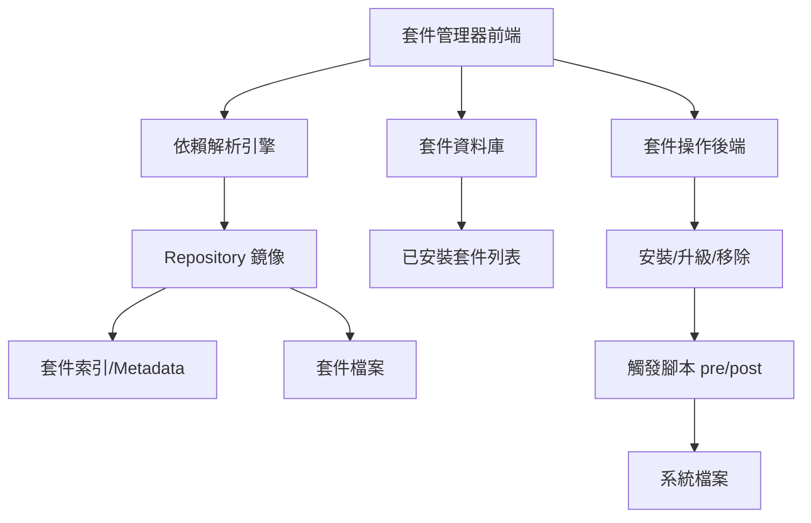
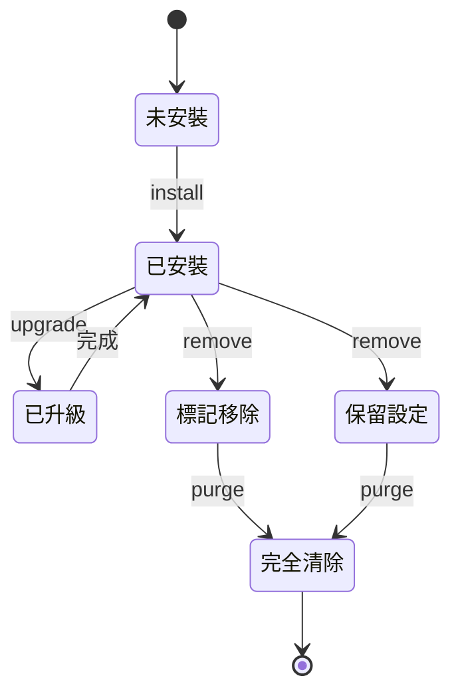
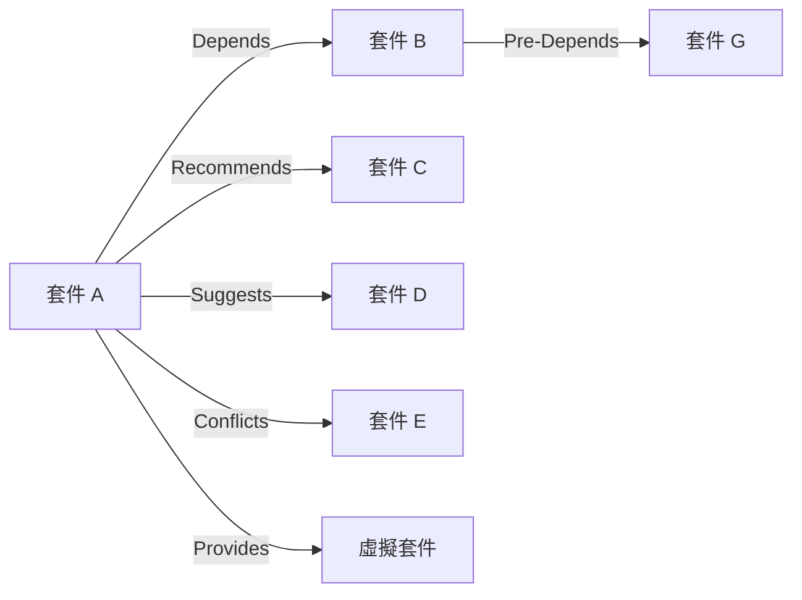

# 套件與軟體管理

## 目錄
- [概述](#概述)
- [核心原理與架構](#核心原理與架構)
- [主流套件管理器](#主流套件管理器)
- [常用操作與命令](#常用操作與命令)
- [依賴關係管理](#依賴關係管理)
- [Repository 管理](#repository-管理)
- [故障排查](#故障排查)
- [最佳實踐](#最佳實踐)
- [實戰案例](#實戰案例)

---

## 概述

套件管理系統是 Linux 發行版的核心組件，負責軟體的安裝、升級、移除與依賴管理。理解套件管理機制對於系統維護、自動化部署與故障排查至關重要。

**核心功能：**
- 自動化軟體安裝與升級
- 依賴關係解析與處理
- 軟體版本控制
- 系統完整性驗證
- 軟體源（Repository）管理

---

## 核心原理與架構

### 套件管理系統架構



### 套件格式對比

| 發行版                | 格式           | 高階工具         | 低階工具    | 特點          |
| ------------------ | ------------ | ------------ | ------- | ----------- |
| Debian/Ubuntu      | .deb         | apt, apt-get | dpkg    | 成熟穩定，社群活躍   |
| RHEL/CentOS/Fedora | .rpm         | dnf, yum     | rpm     | 企業級支援，模組化   |
| Arch Linux         | .pkg.tar.zst | pacman       | makepkg | 滾動更新，AUR 生態 |
| openSUSE           | .rpm         | zypper       | rpm     | 強大的依賴解析     |

### 套件生命週期



---

## 主流套件管理器

### APT (Debian/Ubuntu)

#### 核心組件
- **apt**: 現代化高階介面
- **apt-get**: 傳統高階工具
- **dpkg**: 底層套件管理
- **apt-cache**: 套件資訊查詢

#### 基本操作

**更新套件索引：**
```bash
$ sudo apt update
```
**輸出：**
```
Hit:1 http://archive.ubuntu.com/ubuntu jammy InRelease
Get:2 http://archive.ubuntu.com/ubuntu jammy-updates InRelease [119 kB]
Reading package lists... Done
Building dependency tree... Done
All packages are up to date.
```

**安裝套件：**
```bash
$ sudo apt install nginx
```
**輸出：**
```
Reading package lists... Done
Building dependency tree... Done
The following additional packages will be installed:
  nginx-common nginx-core
Suggested packages:
  fcgiwrap nginx-doc
The following NEW packages will be installed:
  nginx nginx-common nginx-core
0 upgraded, 3 newly installed, 0 to remove and 0 not upgraded.
Need to get 604 kB of archives.
After this operation, 2,118 kB of additional disk space will be used.
Do you want to continue? [Y/n]
```

**搜尋套件：**
```bash
$ apt search nginx
$ apt-cache search nginx
```

**查看套件資訊：**
```bash
$ apt show nginx
```
**輸出：**
```
Package: nginx
Version: 1.18.0-6ubuntu14.3
Priority: optional
Section: web
Maintainer: Ubuntu Developers
Installed-Size: 48.1 kB
Depends: nginx-core | nginx-full | nginx-light | nginx-extras
Homepage: https://nginx.org
```

**列出已安裝套件：**
```bash
$ dpkg -l | grep nginx
$ apt list --installed | grep nginx
```

**移除套件：**
```bash
$ sudo apt remove nginx          # 保留設定檔
$ sudo apt purge nginx           # 完全移除包含設定
$ sudo apt autoremove            # 移除不再需要的依賴
```

**套件升級：**
```bash
$ sudo apt upgrade               # 升級已安裝套件
$ sudo apt full-upgrade          # 升級並處理依賴變更
$ sudo apt dist-upgrade          # 舊命令，同 full-upgrade
```

**查詢套件檔案：**
```bash
$ dpkg -L nginx                  # 列出套件安裝的檔案
$ dpkg -S /usr/sbin/nginx        # 查詢檔案屬於哪個套件
```

**鎖定套件版本：**
```bash
$ sudo apt-mark hold nginx       # 防止套件被升級
$ sudo apt-mark unhold nginx     # 解除鎖定
$ apt-mark showhold              # 顯示被鎖定的套件
```

---

### DNF/YUM (RHEL/CentOS/Fedora)

#### 核心特性
- **dnf**: YUM 的現代化替代品（Fedora 22+）
- **模組化**: 支援軟體模組流（Module Streams）
- **rpm**: 底層套件管理

#### 基本操作

**安裝套件：**
```bash
$ sudo dnf install httpd
```
**輸出：**
```
Dependencies resolved.
================================================================================
 Package           Arch       Version              Repository           Size
================================================================================
Installing:
 httpd             x86_64     2.4.53-7.el9         appstream            1.5 M
Installing dependencies:
 apr               x86_64     1.7.0-11.el9         appstream            125 k
 apr-util          x86_64     1.6.1-20.el9         appstream             96 k
Transaction Summary
================================================================================
Install  3 Packages
Total download size: 1.7 M
Installed size: 5.4 M
Is this ok [y/N]:
```

**搜尋與查詢：**
```bash
$ dnf search httpd
$ dnf info httpd
$ dnf list installed
$ dnf list available
```

**升級管理：**
```bash
$ sudo dnf upgrade               # 升級所有套件
$ sudo dnf upgrade httpd         # 升級特定套件
$ sudo dnf check-update          # 檢查可用更新
```

**移除套件：**
```bash
$ sudo dnf remove httpd
$ sudo dnf autoremove            # 移除孤兒依賴
```

**查詢套件檔案：**
```bash
$ rpm -ql httpd                  # 列出套件檔案
$ rpm -qf /usr/sbin/httpd        # 查詢檔案所屬套件
$ dnf provides /usr/sbin/httpd   # 查詢提供檔案的套件
```

**群組安裝：**
```bash
$ dnf group list                 # 列出套件組
$ sudo dnf group install "Development Tools"
```

**模組管理（DNF 特性）：**
```bash
$ dnf module list                # 列出模組
$ dnf module list nodejs         # 查看特定模組的版本流
$ sudo dnf module install nodejs:18/common  # 安裝特定版本
$ sudo dnf module reset nodejs   # 重置模組選擇
```

**歷史管理：**
```bash
$ dnf history                    # 查看操作歷史
$ dnf history info 5             # 查看特定操作詳情
$ sudo dnf history undo 5        # 撤銷特定操作
```

---

### Pacman (Arch Linux)

#### 核心特點
- 滾動更新模式
- AUR (Arch User Repository) 社群套件
- 極簡設計哲學

#### 基本操作

**同步並安裝：**
```bash
$ sudo pacman -S nginx           # 安裝套件
$ sudo pacman -Syu               # 系統完整升級
$ sudo pacman -Sy                # 僅同步資料庫（不建議單獨使用）
```

**搜尋與查詢：**
```bash
$ pacman -Ss nginx               # 搜尋遠端套件
$ pacman -Qs nginx               # 搜尋本地已安裝
$ pacman -Si nginx               # 顯示遠端套件資訊
$ pacman -Qi nginx               # 顯示本地套件資訊
```

**移除套件：**
```bash
$ sudo pacman -R nginx           # 移除套件
$ sudo pacman -Rs nginx          # 移除套件及其依賴
$ sudo pacman -Rns nginx         # 移除套件、依賴及設定檔
```

**清理系統：**
```bash
$ sudo pacman -Sc                # 清理未安裝套件的快取
$ sudo pacman -Scc               # 清理所有快取
$ pacman -Qdt                    # 列出孤兒套件
$ sudo pacman -Rns $(pacman -Qdtq)  # 移除所有孤兒套件
```

**查詢檔案：**
```bash
$ pacman -Ql nginx               # 列出套件檔案
$ pacman -Qo /usr/bin/nginx      # 查詢檔案所屬套件
$ pacman -F nginx                # 搜尋包含特定檔案的套件（需 pacman -Fy）
```

**AUR 套件管理（需 AUR helper）：**
```bash
$ yay -S package-name            # 使用 yay 安裝 AUR 套件
$ paru -S package-name           # 使用 paru 安裝
```

---

## 常用操作與命令

### 跨發行版常見任務對照

| 任務 | Debian/Ubuntu | RHEL/Fedora | Arch Linux |
|------|---------------|-------------|------------|
| 更新索引 | `apt update` | `dnf check-update` | `pacman -Sy` |
| 安裝套件 | `apt install PKG` | `dnf install PKG` | `pacman -S PKG` |
| 移除套件 | `apt remove PKG` | `dnf remove PKG` | `pacman -R PKG` |
| 搜尋套件 | `apt search PKG` | `dnf search PKG` | `pacman -Ss PKG` |
| 升級系統 | `apt upgrade` | `dnf upgrade` | `pacman -Syu` |
| 清理快取 | `apt clean` | `dnf clean all` | `pacman -Sc` |
| 列出檔案 | `dpkg -L PKG` | `rpm -ql PKG` | `pacman -Ql PKG` |
| 檔案所屬 | `dpkg -S FILE` | `rpm -qf FILE` | `pacman -Qo FILE` |

---

## 依賴關係管理

### 依賴類型



**依賴關係說明：**
- **Depends**: 必須依賴，安裝時自動安裝
- **Recommends**: 建議依賴，預設安裝但可選擇不裝
- **Suggests**: 建議套件，不會自動安裝
- **Conflicts**: 衝突套件，不能同時安裝
- **Provides**: 提供虛擬套件功能
- **Pre-Depends**: 必須在本套件之前安裝

### 依賴查詢

**APT 系統：**
```bash
$ apt-cache depends nginx        # 查看依賴
$ apt-cache rdepends nginx       # 查看反向依賴（誰依賴它）
$ apt-cache showpkg nginx        # 詳細依賴資訊
```

**DNF 系統：**
```bash
$ dnf repoquery --requires nginx
$ dnf repoquery --whatrequires nginx
$ dnf deplist nginx
```

**Pacman 系統：**
```bash
$ pactree nginx                  # 顯示依賴樹
$ pactree -r nginx               # 反向依賴樹
```

### 解決依賴問題

**場景 1: 破損的依賴**
```bash
# APT
$ sudo apt --fix-broken install
$ sudo dpkg --configure -a

# DNF
$ sudo dnf check
$ sudo dnf distro-sync

# Pacman
$ sudo pacman -Syu --overwrite '*'
```

**場景 2: 版本衝突**
```bash
# 查看可用版本
$ apt-cache policy nginx

# 安裝特定版本
$ sudo apt install nginx=1.18.0-6ubuntu14.3

# DNF 安裝特定版本
$ sudo dnf install nginx-1.20.1
```

---

## Repository 管理

### Repository 配置

**APT Sources (Debian/Ubuntu):**

檔案位置：`/etc/apt/sources.list` 或 `/etc/apt/sources.list.d/*.list`

```bash
# 格式：
# deb [選項] URL 發行版 組件
deb http://archive.ubuntu.com/ubuntu jammy main restricted
deb http://archive.ubuntu.com/ubuntu jammy-updates main restricted
deb http://security.ubuntu.com/ubuntu jammy-security main restricted

# 添加 PPA
$ sudo add-apt-repository ppa:nginx/stable
$ sudo apt update
```

**DNF Repository (RHEL/Fedora):**

檔案位置：`/etc/yum.repos.d/*.repo`

```ini
[nginx]
name=Nginx Repository
baseurl=http://nginx.org/packages/rhel/$releasever/$basearch/
gpgcheck=1
enabled=1
gpgkey=https://nginx.org/keys/nginx_signing.key
```

```bash
# 管理 repo
$ dnf repolist                   # 列出啟用的 repo
$ dnf repolist --all             # 列出所有 repo
$ sudo dnf config-manager --add-repo URL
$ sudo dnf config-manager --set-enabled repo-id
$ sudo dnf config-manager --set-disabled repo-id
```

**Pacman Mirrors (Arch):**

檔案位置：`/etc/pacman.conf` 和 `/etc/pacman.d/mirrorlist`

```bash
# 更新鏡像列表
$ sudo reflector --country Taiwan --age 12 --protocol https --sort rate --save /etc/pacman.d/mirrorlist

# 啟用/停用 repo（編輯 /etc/pacman.conf）
[core]
Include = /etc/pacman.d/mirrorlist

[multilib]  # 32位元套件
Include = /etc/pacman.d/mirrorlist
```

### 建立本地 Repository

**APT 本地 Repo:**
```bash
$ sudo apt install reprepro

$ mkdir -p /srv/apt-repo/{conf,incoming}
$ cat > /srv/apt-repo/conf/distributions <<EOF
Codename: jammy
Components: main
Architectures: amd64
EOF

# 添加套件
$ reprepro -b /srv/apt-repo includedeb jammy package.deb

# 客戶端配置
$ echo "deb [trusted=yes] file:///srv/apt-repo jammy main" | sudo tee /etc/apt/sources.list.d/local.list
```

**DNF 本地 Repo:**
```bash
$ sudo dnf install createrepo

$ mkdir -p /srv/dnf-repo
$ cp *.rpm /srv/dnf-repo/
$ createrepo /srv/dnf-repo/

# 更新 repo
$ createrepo --update /srv/dnf-repo/

# 客戶端配置
$ cat > /etc/yum.repos.d/local.repo <<EOF
[local]
name=Local Repository
baseurl=file:///srv/dnf-repo
enabled=1
gpgcheck=0
EOF
```

---

## 故障排查

### 常見問題與解決方案

#### 問題 1: 鎖定檔案錯誤

**症狀：**
```
E: Could not get lock /var/lib/dpkg/lock-frontend
```

**原因：** 其他套件管理程序正在執行或異常中斷

**解決方法：**
```bash
# 檢查程序
$ ps aux | grep -E 'apt|dpkg'

# 確認無程序後移除鎖定
$ sudo rm /var/lib/dpkg/lock-frontend
$ sudo rm /var/lib/dpkg/lock
$ sudo rm /var/cache/apt/archives/lock

# 修復套件狀態
$ sudo dpkg --configure -a
$ sudo apt --fix-broken install
```

#### 問題 2: 依賴問題

**症狀：**
```
The following packages have unmet dependencies:
 nginx : Depends: nginx-core but it is not going to be installed
```

**解決方法：**
```bash
# 嘗試自動修復
$ sudo apt --fix-broken install

# 手動安裝依賴
$ sudo apt install nginx-core

# 查看詳細錯誤
$ sudo apt install nginx -o Debug::pkgProblemResolver=yes

# 強制安裝（謹慎使用）
$ sudo dpkg -i --force-depends package.deb
```

#### 問題 3: GPG 金鑰錯誤

**症狀：**
```
GPG error: The following signatures couldn't be verified
```

**解決方法：**
```bash
# APT
$ sudo apt-key adv --keyserver keyserver.ubuntu.com --recv-keys KEY_ID

# 現代方式（推薦）
$ wget -qO- URL/key.gpg | sudo gpg --dearmor -o /usr/share/keyrings/repo-keyring.gpg
$ echo "deb [signed-by=/usr/share/keyrings/repo-keyring.gpg] URL ..." | sudo tee /etc/apt/sources.list.d/repo.list

# DNF
$ sudo rpm --import https://example.com/RPM-GPG-KEY

# Pacman
$ sudo pacman-key --recv-keys KEY_ID
$ sudo pacman-key --lsign-key KEY_ID
```

#### 問題 4: 套件資料庫損壞

**DNF/RPM:**
```bash
$ sudo rpm --rebuilddb
$ sudo dnf clean all
$ sudo dnf makecache
```

**Pacman:**
```bash
$ sudo rm /var/lib/pacman/db.lck
$ sudo pacman -Syy
$ sudo pacman-db-upgrade
```

#### 問題 5: 磁碟空間不足

**檢查與清理：**
```bash
# 檢查空間
$ df -h /var

# APT 清理
$ sudo apt clean                 # 清理下載快取
$ sudo apt autoclean             # 清理舊版本快取
$ sudo apt autoremove            # 移除不需要的套件

# DNF 清理
$ sudo dnf clean all
$ sudo dnf autoremove

# Pacman 清理
$ sudo pacman -Sc                # 清理未安裝套件快取
$ sudo pacman -Rns $(pacman -Qdtq)  # 移除孤兒套件

# 查找大型套件
$ dpkg-query -Wf '${Installed-Size}\t${Package}\n' | sort -n | tail -20
```

### 日誌檢查

```bash
# APT 日誌
$ cat /var/log/apt/history.log
$ cat /var/log/apt/term.log
$ cat /var/log/dpkg.log

# DNF 日誌
$ cat /var/log/dnf.log
$ cat /var/log/dnf.rpm.log

# Pacman 日誌
$ cat /var/log/pacman.log
```

---

## 最佳實踐

### 安全性建議

1. **定期更新系統**
```bash
# 建立自動更新腳本
$ sudo apt install unattended-upgrades  # Debian/Ubuntu
$ sudo dnf install dnf-automatic        # RHEL/Fedora
```

2. **驗證套件來源**
```bash
# 檢查套件簽章
$ apt-cache policy nginx
$ dnf info nginx

# 僅使用可信任的 repo
$ sudo apt-key list
$ rpm -qa gpg-pubkey*
```

3. **最小化安裝**
```bash
# 僅安裝必要套件
$ sudo apt install --no-install-recommends package

# 定期清理
$ sudo apt autoremove
```

### 版本管理策略

**鎖定關鍵套件版本：**
```bash
# APT
$ sudo apt-mark hold nginx

# DNF
$ sudo dnf versionlock add nginx

# 查看鎖定清單
$ apt-mark showhold
$ dnf versionlock list
```

**測試升級影響：**
```bash
# APT 模擬升級
$ apt list --upgradable
$ sudo apt upgrade --dry-run

# DNF 模擬
$ sudo dnf upgrade --assumeno
```

### 企業環境最佳實踐

1. **使用內部鏡像源**
   - 減少外網依賴
   - 提升下載速度
   - 控制套件版本

2. **套件審核流程**
   - 測試環境驗證
   - 安全掃描
   - 版本凍結

3. **自動化管理**
```bash
# Ansible 範例
- name: Install packages
  apt:
    name:
      - nginx
      - postgresql
    state: present
    update_cache: yes
```

4. **監控與告警**
```bash
# 檢查可用更新
$ apt list --upgradable | wc -l

# 檢查安全更新
$ unattended-upgrade --dry-run
```

---

## 實戰案例

### 案例 1: 降級套件版本

**場景：** 新版本套件引入 bug，需要降級

```bash
# APT 降級
$ apt-cache policy nginx
$ sudo apt install nginx=1.18.0-0ubuntu1

# 防止自動升級
$ sudo apt-mark hold nginx

# DNF 降級
$ dnf list nginx --showduplicates
$ sudo dnf downgrade nginx-1.20.1

# Pacman 降級
$ sudo pacman -U /var/cache/pacman/pkg/nginx-1.20.1-1-x86_64.pkg.tar.zst
```

### 案例 2: 遷移套件管理系統

**場景：** 從 CentOS 遷移到 Ubuntu

```bash
# 1. 導出已安裝套件清單（CentOS）
$ rpm -qa > installed-packages.txt

# 2. 轉換套件名稱（手動或腳本）
# httpd -> apache2
# mariadb-server -> mysql-server

# 3. 批次安裝（Ubuntu）
$ cat ubuntu-packages.txt | xargs sudo apt install -y
```

### 案例 3: 修復破損的系統升級

**場景：** 升級過程中斷電，系統套件狀態異常

```bash
# APT 修復流程
$ sudo dpkg --configure -a
$ sudo apt --fix-broken install
$ sudo apt update
$ sudo apt upgrade

# 檢查套件完整性
$ sudo debsums -c

# 重新安裝損壞套件
$ sudo apt install --reinstall package-name
```

### 案例 4: 建立離線安裝包

**場景：** 無網路環境安裝套件

```bash
# APT 下載套件及依賴
$ mkdir offline-packages
$ cd offline-packages
$ apt download $(apt-rdepends nginx | grep -v "^ ")

# 傳輸到離線機器後安裝
$ sudo dpkg -i *.deb

# DNF 下載
$ dnf download --resolve nginx
$ sudo rpm -Uvh *.rpm
```

### 案例 5: 清理殘留設定

**場景：** 移除套件後仍有設定檔殘留

```bash
# 查找殘留設定的套件
$ dpkg -l | grep ^rc

# 清除所有殘留設定
$ dpkg -l | grep ^rc | awk '{print $2}' | sudo xargs dpkg --purge

# 或使用 apt
$ sudo apt purge $(dpkg -l | grep ^rc | awk '{print $2}')
```

### 案例 6: 多版本軟體共存

**場景：** 需要同時安裝 Python 3.9 和 3.11

```bash
# 使用 update-alternatives
$ sudo update-alternatives --install /usr/bin/python3 python3 /usr/bin/python3.9 1
$ sudo update-alternatives --install /usr/bin/python3 python3 /usr/bin/python3.11 2

# 切換版本
$ sudo update-alternatives --config python3

# 查看當前版本
$ update-alternatives --display python3
```

---

## 進階技巧

### 套件打包

**建立 DEB 套件：**
```bash
$ mkdir -p mypackage/DEBIAN
$ cat > mypackage/DEBIAN/control <<EOF
Package: myapp
Version: 1.0
Architecture: amd64
Maintainer: Your Name
Description: My Application
EOF

$ mkdir -p mypackage/usr/local/bin
$ cp myapp mypackage/usr/local/bin/
$ dpkg-deb --build mypackage
```

**建立 RPM 套件：**
```bash
$ rpmdev-setuptree
$ cp myapp.tar.gz ~/rpmbuild/SOURCES/
$ cat > ~/rpmbuild/SPECS/myapp.spec <<EOF
Name: myapp
Version: 1.0
Release: 1%{?dist}
Summary: My Application
License: MIT
Source0: %{name}-%{version}.tar.gz
%description
My Application Description
%prep
%setup -q
%build
make %{?_smp_mflags}
%install
make install DESTDIR=%{buildroot}
EOF

$ rpmbuild -ba ~/rpmbuild/SPECS/myapp.spec
```

### 套件快取管理

**APT Cache Proxy (apt-cacher-ng):**
```bash
$ sudo apt install apt-cacher-ng

# 客戶端配置
$ echo 'Acquire::http::Proxy "http://cache-server:3142";' | sudo tee /etc/apt/apt.conf.d/00proxy
```

**DNF 本地快取：**
```bash
$ sudo dnf config-manager --setopt=keepcache=1 --save
```

### 自訂安裝腳本

**Postinstall Script (DEB):**
```bash
$ cat > mypackage/DEBIAN/postinst <<'EOF'
#!/bin/bash
systemctl enable myapp
systemctl start myapp
EOF
$ chmod 755 mypackage/DEBIAN/postinst
```

---

> **參考資料：**
> - Debian Policy Manual
> - Fedora Packaging Guidelines
> - Arch Linux Package Guidelines
> - 企業運維最佳實踐
