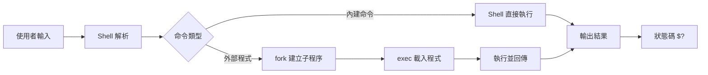
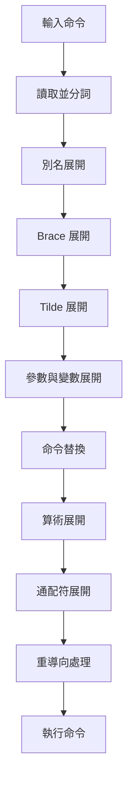

# Shell與腳本開發

## 目錄
- [概述](#概述)
- [Shell 原理與架構](#shell-原理與架構)
- [Bash 腳本基礎](#bash-腳本基礎)
- [進階語法與技巧](#進階語法與技巧)
- [文字處理工具](#文字處理工具)
- [錯誤處理與除錯](#錯誤處理與除錯)
- [自動化與任務排程](#自動化與任務排程)
- [最佳實踐](#最佳實踐)
- [實戰案例](#實戰案例)

---

## 概述

Shell 是 Linux 使用者與核心之間的介面,負責解釋命令並調用系統資源。Bash（Bourne Again Shell）作為最廣泛使用的 Shell,提供強大的腳本編程能力,是系統管理與自動化的基礎工具。

**核心應用場景：**
- 系統管理自動化
- 批次檔案處理
- 日誌分析與監控
- CI/CD 流程整合
- 備份與災難復原

---

## Shell 原理與架構

### Shell 執行流程



### Shell 類型對比

| Shell | 特點          | 適用場景                 | 設定檔                            |
| ----- | ----------- | -------------------- | ------------------------------ |
| bash  | 功能完整,相容性佳   | 系統腳本、通用自動化           | `~/.bashrc`, `~/.bash_profile` |
| zsh   | 強大補全,可客製化   | 開發環境、互動操作            | `~/.zshrc`                     |
| sh    | POSIX 標準,極簡 | 可攜性腳本、嵌入式            | N/A                            |
| fish  | 現代化設計,使用者友善 | 互動式使用                | `~/.config/fish/`              |
| dash  | 輕量快速        | Ubuntu 系統腳本（/bin/sh） | N/A                            |

**查看當前 Shell：**
```bash
$ echo $SHELL
/bin/bash

$ ps -p $$
  PID TTY          TIME CMD
 1234 pts/0    00:00:00 bash
```

### 命令解析流程



**範例：**
```bash
$ echo ~/{foo,bar}/file*.txt
/home/user/foo/file1.txt /home/user/foo/file2.txt /home/user/bar/file1.txt
```

---

## Bash 腳本基礎

### Shebang 與執行權限

```bash
#!/usr/bin/env bash

echo "Hello, World!"
```

**設定執行權限：**
```bash
$ chmod +x script.sh
$ ./script.sh
Hello, World!
```

**執行方式對比：**
```bash
$ ./script.sh          # 使用 shebang 指定的 shell
$ bash script.sh       # 明確使用 bash
$ source script.sh     # 在當前 shell 執行（影響環境變數）
$ . script.sh          # source 的簡寫
```

### 變數與參數

#### 變數操作

```bash
NAME="Alice"
COUNT=42

echo $NAME              # Alice
echo ${NAME}            # 建議寫法
echo "${NAME}"          # 包含空格時必須用引號

readonly PI=3.14159
PI=3.14                 # 錯誤：cannot assign

unset NAME
```

#### 特殊變數

| 變數 | 說明 | 範例 |
|------|------|------|
| `$0` | 腳本名稱 | `./script.sh` |
| `$1, $2, ...` | 位置參數 | 第1、2個參數 |
| `$#` | 參數數量 | `3` |
| `$@` | 所有參數（陣列） | `"arg1" "arg2" "arg3"` |
| `$*` | 所有參數（字串） | `"arg1 arg2 arg3"` |
| `$?` | 上個命令退出狀態 | `0`（成功）或非0（失敗） |
| `$$` | 當前程序 PID | `12345` |
| `$!` | 背景程序 PID | `12346` |
| `$_` | 上個命令的最後參數 | `/tmp/file` |

**範例：**
```bash
#!/usr/bin/env bash

echo "腳本名稱: $0"
echo "參數數量: $#"
echo "所有參數: $@"
echo "第一個參數: $1"
```

#### 變數替換與預設值

```bash
echo ${VAR:-default}         # VAR 未設或為空,使用 default
echo ${VAR:=default}         # VAR 未設或為空,設為 default 並回傳
echo ${VAR:+alternative}     # VAR 已設且非空,使用 alternative
echo ${VAR:?error message}   # VAR 未設或為空,顯示錯誤並退出

FILE="/path/to/file.txt"
echo ${FILE#*/}              # 移除最短匹配前綴: path/to/file.txt
echo ${FILE##*/}             # 移除最長匹配前綴: file.txt (basename)
echo ${FILE%/*}              # 移除最短匹配後綴: /path/to (dirname)
echo ${FILE%%/*}             # 移除最長匹配後綴: (空)
echo ${FILE/txt/md}          # 替換第一個: /path/to/file.md
echo ${FILE//txt/md}         # 替換全部

STRING="Hello World"
echo ${#STRING}              # 長度: 11
echo ${STRING:0:5}           # 截取: Hello
echo ${STRING:6}             # 從第6位開始: World
```

### 陣列

```bash
ARRAY=(apple banana cherry)
ARRAY[3]="date"

echo ${ARRAY[0]}             # apple
echo ${ARRAY[@]}             # 所有元素
echo ${#ARRAY[@]}            # 元素數量: 4

for fruit in "${ARRAY[@]}"; do
    echo "Fruit: $fruit"
done

declare -A DICT
DICT[name]="Alice"
DICT[age]=30
echo ${DICT[name]}           # Alice
echo ${!DICT[@]}             # 所有鍵: name age
```

### 條件判斷

#### test 命令與 []

```bash
[ -e file ]      # 檔案存在
[ -f file ]      # 是普通檔案
[ -d dir ]       # 是目錄
[ -r file ]      # 可讀
[ -w file ]      # 可寫
[ -x file ]      # 可執行
[ -s file ]      # 檔案非空
[ -L link ]      # 是符號連結
[ file1 -nt file2 ]  # file1 比 file2 新
[ file1 -ot file2 ]  # file1 比 file2 舊

[ -z "$str" ]    # 字串為空
[ -n "$str" ]    # 字串非空
[ "$a" = "$b" ]  # 字串相等
[ "$a" != "$b" ] # 字串不等

[ "$a" -eq "$b" ]  # 相等
[ "$a" -ne "$b" ]  # 不等
[ "$a" -lt "$b" ]  # 小於
[ "$a" -le "$b" ]  # 小於等於
[ "$a" -gt "$b" ]  # 大於
[ "$a" -ge "$b" ]  # 大於等於

[ "$a" -eq 1 ] && [ "$b" -eq 2 ]  # AND
[ "$a" -eq 1 ] || [ "$b" -eq 2 ]  # OR
[ ! -f file ]                      # NOT
```

#### [[]] 進階條件（Bash 專用）

```bash
[[ $STRING =~ ^[0-9]+$ ]] && echo "是數字"

[[ $FILE == *.txt ]] && echo "是文字檔"

[[ $a -eq 1 && $b -eq 2 ]] && echo "都符合"
```

#### if/elif/else

```bash
if [ $# -lt 1 ]; then
    echo "用法: $0 <file>"
    exit 1
elif [ ! -f "$1" ]; then
    echo "錯誤: 檔案不存在"
    exit 2
else
    echo "處理檔案: $1"
    cat "$1"
fi
```

#### case 語句

```bash
case "$1" in
    start)
        echo "啟動服務"
        systemctl start myservice
        ;;
    stop)
        echo "停止服務"
        systemctl stop myservice
        ;;
    restart)
        echo "重啟服務"
        systemctl restart myservice
        ;;
    status)
        systemctl status myservice
        ;;
    *)
        echo "用法: $0 {start|stop|restart|status}"
        exit 1
        ;;
esac
```

### 迴圈

#### for 迴圈

```bash
for i in 1 2 3 4 5; do
    echo "Number: $i"
done

for i in {1..10}; do
    echo $i
done

for ((i=0; i<10; i++)); do
    echo $i
done

for file in *.txt; do
    echo "Processing: $file"
    cat "$file"
done

for user in $(cut -d: -f1 /etc/passwd); do
    echo "User: $user"
done
```

#### while 迴圈

```bash
i=1
while [ $i -le 5 ]; do
    echo "Iteration: $i"
    i=$((i + 1))
done

while IFS= read -r line; do
    echo "Line: $line"
done < file.txt
```

#### until 迴圈

```bash
i=1
until [ $i -gt 5 ]; do
    echo "Count: $i"
    i=$((i + 1))
done
```

### 函式

```bash
greet() {
    local name="$1"
    echo "Hello, $name!"
}

greet "Alice"

is_even() {
    [ $(($1 % 2)) -eq 0 ]
    return $?
}

if is_even 4; then
    echo "4 是偶數"
fi

get_username() {
    echo "admin"
}

USER=$(get_username)
echo "Username: $USER"
```

---

## 進階語法與技巧

### 輸入輸出重導向

```bash
echo "text" > file.txt       # 覆蓋
echo "text" >> file.txt      # 追加

command 2> error.log         # 錯誤輸出到檔案
command 2>&1                 # 錯誤合併到標準輸出
command &> all.log           # 標準輸出與錯誤都重導向
command > output.txt 2>&1    # 相同效果（舊寫法）

command < input.txt          # 從檔案讀取輸入
command <<< "string"         # Here String
command <<EOF                # Here Document
line 1
line 2
EOF

command > /dev/null 2>&1     # 丟棄所有輸出
```

### 管線與命令組合

```bash
cat file.txt | grep "pattern" | sort | uniq

command1 ; command2          # 依序執行
command1 && command2         # command1 成功才執行 command2
command1 || command2         # command1 失敗才執行 command2

(cd /tmp && ls)              # 在子 shell 執行,不影響當前目錄
echo "當前目錄: $(pwd)"       # 仍在原目錄

{ command1; command2; }      # 在當前 shell 執行
```

### 算術運算

```bash
((a = 5 + 3))
echo $a                      # 8

((a++))                      # 遞增
((a--))                      # 遞減

echo $((5 + 3))              # 8
echo $[5 * 3]                # 15（不推薦,使用 $(()) ）

let "a = 5 + 3"
let a++

a=$(expr 5 + 3)
```

### 程序控制

```bash
command &
echo "背景程序 PID: $!"

wait $!

trap 'echo "收到 SIGINT"; exit' INT
trap 'cleanup; exit' EXIT

cleanup() {
    echo "清理暫存檔..."
    rm -f /tmp/tempfile
}

trap '' SIGTERM

trap - SIGTERM
```

### 嚴格模式

```bash
#!/usr/bin/env bash

set -euo pipefail

echo "開始執行"
false
echo "不會執行到這裡"
```

---

## 文字處理工具

### grep - 文字搜尋

```bash
grep "pattern" file.txt

grep -i "pattern" file       # 忽略大小寫
grep -v "pattern" file       # 反向匹配
grep -r "pattern" dir/       # 遞迴搜尋
grep -n "pattern" file       # 顯示行號
grep -c "pattern" file       # 計數
grep -l "pattern" *.txt      # 僅顯示檔名
grep -A 3 "pattern" file     # 顯示匹配行及後3行
grep -B 3 "pattern" file     # 顯示匹配行及前3行
grep -C 3 "pattern" file     # 顯示匹配行及前後3行

grep -E "^[0-9]+$" file      # 使用 ERE
grep -P "\d+" file           # 使用 PCRE（需支援）

grep "ERROR" /var/log/app.log | grep -v "known_issue"
ps aux | grep nginx | grep -v grep
```

### sed - 串流編輯器

```bash
sed 's/old/new/' file.txt           # 替換每行第一個
sed 's/old/new/g' file.txt          # 替換所有
sed 's/old/new/2' file.txt          # 替換每行第二個
sed -i 's/old/new/g' file.txt       # 直接修改檔案

sed '/pattern/d' file.txt           # 刪除匹配行
sed '1d' file.txt                   # 刪除第一行
sed '$d' file.txt                   # 刪除最後一行
sed '1,3d' file.txt                 # 刪除1-3行

sed '2i\new line' file.txt          # 在第2行前插入
sed '2a\new line' file.txt          # 在第2行後追加

sed -n '/pattern/p' file.txt        # 僅列印匹配行
sed -n '1,5p' file.txt              # 列印1-5行

sed -i 's/#Port 22/Port 2222/' /etc/ssh/sshd_config
sed -i '/^$/d' file.txt             # 刪除空行
```

### awk - 文字分析工具

```bash
awk '{print $1}' file.txt           # 列印第一欄
awk -F: '{print $1, $3}' /etc/passwd  # 指定分隔符

awk '$3 > 1000' /etc/passwd         # 第三欄大於1000
awk '/pattern/ {print $0}' file.txt # 包含 pattern 的行

awk '{print NR, $0}' file.txt       # NR: 行號
awk '{print NF, $0}' file.txt       # NF: 欄位數
awk 'END {print NR}' file.txt       # 總行數

awk '{sum += $1} END {print sum}' file.txt
awk '{print $1 * $2}' file.txt

df -h | awk '$5 > 80 {print $0}'
ps aux | awk '{sum+=$3} END {print sum "%"}'
```

### 其他常用工具

```bash
cut -d: -f1,3 /etc/passwd           # 擷取第1和第3欄
cut -c1-10 file.txt                 # 擷取前10個字元

sort file.txt                       # 字典序
sort -n file.txt                    # 數值排序
sort -r file.txt                    # 反向排序
sort -k2 file.txt                   # 依第2欄排序
sort -u file.txt                    # 排序並去重

sort file.txt | uniq                # 去除連續重複行
sort file.txt | uniq -c             # 計數
sort file.txt | uniq -d             # 僅顯示重複行

tr 'a-z' 'A-Z' < file.txt           # 小寫轉大寫
tr -d '0-9' < file.txt              # 刪除數字
tr -s ' ' < file.txt                # 壓縮連續空格

wc -l file.txt                      # 行數
wc -w file.txt                      # 字數
wc -c file.txt                      # 位元組數

head -n 10 file.txt                 # 前10行
tail -n 10 file.txt                 # 後10行
tail -f /var/log/syslog             # 即時監控

find . -name "*.tmp" | xargs rm
echo "file1 file2" | xargs -n1 cat

command | tee output.txt            # 同時顯示與儲存
command | tee -a output.txt         # 追加模式
```

---

## 錯誤處理與除錯

### 退出狀態碼

```bash
command
if [ $? -eq 0 ]; then
    echo "成功"
else
    echo "失敗"
fi

command && echo "成功" || echo "失敗"

exit 0
exit 1
exit 2
exit 126
exit 127
exit 130
```

### 錯誤處理模式

```bash
command -v git >/dev/null 2>&1 || {
    echo "錯誤: git 未安裝"
    exit 1
}

if [ $# -ne 2 ]; then
    echo "用法: $0 <source> <dest>"
    exit 1
fi

if [ ! -f "$FILE" ]; then
    echo "錯誤: 檔案不存在: $FILE"
    exit 1
fi

echo "錯誤訊息" >&2

backup_file() {
    local src="$1"
    local dst="$2"
    
    [ -z "$src" ] && { echo "錯誤: 未指定來源檔案" >&2; return 1; }
    [ ! -f "$src" ] && { echo "錯誤: 來源檔案不存在: $src" >&2; return 2; }
    
    cp "$src" "$dst" || { echo "錯誤: 複製失敗" >&2; return 3; }
    echo "備份完成: $dst"
    return 0
}
```

### 除錯技巧

```bash
bash -x script.sh
set -x
command
set +x

export PS4='+(${BASH_SOURCE}:${LINENO}): ${FUNCNAME[0]:+${FUNCNAME[0]}(): }'
set -x

DEBUG=${DEBUG:-0}
debug() {
    [ $DEBUG -eq 1 ] && echo "DEBUG: $*" >&2
}

debug "變數值: $VAR"

shellcheck script.sh

DRY_RUN=1
run_cmd() {
    if [ $DRY_RUN -eq 1 ]; then
        echo "DRY RUN: $*"
    else
        "$@"
    fi
}

run_cmd rm -rf /tmp/test
```

---

## 自動化與任務排程

### cron 定時任務

```bash
0 2 * * * /usr/local/bin/backup.sh
*/15 * * * * /usr/local/bin/check_service.sh
0 0 * * 0 /usr/local/bin/weekly_report.sh
0 0 1 * * /usr/local/bin/monthly_cleanup.sh

0 2 * * * /usr/local/bin/backup.sh >> /var/log/backup.log 2>&1

SHELL=/bin/bash
PATH=/usr/local/bin:/usr/bin:/bin
MAILTO=admin@example.com

0 2 * * * /usr/local/bin/backup.sh
```

### systemd Timer

```ini
[Unit]
Description=Daily Backup Timer

[Timer]
OnCalendar=daily
OnCalendar=02:00
Persistent=true

[Install]
WantedBy=timers.target
```

```ini
[Unit]
Description=Backup Service

[Service]
Type=oneshot
ExecStart=/usr/local/bin/backup.sh
```

```bash
sudo systemctl enable backup.timer
sudo systemctl start backup.timer
sudo systemctl list-timers
```

---

## 最佳實踐

### 腳本結構範本

```bash
#!/usr/bin/env bash

set -euo pipefail

readonly SCRIPT_DIR="$(cd "$(dirname "${BASH_SOURCE[0]}")" && pwd)"
readonly SCRIPT_NAME="$(basename "$0")"
readonly TIMESTAMP="$(date +%Y%m%d_%H%M%S)"

BACKUP_DIR="/backup"
LOG_FILE="/var/log/backup.log"
RETENTION_DAYS=30

log() {
    echo "[$(date +'%Y-%m-%d %H:%M:%S')] $*" | tee -a "$LOG_FILE"
}

error() {
    echo "[$(date +'%Y-%m-%d %H:%M:%S')] ERROR: $*" | tee -a "$LOG_FILE" >&2
}

cleanup() {
    log "執行清理..."
}

usage() {
    cat <<EOF
用法: $SCRIPT_NAME [選項]

選項:
    -h, --help          顯示此說明
    -d, --dir DIR       指定備份目錄 (預設: $BACKUP_DIR)
    -r, --retention N   保留天數 (預設: $RETENTION_DAYS)

範例:
    $SCRIPT_NAME --dir /mnt/backup --retention 60
EOF
    exit 0
}

parse_args() {
    while [[ $# -gt 0 ]]; do
        case $1 in
            -h|--help)
                usage
                ;;
            -d|--dir)
                BACKUP_DIR="$2"
                shift 2
                ;;
            -r|--retention)
                RETENTION_DAYS="$2"
                shift 2
                ;;
            *)
                error "未知選項: $1"
                usage
                ;;
        esac
    done
}

check_prerequisites() {
    for cmd in tar gzip; do
        command -v "$cmd" >/dev/null 2>&1 || {
            error "$cmd 未安裝"
            exit 1
        }
    done
    
    [ -d "$BACKUP_DIR" ] || mkdir -p "$BACKUP_DIR"
}

do_backup() {
    local backup_file="$BACKUP_DIR/config_$TIMESTAMP.tar.gz"
    
    log "開始備份到: $backup_file"
    
    tar czf "$backup_file" /etc /var/log/important.log || {
        error "備份失敗"
        return 1
    }
    
    log "備份完成: $backup_file"
}

cleanup_old_backups() {
    log "清理 $RETENTION_DAYS 天前的備份"
    find "$BACKUP_DIR" -name "config_*.tar.gz" -mtime +$RETENTION_DAYS -delete
}

main() {
    parse_args "$@"
    
    log "========== 備份開始 =========="
    
    check_prerequisites
    do_backup || exit 1
    cleanup_old_backups
    
    log "========== 備份完成 =========="
}

trap cleanup EXIT
trap 'error "收到中斷訊號"; exit 130' INT TERM

main "$@"
```

### 安全性建議

```bash
eval "rm -rf $USER_INPUT"

if [[ $USER_INPUT =~ ^[a-zA-Z0-9_]+$ ]]; then
    rm -rf "$USER_INPUT"
else
    error "非法輸入"
fi

rm -rf $DIR/*.tmp

rm -rf "${DIR}"/*.tmp

read -p "輸入檔名: " filename
if [[ ! "$filename" =~ ^[a-zA-Z0-9._-]+$ ]]; then
    error "檔名包含非法字元"
    exit 1
fi

TEMPFILE=$(mktemp)
chmod 600 "$TEMPFILE"

PASSWORD="${DB_PASSWORD:-}"
[ -z "$PASSWORD" ] && { error "未設定 DB_PASSWORD"; exit 1; }

shellcheck -x script.sh
```

---

## 實戰案例

### 案例 1: 系統健康檢查腳本

```bash
#!/usr/bin/env bash

set -euo pipefail

check_disk() {
    local threshold=80
    local usage=$(df -h / | awk 'NR==2 {print $5}' | sed 's/%//')
    
    if [ "$usage" -gt "$threshold" ]; then
        echo "警告: 磁碟使用率 ${usage}% 超過閾值 ${threshold}%"
        return 1
    fi
    echo "磁碟使用率: ${usage}%"
}

check_memory() {
    local threshold=90
    local usage=$(free | grep Mem | awk '{printf "%.0f", $3/$2 * 100}')
    
    if [ "$usage" -gt "$threshold" ]; then
        echo "警告: 記憶體使用率 ${usage}% 超過閾值 ${threshold}%"
        return 1
    fi
    echo "記憶體使用率: ${usage}%"
}

check_cpu() {
    local threshold=80
    local usage=$(top -bn1 | grep "Cpu(s)" | awk '{print $2}' | cut -d. -f1)
    
    if [ "$usage" -gt "$threshold" ]; then
        echo "警告: CPU 使用率 ${usage}% 超過閾值 ${threshold}%"
        return 1
    fi
    echo "CPU 使用率: ${usage}%"
}

check_services() {
    local services=("sshd" "nginx" "postgresql")
    
    for service in "${services[@]}"; do
        if ! systemctl is-active --quiet "$service"; then
            echo "警告: 服務 $service 未執行"
            return 1
        fi
    done
    echo "所有關鍵服務正常執行"
}

main() {
    echo "========== 系統健康檢查 =========="
    echo "時間: $(date)"
    echo
    
    local status=0
    
    check_disk || status=1
    check_memory || status=1
    check_cpu || status=1
    check_services || status=1
    
    echo
    if [ $status -eq 0 ]; then
        echo "系統狀態: 正常"
    else
        echo "系統狀態: 異常"
    fi
    
    return $status
}

main "$@"
```

### 案例 2: 日誌分析與報告

```bash
#!/usr/bin/env bash

set -euo pipefail

readonly LOG_FILE="/var/log/nginx/access.log"
readonly REPORT_FILE="/tmp/nginx_report_$(date +%Y%m%d).txt"

analyze_log() {
    cat <<EOF > "$REPORT_FILE"
Nginx 訪問日誌分析報告
生成時間: $(date)
日誌檔案: $LOG_FILE

========== 總覽 ==========
總請求數: $(wc -l < "$LOG_FILE")
獨立 IP 數: $(awk '{print $1}' "$LOG_FILE" | sort -u | wc -l)

========== Top 10 訪問 IP ==========
$(awk '{print $1}' "$LOG_FILE" | sort | uniq -c | sort -rn | head -10)

========== Top 10 訪問頁面 ==========
$(awk '{print $7}' "$LOG_FILE" | sort | uniq -c | sort -rn | head -10)

========== HTTP 狀態碼統計 ==========
$(awk '{print $9}' "$LOG_FILE" | sort | uniq -c | sort -rn)

========== 瀏覽器統計 ==========
$(awk -F'"' '{print $6}' "$LOG_FILE" | sort | uniq -c | sort -rn | head -10)

========== 每小時請求數 ==========
$(awk '{print $4}' "$LOG_FILE" | cut -d: -f2 | sort | uniq -c)
EOF

    cat "$REPORT_FILE"
}

main() {
    if [ ! -f "$LOG_FILE" ]; then
        echo "錯誤: 日誌檔案不存在: $LOG_FILE" >&2
        exit 1
    fi
    
    analyze_log
    echo "報告已儲存: $REPORT_FILE"
}

main "$@"
```

### 案例 3: 批次主機部署

```bash
#!/usr/bin/env bash

set -euo pipefail

readonly HOSTS_FILE="hosts.txt"
readonly DEPLOY_SCRIPT="deploy.sh"
readonly SSH_USER="deploy"
readonly PARALLEL=5

deploy_to_host() {
    local host="$1"
    local log_file="/tmp/deploy_${host}.log"
    
    echo "部署到 $host..."
    
    {
        scp -q "$DEPLOY_SCRIPT" "${SSH_USER}@${host}:/tmp/" && \
        ssh -q "${SSH_USER}@${host}" "bash /tmp/${DEPLOY_SCRIPT}" && \
        echo "$host: 成功"
    } > "$log_file" 2>&1 || {
        echo "$host: 失敗"
        return 1
    }
}

main() {
    if [ ! -f "$HOSTS_FILE" ]; then
        echo "錯誤: 主機清單不存在: $HOSTS_FILE" >&2
        exit 1
    fi
    
    if [ ! -f "$DEPLOY_SCRIPT" ]; then
        echo "錯誤: 部署腳本不存在: $DEPLOY_SCRIPT" >&2
        exit 1
    fi
    
    echo "開始批次部署..."
    
    export -f deploy_to_host
    export SSH_USER DEPLOY_SCRIPT
    
    cat "$HOSTS_FILE" | xargs -P "$PARALLEL" -I {} bash -c 'deploy_to_host "$@"' _ {}
    
    echo "部署完成"
    echo "詳細日誌請查看 /tmp/deploy_*.log"
}

main "$@"
```

### 案例 4: 自動化備份與輪替

```bash
#!/usr/bin/env bash

set -euo pipefail

readonly BACKUP_SOURCE="/var/www"
readonly BACKUP_DEST="/backup"
readonly RETENTION_DAYS=7
readonly DATE=$(date +%Y%m%d_%H%M%S)
readonly BACKUP_FILE="${BACKUP_DEST}/www_${DATE}.tar.gz"

pre_backup_check() {
    [ -d "$BACKUP_SOURCE" ] || { echo "錯誤: 來源目錄不存在"; exit 1; }
    
    [ -d "$BACKUP_DEST" ] || mkdir -p "$BACKUP_DEST"
    
    local required_space=$(du -sb "$BACKUP_SOURCE" | awk '{print $1}')
    local available_space=$(df -B1 "$BACKUP_DEST" | awk 'NR==2 {print $4}')
    
    if [ "$available_space" -lt "$((required_space * 2))" ]; then
        echo "警告: 磁碟空間可能不足"
        return 1
    fi
}

do_backup() {
    echo "開始備份: $BACKUP_SOURCE -> $BACKUP_FILE"
    
    tar czf "$BACKUP_FILE" \
        --exclude='*.tmp' \
        --exclude='cache/*' \
        -C "$(dirname "$BACKUP_SOURCE")" \
        "$(basename "$BACKUP_SOURCE")" || {
        echo "錯誤: 備份失敗"
        return 1
    }
    
    echo "備份完成: $(du -h "$BACKUP_FILE" | cut -f1)"
}

cleanup_old_backups() {
    echo "清理 ${RETENTION_DAYS} 天前的備份..."
    
    find "$BACKUP_DEST" -name "www_*.tar.gz" -mtime +$RETENTION_DAYS -print -delete
}

verify_backup() {
    echo "驗證備份完整性..."
    tar tzf "$BACKUP_FILE" > /dev/null || {
        echo "錯誤: 備份檔案損壞"
        return 1
    }
    echo "驗證通過"
}

main() {
    echo "========== 備份開始 =========="
    echo "時間: $(date)"
    
    pre_backup_check || exit 1
    do_backup || exit 1
    verify_backup || exit 1
    cleanup_old_backups
    
    echo "========== 備份完成 =========="
}

main "$@"
```

---

> **參考資料：**
> - Advanced Bash-Scripting Guide
> - GNU Bash Reference Manual
> - ShellCheck Wiki
> - Google Shell Style Guide
