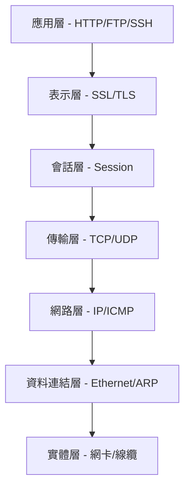
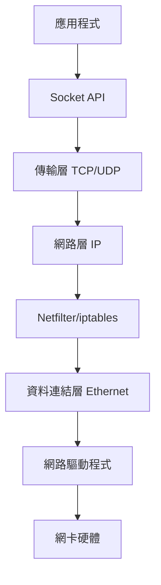
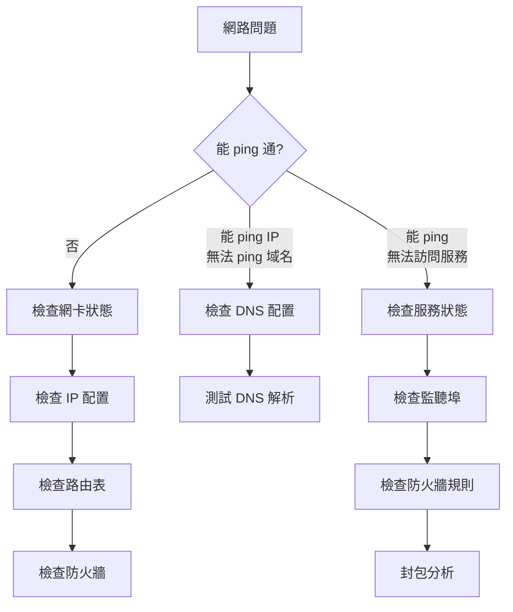

# 網路配置與診斷

## 目錄
- [概述](#概述)
- [網路協定與架構](#網路協定與架構)
- [網路介面管理](#網路介面管理)
- [路由與閘道](#路由與閘道)
- [DNS 配置](#dns-配置)
- [連線狀態診斷](#連線狀態診斷)
- [封包分析](#封包分析)
- [故障排查流程](#故障排查流程)
- [最佳實踐](#最佳實踐)
- [實戰案例](#實戰案例)

---

## 概述

Linux 網路配置與診斷是系統維運的核心技能,涵蓋介面管理、IP設定、路由、DNS、連線監控與封包分析。熟練掌握這些技術能快速解決網路問題,優化系統通訊效能。

**核心技能：**
- 網路介面配置與管理
- 路由與閘道設定
- DNS 解析配置
- 連線狀態監控
- 封包擷取與分析
- 網路問題診斷

---

## 網路協定與架構

### OSI 七層模型與 TCP/IP 對應



### Linux 網路堆疊



### 常見協定

| 層級 | 協定 | 用途 | 預設埠號 |
|------|------|------|----------|
| 應用層 | HTTP/HTTPS | 網頁服務 | 80/443 |
| 應用層 | SSH | 遠端登入 | 22 |
| 應用層 | FTP | 檔案傳輸 | 21 |
| 應用層 | DNS | 域名解析 | 53 |
| 傳輸層 | TCP | 可靠傳輸 | - |
| 傳輸層 | UDP | 快速傳輸 | - |
| 網路層 | IP | 封包路由 | - |
| 網路層 | ICMP | 錯誤回報/診斷 | - |
| 資料連結層 | ARP | IP轉MAC | - |
| 資料連結層 | Ethernet | 區域網路 | - |

---

## 網路介面管理

### 查看網路介面

**使用 ip 命令（推薦）：**
```bash
$ ip link show
1: lo: <LOOPBACK,UP,LOWER_UP> mtu 65536 qdisc noqueue state UNKNOWN
    link/loopback 00:00:00:00:00:00 brd 00:00:00:00:00:00
2: eth0: <BROADCAST,MULTICAST,UP,LOWER_UP> mtu 1500 qdisc fq_codel state UP
    link/ether 52:54:00:12:34:56 brd ff:ff:ff:ff:ff:ff

$ ip addr show
2: eth0: <BROADCAST,MULTICAST,UP,LOWER_UP> mtu 1500 qdisc fq_codel state UP
    link/ether 52:54:00:12:34:56 brd ff:ff:ff:ff:ff:ff
    inet 192.168.1.100/24 brd 192.168.1.255 scope global eth0
    inet6 fe80::5054:ff:fe12:3456/64 scope link
```

**使用 ifconfig（舊版）：**
```bash
$ ifconfig eth0
eth0: flags=4163<UP,BROADCAST,RUNNING,MULTICAST>  mtu 1500
        inet 192.168.1.100  netmask 255.255.255.0  broadcast 192.168.1.255
        inet6 fe80::5054:ff:fe12:3456  prefixlen 64  scopeid 0x20<link>
        ether 52:54:00:12:34:56  txqueuelen 1000  (Ethernet)
```

### 啟用/停用介面

```bash
$ sudo ip link set eth0 up
$ sudo ip link set eth0 down

$ sudo ifconfig eth0 up
$ sudo ifconfig eth0 down
```

### 配置 IP 位址

**臨時配置（重啟失效）：**
```bash
$ sudo ip addr add 192.168.1.100/24 dev eth0
$ sudo ip addr del 192.168.1.100/24 dev eth0

$ sudo ifconfig eth0 192.168.1.100 netmask 255.255.255.0
```

**永久配置（Debian/Ubuntu）：**
```bash
$ sudo vi /etc/network/interfaces

auto eth0
iface eth0 inet static
    address 192.168.1.100
    netmask 255.255.255.0
    gateway 192.168.1.1
    dns-nameservers 8.8.8.8 8.8.4.4

$ sudo systemctl restart networking
```

**永久配置（RHEL/CentOS 7）：**
```bash
$ sudo vi /etc/sysconfig/network-scripts/ifcfg-eth0

DEVICE=eth0
BOOTPROTO=static
ONBOOT=yes
IPADDR=192.168.1.100
NETMASK=255.255.255.0
GATEWAY=192.168.1.1
DNS1=8.8.8.8
DNS2=8.8.4.4

$ sudo systemctl restart network
```

**永久配置（使用 NetworkManager）：**
```bash
$ nmcli connection show
$ nmcli connection modify eth0 ipv4.addresses 192.168.1.100/24
$ nmcli connection modify eth0 ipv4.gateway 192.168.1.1
$ nmcli connection modify eth0 ipv4.dns "8.8.8.8 8.8.4.4"
$ nmcli connection modify eth0 ipv4.method manual
$ nmcli connection up eth0
```

**永久配置（使用 netplan - Ubuntu 18.04+）：**
```yaml
$ sudo vi /etc/netplan/01-netcfg.yaml

network:
  version: 2
  ethernets:
    eth0:
      addresses:
        - 192.168.1.100/24
      gateway4: 192.168.1.1
      nameservers:
        addresses:
          - 8.8.8.8
          - 8.8.4.4

$ sudo netplan apply
```

### 網路介面別名

```bash
$ sudo ip addr add 192.168.1.101/24 dev eth0 label eth0:0
$ ip addr show eth0
2: eth0: <BROADCAST,MULTICAST,UP,LOWER_UP> mtu 1500
    inet 192.168.1.100/24 scope global eth0
    inet 192.168.1.101/24 scope global secondary eth0:0
```

---

## 路由與閘道

### 查看路由表

```bash
$ ip route show
default via 192.168.1.1 dev eth0 proto dhcp metric 100
192.168.1.0/24 dev eth0 proto kernel scope link src 192.168.1.100

$ route -n
Kernel IP routing table
Destination     Gateway         Genmask         Flags Metric Ref    Use Iface
0.0.0.0         192.168.1.1     0.0.0.0         UG    100    0        0 eth0
192.168.1.0     0.0.0.0         255.255.255.0   U     0      0        0 eth0
```

### 添加/刪除路由

```bash
$ sudo ip route add 10.0.0.0/8 via 192.168.1.254 dev eth0
$ sudo ip route del 10.0.0.0/8

$ sudo ip route add default via 192.168.1.1 dev eth0

$ sudo route add -net 10.0.0.0 netmask 255.0.0.0 gw 192.168.1.254
$ sudo route del -net 10.0.0.0 netmask 255.0.0.0
```

### 永久路由配置

**Debian/Ubuntu：**
```bash
$ sudo vi /etc/network/interfaces

iface eth0 inet static
    ...
    up ip route add 10.0.0.0/8 via 192.168.1.254
```

**RHEL/CentOS：**
```bash
$ sudo vi /etc/sysconfig/network-scripts/route-eth0

10.0.0.0/8 via 192.168.1.254
```

### 路由追蹤

```bash
$ traceroute google.com
traceroute to google.com (172.217.160.78), 30 hops max, 60 byte packets
 1  192.168.1.1 (192.168.1.1)  1.234 ms  1.123 ms  1.089 ms
 2  10.0.0.1 (10.0.0.1)  5.678 ms  5.543 ms  5.432 ms
 3  172.16.0.1 (172.16.0.1)  10.234 ms  10.123 ms  10.098 ms
...

$ mtr google.com

$ tracepath google.com
```

---

## DNS 配置

### DNS 解析器配置

**檢視 DNS 設定：**
```bash
$ cat /etc/resolv.conf
nameserver 8.8.8.8
nameserver 8.8.4.4
search example.com
```

**臨時修改：**
```bash
$ echo "nameserver 1.1.1.1" | sudo tee /etc/resolv.conf
```

**永久配置（systemd-resolved）：**
```bash
$ sudo vi /etc/systemd/resolved.conf

[Resolve]
DNS=8.8.8.8 8.8.4.4
FallbackDNS=1.1.1.1 1.0.0.1
Domains=example.com

$ sudo systemctl restart systemd-resolved
```

**永久配置（NetworkManager）：**
```bash
$ nmcli connection modify eth0 ipv4.dns "8.8.8.8 8.8.4.4"
$ nmcli connection up eth0
```

### DNS 查詢工具

**使用 dig：**
```bash
$ dig google.com

; <<>> DiG 9.16.1 <<>> google.com
;; QUESTION SECTION:
;google.com.			IN	A

;; ANSWER SECTION:
google.com.		300	IN	A	172.217.160.78

;; Query time: 12 msec
;; SERVER: 8.8.8.8#53(8.8.8.8)

$ dig google.com +short
172.217.160.78

$ dig @8.8.8.8 google.com

$ dig google.com MX

$ dig -x 8.8.8.8
```

**使用 nslookup：**
```bash
$ nslookup google.com
Server:		8.8.8.8
Address:	8.8.8.8#53

Non-authoritative answer:
Name:	google.com
Address: 172.217.160.78

$ nslookup google.com 1.1.1.1
```

**使用 host：**
```bash
$ host google.com
google.com has address 172.217.160.78

$ host -t MX google.com
google.com mail is handled by 10 smtp.google.com.
```

### hosts 檔案

```bash
$ sudo vi /etc/hosts

127.0.0.1   localhost
127.0.1.1   myhostname
192.168.1.100   server1.example.com server1
192.168.1.101   server2.example.com server2
```

---

## 連線狀態診斷

### 檢視監聽埠

**使用 ss（推薦）：**
```bash
$ ss -tuln
Netid State  Recv-Q Send-Q Local Address:Port Peer Address:Port
tcp   LISTEN 0      128    0.0.0.0:22          0.0.0.0:*
tcp   LISTEN 0      128    0.0.0.0:80          0.0.0.0:*
tcp   LISTEN 0      128    [::]:22             [::]:*

$ ss -tulpn

$ ss -tun
```

**使用 netstat（舊版）：**
```bash
$ netstat -tuln
Active Internet connections (only servers)
Proto Recv-Q Send-Q Local Address    Foreign Address  State
tcp        0      0 0.0.0.0:22       0.0.0.0:*        LISTEN
tcp        0      0 0.0.0.0:80       0.0.0.0:*        LISTEN

$ netstat -tunp
```

**選項說明：**
- `-t`: TCP 連線
- `-u`: UDP 連線
- `-l`: 僅顯示監聽
- `-n`: 數字格式顯示
- `-p`: 顯示程序資訊
- `-a`: 所有連線

### 檢視已建立連線

```bash
$ ss -tn state established

$ ss -tn dst :80

$ ss -tn sport :22

$ ss -o state established '( dport = :ssh or sport = :ssh )'
```

### 連線統計

```bash
$ ss -s
Total: 500
TCP:   300 (estab 100, closed 50, orphaned 0, timewait 20)
Transport Total     IP        IPv6
RAW	      0         0         0
UDP	      10        8         2
TCP	      250       200       50

$ netstat -s
```

### 測試連通性

**ICMP 測試：**
```bash
$ ping 8.8.8.8
PING 8.8.8.8 (8.8.8.8) 56(84) bytes of data.
64 bytes from 8.8.8.8: icmp_seq=1 ttl=115 time=12.3 ms
64 bytes from 8.8.8.8: icmp_seq=2 ttl=115 time=11.9 ms

$ ping -c 4 google.com

$ ping -i 0.2 -c 10 192.168.1.1

$ ping6 2001:4860:4860::8888
```

**TCP 連線測試：**
```bash
$ nc -zv google.com 80
Connection to google.com 80 port [tcp/http] succeeded!

$ nc -zv -w 3 192.168.1.100 22

$ telnet google.com 80
Trying 172.217.160.78...
Connected to google.com.

$ timeout 5 bash -c '</dev/tcp/google.com/80' && echo "Port 80 is open"
```

---

## 封包分析

### tcpdump 基本使用

```bash
$ sudo tcpdump -i eth0
tcpdump: verbose output suppressed, use -v or -vv for full protocol decode
listening on eth0, link-type EN10MB (Ethernet), capture size 262144 bytes
10:30:15.123456 IP 192.168.1.100.54321 > 8.8.8.8.53: 12345+ A? google.com.
10:30:15.134567 IP 8.8.8.8.53 > 192.168.1.100.54321: 12345 1/0/0 A 172.217.160.78

$ sudo tcpdump -i eth0 -c 10

$ sudo tcpdump -i eth0 -nn

$ sudo tcpdump -i eth0 -v
$ sudo tcpdump -i eth0 -vv
$ sudo tcpdump -i eth0 -vvv
```

### 過濾條件

```bash
$ sudo tcpdump -i eth0 host 192.168.1.100

$ sudo tcpdump -i eth0 src 192.168.1.100

$ sudo tcpdump -i eth0 dst 192.168.1.100

$ sudo tcpdump -i eth0 net 192.168.1.0/24

$ sudo tcpdump -i eth0 port 80

$ sudo tcpdump -i eth0 tcp port 443

$ sudo tcpdump -i eth0 udp port 53

$ sudo tcpdump -i eth0 icmp

$ sudo tcpdump -i eth0 'tcp[tcpflags] & (tcp-syn|tcp-fin) != 0'

$ sudo tcpdump -i eth0 'tcp port 80 and (src host 192.168.1.100 or dst host 192.168.1.100)'
```

### 儲存與讀取封包

```bash
$ sudo tcpdump -i eth0 -w capture.pcap

$ sudo tcpdump -i eth0 -w capture.pcap -C 100

$ sudo tcpdump -r capture.pcap

$ sudo tcpdump -r capture.pcap port 80

$ sudo tcpdump -i eth0 -w - | tee capture.pcap | tcpdump -r -
```

### 顯示封包內容

```bash
$ sudo tcpdump -i eth0 -A

$ sudo tcpdump -i eth0 -X

$ sudo tcpdump -i eth0 -XX
```

---

## 故障排查流程

### 網路問題診斷流程



### 常見問題排查

#### 問題 1: 無法連接網路

**檢查網卡狀態：**
```bash
$ ip link show eth0
2: eth0: <BROADCAST,MULTICAST> mtu 1500 qdisc noop state DOWN

$ sudo ip link set eth0 up
```

**檢查 IP 配置：**
```bash
$ ip addr show eth0

$ sudo dhclient eth0

$ sudo ip addr add 192.168.1.100/24 dev eth0
```

**檢查預設路由：**
```bash
$ ip route show | grep default

$ sudo ip route add default via 192.168.1.1
```

**檢查 DNS：**
```bash
$ cat /etc/resolv.conf

$ ping 8.8.8.8

$ dig google.com
```

#### 問題 2: DNS 解析失敗

```bash
$ nslookup google.com
;; connection timed out; no servers could be reached

$ cat /etc/resolv.conf

$ echo "nameserver 8.8.8.8" | sudo tee /etc/resolv.conf

$ dig @8.8.8.8 google.com

$ sudo systemctl status systemd-resolved

$ resolvectl status
```

#### 問題 3: 連線緩慢

```bash
$ ping -c 10 8.8.8.8 | tail -1

$ mtr google.com

$ sudo ethtool eth0 | grep Speed

$ ss -ti

$ sar -n DEV 1 10

$ sudo tcpdump -i eth0 -nn -c 1000 | awk '{print $3}' | cut -d. -f1-4 | sort | uniq -c | sort -nr | head
```

#### 問題 4: 封包遺失

```bash
$ ping -c 100 -i 0.2 192.168.1.1 | grep loss

$ ip -s link show eth0

$ netstat -i

$ sudo tcpdump -i eth0 -nn icmp

$ dmesg | grep -i network
```

---

## 最佳實踐

### 網路配置原則

1. **使用現代化工具**
   - 優先使用 `ip` 而非 `ifconfig`
   - 使用 `ss` 而非 `netstat`
   - 使用 `nmcli` 或 `netplan` 進行配置管理

2. **文件化配置**
   - 記錄網路配置變更
   - 使用版本控制管理配置檔
   - 建立網路拓撲圖

3. **備援設計**
   - 配置多個 DNS 伺服器
   - 規劃備用路由
   - 使用網路綁定（bonding）提高可用性

4. **監控告警**
   - 監控網路流量
   - 設定連線異常告警
   - 追蹤封包遺失率

### 安全性建議

```bash
$ sudo sysctl -w net.ipv4.conf.all.accept_source_route=0
$ sudo sysctl -w net.ipv4.conf.all.accept_redirects=0
$ sudo sysctl -w net.ipv4.conf.all.send_redirects=0
$ sudo sysctl -w net.ipv4.conf.all.rp_filter=1
$ sudo sysctl -w net.ipv4.icmp_echo_ignore_all=0
$ sudo sysctl -w net.ipv4.icmp_echo_ignore_broadcasts=1
$ sudo sysctl -w net.ipv4.tcp_syncookies=1

$ sudo vi /etc/sysctl.conf
net.ipv4.conf.all.accept_source_route = 0
net.ipv4.conf.all.accept_redirects = 0
net.ipv4.conf.all.send_redirects = 0
net.ipv4.conf.all.rp_filter = 1
net.ipv4.icmp_echo_ignore_broadcasts = 1
net.ipv4.tcp_syncookies = 1

$ sudo sysctl -p
```

---

## 實戰案例

### 案例 1: 診斷網站無法訪問

```bash
$ ping example.com
ping: example.com: Name or service not known

$ cat /etc/resolv.conf
search localdomain

$ echo "nameserver 8.8.8.8" | sudo tee /etc/resolv.conf
$ ping example.com
PING example.com (93.184.216.34) 56(84) bytes of data.
64 bytes from 93.184.216.34: icmp_seq=1 ttl=56 time=15.2 ms

$ nc -zv example.com 80
nc: connect to example.com port 80 (tcp) failed: Connection refused

$ ss -tuln | grep :80

$ sudo systemctl status nginx
● nginx.service - A high performance web server
     Loaded: loaded (/lib/systemd/system/nginx.service; enabled)
     Active: inactive (dead)

$ sudo systemctl start nginx
$ nc -zv localhost 80
Connection to localhost 80 port [tcp/http] succeeded!
```

### 案例 2: 網路性能調優

```bash
$ sar -n DEV 1 5
Average:        IFACE   rxpck/s   txpck/s    rxkB/s    txkB/s
Average:         eth0   5234.60   3421.40   7234.56   4532.12

$ sudo ethtool -S eth0 | grep -i error
     rx_errors: 1234
     tx_errors: 567

$ sudo ethtool -k eth0 | grep offload
tcp-segmentation-offload: on
generic-segmentation-offload: on
generic-receive-offload: on

$ sudo ethtool -G eth0 rx 4096 tx 4096

$ sudo sysctl -w net.core.rmem_max=26214400
$ sudo sysctl -w net.core.wmem_max=26214400
$ sudo sysctl -w net.ipv4.tcp_rmem='4096 87380 26214400'
$ sudo sysctl -w net.ipv4.tcp_wmem='4096 65536 26214400'
```

### 案例 3: 封包遺失追查

```bash
$ ping -c 100 8.8.8.8 | grep transmitted
100 packets transmitted, 95 received, 5% packet loss

$ ip -s link show eth0
2: eth0: <BROADCAST,MULTICAST,UP,LOWER_UP> mtu 1500
    RX: bytes  packets  errors  dropped overrun mcast   
    1234567    9876     12      5       0       0

$ sudo tcpdump -i eth0 -nn icmp -c 20
10:45:12.123456 IP 192.168.1.100 > 8.8.8.8: ICMP echo request
10:45:12.150000 IP 8.8.8.8 > 192.168.1.100: ICMP echo reply
10:45:13.123456 IP 192.168.1.100 > 8.8.8.8: ICMP echo request
10:45:13.150000 IP 8.8.8.8 > 192.168.1.100: ICMP echo reply

$ dmesg | grep -i eth0
[12345.678] eth0: link down
[12346.789] eth0: link up

$ sudo ethtool eth0 | grep "Link detected"
        Link detected: yes
```

### 案例 4: 多網卡路由配置

```bash
$ ip addr show
2: eth0: inet 192.168.1.100/24
3: eth1: inet 10.0.0.100/24

$ sudo ip route add default via 192.168.1.1 dev eth0 metric 100
$ sudo ip route add default via 10.0.0.1 dev eth1 metric 200

$ ip route show
default via 192.168.1.1 dev eth0 metric 100
default via 10.0.0.1 dev eth1 metric 200
192.168.1.0/24 dev eth0 proto kernel scope link src 192.168.1.100
10.0.0.0/24 dev eth1 proto kernel scope link src 10.0.0.100

$ sudo ip route add 8.8.8.0/24 via 10.0.0.1 dev eth1

$ ip route get 8.8.8.8
8.8.8.8 via 10.0.0.1 dev eth1 src 10.0.0.100
```

---

> **參考資料：**
> - Linux Network Administrators Guide
> - TCP/IP Illustrated
> - Red Hat Enterprise Linux Networking Guide
> - Ubuntu Server Documentation
