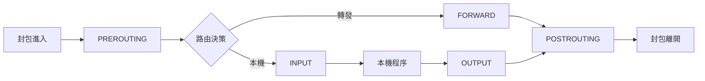
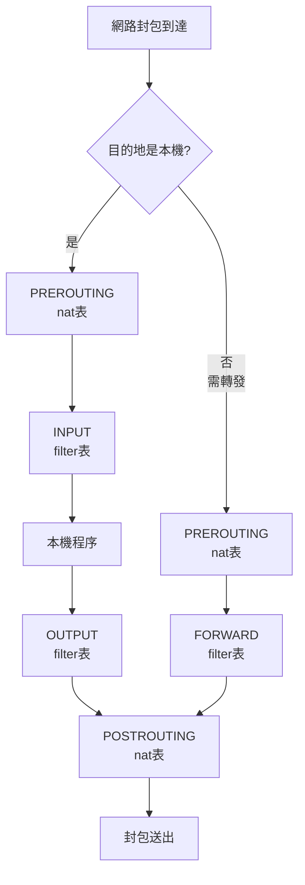

# 防火牆與網路安全

## 目錄
- [概述](#概述)
- [Netfilter 架構](#netfilter-架構)
- [iptables 防火牆](#iptables-防火牆)
- [nftables 防火牆](#nftables-防火牆)
- [firewalld 管理](#firewalld-管理)
- [ufw 簡易防火牆](#ufw-簡易防火牆)
- [NAT 與連線追蹤](#nat-與連線追蹤)
- [DDoS 防護](#ddos-防護)
- [最佳實踐](#最佳實踐)
- [實戰案例](#實戰案例)

---

## 概述

Linux 防火牆是網路安全的第一道防線,基於 Netfilter 框架提供封包過濾、NAT、連線追蹤等功能。掌握防火牆配置對於保護系統免受攻擊至關重要。

**核心功能：**
- 封包過濾與存取控制
- 網路位址轉換 (NAT)
- 埠號轉發 (Port Forwarding)
- 連線狀態追蹤
- 流量限制與整形
- 入侵防護

---

## Netfilter 架構

### Netfilter 框架



### 表與鏈

| 表 (Table) | 功能 | 鏈 (Chain) |
|------------|------|------------|
| filter | 封包過濾 | INPUT, FORWARD, OUTPUT |
| nat | 網路位址轉換 | PREROUTING, OUTPUT, POSTROUTING |
| mangle | 封包修改 | 所有鏈 |
| raw | 連線追蹤例外 | PREROUTING, OUTPUT |
| security | SELinux 相關 | INPUT, FORWARD, OUTPUT |

### 封包處理流程



---

## iptables 防火牆

### 基本語法

```bash
iptables [-t table] COMMAND chain CRETIERIA -j ACTION
```

**參數說明：**
- `-t table`: 指定表 (filter, nat, mangle, raw)
- `COMMAND`: -A (append), -I (insert), -D (delete), -L (list)
- `chain`: INPUT, OUTPUT, FORWARD, PREROUTING, POSTROUTING
- `CRITERIA`: 匹配條件
- `ACTION`: ACCEPT, DROP, REJECT, LOG, DNAT, SNAT, MASQUERADE

### 查看規則

```bash
$ sudo iptables -L
Chain INPUT (policy ACCEPT)
target     prot opt source               destination

Chain FORWARD (policy ACCEPT)
target     prot opt source               destination

Chain OUTPUT (policy ACCEPT)
target     prot opt source               destination

$ sudo iptables -L -n -v
Chain INPUT (policy ACCEPT 0 packets, 0 bytes)
 pkts bytes target     prot opt in     out     source               destination
  123 12345 ACCEPT     tcp  --  *      *       0.0.0.0/0            0.0.0.0/0            tcp dpt:22

$ sudo iptables -t nat -L -n -v

$ sudo iptables -L INPUT --line-numbers
```

### 基本規則操作

**允許 SSH (22)：**
```bash
$ sudo iptables -A INPUT -p tcp --dport 22 -j ACCEPT
```

**允許 HTTP/HTTPS：**
```bash
$ sudo iptables -A INPUT -p tcp --dport 80 -j ACCEPT
$ sudo iptables -A INPUT -p tcp --dport 443 -j ACCEPT
```

**允許已建立的連線：**
```bash
$ sudo iptables -A INPUT -m state --state ESTABLISHED,RELATED -j ACCEPT
```

**允許 loopback：**
```bash
$ sudo iptables -A INPUT -i lo -j ACCEPT
```

**允許 ICMP (ping)：**
```bash
$ sudo iptables -A INPUT -p icmp -j ACCEPT
```

**拒絕所有其他連線：**
```bash
$ sudo iptables -A INPUT -j DROP
$ sudo iptables -P INPUT DROP
```

### 刪除規則

```bash
$ sudo iptables -D INPUT 5

$ sudo iptables -D INPUT -p tcp --dport 80 -j ACCEPT

$ sudo iptables -F INPUT

$ sudo iptables -F
```

### 插入規則

```bash
$ sudo iptables -I INPUT 1 -p tcp --dport 80 -j ACCEPT
```

### 來源與目的地過濾

```bash
$ sudo iptables -A INPUT -s 192.168.1.100 -j ACCEPT

$ sudo iptables -A INPUT -s 192.168.1.0/24 -j ACCEPT

$ sudo iptables -A INPUT -d 10.0.0.100 -j ACCEPT

$ sudo iptables -A OUTPUT -d 8.8.8.8 -j DROP

$ sudo iptables -A INPUT -s 192.168.1.100 -d 10.0.0.50 -p tcp --dport 80 -j ACCEPT
```

### 介面過濾

```bash
$ sudo iptables -A INPUT -i eth0 -j ACCEPT

$ sudo iptables -A OUTPUT -o eth1 -j ACCEPT

$ sudo iptables -A FORWARD -i eth0 -o eth1 -j ACCEPT
```

### 埠號範圍

```bash
$ sudo iptables -A INPUT -p tcp --dport 8000:8999 -j ACCEPT

$ sudo iptables -A INPUT -p tcp -m multiport --dports 80,443,8080 -j ACCEPT
```

### 速率限制

```bash
$ sudo iptables -A INPUT -p tcp --dport 80 -m limit --limit 25/minute --limit-burst 100 -j ACCEPT

$ sudo iptables -A INPUT -p tcp --dport 22 -m recent --name ssh --set
$ sudo iptables -A INPUT -p tcp --dport 22 -m recent --name ssh --update --seconds 60 --hitcount 4 -j DROP
```

### 記錄封包

```bash
$ sudo iptables -A INPUT -j LOG --log-prefix "IPTables-Dropped: " --log-level 4

$ sudo iptables -A INPUT -p tcp --dport 22 -m state --state NEW -j LOG --log-prefix "SSH-NEW: "
```

### 儲存與還原規則

**Debian/Ubuntu：**
```bash
$ sudo iptables-save > /etc/iptables/rules.v4
$ sudo ip6tables-save > /etc/iptables/rules.v6

$ sudo apt install iptables-persistent
$ sudo netfilter-persistent save
$ sudo netfilter-persistent reload
```

**RHEL/CentOS：**
```bash
$ sudo service iptables save
$ sudo systemctl enable iptables

$ sudo iptables-save > /etc/sysconfig/iptables
$ sudo iptables-restore < /etc/sysconfig/iptables
```

---

## nftables 防火牆

### 基本概念

nftables 是 iptables 的繼任者,提供更簡潔的語法和更好的效能。

**優勢：**
- 統一的語法處理 IPv4/IPv6
- 更好的效能
- 原生支援集合 (sets) 和映射 (maps)
- 簡化的規則管理

### 基本操作

**查看規則：**
```bash
$ sudo nft list ruleset

$ sudo nft list tables

$ sudo nft list table inet filter

$ sudo nft list chain inet filter input
```

### 建立表和鏈

```bash
$ sudo nft add table inet filter

$ sudo nft add chain inet filter input { type filter hook input priority 0 \; policy accept \; }

$ sudo nft add chain inet filter forward { type filter hook forward priority 0 \; policy drop \; }

$ sudo nft add chain inet filter output { type filter hook output priority 0 \; policy accept \; }
```

### 添加規則

```bash
$ sudo nft add rule inet filter input ct state established,related accept

$ sudo nft add rule inet filter input iif lo accept

$ sudo nft add rule inet filter input tcp dport 22 accept

$ sudo nft add rule inet filter input tcp dport { 80, 443 } accept

$ sudo nft add rule inet filter input ip saddr 192.168.1.0/24 accept

$ sudo nft add rule inet filter input drop
```

### 刪除規則

```bash
$ sudo nft list ruleset -a
table inet filter {
  chain input {
    type filter hook input priority 0; policy accept;
    ct state established,related accept # handle 5
    tcp dport 22 accept # handle 6
  }
}

$ sudo nft delete rule inet filter input handle 6

$ sudo nft flush chain inet filter input

$ sudo nft flush table inet filter

$ sudo nft delete table inet filter
```

### 使用集合

```bash
$ sudo nft add set inet filter blacklist { type ipv4_addr \; }

$ sudo nft add element inet filter blacklist { 192.168.1.100, 192.168.1.101 }

$ sudo nft add rule inet filter input ip saddr @blacklist drop

$ sudo nft add set inet filter allowed_ports { type inet_service \; }
$ sudo nft add element inet filter allowed_ports { 22, 80, 443 }
$ sudo nft add rule inet filter input tcp dport @allowed_ports accept
```

### 儲存與載入

```bash
$ sudo nft list ruleset > /etc/nftables.conf

$ sudo nft -f /etc/nftables.conf

$ sudo systemctl enable nftables
$ sudo systemctl start nftables
```

### 完整配置範例

```bash
$ sudo vi /etc/nftables.conf

#!/usr/sbin/nft -f

flush ruleset

table inet filter {
    chain input {
        type filter hook input priority 0; policy drop;
        
        ct state invalid drop
        ct state established,related accept
        
        iif lo accept
        
        ip protocol icmp accept
        ip6 nexthdr icmpv6 accept
        
        tcp dport 22 ct state new accept
        tcp dport { 80, 443 } ct state new accept
        
        log prefix "nftables-dropped: " drop
    }
    
    chain forward {
        type filter hook forward priority 0; policy drop;
    }
    
    chain output {
        type filter hook output priority 0; policy accept;
    }
}

$ sudo nft -f /etc/nftables.conf
```

---

## firewalld 管理

### 基本概念

firewalld 使用區域 (zones) 和服務 (services) 概念,提供動態防火牆管理。

**預設區域：**
- `drop`: 丟棄所有連線
- `block`: 拒絕所有連線
- `public`: 公共網路 (預設)
- `external`: 外部網路,啟用偽裝
- `dmz`: 非軍事區
- `work`: 工作網路
- `home`: 家用網路
- `internal`: 內部網路
- `trusted`: 信任所有連線

### 基本操作

```bash
$ sudo systemctl start firewalld
$ sudo systemctl enable firewalld
$ sudo systemctl status firewalld

$ sudo firewall-cmd --state
running

$ sudo firewall-cmd --get-default-zone
public

$ sudo firewall-cmd --get-active-zones
public
  interfaces: eth0

$ sudo firewall-cmd --get-zones
block dmz drop external home internal public trusted work
```

### 服務管理

```bash
$ sudo firewall-cmd --get-services

$ sudo firewall-cmd --list-services
dhcpv6-client ssh

$ sudo firewall-cmd --add-service=http
$ sudo firewall-cmd --add-service=https

$ sudo firewall-cmd --add-service=http --permanent
$ sudo firewall-cmd --reload

$ sudo firewall-cmd --remove-service=http
$ sudo firewall-cmd --remove-service=http --permanent
```

### 埠號管理

```bash
$ sudo firewall-cmd --list-ports

$ sudo firewall-cmd --add-port=8080/tcp
$ sudo firewall-cmd --add-port=8080/tcp --permanent

$ sudo firewall-cmd --add-port=3000-3999/tcp

$ sudo firewall-cmd --remove-port=8080/tcp
$ sudo firewall-cmd --remove-port=8080/tcp --permanent
```

### 來源管理

```bash
$ sudo firewall-cmd --add-source=192.168.1.0/24
$ sudo firewall-cmd --add-source=192.168.1.0/24 --permanent

$ sudo firewall-cmd --remove-source=192.168.1.0/24

$ sudo firewall-cmd --zone=trusted --add-source=10.0.0.0/8 --permanent
```

### 富規則

```bash
$ sudo firewall-cmd --add-rich-rule='rule family="ipv4" source address="192.168.1.100" accept'

$ sudo firewall-cmd --add-rich-rule='rule family="ipv4" source address="192.168.1.0/24" port port="22" protocol="tcp" accept'

$ sudo firewall-cmd --add-rich-rule='rule family="ipv4" source address="10.0.0.0/8" reject'

$ sudo firewall-cmd --add-rich-rule='rule family="ipv4" source address="192.168.1.100" port port="80" protocol="tcp" log prefix="HTTP-Access: " level="info" accept' --permanent

$ sudo firewall-cmd --list-rich-rules
```

### 區域切換

```bash
$ sudo firewall-cmd --set-default-zone=home

$ sudo firewall-cmd --zone=home --change-interface=eth0

$ sudo firewall-cmd --get-zone-of-interface=eth0
```

### 偽裝與轉發

```bash
$ sudo firewall-cmd --add-masquerade
$ sudo firewall-cmd --add-masquerade --permanent

$ sudo firewall-cmd --add-forward-port=port=80:proto=tcp:toport=8080
$ sudo firewall-cmd --add-forward-port=port=80:proto=tcp:toport=8080:toaddr=192.168.1.100
```

---

## ufw 簡易防火牆

### 基本操作

```bash
$ sudo apt install ufw

$ sudo ufw status
Status: inactive

$ sudo ufw enable
Firewall is active and enabled on system startup

$ sudo ufw disable

$ sudo ufw status verbose
Status: active
Logging: on (low)
Default: deny (incoming), allow (outgoing), disabled (routed)
```

### 預設政策

```bash
$ sudo ufw default deny incoming
$ sudo ufw default allow outgoing
$ sudo ufw default deny routed
```

### 允許服務

```bash
$ sudo ufw allow ssh
$ sudo ufw allow 22

$ sudo ufw allow http
$ sudo ufw allow https

$ sudo ufw allow 8080/tcp
$ sudo ufw allow 53/udp

$ sudo ufw allow 3000:3999/tcp
```

### 拒絕連線

```bash
$ sudo ufw deny 23

$ sudo ufw reject 25
```

### 來源限制

```bash
$ sudo ufw allow from 192.168.1.100

$ sudo ufw allow from 192.168.1.0/24

$ sudo ufw allow from 192.168.1.100 to any port 22

$ sudo ufw allow from 192.168.1.0/24 to any port 3306
```

### 刪除規則

```bash
$ sudo ufw status numbered
Status: active

     To                         Action      From
     --                         ------      ----
[ 1] 22                         ALLOW IN    Anywhere
[ 2] 80                         ALLOW IN    Anywhere

$ sudo ufw delete 2

$ sudo ufw delete allow 80
```

### 應用程式設定檔

```bash
$ sudo ufw app list
Available applications:
  Nginx Full
  Nginx HTTP
  Nginx HTTPS
  OpenSSH

$ sudo ufw app info "Nginx Full"
Profile: Nginx Full
Title: Web Server (Nginx, HTTP + HTTPS)
Description: Small, but very powerful and efficient web server

Ports:
  80,443/tcp

$ sudo ufw allow "Nginx Full"
```

### 重置防火牆

```bash
$ sudo ufw reset
```

---

## NAT 與連線追蹤

### SNAT (Source NAT)

```bash
$ sudo iptables -t nat -A POSTROUTING -s 192.168.1.0/24 -o eth0 -j SNAT --to-source 203.0.113.1

$ sudo iptables -t nat -A POSTROUTING -s 192.168.1.0/24 -o eth0 -j MASQUERADE
```

**nftables 版本：**
```bash
$ sudo nft add rule inet nat postrouting ip saddr 192.168.1.0/24 oif eth0 masquerade
```

### DNAT (Destination NAT)

```bash
$ sudo iptables -t nat -A PREROUTING -i eth0 -p tcp --dport 80 -j DNAT --to-destination 192.168.1.100:8080

$ sudo iptables -t nat -A PREROUTING -i eth0 -p tcp --dport 443 -j DNAT --to-destination 192.168.1.100
```

**nftables 版本：**
```bash
$ sudo nft add rule inet nat prerouting iif eth0 tcp dport 80 dnat to 192.168.1.100:8080
```

### 埠號轉發

```bash
$ sudo iptables -t nat -A PREROUTING -p tcp --dport 8080 -j REDIRECT --to-port 80

$ sudo iptables -A FORWARD -p tcp -d 192.168.1.100 --dport 80 -j ACCEPT
```

### 啟用 IP 轉發

```bash
$ sudo sysctl -w net.ipv4.ip_forward=1

$ sudo vi /etc/sysctl.conf
net.ipv4.ip_forward = 1

$ sudo sysctl -p
```

### 連線追蹤

```bash
$ sudo apt install conntrack

$ sudo conntrack -L
tcp      6 431999 ESTABLISHED src=192.168.1.100 dst=8.8.8.8 sport=54321 dport=443 ...

$ sudo conntrack -E

$ cat /proc/net/nf_conntrack
```

---

## DDoS 防護

### SYN Flood 防護

```bash
$ sudo sysctl -w net.ipv4.tcp_syncookies=1
$ sudo sysctl -w net.ipv4.tcp_max_syn_backlog=2048
$ sudo sysctl -w net.ipv4.tcp_synack_retries=2
$ sudo sysctl -w net.ipv4.tcp_syn_retries=5
```

**iptables 規則：**
```bash
$ sudo iptables -A INPUT -p tcp --syn -m limit --limit 1/s --limit-burst 3 -j ACCEPT
$ sudo iptables -A INPUT -p tcp --syn -j DROP
```

### 連線限制

```bash
$ sudo iptables -A INPUT -p tcp --syn --dport 80 -m connlimit --connlimit-above 20 --connlimit-mask 32 -j REJECT

$ sudo iptables -A INPUT -p tcp --dport 22 -m connlimit --connlimit-above 3 -j DROP
```

### 防止掃描

```bash
$ sudo iptables -N port-scanning
$ sudo iptables -A port-scanning -p tcp --tcp-flags SYN,ACK,FIN,RST RST -m limit --limit 1/s --limit-burst 2 -j RETURN
$ sudo iptables -A port-scanning -j DROP
```

### IP 黑名單

```bash
$ sudo ipset create blacklist hash:ip

$ sudo ipset add blacklist 203.0.113.100
$ sudo ipset add blacklist 203.0.113.101

$ sudo iptables -I INPUT -m set --match-set blacklist src -j DROP

$ sudo ipset save > /etc/ipset.conf
```

---

## 最佳實踐

### 防火牆配置原則

1. **預設拒絕策略**
```bash
$ sudo iptables -P INPUT DROP
$ sudo iptables -P FORWARD DROP
$ sudo iptables -P OUTPUT ACCEPT
```

2. **允許必要服務**
```bash
$ sudo iptables -A INPUT -m state --state ESTABLISHED,RELATED -j ACCEPT
$ sudo iptables -A INPUT -i lo -j ACCEPT
$ sudo iptables -A INPUT -p tcp --dport 22 -j ACCEPT
```

3. **記錄被拒絕的封包**
```bash
$ sudo iptables -A INPUT -m limit --limit 5/min -j LOG --log-prefix "iptables-denied: " --log-level 7
$ sudo iptables -A INPUT -j DROP
```

### 安全性建議

**禁用不安全的網路功能：**
```bash
$ sudo sysctl -w net.ipv4.conf.all.accept_source_route=0
$ sudo sysctl -w net.ipv4.conf.all.accept_redirects=0
$ sudo sysctl -w net.ipv4.conf.all.send_redirects=0
$ sudo sysctl -w net.ipv4.conf.all.rp_filter=1
$ sudo sysctl -w net.ipv4.icmp_echo_ignore_broadcasts=1
$ sudo sysctl -w net.ipv4.icmp_ignore_bogus_error_responses=1
$ sudo sysctl -w net.ipv4.tcp_syncookies=1
```

**定期審查規則：**
```bash
$ sudo iptables -L -n -v | less
$ sudo firewall-cmd --list-all
$ sudo nft list ruleset
```

---

## 實戰案例

### 案例 1: Web 伺服器防火牆配置

```bash
#!/bin/bash

sudo iptables -F
sudo iptables -X

sudo iptables -P INPUT DROP
sudo iptables -P FORWARD DROP
sudo iptables -P OUTPUT ACCEPT

sudo iptables -A INPUT -m state --state ESTABLISHED,RELATED -j ACCEPT

sudo iptables -A INPUT -i lo -j ACCEPT

sudo iptables -A INPUT -p tcp --dport 22 -m state --state NEW -m recent --set --name SSH
sudo iptables -A INPUT -p tcp --dport 22 -m state --state NEW -m recent --update --seconds 60 --hitcount 4 --name SSH -j DROP
sudo iptables -A INPUT -p tcp --dport 22 -j ACCEPT

sudo iptables -A INPUT -p tcp --dport 80 -j ACCEPT
sudo iptables -A INPUT -p tcp --dport 443 -j ACCEPT

sudo iptables -A INPUT -p icmp --icmp-type echo-request -j ACCEPT

sudo iptables -A INPUT -m limit --limit 5/min -j LOG --log-prefix "iptables-INPUT-denied: "
sudo iptables -A INPUT -j DROP

sudo iptables-save > /etc/iptables/rules.v4
```

### 案例 2: NAT 路由器配置

```bash
#!/bin/bash

echo 1 > /proc/sys/net/ipv4/ip_forward

sudo iptables -t nat -A POSTROUTING -o eth0 -j MASQUERADE

sudo iptables -A FORWARD -i eth1 -o eth0 -m state --state RELATED,ESTABLISHED -j ACCEPT
sudo iptables -A FORWARD -i eth0 -o eth1 -j ACCEPT

sudo iptables -t nat -A PREROUTING -i eth0 -p tcp --dport 80 -j DNAT --to-destination 192.168.1.100:80
sudo iptables -t nat -A PREROUTING -i eth0 -p tcp --dport 443 -j DNAT --to-destination 192.168.1.100:443

sudo iptables -A FORWARD -p tcp -d 192.168.1.100 --dport 80 -j ACCEPT
sudo iptables -A FORWARD -p tcp -d 192.168.1.100 --dport 443 -j ACCEPT
```

### 案例 3: 阻擋特定國家 IP

```bash
$ sudo ipset create china hash:net

$ wget -O - https://www.ipdeny.com/ipblocks/data/countries/cn.zone | while read network; do
    sudo ipset add china $network
done

$ sudo iptables -I INPUT -m set --match-set china src -j DROP

$ sudo ipset save china > /etc/ipset-china.conf
```

### 案例 4: 防護 SSH 暴力破解

```bash
$ sudo iptables -A INPUT -p tcp --dport 22 -m state --state NEW -m recent --set --name SSH

$ sudo iptables -A INPUT -p tcp --dport 22 -m state --state NEW -m recent --update --seconds 60 --hitcount 4 --rttl --name SSH -j LOG --log-prefix "SSH-Brute-Force: "

$ sudo iptables -A INPUT -p tcp --dport 22 -m state --state NEW -m recent --update --seconds 60 --hitcount 4 --rttl --name SSH -j DROP

$ sudo iptables -A INPUT -p tcp --dport 22 -j ACCEPT
```

---

> **參考資料：**
> - Linux iptables Pocket Reference
> - nftables Wiki
> - Red Hat Security Guide
> - Netfilter Documentation
