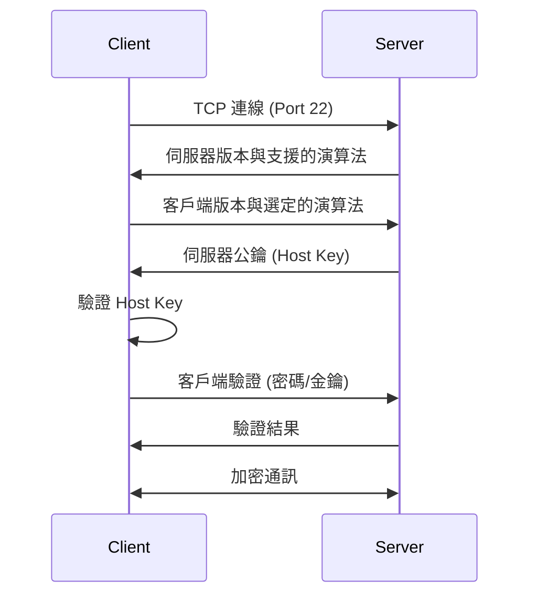
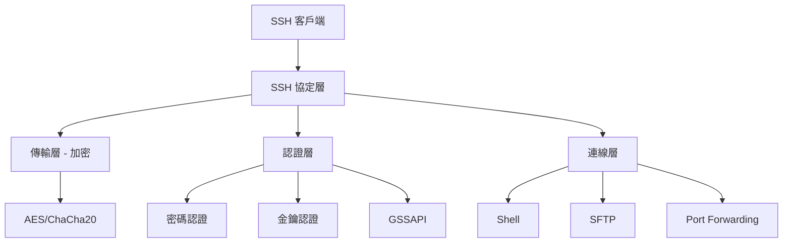

# SSH與遠端管理

## 目錄
- [概述](#概述)
- [SSH 原理與架構](#ssh-原理與架構)
- [基本連線操作](#基本連線操作)
- [金鑰認證](#金鑰認證)
- [SSH 配置](#ssh-配置)
- [檔案傳輸](#檔案傳輸)
- [埠號轉發與隧道](#埠號轉發與隧道)
- [進階功能](#進階功能)
- [安全性強化](#安全性強化)
- [故障排查](#故障排查)
- [實戰案例](#實戰案例)

---

## 概述

SSH (Secure Shell) 是 Linux 系統遠端管理的標準協定,提供加密的命令列存取、檔案傳輸與埠號轉發功能。

**核心功能：**
- 遠端命令執行
- 安全檔案傳輸 (SCP/SFTP)
- 埠號轉發 (Port Forwarding)
- X11 轉發
- SOCKS 代理
- 跳板機 (Jump Host)

**常見應用：**
- 伺服器管理與維護
- 自動化部署
- 安全隧道建立
- 遠端開發環境存取

---

## SSH 原理與架構

### SSH 連線流程



### SSH 架構組件



### 認證方式

| 方式 | 安全性 | 便利性 | 適用場景 |
|------|--------|--------|----------|
| 密碼 | 低 | 高 | 測試環境,不建議生產使用 |
| 公鑰 | 高 | 高 | 標準配置,建議使用 |
| 憑證 | 極高 | 中 | 大型組織,集中管理 |
| 雙因素 | 極高 | 中 | 高安全性需求 |

---

## 基本連線操作

### 遠端登入

```bash
$ ssh username@hostname
The authenticity of host 'hostname (192.168.1.100)' can't be established.
ED25519 key fingerprint is SHA256:xxxxx.
Are you sure you want to continue connecting (yes/no)? yes
Warning: Permanently added 'hostname' (ED25519) to the list of known hosts.
username@hostname's password:

$ ssh user@192.168.1.100

$ ssh user@example.com -p 2222

$ ssh -i ~/.ssh/id_rsa user@server

$ ssh -l username hostname
```

### 執行遠端命令

```bash
$ ssh user@server 'uptime'
 10:30:15 up 5 days, 3:24, 2 users, load average: 0.15, 0.10, 0.05

$ ssh user@server 'df -h'

$ ssh user@server 'sudo systemctl restart nginx'

$ ssh user@server << 'EOF'
cd /var/www
git pull
npm install
pm2 restart app
EOF
```

### 背景執行

```bash
$ ssh -f user@server 'sleep 60; command'

$ ssh -Nf user@server -L 8080:localhost:80
```

### 保持連線

```bash
$ ssh -o ServerAliveInterval=60 user@server

$ ssh -o ServerAliveInterval=30 -o ServerAliveCountMax=3 user@server
```

---

## 金鑰認證

### 產生 SSH 金鑰

```bash
$ ssh-keygen -t ed25519 -C "user@example.com"
Generating public/private ed25519 key pair.
Enter file in which to save the key (/home/user/.ssh/id_ed25519):
Enter passphrase (empty for no passphrase):
Enter same passphrase again:
Your identification has been saved in /home/user/.ssh/id_ed25519
Your public key has been saved in /home/user/.ssh/id_ed25519.pub

$ ssh-keygen -t rsa -b 4096 -C "user@example.com"

$ ssh-keygen -t ecdsa -b 521

$ ssh-keygen -t ed25519 -f ~/.ssh/deploy_key
```

**建議優先級：**
1. Ed25519 (最新,最安全,最快)
2. ECDSA (較新,安全)
3. RSA 4096 (傳統,廣泛支援)

### 管理金鑰

**查看公鑰：**
```bash
$ cat ~/.ssh/id_ed25519.pub
ssh-ed25519 AAAAC3NzaC1lZDI1NTE5AAAAIxxx... user@example.com

$ ssh-keygen -l -f ~/.ssh/id_ed25519
256 SHA256:xxxxx user@example.com (ED25519)

$ ssh-keygen -lf ~/.ssh/id_ed25519.pub
```

**變更密碼短語：**
```bash
$ ssh-keygen -p -f ~/.ssh/id_ed25519
```

**移除密碼短語：**
```bash
$ ssh-keygen -p -P "old_passphrase" -N "" -f ~/.ssh/id_ed25519
```

### 部署公鑰

**使用 ssh-copy-id：**
```bash
$ ssh-copy-id user@server
/usr/bin/ssh-copy-id: INFO: attempting to log in with the new key(s)
/usr/bin/ssh-copy-id: INFO: 1 key(s) remain to be installed
user@server's password:
Number of key(s) added: 1

$ ssh-copy-id -i ~/.ssh/id_ed25519.pub user@server

$ ssh-copy-id -p 2222 user@server
```

**手動部署：**
```bash
$ cat ~/.ssh/id_ed25519.pub | ssh user@server 'mkdir -p ~/.ssh && cat >> ~/.ssh/authorized_keys'

$ scp ~/.ssh/id_ed25519.pub user@server:/tmp/
$ ssh user@server
$ mkdir -p ~/.ssh
$ cat /tmp/id_ed25519.pub >> ~/.ssh/authorized_keys
$ chmod 700 ~/.ssh
$ chmod 600 ~/.ssh/authorized_keys
$ rm /tmp/id_ed25519.pub
```

### SSH Agent

```bash
$ eval "$(ssh-agent -s)"
Agent pid 12345

$ ssh-add ~/.ssh/id_ed25519
Enter passphrase for /home/user/.ssh/id_ed25519:
Identity added: /home/user/.ssh/id_ed25519 (user@example.com)

$ ssh-add -l
256 SHA256:xxxxx user@example.com (ED25519)

$ ssh-add -L

$ ssh-add -d ~/.ssh/id_ed25519

$ ssh-add -D

$ ssh-add -t 3600 ~/.ssh/id_ed25519
```

**Agent 轉發：**
```bash
$ ssh -A user@bastion

$ ssh -A user@bastion ssh user@internal-server
```

---

## SSH 配置

### 客戶端配置 (~/.ssh/config)

```bash
$ vi ~/.ssh/config

Host myserver
    HostName 192.168.1.100
    User admin
    Port 2222
    IdentityFile ~/.ssh/id_ed25519
    
Host web-*
    User deploy
    IdentityFile ~/.ssh/deploy_key
    StrictHostKeyChecking no
    
Host *.example.com
    User sysadmin
    ForwardAgent yes
    
Host bastion
    HostName bastion.example.com
    User jump
    Port 22
    
Host internal
    HostName 10.0.0.50
    User admin
    ProxyJump bastion
    
Host *
    ServerAliveInterval 60
    ServerAliveCountMax 3
    ControlMaster auto
    ControlPath ~/.ssh/cm-%r@%h:%p
    ControlPersist 10m
```

**使用配置：**
```bash
$ ssh myserver

$ ssh web-prod

$ ssh internal
```

**常用配置選項：**
```bash
Host example
    HostName server.example.com
    User username
    Port 2222
    IdentityFile ~/.ssh/specific_key
    IdentitiesOnly yes
    ForwardAgent yes
    ForwardX11 yes
    Compression yes
    ServerAliveInterval 60
    ServerAliveCountMax 3
    StrictHostKeyChecking ask
    UserKnownHostsFile ~/.ssh/known_hosts
    LogLevel INFO
    TCPKeepAlive yes
    ControlMaster auto
    ControlPath ~/.ssh/cm-%r@%h:%p
    ControlPersist 10m
```

### 伺服器端配置 (/etc/ssh/sshd_config)

```bash
$ sudo vi /etc/ssh/sshd_config

Port 22
AddressFamily inet
ListenAddress 0.0.0.0

HostKey /etc/ssh/ssh_host_ed25519_key
HostKey /etc/ssh/ssh_host_rsa_key

PermitRootLogin no
MaxAuthTries 3
MaxSessions 10

PubkeyAuthentication yes
AuthorizedKeysFile .ssh/authorized_keys

PasswordAuthentication no
PermitEmptyPasswords no
ChallengeResponseAuthentication no

UsePAM yes

X11Forwarding no
PrintMotd no
AcceptEnv LANG LC_*

Subsystem sftp /usr/lib/openssh/sftp-server

AllowUsers user1 user2
AllowGroups sshusers
DenyUsers baduser
DenyGroups deniedgroup

ClientAliveInterval 300
ClientAliveCountMax 2

$ sudo systemctl restart sshd
$ sudo systemctl reload sshd
```

**檢查配置：**
```bash
$ sudo sshd -t
$ sudo sshd -T
```

---

## 檔案傳輸

### SCP (Secure Copy)

**上傳檔案：**
```bash
$ scp file.txt user@server:/path/to/destination/

$ scp -r directory/ user@server:/path/

$ scp -P 2222 file.txt user@server:/path/

$ scp -i ~/.ssh/id_rsa file.txt user@server:/path/
```

**下載檔案：**
```bash
$ scp user@server:/path/to/file.txt ./

$ scp -r user@server:/path/to/directory ./

$ scp user@server:/path/file1.txt user@server:/path/file2.txt ./
```

**透過跳板機：**
```bash
$ scp -o "ProxyJump bastion" file.txt user@internal:/path/

$ scp -o "ProxyCommand ssh bastion -W %h:%p" file.txt user@internal:/path/
```

### SFTP (SSH File Transfer Protocol)

```bash
$ sftp user@server
Connected to server.
sftp>

sftp> ls
file1.txt  file2.txt  directory

sftp> pwd
Remote working directory: /home/user

sftp> lpwd
Local working directory: /home/localuser

sftp> cd /var/www
sftp> lcd /tmp

sftp> get remote-file.txt
Fetching /path/remote-file.txt to remote-file.txt

sftp> get -r remote-directory

sftp> put local-file.txt
Uploading local-file.txt to /path/local-file.txt

sftp> put -r local-directory

sftp> mkdir newdir
sftp> rmdir olddir
sftp> rm file.txt

sftp> chmod 644 file.txt
sftp> chown user:group file.txt

sftp> df -h
sftp> !ls

sftp> exit
```

**批次 SFTP：**
```bash
$ sftp -b commands.txt user@server

$ cat > batch.sftp <<EOF
cd /var/www
put index.html
put style.css
chmod 644 *.html
quit
EOF

$ sftp -b batch.sftp user@server
```

### rsync over SSH

```bash
$ rsync -avz -e ssh /local/path/ user@server:/remote/path/

$ rsync -avz --delete -e "ssh -p 2222" /local/ user@server:/remote/

$ rsync -avz --exclude '*.log' --exclude 'tmp/' source/ user@server:dest/

$ rsync -avz --progress user@server:/remote/ /local/

$ rsync -avz -e "ssh -i ~/.ssh/key" --dry-run source/ user@server:dest/
```

---

## 埠號轉發與隧道

### 本地埠號轉發 (-L)

```bash
$ ssh -L local_port:remote_host:remote_port user@ssh_server

$ ssh -L 8080:localhost:80 user@server

$ ssh -L 3307:db.internal:3306 user@bastion

$ ssh -L 0.0.0.0:8080:localhost:80 user@server

$ ssh -L 8080:localhost:80 -L 8443:localhost:443 user@server

$ ssh -Nf -L 8080:localhost:80 user@server
```

**使用範例：**
```bash
$ ssh -L 3307:localhost:3306 user@db-server
$ mysql -h 127.0.0.1 -P 3307 -u dbuser -p
```

### 遠端埠號轉發 (-R)

```bash
$ ssh -R remote_port:local_host:local_port user@ssh_server

$ ssh -R 8080:localhost:80 user@server

$ ssh -R 0.0.0.0:8080:localhost:3000 user@server

$ ssh -Nf -R 8080:localhost:80 user@server
```

**伺服器配置 (需啟用)：**
```bash
$ sudo vi /etc/ssh/sshd_config
GatewayPorts yes

$ sudo systemctl restart sshd
```

### 動態埠號轉發 (-D) / SOCKS Proxy

```bash
$ ssh -D 1080 user@server

$ ssh -D 0.0.0.0:1080 user@server

$ ssh -Nf -D 1080 user@server
```

**瀏覽器設定：**
- SOCKS Host: `127.0.0.1`
- Port: `1080`
- SOCKS v5

**命令列使用：**
```bash
$ curl --socks5 127.0.0.1:1080 https://example.com

$ export http_proxy=socks5://127.0.0.1:1080
$ export https_proxy=socks5://127.0.0.1:1080
```

### X11 轉發

```bash
$ ssh -X user@server

$ ssh -Y user@server

$ ssh -X user@server xclock

$ ssh -X user@server firefox
```

**伺服器配置：**
```bash
$ sudo vi /etc/ssh/sshd_config
X11Forwarding yes
X11DisplayOffset 10
```

---

## 進階功能

### 跳板機 (Jump Host)

**使用 ProxyJump：**
```bash
$ ssh -J bastion user@internal-server

$ ssh -J bastion1,bastion2,bastion3 user@target

$ ssh -J user1@bastion1:2222,user2@bastion2 user@target
```

**使用 ProxyCommand：**
```bash
$ ssh -o ProxyCommand="ssh -W %h:%p bastion" user@internal

$ ssh -o ProxyCommand="ssh bastion nc %h %p" user@internal
```

**配置檔案：**
```bash
Host internal
    HostName 10.0.0.50
    User admin
    ProxyJump bastion
    
Host bastion
    HostName bastion.example.com
    User jump
```

### 連線複用

```bash
$ vi ~/.ssh/config

Host *
    ControlMaster auto
    ControlPath ~/.ssh/cm-%r@%h:%p
    ControlPersist 10m

$ ssh user@server

$ ssh -O check user@server
Master running (pid=12345)

$ ssh -O exit user@server
Exit request sent.
```

### 逃逸序列

在 SSH 會話中:
- `~.` - 中斷連線
- `~^Z` - 暫停 SSH
- `~#` - 列出轉發的連線
- `~?` - 顯示所有逃逸序列

```bash
$ ssh user@server
~?
Supported escape sequences:
 ~.   - terminate connection
 ~^Z  - suspend ssh
 ~#   - list forwarded connections
 ~~   - send the escape character
```

---

## 安全性強化

### 停用密碼認證

```bash
$ sudo vi /etc/ssh/sshd_config

PasswordAuthentication no
ChallengeResponseAuthentication no
UsePAM no

$ sudo systemctl restart sshd
```

### 限制使用者

```bash
AllowUsers user1 user2 admin@192.168.1.0/24

AllowGroups sshusers

DenyUsers baduser

DenyGroups deniedgroup
```

### 變更埠號

```bash
$ sudo vi /etc/ssh/sshd_config
Port 2222

$ sudo systemctl restart sshd

$ sudo firewall-cmd --add-port=2222/tcp --permanent
$ sudo firewall-cmd --reload
```

### 限制認證嘗試

```bash
MaxAuthTries 3
MaxSessions 10
LoginGraceTime 60
```

### 雙因素認證 (2FA)

```bash
$ sudo apt install libpam-google-authenticator

$ google-authenticator

$ sudo vi /etc/pam.d/sshd
auth required pam_google_authenticator.so

$ sudo vi /etc/ssh/sshd_config
ChallengeResponseAuthentication yes
AuthenticationMethods publickey,keyboard-interactive

$ sudo systemctl restart sshd
```

### Fail2ban 防暴力破解

```bash
$ sudo apt install fail2ban

$ sudo vi /etc/fail2ban/jail.local

[sshd]
enabled = true
port = 22
filter = sshd
logpath = /var/log/auth.log
maxretry = 3
bantime = 3600
findtime = 600

$ sudo systemctl restart fail2ban

$ sudo fail2ban-client status sshd
```

### SSH 金鑰強化

```bash
$ sudo vi /etc/ssh/sshd_config

HostKey /etc/ssh/ssh_host_ed25519_key

PubkeyAuthentication yes
PubkeyAcceptedKeyTypes ssh-ed25519,ecdsa-sha2-nistp256,ssh-rsa

$ sudo ssh-keygen -A
```

---

## 故障排查

### 常見問題

#### 問題 1: Permission denied (publickey)

```bash
$ ssh -v user@server
debug1: Offering public key: /home/user/.ssh/id_ed25519 ED25519
debug1: Authentications that can continue: publickey
debug1: No more authentication methods to try.
Permission denied (publickey).

$ ls -la ~/.ssh/
-rw------- 1 user user  464 Jan 10 10:00 id_ed25519
-rw-r--r-- 1 user user  103 Jan 10 10:00 id_ed25519.pub

$ ssh user@server 'ls -la ~/.ssh/'
-rw------- 1 user user  103 Jan 10 10:05 authorized_keys

$ cat ~/.ssh/id_ed25519.pub

$ ssh user@server 'cat ~/.ssh/authorized_keys'

$ chmod 700 ~/.ssh
$ chmod 600 ~/.ssh/id_ed25519
$ chmod 644 ~/.ssh/id_ed25519.pub

$ ssh user@server 'chmod 700 ~/.ssh && chmod 600 ~/.ssh/authorized_keys'
```

#### 問題 2: Host key verification failed

```bash
@@@@@@@@@@@@@@@@@@@@@@@@@@@@@@@@@@@@@@@@@@@@@@@@@@@@@@@@@@@
@    WARNING: REMOTE HOST IDENTIFICATION HAS CHANGED!     @
@@@@@@@@@@@@@@@@@@@@@@@@@@@@@@@@@@@@@@@@@@@@@@@@@@@@@@@@@@@
IT IS POSSIBLE THAT SOMEONE IS DOING SOMETHING NASTY!

$ ssh-keygen -R hostname

$ ssh-keygen -R 192.168.1.100

$ ssh-keygen -f ~/.ssh/known_hosts -R hostname

$ vi ~/.ssh/known_hosts
```

#### 問題 3: Connection refused

```bash
$ ssh user@server
ssh: connect to host server port 22: Connection refused

$ ping server

$ nc -zv server 22

$ sudo systemctl status sshd

$ sudo systemctl start sshd

$ sudo firewall-cmd --list-all
```

#### 問題 4: Too many authentication failures

```bash
$ ssh -v user@server
Received disconnect from server: 2: Too many authentication failures

$ ssh -o IdentitiesOnly=yes -i ~/.ssh/specific_key user@server

$ vi ~/.ssh/config
Host server
    IdentitiesOnly yes
    IdentityFile ~/.ssh/specific_key
```

### 除錯模式

```bash
$ ssh -v user@server

$ ssh -vv user@server

$ ssh -vvv user@server

$ sudo sshd -d -p 2222

$ sudo journalctl -u sshd -f

$ sudo tail -f /var/log/auth.log
```

---

## 實戰案例

### 案例 1: 批次部署公鑰

```bash
#!/bin/bash

SERVERS="server1 server2 server3"
KEY_FILE="~/.ssh/id_ed25519.pub"

for server in $SERVERS; do
    echo "部署金鑰到 $server..."
    ssh-copy-id -i $KEY_FILE user@$server
done

echo "完成部署"
```

### 案例 2: 透過跳板機存取資料庫

```bash
$ vi ~/.ssh/config

Host bastion
    HostName bastion.example.com
    User jump
    IdentityFile ~/.ssh/bastion_key

Host db-server
    HostName 10.0.1.50
    User dbadmin
    ProxyJump bastion
    LocalForward 3307 localhost:3306

$ ssh db-server

$ mysql -h 127.0.0.1 -P 3307 -u root -p
```

### 案例 3: 自動化維護腳本

```bash
#!/bin/bash

SERVERS=(web1 web2 web3)

for server in "${SERVERS[@]}"; do
    echo "更新 $server..."
    ssh $server << 'ENDSSH'
        sudo apt update
        sudo apt upgrade -y
        sudo systemctl restart nginx
        echo "$(hostname) 更新完成"
ENDSSH
done

echo "所有伺服器更新完成"
```

### 案例 4: 建立 SOCKS 代理腳本

```bash
#!/bin/bash

PROXY_PORT=1080
SSH_SERVER="proxy.example.com"
SSH_USER="user"

echo "啟動 SOCKS 代理在 port $PROXY_PORT..."

ssh -Nf -D $PROXY_PORT $SSH_USER@$SSH_SERVER

if [ $? -eq 0 ]; then
    echo "SOCKS 代理已啟動"
    echo "設定瀏覽器 SOCKS5: 127.0.0.1:$PROXY_PORT"
else
    echo "啟動失敗"
    exit 1
fi
```

### 案例 5: 多跳板連線管理

```bash
$ vi ~/.ssh/config

Host jump1
    HostName jump1.example.com
    User admin
    IdentityFile ~/.ssh/jump1_key

Host jump2
    HostName 10.1.0.50
    User admin
    ProxyJump jump1
    IdentityFile ~/.ssh/jump2_key

Host production
    HostName 10.2.0.100
    User sysadmin
    ProxyJump jump1,jump2
    IdentityFile ~/.ssh/prod_key

$ ssh production
```

---

> **參考資料：**
> - OpenSSH Manual Pages
> - SSH: The Secure Shell (O'Reilly)
> - Mozilla SSH Guidelines
> - NIST SSH Security Recommendations
