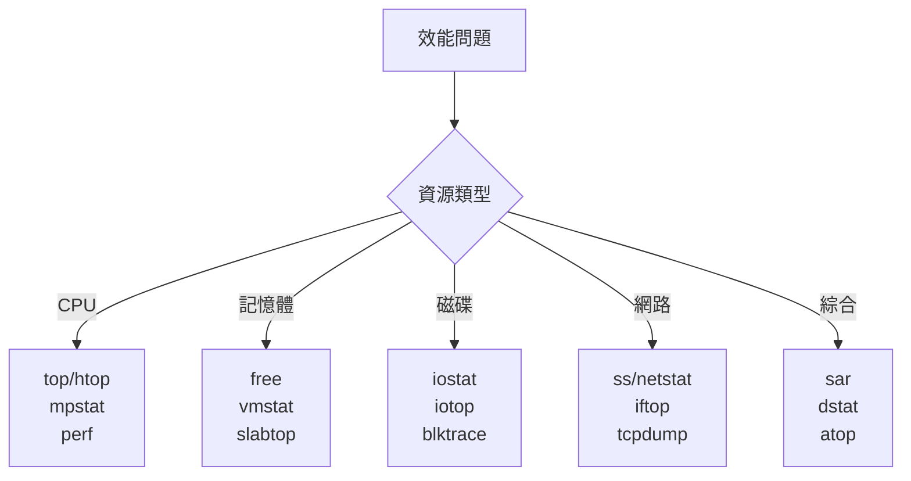

# 效能調優與診斷

## 目錄
- [概述](#概述)
- [效能分析方法論](#效能分析方法論)
- [CPU 效能調優](#cpu-效能調優)
- [記憶體效能調優](#記憶體效能調優)
- [磁碟 IO 效能調優](#磁碟-io-效能調優)
- [網路效能調優](#網路效能調優)
- [系統調優參數](#系統調優參數)
- [效能診斷工具](#效能診斷工具)
- [瓶頸分析](#瓶頸分析)
- [實戰案例](#實戰案例)

---

## 概述

系統效能調優是透過分析、診斷與優化來提升系統資源利用率與回應速度。核心目標是識別瓶頸並針對性優化。

**核心資源：**
- CPU: 運算能力
- Memory: 資料暫存
- Disk I/O: 儲存讀寫
- Network: 網路傳輸

**調優流程：**
1. 監控與基準測試
2. 識別瓶頸
3. 分析根因
4. 實施優化
5. 驗證效果

---

## 效能分析方法論

### USE 方法 (Utilization, Saturation, Errors)

| 資源 | 使用率 (Utilization) | 飽和度 (Saturation) | 錯誤 (Errors) |
|------|---------------------|-------------------|--------------|
| CPU | %CPU | Run queue length | CPU errors |
| Memory | Used/Total | Swap activity | OOM kills |
| Disk | %util | Wait queue | I/O errors |
| Network | Throughput | Buffer overflows | Packet drops |

### Linux 效能觀察工具全景



---

## CPU 效能調優

### CPU 使用率查看

```bash
$ top
%Cpu(s):  5.0 us,  2.0 sy,  0.0 ni, 92.0 id,  1.0 wa,  0.0 hi,  0.0 si,  0.0 st

$ mpstat 1 5
Linux 5.15.0 (server)   01/10/2024
10:30:00 AM  CPU    %usr   %nice    %sys %iowait    %irq   %soft  %steal  %guest  %gnice   %idle
10:30:01 AM  all    5.00    0.00    2.00    1.00    0.00    0.10    0.00    0.00    0.00   91.90

$ sar -u 1 3
```

**指標說明：**
- `%us (user)`: 使用者空間 CPU
- `%sy (system)`: 核心空間 CPU
- `%ni (nice)`: 低優先級程序 CPU
- `%id (idle)`: 閒置 CPU
- `%wa (iowait)`: 等待 I/O
- `%hi (hardware interrupt)`: 硬體中斷
- `%si (software interrupt)`: 軟體中斷
- `%st (steal)`: 被虛擬機偷走的 CPU

### 識別 CPU 密集程序

```bash
$ top

$ ps aux --sort=-%cpu | head -10

$ pidstat 1 5

$ pidstat -p 1234 1
```

### CPU 親和性設定

```bash
$ taskset -c 0,1 command

$ taskset -cp 0,1 1234

$ taskset -p 1234
pid 1234's current affinity mask: f
```

### CPU 頻率調整

```bash
$ cat /sys/devices/system/cpu/cpu0/cpufreq/scaling_governor
powersave

$ sudo cpupower frequency-set -g performance

$ sudo cpupower frequency-info

$ sudo cpupower frequency-set -f 2.4GHz
```

### 程序優先級調整

```bash
$ nice -n 10 command

$ renice 10 -p 1234

$ ps -eo pid,ni,comm | grep process

$ ionice -c2 -n0 command

$ ionice -p 1234
```

---

## 記憶體效能調優

### 記憶體使用查看

```bash
$ free -h
              total        used        free      shared  buff/cache   available
Mem:           15Gi       3.0Gi       8.0Gi       100Mi       4.0Gi        11Gi
Swap:         2.0Gi          0B       2.0Gi

$ vmstat 1 5
procs -----------memory---------- ---swap-- -----io---- -system-- ------cpu-----
 r  b   swpd   free   buff  cache   si   so    bi    bo   in   cs us sy id wa st
 2  0      0 8388608 102400 4194304   0    0     5    10  100  200  5  2 92  1  0

$ cat /proc/meminfo
```

### 記憶體洩漏檢測

```bash
$ ps aux --sort=-%mem | head -10

$ pmap -x 1234

$ smem -rs uss

$ valgrind --leak-check=full ./program
```

### Swap 管理

```bash
$ swapon --show
NAME      TYPE SIZE USED PRIO
/swapfile file   2G   0B   -2

$ sudo swapoff -a
$ sudo swapon -a

$ cat /proc/swaps

$ sudo sysctl vm.swappiness=10
$ sudo sysctl -w vm.swappiness=10

$ sudo vi /etc/sysctl.conf
vm.swappiness = 10
```

### 記憶體快取管理

```bash
$ sync; echo 3 | sudo tee /proc/sys/vm/drop_caches

$ sync; echo 1 | sudo tee /proc/sys/vm/drop_caches

$ sync; echo 2 | sudo tee /proc/sys/vm/drop_caches

$ sudo sysctl vm.vfs_cache_pressure=50
```

### OOM Killer

```bash
$ dmesg | grep -i "out of memory"
Out of memory: Killed process 1234 (apache2)

$ cat /proc/1234/oom_score
$ cat /proc/1234/oom_score_adj

$ echo -1000 | sudo tee /proc/1234/oom_score_adj

$ sudo vi /etc/systemd/system/myservice.service
[Service]
OOMScoreAdjust=-900
```

---

## 磁碟 IO 效能調優

### 磁碟 IO 監控

```bash
$ iostat -x 1 5
Device            r/s     w/s     rkB/s   wkB/s  %util
sda             10.00   20.00    200.0   400.0   25.5

$ iotop

$ iotop -o -b -n 3

$ pidstat -d 1 5
```

**關鍵指標：**
- `r/s, w/s`: 每秒讀寫次數
- `rkB/s, wkB/s`: 每秒讀寫 KB 數
- `await`: 平均等待時間 (ms)
- `%util`: 裝置使用率

### 檔案系統調優

```bash
$ sudo tune2fs -l /dev/sda1

$ sudo tune2fs -o journal_data_writeback /dev/sda1

$ sudo tune2fs -O ^has_journal /dev/sda1

$ mount -o noatime,nodiratime /dev/sda1 /mnt

$ sudo vi /etc/fstab
/dev/sda1  /data  ext4  defaults,noatime,nodiratime  0  2
```

### IO 調度器

```bash
$ cat /sys/block/sda/queue/scheduler
[mq-deadline] kyber bfq none

$ echo "kyber" | sudo tee /sys/block/sda/queue/scheduler

$ sudo vi /etc/default/grub
GRUB_CMDLINE_LINUX="elevator=kyber"
$ sudo update-grub

$ cat /sys/block/sda/queue/iosched/
```

### 讀寫快取

```bash
$ hdparm -W /dev/sda

$ sudo hdparm -W1 /dev/sda

$ blockdev --getra /dev/sda
$ sudo blockdev --setra 4096 /dev/sda
```

### RAID 與 LVM

```bash
$ cat /proc/mdstat

$ sudo mdadm --detail /dev/md0

$ sudo lvdisplay
$ sudo pvdisplay

$ sudo lvextend -L +10G /dev/vg0/lv_data
$ sudo resize2fs /dev/vg0/lv_data
```

---

## 網路效能調優

### 網路流量監控

```bash
$ sar -n DEV 1 3
IFACE   rxpck/s   txpck/s    rxkB/s    txkB/s
eth0    1234.00    567.00    890.00    123.00

$ ifstat 1

$ iftop

$ nethogs

$ nload
```

### TCP 調優

```bash
$ sudo sysctl -w net.core.rmem_max=26214400
$ sudo sysctl -w net.core.wmem_max=26214400
$ sudo sysctl -w net.ipv4.tcp_rmem='4096 87380 26214400'
$ sudo sysctl -w net.ipv4.tcp_wmem='4096 65536 26214400'

$ sudo sysctl -w net.ipv4.tcp_congestion_control=bbr

$ sudo sysctl -w net.core.netdev_max_backlog=5000

$ sudo sysctl -w net.ipv4.tcp_max_syn_backlog=8192

$ sudo sysctl -w net.core.somaxconn=1024

$ sudo vi /etc/sysctl.conf
net.core.rmem_max = 26214400
net.core.wmem_max = 26214400
net.ipv4.tcp_rmem = 4096 87380 26214400
net.ipv4.tcp_wmem = 4096 65536 26214400
net.ipv4.tcp_congestion_control = bbr
net.core.netdev_max_backlog = 5000
net.ipv4.tcp_max_syn_backlog = 8192
net.core.somaxconn = 1024

$ sudo sysctl -p
```

### 網卡設定

```bash
$ ethtool eth0

$ sudo ethtool -K eth0 tso on
$ sudo ethtool -K eth0 gso on
$ sudo ethtool -K eth0 gro on

$ sudo ethtool -G eth0 rx 4096 tx 4096

$ sudo ethtool -C eth0 rx-usecs 100
```

---

## 系統調優參數

### 核心參數 (sysctl)

**查看所有參數：**
```bash
$ sysctl -a

$ sysctl vm.swappiness
vm.swappiness = 60

$ sudo sysctl -w vm.swappiness=10

$ sudo vi /etc/sysctl.conf
vm.swappiness = 10
vm.vfs_cache_pressure = 50
vm.dirty_ratio = 10
vm.dirty_background_ratio = 5
fs.file-max = 2097152
kernel.pid_max = 4194304

$ sudo sysctl -p
```

### 檔案描述符限制

```bash
$ ulimit -n
1024

$ ulimit -n 65536

$ sudo vi /etc/security/limits.conf
*               soft    nofile          65536
*               hard    nofile          65536
root            soft    nofile          65536
root            hard    nofile          65536

$ cat /proc/sys/fs/file-max
$ echo 2097152 | sudo tee /proc/sys/fs/file-max
```

### 程序限制

```bash
$ ulimit -a

$ ulimit -u 4096

$ sudo vi /etc/security/limits.conf
*               soft    nproc           4096
*               hard    nproc           4096
```

---

## 效能診斷工具

### perf

```bash
$ sudo perf top

$ sudo perf record -g -- command
$ sudo perf report

$ sudo perf stat command

$ sudo perf list
```

### strace

```bash
$ strace command

$ strace -p 1234

$ strace -c command

$ strace -e trace=open,read,write command

$ strace -f -p 1234
```

### ltrace

```bash
$ ltrace command

$ ltrace -p 1234

$ ltrace -c command
```

### SystemTap / BPF

```bash
$ sudo apt install systemtap

$ sudo stap -e 'probe kernel.function("sys_open") {printf("%s\n", execname())}'

$ sudo apt install bpftrace

$ sudo bpftrace -e 'tracepoint:syscalls:sys_enter_openat { @[comm] = count(); }'
```

---

## 瓶頸分析

### CPU 瓶頸特徵

```bash
$ uptime
10:30:15 up 5 days, 3:24, 2 users, load average: 8.15, 7.10, 6.05

$ grep "model name" /proc/cpuinfo | wc -l
4

$ top
%Cpu(s): 85.0 us, 10.0 sy,  0.0 ni,  0.0 id,  5.0 wa
```

**判斷：**
- Load Average > CPU 核心數
- CPU 使用率持續 > 80%
- 大量程序處於 Running 狀態

### 記憶體瓶頸特徵

```bash
$ free -h
Mem:  15Gi  14Gi  100Mi  50Mi  800Mi  500Mi
Swap:  2Gi  1.5Gi  500Mi

$ vmstat 1 5
 r  b   swpd   free   si   so
 5  2  1572864  102400  100  200
```

**判斷：**
- Available memory < 10%
- 頻繁 swap in/out (si/so > 0)
- OOM killer 觸發

### 磁碟 IO 瓶頸特徵

```bash
$ iostat -x 1 5
Device   %util   await
sda       95.0   250.0

$ iotop -o
```

**判斷：**
- %util 接近 100%
- await > 20ms
- iowait (wa) > 20%

### 網路瓶頸特徵

```bash
$ sar -n DEV 1 3
IFACE   rxkB/s   txkB/s   %ifutil
eth0    118000   115000    95.0

$ netstat -s | grep -i error
```

**判斷：**
- 網卡利用率 > 80%
- 大量封包丟失
- 高延遲

---

## 實戰案例

### 案例 1: 高 CPU 使用率診斷

```bash
$ top
%Cpu(s): 95.0 us,  3.0 sy,  0.0 ni,  0.0 id,  2.0 wa

$ ps aux --sort=-%cpu | head -5
USER       PID %CPU %MEM    VSZ   RSS COMMAND
www-data  1234 85.0  5.0 500000 80000 /usr/bin/python app.py

$ top -H -p 1234

$ strace -c -p 1234
% time     seconds  usecs/call     calls    errors syscall
 99.50    0.995000        1000      1000           select

$ perf record -g -p 1234
$ perf report

$ sudo renice -n 10 -p 1234

$ taskset -cp 0,1 1234
```

### 案例 2: 記憶體洩漏排查

```bash
$ ps aux --sort=-%mem | head -5
USER       PID %CPU %MEM    VSZ   RSS COMMAND
app       5678  5.0 45.0 8000000 7200000 ./myapp

$ pmap -x 5678 | tail -5
total          8000000K

$ cat /proc/5678/status | grep -i vm

$ valgrind --leak-check=full --show-leak-kinds=all ./myapp

$ sudo gdb -p 5678
(gdb) dump memory memory.dump 0x... 0x...
```

### 案例 3: 磁碟 IO 慢診斷

```bash
$ iostat -x 1 5
Device   r/s   w/s  await  %util
sda     500   800   150.0   98.0

$ iotop -o
  TID  PRIO  USER   DISK READ  DISK WRITE  COMMAND
 1234  be/4  mysql    50 M/s     80 M/s   mysqld

$ lsof -p 1234 | grep -E "\.ibd|\.log"

$ cat /sys/block/sda/queue/scheduler
[mq-deadline] kyber bfq

$ echo "kyber" | sudo tee /sys/block/sda/queue/scheduler

$ sudo tune2fs -o journal_data_writeback /dev/sda1

$ mount -o remount,noatime /data
```

### 案例 4: 網路延遲優化

```bash
$ ping -c 10 server
rtt min/avg/max/mdev = 50.123/75.456/100.789/15.234 ms

$ mtr server

$ traceroute server

$ ss -tin state established '( dport = :80 or sport = :80 )'

$ sudo sysctl -w net.ipv4.tcp_congestion_control=bbr

$ sudo sysctl -w net.ipv4.tcp_rmem='4096 87380 16777216'
$ sudo sysctl -w net.ipv4.tcp_wmem='4096 65536 16777216'

$ sudo ethtool -K eth0 tso on gso on gro on

$ iperf3 -s

$ iperf3 -c server -t 30
```

### 案例 5: 系統整體調優

```bash
#!/bin/bash

echo "===== CPU ====="
mpstat 1 1

echo "===== 記憶體 ====="
free -h

echo "===== 磁碟 IO ====="
iostat -x 1 1

echo "===== 網路 ====="
sar -n DEV 1 1

echo "===== Top 程序 (CPU) ====="
ps aux --sort=-%cpu | head -6

echo "===== Top 程序 (記憶體) ====="
ps aux --sort=-%mem | head -6

echo "===== 連線狀態 ====="
ss -s

echo "===== 系統調優建議 ====="

CPU_IDLE=$(mpstat 1 1 | awk '/Average/ {print $NF}' | cut -d. -f1)
if [ $CPU_IDLE -lt 20 ]; then
    echo "- CPU 使用率過高,考慮增加 CPU 或優化程序"
fi

MEM_AVAIL=$(free -m | awk '/Mem:/ {print $7}')
MEM_TOTAL=$(free -m | awk '/Mem:/ {print $2}')
MEM_PERCENT=$((MEM_AVAIL * 100 / MEM_TOTAL))
if [ $MEM_PERCENT -lt 10 ]; then
    echo "- 可用記憶體不足,考慮增加記憶體或優化程序"
fi

DISK_UTIL=$(iostat -x 1 1 | awk '/sda/ {print $NF}' | cut -d. -f1)
if [ $DISK_UTIL -gt 80 ]; then
    echo "- 磁碟 IO 使用率高,考慮使用 SSD 或優化 IO"
fi
```

---

> **參考資料：**
> - Systems Performance: Enterprise and the Cloud (Brendan Gregg)
> - Linux Performance Tools
> - Red Hat Performance Tuning Guide
> - Kernel Documentation: sysctl
