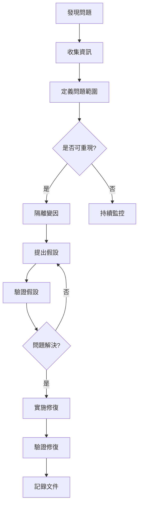
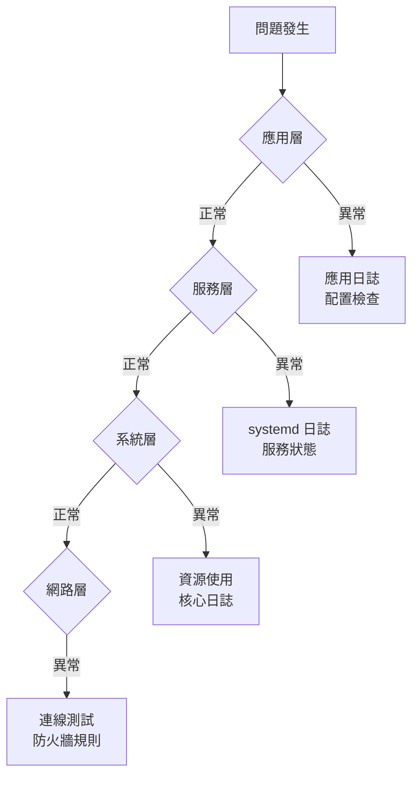

# 故障排查與除錯

## 目錄
- [概述](#概述)
- [故障排查方法論](#故障排查方法論)
- [開機問題](#開機問題)
- [系統無回應](#系統無回應)
- [服務啟動失敗](#服務啟動失敗)
- [網路連線問題](#網路連線問題)
- [效能問題](#效能問題)
- [磁碟空間問題](#磁碟空間問題)
- [核心問題與 Panic](#核心問題與-panic)
- [常用除錯工具](#常用除錯工具)
- [實戰案例](#實戰案例)

---

## 概述

故障排查是系統管理的核心技能,需要系統性思維與豐富的工具知識。

**故障排查原則：**
1. 收集資訊
2. 重現問題
3. 隔離變因
4. 提出假設
5. 驗證假設
6. 實施修復
7. 記錄過程

---

## 故障排查方法論

### 系統性排查流程



### 分層診斷法



### 常用命令速查

| 問題類型 | 檢查命令 |
|---------|---------|
| 開機 | `dmesg`, `journalctl -xb`, `/var/log/boot.log` |
| 服務 | `systemctl status`, `journalctl -u service` |
| 網路 | `ping`, `traceroute`, `ss`, `tcpdump` |
| 磁碟 | `df`, `du`, `iostat`, `lsof` |
| CPU | `top`, `htop`, `mpstat`, `perf` |
| 記憶體 | `free`, `vmstat`, `ps aux --sort=-%mem` |
| 程序 | `ps`, `pstree`, `strace`, `lsof -p` |

---

## 開機問題

### GRUB 問題

**症狀:** 無法進入 GRUB 選單或 GRUB 錯誤

**診斷:**
```bash
$ ls (hd0,1)/

error: file '/boot/grub/i386-pc/normal.mod' not found
```

**修復:**
```bash
$ boot-repair

$ sudo grub-install /dev/sda
$ sudo update-grub

$ sudo mount /dev/sda1 /mnt
$ sudo mount --bind /dev /mnt/dev
$ sudo mount --bind /proc /mnt/proc
$ sudo mount --bind /sys /mnt/sys
$ sudo chroot /mnt
$ grub-install /dev/sda
$ update-grub
$ exit
```

### 檔案系統損壞

**症狀:** 開機失敗,進入維護模式

```bash
Give root password for maintenance
(or press Control-D to continue):

$ fsck /dev/sda1

$ e2fsck -f /dev/sda1

$ xfs_repair /dev/sda1
```

### fstab 錯誤

**症狀:** 開機掛載失敗

```bash
$ cat /etc/fstab

UUID=xxx  /data  ext4  defaults  0  2

$ blkid

$ sudo vi /etc/fstab

$ mount -a
```

### 啟動目標錯誤

```bash
$ systemctl get-default
multi-user.target

$ sudo systemctl set-default graphical.target

$ sudo systemctl isolate multi-user.target

$ sudo systemctl rescue

$ sudo systemctl emergency
```

---

## 系統無回應

### 確認系統狀態

```bash
$ ping server

$ ssh server

$ tail -f /var/log/syslog
```

### 透過 Console 存取

```bash
$ sudo reboot

$ sudo systemctl reboot

$ echo b > /proc/sysrq-trigger

$ echo s > /proc/sysrq-trigger
$ echo u > /proc/sysrq-trigger
$ echo b > /proc/sysrq-trigger
```

### 檢查資源耗盡

```bash
$ top

$ ps aux --sort=-%cpu | head

$ ps aux --sort=-%mem | head

$ df -h

$ free -h
```

### 終止失控程序

```bash
$ kill -9 PID

$ pkill -9 process_name

$ killall -9 process_name

$ sudo systemctl kill --signal=SIGKILL service.service
```

---

## 服務啟動失敗

### systemd 服務診斷

```bash
$ systemctl status nginx.service
● nginx.service - A high performance web server
   Loaded: loaded (/lib/systemd/system/nginx.service; enabled)
   Active: failed (Result: exit-code) since Wed 2024-01-10 10:30:00 UTC
  Process: 1234 ExecStart=/usr/sbin/nginx (code=exited, status=1/FAILURE)

$ journalctl -u nginx.service
Jan 10 10:30:00 server nginx[1234]: nginx: [emerg] bind() to 0.0.0.0:80 failed (98: Address already in use)

$ journalctl -u nginx.service --since today

$ journalctl -u nginx.service -f

$ journalctl -xe
```

### 檢查配置檔

```bash
$ nginx -t
nginx: the configuration file /etc/nginx/nginx.conf syntax is ok
nginx: configuration file /etc/nginx/nginx.conf test is successful

$ apache2ctl configtest

$ sshd -t
```

### 檢查埠號衝突

```bash
$ sudo ss -tuln | grep :80
tcp   LISTEN 0  128  *:80  *:*

$ sudo lsof -i :80
COMMAND  PID   USER   FD   TYPE DEVICE SIZE/OFF NODE NAME
nginx   1234   root    6u  IPv4  12345      0t0  TCP *:http (LISTEN)

$ sudo fuser 80/tcp
80/tcp:  1234

$ sudo kill -9 1234
```

### 檢查權限問題

```bash
$ ls -la /var/log/nginx/
drwxr-x--- 2 www-data adm 4096 Jan 10 10:00 .

$ sudo chown -R www-data:www-data /var/log/nginx/
$ sudo chmod -R 750 /var/log/nginx/

$ namei -l /var/www/html/index.html
```

### 依賴問題

```bash
$ systemctl list-dependencies nginx.service

$ systemctl cat nginx.service
[Unit]
After=network.target
Requires=network.target

$ systemctl is-enabled network.target
$ systemctl status network.target
```

---

## 網路連線問題

### 基本連線測試

```bash
$ ping 8.8.8.8
PING 8.8.8.8 (8.8.8.8) 56(84) bytes of data.
64 bytes from 8.8.8.8: icmp_seq=1 ttl=115 time=12.3 ms

$ ping -c 4 google.com

$ traceroute google.com

$ mtr google.com
```

### DNS 問題

```bash
$ nslookup google.com
;; connection timed out; no servers could be reached

$ cat /etc/resolv.conf
nameserver 127.0.0.53

$ dig google.com

$ dig @8.8.8.8 google.com

$ host google.com

$ systemd-resolve --status
```

### 網路介面問題

```bash
$ ip link show
2: eth0: <BROADCAST,MULTICAST> mtu 1500 qdisc noop state DOWN

$ sudo ip link set eth0 up

$ ip addr show eth0

$ sudo dhclient eth0

$ sudo ip addr add 192.168.1.100/24 dev eth0
$ sudo ip route add default via 192.168.1.1
```

### 路由問題

```bash
$ ip route show
default via 192.168.1.1 dev eth0

$ traceroute -n 8.8.8.8

$ sudo ip route add 10.0.0.0/8 via 192.168.1.254
```

### 防火牆問題

```bash
$ sudo iptables -L -n -v

$ sudo firewall-cmd --list-all

$ sudo ufw status verbose

$ nc -zv server 80
Connection to server 80 port [tcp/http] succeeded!

$ telnet server 80

$ sudo tcpdump -i eth0 port 80
```

---

## 效能問題

### CPU 高使用率

```bash
$ top
%Cpu(s): 95.0 us,  3.0 sy,  0.0 ni,  0.0 id,  2.0 wa

$ ps aux --sort=-%cpu | head -10

$ pidstat 1 5

$ perf top

$ strace -c -p PID

$ renice -n 10 -p PID
```

### 記憶體不足

```bash
$ free -h
Mem:  15Gi  14Gi  100Mi

$ ps aux --sort=-%mem | head -10

$ pmap -x PID

$ cat /proc/meminfo

$ dmesg | grep -i "out of memory"
Out of memory: Killed process 1234 (apache2)

$ swapon --show
$ sudo swapon /swapfile
```

### 磁碟 IO 慢

```bash
$ iostat -x 1 5
Device   r/s   w/s  await  %util
sda     500   800   150.0   98.0

$ iotop -o

$ lsof | grep /var

$ df -i
```

### 網路延遲

```bash
$ ping -c 10 server | tail -1
rtt min/avg/max/mdev = 50.1/75.4/100.7/15.2 ms

$ traceroute server

$ mtr server

$ iperf3 -c server

$ ethtool eth0 | grep Speed
```

---

## 磁碟空間問題

### 檢查磁碟使用

```bash
$ df -h
Filesystem      Size  Used Avail Use% Mounted on
/dev/sda1        50G   48G   0.5G  99% /

$ df -i
Filesystem     Inodes  IUsed  IFree IUse% Mounted on
/dev/sda1      3276800 3276750    50  100% /
```

### 找出大檔案

```bash
$ du -sh /* | sort -hr | head -10

$ du -h /var/log | sort -hr | head -20

$ find / -type f -size +100M -exec ls -lh {} \;

$ find / -type f -size +1G -ls

$ ncdu /
```

### 清理空間

```bash
$ sudo apt clean
$ sudo apt autoclean
$ sudo apt autoremove

$ sudo dnf clean all

$ sudo journalctl --vacuum-size=100M

$ find /var/log -name "*.log" -mtime +30 -delete

$ find /tmp -type f -atime +7 -delete

$ docker system prune -a
```

### 刪除的檔案仍佔空間

```bash
$ lsof | grep deleted
apache2  1234  www-data   10w  REG  8,1  1073741824  123456 /var/log/apache2/access.log (deleted)

$ sudo kill -HUP 1234

$ sudo systemctl restart apache2

$ > /var/log/large.log
```

---

## 核心問題與 Panic

### 檢查核心訊息

```bash
$ dmesg

$ dmesg | grep -i error

$ dmesg | grep -i fail

$ journalctl -k

$ cat /var/log/kern.log
```

### Kernel Panic 分析

```bash
$ cat /var/crash/vmcore

$ cat /proc/cmdline
BOOT_IMAGE=/boot/vmlinuz root=/dev/sda1 ro quiet splash

$ uname -r
5.15.0-60-generic

$ cat /proc/version
```

### 核心模組問題

```bash
$ lsmod

$ lsmod | grep nvidia

$ modinfo nvidia

$ sudo modprobe -r nvidia
$ sudo modprobe nvidia

$ dmesg | grep nvidia
```

---

## 常用除錯工具

### strace - 系統呼叫追蹤

```bash
$ strace ls
execve("/usr/bin/ls", ["ls"], 0x7ffc... ) = 0
...

$ strace -c command

$ strace -p PID

$ strace -e trace=open,read,write command

$ strace -f command

$ strace -o output.txt command
```

### ltrace - 函式庫呼叫追蹤

```bash
$ ltrace ls

$ ltrace -c command

$ ltrace -p PID
```

### lsof - 開啟檔案清單

```bash
$ lsof

$ lsof -p PID

$ lsof /var/log/syslog

$ lsof -u username

$ lsof -i :80

$ lsof -i TCP:22

$ lsof +D /var/log
```

### gdb - 除錯器

```bash
$ gdb program

(gdb) run

(gdb) break main

(gdb) continue

(gdb) backtrace

(gdb) print variable

(gdb) attach PID

(gdb) detach
```

### valgrind - 記憶體除錯

```bash
$ valgrind --leak-check=full ./program

$ valgrind --tool=cachegrind ./program

$ valgrind --tool=callgrind ./program
```

---

## 實戰案例

### 案例 1: Web 服務無法啟動

**症狀:** Nginx 啟動失敗

```bash
$ systemctl status nginx
Active: failed

$ journalctl -u nginx -n 50
nginx: [emerg] bind() to 0.0.0.0:80 failed (98: Address already in use)

$ sudo ss -tuln | grep :80
tcp   LISTEN 0  128  *:80  *:*

$ sudo lsof -i :80
COMMAND  PID   USER
apache2  1234  root

$ sudo systemctl stop apache2

$ sudo systemctl start nginx
$ systemctl status nginx
Active: active (running)
```

### 案例 2: 系統突然變慢

**症狀:** 所有操作變慢

```bash
$ uptime
10:30:15 up 5 days, 3:24, 2 users, load average: 15.5, 12.3, 10.1

$ top
%Cpu(s):  2.0 us,  1.0 sy, 0.0 ni, 0.0 id, 97.0 wa

$ iostat -x 1 3
Device   %util  await
sda       99.0  500.0

$ iotop -o
  TID  PRIO  USER   DISK READ  DISK WRITE
 5678  be/4  mysql    500 M/s      0 B/s

$ sudo systemctl status mysql
Active: active (running)

$ mysql -u root -p
mysql> SHOW PROCESSLIST;
mysql> KILL 12345;

$ sudo systemctl restart mysql
```

### 案例 3: 無法 SSH 連線

**症狀:** SSH 連線超時

```bash
$ ping server
PING server (192.168.1.100)
64 bytes from 192.168.1.100: icmp_seq=1 ttl=64 time=1.23 ms

$ nc -zv server 22
nc: connect to server port 22 (tcp) timed out

$ sudo systemctl status sshd
Active: inactive (dead)

$ sudo systemctl start sshd
$ sudo systemctl enable sshd

$ ssh server
ssh: connect to host server port 22: Connection refused

$ sudo firewall-cmd --list-all
services: dhcpv6-client

$ sudo firewall-cmd --add-service=ssh --permanent
$ sudo firewall-cmd --reload

$ ssh server
Connection established
```

### 案例 4: 磁碟空間滿

**症狀:** 無法寫入檔案

```bash
$ touch test
touch: cannot touch 'test': No space left on device

$ df -h
/dev/sda1        50G   50G     0  100% /

$ du -sh /* | sort -hr | head -5
25G     /var
15G     /home
5G      /usr
3G      /opt
2G      /tmp

$ du -sh /var/* | sort -hr | head -5
20G     /var/log
3G      /var/lib
1.5G    /var/cache

$ du -sh /var/log/* | sort -hr | head -5
15G     /var/log/nginx
3G      /var/log/mysql
1.5G    /var/log/journal

$ ls -lh /var/log/nginx/
-rw-r--r-- 1 www-data adm 15G Jan 10 10:00 access.log

$ > /var/log/nginx/access.log

$ sudo systemctl reload nginx

$ df -h
/dev/sda1        50G   35G   13G   73% /
```

### 案例 5: 記憶體洩漏

**症狀:** 系統記憶體持續增長

```bash
$ free -h
Mem:  15Gi  14Gi  500Mi

$ ps aux --sort=-%mem | head -5
USER   PID %CPU %MEM    VSZ   RSS COMMAND
app   5678  5.0 85.0 15000000 13000000 ./myapp

$ pmap -x 5678 | tail -5
total          15000000K

$ top -p 5678
  PID USER      VIRT    RES
 5678 app      14.3g  12.4g

$ sudo gdb -p 5678
(gdb) generate-core-file
(gdb) detach
(gdb) quit

$ valgrind --leak-check=full ./myapp
==5678== HEAP SUMMARY:
==5678==     in use at exit: 1,000,000 bytes in 10,000 blocks
==5678== LEAK SUMMARY:
==5678==    definitely lost: 900,000 bytes in 9,000 blocks

$ sudo systemctl restart myapp
```

---

> **參考資料：**
> - Linux Troubleshooting Bible
> - Systems Performance (Brendan Gregg)
> - Linux Debugging and Performance Tuning
> - Red Hat System Administration Guide
