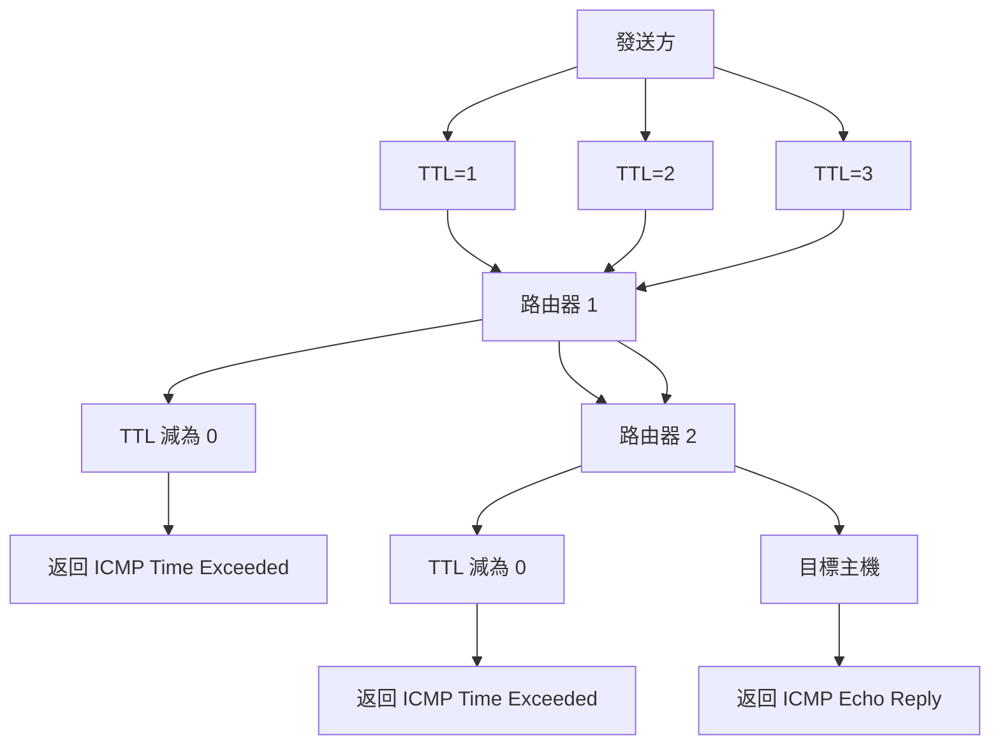
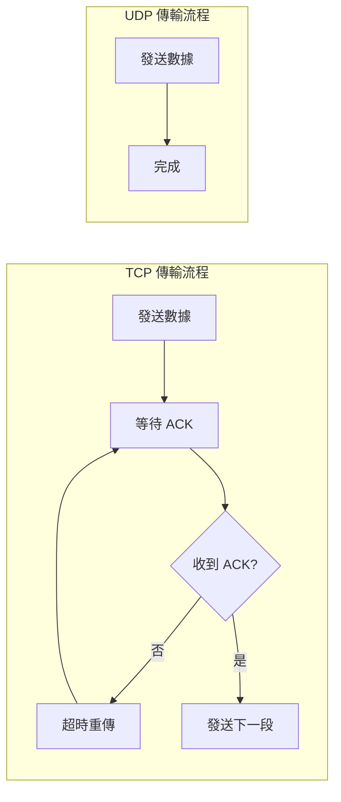
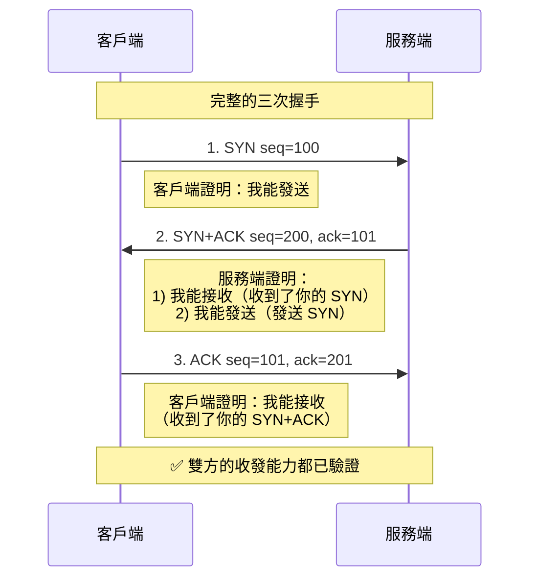
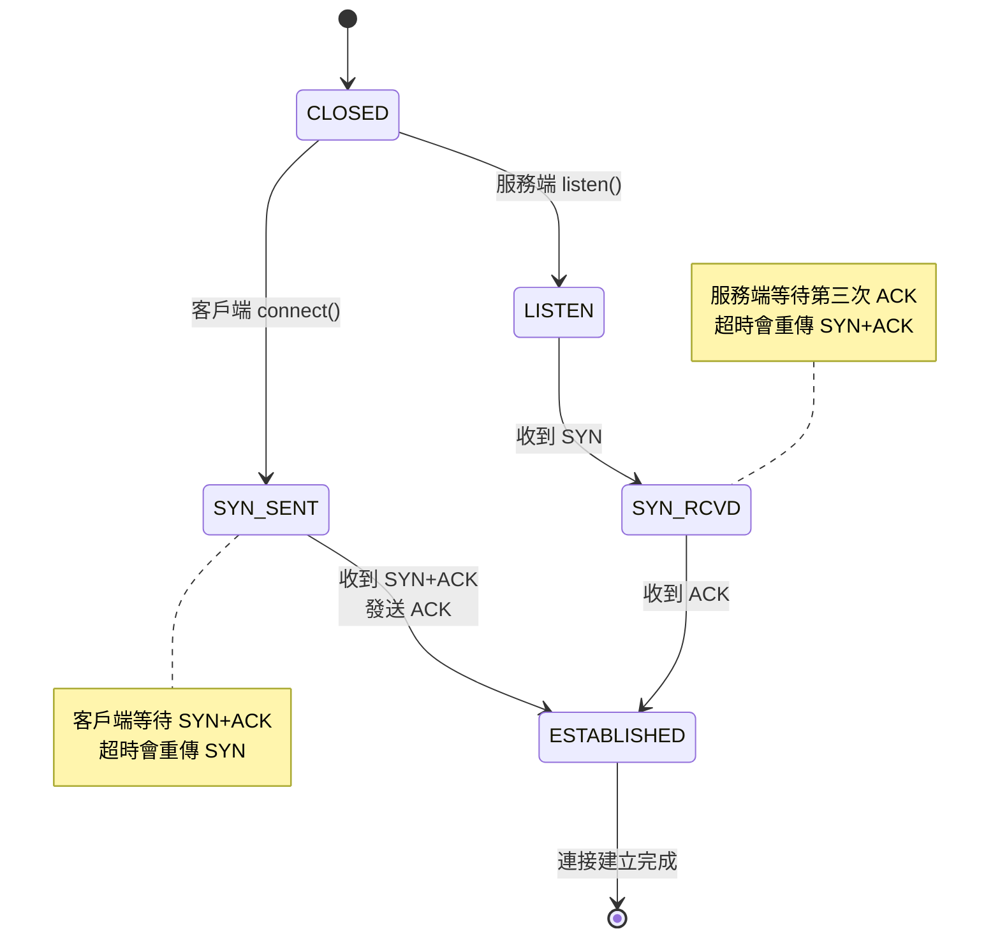
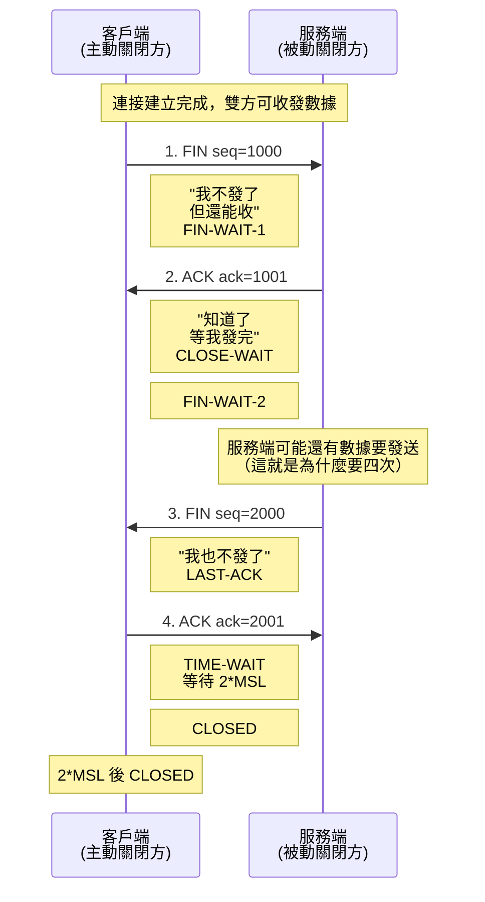
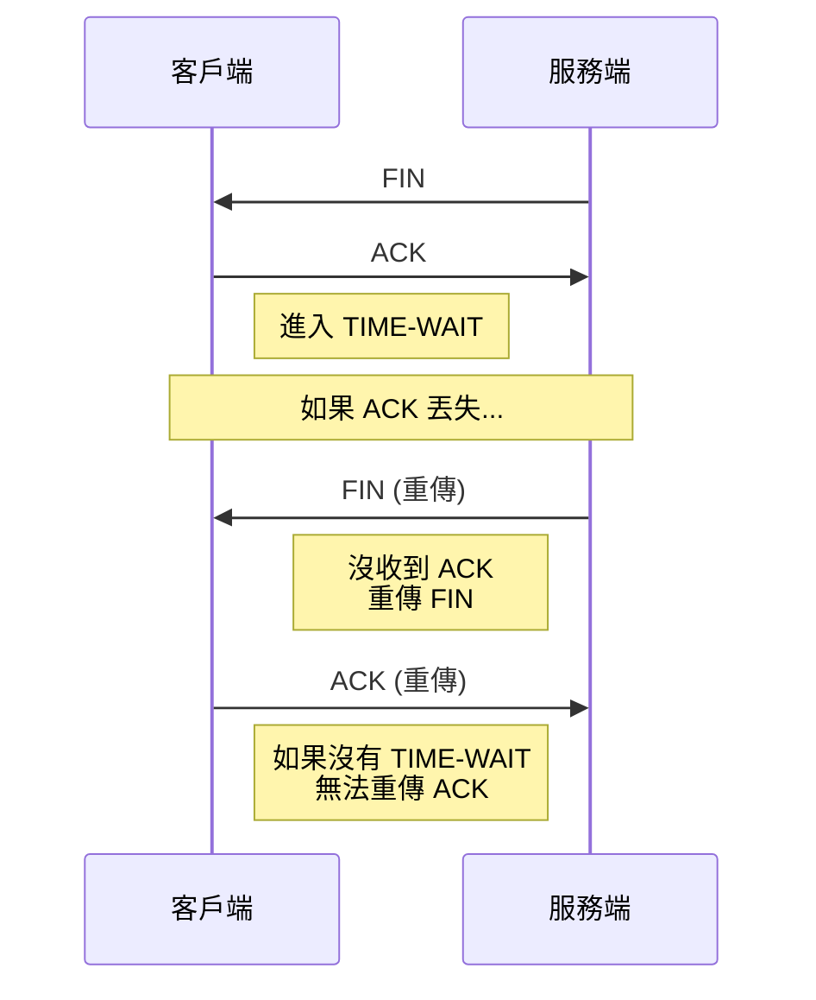
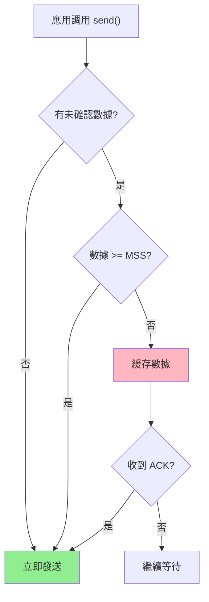
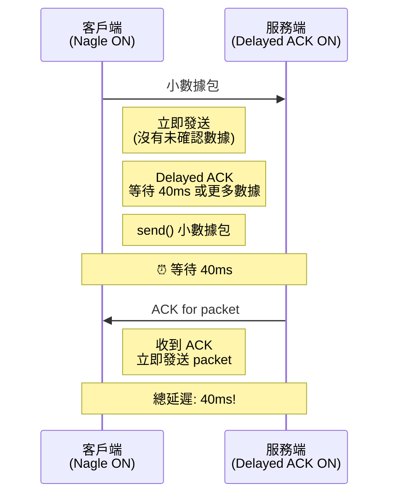
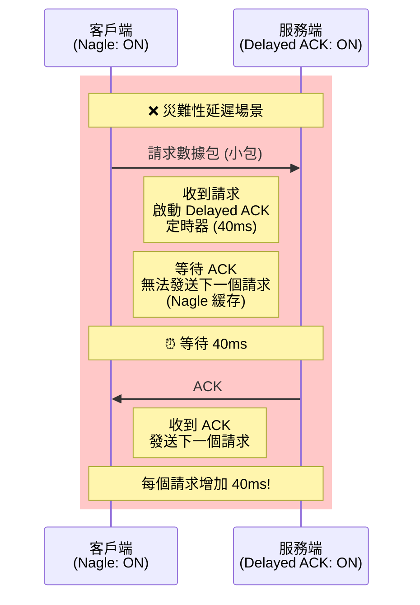

# HFT 計算機網路問題集

## 🔰 網路協議基礎 (HFT 必須理解的核心概念)

### N1: 你能描述一下 IP 數據包的基本結構嗎？TTL 字段有什麼作用？

**📋 面試回答**

一個 IP 數據包 (Packet) 主要由兩部分組成：

1. **IP Header (IP 報頭)**：包含所有關於路由和傳輸的控制信息
   - 長度：通常 20 個字節（無選項時）
   - 關鍵字段：Source Address, Destination Address, TTL, Protocol, Checksum

2. **Payload (有效載荷)**：承載高層協議的數據
   - TCP/UDP 數據
   - 應用層數據（如 HFT 中的訂單/行情數據）

**TTL (Time To Live)** 是一個 8 位字段，有兩個主要作用：

1. **防止數據包在網路中無限循環**
   - 初始值：通常設置為 64、128 或 255
   - 每經過一個路由器，TTL 減 1
   - TTL 減至 0 時，路由器丟棄該數據包並返回 ICMP "Time Exceeded" 錯誤

2. **計算網路跳數 (Hop Count)**
   - `traceroute` 工具利用 TTL 來繪製完整路徑

**📚 概念詳解**

#### 為什麼 HFT 要關注 IP 報頭？

在 HFT 系統中：
- **最小化報頭開銷**：IP 報頭（20字節）+ TCP 報頭（20字節）= 40字節開銷
- **MTU 優化**：確保數據包不會分片（分片會增加延遲）
- **路由跳數**：減少跳數可降低延遲（每跳約 50-200μs）

#### IP 報頭結構詳解

```
 0                   1                   2                   3
 0 1 2 3 4 5 6 7 8 9 0 1 2 3 4 5 6 7 8 9 0 1 2 3 4 5 6 7 8 9 0 1
+-+-+-+-+-+-+-+-+-+-+-+-+-+-+-+-+-+-+-+-+-+-+-+-+-+-+-+-+-+-+-+-+
|Version|  IHL  |Type of Service|          Total Length         |
+-+-+-+-+-+-+-+-+-+-+-+-+-+-+-+-+-+-+-+-+-+-+-+-+-+-+-+-+-+-+-+-+
|         Identification        |Flags|      Fragment Offset    |
+-+-+-+-+-+-+-+-+-+-+-+-+-+-+-+-+-+-+-+-+-+-+-+-+-+-+-+-+-+-+-+-+
|  Time to Live |    Protocol   |         Header Checksum       |
+-+-+-+-+-+-+-+-+-+-+-+-+-+-+-+-+-+-+-+-+-+-+-+-+-+-+-+-+-+-+-+-+
|                       Source IP Address                       |
+-+-+-+-+-+-+-+-+-+-+-+-+-+-+-+-+-+-+-+-+-+-+-+-+-+-+-+-+-+-+-+-+
|                    Destination IP Address                     |
+-+-+-+-+-+-+-+-+-+-+-+-+-+-+-+-+-+-+-+-+-+-+-+-+-+-+-+-+-+-+-+-+
```

**關鍵字段說明**：
- **Version**: IPv4 (4) 或 IPv6 (6)
- **Protocol**: 上層協議（6=TCP, 17=UDP, 1=ICMP）
- **Total Length**: 整個 IP 數據包的長度（報頭+數據）
- **TTL**: 存活時間（防止路由循環）

#### traceroute 如何利用 TTL



**⚡ HFT 實踐**

```bash
# 檢查到交易所的路由路徑
traceroute -n exchange.example.com

# 典型 HFT 網路跳數：2-5 跳
# 每多一跳 ≈ 增加 50-200μs 延遲

# 檢查 MTU 路徑
ping -M do -s 1472 exchange.example.com
```

**HFT 優化建議**：
- 盡量減少路由跳數（直連交易所機房）
- 避免數據包分片（設置合適的 MSS）
- 監控 TTL 值檢測網路路徑變化

---

### N2: TCP 和 UDP 的報文結構有什麼主要區別？在 HFT 中你會如何選擇？

**📋 面試回答**

**TCP 和 UDP 報文結構的核心差異**：

| 特性 | TCP | UDP |
|------|-----|-----|
| **報頭大小** | 20-60 字節（可變） | 8 字節（固定） |
| **複雜度** | 複雜（可靠性機制） | 簡單（無狀態） |
| **關鍵字段** | 序列號、確認號、窗口大小、標誌位 | 僅長度、校驗和 |
| **開銷** | 高（控制信息多） | 低（最小化開銷） |

**TCP 報頭結構**（20+ 字節）：
- Source Port, Destination Port (各 16 bits)
- **Sequence Number** (32 bits) - 數據順序保證
- **Acknowledgment Number** (32 bits) - 可靠性保證
- **Flags** (9 bits) - SYN, ACK, FIN, RST, PSH, URG
- **Window Size** (16 bits) - 流量控制
- Checksum (16 bits)
- Options (0-40 bytes) - MSS, SACK 等

**UDP 報頭結構**（8 字節）：
- Source Port (16 bits)
- Destination Port (16 bits)
- Length (16 bits) - 整個 UDP 數據包長度
- Checksum (16 bits) - 可選的錯誤檢測

**HFT 中的選擇策略**：
- **TCP**: 訂單提交、交易確認（必須保證可靠）
- **UDP**: 市場行情廣播（速度優先，允許偶爾丟包）

**📚 概念詳解**

#### 為什麼 TCP 需要這麼複雜的報頭？

TCP 是**可靠傳輸協議**，需要額外的控制信息來實現：

1. **順序保證** (Sequence Number)
   - 數據可能亂序到達，需要重組
   - 32 位序列號可支持 4GB 數據的唯一標識

2. **可靠性** (Acknowledgment Number)
   - 確認對方已收到數據
   - 未確認的數據會重傳

3. **流量控制** (Window Size)
   - 防止發送方超過接收方處理能力
   - 動態調整發送速率

4. **連接管理** (Flags)
   - 建立連接（SYN）
   - 確認數據（ACK）
   - 關閉連接（FIN）

#### UDP 為什麼這麼簡單？

UDP 是**無連接、不可靠**協議，設計目標是：
- **速度優先**：無需等待確認
- **最小開銷**：8 字節固定報頭
- **應用層控制**：可靠性由應用層實現



#### HFT 中的應用場景

**TCP 使用場景**：
- **訂單提交**：必須保證可靠送達
- **交易確認**：不能丟失確認信息
- **風控通訊**：需要準確的狀態同步

**UDP 使用場景**：
- **市場行情廣播**：允許偶爾丟包，最新數據最重要
- **時間戳同步**：低延遲優先
- **內部監控數據**：可容忍少量丟失

**⚡ HFT 實踐**

```c
// HFT 市場數據使用 UDP
void receive_market_data_udp(int sockfd) {
    char buffer[1500];
    struct sockaddr_in src_addr;
    socklen_t addr_len = sizeof(src_addr);
    
    // UDP 單次接收即可，無需確認
    ssize_t n = recvfrom(sockfd, buffer, sizeof(buffer), 0,
                        (struct sockaddr*)&src_addr, &addr_len);
    
    if (n > 0) {
        // 直接處理，不等待 ACK
        process_market_data(buffer, n);
    }
}

// HFT 訂單提交使用 TCP
void send_order_tcp(int sockfd, const order_t* order) {
    // TCP 會自動處理 ACK、重傳、順序
    ssize_t n = send(sockfd, order, sizeof(*order), 0);
    
    if (n < 0) {
        // TCP 會重試，應用層只需處理連接錯誤
        handle_connection_error();
    }
}
```

**性能對比**（HFT 環境）：
- **UDP 延遲**：5-20μs（單向）
- **TCP 延遲**：10-50μs（包含 ACK 等待）
- **UDP 丟包率**：0.01-0.1%（數據中心內）
- **TCP 可靠性**：100%（通過重傳保證）

---

### N3: 你能詳細描述一下 TCP 三次握手的過程嗎？為什麼是三次而不是兩次？

**📋 面試回答**

TCP 三次握手是建立可靠連接的過程，分為三步：
2

**狀態轉換**：
```
客戶端: CLOSED → SYN-SENT → ESTABLISHED
服務端: CLOSED → LISTEN → SYN-RCVD → ESTABLISHED
```

**為什麼是三次？**
- **防止舊連接請求**：舊的 SYN 延遲到達不會造成錯誤連接
- **雙向確認**：確認雙方的發送和接收能力
- **同步序列號**：雙方交換並確認初始序列號

**📚 概念詳解**

#### 什麼是「握手」？

**生活化比喻**：就像打電話：
1. 你撥號（SYN）："喂，能聽到嗎？"
2. 對方接聽（SYN+ACK）："喂，聽得到！你能聽到我嗎？"
3. 你確認（ACK）："能聽到，我們開始聊吧！"

**技術角度**：
- **同步**：雙方交換初始序列號（seq）
- **確認**：雙方確認對方的發送和接收能力
- **建立**：雙方進入可以傳輸數據的狀態

#### 為什麼是三次不是兩次？



**如果只有兩次會怎樣？**

假設只有兩次握手：
```
1. 客戶端 → 服務端: SYN
2. 服務端 → 客戶端: SYN+ACK
[連接建立]
```

**問題**：
- 舊的 SYN 包延遲到達 → 服務端誤以為是新連接
- 服務端發送 SYN+ACK → 立即建立連接
- 客戶端不知情 → 服務端資源浪費

**三次握手防止此問題**：
- 第三次 ACK 確認客戶端確實想建立連接
- 舊的 SYN 不會收到第三次 ACK

#### 完整的狀態機圖



**⚡ HFT 實踐**

```bash
# 使用 tcpdump 觀察三次握手
sudo tcpdump -i any -n 'tcp[tcpflags] & (tcp-syn|tcp-ack) != 0' port 8080

# 輸出示例：
# 14:30:01.123456 IP 192.168.1.10.50001 > 192.168.1.20.8080: Flags [S], seq 1234567890
# 14:30:01.123789 IP 192.168.1.20.8080 > 192.168.1.10.50001: Flags [S.], seq 9876543210, ack 1234567891
# 14:30:01.123850 IP 192.168.1.10.50001 > 192.168.1.20.8080: Flags [.], ack 9876543211

# 使用 ss 查看連接狀態
ss -tan state syn-sent     # 客戶端正在握手
ss -tan state syn-recv     # 服務端正在握手
ss -tan state established  # 已建立的連接
```

**HFT 優化策略**：

1. **TCP Fast Open (TFO)**
```c
// 在第一次 SYN 中就發送數據
int enable = 1;
setsockopt(sockfd, SOL_TCP, TCP_FASTOPEN, &enable, sizeof(enable));
// 節省 1 個 RTT 的時間
```

2. **連接池**
```c
// 維護長連接，避免頻繁握手
// 複用已建立的連接
```

**延遲分析**：
- **握手開銷**：1.5 RTT
- **數據中心內 RTT**：~100μs
- **握手總延遲**：~150μs
- **HFT 優化目標**：使用長連接減少握手次數

---

### N4: TCP 四次揮手是如何進行的？TIME_WAIT 狀態有什麼作用？

**📋 面試回答**

TCP 四次揮手是關閉連接的過程，分為四步：

**揮手流程**：
1. **第一次揮手（FIN）**
   - 主動方發送：FIN=1, seq=u
   - 主動方狀態：ESTABLISHED → FIN-WAIT-1

2. **第二次揮手（ACK）**
   - 被動方發送：ACK=1, ack=u+1
   - 被動方狀態：ESTABLISHED → CLOSE-WAIT
   - 主動方狀態：FIN-WAIT-1 → FIN-WAIT-2

3. **第三次揮手（FIN）**
   - 被動方發送：FIN=1, seq=v
   - 被動方狀態：CLOSE-WAIT → LAST-ACK

4. **第四次揮手（ACK）**
   - 主動方發送：ACK=1, ack=v+1
   - 主動方狀態：FIN-WAIT-2 → TIME-WAIT
   - 被動方狀態：LAST-ACK → CLOSED

**TIME-WAIT 狀態的作用**：
- 持續時間：2 * MSL（Maximum Segment Lifetime，通常 60-120 秒）
- **確保最後的 ACK 到達**：如果 ACK 丟失，可以重傳
- **防止舊數據包干擾**：確保舊連接的數據包都已過期

**📚 概念詳解**

#### 為什麼需要四次揮手？

**TCP 是全雙工通信**：
- 連接的每個方向都需要獨立關閉
- 一方關閉發送（FIN），但仍可接收數據
- 確保雙方數據都能完整傳輸



#### TIME-WAIT 狀態詳解

**為什麼需要 TIME-WAIT？**

1. **確保最後的 ACK 能到達對方**


2. **防止舊連接的延遲數據包干擾新連接**
```
舊連接: 192.168.1.10:50001 → 192.168.1.20:8080
新連接: 192.168.1.10:50001 → 192.168.1.20:8080 (相同的四元組)

如果舊連接的延遲數據包到達新連接 → 數據錯亂！
TIME-WAIT 確保舊數據包都已過期（2*MSL 後）
```

**⚡ HFT 實踐**

```bash
# 查看 TIME-WAIT 連接數量
ss -tan state time-wait | wc -l

# 調整 TIME-WAIT 超時時間
sysctl net.ipv4.tcp_fin_timeout=30  # 默認 60 秒

# 啟用 TIME-WAIT 重用（客戶端）
sysctl net.ipv4.tcp_tw_reuse=1

# 使用 SO_REUSEADDR（服務端）
int opt = 1;
setsockopt(sockfd, SOL_SOCKET, SO_REUSEADDR, &opt, sizeof(opt));
```

**HFT 系統中的 TIME-WAIT 優化**：
- 使用**連接池**，減少頻繁關閉連接
- 啟用 `tcp_tw_reuse`（客戶端）
- 設置 `SO_REUSEADDR`（服務端重啟時立即綁定端口）
- ⚠️ 不推薦 `SO_LINGER=0`（會發送 RST，可能丟失數據）

---

### N5: 在高頻交易環境下，如何通過 Socket 選項快速回收或重用處於 TIME_WAIT 狀態的 Socket？

**📋 面試回答**

在 HFT 環境中處理 TIME_WAIT 的主要方法：

**1. SO_REUSEADDR (服務端)**
```c
int opt = 1;
setsockopt(sockfd, SOL_SOCKET, SO_REUSEADDR, &opt, sizeof(opt));
```
- 允許綁定處於 TIME-WAIT 的地址
- 適用場景：服務端重啟時立即綁定端口

**2. tcp_tw_reuse (客戶端)**
```bash
sysctl net.ipv4.tcp_tw_reuse=1
```
- 允許重用 TIME-WAIT 的 socket 用於新的**出站**連接
- 要求：啟用 TCP 時間戳 (`net.ipv4.tcp_timestamps=1`)

**3. tcp_fin_timeout (縮短等待時間)**
```bash
sysctl net.ipv4.tcp_fin_timeout=30  # 默認 60 秒
```
- 縮短 FIN-WAIT-2 狀態的超時時間

**4. 連接池（最佳方案）**
- 維護長連接，避免頻繁關閉
- 複用已建立的連接

**📚 概念詳解**

#### SO_REUSEADDR 深入理解

**什麼情況下需要 SO_REUSEADDR？**

場景：HFT 服務端程序崩潰後立即重啟
```bash
# 第一次啟動
./hft_server  # 綁定 0.0.0.0:8080

# 程序崩潰或被 kill

# 立即重啟
./hft_server
# 錯誤: bind: Address already in use

# 原因：舊連接還在 TIME-WAIT 狀態
```

**解決方案**：
```c
int create_hft_server_socket(int port) {
    int sockfd = socket(AF_INET, SOCK_STREAM, 0);
    
    // 關鍵：設置 SO_REUSEADDR
    int opt = 1;
    if (setsockopt(sockfd, SOL_SOCKET, SO_REUSEADDR, &opt, sizeof(opt)) < 0) {
        perror("setsockopt SO_REUSEADDR");
        return -1;
    }
    
    struct sockaddr_in addr;
    addr.sin_family = AF_INET;
    addr.sin_addr.s_addr = INADDR_ANY;
    addr.sin_port = htons(port);
    
    if (bind(sockfd, (struct sockaddr*)&addr, sizeof(addr)) < 0) {
        perror("bind");
        return -1;
    }
    
    listen(sockfd, SOMAXCONN);
    return sockfd;
}
```

#### tcp_tw_reuse 詳解

**什麼是 tcp_tw_reuse？**

允許內核在以下條件下重用 TIME-WAIT 的 socket：
1. 新連接的時間戳 > 舊連接的最後時間戳（防止數據混淆）
2. 僅適用於**客戶端出站連接**

**配置示例**：
```bash
# 啟用重用（需要同時啟用時間戳）
sysctl net.ipv4.tcp_tw_reuse=1
sysctl net.ipv4.tcp_timestamps=1

# 永久生效
cat >> /etc/sysctl.conf <<EOF
net.ipv4.tcp_tw_reuse = 1
net.ipv4.tcp_timestamps = 1
EOF
sysctl -p
```

**⚡ HFT 最佳實踐**

```c
// HFT 服務端 Socket 配置
int configure_hft_server_socket(int sockfd) {
    int opt = 1;
    
    // 1. 允許地址重用（重啟時立即綁定）
    setsockopt(sockfd, SOL_SOCKET, SO_REUSEADDR, &opt, sizeof(opt));
    
    // 2. 允許端口重用（多進程綁定同一端口）
    setsockopt(sockfd, SOL_SOCKET, SO_REUSEPORT, &opt, sizeof(opt));
    
    // 3. 啟用 TCP_NODELAY（禁用 Nagle）
    setsockopt(sockfd, IPPROTO_TCP, TCP_NODELAY, &opt, sizeof(opt));
    
    // 4. 設置發送/接收緩衝區
    int bufsize = 1024 * 1024;  // 1MB
    setsockopt(sockfd, SOL_SOCKET, SO_SNDBUF, &bufsize, sizeof(bufsize));
    setsockopt(sockfd, SOL_SOCKET, SO_RCVBUF, &bufsize, sizeof(bufsize));
    
    // 5. 啟用 Keep-Alive
    setsockopt(sockfd, SOL_SOCKET, SO_KEEPALIVE, &opt, sizeof(opt));
    
    return 0;
}
```

**系統級優化**：
```bash
#!/bin/bash
# HFT 系統 TIME-WAIT 優化腳本

# 1. 啟用 TIME-WAIT 重用（客戶端）
sysctl net.ipv4.tcp_tw_reuse=1

# 2. 啟用時間戳
sysctl net.ipv4.tcp_timestamps=1

# 3. 縮短 FIN-WAIT-2 超時
sysctl net.ipv4.tcp_fin_timeout=30

# 4. 增加本地端口範圍
sysctl net.ipv4.ip_local_port_range="10000 65535"

# 5. 檢查當前 TIME-WAIT 數量
echo "Current TIME-WAIT connections: $(ss -tan state time-wait | wc -l)"
```

---

### N6: 什麼是 Nagle 算法？它在高頻交易中有何缺點？如何禁用它？

**📋 面試回答**

**Nagle 算法**是 TCP 的一種優化機制，目的是減少小數據包的數量。

**算法規則**：
- 如果有未確認的數據（等待 ACK），新的小數據會被緩存
- 直到收到 ACK 或緩存達到 MSS (Maximum Segment Size) 大小才發送
- 提高網路利用率，但增加延遲

**在 HFT 中的缺點**：
- **增加延遲**：小訂單數據可能被延遲發送（等待 ACK 或湊夠 MSS）
- **不可預測**：延遲取決於網路狀況和數據大小
- **與 Delayed ACK 交互**：可能導致 40ms 延遲

**如何禁用**：
```c
int flag = 1;
setsockopt(sockfd, IPPROTO_TCP, TCP_NODELAY, &flag, sizeof(flag));
```

**📚 概念詳解**

#### Nagle 算法是什麼？

**生活化比喻**：寄包裹的策略

**不用 Nagle**：
- 每個小東西都單獨寄快遞 → 浪費快遞費（協議開銷）
- 快遞員很快送到 → 延遲低

**用 Nagle**：
- 等湊齊一車再寄 → 省快遞費（減少小包數量）
- 但要等待湊齊 → 延遲高

**HFT 為什麼不要 Nagle？**
因為 HFT 每 1 微秒都很寶貴，寧願多花「快遞費」（協議開銷），也要**立即發送**！

#### 技術原理詳解

**Nagle 算法的完整規則**：
```
if (有未發送的數據 && 數據量 < MSS && 有未確認的數據) {
    緩存數據，不立即發送
} else {
    立即發送
}
```

**什麼是 MSS？**
- MSS (Maximum Segment Size)：單個 TCP 報文段的最大數據量
- 計算：`MSS = MTU - IP Header (20) - TCP Header (20)`
- 典型值：以太網 MTU 1500 → MSS 1460 字節



#### 與 Delayed ACK 的交互問題



**為什麼會有 40ms 延遲？**
- 客戶端發送第一個小包（立即發送）
- 服務端啟用 Delayed ACK，等待 40ms
- 客戶端要發送第二個小包，但 Nagle 要求等待第一個包的 ACK
- 40ms 後服務端發送 ACK
- 客戶端才能發送第二個包

**⚡ HFT 實踐**

```c
// 禁用 Nagle 算法
int disable_nagle(int sockfd) {
    int flag = 1;
    int result = setsockopt(sockfd, 
                           IPPROTO_TCP,     // TCP 層選項
                           TCP_NODELAY,     // 禁用 Nagle
                           &flag,           // 啟用標誌
                           sizeof(flag));
    
    if (result < 0) {
        perror("setsockopt TCP_NODELAY");
        return -1;
    }
    
    return 0;
}

// HFT 訂單發送示例
typedef struct {
    char symbol[8];      // 股票代碼
    char side;           // 'B' or 'S'
    uint32_t quantity;   // 數量
    uint64_t price;      // 價格
} __attribute__((packed)) order_message_t;

int send_hft_order(int sockfd, const order_message_t* order) {
    // 發送小包（僅 17 字節）
    ssize_t sent = send(sockfd, order, sizeof(*order), 0);
    
    // 如果禁用 Nagle (TCP_NODELAY): 立即發送，延遲 < 10μs
    // 如果啟用 Nagle: 可能延遲 10-100ms（災難性！）
    
    return (sent == sizeof(*order)) ? 0 : -1;
}
```

**性能對比**（HFT 環境）：
- **Nagle ON**：50-100μs（不穩定）
- **Nagle OFF**：5-10μs（穩定）
- **提升**：10倍

---

### N7: 什麼是延遲確認 (Delayed ACK)？它與 Nagle 算法有什麼交互問題？

**📋 面試回答**

**延遲確認 (Delayed ACK)** 是 TCP 的另一種優化機制：

**工作原理**：
- 收到數據後不立即發送 ACK
- 等待一小段時間（通常 40-200ms）
- 希望能合併多個 ACK，或與回傳數據一起發送

**與 Nagle 的交互問題**：
- 當 Nagle 和 Delayed ACK 同時啟用時
- 客戶端等待 ACK 才能發送下一個小包
- 服務端延遲 ACK（等待 40ms）
- 造成 40ms 的延遲

**如何禁用 Delayed ACK**：
```c
// Linux 特定選項
int flag = 1;
setsockopt(sockfd, IPPROTO_TCP, TCP_QUICKACK, &flag, sizeof(flag));

// 注意：TCP_QUICKACK 是一次性的，每次 recv() 後需重新設置
```

**📚 概念詳解**

#### Delayed ACK 的目的

**為什麼要延遲 ACK？**
1. **減少 ACK 數量**：合併多個 ACK 到一個包
2. **捎帶確認**：與回傳數據一起發送 ACK（節省一個包）
3. **減少網路開銷**：每個 ACK 包都有 40 字節開銷（IP + TCP 報頭）

**工作機制**：
```
收到數據包 → 啟動 40-200ms 定時器 → 等待期間：
  1. 如果收到更多數據 → 合併 ACK
  2. 如果有數據要發送 → 捎帶 ACK
  3. 如果定時器到期 → 發送 ACK
```

#### 與 Nagle 的交互問題



**實際影響**：
- **單次請求**：延遲 40ms
- **10 次請求**：累積延遲 400ms
- **HFT 要求**：< 10μs
- **結論**：必須禁用至少一個（通常禁用 Nagle）

#### 如何解決這個問題

**方案 1：禁用 Nagle（推薦）**
```c
int flag = 1;
setsockopt(sockfd, IPPROTO_TCP, TCP_NODELAY, &flag, sizeof(flag));
// ✅ 一次設置，永久生效
```

**方案 2：禁用 Delayed ACK（較複雜）**
```c
// Linux 特定選項
int flag = 1;
setsockopt(sockfd, IPPROTO_TCP, TCP_QUICKACK, &flag, sizeof(flag));

// ⚠️ TCP_QUICKACK 是一次性的
// 需要在每次 recv() 後重新設置

while (1) {
    int n = recv(sockfd, buffer, sizeof(buffer), 0);
    
    // 重新啟用 QUICKACK
    int flag = 1;
    setsockopt(sockfd, IPPROTO_TCP, TCP_QUICKACK, &flag, sizeof(flag));
    
    process_data(buffer, n);
}
```

**方案 3：兩者都禁用（HFT 推薦）**
```c
// 禁用 Nagle
int nodelay = 1;
setsockopt(sockfd, IPPROTO_TCP, TCP_NODELAY, &nodelay, sizeof(nodelay));

// 禁用 Delayed ACK（每次 recv 後）
int quickack = 1;
setsockopt(sockfd, IPPROTO_TCP, TCP_QUICKACK, &quickack, sizeof(quickack));
```

**⚡ HFT 實踐**

```c
// HFT 完整的低延遲 Socket 配置
int configure_low_latency_socket(int sockfd) {
    int opt = 1;
    
    // 1. 禁用 Nagle（必須）
    if (setsockopt(sockfd, IPPROTO_TCP, TCP_NODELAY, &opt, sizeof(opt)) < 0) {
        perror("TCP_NODELAY");
        return -1;
    }
    
    // 2. 禁用 Delayed ACK（可選，Linux 專用）
    #ifdef TCP_QUICKACK
    if (setsockopt(sockfd, IPPROTO_TCP, TCP_QUICKACK, &opt, sizeof(opt)) < 0) {
        perror("TCP_QUICKACK");
        // 非致命錯誤，繼續
    }
    #endif
    
    // 3. 設置發送緩衝區
    int bufsize = 256 * 1024;
    setsockopt(sockfd, SOL_SOCKET, SO_SNDBUF, &bufsize, sizeof(bufsize));
    
    // 4. 設置接收緩衝區
    setsockopt(sockfd, SOL_SOCKET, SO_RCVBUF, &bufsize, sizeof(bufsize));
    
    return 0;
}

// HFT 接收循環（需要持續設置 QUICKACK）
void hft_receive_loop(int sockfd) {
    char buffer[4096];
    
    while (1) {
        int n = recv(sockfd, buffer, sizeof(buffer), 0);
        
        if (n > 0) {
            // 重新啟用 QUICKACK（因為它是一次性的）
            #ifdef TCP_QUICKACK
            int flag = 1;
            setsockopt(sockfd, IPPROTO_TCP, TCP_QUICKACK, &flag, sizeof(flag));
            #endif
            
            // 處理數據
            process_market_data(buffer, n);
        } else if (n == 0) {
            // 連接關閉
            break;
        } else {
            // 錯誤處理
            if (errno != EAGAIN && errno != EWOULDBLOCK) {
                perror("recv");
                break;
            }
        }
    }
}
```

**性能對比測試**：
```c
void benchmark_delayed_ack() {
    // 場景：發送 100 個小請求，測量總延遲
    
    // 測試 1：Nagle ON + Delayed ACK ON
    // 結果：~4000ms (40ms * 100)
    
    // 測試 2：Nagle OFF + Delayed ACK ON
    // 結果：~100ms (正常網路延遲)
    
    // 測試 3：Nagle OFF + Delayed ACK OFF
    // 結果：~50ms (最優)
}
```

---

(由於篇幅限制，繼續撰寫剩餘題目...)
