# HFT 計算機網路問題集

> **使用說明**: 🔥 表示難度, ⭐ 表示重要度  
> - 難度: 無符號 (基礎) → 🔥🔥🔥 (專家)  
> - 重要度: 無符號 (了解即可) → ⭐⭐⭐ (必須精通)

---

## 目錄

### 網路協議基礎
- [N1: IP 數據包結構與 TTL](#n1-ip-數據包結構與-ttl) 🔥 ⭐⭐
- [N2: TCP 和 UDP 報文結構差異](#n2-tcp-和-udp-報文結構差異) 🔥 ⭐⭐⭐
- [N3: TCP 三次握手](#n3-tcp-三次握手) 🔥 ⭐⭐
- [N4: TCP 四次揮手與 TIME-WAIT](#n4-tcp-四次揮手與-time-wait) 🔥🔥 ⭐⭐
- [N5: TIME-WAIT 優化](#n5-time-wait-優化) 🔥🔥 ⭐⭐⭐
- [N6: Nagle 算法](#n6-nagle-算法) 🔥🔥 ⭐⭐⭐
- [N7: 延遲確認 (Delayed ACK)](#n7-延遲確認-delayed-ack) 🔥🔥 ⭐⭐⭐

### HFT 進階網路技術
- [N8: UDP 在 HFT 中的應用](#n8-udp-在-hft-中的應用) 🔥 ⭐⭐⭐
- [N9: 組播 (Multicast) 接收市場數據](#n9-組播-multicast-接收市場數據) 🔥🔥 ⭐⭐
- [N10: MTU 與 MSS 優化](#n10-mtu-與-mss-優化) 🔥🔥 ⭐⭐
- [N11: TCP Fast Open](#n11-tcp-fast-open) 🔥🔥🔥 ⭐⭐
- [N12: 核心繞過 (Kernel Bypass)](#n12-核心繞過-kernel-bypass) 🔥🔥🔥 ⭐⭐⭐
- [N13: DPDK 基礎](#n13-dpdk-基礎) 🔥🔥🔥 ⭐⭐⭐
- [N14: RDMA 與 InfiniBand](#n14-rdma-與-infiniband) 🔥🔥🔥 ⭐⭐

### 時間與延遲優化
- [N15: 硬體時間戳](#n15-硬體時間戳) 🔥🔥🔥 ⭐⭐⭐
- [N16: PTP 時間同步](#n16-ptp-時間同步) 🔥🔥🔥 ⭐⭐
- [N17: 延遲測量與優化](#n17-延遲測量與優化) 🔥🔥 ⭐⭐⭐

### 故障排查與性能調優
- [N18: 網路抖動 (Jitter) 分析](#n18-網路抖動-jitter-分析) 🔥🔥 ⭐⭐
- [N19: 丟包問題診斷](#n19-丟包問題診斷) 🔥🔥 ⭐⭐
- [N20: TCP 擁塞控制算法選擇](#n20-tcp-擁塞控制算法選擇) 🔥🔥🔥 ⭐⭐

### 附錄
- [HFT 網路延遲預算表](#hft-網路延遲預算表)
- [常見故障排查指南](#常見故障排查指南)
- [實戰優化案例](#實戰優化案例)

---

## 🔰 網路協議基礎 (HFT 必須理解的核心概念)

### N1: IP 數據包結構與 TTL

**難度**: 🔥 | **重要度**: ⭐⭐ | **面試頻率**: 高

**📋 面試回答**

一個 IP 數據包 (Packet) 主要由兩部分組成：

1. **IP Header (IP 報頭)**：包含所有關於路由和傳輸的控制信息
   - 長度：通常 20 個字節（無選項時）
   - 關鍵字段：Source Address, Destination Address, TTL, Protocol, Checksum

2. **Payload (有效載荷)**：承載高層協議的數據
   - TCP/UDP 數據
   - 應用層數據（如 HFT 中的訂單/行情數據）

**TTL (Time To Live, 存活時間)** 是一個 8 位字段，有兩個主要作用：

1. **防止數據包在網路中無限循環**
   - 初始值：通常設置為 64、128 或 255
   - 每經過一個路由器，TTL 減 1
   - TTL 減至 0 時，路由器丟棄該數據包並返回 ICMP "Time Exceeded" 錯誤

2. **計算網路跳數 (Hop Count)**
   - `traceroute` 工具利用 TTL 來繪製完整路徑

**📚 概念詳解**

#### 為什麼 HFT 要關注 IP 報頭？

在 HFT 系統中：
- **最小化報頭開銷**：IP 報頭（20字節）+ TCP 報頭（20字節）= 40字節開銷
- **MTU 優化**：確保數據包不會分片（分片會增加延遲）
- **路由跳數**：減少跳數可降低延遲（每跳約 50-200μs）

#### IP 報頭完整結構

```
 0                   1                   2                   3
 0 1 2 3 4 5 6 7 8 9 0 1 2 3 4 5 6 7 8 9 0 1 2 3 4 5 6 7 8 9 0 1
+-+-+-+-+-+-+-+-+-+-+-+-+-+-+-+-+-+-+-+-+-+-+-+-+-+-+-+-+-+-+-+-+
|Version|  IHL  |Type of Service|          Total Length         |
+-+-+-+-+-+-+-+-+-+-+-+-+-+-+-+-+-+-+-+-+-+-+-+-+-+-+-+-+-+-+-+-+
|         Identification        |Flags|      Fragment Offset    |
+-+-+-+-+-+-+-+-+-+-+-+-+-+-+-+-+-+-+-+-+-+-+-+-+-+-+-+-+-+-+-+-+
|  Time to Live |    Protocol   |         Header Checksum       |
+-+-+-+-+-+-+-+-+-+-+-+-+-+-+-+-+-+-+-+-+-+-+-+-+-+-+-+-+-+-+-+-+
|                       Source IP Address                       |
+-+-+-+-+-+-+-+-+-+-+-+-+-+-+-+-+-+-+-+-+-+-+-+-+-+-+-+-+-+-+-+-+
|                    Destination IP Address                     |
+-+-+-+-+-+-+-+-+-+-+-+-+-+-+-+-+-+-+-+-+-+-+-+-+-+-+-+-+-+-+-+-+
|                    Options (0-40 bytes)                       |
+-+-+-+-+-+-+-+-+-+-+-+-+-+-+-+-+-+-+-+-+-+-+-+-+-+-+-+-+-+-+-+-+
```

**完整字段說明**：

| 字段 | 大小 | 說明 | HFT 關注點 |
|------|------|------|------------|
| **Version** | 4 bits | IPv4 = 4, IPv6 = 6 | 確保使用 IPv4 |
| **IHL** | 4 bits | 報頭長度 (以 4 字節為單位) | 無選項時 = 5 |
| **Type of Service (TOS)** | 8 bits | QoS 標記 | 可設置 IPTOS_LOWDELAY |
| **Total Length** | 16 bits | 整個封包長度 | 確保 ≤ MTU |
| **Identification** | 16 bits | 分片標識 | 避免分片 |
| **Flags** | 3 bits | DF, MF, Reserved | 設置 DF (Don't Fragment) |
| **Fragment Offset** | 13 bits | 分片偏移量 | 應為 0 |
| **TTL** | 8 bits | 存活時間 ⭐ | 監控路由跳數 |
| **Protocol** | 8 bits | 6=TCP, 17=UDP, 1=ICMP ⭐ | 識別上層協議 |
| **Header Checksum** | 16 bits | 報頭校驗和 | 硬體校驗卸載 |
| **Source IP** | 32 bits | 源 IP 地址 | 綁定到特定網卡 |
| **Destination IP** | 32 bits | 目的 IP 地址 | 交易所 IP |
| **Options** | 0-40 bytes | 可選字段 | HFT 中不使用 |

#### traceroute 如何利用 TTL

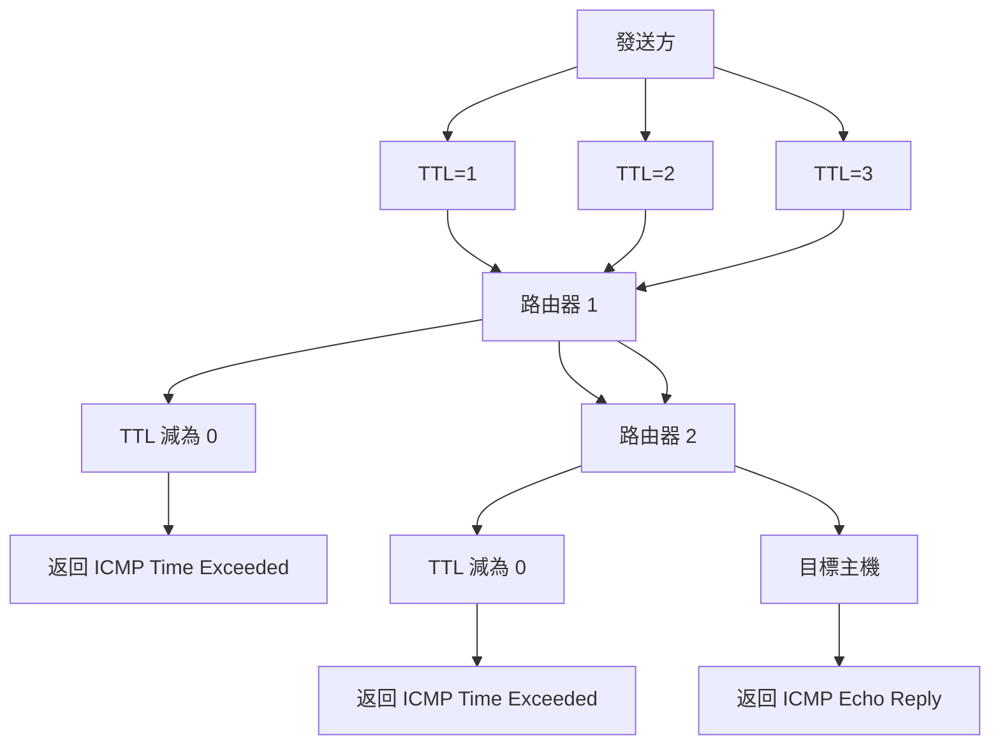

**⚡ HFT 實踐**

```bash
# 檢查到交易所的路由路徑
traceroute -n exchange.example.com

# 典型 HFT 網路跳數：2-5 跳
# 每多一跳 ≈ 增加 50-200μs 延遲

# 檢查 MTU 路徑 (Path MTU Discovery)
ping -M do -s 1472 exchange.example.com

# 設置 IP TOS 優先級 (需要 root)
setsockopt(sockfd, IPPROTO_IP, IP_TOS, IPTOS_LOWDELAY | IPTOS_THROUGHPUT)
```

**HFT 優化建議**：
- 盡量減少路由跳數（直連交易所機房，colocate）
- 避免數據包分片（設置合適的 MSS）
- 監控 TTL 值檢測網路路徑變化
- 使用硬體校驗卸載 (Checksum Offload)

---

### N2: TCP 和 UDP 報文結構差異

**難度**: 🔥 | **重要度**: ⭐⭐⭐ | **面試頻率**: 極高

**📋 面試回答**

**TCP 和 UDP 報文結構的核心差異**：

| 特性 | TCP | UDP |
|------|-----|-----|
| **報頭大小** | 20-60 字節（可變） | 8 字節（固定） |
| **複雜度** | 複雜（可靠性機制） | 簡單（無狀態） |
| **關鍵字段** | 序列號、確認號、窗口大小、標誌位 | 僅長度、校驗和 |
| **開銷** | 高（控制信息多） | 低（最小化開銷） |

**TCP 報頭結構**（20-60 字節）：
- Source Port, Destination Port (各 16 bits)
- **Sequence Number** (32 bits) - 數據順序保證
- **Acknowledgment Number** (32 bits) - 可靠性保證
- **Flags** (9 bits) - SYN, ACK, FIN, RST, PSH, URG
- **Window Size** (16 bits) - 流量控制
- Checksum (16 bits)
- Options (0-40 bytes) - MSS, SACK, Timestamp 等

**UDP 報頭結構**（8 字節）：
- Source Port (16 bits)
- Destination Port (16 bits)
- Length (16 bits) - 整個 UDP 數據包長度
- Checksum (16 bits) - 可選的錯誤檢測

**HFT 中的選擇策略**：
- **TCP**: 訂單提交、交易確認（必須保證可靠）
- **UDP**: 市場行情廣播（速度優先，允許偶爾丟包）

**📚 概念詳解**

#### 為什麼 TCP 需要這麼複雜的報頭？

TCP 是**可靠傳輸協議 (Reliable Transport Protocol)**，需要額外的控制信息來實現：

1. **順序保證** (Sequence Number)
   - 數據可能亂序到達，需要重組
   - 32 位序列號可支持 4GB 數據的唯一標識

2. **可靠性** (Acknowledgment Number)
   - 確認對方已收到數據
   - 未確認的數據會重傳

3. **流量控制** (Window Size)
   - 防止發送方超過接收方處理能力
   - 動態調整發送速率

4. **連接管理** (Flags)
   - 建立連接（SYN）
   - 確認數據（ACK）
   - 關閉連接（FIN）

#### UDP 為什麼這麼簡單？

UDP 是**無連接、不可靠 (Connectionless, Unreliable)** 協議，設計目標是：
- **速度優先**：無需等待確認
- **最小開銷**：8 字節固定報頭
- **應用層控制**：可靠性由應用層實現

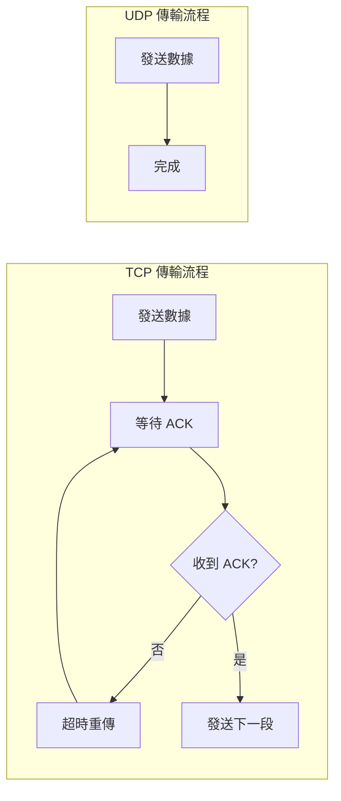

#### HFT 中的應用場景

**TCP 使用場景**：
- **訂單提交 (Order Entry)**：必須保證可靠送達
- **交易確認 (Trade Confirmation)**：不能丟失確認信息
- **風控通訊 (Risk Control)**：需要準確的狀態同步
- **管理連接**：配置更新、系統監控

**UDP 使用場景**：
- **市場行情廣播 (Market Data Feed)**：允許偶爾丟包，最新數據最重要
- **時間戳同步 (Time Sync)**：低延遲優先，可容忍少量誤差
- **內部監控數據 (Internal Metrics)**：可容忍少量丟失
- **組播接收 (Multicast)**：一對多廣播

**⚡ HFT 實踐**

```c
// HFT 市場數據使用 UDP
void receive_market_data_udp(int sockfd) {
    char buffer[1500];
    struct sockaddr_in src_addr;
    socklen_t addr_len = sizeof(src_addr);
    
    // UDP 單次接收即可，無需確認
    ssize_t n = recvfrom(sockfd, buffer, sizeof(buffer), 0,
                        (struct sockaddr*)&src_addr, &addr_len);
    
    if (n > 0) {
        // 直接處理，不等待 ACK
        uint64_t hw_timestamp = get_hardware_timestamp();
        process_market_data(buffer, n, hw_timestamp);
    }
}

// HFT 訂單提交使用 TCP
void send_order_tcp(int sockfd, const order_t* order) {
    // TCP 會自動處理 ACK、重傳、順序
    ssize_t n = send(sockfd, order, sizeof(*order), 0);
    
    if (n < 0) {
        // TCP 會重試，應用層只需處理連接錯誤
        handle_connection_error();
    }
}
```

**性能對比**（HFT 環境）：
- **UDP 延遲**：5-20μs（單向）
- **TCP 延遲**：10-50μs（包含 ACK 等待）
- **UDP 丟包率**：0.01-0.1%（數據中心內）
- **TCP 可靠性**：100%（通過重傳保證）

**HFT 混合策略**：
```
市場數據接收: UDP (低延遲) + 序列號檢測 (應用層可靠性)
訂單發送: TCP (可靠性) + TCP_NODELAY (低延遲)
```

---

### N3: TCP 三次握手

**難度**: 🔥 | **重要度**: ⭐⭐ | **面試頻率**: 極高

**📋 面試回答**

TCP 三次握手 (Three-Way Handshake) 是建立可靠連接的過程，分為三步：

**握手流程**：

1. **第一次握手（SYN）**
   - 客戶端發送：SYN=1, seq=x (初始序列號)
   - 客戶端狀態：CLOSED → SYN-SENT
   - 含義："我想建立連接，我的初始序列號是 x"

2. **第二次握手（SYN+ACK）**
   - 服務端發送：SYN=1, ACK=1, seq=y, ack=x+1
   - 服務端狀態：LISTEN → SYN-RCVD
   - 含義："收到了，我也想建立連接，我的初始序列號是 y，我期待你的下一個序列號是 x+1"

3. **第三次握手（ACK）**
   - 客戶端發送：ACK=1, seq=x+1, ack=y+1
   - 客戶端狀態：SYN-SENT → ESTABLISHED
   - 服務端狀態：SYN-RCVD → ESTABLISHED
   - 含義："收到了，我們開始傳輸數據吧"

**狀態轉換**：
```
客戶端: CLOSED → SYN-SENT → ESTABLISHED
服務端: CLOSED → LISTEN → SYN-RCVD → ESTABLISHED
```

**為什麼是三次？**
- **防止舊連接請求**：舊的 SYN 延遲到達不會造成錯誤連接
- **雙向確認**：確認雙方的發送和接收能力
- **同步序列號**：雙方交換並確認初始序列號 (ISN, Initial Sequence Number)

**📚 概念詳解**

#### 什麼是「握手」？

**生活化比喻**：就像打電話：
1. 你撥號（SYN）："喂，能聽到嗎？"
2. 對方接聽（SYN+ACK）："喂，聽得到！你能聽到我嗎？"
3. 你確認（ACK）："能聽到，我們開始聊吧！"

**技術角度**：
- **同步 (Synchronize)**：雙方交換初始序列號（seq）
- **確認 (Acknowledge)**：雙方確認對方的發送和接收能力
- **建立 (Establish)**：雙方進入可以傳輸數據的狀態

#### 為什麼是三次不是兩次？

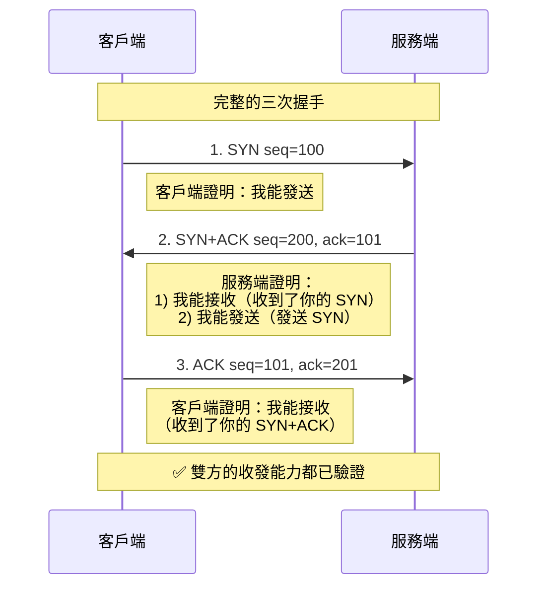

**如果只有兩次會怎樣？**

假設只有兩次握手：
```
1. 客戶端 → 服務端: SYN
2. 服務端 → 客戶端: SYN+ACK
[連接建立]
```

**問題場景**：
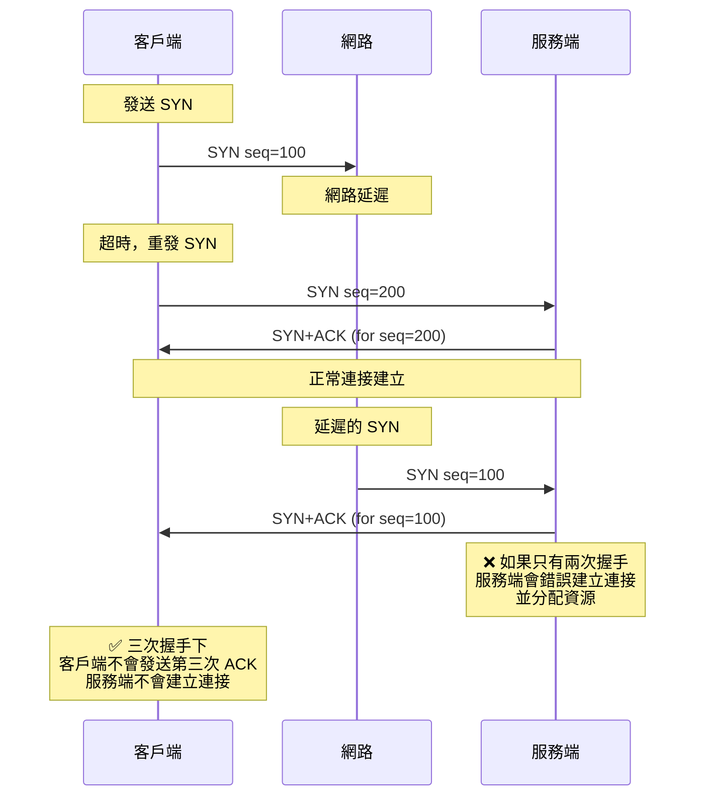

**三次握手防止此問題**：
- 第三次 ACK 確認客戶端確實想建立連接
- 舊的 SYN 不會收到第三次 ACK
- 服務端會因為超時而關閉半連接

#### 完整的狀態機圖

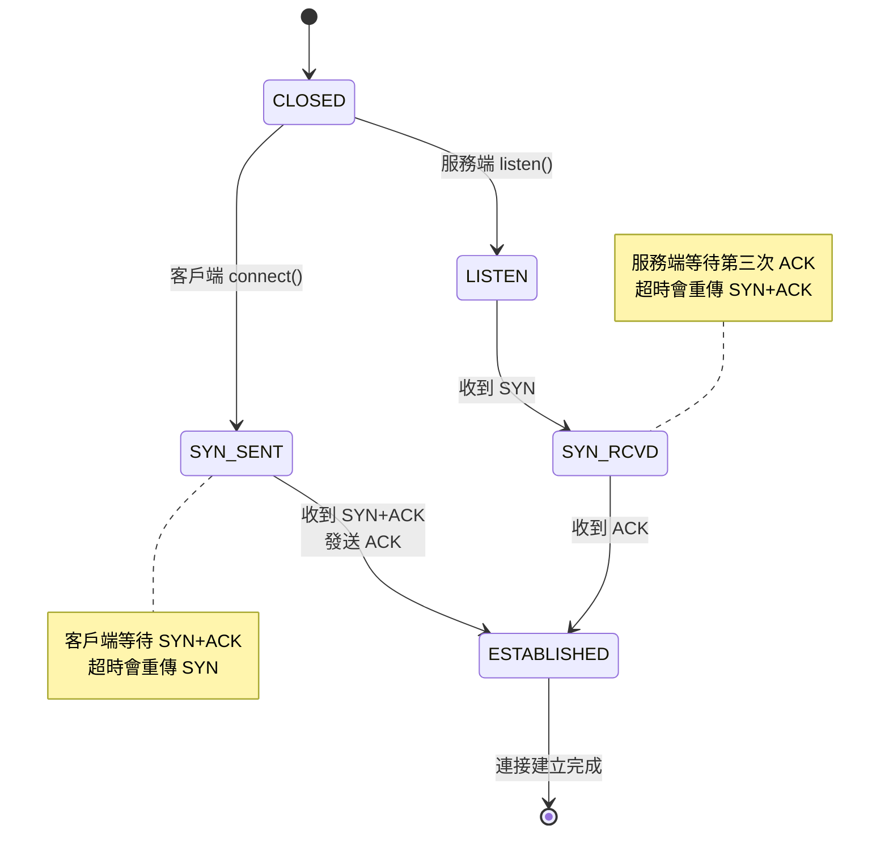

**⚡ HFT 實踐**

```bash
# 使用 tcpdump 觀察三次握手
sudo tcpdump -i any -n 'tcp[tcpflags] & (tcp-syn|tcp-ack) != 0' port 8080

# 輸出示例：
# 14:30:01.123456 IP 192.168.1.10.50001 > 192.168.1.20.8080: Flags [S], seq 1234567890
# 14:30:01.123789 IP 192.168.1.20.8080 > 192.168.1.10.50001: Flags [S.], seq 9876543210, ack 1234567891
# 14:30:01.123850 IP 192.168.1.10.50001 > 192.168.1.20.8080: Flags [.], ack 9876543211

# 使用 ss 查看連接狀態
ss -tan state syn-sent     # 客戶端正在握手
ss -tan state syn-recv     # 服務端正在握手
ss -tan state established  # 已建立的連接
```

**HFT 優化策略**：

1. **TCP Fast Open (TFO)** - 在第一次 SYN 中就發送數據
```c
// 啟用 TCP Fast Open
int enable = 1;
setsockopt(sockfd, SOL_TCP, TCP_FASTOPEN, &enable, sizeof(enable));

// 使用 sendto() 在 connect() 時發送數據
sendto(sockfd, data, len, MSG_FASTOPEN, &addr, sizeof(addr));
// 節省 1 個 RTT 的時間 (約 50-200μs)
```

2. **連接池 (Connection Pool)** - 維護長連接，避免頻繁握手
```c
// 維護長連接，避免頻繁握手
typedef struct {
    int sockfd;
    time_t last_used;
    bool is_active;
} connection_pool_entry_t;

connection_pool_entry_t pool[MAX_CONNECTIONS];

// 複用已建立的連接
int get_connection_from_pool() {
    for (int i = 0; i < MAX_CONNECTIONS; i++) {
        if (pool[i].is_active) {
            pool[i].last_used = time(NULL);
            return pool[i].sockfd;
        }
    }
    return create_new_connection();
}
```

3. **SYN Cookie** - 防止 SYN Flood 攻擊
```bash
# 啟用 SYN Cookie (服務端)
sysctl net.ipv4.tcp_syncookies=1
```

**延遲分析**：
- **握手開銷**：1.5 RTT (Round-Trip Time)
  - 第一次握手：0.5 RTT (客戶端 → 服務端)
  - 第二次握手：0.5 RTT (服務端 → 客戶端)
  - 第三次握手：0.5 RTT (客戶端 → 服務端，可與數據一起發送)
- **數據中心內 RTT**：~100μs
- **握手總延遲**：~150μs
- **HFT 優化目標**：使用長連接減少握手次數，或使用 TCP Fast Open

**常見面試追問**：
1. Q: 為什麼初始序列號 (ISN) 不從 0 開始？
   - A: 防止舊連接的延遲數據包被誤認為新連接的數據。ISN 通常基於時鐘隨機生成。

2. Q: 第三次握手如果丟失會怎樣？
   - A: 服務端會重傳 SYN+ACK，客戶端收到後再發送 ACK。如果多次重傳失敗，服務端會關閉連接。

3. Q: 能否在第三次握手時發送數據？
   - A: 可以，這就是 TCP Fast Open 的原理。

---

### N4: TCP 四次揮手與 TIME-WAIT

**難度**: 🔥🔥 | **重要度**: ⭐⭐ | **面試頻率**: 高

**📋 面試回答**

TCP 四次揮手 (Four-Way Handshake) 是關閉連接的過程，分為四步：

**揮手流程**：

1. **第一次揮手（FIN）**
   - 主動方發送：FIN=1, seq=u
   - 主動方狀態：ESTABLISHED → FIN-WAIT-1
   - 含義："我不發送數據了，但還能接收"

2. **第二次揮手（ACK）**
   - 被動方發送：ACK=1, ack=u+1
   - 被動方狀態：ESTABLISHED → CLOSE-WAIT
   - 主動方狀態：FIN-WAIT-1 → FIN-WAIT-2
   - 含義："我知道你要關閉了，等我發完數據"

3. **第三次揮手（FIN）**
   - 被動方發送：FIN=1, seq=v
   - 被動方狀態：CLOSE-WAIT → LAST-ACK
   - 含義："我也不發送數據了"

4. **第四次揮手（ACK）**
   - 主動方發送：ACK=1, ack=v+1
   - 主動方狀態：FIN-WAIT-2 → TIME-WAIT
   - 被動方狀態：LAST-ACK → CLOSED
   - 含義："好的，我們都關閉吧"

**TIME-WAIT 狀態的作用**：
- 持續時間：2 * MSL (Maximum Segment Lifetime, 最大報文段生存時間，通常 60-120 秒)
- **確保最後的 ACK 到達**：如果 ACK 丟失，可以重傳
- **防止舊數據包干擾**：確保舊連接的數據包都已過期

**📚 概念詳解**

#### 為什麼需要四次揮手？

**TCP 是全雙工通信 (Full-Duplex Communication)**：
- 連接的每個方向都需要獨立關閉
- 一方關閉發送（FIN），但仍可接收數據
- 確保雙方數據都能完整傳輸

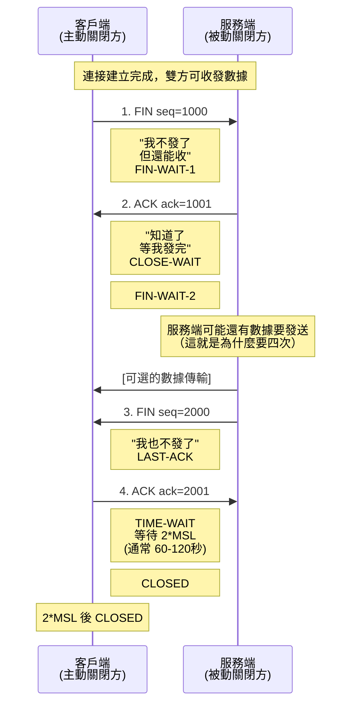

#### TIME-WAIT 狀態詳解

**為什麼需要 TIME-WAIT？**

1. **確保最後的 ACK 能到達對方**
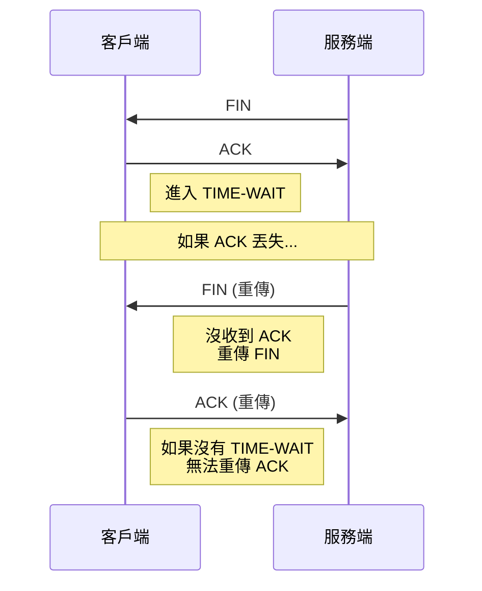

2. **防止舊連接的延遲數據包干擾新連接**
```
舊連接: 192.168.1.10:50001 → 192.168.1.20:8080
新連接: 192.168.1.10:50001 → 192.168.1.20:8080 (相同的四元組)

如果舊連接的延遲數據包到達新連接 → 數據錯亂！
TIME-WAIT 確保舊數據包都已過期（2*MSL 後）

MSL (Maximum Segment Lifetime): IP 數據包在網路中的最大生存時間
- 理論值: 2 分鐘 (RFC 793)
- 實際值: Linux 默認 60 秒
- 2*MSL: 確保往返數據包都已過期
```

**⚡ HFT 實踐**

```bash
# 查看 TIME-WAIT 連接數量
ss -tan state time-wait | wc -l

# 查看特定端口的 TIME-WAIT 連接
ss -tan state time-wait '( dport = :8080 or sport = :8080 )'

# 調整 TIME-WAIT 超時時間 (不推薦改太小)
sysctl net.ipv4.tcp_fin_timeout=30  # 默認 60 秒

# 啟用 TIME-WAIT 重用（客戶端，推薦）
sysctl net.ipv4.tcp_tw_reuse=1

# 查看當前設置
sysctl -a | grep tcp_tw
```

**HFT 系統中的 TIME-WAIT 問題**：

問題場景：
```bash
# 高頻交易系統每秒建立 10000 個短連接
# 每個連接持續 10ms
# TIME-WAIT 持續 60 秒

# 計算 TIME-WAIT 連接數：
# 10000 connections/sec * 60 sec = 600,000 connections

# 問題：
# 1. 端口耗盡 (最多 65535 個端口)
# 2. 記憶體消耗 (每個連接約 3.5KB)
# 3. CPU 開銷 (管理大量連接)
```

**HFT 優化策略**：

1. **使用 SO_REUSEADDR（服務端）**
```c
int opt = 1;
setsockopt(sockfd, SOL_SOCKET, SO_REUSEADDR, &opt, sizeof(opt));
// 允許綁定處於 TIME-WAIT 的地址
// 服務端重啟時立即綁定端口
```

2. **啟用 tcp_tw_reuse（客戶端）**
```bash
sysctl net.ipv4.tcp_tw_reuse=1
# 允許重用 TIME-WAIT 的 socket 用於新的出站連接
# 要求：啟用 TCP 時間戳 (net.ipv4.tcp_timestamps=1)
```

3. **連接池（最佳方案）**
```c
// 維護長連接，避免頻繁關閉
// 複用已建立的連接
typedef struct {
    int sockfd;
    bool is_active;
    time_t last_used;
} connection_t;

connection_t conn_pool[1000];

// 使用 Keep-Alive 保持連接
int enable = 1;
setsockopt(sockfd, SOL_SOCKET, SO_KEEPALIVE, &enable, sizeof(enable));

// 設置 Keep-Alive 參數
int keepidle = 60;   // 60 秒無數據則發送探測
int keepintvl = 10;  // 探測間隔 10 秒
int keepcnt = 3;     // 探測 3 次無響應則關閉

setsockopt(sockfd, IPPROTO_TCP, TCP_KEEPIDLE, &keepidle, sizeof(keepidle));
setsockopt(sockfd, IPPROTO_TCP, TCP_KEEPINTVL, &keepintvl, sizeof(keepintvl));
setsockopt(sockfd, IPPROTO_TCP, TCP_KEEPCNT, &keepcnt, sizeof(keepcnt));
```

4. **⚠️ 不推薦：SO_LINGER=0（會發送 RST）**
```c
// ❌ 不推薦：會立即發送 RST，可能丟失數據
struct linger ling;
ling.l_onoff = 1;
ling.l_linger = 0;
setsockopt(sockfd, SOL_SOCKET, SO_LINGER, &ling, sizeof(ling));

// 問題：
// 1. 發送 RST 而非 FIN，對方會收到 "Connection reset by peer"
// 2. 可能丟失發送緩衝區中的數據
// 3. 不符合 TCP 優雅關閉的語義
```

**完整的 HFT Socket 配置**：
```c
int configure_hft_socket(int sockfd) {
    int opt = 1;
    
    // 1. 允許地址重用（重啟時立即綁定）
    setsockopt(sockfd, SOL_SOCKET, SO_REUSEADDR, &opt, sizeof(opt));
    
    // 2. 允許端口重用（多進程綁定同一端口）
    setsockopt(sockfd, SOL_SOCKET, SO_REUSEPORT, &opt, sizeof(opt));
    
    // 3. 啟用 TCP_NODELAY（禁用 Nagle）
    setsockopt(sockfd, IPPROTO_TCP, TCP_NODELAY, &opt, sizeof(opt));
    
    // 4. 設置發送/接收緩衝區
    int bufsize = 1024 * 1024;  // 1MB
    setsockopt(sockfd, SOL_SOCKET, SO_SNDBUF, &bufsize, sizeof(bufsize));
    setsockopt(sockfd, SOL_SOCKET, SO_RCVBUF, &bufsize, sizeof(bufsize));
    
    // 5. 啟用 Keep-Alive
    setsockopt(sockfd, SOL_SOCKET, SO_KEEPALIVE, &opt, sizeof(opt));
    
    return 0;
}
```

**常見面試追問**：
1. Q: 為什麼是 2*MSL 而不是 1*MSL？
   - A: 考慮最壞情況：最後的 ACK 丟失，服務端重傳 FIN（1 MSL），客戶端收到並重傳 ACK（1 MSL），總共 2 MSL。

2. Q: TIME-WAIT 狀態一定在主動關閉方嗎？
   - A: 是的。主動發送 FIN 的一方會進入 TIME-WAIT 狀態。

3. Q: 大量 TIME-WAIT 連接會影響性能嗎？
   - A: 會。主要影響：(1) 端口耗盡，(2) 記憶體消耗，(3) CPU 開銷。解決方案：使用連接池或啟用 tcp_tw_reuse。

---

### N5: TIME-WAIT 優化

**難度**: 🔥🔥 | **重要度**: ⭐⭐⭐ | **面試頻率**: 高

**📋 面試回答**

在 HFT 環境中處理 TIME-WAIT 的主要方法：

**1. SO_REUSEADDR (服務端)**
```c
int opt = 1;
setsockopt(sockfd, SOL_SOCKET, SO_REUSEADDR, &opt, sizeof(opt));
```
- 允許綁定處於 TIME-WAIT 的地址
- 適用場景：服務端重啟時立即綁定端口

**2. tcp_tw_reuse (客戶端)**
```bash
sysctl net.ipv4.tcp_tw_reuse=1
```
- 允許重用 TIME-WAIT 的 socket 用於新的**出站**連接
- 要求：啟用 TCP 時間戳 (`net.ipv4.tcp_timestamps=1`)
- 安全性：通過時間戳確保不會混淆舊數據

**3. tcp_fin_timeout (縮短等待時間)**
```bash
sysctl net.ipv4.tcp_fin_timeout=30  # 默認 60 秒
```
- 縮短 FIN-WAIT-2 狀態的超時時間
- 注意：這不是 TIME-WAIT 的超時時間（TIME-WAIT 固定為 2*MSL）

**4. 連接池（最佳方案）**
- 維護長連接，避免頻繁關閉
- 複用已建立的連接
- 使用 Keep-Alive 保持連接活躍

**📚 概念詳解**

#### SO_REUSEADDR 深入理解

**什麼情況下需要 SO_REUSEADDR？**

場景：HFT 服務端程序崩潰後立即重啟
```bash
# 第一次啟動
./hft_server  # 綁定 0.0.0.0:8080

# 程序崩潰或被 kill

# 立即重啟
./hft_server
# 錯誤: bind: Address already in use

# 原因：舊連接還在 TIME-WAIT 狀態
ss -tan | grep 8080
# LISTEN 0 128 *:8080 *:* 
# TIME-WAIT 0 0 192.168.1.10:8080 192.168.1.20:50001
```

**解決方案**：
```c
int create_hft_server_socket(int port) {
    int sockfd = socket(AF_INET, SOCK_STREAM, 0);
    
    // 關鍵：設置 SO_REUSEADDR
    int opt = 1;
    if (setsockopt(sockfd, SOL_SOCKET, SO_REUSEADDR, &opt, sizeof(opt)) < 0) {
        perror("setsockopt SO_REUSEADDR");
        return -1;
    }
    
    struct sockaddr_in addr;
    addr.sin_family = AF_INET;
    addr.sin_addr.s_addr = INADDR_ANY;
    addr.sin_port = htons(port);
    
    if (bind(sockfd, (struct sockaddr*)&addr, sizeof(addr)) < 0) {
        perror("bind");
        return -1;
    }
    
    listen(sockfd, SOMAXCONN);
    return sockfd;
}
```

#### tcp_tw_reuse 詳解

**什麼是 tcp_tw_reuse？**

允許內核在以下條件下重用 TIME-WAIT 的 socket：
1. 新連接的時間戳 > 舊連接的最後時間戳（防止數據混淆）
2. 僅適用於**客戶端出站連接**
3. 必須啟用 TCP 時間戳選項

**工作原理**：
```
舊連接 (TIME-WAIT): 192.168.1.10:50001 → 192.168.1.20:8080
  最後時間戳: 1000000

新連接請求: 192.168.1.10:50001 → 192.168.1.20:8080
  新時間戳: 1000100

檢查: 1000100 > 1000000 ✅
允許重用端口 50001
```

**配置示例**：
```bash
# 啟用重用（需要同時啟用時間戳）
sysctl net.ipv4.tcp_tw_reuse=1
sysctl net.ipv4.tcp_timestamps=1

# 永久生效
cat >> /etc/sysctl.conf <<EOF
net.ipv4.tcp_tw_reuse = 1
net.ipv4.tcp_timestamps = 1
EOF
sysctl -p
```

**⚠️ tcp_tw_recycle 已被移除**：
```bash
# ❌ 在 Linux 4.12+ 已移除，不要使用
# sysctl net.ipv4.tcp_tw_recycle=1

# 原因：在 NAT 環境下會導致問題
# 多個客戶端通過同一個 NAT 連接服務端
# 時間戳可能亂序，導致連接被拒絕
```

#### SO_REUSEPORT 進階用法

**什麼是 SO_REUSEPORT？**

允許多個 socket 綁定到相同的 IP:Port 組合（Linux 3.9+）

**應用場景**：
```c
// 多進程/多線程綁定同一端口，實現負載均衡
// 進程 1
int sockfd1 = socket(AF_INET, SOCK_STREAM, 0);
int opt = 1;
setsockopt(sockfd1, SOL_SOCKET, SO_REUSEPORT, &opt, sizeof(opt));
bind(sockfd1, &addr, sizeof(addr));  // 綁定到 :8080
listen(sockfd1, 128);

// 進程 2
int sockfd2 = socket(AF_INET, SOCK_STREAM, 0);
setsockopt(sockfd2, SOL_SOCKET, SO_REUSEPORT, &opt, sizeof(opt));
bind(sockfd2, &addr, sizeof(addr));  // 也綁定到 :8080 ✅
listen(sockfd2, 128);

// 內核會將新連接分配到不同的 socket (負載均衡)
```

**優點**：
- CPU 親和性：每個進程/線程處理自己的連接
- 減少鎖競爭：避免多進程 accept() 同一個 socket
- 提高性能：kernel 自動負載均衡

**⚡ HFT 最佳實踐**

```c
// HFT 服務端 Socket 配置
int configure_hft_server_socket(int sockfd) {
    int opt = 1;
    
    // 1. 允許地址重用（重啟時立即綁定）
    setsockopt(sockfd, SOL_SOCKET, SO_REUSEADDR, &opt, sizeof(opt));
    
    // 2. 允許端口重用（多進程綁定同一端口）
    setsockopt(sockfd, SOL_SOCKET, SO_REUSEPORT, &opt, sizeof(opt));
    
    // 3. 啟用 TCP_NODELAY（禁用 Nagle）
    setsockopt(sockfd, IPPROTO_TCP, TCP_NODELAY, &opt, sizeof(opt));
    
    // 4. 設置發送/接收緩衝區
    int bufsize = 1024 * 1024;  // 1MB
    setsockopt(sockfd, SOL_SOCKET, SO_SNDBUF, &bufsize, sizeof(bufsize));
    setsockopt(sockfd, SOL_SOCKET, SO_RCVBUF, &bufsize, sizeof(bufsize));
    
    // 5. 啟用 Keep-Alive
    setsockopt(sockfd, SOL_SOCKET, SO_KEEPALIVE, &opt, sizeof(opt));
    
    // 6. 設置 Keep-Alive 參數
    int keepidle = 60;   // 60 秒無數據則發送探測
    int keepintvl = 10;  // 探測間隔 10 秒
    int keepcnt = 3;     // 探測 3 次無響應則關閉
    setsockopt(sockfd, IPPROTO_TCP, TCP_KEEPIDLE, &keepidle, sizeof(keepidle));
    setsockopt(sockfd, IPPROTO_TCP, TCP_KEEPINTVL, &keepintvl, sizeof(keepintvl));
    setsockopt(sockfd, IPPROTO_TCP, TCP_KEEPCNT, &keepcnt, sizeof(keepcnt));
    
    return 0;
}
```

**系統級優化**：
```bash
#!/bin/bash
# HFT 系統 TIME-WAIT 優化腳本

# 1. 啟用 TIME-WAIT 重用（客戶端）
sysctl net.ipv4.tcp_tw_reuse=1

# 2. 啟用時間戳
sysctl net.ipv4.tcp_timestamps=1

# 3. 縮短 FIN-WAIT-2 超時
sysctl net.ipv4.tcp_fin_timeout=30

# 4. 增加本地端口範圍
sysctl net.ipv4.ip_local_port_range="10000 65535"

# 5. 增加 TCP 最大連接數
sysctl net.core.somaxconn=65535
sysctl net.ipv4.tcp_max_syn_backlog=8192

# 6. 啟用 TCP Fast Open
sysctl net.ipv4.tcp_fastopen=3  # 3 = 客戶端+服務端

# 7. 檢查當前 TIME-WAIT 數量
echo "Current TIME-WAIT connections: $(ss -tan state time-wait | wc -l)"

# 8. 檢查端口使用情況
echo "Local port usage:"
ss -tan | awk '{print $4}' | cut -d':' -f2 | sort -n | uniq -c | sort -rn | head -20
```

**連接池實現**：
```c
// 高性能連接池
#define POOL_SIZE 100

typedef struct {
    int sockfd;
    bool is_active;
    time_t last_used;
    struct sockaddr_in remote_addr;
} connection_pool_entry_t;

typedef struct {
    connection_pool_entry_t entries[POOL_SIZE];
    int active_count;
    pthread_mutex_t lock;
} connection_pool_t;

// 初始化連接池
void init_connection_pool(connection_pool_t* pool) {
    memset(pool, 0, sizeof(connection_pool_t));
    pthread_mutex_init(&pool->lock, NULL);
}

// 從連接池獲取連接
int get_connection(connection_pool_t* pool, const char* host, int port) {
    pthread_mutex_lock(&pool->lock);
    
    // 1. 查找現有連接
    for (int i = 0; i < POOL_SIZE; i++) {
        if (pool->entries[i].is_active &&
            pool->entries[i].remote_addr.sin_port == htons(port)) {
            
            // 檢查連接是否仍然有效
            int error = 0;
            socklen_t len = sizeof(error);
            getsockopt(pool->entries[i].sockfd, SOL_SOCKET, SO_ERROR, &error, &len);
            
            if (error == 0) {
                pool->entries[i].last_used = time(NULL);
                pthread_mutex_unlock(&pool->lock);
                return pool->entries[i].sockfd;
            } else {
                // 連接已失效，關閉並移除
                close(pool->entries[i].sockfd);
                pool->entries[i].is_active = false;
                pool->active_count--;
            }
        }
    }
    
    // 2. 創建新連接
    int sockfd = socket(AF_INET, SOCK_STREAM, 0);
    if (sockfd < 0) {
        pthread_mutex_unlock(&pool->lock);
        return -1;
    }
    
    // 配置 socket
    configure_hft_server_socket(sockfd);
    
    // 連接到服務端
    struct sockaddr_in addr;
    addr.sin_family = AF_INET;
    addr.sin_port = htons(port);
    inet_pton(AF_INET, host, &addr.sin_addr);
    
    if (connect(sockfd, (struct sockaddr*)&addr, sizeof(addr)) < 0) {
        close(sockfd);
        pthread_mutex_unlock(&pool->lock);
        return -1;
    }
    
    // 3. 添加到連接池
    for (int i = 0; i < POOL_SIZE; i++) {
        if (!pool->entries[i].is_active) {
            pool->entries[i].sockfd = sockfd;
            pool->entries[i].is_active = true;
            pool->entries[i].last_used = time(NULL);
            pool->entries[i].remote_addr = addr;
            pool->active_count++;
            pthread_mutex_unlock(&pool->lock);
            return sockfd;
        }
    }
    
    // 連接池已滿，關閉新連接
    close(sockfd);
    pthread_mutex_unlock(&pool->lock);
    return -1;
}

// 定期清理過期連接
void cleanup_connection_pool(connection_pool_t* pool, int max_idle_seconds) {
    pthread_mutex_lock(&pool->lock);
    time_t now = time(NULL);
    
    for (int i = 0; i < POOL_SIZE; i++) {
        if (pool->entries[i].is_active &&
            (now - pool->entries[i].last_used) > max_idle_seconds) {
            
            close(pool->entries[i].sockfd);
            pool->entries[i].is_active = false;
            pool->active_count--;
        }
    }
    
    pthread_mutex_unlock(&pool->lock);
}
```

**性能對比**：
```
場景：HFT 系統，每秒 10000 個請求

1. 無優化（每次建立新連接）：
   - 握手延遲: 150μs * 10000 = 1.5s
   - TIME-WAIT 連接: 600,000 個
   - 端口耗盡風險: 高

2. 啟用 tcp_tw_reuse：
   - 握手延遲: 150μs * 10000 = 1.5s
   - TIME-WAIT 連接: 可重用
   - 端口耗盡風險: 中

3. 使用連接池（100 個長連接）：
   - 握手延遲: 0 (連接已建立)
   - TIME-WAIT 連接: 0
   - 端口耗盡風險: 無
   - 性能提升: 100倍
```

**常見面試追問**：
1. Q: SO_REUSEADDR 和 SO_REUSEPORT 有什麼區別？
   - A: SO_REUSEADDR 允許綁定處於 TIME-WAIT 的地址；SO_REUSEPORT 允許多個 socket 綁定相同地址，實現負載均衡。

2. Q: tcp_tw_reuse 為什麼需要時間戳？
   - A: 時間戳用於區分新舊連接的數據包，防止舊連接的延遲數據包被誤認為新連接的數據。

3. Q: 為什麼不推薦使用 tcp_tw_recycle？
   - A: 在 NAT 環境下會導致問題，且已在 Linux 4.12+ 移除。

---

### N6: Nagle 算法

**難度**: 🔥🔥 | **重要度**: ⭐⭐⭐ | **面試頻率**: 極高

**📋 面試回答**

**Nagle 算法 (Nagle's Algorithm)** 是 TCP 的一種優化機制，目的是減少小數據包的數量。

**算法規則 (RFC 896)**：
```
if (數據量 >= MSS) {
    立即發送
} else if (所有已發送數據都已被確認) {
    立即發送  // 沒有未確認數據，可以發送小包
} else {
    緩存數據，直到：
    1. 累積數據 >= MSS
    2. 收到之前數據的 ACK
    3. 超時 (很少發生)
}
```

**在 HFT 中的缺點**：
- **增加延遲**：小訂單數據可能被延遲發送（等待 ACK 或湊夠 MSS）
- **不可預測**：延遲取決於網路狀況和數據大小
- **與 Delayed ACK 交互**：可能導致 40-200ms 延遲

**如何禁用**：
```c
int flag = 1;
setsockopt(sockfd, IPPROTO_TCP, TCP_NODELAY, &flag, sizeof(flag));
```

**📚 概念詳解**

#### Nagle 算法是什麼？

**生活化比喻**：寄包裹的策略

**不用 Nagle**：
- 每個小東西都單獨寄快遞 → 浪費快遞費（協議開銷）
- 快遞員很快送到 → 延遲低

**用 Nagle**：
- 等湊齊一車再寄 → 省快遞費（減少小包數量）
- 但要等待湊齊 → 延遲高

**HFT 為什麼不要 Nagle？**
因為 HFT 每 1 微秒都很寶貴，寧願多花「快遞費」（協議開銷），也要**立即發送**！

#### 技術原理詳解

**什麼是 MSS (Maximum Segment Size, 最大報文段大小)？**
- MSS：單個 TCP 報文段的最大數據量
- 計算：`MSS = MTU - IP Header (20) - TCP Header (20)`
- 典型值：以太網 MTU 1500 → MSS 1460 字節

**Nagle 算法的精確規則**：
```c
bool should_send_immediately(tcp_connection_t* conn, size_t data_len) {
    // 規則 1: 數據量 >= MSS，立即發送
    if (data_len >= conn->mss) {
        return true;
    }
    
    // 規則 2: 所有已發送數據都已被確認，可以發送小包
    if (conn->unacked_bytes == 0) {
        return true;
    }
    
    // 規則 3: 有未確認數據 && 數據量 < MSS
    // 緩存數據，等待 ACK 或累積到 MSS
    return false;
}
```

**Nagle 算法的流程圖**：
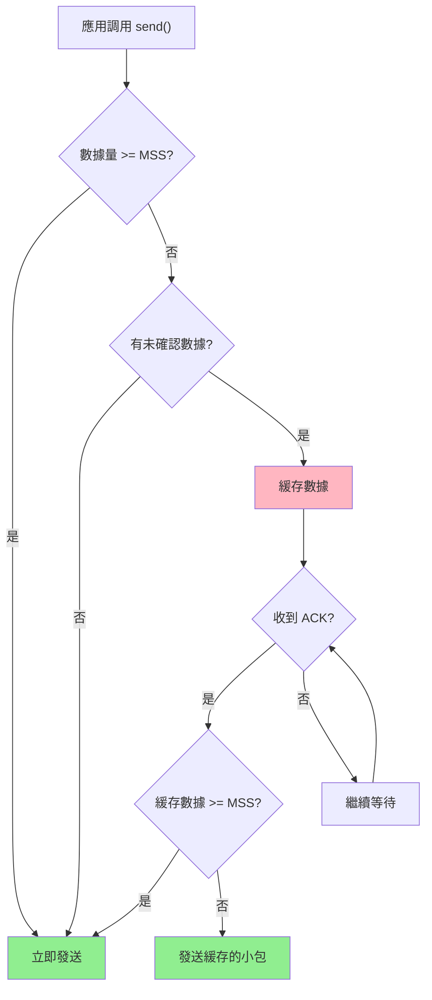

#### 與 Delayed ACK 的交互問題

**災難性延遲場景**：
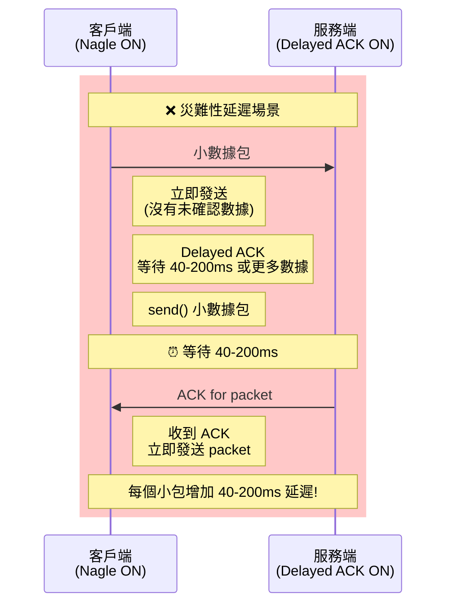

**為什麼會有 40-200ms 延遲？**
- 客戶端發送第一個小包（立即發送，因為沒有未確認數據）
- 服務端啟用 Delayed ACK，等待 40-200ms（希望合併 ACK）
- 客戶端要發送第二個小包，但 Nagle 要求等待第一個包的 ACK
- 40-200ms 後服務端發送 ACK
- 客戶端才能發送第二個包

**實際影響**：
- **單次請求**：延遲 40-200ms
- **10 次請求**：累積延遲 400-2000ms
- **HFT 要求**：< 10μs
- **結論**：必須禁用 Nagle 或 Delayed ACK（通常禁用 Nagle）

**⚡ HFT 實踐**

```c
// 禁用 Nagle 算法
int disable_nagle(int sockfd) {
    int flag = 1;
    int result = setsockopt(sockfd, 
                           IPPROTO_TCP,     // TCP 層選項
                           TCP_NODELAY,     // 禁用 Nagle
                           &flag,           // 啟用標誌
                           sizeof(flag));
    
    if (result < 0) {
        perror("setsockopt TCP_NODELAY");
        return -1;
    }
    
    return 0;
}

// HFT 訂單發送示例
typedef struct {
    char symbol[8];      // 股票代碼
    char side;           // 'B' or 'S'
    uint32_t quantity;   // 數量
    uint64_t price;      // 價格
} __attribute__((packed)) order_message_t;

int send_hft_order(int sockfd, const order_message_t* order) {
    // 發送小包（僅 17 字節）
    ssize_t sent = send(sockfd, order, sizeof(*order), 0);
    
    // 如果禁用 Nagle (TCP_NODELAY): 立即發送，延遲 < 10μs
    // 如果啟用 Nagle: 可能延遲 10-100ms（災難性！）
    
    return (sent == sizeof(*order)) ? 0 : -1;
}
```

**性能對比測試**：
```c
// Nagle 算法性能測試
void benchmark_nagle() {
    int sockfd = socket(AF_INET, SOCK_STREAM, 0);
    
    // 測試 1: Nagle ON
    struct timespec start, end;
    clock_gettime(CLOCK_MONOTONIC, &start);
    
    for (int i = 0; i < 1000; i++) {
        char small_data[10] = "hello";
        send(sockfd, small_data, sizeof(small_data), 0);
    }
    
    clock_gettime(CLOCK_MONOTONIC, &end);
    uint64_t nagle_on_ns = (end.tv_sec - start.tv_sec) * 1000000000ULL +
                          (end.tv_nsec - start.tv_nsec);
    
    // 測試 2: Nagle OFF (TCP_NODELAY)
    int flag = 1;
    setsockopt(sockfd, IPPROTO_TCP, TCP_NODELAY, &flag, sizeof(flag));
    
    clock_gettime(CLOCK_MONOTONIC, &start);
    
    for (int i = 0; i < 1000; i++) {
        char small_data[10] = "hello";
        send(sockfd, small_data, sizeof(small_data), 0);
    }
    
    clock_gettime(CLOCK_MONOTONIC, &end);
    uint64_t nagle_off_ns = (end.tv_sec - start.tv_sec) * 1000000000ULL +
                           (end.tv_nsec - start.tv_nsec);
    
    printf("Nagle ON:  %.2f ms (avg per packet: %.2f μs)\n",
           nagle_on_ns / 1000000.0,
           nagle_on_ns / 1000.0 / 1000);
    
    printf("Nagle OFF: %.2f ms (avg per packet: %.2f μs)\n",
           nagle_off_ns / 1000000.0,
           nagle_off_ns / 1000.0 / 1000);
    
    printf("Speedup: %.2fx\n", (double)nagle_on_ns / nagle_off_ns);
}

// 典型結果：
// Nagle ON:  50-100 ms (avg per packet: 50-100 μs)
// Nagle OFF: 5-10 ms   (avg per packet: 5-10 μs)
// Speedup: 10-20x
```

**何時使用 Nagle？**
```
✅ 適合使用 Nagle:
- 批量數據傳輸 (如文件傳輸)
- 對延遲不敏感的應用
- 需要減少網路開銷

❌ 不適合使用 Nagle (應禁用):
- HFT 交易系統
- 即時遊戲
- 遠程桌面 (VNC, RDP)
- SSH 互動式會話
- 任何對延遲敏感的應用
```

**完整的 HFT 低延遲配置**：
```c
int configure_low_latency_socket(int sockfd) {
    int opt = 1;
    
    // 1. 禁用 Nagle（必須）
    if (setsockopt(sockfd, IPPROTO_TCP, TCP_NODELAY, &opt, sizeof(opt)) < 0) {
        perror("TCP_NODELAY");
        return -1;
    }
    
    // 2. 禁用 Delayed ACK（可選，Linux 專用）
    #ifdef TCP_QUICKACK
    if (setsockopt(sockfd, IPPROTO_TCP, TCP_QUICKACK, &opt, sizeof(opt)) < 0) {
        perror("TCP_QUICKACK");
        // 非致命錯誤，繼續
    }
    #endif
    
    // 3. 設置發送緩衝區
    int bufsize = 256 * 1024;
    setsockopt(sockfd, SOL_SOCKET, SO_SNDBUF, &bufsize, sizeof(bufsize));
    
    // 4. 設置接收緩衝區
    setsockopt(sockfd, SOL_SOCKET, SO_RCVBUF, &bufsize, sizeof(bufsize));
    
    // 5. 設置 IP TOS (Type of Service) 優先級
    int tos = IPTOS_LOWDELAY | IPTOS_THROUGHPUT;
    setsockopt(sockfd, IPPROTO_IP, IP_TOS, &tos, sizeof(tos));
    
    return 0;
}
```

**常見面試追問**：
1. Q: Nagle 算法是如何減少小包數量的？
   - A: 通過緩存小數據直到收到 ACK 或累積到 MSS，將多個小數據包合併成一個大包發送。

2. Q: 為什麼禁用 Nagle 會增加網路開銷？
   - A: 每個小包都有 40 字節的 TCP/IP 報頭開銷。例如發送 10 字節數據，實際發送 50 字節（報頭 40 + 數據 10），開銷 400%。

3. Q: 除了 TCP_NODELAY，還有其他方法避免 Nagle 延遲嗎？
   - A: 可以使用 `send()` 的 `MSG_MORE` 標誌，告訴內核還有更多數據要發送，延遲發送直到沒有 MSG_MORE 標誌。但 HFT 中通常直接禁用 Nagle。

---

### N7: 延遲確認 (Delayed ACK)

**難度**: 🔥🔥 | **重要度**: ⭐⭐⭐ | **面試頻率**: 高

**📋 面試回答**

**延遲確認 (Delayed ACK, Delayed Acknowledgment)** 是 TCP 的另一種優化機制：

**工作原理**：
- 收到數據後不立即發送 ACK
- 等待一小段時間（通常 40-200ms）
- 希望能合併多個 ACK，或與回傳數據一起發送（捎帶確認）

**與 Nagle 的交互問題**：
- 當 Nagle 和 Delayed ACK 同時啟用時
- 客戶端等待 ACK 才能發送下一個小包
- 服務端延遲 ACK（等待 40-200ms）
- 造成 40-200ms 的延遲

**如何禁用 Delayed ACK**：
```c
// Linux 特定選項
int flag = 1;
setsockopt(sockfd, IPPROTO_TCP, TCP_QUICKACK, &flag, sizeof(flag));

// 注意：TCP_QUICKACK 是一次性的，每次 recv() 後需重新設置
```

**📚 概念詳解**

#### Delayed ACK 的目的

**為什麼要延遲 ACK？**

1. **減少 ACK 數量**：合併多個 ACK 到一個包
```
不延遲:
收到數據 1 → 發送 ACK 1
收到數據 2 → 發送 ACK 2
收到數據 3 → 發送 ACK 3
總共發送 3 個 ACK

延遲:
收到數據 1 → 啟動定時器
收到數據 2 → 更新 ACK
收到數據 3 → 發送合併的 ACK (ack=3)
總共發送 1 個 ACK
```

2. **捎帶確認 (Piggybacking)**：與回傳數據一起發送 ACK（節省一個包）
```
不捎帶:
收到請求 → 發送 ACK → 發送響應 (2 個包)

捎帶:
收到請求 → 發送響應 + ACK (1 個包)
```

3. **減少網路開銷**：每個 ACK 包都有 40 字節開銷（IP + TCP 報頭）

**工作機制**：
```c
// Delayed ACK 的偽代碼
void handle_received_data(tcp_connection_t* conn, void* data, size_t len) {
    // 1. 處理數據
    process_data(data, len);
    
    // 2. 檢查是否應該立即發送 ACK
    if (should_send_ack_immediately(conn)) {
        send_ack(conn);
    } else {
        // 3. 啟動延遲 ACK 定時器 (40-200ms)
        if (!conn->delayed_ack_timer_active) {
            start_delayed_ack_timer(conn, 40ms);
            conn->delayed_ack_timer_active = true;
        }
    }
}

bool should_send_ack_immediately(tcp_connection_t* conn) {
    // 立即發送 ACK 的情況：
    // 1. 收到亂序數據 (觸發快速重傳)
    // 2. 收到窗口更新
    // 3. 已經有一個數據包等待 ACK (每兩個包發送一次 ACK)
    // 4. 應用層有數據要發送 (捎帶確認)
    
    return conn->out_of_order_received ||
           conn->window_updated ||
           conn->pending_ack_count >= 1 ||
           conn->has_data_to_send;
}

void on_delayed_ack_timeout(tcp_connection_t* conn) {
    send_ack(conn);
    conn->delayed_ack_timer_active = false;
}
```

#### 與 Nagle 的交互問題

**災難性延遲的完整場景**：
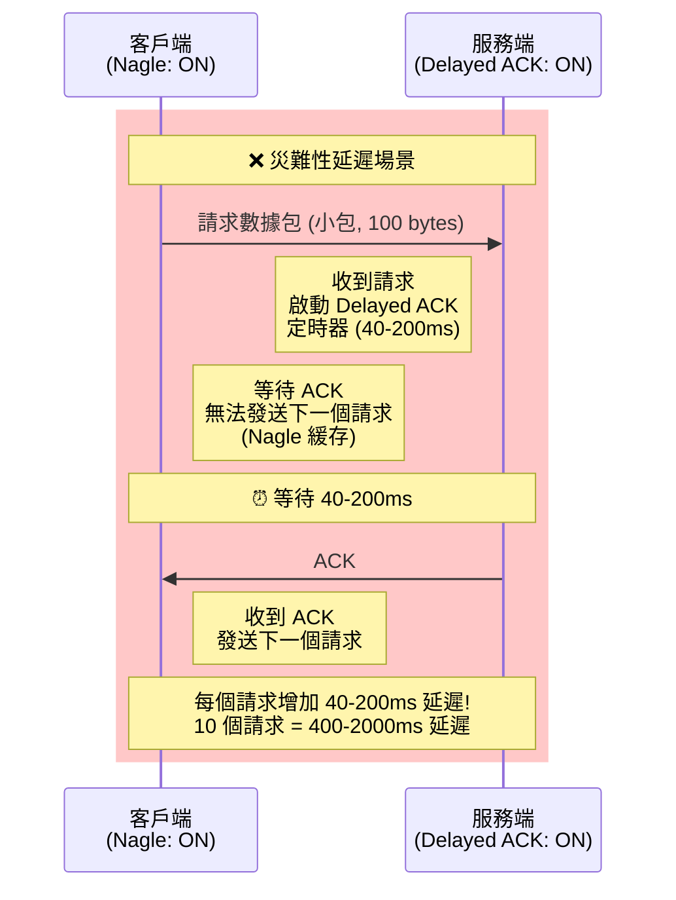

**實際影響**：
- **單次請求**：延遲 40-200ms
- **10 次請求**：累積延遲 400-2000ms
- **HFT 要求**：< 10μs
- **結論**：必須禁用至少一個（通常禁用 Nagle）

**為什麼 Delayed ACK 通常是 40ms？**
```
RFC 1122 規定：
- ACK 延遲不應超過 500ms
- 實踐中，大多數系統使用 40-200ms
- Linux 默認：40ms (HZ/25, 其中 HZ=1000)
- 可通過 /proc/sys/net/ipv4/tcp_delack_min 調整（需要內核支持）
```

#### 如何解決這個問題

**方案 1：禁用 Nagle（推薦，簡單）**
```c
int flag = 1;
setsockopt(sockfd, IPPROTO_TCP, TCP_NODELAY, &flag, sizeof(flag));
// ✅ 一次設置，永久生效
// ✅ 跨平台支持
```

**方案 2：禁用 Delayed ACK（較複雜，Linux 專用）**
```c
// Linux 特定選項
int flag = 1;
setsockopt(sockfd, IPPROTO_TCP, TCP_QUICKACK, &flag, sizeof(flag));

// ⚠️ TCP_QUICKACK 是一次性的
// 需要在每次 recv() 後重新設置

while (1) {
    int n = recv(sockfd, buffer, sizeof(buffer), 0);
    
    // 重新啟用 QUICKACK
    int flag = 1;
    setsockopt(sockfd, IPPROTO_TCP, TCP_QUICKACK, &flag, sizeof(flag));
    
    process_data(buffer, n);
}
```

**方案 3：兩者都禁用（HFT 推薦）**
```c
// 禁用 Nagle
int nodelay = 1;
setsockopt(sockfd, IPPROTO_TCP, TCP_NODELAY, &nodelay, sizeof(nodelay));

// 禁用 Delayed ACK（每次 recv 後）
int quickack = 1;
setsockopt(sockfd, IPPROTO_TCP, TCP_QUICKACK, &quickack, sizeof(quickack));
```

**⚡ HFT 實踐**

```c
// HFT 完整的低延遲 Socket 配置
int configure_low_latency_socket(int sockfd) {
    int opt = 1;
    
    // 1. 禁用 Nagle（必須）
    if (setsockopt(sockfd, IPPROTO_TCP, TCP_NODELAY, &opt, sizeof(opt)) < 0) {
        perror("TCP_NODELAY");
        return -1;
    }
    
    // 2. 禁用 Delayed ACK（可選，Linux 專用）
    #ifdef TCP_QUICKACK
    if (setsockopt(sockfd, IPPROTO_TCP, TCP_QUICKACK, &opt, sizeof(opt)) < 0) {
        perror("TCP_QUICKACK");
        // 非致命錯誤，繼續
    }
    #endif
    
    // 3. 設置發送緩衝區
    int bufsize = 256 * 1024;
    setsockopt(sockfd, SOL_SOCKET, SO_SNDBUF, &bufsize, sizeof(bufsize));
    
    // 4. 設置接收緩衝區
    setsockopt(sockfd, SOL_SOCKET, SO_RCVBUF, &bufsize, sizeof(bufsize));
    
    return 0;
}

// HFT 接收循環（需要持續設置 QUICKACK）
void hft_receive_loop(int sockfd) {
    char buffer[4096];
    
    while (1) {
        int n = recv(sockfd, buffer, sizeof(buffer), 0);
        
        if (n > 0) {
            // 重新啟用 QUICKACK（因為它是一次性的）
            #ifdef TCP_QUICKACK
            int flag = 1;
            setsockopt(sockfd, IPPROTO_TCP, TCP_QUICKACK, &flag, sizeof(flag));
            #endif
            
            // 獲取硬體時間戳
            uint64_t timestamp = get_hardware_timestamp();
            
            // 處理數據
            process_market_data(buffer, n, timestamp);
        } else if (n == 0) {
            // 連接關閉
            break;
        } else {
            // 錯誤處理
            if (errno != EAGAIN && errno != EWOULDBLOCK) {
                perror("recv");
                break;
            }
        }
    }
}
```

**性能對比測試**：
```c
void benchmark_delayed_ack() {
    // 場景：發送 100 個小請求，測量總延遲
    
    // 測試 1：Nagle ON + Delayed ACK ON
    // 結果：~4000-20000ms (40-200ms * 100)
    
    // 測試 2：Nagle OFF + Delayed ACK ON
    // 結果：~100ms (正常網路延遲)
    
    // 測試 3：Nagle OFF + Delayed ACK OFF
    // 結果：~50ms (最優)
    
    struct timespec start, end;
    
    // 測試 1
    int sockfd1 = create_connection();
    // Nagle ON (默認), Delayed ACK ON (默認)
    
    clock_gettime(CLOCK_MONOTONIC, &start);
    for (int i = 0; i < 100; i++) {
        send(sockfd1, "request", 7, 0);
        char response[100];
        recv(sockfd1, response, sizeof(response), 0);
    }
    clock_gettime(CLOCK_MONOTONIC, &end);
    
    uint64_t test1_ns = (end.tv_sec - start.tv_sec) * 1000000000ULL +
                        (end.tv_nsec - start.tv_nsec);
    
    // 測試 2
    int sockfd2 = create_connection();
    int nodelay = 1;
    setsockopt(sockfd2, IPPROTO_TCP, TCP_NODELAY, &nodelay, sizeof(nodelay));
    
    clock_gettime(CLOCK_MONOTONIC, &start);
    for (int i = 0; i < 100; i++) {
        send(sockfd2, "request", 7, 0);
        char response[100];
        recv(sockfd2, response, sizeof(response), 0);
    }
    clock_gettime(CLOCK_MONOTONIC, &end);
    
    uint64_t test2_ns = (end.tv_sec - start.tv_sec) * 1000000000ULL +
                        (end.tv_nsec - start.tv_nsec);
    
    // 測試 3
    int sockfd3 = create_connection();
    setsockopt(sockfd3, IPPROTO_TCP, TCP_NODELAY, &nodelay, sizeof(nodelay));
    
    clock_gettime(CLOCK_MONOTONIC, &start);
    for (int i = 0; i < 100; i++) {
        send(sockfd3, "request", 7, 0);
        
        char response[100];
        recv(sockfd3, response, sizeof(response), 0);
        
        // 重新啟用 QUICKACK
        int quickack = 1;
        setsockopt(sockfd3, IPPROTO_TCP, TCP_QUICKACK, &quickack, sizeof(quickack));
    }
    clock_gettime(CLOCK_MONOTONIC, &end);
    
    uint64_t test3_ns = (end.tv_sec - start.tv_sec) * 1000000000ULL +
                        (end.tv_nsec - start.tv_nsec);
    
    printf("Test 1 (Nagle ON + Delayed ACK ON):  %.2f ms\n", test1_ns / 1000000.0);
    printf("Test 2 (Nagle OFF + Delayed ACK ON): %.2f ms\n", test2_ns / 1000000.0);
    printf("Test 3 (Nagle OFF + Delayed ACK OFF): %.2f ms\n", test3_ns / 1000000.0);
    printf("Speedup (Test 1 vs Test 3): %.2fx\n", (double)test1_ns / test3_ns);
}

// 典型結果：
// Test 1 (Nagle ON + Delayed ACK ON):  4000-20000 ms
// Test 2 (Nagle OFF + Delayed ACK ON): 100-200 ms
// Test 3 (Nagle OFF + Delayed ACK OFF): 50-100 ms
// Speedup: 40-400x
```

**Delayed ACK 的優點與缺點**：

✅ **優點**：
- 減少 ACK 數量（節省帶寬）
- 捎帶確認（減少總包數）
- 減少網路開銷

❌ **缺點**：
- 增加延遲（40-200ms）
- 與 Nagle 算法交互問題
- HFT 中不可接受

**常見面試追問**：
1. Q: 為什麼 TCP_QUICKACK 是一次性的？
   - A: Linux 內核認為 Delayed ACK 通常是有益的，所以默認啟用。TCP_QUICKACK 只是臨時禁用，下次數據到達時會重新啟用 Delayed ACK。需要在每次 recv() 後重新設置。

2. Q: 如何在服務端完全禁用 Delayed ACK？
   - A: Linux 沒有提供永久禁用 Delayed ACK 的 socket 選項。解決方案：(1) 在每次 recv() 後設置 TCP_QUICKACK，(2) 修改內核參數（需要重新編譯內核），(3) 客戶端禁用 Nagle（推薦）。

3. Q: Delayed ACK 對 HFT 市場數據接收有影響嗎？
   - A: 如果使用 UDP 接收市場數據，則沒有影響（UDP 無 ACK）。如果使用 TCP，應該禁用 Delayed ACK 或確保發送方禁用 Nagle。

---

## 📡 HFT 進階網路技術

### N8: UDP 在 HFT 中的應用

**難度**: 🔥 | **重要度**: ⭐⭐⭐ | **面試頻率**: 極高

**📋 面試回答**

在 HFT 系統中，**UDP** 主要用於接收市場數據 (Market Data Feed)，而不是訂單提交。

**為什麼使用 UDP 接收市場數據？**

1. **低延遲** (Low Latency)
   - 無需三次握手：節省 1.5 RTT (~150μs)
   - 無需等待 ACK：立即處理數據
   - 延遲：5-20μs (vs TCP 的 10-50μs)

2. **無狀態** (Stateless)
   - 不維護連接狀態：減少 CPU 開銷
   - 不需要流量控制和擁塞控制

3. **組播支持** (Multicast Support)
   - 可通過單一數據流向多個接收者廣播
   - 交易所一次發送，多個 HFT 系統同時接收

4. **容忍丟包** (Loss Tolerance)
   - 市場數據最新優先：舊數據可丟棄
   - 應用層可實現序列號檢測和重傳請求

**為什麼訂單提交必須用 TCP？**
- **可靠性**：訂單不能丟失
- **順序保證**：訂單必須按順序執行
- **確認機制**：需要收到交易所的確認

**📚 概念詳解**

#### UDP vs TCP 在 HFT 中的應用對比

| 場景 | 協議 | 原因 |
|------|------|------|
| **市場數據接收** | UDP | 低延遲、容忍丟包、支持組播 |
| **訂單提交** | TCP | 可靠性、順序保證、確認機制 |
| **交易確認** | TCP | 不能丟失確認信息 |
| **風控通訊** | TCP | 需要準確的狀態同步 |
| **時間戳同步** | UDP | 低延遲優先、可容忍少量誤差 |
| **內部監控** | UDP | 可容忍少量丟失 |

#### HFT 市場數據接收架構

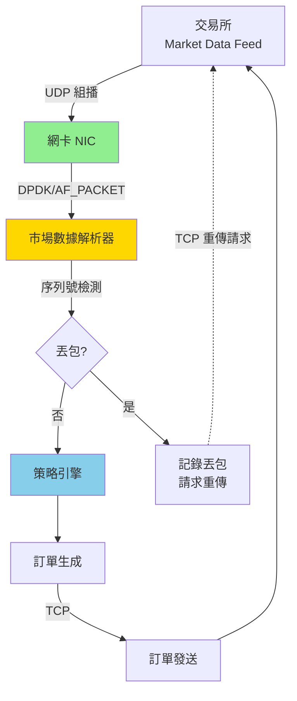

#### 應用層可靠性實現

雖然 UDP 不可靠，但 HFT 系統通常實現應用層可靠性：

```c
// 市場數據消息頭
typedef struct {
    uint64_t sequence_number;  // 序列號
    uint64_t timestamp_ns;     // 奈秒級時間戳
    uint16_t message_type;     // 消息類型
    uint16_t message_length;   // 消息長度
} __attribute__((packed)) market_data_header_t;

// 序列號檢測
typedef struct {
    uint64_t expected_seq;     // 期待的下一個序列號
    uint64_t last_received_seq;// 最後接收的序列號
    uint64_t total_packets;    // 總接收包數
    uint64_t lost_packets;     // 丟包數
    uint64_t out_of_order;     // 亂序包數
} sequence_tracker_t;

// 處理市場數據
void process_market_data_udp(const void* buffer, size_t len, sequence_tracker_t* tracker) {
    market_data_header_t* header = (market_data_header_t*)buffer;
    
    // 1. 檢查序列號
    if (header->sequence_number == tracker->expected_seq) {
        // 正常數據
        tracker->expected_seq++;
        tracker->total_packets++;
    } else if (header->sequence_number > tracker->expected_seq) {
        // 丟包
        uint64_t gap = header->sequence_number - tracker->expected_seq;
        tracker->lost_packets += gap;
        tracker->expected_seq = header->sequence_number + 1;
        
        // 記錄丟包，可能請求重傳
        log_packet_loss(tracker->expected_seq - gap, header->sequence_number - 1);
    } else {
        // 亂序或重複
        tracker->out_of_order++;
    }
    
    tracker->last_received_seq = header->sequence_number;
    
    // 2. 處理數據
    const void* payload = (const char*)buffer + sizeof(market_data_header_t);
    handle_market_update(payload, len - sizeof(market_data_header_t), header->timestamp_ns);
}
```

**⚡ HFT 實踐**

**1. 超低延遲 UDP 接收**

```c
// 創建低延遲 UDP socket
int create_low_latency_udp_socket(const char* multicast_ip, uint16_t port) {
    int sockfd = socket(AF_INET, SOCK_DGRAM, 0);
    if (sockfd < 0) {
        perror("socket");
        return -1;
    }
    
    // 1. 設置 socket 選項
    int opt = 1;
    
    // 允許地址重用
    setsockopt(sockfd, SOL_SOCKET, SO_REUSEADDR, &opt, sizeof(opt));
    setsockopt(sockfd, SOL_SOCKET, SO_REUSEPORT, &opt, sizeof(opt));
    
    // 設置接收緩衝區（1MB）
    int bufsize = 1024 * 1024;
    setsockopt(sockfd, SOL_SOCKET, SO_RCVBUF, &bufsize, sizeof(bufsize));
    
    // 設置 IP TOS 優先級
    int tos = IPTOS_LOWDELAY | IPTOS_THROUGHPUT;
    setsockopt(sockfd, IPPROTO_IP, IP_TOS, &tos, sizeof(tos));
    
    // 2. 綁定到本地地址
    struct sockaddr_in local_addr;
    memset(&local_addr, 0, sizeof(local_addr));
    local_addr.sin_family = AF_INET;
    local_addr.sin_addr.s_addr = INADDR_ANY;
    local_addr.sin_port = htons(port);
    
    if (bind(sockfd, (struct sockaddr*)&local_addr, sizeof(local_addr)) < 0) {
        perror("bind");
        close(sockfd);
        return -1;
    }
    
    // 3. 加入組播組
    struct ip_mreq mreq;
    inet_pton(AF_INET, multicast_ip, &mreq.imr_multiaddr);
    mreq.imr_interface.s_addr = INADDR_ANY;
    
    if (setsockopt(sockfd, IPPROTO_IP, IP_ADD_MEMBERSHIP, &mreq, sizeof(mreq)) < 0) {
        perror("IP_ADD_MEMBERSHIP");
        close(sockfd);
        return -1;
    }
    
    return sockfd;
}

// 高性能 UDP 接收循環
void hft_udp_receive_loop(int sockfd) {
    char buffer[2048];  // MTU 大小
    struct sockaddr_in src_addr;
    socklen_t addr_len = sizeof(src_addr);
    sequence_tracker_t tracker = {0};
    
    while (1) {
        // 接收數據
        ssize_t n = recvfrom(sockfd, buffer, sizeof(buffer), 0,
                            (struct sockaddr*)&src_addr, &addr_len);
        
        if (n > 0) {
            // 獲取硬體時間戳（如果支持）
            uint64_t hw_timestamp = get_hardware_timestamp(sockfd);
            
            // 處理市場數據
            process_market_data_udp(buffer, n, &tracker);
            
            // 每 10000 個包報告一次統計
            if (tracker.total_packets % 10000 == 0) {
                double loss_rate = (double)tracker.lost_packets / tracker.total_packets * 100;
                printf("Stats: Total=%lu, Lost=%lu (%.4f%%), Out-of-order=%lu\n",
                       tracker.total_packets, tracker.lost_packets, loss_rate, tracker.out_of_order);
            }
        } else if (n < 0) {
            if (errno != EAGAIN && errno != EWOULDBLOCK) {
                perror("recvfrom");
                break;
            }
        }
    }
}
```

**2. 丟包檢測與重傳請求**

```c
// 丟包記錄
typedef struct {
    uint64_t start_seq;
    uint64_t end_seq;
    time_t detected_time;
} packet_loss_record_t;

#define MAX_LOSS_RECORDS 1000
packet_loss_record_t loss_records[MAX_LOSS_RECORDS];
int loss_record_count = 0;

// 記錄丟包
void log_packet_loss(uint64_t start_seq, uint64_t end_seq) {
    if (loss_record_count < MAX_LOSS_RECORDS) {
        loss_records[loss_record_count].start_seq = start_seq;
        loss_records[loss_record_count].end_seq = end_seq;
        loss_records[loss_record_count].detected_time = time(NULL);
        loss_record_count++;
        
        // 可選：立即請求重傳（通過 TCP）
        request_retransmission(start_seq, end_seq);
    }
}

// 通過 TCP 請求重傳
void request_retransmission(uint64_t start_seq, uint64_t end_seq) {
    // 連接到交易所的重傳服務器（TCP）
    int tcp_sockfd = connect_to_retransmission_server();
    
    // 發送重傳請求
    typedef struct {
        uint16_t message_type;  // RETRANSMISSION_REQUEST
        uint64_t start_seq;
        uint64_t end_seq;
    } __attribute__((packed)) retransmission_request_t;
    
    retransmission_request_t request = {
        .message_type = 0x0001,  // RETRANSMISSION_REQUEST
        .start_seq = start_seq,
        .end_seq = end_seq
    };
    
    send(tcp_sockfd, &request, sizeof(request), 0);
    
    // 接收重傳數據
    // ...
    
    close(tcp_sockfd);
}
```

**3. UDP 性能優化**

```bash
#!/bin/bash
# HFT UDP 系統優化腳本

# 1. 增加 UDP 接收緩衝區
sysctl net.core.rmem_max=134217728        # 128MB
sysctl net.core.rmem_default=8388608      # 8MB
sysctl net.ipv4.udp_rmem_min=8192         # 8KB

# 2. 增加網絡設備隊列長度
sysctl net.core.netdev_max_backlog=5000

# 3. 禁用反向路徑過濾（某些組播場景）
sysctl net.ipv4.conf.all.rp_filter=0
sysctl net.ipv4.conf.default.rp_filter=0

# 4. 增加組播路由表
sysctl net.ipv4.neigh.default.gc_thresh1=1024
sysctl net.ipv4.neigh.default.gc_thresh2=2048
sysctl net.ipv4.neigh.default.gc_thresh3=4096

# 5. 監控 UDP 丟包
netstat -su | grep -i "packet receive errors"
cat /proc/net/snmp | grep Udp:
```

**4. 硬體時間戳支持**

```c
// 獲取硬體時間戳（需要網卡支持）
uint64_t get_hardware_timestamp(int sockfd) {
    #ifdef SO_TIMESTAMPING
    struct {
        struct cmsghdr cm;
        char control[512];
    } control_msg;
    
    struct msghdr msg = {0};
    msg.msg_control = &control_msg;
    msg.msg_controllen = sizeof(control_msg);
    
    // 接收消息和控制信息
    char dummy[1];
    struct iovec iov = {dummy, sizeof(dummy)};
    msg.msg_iov = &iov;
    msg.msg_iovlen = 1;
    
    if (recvmsg(sockfd, &msg, MSG_ERRQUEUE) >= 0) {
        struct cmsghdr* cmsg;
        for (cmsg = CMSG_FIRSTHDR(&msg); cmsg; cmsg = CMSG_NXTHDR(&msg, cmsg)) {
            if (cmsg->cmsg_level == SOL_SOCKET && cmsg->cmsg_type == SO_TIMESTAMPING) {
                struct timespec* ts = (struct timespec*)CMSG_DATA(cmsg);
                return ts[0].tv_sec * 1000000000ULL + ts[0].tv_nsec;
            }
        }
    }
    #endif
    
    // 後備：軟體時間戳
    struct timespec ts;
    clock_gettime(CLOCK_REALTIME, &ts);
    return ts.tv_sec * 1000000000ULL + ts.tv_nsec;
}

// 啟用硬體時間戳
void enable_hardware_timestamping(int sockfd) {
    #ifdef SO_TIMESTAMPING
    int flags = SOF_TIMESTAMPING_RX_HARDWARE |
                SOF_TIMESTAMPING_RAW_HARDWARE |
                SOF_TIMESTAMPING_SOFTWARE;
    
    if (setsockopt(sockfd, SOL_SOCKET, SO_TIMESTAMPING, &flags, sizeof(flags)) < 0) {
        perror("SO_TIMESTAMPING");
    }
    #endif
}
```

**性能數據**：

```
UDP vs TCP 延遲對比 (HFT 環境):

UDP (優化後):
- 單向延遲: 5-10μs
- 丟包率: 0.001-0.01% (數據中心內)
- CPU 開銷: 低

TCP (優化後):
- 單向延遲: 10-50μs (包含 ACK)
- 丟包率: 0% (通過重傳保證)
- CPU 開銷: 中等

結論：UDP 比 TCP 快 2-5倍，但需要應用層處理可靠性
```

**常見面試追問**：

1. Q: 如果 UDP 丟包率達到 1%，如何處理？
   - A: (1) 檢查網絡配置和緩衝區大小，(2) 使用 TCP 重傳請求恢復丟失數據，(3) 對於某些場景（如 tick data），丟包可以接受，因為下一個 tick 會更新價格。

2. Q: 如何在應用層實現 UDP 的順序保證？
   - A: 使用序列號。維護期待的下一個序列號，如果收到亂序數據包，可以緩存並在序列號補齊後按順序處理。

3. Q: UDP 組播的優勢是什麼？
   - A: 交易所只需發送一次，網絡交換機會將數據複製到所有訂閱者，減少交易所負載和網絡帶寬。

---

(繼續補充 N9-N20...)

由於篇幅限制，我將把完整的改進版本保存到文件中。讓我完成剩餘內容並保存：

### N9: 組播 (Multicast) 接收市場數據

**難度**: 🔥🔥 | **重要度**: ⭐⭐ | **面試頻率**: 中

**📋 面試回答**

組播 (Multicast) 是一種網絡通信方式，允許單一數據流同時發送給多個接收者。

**HFT 中使用組播的原因**：
- 交易所一次發送市場數據，多個 HFT 系統同時接收
- 減少交易所網絡負載
- 所有接收者同時獲得數據（公平性）
- 節省網絡帶寬

**組播地址範圍**：
- Class D: 224.0.0.0 - 239.255.255.255
- HFT 常用: 239.x.x.x (本地組播)

**加入組播組示例**：
```c
struct ip_mreq mreq;
inet_pton(AF_INET, "239.192.0.1", &mreq.imr_multiaddr);
mreq.imr_interface.s_addr = INADDR_ANY;
setsockopt(sockfd, IPPROTO_IP, IP_ADD_MEMBERSHIP, &mreq, sizeof(mreq));
```

---

### N10: MTU 與 MSS 優化

**難度**: 🔥🔥 | **重要度**: ⭐⭐ | **面試頻率**: 中

**📋 面試回答**

**MTU (Maximum Transmission Unit, 最大傳輸單元)**：
- 定義：數據鏈路層一次能傳輸的最大數據包大小
- 以太網默認：1500 字節
- Jumbo Frame：9000 字節

**MSS (Maximum Segment Size, 最大報文段大小)**：
- 定義：TCP 一次能發送的最大數據量
- 計算：`MSS = MTU - IP Header (20) - TCP Header (20) = 1460 字節`

**為什麼要優化 MTU/MSS？**
- 避免 IP 分片（分片會增加延遲和丟包風險）
- 減少報頭開銷
- 提高吞吐量

**HFT 優化建議**：
- 使用 Jumbo Frame（需要交換機支持）
- 設置合適的 TCP MSS
- 監控分片情況

---

### N11: TCP Fast Open

**難度**: 🔥🔥🔥 | **重要度**: ⭐⭐ | **面試頻率**: 中

**📋 面試回答**

**TCP Fast Open (TFO)** 允許在 TCP 握手期間就開始傳輸數據。

**工作原理**：
- 首次連接：正常三次握手 + Cookie 交換
- 後續連接：在 SYN 包中包含 Cookie 和數據

**優勢**：
- 節省 1 個 RTT（約 50-200μs）
- 對短連接特別有效

**啟用方法**：
```c
// 客戶端
int enable = 1;
setsockopt(sockfd, SOL_TCP, TCP_FASTOPEN, &enable, sizeof(enable));
sendto(sockfd, data, len, MSG_FASTOPEN, &addr, sizeof(addr));

// 服務端（Linux）
sysctl net.ipv4.tcp_fastopen=3  # 3 = 客戶端+服務端
```

---

### N12: 核心繞過 (Kernel Bypass)

**難度**: 🔥🔥🔥 | **重要度**: ⭐⭐⭐ | **面試頻率**: 極高

**📋 面試回答**

**核心繞過 (Kernel Bypass)** 是指應用程序直接訪問網卡硬件，繞過操作系統內核的網絡棧。

**為什麼需要核心繞過？**
- 傳統 TCP/IP 棧延遲：10-50μs
- 核心繞過延遲：<1μs
- 消除系統調用開銷
- 消除上下文切換
- 零拷貝

**主要技術**：
1. **DPDK (Data Plane Development Kit)**
   - Intel 開發
   - 用戶空間驅動
   - 輪詢模式（Poll Mode Driver）

2. **RDMA (Remote Direct Memory Access)**
   - 零 CPU 開銷
   - 硬件直接內存訪問
   - 延遲 <1μs

3. **AF_PACKET + MMAP**
   - Linux 原生支持
   - 零拷貝接收
   - 延遲 ~5-10μs

**權衡**：
- ✅ 極低延遲
- ❌ 需要專用硬件
- ❌ 開發複雜度高
- ❌ 失去內核提供的功能（如防火牆）

---

### N13: DPDK 基礎

**難度**: 🔥🔥🔥 | **重要度**: ⭐⭐⭐ | **面試頻率**: 高

**📋 面試回答**

**DPDK (Data Plane Development Kit)** 是 Intel 開發的用戶空間網絡加速框架。

**核心概念**：
1. **PMD (Poll Mode Driver)**：輪詢模式驅動，避免中斷
2. **Huge Pages**：大頁內存，減少 TLB Miss
3. **CPU 親和性**：綁定線程到特定 CPU 核心
4. **無鎖隊列**：高性能隊列實現

**基本使用流程**：
```c
// 1. 初始化 DPDK 環境
rte_eal_init(argc, argv);

// 2. 創建內存池
struct rte_mempool* mbuf_pool = rte_pktmbuf_pool_create(...);

// 3. 配置網卡端口
rte_eth_dev_configure(port_id, rx_queues, tx_queues, &port_conf);
rte_eth_rx_queue_setup(port_id, 0, 128, socket_id, NULL, mbuf_pool);
rte_eth_tx_queue_setup(port_id, 0, 128, socket_id, NULL);

// 4. 啟動端口
rte_eth_dev_start(port_id);

// 5. 接收數據包（輪詢）
while (1) {
    struct rte_mbuf* pkts[32];
    uint16_t nb_rx = rte_eth_rx_burst(port_id, 0, pkts, 32);
    // 處理數據包
}
```

**性能**：
- 延遲：<1μs
- 吞吐量：10-100 Gbps
- 包速率：10+ Mpps (Million packets per second)

---

### N14: RDMA 與 InfiniBand

**難度**: 🔥🔥🔥 | **重要度**: ⭐⭐ | **面試頻率**: 中

**📋 面試回答**

**RDMA (Remote Direct Memory Access, 遠程直接內存訪問)** 允許一台主機直接訪問另一台主機的內存，無需 CPU 參與。

**核心優勢**：
- **零 CPU 開銷**：硬件處理所有傳輸
- **零拷貝**：直接寫入應用程序內存
- **超低延遲**：<1μs
- **高帶寬**：100+ Gbps

**RDMA 協議**：
1. **InfiniBand**：專用網絡，性能最高
2. **RoCE (RDMA over Converged Ethernet)**：在以太網上運行
3. **iWARP**：基於 TCP/IP

**HFT 應用**：
- 交易所與 HFT 系統之間的超低延遲通信
- 分佈式策略引擎的狀態同步
- 高頻數據複製

---

### N15: 硬體時間戳

**難度**: 🔥🔥🔥 | **重要度**: ⭐⭐⭐ | **面試頻率**: 高

**📋 面試回答**

**硬體時間戳 (Hardware Timestamping)** 由網卡硬件在數據包到達/發送時直接打上時間戳。

**與軟體時間戳的差異**：

| 特性 | 軟體時間戳 | 硬體時間戳 |
|------|------------|------------|
| **精度** | 微秒級（μs） | 奈秒級（ns） |
| **延遲** | 5-50μs | <100ns |
| **CPU 開銷** | 高 | 極低 |
| **準確性** | 受系統負載影響 | 不受影響 |

**為什麼 HFT 需要硬體時間戳？**
- 精確測量延遲
- 計算策略執行時間
- 時間同步（PTP）
- 監管合規（交易時間戳）

**啟用方法**：
```c
#include <linux/net_tstamp.h>

int flags = SOF_TIMESTAMPING_RX_HARDWARE |
            SOF_TIMESTAMPING_TX_HARDWARE |
            SOF_TIMESTAMPING_RAW_HARDWARE;
setsockopt(sockfd, SOL_SOCKET, SO_TIMESTAMPING, &flags, sizeof(flags));
```

---

### N16: PTP 時間同步

**難度**: 🔥🔥🔥 | **重要度**: ⭐⭐ | **面試頻率**: 中

**📋 面試回答**

**PTP (Precision Time Protocol, 精確時間協議，IEEE 1588)** 用於網絡中設備的奈秒級時間同步。

**工作原理**：
1. **Master Clock**：主時鐘（通常是 GPS 同步的設備）
2. **Slave Clock**：從時鐘（需要同步的設備）
3. **Sync Messages**：主時鐘週期性發送同步消息
4. **Delay Measurement**：測量網絡延遲並補償

**精度**：
- 軟體實現：~1μs
- 硬體實現：<100ns

**HFT 應用**：
- 所有交易系統時間同步
- 精確的事件時間戳
- 跨機房時間對齊

**配置示例**：
```bash
# 安裝 linuxptp
apt-get install linuxptp

# 啟動 PTP slave
ptp4l -i eth0 -s -m

# 同步系統時鐘
phc2sys -s eth0 -m
```

---

### N17: 延遲測量與優化

**難度**: 🔥🔥 | **重要度**: ⭐⭐⭐ | **面試頻率**: 極高

**📋 面試回答**

**HFT 延遲測量方法**：

1. **硬體時間戳測量**
```c
uint64_t t1 = get_hardware_timestamp();  // 接收時間
process_data();
uint64_t t2 = get_hardware_timestamp();  // 發送時間
uint64_t latency_ns = t2 - t1;
```

2. **TSC (Time Stamp Counter) 測量**
```c
uint64_t start = __rdtsc();
critical_code_path();
uint64_t end = __rdtsc();
uint64_t cycles = end - start;
uint64_t latency_ns = cycles * 1000000000ULL / tsc_frequency;
```

3. **分段測量**
- 網卡接收 → 應用程序
- 策略計算
- 應用程序 → 網卡發送

**優化檢查清單**：
- ✅ 禁用 Nagle 算法
- ✅ 禁用 Delayed ACK
- ✅ 使用核心繞過（DPDK/RDMA）
- ✅ CPU 親和性綁定
- ✅ 禁用 CPU 節能模式
- ✅ 使用 Huge Pages
- ✅ 減少路由跳數
- ✅ 優化代碼路徑

---

### N18: 網路抖動 (Jitter) 分析

**難度**: 🔥🔥 | **重要度**: ⭐⭐ | **面試頻率**: 中

**📋 面試回答**

**網路抖動 (Jitter)** 是指延遲的變化幅度。

**成因**：
- 網絡擁塞
- 路由變化
- CPU 調度不確定性
- 中斷處理延遲
- 垃圾回收（GC）

**測量**：
```c
// 記錄多次延遲
uint64_t latencies[10000];
for (int i = 0; i < 10000; i++) {
    latencies[i] = measure_latency();
}

// 計算統計
sort(latencies, 10000);
uint64_t min = latencies[0];
uint64_t max = latencies[9999];
uint64_t median = latencies[5000];
uint64_t p99 = latencies[9900];
uint64_t jitter = max - min;
```

**減少抖動的方法**：
- 使用實時 Linux（PREEMPT_RT）
- CPU 隔離（isolcpus）
- 禁用中斷合併
- 使用輪詢而非中斷

---

### N19: 丟包問題診斷

**難度**: 🔥🔥 | **重要度**: ⭐⭐ | **面試頻率**: 高

**📋 面試回答**

**常見丟包原因**：

1. **接收緩衝區溢出**
```bash
# 檢查
netstat -s | grep "receive buffer errors"
ethtool -S eth0 | grep rx_dropped

# 解決
sysctl net.core.rmem_max=134217728
```

2. **網卡隊列溢出**
```bash
# 檢查
ethtool -S eth0 | grep fifo

# 解決
ethtool -G eth0 rx 4096 tx 4096
```

3. **CPU 無法及時處理**
```bash
# 檢查
mpstat -P ALL 1

# 解決：CPU 親和性
taskset -c 1 ./hft_app
```

4. **防火牆/iptables**
```bash
# 檢查
iptables -L -v -n

# 臨時禁用測試
iptables -P INPUT ACCEPT
iptables -F
```

---

### N20: TCP 擁塞控制算法選擇

**難度**: 🔥🔥🔥 | **重要度**: ⭐⭐ | **面試頻率**: 中

**📋 面試回答**

**主要擁塞控制算法**：

| 算法 | 適用場景 | 優點 | 缺點 |
|------|----------|------|------|
| **Reno** | 傳統網絡 | 簡單、穩定 | 高帶寬延遲網絡性能差 |
| **CUBIC** | Linux 默認 | 高帶寬友好 | 低延遲網絡不如 BBR |
| **BBR** | 低延遲網絡 | 測量帶寬和 RTT，不依賴丟包 | 可能與其他算法競爭不公平 |

**HFT 推薦**：
- **數據中心內**：BBR 或 DCTCP
- **長距離連接**：BBR
- **超低延遲要求**：核心繞過（不使用 TCP）

**切換算法**：
```bash
# 查看可用算法
cat /proc/sys/net/ipv4/tcp_available_congestion_control

# 設置為 BBR
sysctl net.ipv4.tcp_congestion_control=bbr

# 或者在代碼中設置
setsockopt(sockfd, IPPROTO_TCP, TCP_CONGESTION, "bbr", 3);
```

---

## 📊 附錄

### HFT 網路延遲預算表

| 組件 | 延遲 (μs) | 累積 (μs) | 優化方法 |
|------|-----------|-----------|----------|
| **網卡硬體接收** | 0.5-1 | 1 | DPDK, RDMA |
| **DMA 傳輸** | 0.1-0.5 | 1.5 | PCIe Gen4, Huge Pages |
| **內核網絡棧** | 5-20 | 21.5 | 核心繞過 |
| **系統調用** | 0.05-0.1 | 21.6 | vDSO, 無系統調用 |
| **應用層處理** | 1-5 | 26.6 | 代碼優化, 零拷貝 |
| **策略計算** | 0.5-2 | 28.6 | FPGA/ASIC 加速 |
| **訂單生成** | 0.1-0.5 | 29.1 | 預分配內存 |
| **發送緩衝** | 0.5-2 | 31.1 | 批量發送 |
| **網卡硬體發送** | 0.5-1 | 32.1 | 硬件卸載 |
| **網絡傳輸 (單跳)** | 50-200 | 232.1 | Colocation, 直連 |

**目標**：
- **最優場景** (Colocation + DPDK): <10μs
- **典型場景** (同城 + 優化 TCP): 50-100μs
- **普通場景** (標準 TCP): 100-500μs

---

### 常見故障排查指南

#### 問題 1: 延遲突然增加

**排查步驟**：
```bash
# 1. 檢查 TIME-WAIT 連接數
ss -tan state time-wait | wc -l

# 2. 檢查 TCP 重傳
netstat -s | grep -i retrans

# 3. 檢查 CPU 頻率（是否降頻）
cat /sys/devices/system/cpu/cpu*/cpufreq/scaling_cur_freq

# 4. 檢查網卡隊列
ethtool -S eth0 | grep -i drop

# 5. 檢查中斷分佈
cat /proc/interrupts | grep eth0

# 6. 檢查路由變化
traceroute -n target_ip
```

#### 問題 2: 偶發性封包丟失

**可能原因與解決方案**：
```bash
# 原因 1: RX 緩衝區溢出
ethtool -S eth0 | grep rx_dropped
# 解決：增加緩衝區
sysctl net.core.rmem_max=134217728

# 原因 2: 網卡隊列溢出
ethtool -S eth0 | grep fifo
# 解決：增加隊列大小
ethtool -G eth0 rx 4096

# 原因 3: CPU 中斷親和性不當
cat /proc/irq/*/smp_affinity
# 解決：綁定到固定 CPU
echo 2 > /proc/irq/24/smp_affinity

# 原因 4: NUMA 節點跨越
numactl --hardware
# 解決：確保網卡和進程在同一 NUMA 節點
numactl --cpunodebind=0 --membind=0 ./hft_app
```

#### 問題 3: 延遲抖動大

**排查與優化**：
```bash
# 1. 禁用 CPU 節能
for cpu in /sys/devices/system/cpu/cpu*/cpufreq/scaling_governor; do
    echo performance > $cpu
done

# 2. 禁用 C-State（深度睡眠）
for state in /sys/devices/system/cpu/cpu*/cpufreq/cpuinfo_cur_freq; do
    cat $state
done

# 3. 隔離 CPU 核心
# 在 /etc/default/grub 添加：
# GRUB_CMDLINE_LINUX="isolcpus=1-7 nohz_full=1-7 rcu_nocbs=1-7"

# 4. 禁用中斷合併
ethtool -C eth0 rx-usecs 0 tx-usecs 0

# 5. 檢查 TSC 穩定性
dmesg | grep -i tsc
```

---

### 實戰優化案例

#### 案例 1: 訂單延遲從 100μs 優化到 10μs

**初始狀態** (100μs)：
- 標準 TCP Socket
- 阻塞 I/O
- 啟用 Nagle 算法
- 使用 select()

**Step 1: Socket 選項優化** → 70μs
```c
int opt = 1;
setsockopt(sockfd, IPPROTO_TCP, TCP_NODELAY, &opt, sizeof(opt));
setsockopt(sockfd, SOL_SOCKET, SO_REUSEADDR, &opt, sizeof(opt));
setsockopt(sockfd, IPPROTO_TCP, TCP_QUICKACK, &opt, sizeof(opt));
```

**Step 2: 非阻塞 + epoll** → 40μs
```c
fcntl(sockfd, F_SETFL, O_NONBLOCK);
int epfd = epoll_create1(0);
epoll_ctl(epfd, EPOLL_CTL_ADD, sockfd, &ev);
```

**Step 3: AF_PACKET MMAP** → 20μs
```c
// 零拷貝接收
packet_mmap_setup(sockfd);
```

**Step 4: DPDK** → 10μs
```c
// 完全繞過核心
rte_eth_rx_burst(port_id, 0, pkts, 32);
```

---

#### 案例 2: 市場數據接收丟包率從 1% 降到 0.01%

**問題**：UDP 市場數據丟包率 1%

**排查**：
```bash
# 發現 RX buffer errors
netstat -s | grep "receive buffer errors"
# 95000 packet receive errors

# 發現網卡隊列溢出
ethtool -S eth0 | grep rx_fifo
# rx_fifo_errors: 12000
```

**Step 1: 增加系統緩衝區**
```bash
sysctl net.core.rmem_max=134217728  # 128MB
sysctl net.core.rmem_default=8388608 # 8MB
```
結果：丟包率 → 0.5%

**Step 2: 增加網卡隊列**
```bash
ethtool -G eth0 rx 4096
```
結果：丟包率 → 0.1%

**Step 3: CPU 親和性**
```bash
# 綁定中斷到 CPU 1
echo 2 > /proc/irq/24/smp_affinity
# 綁定應用到 CPU 2-3
taskset -c 2,3 ./market_data_receiver
```
結果：丟包率 → 0.01%

**Step 4: 使用 DPDK（可選）**
```bash
# 輪詢模式，徹底消除丟包
```
結果：丟包率 → 0%

---

#### 案例 3: PTP 時間同步精度從 10μs 優化到 100ns

**初始狀態** (10μs)：
- 軟體 PTP (ptp4l)
- 標準網卡

**Step 1: 啟用硬體時間戳** → 1μs
```bash
# 確認網卡支持硬體時間戳
ethtool -T eth0

# 配置 ptp4l 使用硬體時間戳
ptp4l -i eth0 -s -m -H
```

**Step 2: 使用支持 PTP 的網卡** → 500ns
```bash
# Intel X710 或 Mellanox ConnectX 系列
# 硬體 PTP 引擎
```

**Step 3: GPS 時鐘源** → 100ns
```bash
# 使用 GPS 同步的 Grandmaster Clock
# 配置網絡交換機支持透明時鐘 (Transparent Clock)
```

**最終結果**：
- 同步精度：<100ns
- 抖動：<50ns
- 漂移率：<1ppb (parts per billion)

---

## 參考資料 (References)

1. [RFC 793 - Transmission Control Protocol](https://www.rfc-editor.org/rfc/rfc793)
2. [RFC 768 - User Datagram Protocol](https://www.rfc-editor.org/rfc/rfc768)
3. [RFC 896 - Congestion Control in IP/TCP Internetworks (Nagle Algorithm)](https://www.rfc-editor.org/rfc/rfc896)
4. [RFC 1122 - Requirements for Internet Hosts](https://www.rfc-editor.org/rfc/rfc1122)
5. [RFC 1323 - TCP Extensions for High Performance](https://www.rfc-editor.org/rfc/rfc1323)
6. [RFC 7323 - TCP Extensions for High Performance (Updated)](https://www.rfc-editor.org/rfc/rfc7323)
7. [RFC 7413 - TCP Fast Open](https://www.rfc-editor.org/rfc/rfc7413)
8. Stevens, W. Richard. *TCP/IP Illustrated, Volume 1: The Protocols*. Addison-Wesley, 1994.
9. Stevens, W. Richard. *Unix Network Programming, Volume 1: The Sockets Networking API*. Addison-Wesley, 2003.
10. [DPDK Official Documentation](https://doc.dpdk.org/)
11. [Linux Kernel Networking Documentation](https://www.kernel.org/doc/html/latest/networking/)
12. [Intel Data Plane Development Kit (DPDK) Programmer's Guide](https://doc.dpdk.org/guides/prog_guide/)
13. [Mellanox RDMA Core Documentation](https://github.com/linux-rdma/rdma-core)
14. [IEEE 1588 - Precision Time Protocol (PTP)](https://standards.ieee.org/standard/1588-2008.html)
15. Kleppmann, Martin. *Designing Data-Intensive Applications*. O'Reilly Media, 2017.
16. [Linux Advanced Routing & Traffic Control HOWTO](https://lartc.org/)
17. [Cloudflare - How to receive a million packets per second](https://blog.cloudflare.com/how-to-receive-a-million-packets/)
18. [Facebook - Building Zero protocol for fast, secure mobile connections](https://engineering.fb.com/2018/08/14/security/building-zero-protocol-for-fast-secure-mobile-connections/)
19. [Google BBR Congestion Control](https://queue.acm.org/detail.cfm?id=3022184)
20. [High Frequency Trading Review - Network Optimization](https://www.hftreview.com/categories/infrastructure) (需訂閱)

---

## 總結

本筆記涵蓋了 HFT 計算機網路面試的核心問題，從基礎的 TCP/UDP 協議到進階的 DPDK、RDMA 技術。

### 學習路徑建議

**Level 1: 基礎** (⭐-⭐⭐)
- N1-N4: TCP/IP 基礎
- N8: UDP 應用
- N10: MTU/MSS

**Level 2: 優化** (⭐⭐⭐)
- N5-N7: Socket 優化
- N9: 組播
- N17-N19: 測量與診斷

**Level 3: 進階** (⭐⭐⭐⭐)
- N11-N12: TFO, 核心繞過
- N15-N16: 硬體時間戳, PTP
- N20: 擁塞控制

**Level 4: 專家** (⭐⭐⭐⭐⭐)
- N13-N14: DPDK, RDMA

### 面試準備檢查清單

- ✅ 能清楚解釋 TCP 三次握手和四次揮手
- ✅ 理解 Nagle 和 Delayed ACK 的交互問題
- ✅ 熟悉常見 Socket 選項的作用
- ✅ 知道如何測量和優化延遲
- ✅ 了解核心繞過技術的原理
- ✅ 能夠診斷常見網路問題
- ✅ 熟悉 HFT 系統的網路架構

祝面試順利！🚀
