# HFT 作業系統問題集
> **使用說明**: 🔥 表示難度, ⭐ 表示重要度  
> - 難度: 無符號 (基礎) → 🔥🔥🔥 (專家)  
> - 重要度: 無符號 (了解即可) → ⭐⭐⭐ (必須精通)

---

## 🔰 OS 基礎 (HFT 必須理解的核心概念)

### H1: 你能解釋一下內核空間和用戶空間的區別嗎？為什麼系統調用會有開銷？

**難度**: 🔥 | **重要度**: ⭐⭐ | **面試頻率**: 極高

**📋 面試回答**

**內核空間 (Kernel Space)** 和 **用戶空間 (User Space)** 的區別：
- **權限等級**: 內核空間運行在 Ring 0 特權模式，用戶空間運行在 Ring 3 非特權模式
- **記憶體隔離**: 內核空間佔據虛擬記憶體高位地址 (通常 0xC0000000 以上)，用戶空間佔據低位地址
- **硬體訪問**: 內核空間可直接訪問硬體資源，用戶空間必須透過系統調用

**系統調用開銷**包括：
- 模式切換 (用戶態→內核態→用戶態): ~50-100 CPU 週期
- 寄存器保存與恢復: ~20-50 CPU 週期  
- 參數驗證與複製: ~10-30 CPU 週期
- 總開銷: 約 100-1000 個 CPU 週期 (依操作複雜度)

**📚 概念詳解**

#### 為什麼 HFT 要關注系統調用開銷？

在 3GHz CPU 上，1000 個週期 ≈ 330 納秒的延遲。對於要求亞微秒級延遲的 HFT 系統：
- 頻繁的 `read()/write()` 調用會累積顯著延遲
- **替代方案**: 記憶體映射檔案 (`mmap`)、共享記憶體、用戶空間網路堆疊

#### 系統調用的完整流程

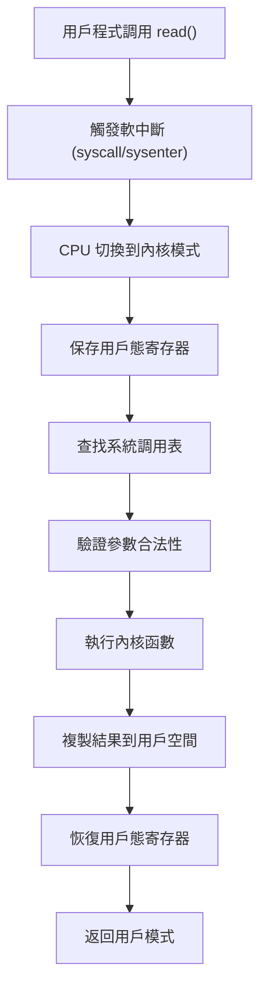

**⚡ HFT 優化技巧**
- 使用 `mmap()` 代替 `read()/write()`
- 預分配記憶體避免運行時 `malloc()`
- 使用 DPDK 繞過內核網路堆疊

---

### H2: 在高頻交易系統中，你會選擇多進程還是多線程架構？為什麼？

**難度**: 🔥 | **重要度**: ⭐⭐⭐ | **面試頻率**: 極高

**📋 面試回答**

**進程 (Process)** 與 **線程 (Thread)** 的區別：

| 特性        | 進程                     | 線程                        |
| --------- | ---------------------- | ------------------------- |
| **地址空間**  | 獨立虛擬地址空間               | 共享進程地址空間                  |
| **記憶體隔離** | 完全隔離，安全性高              | 共享堆/全局變數，需同步              |
| **創建開銷**  | fork() ~1-5ms          | pthread_create() ~10-50μs |
| **切換開銷**  | 需切換頁表+刷新 TLB，~10-100μs | 只切換寄存器，~1-10μs            |
| **通訊方式**  | IPC (管道、共享記憶體)         | 直接訪問共享記憶體                 |

**HFT 中的選擇**：通常偏好線程，因為：
- 切換開銷低
- 共享記憶體通訊高效
- 但需要謹慎的同步設計

**📚 概念詳解**

#### 進程創建的完整開銷

`fork()` 系統調用的步驟：
1. **分配新的 PCB** (Process Control Block)
2. **複製頁表** (Copy-on-Write 機制)
3. **分配新的 PID**
4. **複製檔案描述符表**
5. **複製信號處理表**

#### 線程切換 vs 進程切換

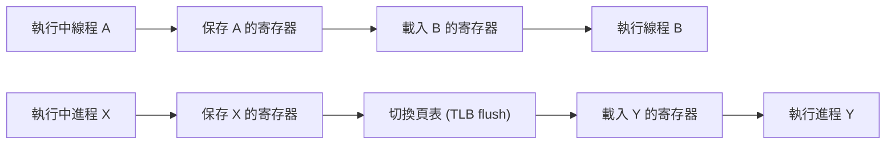

**⚡ HFT 最佳實踐**
- 使用少數長期運行的線程 (避免頻繁創建/銷毀)
- 將關鍵線程綁定到專用 CPU 核心
- 避免不必要的線程同步

---

### H3: 上下文切換什麼時候會發生？它對高頻交易系統有什麼影響？

**難度**: 🔥🔥 | **重要度**: ⭐⭐⭐ | **面試頻率**: 高

**📋 面試回答**

**上下文切換 (Context Switch)** 是 CPU 從一個任務切換到另一個任務的過程。

**發生時機**：
- 時間片用盡 (通常 1-10ms)
- 等待 I/O 操作完成
- 等待鎖或同步原語
- 收到更高優先級任務的搶佔
- 主動調用 `yield()` 或 `sleep()`

**HFT 延遲影響**：
- **直接開銷**: 每次切換 1-10μs
- **間接開銷**: Cache 失效、TLB 失效、CPU 流水線中斷
- **不確定性**: 切換時機無法預測，造成延遲抖動 (Jitter)

**📚 概念詳解**

#### 上下文切換的完整過程

1. **觸發階段**
   - 計時器中斷 (timer interrupt)
   - 系統調用返回時檢查調度標誌

2. **保存當前上下文**
   ```c
   // 偽代碼示例
   current->state = TASK_RUNNING;
   // 保存寄存器: EAX, EBX, ECX, EDX, ESP, EBP, ESI, EDI
   save_processor_state(current);
   ```

3. **選擇下個任務**
   - 運行調度器算法 (CFS, RT)
   - 從運行隊列中選擇任務

4. **載入新上下文**
   ```c
   // 切換記憶體映射 (如果是進程切換)
   switch_mm(prev->mm, next->mm);
   // 恢復寄存器狀態
   restore_processor_state(next);
   ```

#### Cache 與 TLB 失效的影響

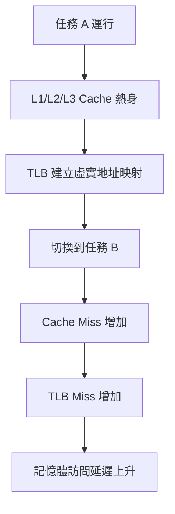

**⚡ HFT 優化策略**
- 使用 `taskset` 設置 CPU 親和性
- 配置實時調度策略 (`SCHED_FIFO`)
- 隔離 CPU 核心 (`isolcpus` 內核參數)
- 使用 `cgroups` 限制其他進程資源

---

### H4: 如何調整 Linux 進程調度器來優化 HFT 應用的性能？

**難度**: 🔥🔥 | **重要度**: ⭐⭐⭐ | **面試頻率**: 高

**📋 面試回答**

**Linux 調度器**的目標：
- **吞吐量**: 最大化系統整體工作完成量
- **響應時間**: 最小化交互任務的響應延遲  
- **公平性**: 確保所有任務獲得合理的 CPU 時間
- **實時性**: 滿足硬實時任務的截止期限要求

**HFT 調度優化**：
```bash
# 設置實時優先級 (1-99，數字越大優先級越高)
chrt -f -p 90 <pid>

# 設置 CPU 親和性
taskset -cp 2,3 <pid>

# 使用 nice 調整優先級 (-20 到 19，數字越小優先級越高)
nice -n -20 ./hft_program
```

**📚 概念詳解**

#### Linux 調度器演進

1. **O(1) 調度器** (2.6 內核)
   - 常數時間複雜度
   - 140 個優先級隊列
   - 不適合桌面互動應用

2. **CFS (Completely Fair Scheduler)** (2.6.23+)
   - 紅黑樹實現
   - 虛擬運行時間概念
   - 適合通用場景

3. **RT 調度器** (實時調度)
   - `SCHED_FIFO`: 先進先出，不搶佔同優先級
   - `SCHED_RR`: 輪轉，同優先級間輪轉

#### 調度類別層次結構

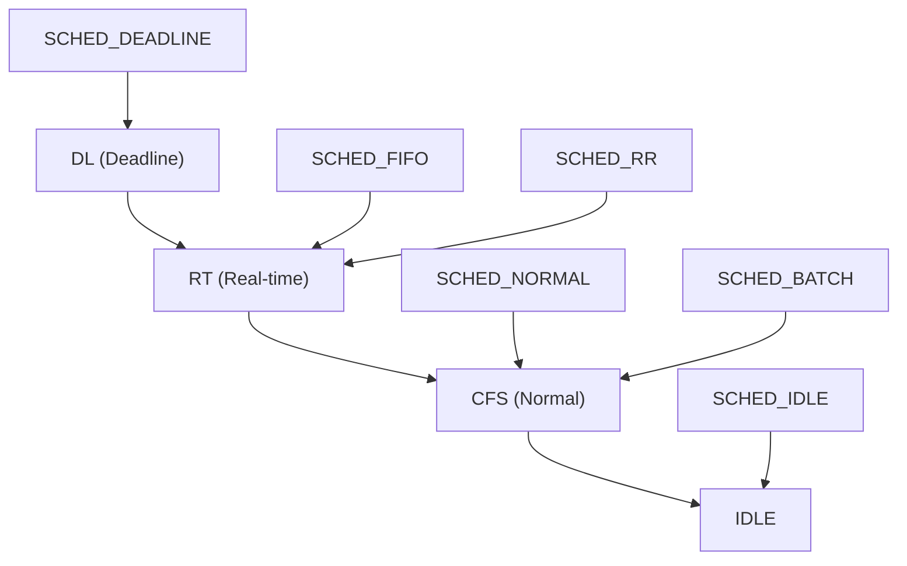

#### cgroups v2 資源控制

```bash
# 創建專用 cgroup
mkdir /sys/fs/cgroup/hft
echo "+cpu" > /sys/fs/cgroup/cgroup.subtree_control

# 設置 CPU 配額 (80% CPU 時間)
echo "800000 1000000" > /sys/fs/cgroup/hft/cpu.max

# 將進程加入 cgroup
echo <pid> > /sys/fs/cgroup/hft/cgroup.procs
```

**⚡ HFT 生產環境配置**
```bash
#!/bin/bash
# HFT 系統初始化腳本

# 隔離 CPU 2-7 給 HFT 應用
echo "isolcpus=2-7 nohz_full=2-7 rcu_nocbs=2-7" >> /etc/default/grub

# 設置 CPU Governor 為 performance
echo performance > /sys/devices/system/cpu/cpu*/cpufreq/scaling_governor

# 禁用透明大頁面
echo never > /sys/kernel/mm/transparent_hugepage/enabled

# 設置中斷親和性 (中斷處理在 CPU 0-1)
echo 3 > /proc/irq/*/smp_affinity
```

---

### H5: 為什麼 HFT 系統要使用 mlock？它和 mlockall 有什麼區別？

**難度**: 🔥🔥 | **重要度**: ⭐⭐⭐ | **面試頻率**: 高

**📋 面試回答**

**`mlock()` vs `mlockall()`**：
- **`mlock(addr, len)`**: 鎖定指定記憶體區域，避免被交換到磁碟
- **`mlockall(flags)`**: 鎖定進程的所有記憶體頁面

**flags 選項**：
- `MCL_CURRENT`: 鎖定當前已分配的頁面
- `MCL_FUTURE`: 鎖定未來分配的頁面
- `MCL_ONFAULT`: 僅在首次訪問時鎖定

**HFT 中的重要性**：
- 避免缺頁中斷造成的不可預測延遲
- 確保關鍵數據結構始終在物理記憶體中
- 消除交換空間 (Swap) 導致的毫秒級延遲

**📚 概念詳解**

#### 虛擬記憶體與缺頁中斷

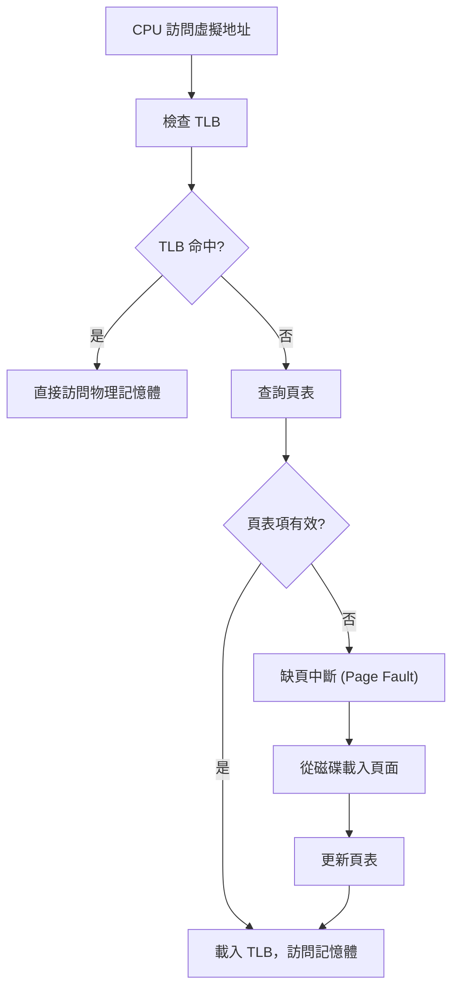

#### 缺頁中斷的開銷分析

**Major Page Fault** (從磁碟載入):
- **SSD**: 100-500μs
- **HDD**: 5-15ms  
- **網路儲存**: 可達 50ms+

**Minor Page Fault** (已在記憶體但頁表未建立):
- 約 1-5μs

#### HFT 記憶體預分配策略

```cpp
// HFT 記憶體池實現示例
class HFTMemoryPool {
private:
    void* pool_start;
    size_t pool_size;
    std::atomic<size_t> current_offset;

public:
    HFTMemoryPool(size_t size) : pool_size(size), current_offset(0) {
        // 預分配大塊記憶體
        pool_start = aligned_alloc(4096, size);
        
        // 鎖定記憶體避免換頁
        if (mlock(pool_start, size) != 0) {
            throw std::runtime_error("Failed to lock memory");
        }
        
        // 預先觸摸所有頁面，觸發分配
        char* ptr = static_cast<char*>(pool_start);
        for (size_t i = 0; i < size; i += 4096) {
            ptr[i] = 0;  // 觸摸每個頁面
        }
    }
    
    void* allocate(size_t size) {
        size_t offset = current_offset.fetch_add(size);
        if (offset + size > pool_size) {
            return nullptr;  // 池已滿
        }
        return static_cast<char*>(pool_start) + offset;
    }
};
```

**⚡ HFT 系統初始化**
```cpp
int main() {
    // 鎖定所有記憶體
    if (mlockall(MCL_CURRENT | MCL_FUTURE) != 0) {
        perror("mlockall failed");
        return 1;
    }
    
    // 預分配記憶體池
    HFTMemoryPool pool(1024 * 1024 * 100);  // 100MB
    
    // 預先分配所有可能用到的數據結構
    auto order_book = pool.allocate(sizeof(OrderBook));
    auto price_feed = pool.allocate(sizeof(PriceFeed));
    
    // ... HFT 邏輯
    
    return 0;
}
```

---

### H6: 硬體中斷如何影響 HFT 系統的延遲？如何優化？

**難度**: 🔥🔥 | **重要度**: ⭐⭐⭐ | **面試頻率**: 中

**📋 面試回答**

**硬體中斷 (Hardware Interrupt)** 流程：
1. **中斷請求**: 硬體設備發送 IRQ 信號到中斷控制器 (APIC)
2. **中斷響應**: CPU 完成當前指令後響應中斷
3. **保存上下文**: 保存當前程式的寄存器狀態
4. **中斷處理**: 跳轉到中斷服務程序 (ISR) 執行
5. **恢復上下文**: 恢復被中斷程式的執行

**對 HFT 的影響**：
- 中斷處理通常需要 1-50μs
- 可能造成 Cache 失效和管線暫停
- 不可預測的延遲抖動

**📚 概念詳解**

#### 中斷處理的分層架構

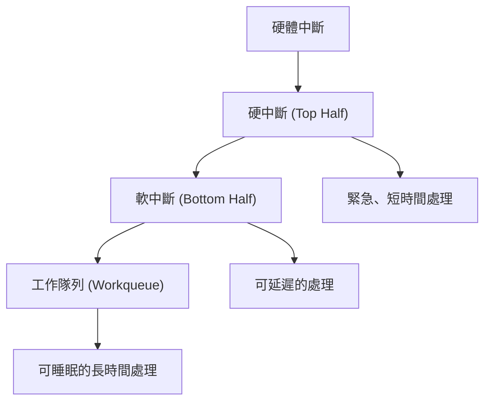

#### APIC 與中斷路由

**Local APIC** (每個 CPU 核心一個):
- 處理本地定時器中斷
- 處理 IPI (處理器間中斷)
- 管理中斷優先級

**I/O APIC** (系統級):
- 管理外設中斷路由
- 支援中斷親和性設置
- 負載均衡中斷處理

#### HFT 中斷優化策略

**1. 中斷親和性設置**
```bash
# 將網卡中斷綁定到 CPU 0
echo 1 > /proc/irq/24/smp_affinity

# 將 HFT 進程綁定到 CPU 1-3  
taskset -cp 1-3 <hft_pid>

# 禁用 IRQ 平衡守護進程
systemctl stop irqbalance
```

**2. CPU 隔離配置**
```bash
# 內核參數設置
isolcpus=2-7          # 隔離 CPU 2-7
nohz_full=2-7         # 禁用定時器中斷
rcu_nocbs=2-7         # RCU 回調處理移至其他 CPU
```

**3. 網路中斷優化**
```bash
# 網卡多隊列設置
ethtool -L eth0 combined 4

# 中斷合併設置 (減少中斷頻率)
ethtool -C eth0 rx-usecs 10 rx-frames 16
```

**⚡ 用戶空間中斷處理**
```cpp
// 使用 UIO (Userspace I/O) 在用戶空間處理中斷
#include <sys/mman.h>
#include <fcntl.h>

class UIOHandler {
private:
    int uio_fd;
    void* uio_mem;
    
public:
    UIOHandler(const char* device) {
        uio_fd = open(device, O_RDWR);
        uio_mem = mmap(NULL, 4096, PROT_READ | PROT_WRITE, 
                      MAP_SHARED, uio_fd, 0);
    }
    
    void wait_interrupt() {
        uint32_t info = 1;
        write(uio_fd, &info, sizeof(info));  // 重新啟用中斷
        read(uio_fd, &info, sizeof(info));   // 等待中斷
    }
};
```

---

### H7: HFT 系統為什麼要避免系統調用？有什麼替代方案？

**難度**: 🔥🔥 | **重要度**: ⭐⭐⭐ | **面試頻率**: 極高

**📋 面試回答**

**為什麼 HFT 要避免系統調用**：
- 每次系統調用開銷 100-1000 個 CPU 週期
- 模式切換帶來不確定性延遲
- 可能觸發調度器運行

**主要替代方案**：
1. **記憶體映射檔案** (`mmap`): 零拷貝檔案訪問
2. **共享記憶體** (`shm`): 進程間高速通訊  
3. **用戶空間網路堆疊** (DPDK): 繞過內核網路處理
4. **異步 I/O** (`io_uring`): 批次化 I/O 操作
5. **用戶空間中斷** (UIO/VFIO): 直接硬體訪問

**📚 概念詳解**

#### mmap vs read/write 性能對比

```cpp
// 傳統方式 - 需要系統調用和記憶體拷貝
char buffer[1024];
ssize_t bytes = read(fd, buffer, sizeof(buffer));  // 系統調用

// mmap 方式 - 直接記憶體訪問
void* mapped = mmap(NULL, file_size, PROT_READ, MAP_PRIVATE, fd, 0);
char* data = static_cast<char*>(mapped);  // 直接訪問，無系統調用
```

**性能對比** (1MB 檔案讀取):
- `read()`: ~10-50μs (包含系統調用和拷貝開銷)
- `mmap()`: ~1-5μs (僅 TLB miss 開銷)

#### DPDK 用戶空間網路堆疊

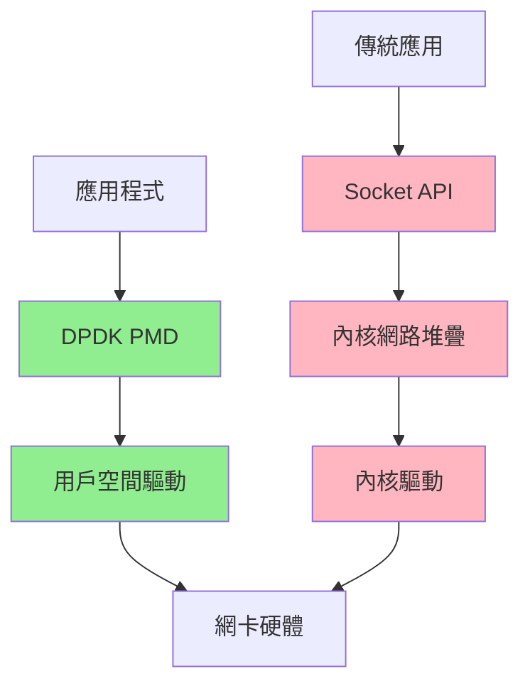

**DPDK 優勢**：
- 零拷貝數據傳輸
- 批次化包處理
- CPU 親和性控制
- 繞過內核開銷

#### io_uring 異步 I/O

```cpp
#include <liburing.h>

class AsyncIOHandler {
private:
    struct io_uring ring;
    
public:
    AsyncIOHandler() {
        io_uring_queue_init(256, &ring, 0);
    }
    
    void submit_read(int fd, void* buf, size_t len, off_t offset) {
        struct io_uring_sqe* sqe = io_uring_get_sqe(&ring);
        io_uring_prep_read(sqe, fd, buf, len, offset);
        io_uring_submit(&ring);
    }
    
    int complete_operations() {
        struct io_uring_cqe* cqe;
        int completed = 0;
        
        while (io_uring_peek_cqe(&ring, &cqe) == 0) {
            // 處理完成的操作
            completed++;
            io_uring_cqe_seen(&ring, cqe);
        }
        
        return completed;
    }
};
```

**⚡ HFT 實踐建議**
- 啟動時完成所有 `mmap` 映射
- 使用 DPDK 處理網路 I/O
- 批次化異步操作減少系統調用頻率
- 預分配所有緩衝區避免運行時分配

---

### H8: 在 HFT 系統中如何精確測量時間？為什麼要用 RDTSC 而不是 gettimeofday？

**難度**: 🔥🔥 | **重要度**: ⭐⭐⭐ | **面試頻率**: 高

**📋 面試回答**

**Timer Interrupt 的影響**：
- 預設每 250Hz-1000Hz 觸發 (每 1-4ms)
- 每次中斷會暫停正在運行的程式 1-10μs
- 在 HFT 關鍵路徑中造成不可預測的延遲

**高精度時間測量方法**：
1. **`RDTSC`**: 直接讀取 CPU 時鐘週期計數器
2. **`clock_gettime(CLOCK_MONOTONIC_RAW)`**: 單調時鐘，不受 NTP 影響
3. **`clock_gettime(CLOCK_REALTIME)`**: 系統時間，可能跳躍

**Tickless Kernel 配置**：
```bash
# 內核參數
nohz=on          # 啟用動態時鐘
nohz_full=2-7    # CPU 2-7 進入 tickless 模式
```

**📚 概念詳解**

#### RDTSC 指令詳解

**RDTSC** (Read Time-Stamp Counter):
- 直接讀取 CPU 的 TSC 寄存器
- 開銷極低：約 10-30 個時鐘週期
- 提供最高精度的時間測量

```cpp
#include <x86intrin.h>

class HighResolutionTimer {
private:
    uint64_t tsc_freq;  // TSC 頻率 (Hz)
    
public:
    HighResolutionTimer() {
        // 校準 TSC 頻率
        calibrate_tsc_frequency();
    }
    
    inline uint64_t rdtsc() const {
        return __rdtsc();
    }
    
    inline uint64_t rdtsc_ordered() const {
        // 序列化版本，確保指令順序
        _mm_mfence();
        uint64_t result = __rdtsc();
        _mm_mfence();
        return result;
    }
    
    double tsc_to_nanoseconds(uint64_t tsc_cycles) const {
        return (double)tsc_cycles * 1e9 / tsc_freq;
    }
    
private:
    void calibrate_tsc_frequency() {
        auto start_time = std::chrono::high_resolution_clock::now();
        uint64_t start_tsc = rdtsc();
        
        std::this_thread::sleep_for(std::chrono::milliseconds(100));
        
        uint64_t end_tsc = rdtsc();
        auto end_time = std::chrono::high_resolution_clock::now();
        
        auto duration = std::chrono::duration_cast<std::chrono::nanoseconds>
                       (end_time - start_time).count();
        
        tsc_freq = (end_tsc - start_tsc) * 1e9 / duration;
    }
};
```

#### 時間測量精度對比

| 方法 | 精度 | 開銷 | 特點 |
|------|------|------|------|
| `RDTSC` | ~1ns | ~10-30 cycles | 最快，但需校準 |
| `clock_gettime(MONOTONIC_RAW)` | ~1ns | ~50-100 cycles | 穩定，不受 NTP 影響 |
| `clock_gettime(REALTIME)` | ~1ns | ~50-100 cycles | 可能因 NTP 跳躍 |
| `gettimeofday()` | ~1μs | ~100-200 cycles | 舊式 API，精度較低 |

#### Tickless Kernel 原理

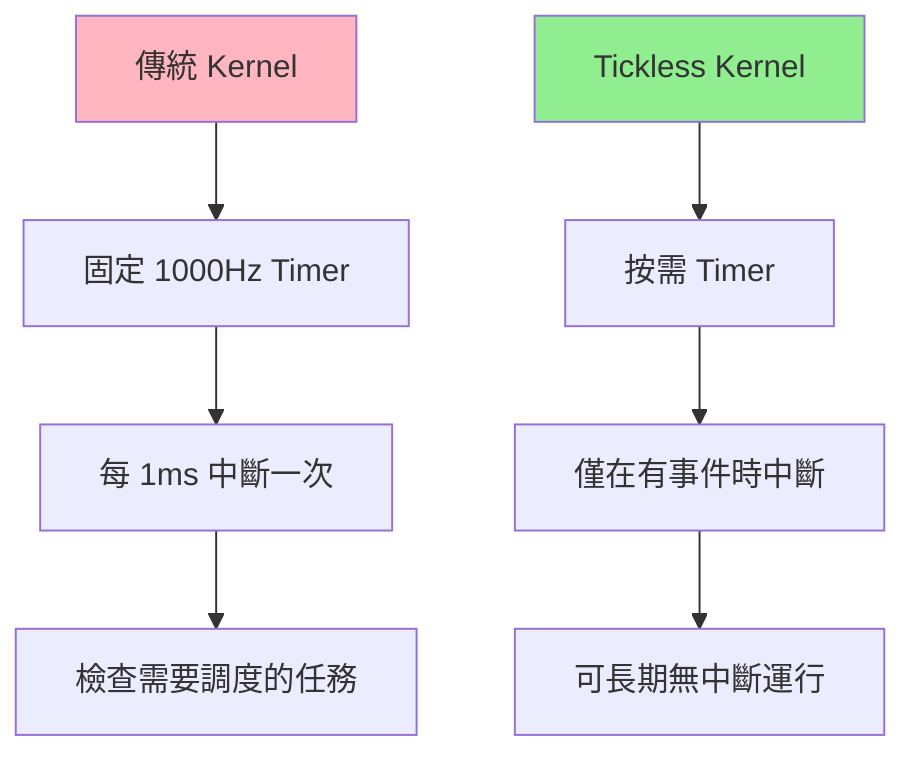

**配置範例**：
```bash
# /etc/default/grub
GRUB_CMDLINE_LINUX="isolcpus=2-7 nohz_full=2-7 rcu_nocbs=2-7"

# 重新生成 grub 配置
update-grub && reboot
```

**⚡ HFT 時間測量最佳實踐**
```cpp
// HFT 延遲測量框架
class LatencyMeasurement {
private:
    HighResolutionTimer timer;
    std::vector<uint64_t> samples;
    
public:
    class ScopeTimer {
        LatencyMeasurement& parent;
        uint64_t start_tsc;
        
    public:
        ScopeTimer(LatencyMeasurement& p) : parent(p) {
            start_tsc = parent.timer.rdtsc_ordered();
        }
        
        ~ScopeTimer() {
            uint64_t end_tsc = parent.timer.rdtsc_ordered();
            parent.samples.push_back(end_tsc - start_tsc);
        }
    };
    
    void print_statistics() const {
        if (samples.empty()) return;
        
        auto min_it = std::min_element(samples.begin(), samples.end());
        auto max_it = std::max_element(samples.begin(), samples.end());
        
        double sum = std::accumulate(samples.begin(), samples.end(), 0.0);
        double mean = sum / samples.size();
        
        // 計算百分位數
        auto sorted = samples;
        std::sort(sorted.begin(), sorted.end());
        
        printf("Latency Statistics (nanoseconds):\n");
        printf("  Samples: %zu\n", samples.size());
        printf("  Min: %.2f ns\n", timer.tsc_to_nanoseconds(*min_it));
        printf("  Max: %.2f ns\n", timer.tsc_to_nanoseconds(*max_it));
        printf("  Mean: %.2f ns\n", timer.tsc_to_nanoseconds(mean));
        printf("  P50: %.2f ns\n", timer.tsc_to_nanoseconds(sorted[samples.size()*0.5]));
        printf("  P99: %.2f ns\n", timer.tsc_to_nanoseconds(sorted[samples.size()*0.99]));
    }
};

// 使用範例
LatencyMeasurement latency_tracker;

void process_order() {
    LatencyMeasurement::ScopeTimer timer(latency_tracker);
    
    // HFT 關鍵邏輯
    // ...
    
}  // 析構時自動記錄延遲
```

---

## ⚡ 低延遲優化 (HFT 核心競爭力)

### H9: 什麼是 CPU 親和性？在 HFT 中如何設置 CPU 親和性和中斷綁定？

**難度**: 🔥🔥 | **重要度**: ⭐⭐⭐ | **面試頻率**: 極高

**📋 面試回答**

**CPU 親和性 (CPU Affinity)** 是將進程/線程綁定到特定 CPU 核心的技術。

**設置方法**：
```bash
# 將進程綁定到 CPU 2-3
taskset -cp 2-3 <pid>

# 啟動程式時設置親和性
taskset -c 2-3 ./hft_program
```

**性能優勢**：
- **Cache 局部性**: 避免在不同 CPU 間遷移造成的 Cache 失效
- **NUMA 優化**: 確保訪問本地記憶體節點
- **減少上下文切換**: 降低任務遷移開銷
- **可預測性**: 消除調度器的不確定性

**中斷親和性設置**：
```bash
# 將網卡中斷綁定到 CPU 0-1
echo 3 > /proc/irq/24/smp_affinity

# 將 HFT 應用綁定到 CPU 2-3
taskset -cp 2-3 <hft_pid>
```

**📚 概念詳解**

#### NUMA 架構與記憶體親和性

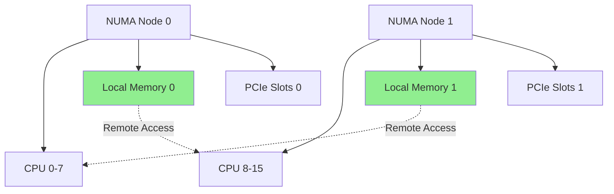

**記憶體訪問延遲**：
- **Local Memory**: 80-120ns
- **Remote Memory**: 140-300ns (2-3x 延遲)

#### CPU Cache 階層與共享

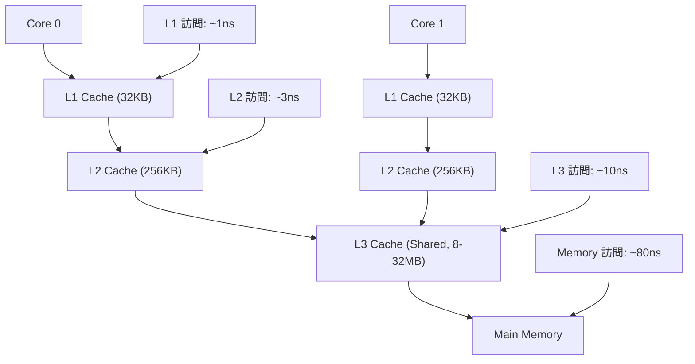

#### 進程遷移的開銷分析

```cpp
// CPU 親和性設置示例
#include <sched.h>
#include <pthread.h>

class CPUAffinity {
public:
    static bool set_thread_affinity(pthread_t thread, int cpu) {
        cpu_set_t cpuset;
        CPU_ZERO(&cpuset);
        CPU_SET(cpu, &cpuset);
        
        return pthread_setaffinity_np(thread, sizeof(cpuset), &cpuset) == 0;
    }
    
    static bool set_process_affinity(pid_t pid, const std::vector<int>& cpus) {
        cpu_set_t cpuset;
        CPU_ZERO(&cpuset);
        
        for (int cpu : cpus) {
            CPU_SET(cpu, &cpuset);
        }
        
        return sched_setaffinity(pid, sizeof(cpuset), &cpuset) == 0;
    }
    
    static int get_current_cpu() {
        return sched_getcpu();
    }
};
```

**⚡ HFT 最佳實踐**
```bash
#!/bin/bash
# HFT 系統 CPU 親和性設置腳本

# 1. 設置中斷親和性 (網卡中斷到 CPU 0-1)
echo 3 > /proc/irq/*/smp_affinity

# 2. 設置系統服務親和性
systemctl set-property --runtime system.slice AllowedCPUs=0-1

# 3. 設置 HFT 應用親和性 (CPU 2-7)
taskset -cp 2-7 $HFT_PID

# 4. 檢查 NUMA 拓樸
numactl --hardware
numactl --show
```

---

### H10: 無鎖編程是什麼？CAS 操作和 memory ordering 如何使用？

**難度**: 🔥🔥🔥 | **重要度**: ⭐⭐⭐ | **面試頻率**: 極高

**📋 面試回答**

**無鎖編程 (Lock-Free Programming)** 通過原子操作實現並發安全，避免傳統鎖的開銷和阻塞。

**核心原子操作**：
- **CAS** (Compare-And-Swap): 原子性的比較並交換
- **FAA** (Fetch-And-Add): 原子性的取值並加法
- **TAS** (Test-And-Set): 原子性的測試並設置

**記憶體排序 (Memory Ordering)**：
- `memory_order_relaxed`: 僅保證原子性，不保證順序
- `memory_order_acquire`: 獲取語義，防止後續讀寫重排到前面
- `memory_order_release`: 釋放語義，防止前面的讀寫重排到後面  
- `memory_order_seq_cst`: 順序一致性 (預設)

**📚 概念詳解**

#### CAS 操作的 ABA 問題

```cpp
// ABA 問題示例
std::atomic<Node*> head{nullptr};

void problematic_pop() {
    Node* old_head = head.load();
    if (old_head != nullptr) {
        Node* new_head = old_head->next;
        
        // 在這裡可能發生：
        // 1. 另一線程 pop A
        // 2. 另一線程 pop B  
        // 3. 另一線程 push A (相同指標!)
        
        if (head.compare_exchange_weak(old_head, new_head)) {
            // 成功，但 old_head 可能已被修改！
            delete old_head;  // 危險：可能是新的 A
        }
    }
}

// 解決方案：使用版本號或 Hazard Pointers
struct VersionedPointer {
    Node* ptr;
    uint64_t version;
};

std::atomic<VersionedPointer> head{{nullptr, 0}};
```

#### 記憶體排序詳解

```cpp
// 生產者-消費者無鎖佇列
template<typename T, size_t Size>
class LockFreeQueue {
private:
    std::array<T, Size> buffer;
    std::atomic<size_t> head{0};
    std::atomic<size_t> tail{0};
    
public:
    bool enqueue(const T& item) {
        size_t current_tail = tail.load(std::memory_order_relaxed);
        size_t next_tail = (current_tail + 1) % Size;
        
        if (next_tail == head.load(std::memory_order_acquire)) {
            return false;  // 隊列已滿
        }
        
        buffer[current_tail] = item;
        tail.store(next_tail, std::memory_order_release);
        return true;
    }
    
    bool dequeue(T& item) {
        size_t current_head = head.load(std::memory_order_relaxed);
        
        if (current_head == tail.load(std::memory_order_acquire)) {
            return false;  // 隊列為空
        }
        
        item = buffer[current_head];
        head.store((current_head + 1) % Size, std::memory_order_release);
        return true;
    }
};
```

#### 編譯器與 CPU 重排序

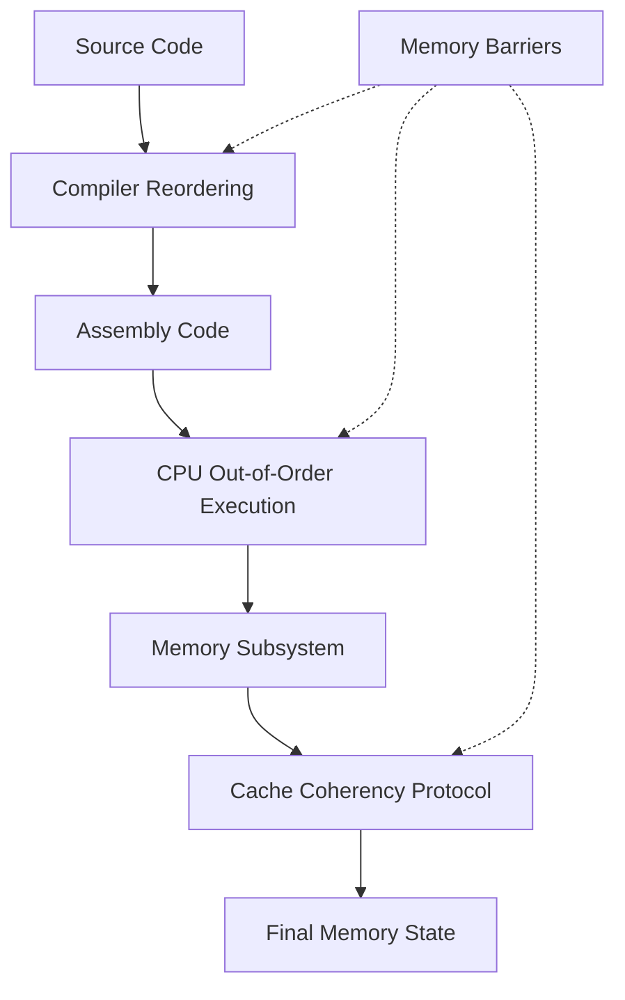

**記憶體屏障類型**：
- **LoadLoad**: 防止 Load 操作重排序
- **LoadStore**: 防止 Load-Store 重排序  
- **StoreStore**: 防止 Store 操作重排序
- **StoreLoad**: 防止 Store-Load 重排序 (最昂貴)

**⚡ HFT 無鎖數據結構**
```cpp
// 單生產者單消費者環形緩衝區 (SPSC)
template<typename T, size_t Capacity>
class SPSCQueue {
private:
    static constexpr size_t CACHE_LINE_SIZE = 64;
    
    alignas(CACHE_LINE_SIZE) std::array<T, Capacity> buffer;
    alignas(CACHE_LINE_SIZE) std::atomic<size_t> head{0};
    alignas(CACHE_LINE_SIZE) std::atomic<size_t> tail{0};
    
public:
    bool push(const T& item) {
        const size_t current_tail = tail.load(std::memory_order_relaxed);
        const size_t next_tail = (current_tail + 1) % Capacity;
        
        if (next_tail == head.load(std::memory_order_acquire)) {
            return false;  // 已滿
        }
        
        buffer[current_tail] = item;
        tail.store(next_tail, std::memory_order_release);
        return true;
    }
    
    bool pop(T& item) {
        const size_t current_head = head.load(std::memory_order_relaxed);
        
        if (current_head == tail.load(std::memory_order_acquire)) {
            return false;  // 為空
        }
        
        item = buffer[current_head];
        head.store((current_head + 1) % Capacity, std::memory_order_release);
        return true;
    }
};

// 使用示例：HFT 訂單處理
SPSCQueue<Order, 1024> order_queue;

// 生產者線程 (市場數據)
void market_data_thread() {
    Order order = parse_market_data();
    while (!order_queue.push(order)) {
        _mm_pause();  // CPU 自旋優化
    }
}

// 消費者線程 (策略引擎)
void strategy_thread() {
    Order order;
    if (order_queue.pop(order)) {
        process_order(order);
    }
}
```

---

### H11: 什麼是 False Sharing？如何避免它對 HFT 性能的影響？

**難度**: 🔥🔥🔥 | **重要度**: ⭐⭐⭐ | **面試頻率**: 高

**📋 面試回答**

**CPU Cache Line** 是 CPU 與記憶體間數據傳輸的基本單位：
- **大小**: 通常 64 字節 (x86/x64)
- **對齊**: 地址必須是 Cache Line 大小的倍數
- **局部性**: 時間局部性和空間局部性

**偽共享 (False Sharing)** 發生在多個 CPU 核心訪問同一 Cache Line 的不同部分：
- 造成不必要的 Cache Line 失效
- 導致嚴重的性能下降 (可能降低 10-100x)
- 需要通過數據結構對齊和填充來避免

**避免偽共享的方法**：
```cpp
struct alignas(64) AlignedData {  // 強制 64 字節對齊
    std::atomic<int> counter;
    char padding[64 - sizeof(std::atomic<int>)];  // 填充至 Cache Line 邊界
};
```

**📚 概念詳解**

#### Cache 階層與延遲

| Cache Level | 大小 | 延遲 | 頻寬 | 共享範圍 |
|-------------|------|------|------|----------|
| **L1D** | 32KB | 1-2 cycles (~0.3ns) | 800GB/s | 單核心 |
| **L1I** | 32KB | 1-2 cycles (~0.3ns) | 400GB/s | 單核心 |
| **L2** | 256KB-1MB | 3-8 cycles (~1-3ns) | 400GB/s | 單核心 |
| **L3** | 8-32MB | 10-50 cycles (~3-15ns) | 200GB/s | 多核心共享 |
| **DRAM** | 8-128GB | 200-400 cycles (~80-150ns) | 50GB/s | 全系統 |

#### MESI Cache 一致性協議

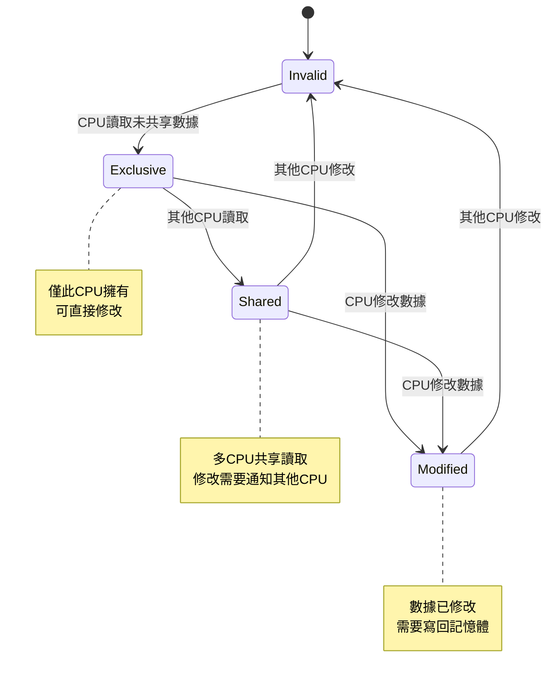

#### 偽共享性能影響測試

```cpp
// 偽共享測試程式
#include <chrono>
#include <thread>
#include <atomic>

struct FalseSharing {
    std::atomic<long> counter1{0};
    std::atomic<long> counter2{0};  // 與 counter1 在同一 Cache Line
};

struct NoFalseSharing {
    alignas(64) std::atomic<long> counter1{0};
    alignas(64) std::atomic<long> counter2{0};  // 在不同 Cache Line
};

template<typename T>
void benchmark(T& data, const char* name) {
    constexpr int iterations = 10000000;
    
    auto start = std::chrono::high_resolution_clock::now();
    
    std::thread t1([&]() {
        for (int i = 0; i < iterations; ++i) {
            data.counter1.fetch_add(1, std::memory_order_relaxed);
        }
    });
    
    std::thread t2([&]() {
        for (int i = 0; i < iterations; ++i) {
            data.counter2.fetch_add(1, std::memory_order_relaxed);
        }
    });
    
    t1.join();
    t2.join();
    
    auto end = std::chrono::high_resolution_clock::now();
    auto duration = std::chrono::duration_cast<std::chrono::milliseconds>(end - start);
    
    std::printf("%s: %ld ms\n", name, duration.count());
}

// 典型結果：
// False Sharing: 2500 ms
// No False Sharing: 250 ms (10x 性能提升)
```

#### Cache 友好的數據結構設計

```cpp
// HFT 訂單簿的 Cache 優化設計
class OptimizedOrderBook {
private:
    // 將頻繁訪問的數據放在一起
    struct alignas(64) HotData {
        std::atomic<double> best_bid{0.0};
        std::atomic<double> best_ask{0.0};
        std::atomic<uint64_t> sequence{0};
        char padding[64 - 3 * 8];  // 確保對齊
    } hot_data;
    
    // 冷數據分離存放
    struct ColdData {
        std::string symbol;
        std::chrono::time_point<std::chrono::steady_clock> last_update;
        std::vector<PriceLevel> bid_levels;
        std::vector<PriceLevel> ask_levels;
    } cold_data;
    
public:
    // 熱路徑函數：僅訪問熱數據
    double get_mid_price() const {
        return (hot_data.best_bid.load() + hot_data.best_ask.load()) / 2.0;
    }
    
    // 冷路徑函數：訪問完整數據
    void print_full_book() const {
        // 訪問 cold_data...
    }
};
```

**⚡ Cache 優化技巧**
```cpp
// 1. 數據預取
void prefetch_data(const void* addr) {
    __builtin_prefetch(addr, 0, 3);  // 預取到 L1 Cache
}

// 2. 批次處理減少 Cache Miss
void process_orders_batched(const std::vector<Order>& orders) {
    constexpr size_t BATCH_SIZE = 64;  // 一個 Cache Line 的大小
    
    for (size_t i = 0; i < orders.size(); i += BATCH_SIZE) {
        size_t end = std::min(i + BATCH_SIZE, orders.size());
        
        // 預取下一批數據
        if (end < orders.size()) {
            prefetch_data(&orders[end]);
        }
        
        // 處理當前批次
        for (size_t j = i; j < end; ++j) {
            process_single_order(orders[j]);
        }
    }
}

// 3. 結構體成員重排序優化
struct OptimizedOrder {
    // 熱數據放在前面（頻繁訪問）
    double price;           // 8 bytes
    uint64_t quantity;      // 8 bytes  
    uint32_t order_id;      // 4 bytes
    OrderType type;         // 4 bytes
    // 第一個 Cache Line: 24 bytes
    
    // 冷數據放在後面
    std::string symbol;     // 可能很大
    std::chrono::time_point<std::chrono::steady_clock> timestamp;
    // ...其他較少訪問的欄位
};
```

---

### H12: 在 NUMA 架構的服務器上，HFT 系統如何優化記憶體訪問？

**難度**: 🔥🔥🔥 | **重要度**: ⭐⭐ | **面試頻率**: 中

**📋 面試回答**

**NUMA** (Non-Uniform Memory Access) 是多處理器系統的記憶體架構：
- 每個 CPU 節點擁有本地記憶體
- 訪問本地記憶體速度快，訪問遠程記憶體速度慢
- 本地記憶體訪問：~80ns，遠程記憶體訪問：~140-300ns (2-3倍延遲)

**NUMA 親和性設置**：
```bash
# 檢查 NUMA 拓樸
numactl --hardware

# 將進程綁定到節點 0 的 CPU 和記憶體
numactl --cpunodebind=0 --membind=0 ./hft_program

# 查看進程的 NUMA 統計
numastat -p <pid>
```

**HFT 中的重要性**：
- 記憶體訪問延遲直接影響延遲
- 跨節點訪問會造成不可預測的性能抖動
- 需要確保數據局部性

**📚 概念詳解**

#### NUMA 架構詳解

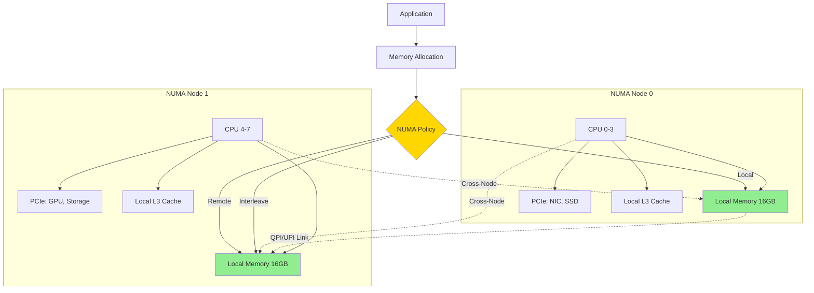

**⚡ HFT NUMA 最佳實踐**
```bash
#!/bin/bash
# HFT NUMA 優化腳本

# 1. 檢查 NUMA 拓樸
echo "=== NUMA Topology ==="
lscpu | grep NUMA
numactl --hardware

# 2. 設置 NUMA 平衡策略
echo 0 > /proc/sys/kernel/numa_balancing

# 3. 啟動 HFT 應用的 NUMA 優化
# 將策略引擎綁定到節點 0
numactl --cpunodebind=0 --membind=0 ./strategy_engine &

# 將市場數據處理綁定到節點 1
numactl --cpunodebind=1 --membind=1 ./market_data_handler &

# 4. 監控和驗證
watch -n 1 'numastat -p $(pgrep strategy_engine)'
```

---

### H13: 為什麼 HFT 系統要避免使用 malloc/free？如何實現記憶體池？

**難度**: 🔥🔥 | **重要度**: ⭐⭐⭐ | **面試頻率**: 極高

**📋 面試回答**

**為什麼 HFT 避免 `malloc/free`**：
- **分配延遲**: `malloc` 可能需要 100-1000ns，具不確定性
- **記憶體碎片**: 頻繁分配/釋放造成碎片，影響 Cache 性能
- **系統調用開銷**: 大型分配可能觸發 `mmap/brk` 系統調用
- **鎖競爭**: glibc malloc 在多線程環境下有全局鎖

**記憶體池優勢**：
- **預測性**: 分配時間固定，通常 <10ns
- **Cache 友好**: 連續記憶體佈局，提高空間局部性
- **無碎片**: 固定大小塊分配，避免外部碎片
- **無鎖設計**: 可實現無鎖分配器

**📚 概念詳解**

#### 高性能記憶體池實現

```cpp
// 固定大小塊分配器 (適用於訂單、價格等固定大小對象)
template<size_t BlockSize, size_t BlockCount>
class FixedSizePool {
private:
    static constexpr size_t ALIGNMENT = 64;  // Cache line 對齊
    static constexpr size_t ALIGNED_BLOCK_SIZE = 
        (BlockSize + ALIGNMENT - 1) & ~(ALIGNMENT - 1);
    
    alignas(64) char memory_pool[ALIGNED_BLOCK_SIZE * BlockCount];
    
    struct FreeBlock {
        FreeBlock* next;
    };
    
    FreeBlock* free_list;
    std::atomic<size_t> allocated_count{0};
    
public:
    FixedSizePool() {
        // 初始化空閒連結串列
        free_list = reinterpret_cast<FreeBlock*>(memory_pool);
        
        for (size_t i = 0; i < BlockCount - 1; ++i) {
            char* current_block = memory_pool + i * ALIGNED_BLOCK_SIZE;
            char* next_block = memory_pool + (i + 1) * ALIGNED_BLOCK_SIZE;
            
            reinterpret_cast<FreeBlock*>(current_block)->next = 
                reinterpret_cast<FreeBlock*>(next_block);
        }
        
        // 最後一個塊指向 nullptr
        char* last_block = memory_pool + (BlockCount - 1) * ALIGNED_BLOCK_SIZE;
        reinterpret_cast<FreeBlock*>(last_block)->next = nullptr;
    }
    
    void* allocate() {
        if (!free_list) {
            return nullptr;  // 池已滿
        }
        
        void* result = free_list;
        free_list = free_list->next;
        allocated_count.fetch_add(1, std::memory_order_relaxed);
        
        return result;
    }
    
    void deallocate(void* ptr) {
        if (!ptr) return;
        
        FreeBlock* block = static_cast<FreeBlock*>(ptr);
        block->next = free_list;
        free_list = block;
        allocated_count.fetch_sub(1, std::memory_order_relaxed);
    }
};
```

**⚡ 記憶體池性能對比**
```cpp
void benchmark_pools() {
    const int iterations = 1000000;
    FixedSizePool<64, 100000> pool;
    
    // 測試記憶體池分配
    auto start = std::chrono::high_resolution_clock::now();
    std::vector<void*> pool_ptrs;
    pool_ptrs.reserve(iterations);
    
    for (int i = 0; i < iterations; ++i) {
        pool_ptrs.push_back(pool.allocate());
    }
    
    auto end = std::chrono::high_resolution_clock::now();
    auto duration = std::chrono::duration_cast<std::chrono::nanoseconds>(end - start);
    
    std::printf("Pool allocate avg: %ldns\n", duration.count() / iterations);
    
    // 典型結果對比：
    // malloc:     150-800ns (不穩定)
    // Pool:       5-15ns (穩定)
    // 性能提升：  10-50倍
}
```

---

## 🔧 系統調優 (HFT 生產環境必備)

### H14: 如何配置 Linux 內核參數來優化 HFT 系統？

**難度**: 🔥🔥 | **重要度**: ⭐⭐⭐ | **面試頻率**: 高

**📋 面試回答**

**關鍵內核參數**：
```bash
# CPU 隔離和 Tickless
isolcpus=2-7              # 隔離 CPU 2-7
nohz_full=2-7             # 禁用定時器中斷
rcu_nocbs=2-7             # RCU 回調處理移至其他 CPU

# 記憶體管理
transparent_hugepage=never    # 禁用透明大頁面
vm.swappiness=1              # 盡量避免使用 swap

# 網路優化
net.core.busy_poll=1         # 啟用網路輪詢
net.core.busy_read=1         # 啟用讀取輪詢
```

**CPU 調度優化**：
```bash
# 設置實時調度
chrt -f -p 90 <pid>          # SCHED_FIFO，優先級 90

# CPU Governor
echo performance > /sys/devices/system/cpu/cpu*/cpufreq/scaling_governor
```

**📚 概念詳解**

#### 完整的 HFT 系統調優腳本

```bash
#!/bin/bash
# HFT 生產環境調優腳本

echo "=== HFT System Optimization ==="

# 1. CPU 優化
echo "Configuring CPU settings..."
echo performance > /sys/devices/system/cpu/cpu*/cpufreq/scaling_governor
echo 1 > /sys/devices/system/cpu/intel_pstate/no_turbo  # 禁用 Turbo Boost

# 2. 記憶體優化
echo "Configuring memory settings..."
echo 1 > /proc/sys/vm/swappiness
echo never > /sys/kernel/mm/transparent_hugepage/enabled
echo never > /sys/kernel/mm/transparent_hugepage/defrag

# 3. 中斷優化
echo "Configuring interrupt handling..."
systemctl stop irqbalance
echo 1 > /proc/irq/*/smp_affinity  # 中斷綁定到 CPU 0

# 4. 網路優化
echo "Configuring network settings..."
echo 1 > /sys/class/net/eth0/napi_defer_hard_irqs
echo 200000 > /sys/class/net/eth0/gro_flush_timeout

# 5. 驗證配置
echo "Verifying configuration..."
cat /proc/cmdline
lscpu | grep -E "(CPU|Model|Thread|Core)"
```

**⚡ 性能驗證**
```bash
# 延遲測試
cyclictest -p 99 -t1 -n -i 1000 -d 0

# CPU 親和性驗證
taskset -pc $$

# NUMA 配置檢查
numactl --show
```

---

### H15: 用什麼工具來監控和分析 HFT 系統的性能？

**難度**: 🔥🔥 | **重要度**: ⭐⭐ | **面試頻率**: 中

**📋 面試回答**

**系統級監控工具**：
```bash
# CPU 和 Cache 分析
perf stat -e cycles,instructions,cache-misses,cache-references ./hft_program

# 延遲分析
perf record -g ./hft_program
perf report --stdio

# 記憶體分析  
vmstat 1               # 記憶體使用統計
numastat -p <pid>      # NUMA 統計
```

**HFT 專用監控**：
```bash
# 網路延遲
ping -i 0.001 <target>     # 微秒級 ping
ss -i                      # Socket 統計

# 系統調用追蹤
strace -c ./hft_program    # 統計系統調用
```

**實時性分析**：
```bash
# Jitter 測試
cyclictest -p 99 -t1 -n -i 1000

# 中斷統計
cat /proc/interrupts
watch -n 1 'cat /proc/interrupts | head -20'
```

**📚 概念詳解**

#### HFT 性能監控儀表板

```cpp
// HFT 性能指標收集
class HFTPerformanceMonitor {
private:
    struct Metrics {
        std::atomic<uint64_t> orders_processed{0};
        std::atomic<uint64_t> total_latency_ns{0};
        std::atomic<uint64_t> max_latency_ns{0};
        std::atomic<uint64_t> cache_misses{0};
        
        // 延遲分布
        std::array<std::atomic<uint64_t>, 10> latency_buckets{};
    } metrics;
    
public:
    void record_latency(uint64_t latency_ns) {
        metrics.orders_processed.fetch_add(1, std::memory_order_relaxed);
        metrics.total_latency_ns.fetch_add(latency_ns, std::memory_order_relaxed);
        
        // 更新最大延遲
        uint64_t current_max = metrics.max_latency_ns.load(std::memory_order_relaxed);
        while (latency_ns > current_max) {
            if (metrics.max_latency_ns.compare_exchange_weak(current_max, latency_ns)) {
                break;
            }
        }
        
        // 更新延遲分布
        update_latency_bucket(latency_ns);
    }
    
    void print_statistics() const {
        uint64_t total_orders = metrics.orders_processed.load();
        if (total_orders == 0) return;
        
        uint64_t avg_latency = metrics.total_latency_ns.load() / total_orders;
        
        std::printf("HFT Performance Statistics:\n");
        std::printf("  Total Orders: %lu\n", total_orders);
        std::printf("  Average Latency: %lu ns\n", avg_latency);
        std::printf("  Maximum Latency: %lu ns\n", metrics.max_latency_ns.load());
        
        // 打印延遲分布
        print_latency_distribution();
    }
};
```

**⚡ 自動化監控腳本**
```bash
#!/bin/bash
# HFT 系統自動監控

while true; do
    echo "=== $(date) ==="
    
    # CPU 使用率
    mpstat 1 1 | tail -1
    
    # 記憶體使用
    free -h
    
    # 網路統計
    ss -s
    
    # HFT 進程狀態
    ps -p $HFT_PID -o pid,ppid,psr,pcpu,pmem,time,comm
    
    # 延遲檢查
    ping -c 1 -i 0.001 $EXCHANGE_IP | tail -1
    
    echo "===================="
    sleep 5
done
```

---

## 🚨 故障排除 (生產環境實戰)

### H16: HFT 系統突然出現延遲尖峰，你會如何診斷？

**難度**: 🔥🔥 | **重要度**: ⭐⭐⭐ | **面試頻率**: 高

**📋 面試回答**

**診斷步驟** (按優先級順序)：

1. **檢查系統資源**
```bash
# CPU 使用率和負載
top -p <hft_pid>
cat /proc/loadavg

# 記憶體使用
cat /proc/<pid>/status | grep -E "(VmSize|VmRSS|VmSwap)"
```

2. **檢查網路狀況**
```bash
# 網路延遲
ping -c 100 -i 0.001 <exchange_ip>

# 網路統計
ss -s
ethtool -S eth0 | grep -E "(drop|error|miss)"
```

3. **檢查系統事件**
```bash
# 內核消息
dmesg | tail -20

# 中斷統計
cat /proc/interrupts
```

4. **應用級分析**
```bash
# 系統調用追蹤
strace -p <pid> -c

# 性能分析
perf top -p <pid>
```

**📚 概念詳解**

#### 延遲尖峰的常見原因

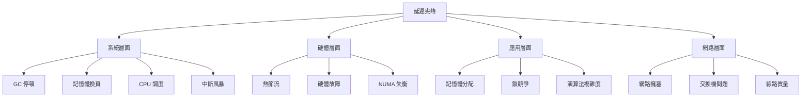

**⚡ 緊急響應清單**
```bash
#!/bin/bash
# HFT 延遲尖峰緊急診斷腳本

echo "=== HFT LATENCY SPIKE DIAGNOSIS ==="
echo "Time: $(date)"
echo "======================================"

# 1. 快速系統檢查
echo "1. System Overview:"
uptime
free -h
df -h

# 2. HFT 進程狀態
echo "2. HFT Process Status:"
ps aux | grep hft
cat /proc/$(pgrep hft_trading)/status | head -20

# 3. 網路延遲檢查
echo "3. Network Latency:"
ping -c 5 -i 0.001 $EXCHANGE_IP

# 4. 系統事件
echo "4. Recent System Events:"
dmesg | tail -10
journalctl -n 10

# 5. 性能熱點
echo "5. Performance Hotspots:"
perf top -p $(pgrep hft_trading) --duration=5

echo "======================================"
echo "Diagnosis completed at $(date)"
```

---

### H17: 如何檢測和消除系統 Jitter？

**難度**: 🔥🔥 | **重要度**: ⭐⭐⭐ | **面試頻率**: 高

**📋 面試回答**

**什麼是 Jitter**：
- 延遲的不一致性或變動
- 在 HFT 中，即使平均延遲低，高 Jitter 也是不可接受的
- 需要延遲的**可預測性**，而不只是低平均值

**Jitter 檢測方法**：
```bash
# 使用 cyclictest 檢測調度 Jitter
cyclictest -p 99 -t1 -n -i 1000 -l 100000

# 網路 Jitter 檢測
ping -i 0.001 -c 10000 <target> | tail -1

# 自定義 Jitter 測試
./jitter_test --iterations=1000000 --interval=1ms
```

**Jitter 來源**：
- **中斷處理**: 不可預測的中斷時機
- **記憶體管理**: 頁面換頁、GC 等
- **CPU 調度**: 非實時調度策略
- **硬體特性**: CPU 頻率調整、熱節流

**📚 概念詳解**

#### Jitter 優化策略

**系統級優化**：
```bash
#!/bin/bash
# Anti-Jitter 系統配置

# 1. CPU 頻率固定
echo performance > /sys/devices/system/cpu/cpu*/cpufreq/scaling_governor
echo 1 > /sys/devices/system/cpu/intel_pstate/no_turbo

# 2. 禁用 C-States (CPU 睡眠狀態)
cpupower idle-set -D 0  # 禁用深度睡眠

# 3. 中斷優化
echo 1 > /proc/irq/*/smp_affinity  # 集中中斷處理
systemctl stop irqbalance

# 4. 記憶體優化
echo 1 > /proc/sys/vm/swappiness           # 最小化 swap
echo never > /sys/kernel/mm/transparent_hugepage/enabled

# 5. 調度器優化  
echo 0 > /proc/sys/kernel/sched_rt_runtime_us  # 無限制實時調度
```

**⚡ Jitter 評級標準**
- **優秀**: Jitter < 100ns
- **良好**: Jitter < 500ns  
- **可接受**: Jitter < 1000ns
- **需優化**: Jitter > 1000ns

---

### H18: 當 HFT 系統性能突然下降時，如何進行根因分析？

**難度**: 🔥🔥 | **重要度**: ⭐⭐⭐ | **面試頻率**: 高

**📋 面試回答**

**系統性分析方法** (USE 方法)：
- **Utilization**: 資源使用率
- **Saturation**: 資源飽和度  
- **Errors**: 錯誤率

**分析流程**：
1. **定量化問題**: 延遲從 X μs 增加到 Y μs
2. **時間定位**: 問題開始的具體時間點
3. **範圍確定**: 影響的組件和服務範圍
4. **根因定位**: 透過工具和日誌找出根本原因

**常用診斷工具組合**：
```bash
# 系統概覽
htop, iostat, vmstat

# 網路分析
ss, netstat, tcpdump

# 應用分析  
perf, strace, gdb

# 日誌分析
journalctl, dmesg, /var/log/*
```

**📚 概念詳解**

#### 性能下降的系統性診斷

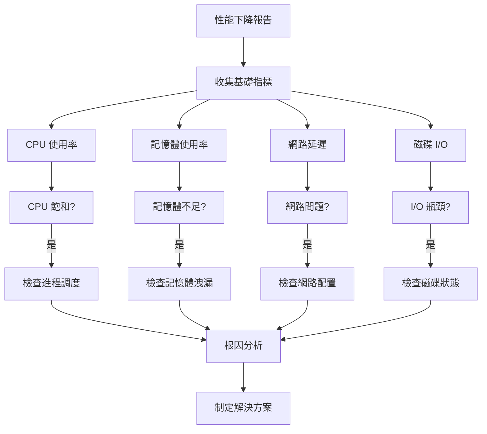

**⚡ 應急響應清單**
```bash
#!/bin/bash
# HFT 性能下降應急響應腳本

echo "=== HFT PERFORMANCE DEGRADATION EMERGENCY RESPONSE ==="
echo "Timestamp: $(date)"

# 1. 立即收集關鍵指標
echo "1. CRITICAL METRICS:"
echo "   CPU: $(top -bn1 | grep "Cpu(s)" | awk '{print $2}' | cut -d'%' -f1)%"
echo "   Memory: $(free | awk 'FNR==2{printf "%.1f%%", $3/($3+$4)*100}')"
echo "   Load: $(cat /proc/loadavg)"

# 2. HFT 應用狀態
echo "2. HFT APPLICATION STATUS:"
HFT_PID=$(pgrep hft_trading)
if [ -n "$HFT_PID" ]; then
    echo "   PID: $HFT_PID"
    echo "   CPU: $(ps -p $HFT_PID -o %cpu --no-headers)%"
    echo "   Memory: $(ps -p $HFT_PID -o %mem --no-headers)%"
    echo "   Threads: $(ps -p $HFT_PID -o nlwp --no-headers)"
else
    echo "   ❌ HFT process not found!"
fi

# 3. 網路狀態快速檢查
echo "3. NETWORK STATUS:"
ping -c 3 -i 0.1 $EXCHANGE_IP | tail -1

# 4. 系統事件
echo "4. RECENT EVENTS:"
dmesg | tail -5
journalctl --since="5 minutes ago" -n 5

# 5. 建議動作
echo "5. RECOMMENDED ACTIONS:"
echo "   □ Restart HFT application if necessary"
echo "   □ Check exchange connectivity"  
echo "   □ Verify system resource availability"
echo "   □ Review recent configuration changes"

echo "============================================="
```

---

## 參考資料 (References)

1. [Linux Performance Tools](http://www.brendangregg.com/linuxperf.html) - Brendan Gregg
2. 《Systems Performance: Enterprise and the Cloud》 - Brendan Gregg, 2020
3. [Intel 64 and IA-32 Architectures Optimization Reference Manual](https://software.intel.com/content/www/us/en/develop/articles/intel-sdm.html)
4. [DPDK Programming Guide](https://doc.dpdk.org/guides/prog_guide/) - Data Plane Development Kit
5. 《Understanding the Linux Kernel》 - Daniel Bovet & Marco Cesati, 2005
6. [Real-Time Linux Wiki](https://rt.wiki.kernel.org/index.php/Main_Page)
7. [High Frequency Trading and Market Microstructure](https://papers.ssrn.com/sol3/papers.cfm?abstract_id=1722924)
8. 《C++ Concurrency in Action》 - Anthony Williams, 2019
9. [NUMA Best Practices](https://software.intel.com/content/www/us/en/develop/articles/optimizing-applications-for-numa.html) - Intel
10. [Linux Kernel Development](https://www.kernel.org/doc/html/latest/) - Kernel Documentation