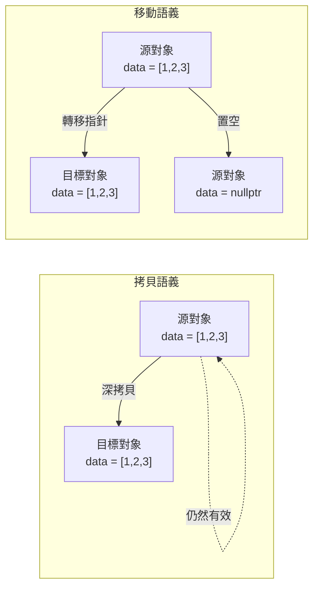
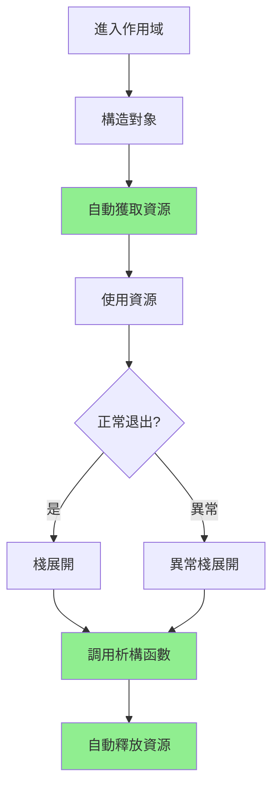
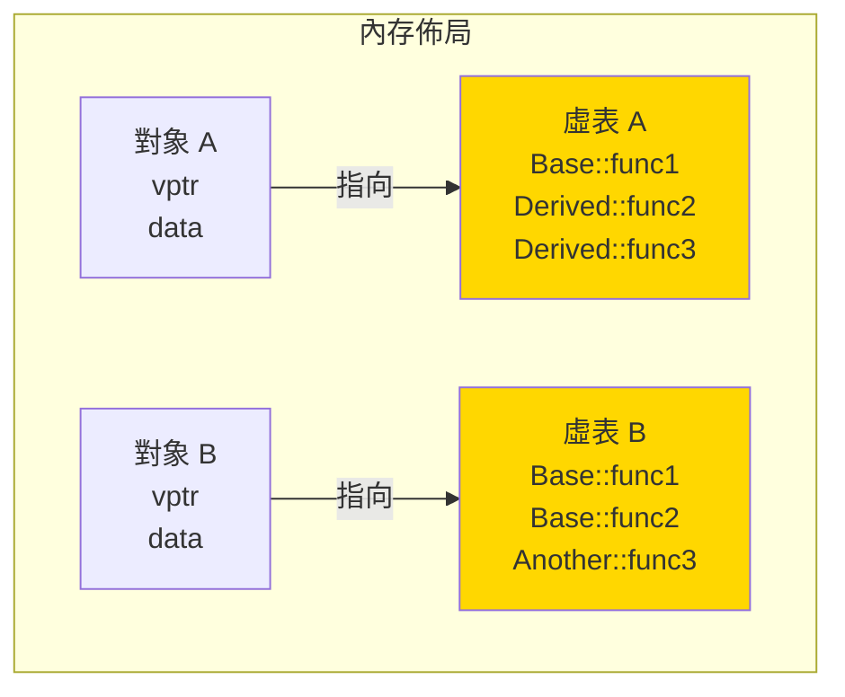
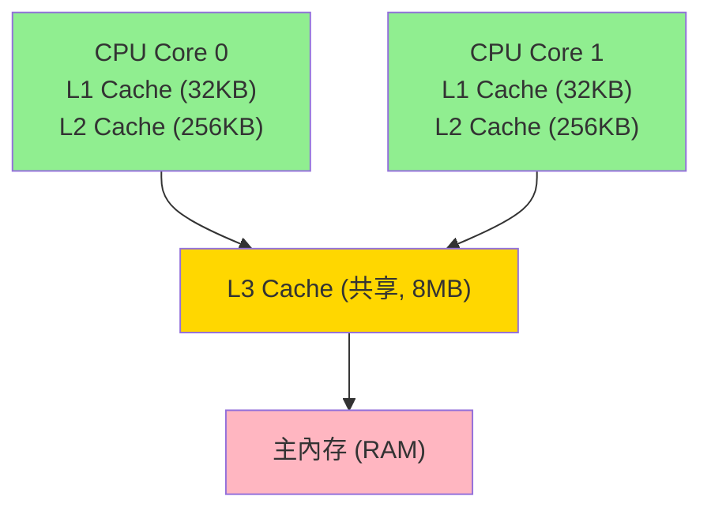

# HFT C++ 面試問題集

> **使用說明**: 🔥 表示難度, ⭐ 表示重要度  
> - 難度: 無符號 (基礎) → 🔥🔥🔥 (專家)  
> - 重要度: 無符號 (了解即可) → ⭐⭐⭐ (必須精通)

---

## 目錄

### 語言核心特性
- [C1: Move 語義與右值引用](#c1-move-語義與右值引用) 🔥🔥 ⭐⭐⭐
- [C2: RAII 資源管理](#c2-raii-資源管理) 🔥 ⭐⭐⭐
- [C3: 虛函數底層實現](#c3-虛函數底層實現) 🔥🔥 ⭐⭐⭐
- [C4: 智能指針選擇](#c4-智能指針選擇) 🔥 ⭐⭐⭐
- [C5: constexpr 編譯期計算](#c5-constexpr-編譯期計算) 🔥🔥 ⭐⭐
- [C6: static 關鍵字](#c6-static-關鍵字) 🔥 ⭐⭐
- [C7: Lambda 表達式與捕獲](#c7-lambda-表達式與捕獲) 🔥 ⭐⭐

### 性能與內存優化
- [C8: Cache Line 對齊與 False Sharing](#c8-cache-line-對齊與-false-sharing) 🔥🔥🔥 ⭐⭐⭐
- [C9: 自定義內存池](#c9-自定義內存池) 🔥🔥🔥 ⭐⭐⭐
- [C10: Placement New](#c10-placement-new) 🔥🔥 ⭐⭐
- [C11: 棧與堆分配](#c11-棧與堆分配) 🔥 ⭐⭐⭐
- [C12: 數據局部性優化](#c12-數據局部性優化) 🔥🔥 ⭐⭐⭐
- [C13: 序列化方案選擇](#c13-序列化方案選擇) 🔥🔥 ⭐⭐

### 併發與多線程
- [C14: 自旋鎖 vs 互斥鎖](#c14-自旋鎖-vs-互斥鎖) 🔥🔥 ⭐⭐⭐
- [C15: 死鎖與活鎖](#c15-死鎖與活鎖) 🔥 ⭐⭐
- [C16: 讀寫鎖](#c16-讀寫鎖) 🔥 ⭐⭐
- [C17: std::atomic 原子操作](#c17-stdatomic-原子操作) 🔥🔥 ⭐⭐⭐
- [C18: CAS 操作](#c18-cas-操作) 🔥🔥 ⭐⭐⭐
- [C19: Memory Ordering](#c19-memory-ordering) 🔥🔥🔥 ⭐⭐⭐
- [C20: 無鎖隊列](#c20-無鎖隊列) 🔥🔥🔥 ⭐⭐⭐

### 編譯與優化
- [C21: 編譯器優化選項](#c21-編譯器優化選項) 🔥 ⭐⭐
- [C22: inline 關鍵字](#c22-inline-關鍵字) 🔥 ⭐⭐
- [C23: volatile vs atomic](#c23-volatile-vs-atomic) 🔥🔥 ⭐⭐⭐
- [C24: 為何避免異常](#c24-為何避免異常) 🔥🔥 ⭐⭐⭐

---

## 🎯 語言核心特性

### C1: Move 語義與右值引用

**難度**: 🔥🔥 | **重要度**: ⭐⭐⭐ | **面試頻率**: 極高

**📋 面試回答**

**Move 語義 (Move Semantics)** 是 C++11 引入的核心特性，通過**右值引用 (Rvalue Reference)** 實現資源的高效轉移，避免不必要的深拷貝。

**核心概念**：

1. **左值 (Lvalue)** vs **右值 (Rvalue)**
   - 左值：有名字、可取地址的對象（如變量）
   - 右值：臨時對象、字面量、表達式結果

2. **右值引用**：`T&&`
   - 只能綁定到右值
   - 允許修改臨時對象

3. **移動操作**：
   - 移動構造函數：`T(T&& other) noexcept`
   - 移動賦值運算符：`T& operator=(T&& other) noexcept`

**HFT 中的應用**：
- **避免深拷貝**：訂單對象轉移（複製開銷可達數百納秒）
- **容器優化**：`std::vector` 擴容時移動元素而非複製
- **返回值優化**：大對象返回時零成本

**📚 概念詳解**

#### 什麼是 Move 語義？

**生活化比喻**：搬家

**拷貝語義 (Copy)**：
- 把舊家的所有東西複製一份搬到新家
- 舊家的東西還在
- 開銷大（需要複製所有物品）

**移動語義 (Move)**：
- 把舊家的所有東西直接搬到新家
- 舊家變成空的
- 開銷小（只需要轉移所有權）



#### 技術實現

```cpp
// 簡單的動態數組類
class DynamicArray {
private:
    int* data_;
    size_t size_;

public:
    // 構造函數
    DynamicArray(size_t size) : size_(size) {
        data_ = new int[size_];
        std::cout << "Constructor: allocated " << size_ << " ints\n";
    }

    // ❌ 拷貝構造函數（深拷貝，開銷大）
    DynamicArray(const DynamicArray& other) : size_(other.size_) {
        data_ = new int[size_];
        std::memcpy(data_, other.data_, size_ * sizeof(int));
        std::cout << "Copy Constructor: deep copy of " << size_ << " ints\n";
    }

    // ✅ 移動構造函數（轉移所有權，開銷小）
    DynamicArray(DynamicArray&& other) noexcept 
        : data_(other.data_), size_(other.size_) {
        // 轉移資源
        other.data_ = nullptr;
        other.size_ = 0;
        std::cout << "Move Constructor: transferred ownership\n";
    }

    // ❌ 拷貝賦值運算符
    DynamicArray& operator=(const DynamicArray& other) {
        if (this != &other) {
            delete[] data_;
            size_ = other.size_;
            data_ = new int[size_];
            std::memcpy(data_, other.data_, size_ * sizeof(int));
            std::cout << "Copy Assignment: deep copy of " << size_ << " ints\n";
        }
        return *this;
    }

    // ✅ 移動賦值運算符
    DynamicArray& operator=(DynamicArray&& other) noexcept {
        if (this != &other) {
            delete[] data_;
            // 轉移資源
            data_ = other.data_;
            size_ = other.size_;
            // 清空源對象
            other.data_ = nullptr;
            other.size_ = 0;
            std::cout << "Move Assignment: transferred ownership\n";
        }
        return *this;
    }

    // 析構函數
    ~DynamicArray() {
        delete[] data_;
        if (size_ > 0) {
            std::cout << "Destructor: freed memory\n";
        }
    }
};
```

#### 左值與右值的區別

```cpp
int x = 10;           // x 是左值（有名字、可取地址）
int& lref = x;        // 左值引用（綁定到左值）
int&& rref = 10;      // 右值引用（綁定到右值 10）
int&& rref2 = x + 5;  // 右值引用（綁定到表達式結果）

// 錯誤示例
// int&& rref3 = x;   // ❌ 錯誤：右值引用不能綁定到左值

// 使用 std::move 將左值轉換為右值
int&& rref3 = std::move(x);  // ✅ 正確
```

**std::move 的作用**：
```cpp
// std::move 的簡化實現
template<typename T>
typename std::remove_reference<T>::type&& move(T&& arg) noexcept {
    return static_cast<typename std::remove_reference<T>::type&&>(arg);
}

// 它只是一個類型轉換，不做任何實際操作
// 將左值轉換為右值引用，從而觸發移動語義
```

**⚡ HFT 實踐**

```cpp
// HFT 訂單對象
struct Order {
    char symbol[16];           // 股票代碼
    char side;                 // 'B' or 'S'
    uint32_t quantity;         // 數量
    uint64_t price;            // 價格
    std::vector<char> metadata; // 可變長度的元數據
    
    // 移動構造函數
    Order(Order&& other) noexcept
        : side(other.side),
          quantity(other.quantity),
          price(other.price),
          metadata(std::move(other.metadata)) {  // 移動 vector
        std::memcpy(symbol, other.symbol, sizeof(symbol));
    }
    
    // 移動賦值運算符
    Order& operator=(Order&& other) noexcept {
        if (this != &other) {
            side = other.side;
            quantity = other.quantity;
            price = other.price;
            std::memcpy(symbol, other.symbol, sizeof(symbol));
            metadata = std::move(other.metadata);  // 移動 vector
        }
        return *this;
    }
};

// 性能對比
void benchmark_move_vs_copy() {
    const int ITERATIONS = 1000000;
    
    // 測試 1: 拷貝語義
    {
        auto start = std::chrono::high_resolution_clock::now();
        
        std::vector<Order> orders;
        for (int i = 0; i < ITERATIONS; i++) {
            Order order;
            order.metadata.resize(1024);  // 1KB 元數據
            orders.push_back(order);      // 拷貝
        }
        
        auto end = std::chrono::high_resolution_clock::now();
        auto duration = std::chrono::duration_cast<std::chrono::microseconds>(end - start);
        std::cout << "Copy: " << duration.count() << " μs\n";
    }
    
    // 測試 2: 移動語義
    {
        auto start = std::chrono::high_resolution_clock::now();
        
        std::vector<Order> orders;
        for (int i = 0; i < ITERATIONS; i++) {
            Order order;
            order.metadata.resize(1024);
            orders.push_back(std::move(order));  // 移動
        }
        
        auto end = std::chrono::high_resolution_clock::now();
        auto duration = std::chrono::duration_cast<std::chrono::microseconds>(end - start);
        std::cout << "Move: " << duration.count() << " μs\n";
    }
}

// 典型結果：
// Copy: 5000-10000 μs
// Move: 500-1000 μs
// Speedup: 5-20x
```

**完美轉發 (Perfect Forwarding)**：

```cpp
// 工廠函數：需要保持參數的值類別
template<typename T, typename... Args>
std::unique_ptr<T> make_unique(Args&&... args) {
    // std::forward 保持參數的左值/右值屬性
    return std::unique_ptr<T>(new T(std::forward<Args>(args)...));
}

// 使用示例
Order order1;
auto ptr1 = make_unique<Order>(order1);             // 左值 → 拷貝構造
auto ptr2 = make_unique<Order>(std::move(order1));  // 右值 → 移動構造
auto ptr3 = make_unique<Order>(Order{});            // 右值 → 移動構造
```

**HFT 最佳實踐**：

1. **總是將移動構造/賦值標記為 noexcept**
   ```cpp
   // ✅ 正確
   Order(Order&& other) noexcept { /*...*/ }
   
   // ❌ 錯誤（會影響 std::vector 優化）
   Order(Order&& other) { /*...*/ }
   ```
   
   原因：`std::vector` 擴容時，如果移動構造是 `noexcept`，會使用移動；否則使用拷貝（強異常安全）

2. **優先返回值而非輸出參數**
   ```cpp
   // ✅ 推薦（編譯器會優化，RVO/NRVO）
   Order create_order() {
       Order order;
       // ... 初始化
       return order;  // 移動或 RVO
   }
   
   // ❌ 不推薦
   void create_order(Order& out_order) {
       // ... 初始化
   }
   ```

3. **使用 emplace 系列函數**
   ```cpp
   std::vector<Order> orders;
   
   // ❌ 構造臨時對象 + 移動
   orders.push_back(Order{});
   
   // ✅ 直接在容器內構造
   orders.emplace_back();
   ```

**常見面試追問**：

1. Q: `std::move` 真的會移動對象嗎？
   - A: 不會。`std::move` 只是類型轉換，將左值轉換為右值引用。真正的移動由移動構造函數/移動賦值運算符執行。

2. Q: 移動後的對象處於什麼狀態？
   - A: 處於**有效但未指定 (valid but unspecified)** 狀態。可以安全地析構和賦新值，但不應該使用其值。

3. Q: 為什麼移動操作要標記為 noexcept？
   - A: 確保容器擴容時使用移動而非拷貝（`std::vector` 需要強異常安全保證）。

---

### C2: RAII 資源管理

**難度**: 🔥 | **重要度**: ⭐⭐⭐ | **面試頻率**: 極高

**📋 面試回答**

**RAII (Resource Acquisition Is Initialization)** 是 C++ 最重要的資源管理原則：

**核心思想**：
- **獲取資源即初始化**：在構造函數中獲取資源
- **釋放資源即析構**：在析構函數中釋放資源
- **利用棧展開**：異常或正常退出時自動調用析構函數

**管理的資源類型**：
- 內存（`new`/`delete`）
- 文件句柄（`open`/`close`）
- Socket 連接（`socket`/`close`）
- 互斥鎖（`lock`/`unlock`）
- 數據庫連接

**HFT 應用場景**：
- Socket 連接管理
- 互斥鎖自動釋放（`std::lock_guard`）
- 內存池資源管理
- 時間測量（自動記錄耗時）

**📚 概念詳解**

#### RAII 的工作原理



#### 基本示例

```cpp
// ❌ 錯誤的資源管理（容易泄露）
void bad_example() {
    int* data = new int[1000];
    
    if (some_condition) {
        return;  // ❌ 內存泄露！
    }
    
    throw std::runtime_error("error");  // ❌ 內存泄露！
    
    delete[] data;  // 永遠不會執行
}

// ✅ 正確的 RAII 資源管理
void good_example() {
    std::unique_ptr<int[]> data(new int[1000]);
    
    if (some_condition) {
        return;  // ✅ 自動釋放
    }
    
    throw std::runtime_error("error");  // ✅ 自動釋放
    
    // 無需手動 delete
}
```

**⚡ HFT 實踐**

**1. Socket 連接 RAII 封裝**

```cpp
// Socket 連接的 RAII 封裝
class SocketGuard {
private:
    int sockfd_;
    bool owns_socket_;

public:
    // 構造函數：獲取資源
    explicit SocketGuard(int sockfd) 
        : sockfd_(sockfd), owns_socket_(true) {
        if (sockfd_ < 0) {
            throw std::runtime_error("Invalid socket");
        }
    }
    
    // 禁用拷貝
    SocketGuard(const SocketGuard&) = delete;
    SocketGuard& operator=(const SocketGuard&) = delete;
    
    // 允許移動
    SocketGuard(SocketGuard&& other) noexcept
        : sockfd_(other.sockfd_), owns_socket_(other.owns_socket_) {
        other.owns_socket_ = false;
    }
    
    // 析構函數：釋放資源
    ~SocketGuard() {
        if (owns_socket_ && sockfd_ >= 0) {
            close(sockfd_);
        }
    }
    
    // 獲取原始 socket
    int get() const { return sockfd_; }
    
    // 釋放所有權
    int release() {
        owns_socket_ = false;
        return sockfd_;
    }
};

// 使用示例
void connect_to_exchange() {
    // 創建 socket（自動管理）
    SocketGuard sock(socket(AF_INET, SOCK_STREAM, 0));
    
    // 配置 socket
    int opt = 1;
    setsockopt(sock.get(), SOL_SOCKET, SO_REUSEADDR, &opt, sizeof(opt));
    setsockopt(sock.get(), IPPROTO_TCP, TCP_NODELAY, &opt, sizeof(opt));
    
    // 連接
    sockaddr_in addr{};
    addr.sin_family = AF_INET;
    addr.sin_port = htons(8080);
    inet_pton(AF_INET, "192.168.1.100", &addr.sin_addr);
    
    if (connect(sock.get(), (sockaddr*)&addr, sizeof(addr)) < 0) {
        throw std::runtime_error("Connect failed");
        // ✅ 異常時自動關閉 socket
    }
    
    // 發送數據
    send(sock.get(), "data", 4, 0);
    
    // ✅ 函數結束時自動關閉 socket
}
```

**2. 互斥鎖 RAII（std::lock_guard）**

```cpp
#include <mutex>

class OrderBook {
private:
    std::mutex mutex_;
    std::map<uint64_t, Order> orders_;

public:
    void add_order(const Order& order) {
        // ✅ RAII 鎖管理
        std::lock_guard<std::mutex> lock(mutex_);
        
        orders_[order.price] = order;
        
        if (some_error) {
            throw std::runtime_error("error");
            // ✅ 異常時自動解鎖
        }
        
        // ✅ 函數結束時自動解鎖
    }
    
    void remove_order(uint64_t price) {
        std::lock_guard<std::mutex> lock(mutex_);
        orders_.erase(price);
    }
};

// ❌ 錯誤的手動鎖管理
void bad_locking() {
    std::mutex mutex;
    mutex.lock();
    
    if (some_condition) {
        return;  // ❌ 鎖泄露！
    }
    
    throw std::runtime_error("error");  // ❌ 鎖泄露！
    
    mutex.unlock();  // 可能不會執行
}
```

**3. 計時器 RAII**

```cpp
// 自動計時器
class ScopedTimer {
private:
    const char* name_;
    std::chrono::high_resolution_clock::time_point start_;

public:
    explicit ScopedTimer(const char* name)
        : name_(name),
          start_(std::chrono::high_resolution_clock::now()) {}
    
    ~ScopedTimer() {
        auto end = std::chrono::high_resolution_clock::now();
        auto duration = std::chrono::duration_cast<std::chrono::nanoseconds>(end - start_);
        std::cout << name_ << ": " << duration.count() << " ns\n";
    }
};

// 使用示例
void process_order(const Order& order) {
    ScopedTimer timer("process_order");  // ✅ 自動計時
    
    // 處理訂單...
    validate_order(order);
    send_to_exchange(order);
    
    // ✅ 函數結束時自動輸出耗時
}
```

**4. 內存池 RAII**

```cpp
// 內存池分配器的 RAII 封裝
template<typename T>
class PoolAllocatedObject {
private:
    T* ptr_;
    MemoryPool* pool_;

public:
    // 構造函數：從內存池分配
    template<typename... Args>
    PoolAllocatedObject(MemoryPool* pool, Args&&... args)
        : pool_(pool) {
        ptr_ = static_cast<T*>(pool_->allocate(sizeof(T)));
        new (ptr_) T(std::forward<Args>(args)...);  // Placement new
    }
    
    // 析構函數：歸還內存池
    ~PoolAllocatedObject() {
        if (ptr_) {
            ptr_->~T();
            pool_->deallocate(ptr_);
        }
    }
    
    // 禁用拷貝
    PoolAllocatedObject(const PoolAllocatedObject&) = delete;
    PoolAllocatedObject& operator=(const PoolAllocatedObject&) = delete;
    
    // 允許移動
    PoolAllocatedObject(PoolAllocatedObject&& other) noexcept
        : ptr_(other.ptr_), pool_(other.pool_) {
        other.ptr_ = nullptr;
    }
    
    T* operator->() { return ptr_; }
    T& operator*() { return *ptr_; }
};
```

**標準庫 RAII 組件**：

```cpp
// 1. 智能指針
std::unique_ptr<Order> order = std::make_unique<Order>();
std::shared_ptr<Connection> conn = std::make_shared<Connection>();

// 2. 鎖
std::lock_guard<std::mutex> lock(mutex);
std::unique_lock<std::mutex> ulock(mutex);  // 可提前解鎖
std::scoped_lock lock(mutex1, mutex2);      // C++17，多鎖

// 3. 文件
std::ifstream file("data.txt");  // 自動關閉

// 4. 動態數組
std::vector<int> data(1000);  // 自動釋放
std::string str("hello");     // 自動釋放
```

**HFT 最佳實踐**：

1. **永遠使用 RAII 管理資源**
   ```cpp
   // ❌ 永遠不要這樣
   Order* order = new Order();
   // ...
   delete order;
   
   // ✅ 總是這樣
   auto order = std::make_unique<Order>();
   ```

2. **自定義資源包裝類**
   ```cpp
   // 為特定資源創建 RAII 封裝
   class FileDescriptor {
       int fd_;
   public:
       explicit FileDescriptor(int fd) : fd_(fd) {}
       ~FileDescriptor() { if (fd_ >= 0) close(fd_); }
       // ...
   };
   ```

3. **避免裸指針**
   ```cpp
   // ❌ 避免
   void process(Order* order);
   
   // ✅ 推薦
   void process(const Order& order);  // 引用
   void process(std::unique_ptr<Order> order);  // 轉移所有權
   void process(std::shared_ptr<Order> order);  // 共享所有權
   ```

**常見面試追問**：

1. Q: RAII 和智能指針有什麼關係？
   - A: 智能指針（`unique_ptr`、`shared_ptr`）是 RAII 的典型應用，利用析構函數自動釋放內存。

2. Q: RAII 如何處理異常？
   - A: 異常發生時，棧展開會自動調用已構造對象的析構函數，確保資源釋放。

3. Q: 為什麼 HFT 中仍然要使用 RAII？
   - A: 即使 HFT 通常避免異常，RAII 仍能確保正常退出時資源正確釋放，簡化代碼邏輯。

---

### C3: 虛函數底層實現

**難度**: 🔥🔥 | **重要度**: ⭐⭐⭐ | **面試頻率**: 極高

**📋 面試回答**

**虛函數 (Virtual Function)** 通過 **虛表 (vtable)** 和 **虛表指針 (vptr)** 實現動態多態。

**底層機制**：

1. **虛表 (vtable)**
   - 每個包含虛函數的類有一個虛表
   - 虛表是函數指針數組，存儲虛函數地址
   - 編譯期生成，存儲在只讀數據段

2. **虛表指針 (vptr)**
   - 每個對象包含一個隱藏的 vptr
   - 指向該類的虛表
   - 構造函數中初始化

3. **調用過程**
   ```
   obj->virtual_func()
   →  obj->vptr[index]()  // 通過虛表查找函數地址
   ```

**性能開銷**：
- **額外內存**：每個對象 +8 字節（64位）vptr
- **間接調用**：一次內存解引用 + 一次函數調用
- **延遲**：約 1-5 納秒（vs 直接調用 < 1 納秒）

**HFT 為何避免虛函數**：
- 核心熱路徑需要極致性能
- 間接調用妨礙編譯器內聯優化
- 虛函數調用不可預測（分支預測失效）

**📚 概念詳解**

#### 虛表結構圖



#### 完整示例

```cpp
#include <iostream>
#include <cstdint>

class Base {
public:
    virtual void func1() { std::cout << "Base::func1\n"; }
    virtual void func2() { std::cout << "Base::func2\n"; }
    virtual ~Base() {}
    
    int data = 42;
};

class Derived : public Base {
public:
    void func1() override { std::cout << "Derived::func1\n"; }
    void func2() override { std::cout << "Derived::func2\n"; }
    virtual void func3() { std::cout << "Derived::func3\n"; }
};

// 查看內存佈局
void inspect_vtable() {
    Base base;
    Derived derived;
    
    // 對象大小
    std::cout << "sizeof(Base): " << sizeof(Base) << "\n";       // 16 (vptr=8 + data=4 + padding=4)
    std::cout << "sizeof(Derived): " << sizeof(Derived) << "\n"; // 16
    
    // 獲取 vptr（危險操作，僅用於演示）
    uintptr_t* base_vptr = *reinterpret_cast<uintptr_t**>(&base);
    uintptr_t* derived_vptr = *reinterpret_cast<uintptr_t**>(&derived);
    
    std::cout << "Base vptr: " << base_vptr << "\n";
    std::cout << "Derived vptr: " << derived_vptr << "\n";
    
    // vptr 不同（指向不同的虛表）
}

// 虛函數調用過程
void call_virtual_function() {
    Base* ptr = new Derived();
    
    // ptr->func1() 的底層實現：
    // 1. 從對象獲取 vptr
    // 2. 從 vptr[0] 獲取 func1 地址
    // 3. 調用該地址的函數
    
    ptr->func1();  // 輸出: "Derived::func1"
    
    delete ptr;
}
```

**虛函數調用的彙編代碼**：

```cpp
// C++ 代碼
Base* ptr = get_object();
ptr->func1();

// 對應的 x86-64 彙編（簡化）
// 假設 ptr 在 rax 寄存器

mov rax, [rbp-8]      ; 加載 ptr
mov rdx, [rax]        ; 加載 vptr (第一次內存訪問)
mov rdx, [rdx]        ; 加載 vtable[0] (第二次內存訪問)
mov rdi, rax          ; 傳遞 this 指針
call rdx              ; 間接調用 (不可內聯)

// 直接函數調用（非虛函數）
call _ZN4Base5func1Ev ; 直接調用 (可內聯)
```

**性能影響分析**：

```cpp
// 性能測試
#include <chrono>
#include <iostream>

class Base {
public:
    virtual int virtual_add(int a, int b) { return a + b; }
    int direct_add(int a, int b) { return a + b; }
};

void benchmark() {
    const int ITERATIONS = 100000000;
    Base obj;
    Base* ptr = &obj;
    
    // 測試 1: 虛函數調用
    {
        auto start = std::chrono::high_resolution_clock::now();
        int sum = 0;
        for (int i = 0; i < ITERATIONS; i++) {
            sum += ptr->virtual_add(i, i+1);
        }
        auto end = std::chrono::high_resolution_clock::now();
        auto duration = std::chrono::duration_cast<std::chrono::nanoseconds>(end - start);
        std::cout << "Virtual: " << duration.count() / ITERATIONS << " ns/call\n";
        std::cout << "Sum: " << sum << "\n";  // 防止優化掉
    }
    
    // 測試 2: 直接函數調用
    {
        auto start = std::chrono::high_resolution_clock::now();
        int sum = 0;
        for (int i = 0; i < ITERATIONS; i++) {
            sum += obj.direct_add(i, i+1);
        }
        auto end = std::chrono::high_resolution_clock::now();
        auto duration = std::chrono::duration_cast<std::chrono::nanoseconds>(end - start);
        std::cout << "Direct: " << duration.count() / ITERATIONS << " ns/call\n";
        std::cout << "Sum: " << sum << "\n";
    }
}

// 典型結果：
// Virtual: 2-5 ns/call
// Direct: < 0.5 ns/call (通常被內聯優化掉)
```

**⚡ HFT 實踐**

**HFT 中的替代方案**：

1. **模板靜態多態（推薦）**

```cpp
// ❌ 虛函數（運行時多態）
class Strategy {
public:
    virtual void on_market_data(const MarketData& data) = 0;
};

class MomentumStrategy : public Strategy {
public:
    void on_market_data(const MarketData& data) override {
        // 處理邏輯
    }
};

void process(Strategy* strategy, const MarketData& data) {
    strategy->on_market_data(data);  // 虛函數調用，1-5ns
}

// ✅ 模板（編譯期多態）
template<typename StrategyT>
class StrategyEngine {
    StrategyT strategy_;
public:
    void process(const MarketData& data) {
        strategy_.on_market_data(data);  // 直接調用，可內聯，<0.5ns
    }
};

class MomentumStrategy {
public:
    void on_market_data(const MarketData& data) {
        // 處理邏輯（無需 virtual）
    }
};

// 使用
StrategyEngine<MomentumStrategy> engine;
engine.process(data);
```

2. **函數指針/std::function**

```cpp
// 函數指針（適用於簡單回調）
using MessageHandler = void(*)(const Message&);

class MessageProcessor {
    MessageHandler handler_;
public:
    void set_handler(MessageHandler handler) {
        handler_ = handler;
    }
    
    void process(const Message& msg) {
        if (handler_) {
            handler_(msg);  // 函數指針調用，快於虛函數
        }
    }
};
```

3. **手動分發（極致性能）**

```cpp
// 使用枚舉 + switch 代替虛函數
enum class MessageType {
    ORDER,
    CANCEL,
    MARKET_DATA
};

struct Message {
    MessageType type;
    // ...
};

void process_message(const Message& msg) {
    switch (msg.type) {  // 分支預測友好
        case MessageType::ORDER:
            process_order(msg);
            break;
        case MessageType::CANCEL:
            process_cancel(msg);
            break;
        case MessageType::MARKET_DATA:
            process_market_data(msg);
            break;
    }
}
```

**虛函數的合理使用場景**：

```cpp
// ✅ 適合使用虛函數的場景（非熱路徑）
class Logger {
public:
    virtual void log(const std::string& msg) = 0;
    virtual ~Logger() = default;
};

class FileLogger : public Logger {
public:
    void log(const std::string& msg) override {
        // 寫入文件（IO 開銷遠大於虛函數開銷）
    }
};

class NetworkLogger : public Logger {
public:
    void log(const std::string& msg) override {
        // 發送網路（IO 開銷遠大於虛函數開銷）
    }
};

// 日誌不在熱路徑上，虛函數開銷可忽略
```

**常見面試追問**：

1. Q: 虛函數能內聯嗎？
   - A: 通常不能。只有編譯器能確定對象實際類型時（如直接通過對象調用），才可能內聯。通過指針/引用調用虛函數無法內聯。

2. Q: 純虛函數和普通虛函數的區別？
   - A: 純虛函數（`virtual void func() = 0;`）沒有默認實現，使類成為抽象類，不能實例化。

3. Q: 構造函數可以是虛函數嗎？
   - A: 不可以。構造時對象類型未確定，虛表指針尚未初始化。

4. Q: 析構函數應該是虛函數嗎？
   - A: 如果類有虛函數或被用作基類，析構函數應該是虛函數，否則 `delete` 基類指針會導致內存泄露。

---

### C8: Cache Line 對齊與 False Sharing

**難度**: 🔥🔥🔥 | **重要度**: ⭐⭐⭐ | **面試頻率**: 高

**📋 面試回答**

**Cache Line (緩存行)** 是 CPU 緩存的最小數據單位，通常為 64 字節。

**False Sharing (偽共享)** 問題：
- 兩個線程訪問不同變量
- 但這兩個變量位於同一個 Cache Line
- 一個線程修改數據 → 整個 Cache Line 失效
- 另一個線程的緩存也被迫失效
- 導致大量緩存一致性流量，嚴重降低性能

**解決方案**：
- **Cache Line Padding (緩存行填充)**：填充變量使其獨占 Cache Line
- **對齊 (Alignment)**：使用 `alignas` 確保變量對齊到 Cache Line

**性能影響**：
- False Sharing 可導致 10-100 倍性能下降
- 對齊後性能可恢復到理想水平

**📚 概念詳解**

#### CPU 緩存結構



**緩存行大小**：
- x86/x64: 64 字節
- ARM: 通常 64 字節
- Apple M1/M2: 128 字節

#### False Sharing 問題示例

```cpp
// ❌ False Sharing 問題
struct CounterPair {
    std::atomic<uint64_t> counter1{0};  // 8 字節
    std::atomic<uint64_t> counter2{0};  // 8 字節
    // counter1 和 counter2 在同一個 Cache Line (64 字節)
};

void benchmark_false_sharing() {
    CounterPair counters;
    
    // 線程 1: 修改 counter1
    std::thread t1([&]() {
        for (int i = 0; i < 100000000; i++) {
            counters.counter1.fetch_add(1, std::memory_order_relaxed);
        }
    });
    
    // 線程 2: 修改 counter2
    std::thread t2([&]() {
        for (int i = 0; i < 100000000; i++) {
            counters.counter2.fetch_add(1, std::memory_order_relaxed);
        }
    });
    
    auto start = std::chrono::high_resolution_clock::now();
    t1.join();
    t2.join();
    auto end = std::chrono::high_resolution_clock::now();
    
    auto duration = std::chrono::duration_cast<std::chrono::milliseconds>(end - start);
    std::cout << "False Sharing: " << duration.count() << " ms\n";
}

// 典型結果: 2000-5000 ms
```

#### 解決方案

```cpp
// ✅ 方案 1: 使用 alignas 對齊
struct alignas(64) AlignedCounter {
    std::atomic<uint64_t> counter{0};
    // 自動填充到 64 字節
};

struct CounterPair_Fixed {
    AlignedCounter counter1;  // 獨占 64 字節
    AlignedCounter counter2;  // 獨占 64 字節
};

// ✅ 方案 2: 手動填充
struct PaddedCounter {
    std::atomic<uint64_t> counter{0};  // 8 字節
    char padding[64 - sizeof(std::atomic<uint64_t>)];  // 填充到 64 字節
};

// ✅ 方案 3: C++17 hardware_destructive_interference_size
#include <new>  // C++17

struct OptimalCounter {
    alignas(std::hardware_destructive_interference_size) 
    std::atomic<uint64_t> counter{0};
};

// 測試優化後的性能
void benchmark_fixed() {
    CounterPair_Fixed counters;
    
    std::thread t1([&]() {
        for (int i = 0; i < 100000000; i++) {
            counters.counter1.counter.fetch_add(1, std::memory_order_relaxed);
        }
    });
    
    std::thread t2([&]() {
        for (int i = 0; i < 100000000; i++) {
            counters.counter2.counter.fetch_add(1, std::memory_order_relaxed);
        }
    });
    
    auto start = std::chrono::high_resolution_clock::now();
    t1.join();
    t2.join();
    auto end = std::chrono::high_resolution_clock::now();
    
    auto duration = std::chrono::duration_cast<std::chrono::milliseconds>(end - start);
    std::cout << "Fixed: " << duration.count() << " ms\n";
}

// 典型結果: 200-500 ms (提升 4-25 倍)
```

**⚡ HFT 實踐**

```cpp
// HFT 訂單統計（多線程環境）
class OrderStatistics {
private:
    // ✅ 每個統計字段獨占 Cache Line
    struct alignas(64) AlignedStat {
        std::atomic<uint64_t> value{0};
    };
    
    AlignedStat total_orders;      // 64 字節
    AlignedStat cancelled_orders;  // 64 字節
    AlignedStat filled_orders;     // 64 字節
    AlignedStat rejected_orders;   // 64 字節

public:
    void on_order_submitted() {
        total_orders.value.fetch_add(1, std::memory_order_relaxed);
    }
    
    void on_order_cancelled() {
        cancelled_orders.value.fetch_add(1, std::memory_order_relaxed);
    }
    
    void on_order_filled() {
        filled_orders.value.fetch_add(1, std::memory_order_relaxed);
    }
    
    void on_order_rejected() {
        rejected_orders.value.fetch_add(1, std::memory_order_relaxed);
    }
    
    uint64_t get_total_orders() const {
        return total_orders.value.load(std::memory_order_relaxed);
    }
};

// 使用示例
OrderStatistics stats;

// 線程 1: 處理訂單提交
std::thread t1([&]() {
    for (int i = 0; i < 1000000; i++) {
        stats.on_order_submitted();
    }
});

// 線程 2: 處理訂單取消
std::thread t2([&]() {
    for (int i = 0; i < 1000000; i++) {
        stats.on_order_cancelled();
    }
});

// 無 False Sharing，性能最優
```

**檢測 False Sharing 工具**：

```bash
# Linux: perf 工具
perf c2c record ./program
perf c2c report

# 輸出會顯示哪些 Cache Line 有大量一致性流量

# Intel VTune
vtune -collect memory-access ./program
```

**常見面試追問**：

1. Q: 為什麼 Cache Line 是 64 字節？
   - A: 權衡空間局部性和傳輸效率。太小→頻繁傳輸；太大→浪費帶寬。64 字節是現代 CPU 的最優值。

2. Q: 所有變量都應該對齊到 64 字節嗎？
   - A: 不是。只有多線程頻繁寫入的變量需要對齊。過度對齊會浪費內存。

3. Q: 如何選擇對齊大小？
   - A: 使用 `std::hardware_destructive_interference_size`（C++17），它會返回當前平台的 Cache Line 大小。

---

### C17: std::atomic 原子操作

**難度**: 🔥🔥 | **重要度**: ⭐⭐⭐ | **面試頻率**: 極高

**📋 面試回答**

**std::atomic** 提供無鎖的原子操作，避免使用互斥鎖的開銷。

**核心特性**：
- **原子性 (Atomicity)**：操作不可分割，不會被中斷
- **無鎖 (Lock-Free)**：不使用互斥鎖，避免上下文切換
- **內存順序 (Memory Ordering)**：控制操作的可見性和順序

**常用操作**：
```cpp
std::atomic<int> counter{0};

counter.store(10);              // 原子寫入
int value = counter.load();     // 原子讀取
counter.fetch_add(1);           // 原子加法
counter.exchange(20);           // 原子交換
bool success = counter.compare_exchange_strong(expected, desired);  // CAS
```

**HFT 應用**：
- 無鎖計數器
- 無鎖隊列
- 狀態標誌
- 序列號生成

**📚 概念詳解**

#### atomic 底層實現

```cpp
// 簡化的 atomic 實現（x86-64）
template<typename T>
class my_atomic {
    T value_;
public:
    T load() const {
        // x86: MOV 指令（自然對齊的讀取是原子的）
        return value_;
    }
    
    void store(T new_value) {
        // x86: MOV 指令
        value_ = new_value;
    }
    
    T fetch_add(T arg) {
        // x86: LOCK XADD 指令
        return __atomic_fetch_add(&value_, arg, __ATOMIC_SEQ_CST);
    }
    
    bool compare_exchange_strong(T& expected, T desired) {
        // x86: LOCK CMPXCHG 指令
        return __atomic_compare_exchange_n(
            &value_, &expected, desired, false,
            __ATOMIC_SEQ_CST, __ATOMIC_SEQ_CST);
    }
};
```

**⚡ HFT 實踐**

```cpp
// 無鎖計數器
class LockFreeCounter {
private:
    std::atomic<uint64_t> count_{0};

public:
    uint64_t increment() {
        return count_.fetch_add(1, std::memory_order_relaxed);
    }
    
    uint64_t get() const {
        return count_.load(std::memory_order_relaxed);
    }
};

// 性能對比
void benchmark_atomic_vs_mutex() {
    const int ITERATIONS = 10000000;
    
    // 測試 1: std::atomic
    {
        std::atomic<uint64_t> counter{0};
        
        auto start = std::chrono::high_resolution_clock::now();
        
        std::thread t1([&]() {
            for (int i = 0; i < ITERATIONS; i++) {
                counter.fetch_add(1, std::memory_order_relaxed);
            }
        });
        
        std::thread t2([&]() {
            for (int i = 0; i < ITERATIONS; i++) {
                counter.fetch_add(1, std::memory_order_relaxed);
            }
        });
        
        t1.join();
        t2.join();
        
        auto end = std::chrono::high_resolution_clock::now();
        auto duration = std::chrono::duration_cast<std::chrono::milliseconds>(end - start);
        std::cout << "Atomic: " << duration.count() << " ms\n";
    }
    
    // 測試 2: std::mutex
    {
        uint64_t counter = 0;
        std::mutex mutex;
        
        auto start = std::chrono::high_resolution_clock::now();
        
        std::thread t1([&]() {
            for (int i = 0; i < ITERATIONS; i++) {
                std::lock_guard<std::mutex> lock(mutex);
                counter++;
            }
        });
        
        std::thread t2([&]() {
            for (int i = 0; i < ITERATIONS; i++) {
                std::lock_guard<std::mutex> lock(mutex);
                counter++;
            }
        });
        
        t1.join();
        t2.join();
        
        auto end = std::chrono::high_resolution_clock::now();
        auto duration = std::chrono::duration_cast<std::chrono::milliseconds>(end - start);
        std::cout << "Mutex: " << duration.count() << " ms\n";
    }
}

// 典型結果：
// Atomic: 200-500 ms
// Mutex: 2000-5000 ms
// Speedup: 4-25x
```

**常見面試追問**：

1. Q: atomic 變量一定是無鎖的嗎？
   - A: 不一定。可以用 `is_lock_free()` 檢查。大多數基本類型（int, pointer）是無鎖的，但大型結構體可能使用內部鎖。

2. Q: atomic 和 volatile 有什麼區別？
   - A: `volatile` 防止編譯器優化，不保證原子性和內存順序；`atomic` 保證原子性、內存順序，適合多線程。

---

### C19: Memory Ordering

**難度**: 🔥🔥🔥 | **重要度**: ⭐⭐⭐ | **面試頻率**: 高

**📋 面試回答**

**Memory Ordering (內存順序)** 控制原子操作的可見性和順序保證。

**C++11 提供的內存順序**：

1. **memory_order_relaxed**
   - 最弱保證：僅保證原子性
   - 不保證順序
   - 性能最優

2. **memory_order_acquire**（讀取）
   - 當前線程的後續讀寫不會被重排到此操作之前
   - 適用於讀取共享數據

3. **memory_order_release**（寫入）
   - 當前線程的之前讀寫不會被重排到此操作之後
   - 適用於發布共享數據

4. **memory_order_acq_rel**
   - 結合 acquire 和 release
   - 適用於讀-修改-寫操作

5. **memory_order_seq_cst**（默認）
   - 最強保證：順序一致性
   - 性能開銷最大

**HFT 中的選擇**：
- **統計計數器**：`relaxed`（只關心最終值）
- **狀態標誌**：`acquire`/`release`（關心可見性）
- **複雜同步**：`seq_cst`（安全但慢）

**📚 概念詳解**

```cpp
// Relaxed: 僅原子性，無順序保證
std::atomic<int> x{0}, y{0};

void thread1() {
    x.store(1, std::memory_order_relaxed);  // A
    y.store(1, std::memory_order_relaxed);  // B
    // A 和 B 可能被重排
}

void thread2() {
    int r1 = y.load(std::memory_order_relaxed);  // C
    int r2 = x.load(std::memory_order_relaxed);  // D
    // 可能看到 r1=1, r2=0 (即使 A 在 B 之前)
}

// Release-Acquire: 保證同步
std::atomic<bool> ready{false};
int data = 0;

void thread1() {
    data = 42;                                    // A
    ready.store(true, std::memory_order_release); // B
    // A 保證在 B 之前完成
}

void thread2() {
    while (!ready.load(std::memory_order_acquire));  // C
    assert(data == 42);                               // D
    // C 之後的操作保證看到 B 之前的所有寫入
}
```

**性能對比**：

```cpp
void benchmark_memory_ordering() {
    const int ITERATIONS = 100000000;
    std::atomic<uint64_t> counter{0};
    
    // Relaxed
    auto start = std::chrono::high_resolution_clock::now();
    for (int i = 0; i < ITERATIONS; i++) {
        counter.fetch_add(1, std::memory_order_relaxed);
    }
    auto end = std::chrono::high_resolution_clock::now();
    auto relaxed_ns = std::chrono::duration_cast<std::chrono::nanoseconds>(end - start);
    
    // Seq_cst
    counter = 0;
    start = std::chrono::high_resolution_clock::now();
    for (int i = 0; i < ITERATIONS; i++) {
        counter.fetch_add(1, std::memory_order_seq_cst);
    }
    end = std::chrono::high_resolution_clock::now();
    auto seq_cst_ns = std::chrono::duration_cast<std::chrono::nanoseconds>(end - start);
    
    std::cout << "Relaxed: " << relaxed_ns.count() / ITERATIONS << " ns/op\n";
    std::cout << "Seq_cst: " << seq_cst_ns.count() / ITERATIONS << " ns/op\n";
}

// 典型結果（x86）：
// Relaxed: 1-2 ns/op
// Seq_cst: 3-5 ns/op
```

**常見面試追問**：

1. Q: 什麼時候應該使用 relaxed？
   - A: 僅需要原子性，不關心順序時（如統計計數器）。但要確保邏輯正確性。

2. Q: acquire-release 和 seq_cst 有什麼區別？
   - A: acquire-release 提供成對的同步保證；seq_cst 提供全局順序一致性（所有線程看到相同的操作順序）。

---

### C20: 無鎖隊列

**難度**: 🔥🔥🔥 | **重要度**: ⭐⭐⭐ | **面試頻率**: 高

**📋 面試回答**

**無鎖隊列 (Lock-Free Queue)** 是 HFT 系統中的關鍵組件，用於線程間高效數據傳輸。

**實現方案**：

1. **單生產者-單消費者 (SPSC) Ring Buffer**
   - 最快（無需 CAS）
   - 使用兩個原子索引

2. **多生產者-單消費者 (MPSC)**
   - 使用 CAS 操作
   - 適合多線程寫入，單線程讀取

3. **多生產者-多消費者 (MPMC)**
   - 最複雜
   - 需要精心設計的 CAS 操作

**性能**：
- SPSC Ring Buffer: 20-50 納秒/操作
- vs std::queue + mutex: 200-1000 納秒/操作
- 提升 4-50 倍

**📚 概念詳解**

#### SPSC Ring Buffer 實現

```cpp
template<typename T, size_t Size>
class SPSCRingBuffer {
private:
    static constexpr size_t CAPACITY = Size + 1;  // 多一個位置區分空滿
    
    std::array<T, CAPACITY> buffer_;
    alignas(64) std::atomic<size_t> write_pos_{0};
    alignas(64) std::atomic<size_t> read_pos_{0};

public:
    // 生產者：寫入數據
    bool push(const T& item) {
        size_t write = write_pos_.load(std::memory_order_relaxed);
        size_t next_write = (write + 1) % CAPACITY;
        
        // 檢查是否已滿
        if (next_write == read_pos_.load(std::memory_order_acquire)) {
            return false;  // 隊列已滿
        }
        
        buffer_[write] = item;
        write_pos_.store(next_write, std::memory_order_release);
        return true;
    }
    
    // 消費者：讀取數據
    bool pop(T& item) {
        size_t read = read_pos_.load(std::memory_order_relaxed);
        
        // 檢查是否為空
        if (read == write_pos_.load(std::memory_order_acquire)) {
            return false;  // 隊列為空
        }
        
        item = buffer_[read];
        read_pos_.store((read + 1) % CAPACITY, std::memory_order_release);
        return true;
    }
    
    bool empty() const {
        return read_pos_.load(std::memory_order_acquire) == 
               write_pos_.load(std::memory_order_acquire);
    }
    
    size_t size() const {
        size_t write = write_pos_.load(std::memory_order_acquire);
        size_t read = read_pos_.load(std::memory_order_acquire);
        return (write >= read) ? (write - read) : (CAPACITY - read + write);
    }
};
```

**⚡ HFT 實踐**

```cpp
// HFT 市場數據隊列
struct MarketData {
    char symbol[16];
    uint64_t price;
    uint32_t quantity;
    uint64_t timestamp_ns;
};

// 使用無鎖隊列傳輸數據
SPSCRingBuffer<MarketData, 4096> market_data_queue;

// 生產者線程：接收市場數據
void producer_thread() {
    while (running) {
        MarketData data = receive_from_exchange();
        
        // 無鎖寫入（20-50ns）
        while (!market_data_queue.push(data)) {
            // 隊列已滿，稍後重試或丟棄
        }
    }
}

// 消費者線程：處理市場數據
void consumer_thread() {
    MarketData data;
    
    while (running) {
        // 無鎖讀取（20-50ns）
        if (market_data_queue.pop(data)) {
            process_market_data(data);
        }
    }
}

// 性能測試
void benchmark_queue() {
    const int ITERATIONS = 10000000;
    SPSCRingBuffer<int, 4096> queue;
    
    auto start = std::chrono::high_resolution_clock::now();
    
    std::thread producer([&]() {
        for (int i = 0; i < ITERATIONS; i++) {
            while (!queue.push(i));
        }
    });
    
    std::thread consumer([&]() {
        int value;
        for (int i = 0; i < ITERATIONS; i++) {
            while (!queue.pop(value));
        }
    });
    
    producer.join();
    consumer.join();
    
    auto end = std::chrono::high_resolution_clock::now();
    auto duration = std::chrono::duration_cast<std::chrono::nanoseconds>(end - start);
    
    std::cout << "Lock-free queue: " << duration.count() / ITERATIONS << " ns/op\n";
}

// 典型結果: 20-50 ns/op
```

**常見面試追問**：

1. Q: Ring Buffer 如何區分空和滿？
   - A: 使用 CAPACITY+1 個位置，`write_pos == read_pos` 為空，`(write_pos+1) % CAPACITY == read_pos` 為滿。

2. Q: 為什麼 write_pos 和 read_pos 要對齊到 64 字節？
   - A: 避免 False Sharing。兩個原子變量分別被生產者和消費者頻繁訪問，需要獨占 Cache Line。

3. Q: SPSC 為什麼比 MPMC 快？
   - A: SPSC 不需要 CAS 操作，只需要 load/store 原子操作，且沒有競爭。

---

### C24: 為何避免異常

**難度**: 🔥🔥 | **重要度**: ⭐⭐⭐ | **面試頻率**: 高

**📋 面試回答**

HFT 系統通常**完全禁用異常 (Exceptions)**，原因如下：

**性能問題**：
1. **二進制大小增加**：異常處理表佔用空間
2. **代碼膨脹**：每個可能拋出異常的函數需要額外代碼
3. **不可預測的延遲**：棧展開時間不確定（可達數十微秒）
4. **妨礙優化**：編譯器難以優化異常路徑

**替代方案**：
- **錯誤碼 (Error Codes)**
- **std::optional / std::expected (C++23)**
- **返回狀態結構體**
- **assert + 快速失敗**

**編譯選項**：
```bash
g++ -fno-exceptions -fno-rtti  # 禁用異常和 RTTI
```

**📚 概念詳解**

```cpp
// ❌ 使用異常（不推薦用於 HFT）
Order parse_order(const char* data) {
    if (!validate(data)) {
        throw std::invalid_argument("Invalid order data");
    }
    // 解析訂單...
}

void process() {
    try {
        Order order = parse_order(data);
        send_to_exchange(order);
    } catch (const std::exception& e) {
        log_error(e.what());
    }
}

// ✅ 使用錯誤碼（HFT 推薦）
enum class ParseResult {
    OK,
    INVALID_FORMAT,
    INVALID_SYMBOL,
    INVALID_PRICE
};

ParseResult parse_order(const char* data, Order& out_order) {
    if (!validate_format(data)) {
        return ParseResult::INVALID_FORMAT;
    }
    if (!validate_symbol(data)) {
        return ParseResult::INVALID_SYMBOL;
    }
    // 解析訂單...
    return ParseResult::OK;
}

void process() {
    Order order;
    ParseResult result = parse_order(data, order);
    
    if (result != ParseResult::OK) {
        log_error(result);
        return;
    }
    
    send_to_exchange(order);
}

// ✅ 使用 std::optional (C++17)
std::optional<Order> parse_order(const char* data) {
    if (!validate(data)) {
        return std::nullopt;
    }
    // 解析訂單...
    return order;
}

void process() {
    if (auto order = parse_order(data)) {
        send_to_exchange(*order);
    } else {
        log_error("Parse failed");
    }
}
```

**性能對比**：

```cpp
void benchmark_error_handling() {
    const int ITERATIONS = 10000000;
    
    // 測試 1: 異常（錯誤情況）
    {
        auto start = std::chrono::high_resolution_clock::now();
        int success_count = 0;
        
        for (int i = 0; i < ITERATIONS; i++) {
            try {
                if (i % 100 == 0) {  // 1% 錯誤率
                    throw std::runtime_error("error");
                }
                success_count++;
            } catch (...) {
                // 處理錯誤
            }
        }
        
        auto end = std::chrono::high_resolution_clock::now();
        auto duration = std::chrono::duration_cast<std::chrono::milliseconds>(end - start);
        std::cout << "Exception (1% error): " << duration.count() << " ms\n";
    }
    
    // 測試 2: 錯誤碼
    {
        auto start = std::chrono::high_resolution_clock::now();
        int success_count = 0;
        
        for (int i = 0; i < ITERATIONS; i++) {
            bool success = (i % 100 != 0);  // 1% 錯誤率
            if (success) {
                success_count++;
            }
        }
        
        auto end = std::chrono::high_resolution_clock::now();
        auto duration = std::chrono::duration_cast<std::chrono::milliseconds>(end - start);
        std::cout << "Error code (1% error): " << duration.count() << " ms\n";
    }
}

// 典型結果：
// Exception (1% error): 5000-10000 ms
// Error code (1% error): 10-50 ms
// Speedup: 100-1000x
```

**常見面試追問**：

1. Q: 禁用異常後如何處理構造函數失敗？
   - A: 使用兩階段初始化（構造函數+init()），或工廠函數返回 optional/expected。

2. Q: 不用異常如何實現 RAII？
   - A: RAII 仍然有效（析構函數仍會調用），只是錯誤處理使用返回值而非異常。

---

## 📖 參考資料 (References)

### 書籍
1. 《Effective Modern C++》(Scott Meyers, 2014)
2. 《C++ Concurrency in Action》(Anthony Williams, 2019)
3. 《C++ High Performance》(Björn Andrist & Viktor Sehr, 2020)
4. 《The Art of Writing Efficient Programs》(Fedor G. Pikus, 2021)

### 線上資源
1. [C++ Reference](https://en.cppreference.com/)
2. [C++ Core Guidelines](https://isocpp.github.io/CppCoreGuidelines/)
3. [Intel Intrinsics Guide](https://www.intel.com/content/www/us/en/docs/intrinsics-guide/)
4. [Compiler Explorer (Godbolt)](https://godbolt.org/)
5. [CppCon YouTube Channel](https://www.youtube.com/@CppCon)

### 論文與標準
1. C++11/14/17/20/23 Standard Documents
2. "Memory Ordering at Compile Time" (Paul McKenney)
3. "Lock-Free Programming" (Herb Sutter)

### HFT 相關
1. "Low-Latency Programming Techniques" (Various Industry Talks)
2. "High-Frequency Trading Systems Design" (Architecture Patterns)
3. Linux Kernel Memory Barriers Documentation

<function_calls>
<invoke name="read">
<parameter name="filePath">/home/liam/Documents/notes/1. Programing/08-interview/3-C++面試問題.md